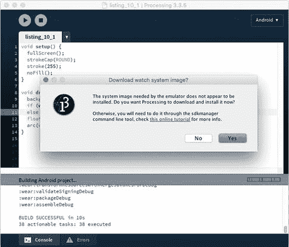

# 十、可穿戴设备

在本章中，我们将使用处理来为 Android 智能手表创建手表面部。我们将讨论在编写智能手表应用时应该考虑的可穿戴设备的具体功能和限制。

## 从活动追踪器到智能手表

尽管我们在考虑移动开发时可能会首先想到手机和平板电脑，但自 2009 年推出健身追踪器(如 Fitbit)以来，可穿戴设备已经出现在许多人的生活中，最近这种设备的列表已经扩展到包括苹果和几家安卓制造商的数字智能手表。随着传感器技术的快速发展和电子元件尺寸的减小，这些设备能够执行广泛的功能，而不仅仅是计数步数和心跳。事实上，2017 款智能手表拥有许多与智能手机相同的功能(2D 和 3D 图形、触摸屏、位置和移动传感器、Wi-Fi 连接)。

Android 平台通过 Android 操作系统的 Wear 版本为所有这些设备提供支持。运行 Android Wear 1.x 的设备需要与运行 Android 4.3 或更高版本的 Android 手机配对，才能启用可穿戴设备中的所有功能(例如，显示来自手机的电子邮件和消息通知)，而运行 Wear 2.x 的手表可以运行独立的应用，不需要将手表与手机配对。Android 平台上的穿戴应用( [`https://developer.android.com/training/wearables/apps/index.html`](https://developer.android.com/training/wearables/apps/index.html) )可以访问手表的传感器和图形。手表脸是一种特殊的佩戴应用，作为手表的背景运行，与手机和平板电脑上的动态壁纸没有什么不同。它们旨在显示时间和其他相关信息，如身体活动。

Android 的处理目前允许我们在 Android 智能手表上运行草图作为手表表面，但不能作为一般的穿戴应用。前几章讨论的所有绘图、交互和传感 API 都适用于手表表面，只需增加一些功能来处理智能手表的独特功能。

Note

Android mode 4.0 版本可用于为运行 Android Wear 2.0 或更高版本的智能手表创建手表面部。它不支持 Wear 1.x 设备。

### 智能手表

一些制造商提供 Android 智能手表，因此有各种不同规格和风格的型号。图 10-1 展示了 Android 手表的一小部分选择。


图 10-1。

A selection of Android smartwatches, from left to right: Sony Smartwatch 3, Moto 360, LG Watch Urbane, Polar M600

尽管手表种类繁多，但所有的手表都必须符合技术规格的最低标准。为 Android Wear 1 . x 版本发布的手表具有(圆形或方形)显示器，密度在 200 到 300 dpi 之间(因此，属于 hdpi 范围)，Wi-Fi 和蓝牙连接，加速度计，陀螺仪，通常还有心率传感器，4 GB 的内部存储，以及长达两天的混合使用电池寿命(完全活动模式与节省电池的“环境”模式)。正如本章介绍中提到的，鉴于 Wear 2.x 设备的自主性增加，Wear 2.0 将鼓励手表配备更多传感器、更高的显示密度和更长的电池寿命。

Note

Wear 1.x 和 2.x 之间的一个重要区别是，对于前者，手表总是需要与智能手机配对才能发挥全部功能(即显示信息，提供位置)，但对于后者，它们可以完全自主工作，并运行与为手机设计的应用一样强大的应用。

## 运行手表表面草图

正如我们可以在实际设备或模拟器上运行常规应用的处理草图一样，我们也可以在手表或模拟器上运行我们的手表表面草图。在物理设备上调试的过程通常更方便，因为仿真器通常更慢，并且无法模拟我们可能需要的所有传感器数据，以便调试我们的手表表面，但仿真器允许我们测试各种显示配置，并且如果我们还没有 Android 手表，可以运行我们的手表表面。

### 使用手表

要在 Android 手表上运行处理草图，我们首先需要在手表上启用“开发者选项”，如下所示:

1.  打开手表上的设置菜单。
2.  滚动到菜单底部，选择“系统|关于”
3.  轻按内部版本号七次。
4.  从“设置”菜单中，选择“开发人员选项”
5.  确认“ADB 调试”已启用。

一旦我们启用了开发者选项，我们必须在两个选项之间进行选择，以便在 Wear 2.x 手表上运行和调试我们的手表表面草图:Wi-Fi 和蓝牙。谷歌关于调试 Wear 应用的开发者指南详细介绍了所有细节( [`https://developer.android.com/training/wearables/apps/debugging.html`](https://developer.android.com/training/wearables/apps/debugging.html) )，我们现在来回顾一下最重要的步骤。

使用蓝牙时，手表必须与手机配对。首先，我们需要在两台设备上启用蓝牙调试。在手表上，我们通过打开“设置|开发者选项”并启用“蓝牙调试”来实现这一点在手机上，我们打开 Android Wear 伴侣应用，点击它的设置图标，然后启用“通过蓝牙调试”一旦我们完成了所有这些，处理器就应该能够通过与手机的蓝牙配对连接到手表。

Note

如果手表通过蓝牙与手机配对，并且该手机是唯一通过 USB 连接到电脑的设备，则处理将能够自动连接到手表。但如果有多部手机，就需要用 adb 命令```java `./adb -s ID forward tcp:4444 localabstract:/adb-hub``手动连接手表，提供手表配对的手机 ID，然后使用命令`` adb connect 127.0.0.1:4444``。

就 Wi-Fi 而言，我们运行处理的电脑和手表必须连接到同一个网络。然后，我们需要在手表上启用 Wi-Fi 调试，方法是进入“设置|开发者选项”并启用“通过 Wi-Fi 调试”稍后，手表将显示其 IP 地址(如 192.168.1.100)。一旦我们获得了手表的 IP 地址，我们将打开一个终端。从那里，我们将切换到 Android SDK 内的`platform-tools`文件夹，并运行命令``` `adb connect 192.168.1.100``，如图 10-2 所示。


图 10-2。

Connecting to a watch over Wi-Fi from the command line

一旦我们通过 Wi-Fi 或蓝牙连接了手表，我们应该会在 Android 菜单下的设备列表中看到它。此外，我们必须确保选择“手表表面”选项，因为加工不允许我们在手表上运行其他草图类型(图 10-3 )。


图 10-3。

Enabling running sketches as watch faces and listing a connected watch

通过蓝牙或 Wi-Fi 连接到我们的手表后，我们可以按照清单 10-1 运行一个动画手表表面。

```java
void setup() {
  fullScreen();
  strokeCap(ROUND);
  stroke(255);
  noFill();
}

void draw() {
  background(0);
  if (wearAmbient()) strokeWeight(1);
  else strokeWeight(10);
  float angle = map(millis() % 60000, 0, 60000, 0, TWO_PI);
  arc(width/2, height/2, width/2, width/2, 0, angle);
}

Listing 10-1.Simple Animated Watch Face

```

在 Processing 将草图作为观察面安装到设备上之后，我们必须选择它作为活动观察面。为此，向左滑动屏幕以访问最喜爱的手表面孔列表。如果我们的没有出现在这个列表中，点击列表最右端的“添加更多的手表面孔”，你应该会在那里找到草图，可能在其他可用的手表面孔中。首先在那里选择它，一旦它被添加到收藏列表，你可以点击它设置为当前背景。输出将如图 10-4 所示。


图 10-4。

Output of the animated watch face example

请注意，表盘不会一直看起来像这个图中的样子。几秒钟后，手表将进入环境模式，显示每分钟更新一次。此模式的目的是在我们不看手表时节省电池电量。一旦手表检测到(使用其加速度计)转动手腕看时间的典型手势，它将返回到交互模式。谷歌的开发者指南建议在环境模式下将大部分屏幕设置为黑色背景，并用细白线绘制剩余的图形元素。正如我们在代码中看到的，处理过程给了我们`wearAmbient()`函数来检测手表是否处于环境模式，并相应地更新图形。

### 使用模拟器

我们在第一章中看到，为了在模拟器中运行手机 Android 虚拟设备(AVD ),我们应该安装一个系统映像。我们还看到，我们必须决定是否要使用 ARM 或 x86 映像。要使用带有 watch faces 的模拟器，我们需要安装一个单独的 watch AVD 供模拟器使用。我们第一次在仿真器中运行手表表面草图时，会看到一个对话框要求我们下载手表系统映像(图 10-5 )，然后是 ARM/x86 选择。一旦镜像(以及 x86 镜像的 HAXM 软件，正如我们在第一章中所讨论的)被下载并安装，处理会将草图复制到仿真器中，并在草图作为表盘成功安装后通知我们。



图 10-5。

Downloading the watch system image

就像实际设备一样，我们需要选择我们的手表表面，以便将其设置为当前背景，这可以通过我们之前看到的相同系列步骤来完成，如图 10-6 所示:将手表表面添加到收藏夹列表，然后从该列表中选择它。


图 10-6。

Selecting a watch face in the emulator

默认处理创建一个分辨率为 280 × 280 的方形手表 AVD。然而，在第三章中，我们了解到我们可以用 avdmanager 命令行工具创建其他 avd。只要我们在正确的端口上使用仿真器工具启动这些 avd，处理就会在这些 avd 上运行我们的草图。例如，让我们用`"wear_round_360_300dpi"`设备定义创建一个圆形手表 AVD，并在端口 5576 上启动它，这样我们就可以在处理中使用它。这样做的命令如图 10-7 所示(创建 AVD 后，记得将`skin`参数添加到其`config.ini`文件中，正如我们在第三章中看到的)。图 10-8 显示了在 round watch AVD 中运行我们的草图所得到的仿真器。


图 10-8。

Running our watch face sketch in the custom AVD


图 10-7。

Creating and launching a custom watch AVD

### 显示时间

显示时间是手表的基本功能之一，通过处理，我们能够创建任何我们可以想象的时间的可视化表示。Processing 提供了许多函数来获取当前的时间和日期— `year()`、`month()`、`day()`、`hour()`、`minute()`和`second()`—这将允许我们生成自己的时间可视化。作为一个基本的例子，在清单 10-2 中，我们用文本显示时间。

```java
void setup() {
  fullScreen();
  frameRate(1);
  textFont(createFont("Serif-Bold", 48));
  textAlign(CENTER, CENTER);
  fill(255);
}

void draw() {
  background(0);
  if (wearInteractive()) {
    String str = hour() + ":" + nfs(minute(), 2) + ":" + nfs(second(), 2);
    text(str, width/2, height/2);
  }
}

Listing 10-2.Displaying the Time as Text

```

注意我们使用了`frameRate(1)`。因为我们显示的时间精确到秒，所以不需要以更高的帧速率运行草图，这也有助于节省电池。`nfs()`函数方便地在数字的右边加零，所以得到的字符串总是有两位数。最后，`wearInteractive()`简单地返回与`wearAmbient()`函数相反的函数，我们在第一个 watch face 中使用了这个函数。

### 计算步数

我们可以通过 Android API 或 Ketai 库，使用与前几章相同的技术访问手表中的传感器。我们将在第十二章研究身体感应的可能性，但在这里的清单 10-3 中，我们展示了一个使用 Android sensor API 的简单计步器示例。

```java
import android.content.Context;
import android.hardware.Sensor;
import android.hardware.SensorManager;
import android.hardware.SensorEvent;
import android.hardware.SensorEventListener;

Context context;
SensorManager manager;
Sensor sensor;
SensorListener listener;

int offset = -1;
int steps;

void setup() {
  fullScreen();
  frameRate(1);
  Context context = (Context) surface.getComponent();
  manager = (SensorManager)context.getSystemService(Context.SENSOR_SERVICE);
  sensor = manager.getDefaultSensor(Sensor.TYPE_STEP_COUNTER);
  listener = new SensorListener();
  manager.registerListener(listener, sensor, SensorManager.SENSOR_DELAY_NORMAL);
  textFont(createFont("SansSerif", 40 * displayDensity));
  textAlign(CENTER, CENTER);
  fill(255);
}

void draw() {
  background(0);
  if (wearInteractive()) {
    String str = steps + " steps";
    float w = textWidth(str);
    text(str, width/2, height/2);
  }
}

void resume() {
  if (manager != null)
    manager.registerListener(listener, sensor,
                             SensorManager.SENSOR_DELAY_NORMAL);
}

void pause() {
  if (manager != null) manager.unregisterListener(listener);
}

class SensorListener implements SensorEventListener {
  public void onSensorChanged(SensorEvent event) {
    if (offset == -1) offset = (int)event.values[0];
    steps = (int)event.values[0] - offset;
  }
  public void onAccuracyChanged(Sensor sensor, int accuracy) { }
}

Listing 10-3.Simple Step Counter

```

由于计步传感器(它不是实际的硬件传感器，而是一个“衍生”传感器，使用来自加速度计的信息来计算步数)返回的值是从手表启动时开始累积的，因此我们存储第一个值，从特定表盘打开的那一刻开始计数。

## 智能手表设计

使用 Processing 的绘图 API 来创建手表表面，结合上下文和传感器数据，为时间的表示开辟了无数方向。智能手表显示屏的有限尺寸在视觉设计和信息密度方面带来了挑战。我们将在接下来的两章中更深入地探讨这些挑战。

谷歌官方开发者网站包括一个专门关于表盘设计的部分( [`https://developer.android.com/design/wear/watchfaces.html`](https://developer.android.com/design/wear/watchfaces.html) )，它提供了一些关于设计概念和语言的有用指导，以及如何处理智能手表特有的方面。

### 屏幕形状和插图

要考虑的第一个重要方面是使表盘的图形适应圆形和方形显示屏，以便我们的视觉设计在两种情况下都能有效工作。

Note

即使显示器是圆形的，宽度和高度值也是指显示器沿水平和垂直方向的最大范围。

您可以通过调用`wearRound()`或`wearSquare()`函数来确定屏幕的形状，对于圆形/方形屏幕，这些函数将返回 true，否则返回 false，如清单 10-4 所示。

```java
void setup() {
  fullScreen();
  if (wearSquare()) rectMode(CENTER);
}

void draw() {
  background(0);
  if (wearAmbient()) {
    stroke(255);
    noFill();
  } else {
    noStroke();
    fill(255);
  }
  float scale = map(second(), 0, 59, 0, 1);
  if (wearRound()) {
    ellipse(width/2, height/2, scale * width, scale * width);
  } else {
    rect(width/2, height/2, scale * width, scale * height);
  }
}

Listing 10-4.Adjusting Graphics to the Screen Shape

```

然而，如果我们在屏幕底部有插图(或“下巴”)的设备(如 Moto 360)上运行清单 10-4 中的草图，我们会注意到圆圈相对于手表的边框是偏心的，即使它相对于显示屏本身是居中的(图 10-9 )。


图 10-9。

“Chin” in a Moto 360 smartwatch. Graphics centered at the screen center (left), and translated by half of the bottom inset to properly center them with respect to the bezels

在这些情况下，我们可以使用 wearInsets()函数正确地将草图居中。该函数返回一个对象，该对象包含显示器周围的嵌入边框:`top`、`bottom`、`left`和`right`。对于下巴较低的设备，我们只需要添加调用`translate(0, wearInsets().bottom/2)`来使图形相对于边框中心居中，尽管代价是修剪图形的下部(清单 10-5 )。

```java
void setup() {
  fullScreen();
  if (wearSquare()) rectMode(CENTER);
}

void draw() {
  background(0);
  if (wearAmbient()) {
    stroke(255);
    noFill();
  } else {
    noStroke();
    fill(255);
  }
  translate(0, wearInsets().bottom/2);
  float scale = map(second(), 0, 59, 0, 1);
  if (wearRound()) {
    ellipse(width/2, height/2, scale * width, scale * width);
  } else {
    rect(width/2, height/2, scale * width, scale * height);
  }
}

Listing 10-5.Watch Face Insets

```

### 观看面孔预览图标

除了我们在第三章讨论的常规应用图标，Android 还需要一组预览图标来显示选择列表中的手表表面。常规图标将用于 UI 的其他部分，如应用信息和卸载菜单。

由于手表可以是圆形或方形，我们只需要提供两个预览图标:一个用于圆形表壳(分辨率为 320 × 320)，另一个用于方形表壳(分辨率为 280 × 280)。这两个图标都需要复制到草图的文件夹中，并且它们必须有名称`preview_circular.png`和`preview_rectangular.png`。

图 10-10 显示了预览图标，注意圆形预览中的红色部分将不可见。将草图导出为已签名的包时，在所有八个图标(六个常规的 ldpi、mdpi、hdpi、xhdpi、xxhdpi 和 xxxhdpi 分辨率图标和两个预览图标)都包含在草图文件夹中之前，处理不会让我们完成导出。


图 10-10。

Preview images for round (left) and square (right) devices. The red portion in the round preview will be ignored.

## 摘要

在关于 Android 智能手表的第一章中，我们学习了可穿戴设备和应用的基础知识，以及如何为这些新颖的设备创建手表外观。我们还详细研究了将处理连接到实际手表或仿真器所需的设置，以测试我们在不同显示器配置下的表盘草图。