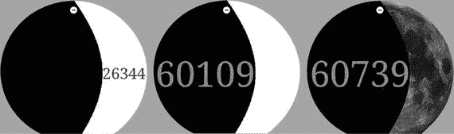

# 十一、可视化时间

显示时间是手表的主要功能之一，在这一章中，我们将学习如何应用 Processing 的绘图 API 来实验不同的时间可视化表示。

## 从日晷到智能手表

时间的视觉表现可以追溯到文明的开端，那时日晷被用来记录白天的时间。自 16 世纪以来，机械表和后来更小的手表一直在使用。在过去几十年的数字时代，具有多种功能的电子表开始流行。用于测量和显示时间的机器的悠久历史(图 11-1 )为我们提供了丰富的技术和文化背景，让我们可以从智能手表提供的几乎无限的可能性中汲取灵感或重新诠释。


图 11-1。

From left to right: Sundial at the Imperial Palace in Beijing (eighth century BC); design for a ring watch, from Livre d'Aneaux d'Orfevrerie (1561); a late Victorian silver open-faced pocket watch (c.1890), Casio DBC 600 digital calculator watch (1985)

虽然我们已经可以在谷歌 Play 商店上找到数千种不同的表盘，但其中许多都将模拟概念转化为非常逼真的数字表现。这是一种有效的方法，但是数字画布也允许我们以完全原创的方式来表现时间。图 11-2 展示了一些 Android 手表表盘的例子，这些都可以在谷歌 Play 商店上找到，展示了一些有趣的想法，从凝视用户的眼睛、抽象图案和代表时间流逝的古怪动画，到通过使用数字变焦对模拟手表表盘的重新诠释。


图 11-2。

From left to right: Gaze Effect (by Fathom Information Design); Waves (by ustwo); Space and Time (by Geng Gao); and Spotlight (by Maize) Note

为了截图一个表脸，我们可以使用 Android SDK 中的 adb 工具。首先，将屏幕截图保存到手表上的一个图像文件:``adb -s 127.0.0.1:4444 shell screencap -p /sdcard/screenshot.png``。然后，将生成的图像下载到电脑:``adb -s 127.0.0.1:4444 pull -p /sdcard/screenshot.png``。我们也可以使用第三方图形工具来使这个过程变得更加容易，就像 Mac 的 Android 工具: [`https://github.com/mortenjust/androidtool-mac`](https://github.com/mortenjust/androidtool-mac) 。

### 用时间来控制运动

处理包括一个时间 API，它允许我们获取当前的时间和日期。让我们从使用小时、分钟和秒来控制一个简单的动画开始。如果我们要处理模拟概念的数字实现，例如旋转指针，时间和角度值之间的转换相当简单:我们可以在它们各自的范围之间映射值；例如，分和秒在 0 到 60 之间，角度在 0 到`TWO_PI` (2π)之间。清单 11-1 展示了这种映射。

```java
void setup() {
  noStroke();
  strokeWeight(2);
}

void draw() {
  background(0);

  float hAngle = map(hour() % 12, 0, 12, 0, TWO_PI);
  float mAngle = map(minute(), 0, 60, 0, TWO_PI);
  float sAngle = map(second(), 0, 60, 0, TWO_PI);

  translate(width/2, height/2 + wearInsets().bottom/2);
  fill(ambientMode ? 0 : #F0DB3F);
  ellipse(0, 0, width, width);
  drawLine(hAngle, width/2);

  fill(ambientMode ? 0 : #FFB25F);
  ellipse(0, 0, 0.75 * width, 0.75 * width);
  drawLine(mAngle, 0.75 * width/2);

  fill(ambientMode ? 0 : #ED774D);
  ellipse(0, 0, 0.5 * width, 0.5 * width);
  drawLine(sAngle, 0.5 * width/2);

  fill(0);
  ellipse(0, 0, 0.25 * width, 0.25 * width);    
}

void drawLine(float a, float r) {
  pushStyle();
  stroke(wearAmbient() ? 255 : 0);
  pushMatrix();
  rotate(a);
  line(0, 0, 0, -r);
  popMatrix();
  popStyle();
}

Listing 11-1.Concentric Circles for Seconds, Minutes, and Hours

```

该草图的输出(图 11-3 )是三个同心圆，其中的线对应时针、分针和秒针。由于线条是从屏幕中心向上画出的，这是模拟手表中的典型参考位置，因此可以在 0 和`TWO_PI`之间直接旋转。


图 11-3。

Concentric circles watch face

一旦我们在设备或模拟器上运行这个手表表面，我们可以注意到指针的动画不流畅。最里面的圆从一秒跳到下一秒，因为我们没有在两个连续的秒之间插入中间角度。这个问题的一个解决方案是使用`millis()`函数，该函数返回草图开始运行以来经过的毫秒数。我们可以计算连续的`millis()`调用之间的差异，以计算两个时间点之间的毫秒差异，然后使用该值创建更平滑的动画。

更具体地说，如果我们在之前的草图中添加两个新变量，比如说`s0`和`m0`，我们就可以跟踪秒的值发生变化的时刻(要么递增 1，要么重置为零)，存储该特定时刻的毫秒数，然后用它来计算每个连续时刻我们所处的秒的分数。事实上，做起来比说起来容易，清单 11-2 显示了我们之前的草图中使这个工作的增加。

```java
void draw() {
  background(0);

  int h = hour() % 12;
  int m = minute();
  int s = second();

  if (s0 != s) {
    m0 = millis();
    s0 = s;
  }
  float f = (millis() - m0)/1000.0;

  float sf = s + f;
  float mf = m + sf/60.0;
  float hf = h + mf/60.0;

  float hAngle = map(hf, 0, 12, 0, TWO_PI);
  float mAngle = map(mf, 0, 60, 0, TWO_PI);
  float sAngle = map(sf, 0, 60, 0, TWO_PI);
  ...
}

Listing 11-2.
Concentric Circles

with Second Animation

```

`sf`、`mf`和`hf`变量是十进制的秒、分和小时值，我们可以像以前一样将它们映射到角度范围，这将导致连续旋转。

### 方形和圆形表盘

Android 智能手表可以有方形或圆形框架，我们需要确保我们的表盘设计可以同时适用于这两种框架，或者如果我们优先考虑其中一个，我们仍然应该提供另一个的可用体验。圆形手表比方形手表更受欢迎，或者相反，是手表 UI 设计中的一个有争议的话题:“以我的经验来看，圆形面手表比方形面手表卖得好。我不知道这到底是为什么。。。。很可能纯粹是心理作用。人们对钟表应该是什么样子的语义观念”( [`https://www.wareable.com/smartwatches/round-v-square-smartwatches-which-is-best`](https://www.wareable.com/smartwatches/round-v-square-smartwatches-which-is-best) )。在相反的一端:“我认为这一轮的日子屈指可数。我们低估了人们适应新事物、新模式的能力。我认为使用更方形手表的体验会让人们在使用两者时更有意义，他们会改变主意”( [`https://birchtree.me/blog/data-is-square/`](https://birchtree.me/blog/data-is-square/) )。

无论哪种格式最终更受欢迎，Android 都支持这两种格式，这取决于我们提出考虑方形和圆形手表的设计。作为这个问题的一个例子，让我们继续一个简单的方形表盘设计:一个有 24 个正方形的矩形网格，分成 6 行 4 列。每个方块对应一个小时，已经过去的小时完全变灰，当前小时变灰到当前分钟给出的百分比。清单 11-3 展示了这种设计的实现。

```java
void setup() {
  textFont(createFont("Monospaced", 15 * displayDensity));
  textAlign(CENTER, CENTER);
  noStroke();
}

void draw() {
  background(0);
  int h = hour();
  int m = minute();
  float cellW = 0.9 * width/4.0;
  float cellH = 0.9 * height/6.0;
  translate(0.05 * cellW, 0.05 * cellH + wearInsets().bottom/2);
  for (int n = 0; n < 24; n++) {
    int i = n % 4;
    int j = n / 4;
    float x = map(i, 0, 4, 0, width);    
    float y = map(j, 0, 6, 0, height);
    float w = n == h ? map(m, 0, 60, 0, cellW) : cellW;

    if (!wearAmbient()) {
      fill(#578CB7);
      rect(x, y, cellW, cellH);    
    }

    fill(255);
    text(str(n), x, y, cellW, cellH);    

    if (n <= h) {        
      fill(0, 170);
      rect(x, y, w, cellH);
    }
  }
}

Listing 11-3.Rectangular Hour Grid

```

因为在这个界面中，我们正在处理文本，所以我们创建了一个等宽字体，其大小由系统变量`displayDensity`缩放，正如我们在前面章节中所做的那样，以确保文本在具有不同 dpi 的设备上的外观一致。Android 手表的屏幕分辨率通常在 300 到 400 像素之间，但由于屏幕较小，DPI 通常在 xhdpi 范围内(∼320dpi)。

这种设计显然不适用于圆脸手表。我们可以将这个矩形网格替换为极坐标网格，但是在这种情况下，每个单元格的大小都不同，如图 11-4 的左图所示，并且实现对应于当前小时的部分灰色单元格也更加困难。另一种选择是仍然使用矩形网格，这次是 6 × 6，并移除完全或大部分在外接圆之外的六个角单元(图 11-4 中的右图)。


图 11-4。

Adapting a 6 × 4 rectangular grid to fit inside a round watch face, either as a polar grid (left) or as a larger 6 × 6 grid with some elements removed (right)

这里的选项将取决于所需的视觉效果，在某些情况下，极坐标网格可能是更好的选择，而修剪矩形网格可能是其他情况。因为我们的首要任务是保持所有元素的大小相同，所以我们选择了后一个选项，如清单 11-4 所示。

```java
import java.util.Arrays;
import java.util.List;
List<Integer> corners = Arrays.asList(1, 2, 5, 6, 7, 12, 25,
                                      30, 31, 32, 35, 36);

void setup() {
  textFont(createFont("Monospaced", 15 * displayDensity));
  textAlign(CENTER, CENTER);
  noStroke();
}

void draw() {
  background(0);
  int h = hour();
  int m = minute();
  float cellW = 0.9 * width/6.0;
  float cellH = 0.9 * height/6.0;
  translate(0.05 * cellW, 0.05 * cellH + wearInsets().bottom/2);
  int n = 0;  
  for (int n0 = 0; n0 < 36; n0++) {
    if (corners.contains(n0 + 1)) continue;

    int i = n0 % 6;
    int j = n0 / 6;
    float x = map(i, 0, 6, 0, width);
    float y = map(j, 0, 6, 0, height);
    float cw = n == h ? map(m, 0, 60, 0, cellW) : cellW;

    if (!wearAmbient()) {
      fill(#578CB7);
      rect(x, y, cellW, cellH);    
    }

    fill(255);
    text(str(n), x, y, cellW, cellH);

    if (n <= h) {
      fill(0, 170);
      rect(x, y, cw, cellH);
    }
    n++;
  }
}

Listing 11-4.Rectangular Grid for a Circular Watch

```

从清单 11-3 和 11-4 中可以看到这两个表盘草图的输出，如图 11-5 所示。两个草图的代码可以合并成一个单独的表盘草图，根据`wearRound()`或`wearSquare()`函数返回的值选择合适的可视化。


图 11-5。

Hour grid for square (left) and round (right) watches

## 运用表盘概念

打造表盘需要平衡几个因素。正如本章开头提到的，有一种既定的视觉语言，是人们在交流时间时所期望的。智能手表给了我们充分的空间来扩展这种现有的语言，并提出全新的概念。此外，手表面孔可以是交互式的、可配置的，并增加了附加信息(身体活动、日历事件等)。谷歌( [`https://www.google.com/design/spec-wear/patterns/interactive-watch-faces.html`](https://www.google.com/design/spec-wear/patterns/interactive-watch-faces.html) )的设计指南中涵盖了其中一些考虑因素，但实验可以让我们产生显示时间的新想法。

正如我们在书中的早期项目中看到的，视觉设计的一个基本方法是草图和迭代，这对于设计表盘来说仍然是正确的。一个概念可能是新颖的和有吸引力的，但是它不太可能在第一次实现时就成功。在接下来的部分中，我们将通过多次迭代来实现一个概念，直到达到最终版本。

### 已用/剩余时间

这款表盘的概念与其说是作为一款功能性时计，不如说是提醒人们从一天开始到结束所经过的时间。为了强调这种进展，我们可以用从午夜开始的总秒数来测量时间，显示它从零开始和向零的连续变化。

作为这一过程的视觉表现，上弦的新月可以作为白天缩短的隐喻(图 11-6 )。当然，这不是唯一可能的视觉表现(有人可能会说这会误导用户认为表盘显示的是月亮的实际相位)，但这足以作为我们的第一个设计。


图 11-6。

Crescent moon

贝塞尔曲线通过用包含暗区边缘的形状部分覆盖一个椭圆来创建上蜡新月的形状是很方便的，如图 11-7 所示。


图 11-7。

Drawing a waxing crescent moon with Bezier curves

随着经过的秒数从 0 增加到 86，400 (24 × 60 × 60)，形状顶部和底部的贝塞尔曲线的控制向量开始指向屏幕的左侧(图 11-7 的左侧面板)，并逐渐旋转指向另一侧(右侧面板)。因此，我们可以将秒映射到从`PI`到 0 的角度值，然后使用这个值来旋转控制点。

清单 11-7 中的代码实现了这一想法，并将剩余的秒数显示为文本，根据可见月牙形中的剩余空间进行缩放。

```java
int totSec = 24 * 60 * 60;
PFont font;

void setup() {
  font = createFont("Serif", 62);
  textAlign(LEFT, CENTER);  
}

void draw() {
  background(0);  
  int sec = 60 * 60 * hour() + 60 * minute() + second();
  float a = map(sec, 0, totSec, PI, 0);
  float x = map(sec, 0, totSec, 0, width);  
  float r = sec < totSec/2 ? map(sec, 0, totSec/2, 90, 50) :
                             map(sec, totSec/2, totSec, 50, 90);

  int t = totSec - sec;  
  String strt = str(t);
  int n = strt.length();
  float d = (width - x) / n;
  textFont(font, 1.75 * d);

  float rad = 0.5 * width;
  float diam = width;
  if (wearAmbient()) {
    fill(255);
    text(strt, x, rad);
  } else {
    fill(255);
    ellipse(rad, rad, diam, diam);
    noStroke();
    fill(0);
    beginShape();
    vertex(0, 0);
    vertex(rad, 0);
    float cx = r * cos(a);
    float cy = r * sin(a);
    bezierVertex(rad + cx, cy, x, rad - r, x, rad);
    vertex(x, rad);
    bezierVertex(x, rad + r, rad + cx, diam - cy, rad, diam);
    vertex(0, diam);
    endShape(CLOSE);

    fill(0, 170);
    text(strt, x, rad);
  }  
}

Listing 11-5.Moon Watch Face

```

在这段代码中，我们为表盘上的数字创建了一个大字体。由于这些数字会随着月牙中可用空间的增长和收缩而改变大小，因此我们将原始字体大小设置为最大可能值(在本例中为 62 像素)，以便文本在使用 textFont(font，1.75 * d)调整大小后看起来很好。请记住，当我们创建特定大小的字体，然后为绘图设置更大的尺寸时，文本会看起来模糊。

### 添加交互

Watch faces 可以通过触摸屏接收触摸事件，就像手机和平板电脑上的常规应用一样。同样，我们可以使用`mousePressed()`和`mouseReleased()`函数来处理这些事件。然而，watch faces 不支持拖动事件，因为这些事件由 Android 系统捕获，以驱动滑动，从而访问 watch UI 中的不同菜单。也不支持多点触摸事件。

鉴于手表屏幕的尺寸较小，触摸事件通常意味着在表盘上的不同视图之间切换，而不是使用与触摸相关的 x 和 y 坐标来驱动精确的交互。对于我们的表盘，我们可以使用一个简单的触摸来切换显示经过的时间和剩余的秒数。清单 11-6 显示了包括新的交互处理在内的全部代码。

```java
int totSec = 24 * 60 * 60;
boolean showElapsed = false;
PFont font;

void setup() {
  font = createFont("Serif", 62);
  textAlign(LEFT, CENTER);  
}

void draw() {
  background(0);  
  int sec = 60 * 60 * hour() + 60 * minute() + second();
  float a = map(sec, 0, totSec, PI, 0);
  float x = map(sec, 0, totSec, 0, width);  
  float r = sec < totSec/2 ? map(sec, 0, totSec/2, 90, 50) :
                             map(sec, totSec/2, totSec, 50, 90);

  int t = showElapsed ? sec : totSec - sec;  
  String strt = str(t);
  int n = strt.length();
  float d = showElapsed ? x / n : (width - x) / n;
  textFont(font, 1.75 * d);

  float rad = 0.5 * width;
  float diam = width;
  if (wearAmbient()) {    
    fill(255);
    text(strt, x, rad);    
  } else {
    fill(255);
    ellipse(rad, rad, diam, diam);
    noStroke();
    fill(0);
    beginShape();
    vertex(0, 0);
    vertex(rad, 0);
    float cx = r * cos(a);
    float cy = r * sin(a);
    bezierVertex(rad + cx, cy, x, rad - r, x, rad);
    vertex(x, rad);
    bezierVertex(x, rad + r, rad + cx, diam - cy, rad, diam);
    vertex(0, diam);
    endShape(CLOSE);

    if (showElapsed) fill(255, 170);
    else fill(0, 170);
    text(strt, x, rad);    
  }  
}

void mousePressed() {
  showElapsed = !showElapsed;  
  if (showElapsed) textAlign(RIGHT, CENTER);
  else textAlign(LEFT, CENTER);
}

Listing 11-6.Moon Watch Face with Interaction

```

### 加载/显示图像

watch faces 支持图片的方式与我们之前讨论的常规和壁纸应用完全相同。我们可以依靠`loadImage()`将图像文件加载到草图中，并依靠`image()`函数将图像显示在屏幕上。在这个功能的帮助下，我们可以在清单 11-7 中完成我们的表盘，以一个实际的月球图像作为背景。图 11-8 中包含有背景图像和没有背景图像的表盘的不同输出。



图 11-8。

Versions of the “moon” watch face showing remaining seconds in the day, elapsed, and moon texture

```java
int totSec = 24 * 60 * 60;
boolean showElapsed = false;
PFont font;
PImage moon;

void setup() {
  moon = loadImage("moon.png");
  font = createFont("Serif", 62);
  textAlign(LEFT, CENTER);  
}

void draw() {
  background(0);
  int sec = 60 * 60 * hour() + 60 * minute() + second();
  float a = map(sec, 0, totSec, PI, 0);
  float x = map(sec, 0, totSec, 0, width);  
  float r = sec < totSec/2 ? map(sec, 0, totSec/2, 90, 50) :
                             map(sec, totSec/2, totSec, 50, 90);

  int t = showElapsed ? sec : totSec - sec;  
  String strt = str(t);
  int n = strt.length();
  float d = showElapsed ? x / n : (width - x) / n;
  textFont(font, 1.75 * d);

  float rad = 0.5 * width;
  float diam = width;
  if (wearAmbient()) {
    fill(255);
    text(strt, x, rad);    
  } else {
    image(moon, 0, 0, 2*rad, 2*rad);
    noStroke();
    fill(0);
    beginShape();
    vertex(0, 0);
    vertex(rad, 0);
    float cx = r * cos(a);
    float cy = r * sin(a);
    bezierVertex(rad + cx, cy, x, rad - r, x, rad);
    vertex(x, rad);
    bezierVertex(x, rad + r, rad + cx, diam - cy, rad, diam);
    vertex(0, diam);
    endShape(CLOSE);

    if (showElapsed) fill(255, 170);
    else fill(200, 230);
    text(strt, x, rad);    
  }
}

void mousePressed() {
  showElapsed = !showElapsed;  
  if (showElapsed) textAlign(RIGHT, CENTER);
  else textAlign(LEFT, CENTER);
}

Listing 11-7.Moon Watch Face with Background Image

```

在新版表盘中，我们做了一个小小的改变，就是在剩余的几秒钟内使用不同的颜色。在没有背景图像的版本中，我们使用了深灰色(0，170 ),与白色背景形成了良好的对比。现在，月亮图像太暗了，不能保证文本是可读的，所以我们用颜色值(200，230)切换到更亮的灰色。

## 摘要

在这一章中，我们看了时间显示的表盘。作为本主题的一部分，我们讨论了一些需要注意的问题，首先是使用时间值来实现时间的动态可视化，然后是如何为圆形和方形手表设计，最后是一个例子，说明了迭代在表盘设计中的重要性。这些材质应该为首次涉足该主题提供指导，许多可能性等待着那些有兴趣深入研究表盘发展的人。