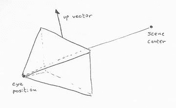

# 13.处理中的 3D

我们的虚拟现实(VR)之旅从介绍 3D 编程和处理的基本概念开始:坐标系、3D 变换、照明、纹理和 3D 形状的创建，我们不仅可以在 VR 应用中应用，还可以在任何需要交互式 3D 图形的情况下应用。

## P3D 渲染程序

VR 应用的开发有一个重要的先决条件:学习如何创建交互式 3D 图形。到目前为止，我们只使用默认或`P2D`渲染器绘制了二维图形。尽管 2D 渲染是 3D 的一个特例，但我们需要熟悉 3D 图形的许多运动和交互方面。

处理包括绘制 3D 场景的渲染器，恰当地称为`P3D`。它支持基本的 3D 功能，如照明和纹理对象，但也支持更高级的功能，如着色器。在`setup()`期间，我们可以通过设置`size()`或`fullScreen()`函数中的渲染器参数来使用`P3D`；例如`size(width, height, P3D)`或`fullScreen(P3D)`。这样做之后，我们不仅可以使用处理中所有可用的 3D 渲染功能，还可以像以前一样继续绘制 2D 图形。

### 3D Hello World

让我们先写一个简单的草图来演示 3D 处理的基础:一个旋转的立方体。清单 [12-1](#Par5) 包括平移和旋转变换，以及默认照明。

```java
float angle = 0;

void setup() {
  fullScreen(P3D);
  fill(#AD71B7);
}

void draw() {
  background(#81B771);
  lights();
  translate(width/2, height/2);
  rotateY(angle);
  rotateX(angle*2);
  box(300);
  angle += 0.01;
}

Listing 13-1.Basic 3D Sketch

```

我们将在随后的章节中更仔细地查看这些功能，但是作为对在`draw()`中发生的事情的概述，我们首先用`lights()`来“打开”一组默认灯光，然后用`translate(width/2, height/2)`将整个场景平移到屏幕的中心，并应用两次旋转，一次用`rotateY(angle)`沿着 y 轴，第二次用`rotateX(angle*2)`沿着 x 轴。就像在 2D 绘画中一样，这些变换会影响我们之后绘制的所有形状，在这个例子中是用`box(300)`绘制的立方体。我们通过增加旋转角度来结束，这样我们就有了连续的动画。图 [13-1](#Fig1) 显示了该草图的输出。


图 13-1。

Simple 3D rendering in Processing

### 照相机

当我们绘制任何 3D 场景时，都有一个“相机”在观察虚拟空间，我们可以将设备的屏幕视为该相机的视口。处理包括一些操作相机的位置和“虚拟”镜头的功能。另一方面，在 VR 草图中，处理相机将由手机在空间中的移动自动控制。在任一情况下，Processing 的摄像机由三个向量定义:眼睛位置、场景中心和“上”向量，如图 [13-2](#Fig2) 所示。



图 13-2。

Vectors defining position and orientation of the camera

这些向量可以使用`camera()`函数设置:camera(eyeX，eyeY，eyeZ，centerX，centerY，centerZ，upX，upY，upZ)。不带任何参数调用`camera()`将设置默认摄像机的位置和方向，其中中心为(0，0，0)点，眼睛沿 z 轴放置，向上方向为正 y 向量。通过不断地改变眼睛的位置，我们可以从任何有利的位置观看场景。清单 [13-2](#Par9) 说明了如何设置这些参数。

```java
void setup() {
  fullScreen(P3D);
  fill(#AD71B7);
}

void draw() {
  background(#81B771);
  float t = millis()/1000.0;
  float ex = width/2 + 500 * cos(t);
  float ey = height/2 + 500 * sin(t);
  float ez = 1000 + 100 * cos(millis()/1000.0);
  camera(ex, ey, ez, width/2, height/2, 0, 0, 1, 0);
  lights();
  translate(width/2, height/2);
  box(300);
}

Listing 13-2.Camera Parameters

```

我们不仅可以设置相机的位置和方向，还可以选择如何将场景投影到相机的视口(可以认为是选择相机的“镜头”)。有两种类型的投影:透视投影和正交投影。如图 [13-3](#Fig3) 所示。透视投影是`P3D`中的默认设置，它对应于图像在物理世界中的形成方式。其中，对象沿着汇聚到视口后面的“眼睛”位置的视线投影到视口平面上。这模拟了透视的效果，远处的物体看起来更小。事实上，处理使用默认的透视参数，因此 z=0 处的尺寸(0，0，宽度，高度)的矩形正好覆盖整个输出窗口。多亏了这些设置，我们可以像以前一样在`P3D`中绘制 2D 图形。


图 13-3。

Perspective (left) and orthographic (right) projections in Processing

另一方面，在正交投影中，对象沿着垂直于它的线被投影到视口，因此当对象远离或靠近摄影机眼时，大小不会减小或增大。处理过程中正交投影的默认设置是，3D 坐标(0，0，z)和(宽度，高度，z)的点正好落在输出窗口的右上角和左下角，而不考虑 z 的值。

我们可以通过`perspective()`和`ortho()`功能轻松地在这两种投影模式之间来回切换。这些函数有刚才描述的默认设置，但是我们也可以使用它们和额外的参数来调整视野、相机眼睛的位置和其他参数:`perspective(fovy, aspect, zNear, zFar)`和`ortho(left, right, bottom, top, near, far)`。在清单 [13-3](#Par13) 中，我们通过余弦函数将视野与时间联系起来，因此它在 10 度(非常窄的视野，物体放大到几乎占据整个屏幕)到 80 度(非常宽，物体看起来比正常情况小)之间来回振荡。

```java
float angle = 0;

void setup() {
  fullScreen(P3D);
  fill(#AD71B7);
}

void draw() {
  background(#81B771);
  float fov = radians(map(cos(millis()/1000.0), -1, +1, 10, 80));
  float ratio = float(width)/height;
  perspective(fov, ratio, 1, 2000);
  lights();
  translate(width/2, height/2);
  rotateY(angle);
  rotateX(angle*2);
  box(300);
  angle += 0.01;
}

Listing 13-3.Perspective Parameters

```

这里需要注意的另外几件事包括宽高比的设置，在大多数情况下应该只是宽度/高度，以及裁剪平面。这些平面通过具有一个近值和一个远值来确定沿 z 方向的可见体积:任何比前者更近或比后者更远的都将被裁剪掉。

Note

`camera()`和`perspective()`功能使用起来并不特别直观，特别是如果你想在物理空间中考虑相机的移动和调整(如缩放、平移和滚动)，但有一些库可以简化相机的操作，其中包括 PeasyCam、obstructive Camera Direction 和 proscene。附录 B 列出了我们可以在 Android 模式下使用的库。

### 即时渲染与保留渲染

在前面的例子中，我们如何处理 3D 场景的一个重要方面是，我们在每一帧中从头开始创建一个新的盒子，然后立即丢弃它。这种绘制 3D(以及 2D)图形的方式称为即时渲染，如果我们的场景中对象相对较少，这种方式就很好，但是如果我们有一个包含许多形状的更复杂的场景，这种方式可能会降低渲染速度。这与我们编写 VR 应用的目标特别相关，因为我们将在下面的章节中进一步讨论，因为渲染动画应该尽可能平滑，以确保观众不会因低或不均匀的帧速率而产生运动病。

Processing 提供了另一种绘制几何图形的方式，称为`retained rendering`，以提高性能。使用保留渲染，我们创建一次形状，然后根据需要多次重画它们。我们已经在第四章中使用了这种技术，在绘制复杂场景时它会更快。保留渲染将在以后使用 VR 时变得非常方便。

使用保留渲染很容易，我们只需要将我们的形状存储在一个`PShape`对象中。处理提供了一些预定义的 3D 形状，比如盒子和球体，它们可以通过一次调用来创建，如清单 [13-4](#Par19) 所示。

```java
float angle = 0;
PShape cube;

void setup() {
  fullScreen(P3D);
  perspective(radians(80), float(width)/height, 1, 1000);
  PImage tex = loadImage("mosaic.jpg");
  cube = createShape(BOX, 400);
  cube.setTexture(tex);
}

void draw() {
  background(#81B771);
  lights();
  translate(width/2, height/2);
  rotateY(angle);
  rotateX(angle*2);
  shape(cube);
  angle += 0.01;
}

Listing 13-4.Using Retained Rendering

```

在这段代码中，一旦我们从`createShape()`函数中获得了多维数据集对象，我们就可以对它进行修改。例如，我们可以对它应用纹理，这样它的表面就被图像“包裹”起来，看起来更有趣。最终输出如图 [13-4](#Fig4) 所示。


图 13-4。

Drawing a textured PShape

在前四个例子中，我们已经应用了大多数基本的 3D 渲染技术(创建形状、应用变换、定义光照和纹理)，我们将在本章的剩余部分更详细地讨论每一个主题。

## 3D 转换

我们有三种类型的 3D 变换:平移(从 A 点移动到 B 点)、旋转(绕轴旋转)和缩放(均匀或沿一个方向收缩或扩张)。清单 [13-5](#Par23) 到 [13-7](#Par27) 分别举例说明了每一个。

```java
void setup() {
  fullScreen(P3D);
  fill(120);
}

void draw() {
  background(157);
  float x = map(cos(millis()/1000.0), -1, +1, 0, width);
  translate(x, height/2);
  box(200);
}

Listing 13-5.Applying a Translation

```

对于旋转，我们需要首先平移到屏幕的中心，因为`box()`函数将立方体放置在(0，0，0)处。

```java
void setup() {
  fullScreen(P3D);
  fill(120);
}

void draw() {
  background(157);
  translate(width/2, height/2);
  rotateY(millis()/1000.0);
  box(200);
}

Listing 13-6.Applying a Rotation

```

对于缩放，类似的观察也适用—我们首先应用平移(width/2，height/2 ),因此框出现在屏幕的中心。

```java
void setup() {
  fullScreen(P3D);
  fill(120);
}

void draw() {
  background(157);
  translate(width/2, height/2);
  float f = map(cos(millis()/1000.0), -1, +1, 0.1, 5);
  scale(f);
  box(200);
}

Listing 13-7.Applying Scaling

```

Note

根据设备的 DPI，所有这些示例中形状的相对大小会有所不同。我们可以使用`densityDisplay`系统常数来放大或缩小它们，这样它们在不同分辨率和大小的屏幕上看起来就一致了。

### 组合转换

前面的例子显示了如何单独使用 3D 变换(尽管在旋转和缩放的情况下，最初是平移到屏幕的中心)。但在大多数情况下，我们需要结合平移、旋转和缩放，通常是通过定义一系列变换，将对象放置在 3D 空间中的所需位置，并具有预期的比例。事实上，可以组合变换来创建非常复杂的运动，需要记住几个“规则”:(1)变换的顺序不能互换(例如，应用旋转然后平移并不等同于先平移后旋转，正如我们在第 [4](04.html) 章中在 2D 绘画的上下文中讨论的那样)；(2)可以用`pushMatrix()`和`popMatrix()`操作一系列转换，用`pushMatrix()`保存当前的转换组合，从而隔离发生在它和匹配的`popMatrix()`之间的附加转换的影响。我们在第 [2](02.html) 章看到了一些这样的例子。

清单 [13-8](#Par31) 显示了变换合成的一个应用，其中的想法是创建一个有多个分段的关节“手臂”并制作动画，我们可以在图 [13-5](#Fig5) 中看到。


图 13-5。

Animated arm with combined 3D transformations

```java
float[] r1, r2;

void setup() {
  fullScreen(P3D);
  noStroke();
  r1 = new float[100];
  r2 = new float[100];
  for (int i = 0; i < 100; i++) {
    r1[i] = random(0, 1);
    r2[i] = random(0, 1);
  }
}

void draw() {
  background(157);
  lights();
  translate(width/2, height/2);
  scale(4);
  for (int i = 0; i < 100; i++) {
    float tx = 0, ty = 0, tz = 0;
    float sx = 1, sy = 1, sz = 1;
    if (r1[i] < 1.0/3.0) {
      rotateX(millis()/1000.0);
      tz = sz = 10;
    } else if (1.0/3.0 < r1[i] && r1[i] < 2.0/3.0) {
      rotateY(millis()/1000.0);
      tz = sz = 10;
    } else {
      rotateZ(millis()/1000.0);
      if (r2[i] < 0.5) {
        tx = sx = 10;
      } else {
        ty = sy = 10;
      }
    }
    translate(tx/2, ty/2, tz/2);
    pushMatrix();
    scale(sx, sy, sz);
    box(1);
    popMatrix();
    translate(tx/2, ty/2, tz/2);
  }
}

Listing 13-8.Composing 3D Transformations

```

本例中的要点是:首先，我们使用随机数(`r1`和`r2`)来决定在每个关节处，我们围绕哪个轴旋转下一个分段，以及我们沿着哪个轴延伸分段；第二，在两个不同的地方使用`scale()`——在场景居中之后，增加整个手臂的大小，在绘制每个手臂之前，只沿着位移轴，这样片段就可以正确地相互连接。另外，请注意，随机数是在`setup()`中预先计算的，并存储在浮点数组中；否则，几何图形会在帧与帧之间完全改变。

## 三维形状

正如我们在 2D 所做的，我们可以使用处理功能生成原始形状。所有 2D 图元(三角形、椭圆形、矩形和四边形)都可以在 3D 中使用，并增加了两个新的 3D 图元(长方体和球体)。清单 [13-9](#Par34) 将所有这些图元绘制在一张草图中，输出如图 [13-6](#Fig6) 所示。


图 13-6。

2D and 3D primitives rendered with P3D

```java
float[] r1, r2;
void setup() {
  fullScreen(P3D);
}

void draw() {
  background(157);

  translate(width/2, height/2);

  pushMatrix();
  translate(-width/3, -height/4);
  rotateY(millis()/2000.0);
  ellipse(0, 0, 200, 200);
  popMatrix();

  pushMatrix();
  translate(0, -height/4);
  rotateY(millis()/2000.0);
  triangle(0, +150, -150, -150, +150, -150);
  popMatrix();

  pushMatrix();
  translate(+width/3, -height/4);
  rotateY(millis()/2000.0);
  rect(-100, -100, 200, 200, 20);
  popMatrix();

  pushMatrix();
  translate(-width/3, +height/4);
  rotateY(millis()/2000.0);
  quad(-40, -100, 120, -80, 120, 150, -80, 150);
  popMatrix();

  pushMatrix();
  translate(0, +height/4);
  rotateY(millis()/2000.0);
  box(200);
  popMatrix();

  pushMatrix();
  translate(+width/3, +height/4);
  rotateY(millis()/2000.0);
  sphere(150);
  popMatrix();
}

Listing 13-9.2D and 3D Primitives

```

### 自定义形状

我们在第 [4](04.html) 章中看到，可以使用`beginShape()` / `vertex()` / `endShape()`函数，用适当的形状类型(`POINTS`、`LINES`、`TRIANGLES`等)创建自定义形状。).与早期的图元一样，我们为 2D 渲染学习的所有代码都可以在`P3D`中重用，无需任何更改，但现在有可能添加一个 z 坐标。例如，让我们在清单 [13-10](#Par36) 中用`QUADS`和`noise()`函数创建一个高度随机的地形。

```java
void setup() {
  fullScreen(P3D);
}

void draw() {
  background(150);
  lights();
  translate(width/2, height/2);
  rotateX(QUARTER_PI);
  beginShape(QUADS);
  float t = 0.0001 * millis();
  for (int i = 0; i < 50; i++) {
    for (int j = 0; j < 50; j++) {
      float x0 = map(i, 0, 50, -width/2, width/2);
      float y0 = map(j, 0, 50, -height/2, height/2);
      float x1 = x0 + width/50.0;
      float y1 = y0 + height/50.0;
      float z1 = 200 * noise(0.1 * i, 0.1 * j, t);
      float z2 = 200 * noise(0.1 * (i + 1), 0.1 * j, t);
      float z3 = 200 * noise(0.1 * (i + 1), 0.1 * (j + 1), t);
      float z4 = 200 * noise(0.1 * i, 0.1 * (j + 1), t);
      vertex(x0, y0, z1);
      vertex(x1, y0, z2);
      vertex(x1, y1, z3);
      vertex(x0, y1, z4);
    }
  }
  endShape();
}

Listing 13-10.Creating a Custom Shape with QUADS

```

噪波是使用定义网格的顶点的`(i, j)`索引生成的，因此它确保了相邻四边形之间共享的顶点处的高度位移是一致的。我们可以在图 [13-7](#Fig7) 中看到结果。


图 13-7。

Terrain generated with a QUADS shape

### PShape 对象

像我们刚刚做的那样创建一个大的形状可能会导致性能下降，特别是在基本的智能手机上。如果几何图形在草图运行的整个过程中是静态的，我们可以将它存储在一个`PShape`对象中，以便更快地保留渲染，如清单 [13-11](#Par39) 所示。

```java
PShape terrain;

void setup() {
  fullScreen(P3D);
  terrain = createShape();
  terrain.beginShape(QUADS);
  for (int i = 0; i < 50; i++) {
    for (int j = 0; j < 50; j++) {
      float x0 = map(i, 0, 50, -width/2, width/2);
      float y0 = map(j, 0, 50, -height/2, height/2);
      float x1 = x0 + width/50.0;
      float y1 = y0 + height/50.0;
      float z1 = 200 * noise(0.1 * i, 0.1 * j, 0);
      float z2 = 200 * noise(0.1 * (i + 1), 0.1 * j, 0);
      float z3 = 200 * noise(0.1 * (i + 1), 0.1 * (j + 1), 0);
      float z4 = 200 * noise(0.1 * i, 0.1 * (j + 1), 0);
      terrain.vertex(x0, y0, z1);
      terrain.vertex(x1, y0, z2);
      terrain.vertex(x1, y1, z3);
      terrain.vertex(x0, y1, z4);
    }
  }
  terrain.endShape();
}

void draw() {
  background(150);
  lights();
  translate(width/2, height/2);
  rotateX(QUARTER_PI);
  shape(terrain);
}

Listing 13-11.Storing a Custom Shape Inside a PShape

```

我们仍然可以在创建一个`PShape`对象后对其进行修改。例如，清单 [13-12](#Par41) 使用`setVertex()`函数为每一帧中的顶点添加了一些随机位移(设置与清单 [13-11](#Par39) 相同)，因此整个曲面现在是动画的。

```java
...
void draw() {
  background(150);
  lights();
  translate(width/2, height/2);
  rotateX(QUARTER_PI);
  updateShape();
  shape(terrain);
  println(frameRate);
}

void updateShape() {
  float t = 0.0001 * millis();
  int vidx = 0;
  for (int i = 0; i < 50; i++) {
    for (int j = 0; j < 50; j++) {
      float x0 = map(i, 0, 50, -width/2, width/2);
      float y0 = map(j, 0, 50, -height/2, height/2);
      float x1 = x0 + width/50.0;
      float y1 = y0 + height/50.0;
      float z1 = 200 * noise(0.1 * i, 0.1 * j, t);
      float z2 = 200 * noise(0.1 * (i + 1), 0.1 * j, t);
      float z3 = 200 * noise(0.1 * (i + 1), 0.1 * (j + 1), t);
      float z4 = 200 * noise(0.1 * i, 0.1 * (j + 1), t);
      terrain.setVertex(vidx++, x0, y0, z1);
      terrain.setVertex(vidx++, x1, y0, z2);
      terrain.setVertex(vidx++, x1, y1, z3);
      terrain.setVertex(vidx++, x0, y1, z4);
    }
  }
}

Listing 13-12.Modifying a PShape After Creating It

```

然而，通过修改`PShape`对象的所有顶点，我们可能会看到草图的性能恢复到即时渲染的水平。如果我们只修改一些顶点，那么性能仍然比直接渲染要好。

我们可以将不同类型的`PShape`对象作为子对象组合成一个单独的包含`PShape`的对象。处理会将它们作为一个单独的实体一起渲染，这也将导致比直接渲染或作为单独的`PShape`对象绘制更高的帧速率。在清单 [13-13](#Par44) 中，我们使用`loadStrings()`从一个文本文件中读取 1000 个点的 3D 坐标，然后将它们绘制成方框或球体。

```java
PVector[] coords;
PShape group;

void setup() {
  fullScreen(P3D);
  textFont(createFont("SansSerif", 20 * displayDensity));
  sphereDetail(10);
  group = createShape(GROUP);
  String[] lines = loadStrings("points.txt");
  coords = new PVector[lines.length];
  for (int i = 0; i < lines.length; i++) {
    String line = lines[i];
    String[] valores = line.split(" ");
    float x = float(valores[0]);
    float y = float(valores[1]);
    float z = float(valores[2]);
    coords[i] = new PVector(x, y, z);
    PShape sh;
    if (random(1) < 0.5) {
      sh = createShape(SPHERE, 20);
      sh.setFill(#E8A92A);
    } else {
      sh = createShape(BOX, 20);
      sh.setFill(#4876B2);
    }
    sh.translate(x, y, z);
    sh.setStroke(false);
    group.addChild(sh);
  }
  noStroke();
}

void draw() {
  background(255);
  fill(0);
  text(frameRate, 50, 50);
  fill(255, 0, 0);
  lights();
  translate(width/2, height/2, 0);
  rotateY(map(mouseX, 0, width, 0, TWO_PI));
  shape(group);
}

Listing 13-13.Creating a Group Shape

```

我们对该代码应用了一些优化技巧以降低场景的复杂性:我们将球体细节设置为 10(默认为 30)并禁用笔划。尤其是笔画线会给形状增加很多额外的几何图形，从而降低渲染速度。最终的结果应该看起来像图 [13-8](#Fig8) ，即使在低端手机上也有合理的性能(fps > 40)。


图 13-8。

Group shape containing shapes of different kinds Note

3D 中的性能由几个因素控制，但最重要的因素之一是场景中的总顶点数。重要的是我们不要给场景添加不必要的顶点，记住用户会在一个(相对)小的屏幕上看到我们的草图。其他优化，如使用 PShapes 存储静态几何，也有助于保持高帧速率。

### 加载 OBJ 形状

OBJ 文件格式( [`http://paulbourke.net/dataformats/obj/`](http://paulbourke.net/dataformats/obj/) )是一种简单的基于文本的格式，用于存储 3D 几何图形和材料定义。它是由 Wavefront Technologies 公司在 20 世纪 80 年代创建的，该公司开发了用于电影和其他行业的动画软件。尽管它相当基础，但大多数 3D 建模工具都支持它，并且有许多在线存储库包含这种格式的免费 3D 模型。Processing 的 API 包括`loadShape()`函数，我们已经用它在 2D 加载了 SVG 形状，它将读取`P3D`中的 OBJ 形状，如清单 [13-14](#Par48) 所示。

```java
PShape model;
PVector center;

void setup() {
  fullScreen(P3D);
  model = loadShape("Deer.obj");
  center = getShapeCenter(model);
  float dim = max(model.getWidth(), model.getHeight(), model.getDepth());
  float factor = width/(3 * dim);
  model.rotateX(PI);
  model.scale(factor);
  center.mult(factor);
  center.y *= -1;
}

void draw() {
  background(157);
  lights();
  translate(width/2, height/2);
  translate(-center.x, -center.y, -center.z);
  rotateY(millis()/1000.0);
  shape(model);
}

PVector getShapeCenter(PShape sh) {
  PVector bot = new PVector(+10000, +10000, +10000);
  PVector top = new PVector(-10000, -10000, -10000);
  PVector v = new PVector();
  for (int i = 0; i < sh.getChildCount(); i++) {
    PShape child = sh.getChild(i);
    for (int j = 0; j < child.getVertexCount(); j++) {
      child.getVertex(j, v);
      bot.x = min(bot.x, v.x);
      bot.y = min(bot.y, v.y);
      bot.z = min(bot.z, v.z);
      top.x = max(top.x, v.x);
      top.y = max(top.y, v.y);
      top.z = max(top.z, v.z);
    }
  }
  return PVector.add(top, bot).mult(0.5);
}

Listing 13-14.Loading an OBJ File

```

在这段代码中，我们首先加载形状，然后我们计算一些参数，这样它就可以正确地放置在场景中。首先，我们用`getShapeCenter()`函数计算形状的中心位置，在这里我们遍历形状中的所有顶点，并获得每个轴上的最大值和最小值。包含最小值和最大值的两个向量`bot`和`top`，是包围整个形状的边界框的对角。边界框的中点是形状的中心，我们希望它与屏幕的中心重合，如图 [13-9](#Fig9) 所示。


图 13-9。

3D shape loaded from an OBJ file

此外，`OBJ`模型中的坐标可能具有与我们在处理中使用的非常不同的值范围(通常是 0-宽度和 0-高度)，因此通过获得模型沿每个轴的尺寸(使用`getWidth()`、`getHeight()`和`getDepth()`，我们可以计算一个因子，通过该因子来放大或缩小形状以适应屏幕。该形状还需要围绕 x 旋转 180 度，因为它是颠倒的。加载`OBJ`文件时经常会出现这种情况，因为 3D 图形中的一个常见约定是 y 轴朝上，而处理使用 y 轴朝下，这是图形设计工具中更常见的设置。请注意，我们需要单独缩放和反转中心向量，因为它是根据形状的输入坐标计算的，不受形状变换的影响。

我们通过一个`getVertex()`调用来检索形状的坐标，其中我们重用了同一个`PVector`对象`v`。这是因为如果我们要为每个顶点创建一个新的临时`PVector`，所有这些对象最终都需要从内存中丢弃。这种内存释放操作虽然非常快，但在释放数千个`PVector`对象时会造成明显的延迟，可能会导致动画暂停。

## 照明和纹理

当我们创建 3D 场景时，灯光和纹理是需要考虑的两个关键方面。没有它们，大多数物体看起来就像平面形状，没有任何深度感或表面复杂性。照明和纹理算法模拟了光线和材质在物理世界中如何相互作用，以便 3D 图形足够逼真，能够传达一个可信的空间。我们不需要照片真实感，但是某种程度上接近真实的灯光和材料的组合对于吸引我们的用户是必要的。当使用 VR 时，光线和纹理变得更加重要，因为用户完全被合成的 3D 场景所包围。

处理有几个功能，我们可以应用来创建光源和设置 3D 形状的材料属性，包括纹理。在`P3D`渲染器中作为这些功能基础的照明模型是更复杂模型的第一近似值。因此，它不能生成阴影或渲染粗糙或凹凸不平的表面，但它可以处理诸如材质的亮度和发射率、光衰减、定向光源和聚光灯等现象。但是，我们可以通过自定义着色器( [`https://processing.org/tutorials/pshader/`](https://processing.org/tutorials/pshader/) )来实现我们自己的、更真实的光照模型。

### 光源和材料属性

正在处理的 3D 场景中的形状的最终颜色由其材料属性和光源特征之间的相互作用来确定。简而言之，光源的颜色会影响形状，这取决于形状的相应材质属性是否已设置为在某种程度上与光源颜色相匹配的颜色。最重要的属性是填充颜色。例如，如果光源的 RGB 颜色为(200，150，150)，形状的填充颜色为(255，255，20)，形状将反射光的全部红色和绿色分量，但仅反射其蓝色分量的一小部分。

加工中有四种类型的光源:

1.  环境光:代表不是来自特定方向的光；光线反弹得如此厉害，以至于物体从各个方向都被均匀地照亮了。设置环境光的函数是

    ```java
    ambientLight(c1, c2, c3);

    ```

    环境光的颜色是(c2，c2，c3)，根据当前的颜色模式进行解释。
2.  点光源:在空间中具有特定位置并从该位置(即中心)向所有方向发射的光。它的作用是

    ```java
    pointLight(c1, c2, c3, x, y, z);

    ```

    点光的位置由(x，y，z)给出，而它的颜色由(c1，c2，c3)给出。
3.  平行光:表示距离对象足够远的光源，其所有光线都遵循相同的方向(太阳就是平行光源的一个例子)。我们用:

    ```java
    directionalLight(c1, c2, c3, nx, ny, nz);

    ```

    来配置，平行光的方向由(nx，ny，nz)给出，而它的颜色由(c1，c2，c3)给出。
4.  聚光灯:照亮以灯光位置为中心的圆锥体内所有对象的光源。聚光灯有几个参数:

    ```java
    spotLight(c1, c2, c3, x, y, z, nx, ny, nz, angle, concentration)

    ```

    和前面一样，聚光灯的位置由(x，y，z)给出，它的颜色由(c1，c2，c3)给出。附加参数是(nx，ny，nz)，圆锥体的方向(但不是光线的方向，因为光线在点光源中是从原点投射出去的)，圆锥体的孔径角，以及朝向圆锥体中心的浓度。

现在让我们考虑清单 [13-15](#Par69) 来看看这是如何处理一些形状和一些对象的。

```java
void setup() {
  fullScreen(P3D);
  noStroke();
}

void draw() {
  background(20);
  translate(width/2, height/2);

  float pointX = map(mouseX, 0, width, -width/2, +width/2);
  float dirZ = map(mouseY, 0, height, 0, -1);
  pointLight(200, 200, 200, pointX, 0, 600);
  directionalLight(100, 220, 100, 0, 1, dirZ);

  rotateY(QUARTER_PI);

  fill(255, 250, 200);
  box(320);

  translate(-400, 0);
  fill(200, 200, 250);
  sphere(160);

  translate(0, +110, 360);
  fill(255, 200, 200);
  box(100);
}

Listing 13-15.Lighting a 3D Scene

```

在这个例子中，我们有两个光源:一个亮灰色的点光源和一个绿色的平行光。我们可以通过水平滑动来控制点光的 x 坐标，通过垂直滑动来控制方向光的 z 坐标。由于每个对象都有不同的填充颜色，以不同的程度“反射”每个入射光，因此场景的最终外观可能会根据光的位置和方向发生显著变化，如图 [13-10](#Fig10) 所示。例如，平行光沿 z 的坐标越大，它对面垂直于 z 的形状的影响就越直接，因此我们看到整体绿色色调的增加。


图 13-10。

Color of shapes in a scene change as light sources move around Note

我们应该在每次调用`draw()`函数时设置灯光；否则，他们不会主动。我们可以通过调用`lights()`函数来设置默认的照明配置，有时足以进行快速测试。

填充颜色决定了表面如何反射入射光的颜色，它不是我们可以调整的唯一材质属性。我们有以下附加属性:

1.  发光性:自身发光的能力。它由以下函数控制:

    ```java
    emissive(c1, c2, c2)

    ```

    其中(c1，c2，c3)是材质的发射色。
2.  光泽:形状表面的光泽度。我们只需要用

    ```java
    shininess(s)

    ```

    设置一个参数，其中`s`是光泽度，从 0(无光泽)到 1(最大光泽)。
3.  镜面反射:产生镜面反射的能力。它的工作方式是通过调用下面的函数:

    ```java
    specular(c1, c2, c2)

    ```

    用高光的颜色(c1，c2，c3)。

通过调整这三种材料属性，我们可以生成各种各样的材料表面，即使填充颜色在所有材料中是相同的，如清单 [13-16](#Par83) 所示，其输出如图 [13-11](#Fig11) 所示。


图 13-11。

Spheres with different material properties

```java
void setup() {
  fullScreen(P3D);
  noStroke();
}

void draw() {
  background(0);
  translate(width/2, height/2);

  directionalLight(255, 255, 255, 0, 0, -1);

  pushMatrix();
  translate(-width/3, 0);
  fill(250, 100, 50);
  specular(200, 250, 200);
  emissive(0, 0, 0);
  shininess(10.0);
  sphere(200);
  popMatrix();

  pushMatrix();
  fill(250, 100, 50);
  specular(255);
  shininess(1.0);
  emissive(0, 20, 0);
  sphere(200);
  popMatrix();

  pushMatrix();
  translate(+width/3, 0);
  fill(250, 100, 50);
  specular(255);
  shininess(2.0);
  emissive(50, 10, 100);
  sphere(200);
  popMatrix();
}

Listing 13-16.
Material Properties

```

与处理中的其他属性一样，`emissive()`、`specular()`和`shininess()`函数为随后绘制的所有形状设置相应的属性。调用`pushStyle()`和`popStyle()`也作用于材质属性，包括填充、发射率、镜面反射颜色和光泽因子。

### 纹理映射

填充颜色和其他材质属性的使用为我们定义特定形状在不同照明场景下的外观提供了很大的自由度，从没有灯光(在这种情况下，填充颜色用于均匀地绘制形状)到具有多个光源的更复杂的情况。然而，形状仍然是相对“扁平”的，因为它们看起来像是由单一材料制成的。纹理映射允许我们通过简单地用纹理图像“包裹”3D 形状来解决一致性问题，并轻松创建看起来更复杂的表面，如图 [13-12](#Fig12) 中的球体所示。


图 13-12。

Texture mapping a sphere with an image of Earth

基本形状，比如盒子和球体，可以通过提供合适的图像立即进行纹理处理，如清单 [13-17](#Par87) 所示。

```java
PShape earth;
PImage texmap;

void setup() {
  fullScreen(P3D);
  texmap = loadImage("earthmap1k.jpg");
  earth = createShape(SPHERE, 300);
  earth.setStroke(false);
  earth.setTexture(texmap);
}

void draw() {
  background(255);
  translate(width/2, height/2);
  rotateY(0.01 * frameCount);
  shape(earth);
}

Listing 13-17.Texturing a Sphere

```

当我们创建自定义形状时，我们需要提供一些额外的信息来成功地应用纹理:纹理坐标。这些坐标指示图像中的哪个像素(u，v)到达形状中的哪个顶点(I，j)，使用这些规范，`P3D`能够将图像中的所有像素应用到整个形状上。

最简单的纹理映射是一个矩形，如清单 [13-18](#Par90) 所示，我们只需要将图像的角与四边形的四个顶点匹配。

```java
PImage texmap;

void setup() {
  fullScreen(P3D);
  texmap = loadImage("woodstock.png");
  noStroke();
}

void draw() {
  background(255);
  translate(width/2, height/2);
  rotateY(0.01 * frameCount);
  scale(displayDensity);
  beginShape(QUAD);
  texture(texmap);
  vertex(-150, -150, 0, 0);
  vertex(-150, 150, 0, texmap.height);
  vertex(150, 150, texmap.width, texmap.height);
  vertex(150, -150, texmap.width, 0);
  endShape();
}

Listing 13-18.Texturing a QUAD Shape

```

有时，我们可能会发现使用归一化坐标来指定图像像素更方便，这允许我们在不参考图像的宽度和高度的情况下构造形状。例如，我们可以使用标准化值(0.5，0.5)来表示图像的中心像素，而不是(img.width/2，img.height/2)。我们使用`textureMode()`函数在默认(`IMAGE`)和规范化(`NORMAL`)模式之间切换。一旦我们选择了正常模式,( u，v)值应该在 0 和 1 之间，如清单 [13-19](#Par92) 所示。

```java
PImage texmap;

void setup() {
  fullScreen(P3D);
  texmap = loadImage("woodstock.png");
  textureMode(NORMAL);
  noStroke();
}

void draw() {
  background(255);
  translate(width/2, height/2);
  rotateY(0.01 * frameCount);
  beginShape(QUAD);
  texture(texmap);
  vertex(-150, -150, 0, 0);
  vertex(-150, 150, 0, 1);
  vertex(150, 150, 1, 1);
  vertex(150, -150, 1, 0);
  endShape();
}

Listing 13-19.Using Normalized Texture Coordinates

```

对于更复杂的形状，我们需要确保纹理坐标计算正确，这样最终的纹理对象看起来就像我们想要的那样。例如，如果我们回到清单 [13-11](#Par39) 中的地形示例，我们有网格的(I，j)索引，我们可以用它通过`map()`函数获得相应的归一化纹理坐标。清单 [13-20](#Par94) 显示了如何做到这一点，相应的输出如图 [13-13](#Fig13) 所示。


图 13-13。

Terrain shape with a dirt texture applied to it

```java
PShape terrain;

void setup() {
  fullScreen(P3D);
  PImage dirt = loadImage("dirt.jpg");
  textureMode(NORMAL);
  terrain = createShape();
  terrain.beginShape(QUADS);
  terrain.noStroke();
  terrain.texture(dirt);
  for (int i = 0; i < 50; i++) {
    for (int j = 0; j < 50; j++) {
      float x0 = map(i, 0, 50, -width/2, width/2);
      float y0 = map(j, 0, 50, -width/2, width/2);
      float u0 = map(i, 0, 50, 0, 1);
      float v0 = map(j, 0, 50, 0, 1);
      float u1 = map(i + 1, 0, 50, 0, 1);
      float v1 = map(j + 1, 0, 50, 0, 1);
      float x1 = x0 + width/50.0;
      float y1 = y0 + width/50.0;
      float z1 = 200 * noise(0.1 * i, 0.1 * j, 0);
      float z2 = 200 * noise(0.1 * (i + 1), 0.1 * j, 0);
      float z3 = 200 * noise(0.1 * (i + 1), 0.1 * (j + 1), 0);
      float z4 = 200 * noise(0.1 * i, 0.1 * (j + 1), 0);
      terrain.vertex(x0, y0, z1, u0 ,v0);
      terrain.vertex(x1, y0, z2, u1 ,v0);
      terrain.vertex(x1, y1, z3, u1 ,v1);
      terrain.vertex(x0, y1, z4, u0 ,v1);
    }
  }
  terrain.endShape();
}

void draw() {
  background(150);
  lights();
  translate(width/2, height/2);
  rotateX(QUARTER_PI);
  shape(terrain);
}

Listing 13-20.Texturing a Complex Shape

```

值得注意的是，(u，v)纹理坐标，和(x，y，z)坐标一样，不一定是静态的。即使在一个`PShape`对象中，我们也可以使用`setTextureUV()`函数动态修改纹理坐标。

## 摘要

借助我们在本章中学到的技术，我们将能够在 Android 应用中使用处理来创建交互式 3D 图形，包括光照、纹理、动态创建的对象以及从 OBJ 模型加载的对象，以及性能技巧。不管我们是否对 VR 感兴趣，这些技术都为我们可能想要为游戏、可视化和其他类型的应用进行的任何 3D 开发提供了有用的工具包。