# 14.虚拟现实基础

在这一章中，我们将学习一些创建带处理的 VR 应用的基本技术。这些技术涵盖了 VR 空间中的对象选择、交互和移动，以及使用眼睛坐标来创建静态参考框架以促进用户体验。

## 虚拟现实

我们可能会认为虚拟现实是最近的发明，但它的历史悠久，至少可以追溯到 20 世纪 50 年代( [`https://en.wikipedia.org/wiki/Virtual_reality#History`](https://en.wikipedia.org/wiki/Virtual_reality%23History) )，如果我们将十九世纪的立体照片浏览器视为现代虚拟现实的前辈，甚至更早。在几十年前由于电影和早期用于游戏机的 VR 头戴设备而进入流行意识之后，计算机技术的快速进步使得体验具有高度沉浸式图形和交互的 VR 成为可能。近年来，虚拟现实更广泛的吸引力部分是由 Oculus Rift 耳机引领的，它始于 2012 年的 Kickstarter 项目，并引发了一个不断增长的行业，现在包括 HTC Vive、PlayStation VR 和谷歌虚拟现实。

与 Vive 或 Oculus 等需要专用桌面计算机来驱动图形的系统相比，谷歌 VR 只需将智能手机连接到廉价的纸板耳机上即可体验。这有优点也有缺点:一方面，它使虚拟现实变得非常容易接近和易于尝试，而另一方面，体验可能不如使用更复杂的虚拟现实系统丰富。

### 纸板和白日梦

来自 Google 的 VR 平台支持两种硬件:原来的 Cardboard 和更新的 Daydream。使用纸板，耳机可以像折叠的纸板切口一样简单，以支撑手机，并与塑料透镜配对以供观看。纸板耳机不能长时间佩戴，因为我们必须像拿望远镜一样拿着它。大多数最新的 Android 手机都可以与纸板耳机一起使用(下一节将介绍硬件要求)。随着 Daydream 的推出，谷歌推出了一款更加精致的面料耳机，以确保长时间佩戴时的轻便。Daydream 还使用独立智能手机来推动 VR 体验；然而，Daydream 兼容的硬件更受限制，因为它必须比 Cardboard 使用的容量更高。所有为 Cardboard 设计的 VR 内容应该都能在 Daydream 上工作，但反过来就不一定了。

### 硬件要求

Cardboard 需要一部至少带有陀螺仪的智能手机，这样才能正确跟踪头部运动。这是一个相当最低的要求，因为过去几年市场上的大多数 Android 手机都包括一个陀螺仪。Daydream 由高端设备支持，如谷歌 Pixel 和华硕 ZenFone AR ( [`https://vr.google.com/daydream/smartphonevr/phones/`](https://vr.google.com/daydream/smartphonevr/phones/) )。总的来说，对于 Cardboard 和 Daydream 来说，建议使用处理器速度快的智能手机，否则动画可能不够流畅，从而大大影响 VR 体验的质量。

## 处理中的虚拟现实

面向 Android 的 Processing 包括一个 VR 库，它充当谷歌 VR 的简化界面，并根据手机传感器的头部跟踪数据自动配置 Processing 的 3D 视图。在处理中使用 VR 需要两步。首先在 PDE 中的 Android 菜单中选择 VR 选项，如图 [14-1](#Fig1) 所示。

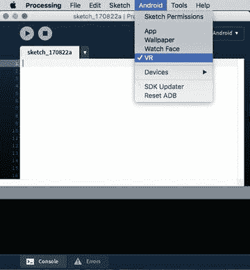

图 14-1。

Enabling the VR option in the Android menu

第二步，将 VR 库导入到我们的代码中，在`fullScreen()`函数中设置`STEREO`渲染器。该渲染器在我们的草图中绘制 3D 场景，需要进行相机变换来跟随 VR 空间中的头部移动，并考虑每只眼睛的视点之间的差异。清单 [14-1](#Par8) 显示了处理中的最小虚拟现实草图。

```java
import processing.vr.*;

void setup() {
  fullScreen(STEREO);
  fill(#AD71B7);
}

void draw() {
  background(#81B771);
  translate(width/2, height/2);
  lights();
  rotateY(millis()/1000.0);
  box(500);
}

Listing 14-1.Basic VR Sketch

```

我们可以看到图 [14-2](#Fig2) 中的结果——VR 中的一个旋转立方体！如果我们把手机放在一个纸板或 Daydream 耳机里，当我们绕着它转动我们的头时，我们将能够从不同的角度看到立方体。然而，在物理空间中行走不会对虚拟现实观看产生任何影响，因为谷歌虚拟现实耳机(在撰写本文时)不支持位置跟踪。

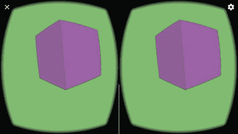

图 14-2。

Output of a simple VR sketch Note

为了在 Daydream 耳机上运行我们的草图，我们需要手动编辑草图文件夹中的清单文件，并将意图过滤器部分中的类别`com.google.intent.category.CARDBOARD`替换为`com.google.intent.category.DAYDREAM`。

### 立体渲染

正如我们在第一个例子中注意到的，一个 VR 草图生成了场景的两个副本，一个用于左眼，另一个用于右眼。它们略有不同，因为它们对应于从每只眼睛观看场景的方式。这样做的结果是在每一帧中调用两次`draw()`函数(我们将进一步讨论这个方面)。

我们在上一章看到的使用 P3D 渲染器进行 3D 绘制的所有技术几乎不加修改就可以移植到 VR 上。我们可以像以前一样使用形状、纹理和灯光。默认情况下，XYZ 轴的方向与 P3D 渲染器中的方向相同，这意味着原点位于屏幕的左上角，y 轴指向下方。清单 [14-2](#Par13) 实现了一个简单的场景来可视化那些设置(图 [14-3](#Fig3) )。

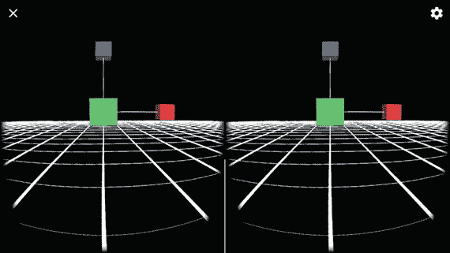

图 14-3。

Default coordinate axes in VR

```java
import processing.vr.*;

void setup() {
  fullScreen(STEREO);
  strokeWeight(2);
}

void draw() {
  background(0);
  translate(width/2, height/2);
  lights();
  drawAxis();
  drawGrid();
}

void drawAxis() {
  line(0, 0, 0, 200, 0, 0);
  drawBox(200, 0, 0, 50, #E33E3E);
  line(0, 0, 0, 0, -200, 0);
  drawBox(0, -200, 0, 50, #3E76E3);
  line(0, 0, 0, 0, 0, 200);
  drawBox(0, 0, 200, 50, #3EE379);
}

void drawGrid() {
  beginShape(LINES);
  stroke(255);
  for (int x = -10000; x < +10000; x += 500) {
    vertex(x, +500, +10000);
    vertex(x, +500, -10000);
  }
  for (int z = -10000; z < +10000; z += 500) {
    vertex(+10000, +500, z);
    vertex(-10000, +500, z);
  }
  endShape();
}

void drawBox(float x, float y, float z, float s, color c) {
  pushStyle();
  pushMatrix();
  translate(x, y, z);
  noStroke();
  fill(c);
  box(s);
  popMatrix();
  popStyle();
}

Listing 14-2.Axes in VR

```

由于原点在屏幕的左上角，我们需要调用`translate(width/2, height/2)`来将场景置于屏幕的中间。此外，我们可以看到，放置在(0，-200，0)处的蓝色框位于视线上方，与 y 轴的向下方向一致。

Note

大多数开发 VR 应用的框架都使用一个坐标系，其中原点位于屏幕的中心，y 轴指向上。在针对 Android 的处理中，我们可以通过调用`setup()`中的`cameraUp()`来切换到这个系统。

### 单视场渲染

处理 VR 库包括另一个渲染器，我们可以用它来绘制响应手机移动的 3D 场景，但不是立体模式。如果我们只是想在没有 VR 头戴设备的情况下窥视 3D 空间，这可能会很有用。我们代码中唯一需要的改变是使用`MONO`渲染器代替`STEREO`，就像我们在清单 [14-3](#Par17) 中所做的那样。结果如图 [14-4](#Fig4) 所示。

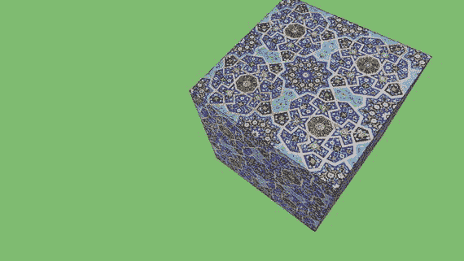

图 14-4。

Monoscopic rendering

```java
import processing.vr.*;

float angle = 0;
PShape cube;

void setup() {
  fullScreen(MONO);
  PImage tex = loadImage("mosaic.jpg");
  cube = createShape(BOX, 400);
  cube.setTexture(tex);
}

void draw() {
  background(#81B771);
  translate(width/2, height/2);
  lights();
  rotateY(angle);
  rotateX(angle*2);
  shape(cube);
  angle += 0.01;
}

Listing 14-3.Using the MONO Renderer

```

## VR 互动

到目前为止的代码示例已经向我们展示了在处理中创建 VR 场景是相当简单的:我们所需要的就是在 PDE 中选择 VR 模式，将 VR 库导入到我们的草图中，并使用`STEREO`渲染器。有了这些步骤，我们就可以应用之前学过的所有 3D 渲染技术了。但是一旦我们开始思考 VR 中的用户交互，我们就会发现新的挑战。首先，纸板耳机不像更贵的耳机那样包括任何控制器。手动输入仅限于一个触发屏幕触摸的按钮，一些基本的耳机甚至没有这个按钮。我们必须问自己几个关于 VR 中交互的基本问题:我们如何选择 3D 对象/UI 元素，以及我们如何在 VR 空间中移动？

开发人员一直在尝试各种解决这些问题的方法，谷歌 Play 商店上的 VR 应用概述可以给我们一些提示。一种常见的交互技术是凝视选择:应用检测到我们正在看哪个对象，然后一次触摸按压(或盯着它足够长的时间)就会触发所需的动作。所有的 VR 应用都以这样或那样的方式使用这种技术，并结合其他有趣的想法:头部手势(倾斜等。)、利用 VR 空间中的特殊区域放置 UI 元素(即向上或向下看)、某些动作的自动化(行走、拍摄)。

Note

一个成功的虚拟现实体验需要特别注意交互，让用户感觉他们确实在这个空间里。鉴于虚拟现实耳机在图形真实感和控制方面的限制，我们需要非常仔细地设计交互，以便在我们试图传达的特定体验方面有意义。

### 眼睛和世界坐标

在我们开始研究虚拟现实的交互技术之前，我们需要熟悉我们在开发虚拟现实应用时将要处理的坐标系。有两个系统需要记住:世界坐标系和眼睛坐标系，如图 [14-5](#Fig5) 所示。

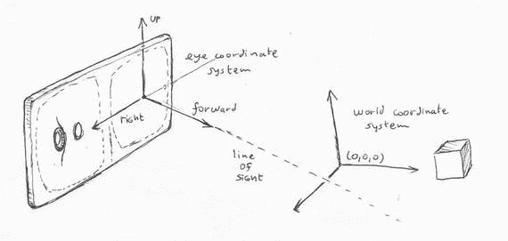

图 14-5。

Eye coordinate system with forward, right, and up vectors at the eye position, and world coordinate system

我们一直使用世界坐标，因为在 2D 和 3D 中，处理依赖于这些坐标来表征形状的位置和运动。虽然眼睛坐标是新的，但它非常具体地体现了从头部跟踪信息为我们自动构建虚拟现实视图的方式。眼睛坐标系由三个向量定义:向前、向右和向上(图 [14-5](#Fig5) )。向前的矢量代表我们视线的方向，向右和向上的矢量完成了这个系统。这些向量会在每一帧中自动更新，以反映头部的运动。

眼睛坐标是代表形状和其他需要与我们的视图对齐的图形元素的自然选择，例如我们眼前的文本信息或提供静态参考框架的一片几何图形；例如头盔或宇宙飞船的内部。眼睛坐标的使用使得正确绘制那些元素变得非常容易；例如，我们眼前的一个盒子会有坐标(0，0，200)。

处理让我们简单地通过调用`eye()`函数从世界坐标切换到眼睛坐标，如清单 [14-4](#Par25) 所示。四边形、方框和文本总是在我们的视线前面，如图 [14-6](#Fig6) 所示。

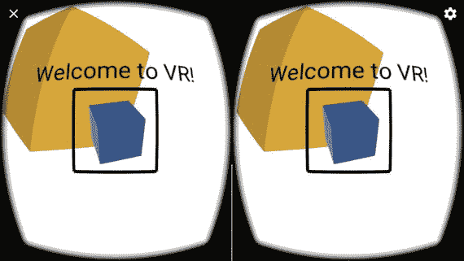

图 14-6。

Geometry defined in eye coordinates

```java
import processing.vr.*;

public void setup() {
  fullScreen(STEREO);
  textFont(createFont("SansSerif", 30));
  textAlign(CENTER, CENTER);
}

public void draw() {
  background(255);
  translate(width/2, height/2);
  lights();
  fill(#EAB240);
  noStroke();
  rotateY(millis()/1000.0);
  box(300);
  drawEye();
}

void drawEye() {
  eye();

  float s = 50;
  float d = 200;
  float h = 100;

  noFill();
  stroke(0);
  strokeWeight(10);
  beginShape(QUADS);
  vertex(-s, -s, d);
  vertex(+s, -s, d);
  vertex(+s, +s, d);
  vertex(-s, +s, d);
  endShape();

  pushMatrix();
  translate(0, 0, d);
  rotateX(millis()/1000.0);
  rotateY(millis()/2000.0);
  fill(#6AA4FF);
  noStroke();
  box(50);
  popMatrix();

  fill(0);
  text("Welcome to VR!", 0, -h * 0.75, d);
}

Listing 14-4.Drawing in Eye Coordinates

```

### 视线

在 VR 空间中最直接的交互方式就是四处张望！为了实现视线选择，我们可以参考图 [14-5](#Fig5) ，图中显示了从眼睛(或相机)位置沿着前向矢量延伸的实际视线。如果一个 3D 对象在这条线的路径上，我们可以断定它正在被用户查看(除非有另一个对象阻挡了视图)。那么，怎样才能画出视线呢？正如我们在上一节中看到的，眼睛坐标应该是答案，因为这条线从(0，0，0)开始，延伸到(0，0，L)，其中 L 是我们希望沿着这条线走多远。

在清单 [14-5](#Par28) 中，我们在原点沿 x 和 y 画了一条偏移的视线，这样我们可以看到它与放置在世界系统中心的一个盒子相交的位置(否则，它将完全垂直于我们的视图，因此很难看到)。

```java
import processing.vr.*;

PMatrix3D mat = new PMatrix3D();

void setup() {
  fullScreen(STEREO);
  hint(ENABLE_STROKE_PERSPECTIVE);
}

void draw() {
  background(120);
  translate(width/2, height/2);
  lights();

  noStroke();
  pushMatrix();
  rotateY(millis()/1000.0);
  fill(#E3993E);
  box(150);
  popMatrix();

  eye();
  stroke(#2FB1EA);
  strokeWeight(50);
  line(100, -100, 0, 0, 0, 10000);
}

Listing 14-5.Drawing the Line of Sight

```

在这段代码中，我们还使用了`ENABLE_STROKE_PERSPECTIVE`提示，这样线条在远离眼睛时会变细(图 [14-7](#Fig7) )。

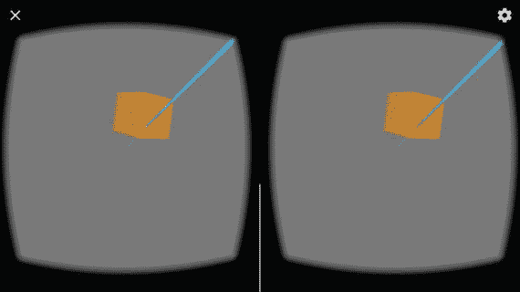

图 14-7。

Line of sight intersecting a box placed at the origin of coordinates Note

提示是渲染器的特殊设置，通过向`hint()`函数传递一个`ENABLE_name`常量来启用，通过传递相应的`DISABLE_name`常量来禁用。

我们也可以通过在眼睛坐标(0，0)处画一个点来显示屏幕中心的准确位置，就像我们在清单 [14-6](#Par32) 中做的那样。任何穿过屏幕中心的 3D 形状都与视线相交，所以这给了我们另一种方式来指示用户可能正在看什么对象。

```java
import processing.vr.*;

void setup() {
  fullScreen(STEREO);
}

void draw() {
  background(120);
  translate(width/2, height/2);

  lights();

  noStroke();
  fill(#E3993E);
  beginShape(QUAD);
  vertex(-75, -75);
  vertex(+75, -75);
  vertex(+75, +75);
  vertex(-75, +75);
  endShape(QUAD);

  eye();
  stroke(47, 177, 234, 150);
  strokeWeight(50);
  point(0, 0, 100);
}

Listing 14-6.Drawing a Circular Aim

```

我们用功能`point()`画的点画，可以通过用`strokeWeight()`设置权重，变得我们需要的那么大。它服务于“视图目标”的目的，用它来指向虚拟现实中的对象。图 [14-8](#Fig8) 显示了重量为 50 的目标。在下一节中，我们将学习如何确定一个 3D 点是否落在目标内。

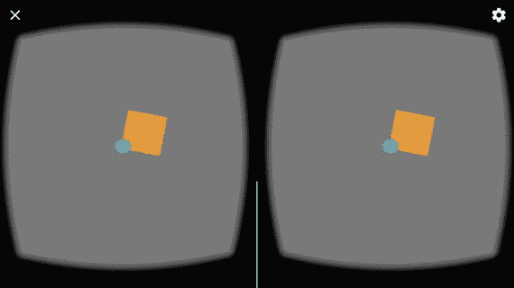

图 14-8。

View aim drawn with a point stroke

### 选择带有屏幕坐标的形状

正如我们刚刚看到的，确定 3D 空间中的顶点是否在我们的视线范围内的一个看似简单的方法是确定它的“屏幕坐标”是否足够靠近屏幕的中心。这种情况很容易通过在屏幕的正中心绘制一个视图来直观地检查，就像我们在清单 [14-6](#Par32) 中所做的那样。然而，我们需要一种用代码检查条件的方法。Processing 有函数`screenX()`和`screenY()`，它们允许我们这样做。这些函数将 3D 空间中某点的坐标(x，y，z)作为参数，并在投影到屏幕上时返回该点的屏幕坐标(sx，sy)。如果这些屏幕坐标足够接近(width/2，height/2)，那么我们可以断定用户正在选择该形状。让我们在清单 [14-7](#Par35) 中使用这种技术。

```java
import processing.vr.*;

void setup() {
  fullScreen(STEREO);
}

void draw() {
  background(120);
  translate(width/2, height/2);
  lights();
  drawGrid();
  drawAim();
}

void drawGrid() {
  for (int i = 0; i < 4; i++) {
    for (int j = 0; j < 4; j++) {
      beginShape(QUAD);
      float x = map(i, 0, 3, -315, +315);
      float y = map(j, 0, 3, -315, +315);
      float sx = screenX(x, y, 0);
      float sy = screenY(x, y, 0);
      if (abs(sx - 0.5 * width) < 50 && abs(sy - 0.5 * height) < 50) {
        strokeWeight(5);
        stroke(#2FB1EA);
        if (mousePressed) {
          fill(#2FB1EA);
        } else {
          fill(#E3993E);
        }
      } else {
        noStroke();
        fill(#E3993E);
      }
      vertex(x - 100, y - 100);
      vertex(x + 100, y - 100);
      vertex(x + 100, y + 100);
      vertex(x - 100, y + 100);
      endShape(QUAD);
    }
  }
}

void drawAim() {
  eye();
  stroke(47, 177, 234, 150);
  strokeWeight(50);
  point(0, 0, 100);
}

Listing 14-7.Gaze Selection with Button Press

```

如果我们按下耳机中的按钮，变量`mousePressed`将被设置为`true`，允许我们确认正在查看的形状的选择，并高亮显示整个矩形，如图 [14-9](#Fig9) 所示。然而，如果耳机缺少一个按钮，我们需要一个不同的策略。我们可以通过查看形状一段特定的时间来确认选择，我们在清单 [14-8](#Par37) 中就是这么做的(只显示了与前面清单不同的代码)。

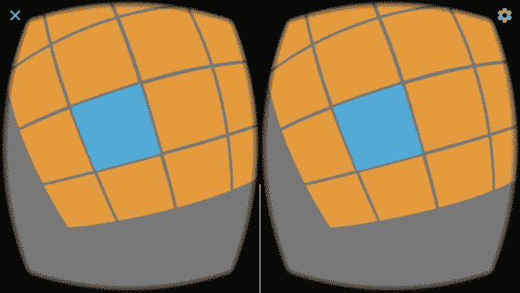

图 14-9。

Selecting a quad using screen coordinates

```java
import processing.vr.*;

int seli = -1;
int selj = -1;
int startSel, selTime;
...
void drawGrid() {
  boolean sel = false;
  for (int i = 0; i < 4; i++) {
    for (int j = 0; j < 4; j++) {
      ...
      if (abs(sx - 0.5 * width) < 50 && abs(sy - 0.5 * height) < 50) {
        strokeWeight(5);
        stroke(#2FB1EA);
        if (seli == i && selj == j) {
          selTime = millis() - startSel;
        } else {
          startSel = millis();
          selTime = 0;
        }
        seli = i;
        selj = j;
        sel = true;
        if (2000 < selTime) {
          fill(#2FB1EA);
        } else {
          fill(#E3993E);
        }
      } else {
      ...
  }
  if (!sel) {
    seli = -1;
    selj = -1;
    selTime = 0;
  }
}

Listing 14-8.Gaze Selection with Staring Time

```

这里的想法是跟踪当前选择的矩形的索引，并且仅在`selTime`变量大于期望的阈值时确认选择，在这种情况下，阈值被设置为 2000 毫秒。

### 边界框选择

通过计算 3D 对象的屏幕坐标来选择 3D 对象的技术适用于简单的形状，并且在创建 UI 时非常有用。然而，当投影到屏幕平面上时，它可能不太适合具有不规则轮廓的更复杂的对象。

确定 3D 中对象选择的一种常用方法是边界框相交。边界框是完全包围给定 3D 对象的立方体。如果视线不与对象的边界框相交，我们可以确定该对象没有被选择，如果它被选择，我们可以选择它或执行更详细的测试。轴对齐边界框(AABB)是一种特殊类型的边界框，其边缘与坐标轴对齐。这一特性使得计算更简单、更快速，这在 VR 应用的环境中非常重要，我们可能需要测试数百甚至数千个边界框相交。3D 对象的 AABB 可以通过获取对象中顶点的 xyz 坐标的最小值和最大值并将其存储在一对向量中来轻松计算，这对向量完全确定了 AABB。

有许多算法可以用来测试一条直线与 AABB 的交点( [`http://www.realtimerendering.com/intersections.html`](http://www.realtimerendering.com/intersections.html)) )。Amy Williams 及其合作者在 2005 年提出了一种高效且易于实现的方法( [`http://dl.acm.org/citation.cfm?id=1198748`](http://dl.acm.org/citation.cfm%3Fid=1198748)) )。在该算法中，我们需要提供定义 AABB 的最小和最大向量，以及沿线的一个点及其方向向量(在与视线相交的情况下，这些是眼睛位置和向前的向量)。问题是，如果我们对对象应用变换，它的边界框可能不再与轴对齐。我们可以通过对线应用逆变换来解决这一问题，使线和 AABB 的相对方向与我们对边界框应用变换时的方向相同。这个逆变换被编码在所谓的对象矩阵中，我们可以用`getObjectMatrix()`函数获得它。

正如我们已经指出的，这个算法需要眼睛位置和前向矢量。这些是我们之前使用`eye()`功能切换到眼睛坐标时使用的“眼睛矩阵”的一部分。为了获得这个矩阵的副本，我们还在处理 API 中使用了`getEyeMatrix()`。清单 [14-9](#Par43) 通过将 Williams 的算法应用于一个盒子网格将所有这些放在一起(参见图 [14-10](#Fig10) 中的结果)。

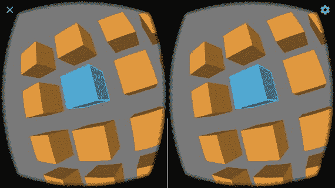

图 14-10。

Selecting a box with Williams’ algorithm

```java
import processing.vr.*;

PMatrix3D eyeMat = new PMatrix3D();
PMatrix3D objMat = new PMatrix3D();
PVector cam = new PVector();
PVector dir = new PVector();
PVector front = new PVector();
PVector objCam = new PVector();
PVector objFront = new PVector();
PVector objDir = new PVector();
float boxSize = 140;
PVector boxMin = new PVector(-boxSize/2, -boxSize/2, -boxSize/2);
PVector boxMax = new PVector(+boxSize/2, +boxSize/2, +boxSize/2);
PVector hit = new PVector();

void setup() {
  fullScreen(PVR.STEREO);
}

void draw() {
  getEyeMatrix(eyeMat);
  cam.set(eyeMat.m03, eyeMat.m13, eyeMat.m23);
  dir.set(eyeMat.m02, eyeMat.m12, eyeMat.m22);
  PVector.add(cam, dir, front);
  background(120);
  translate(width/2, height/2);
  lights();
  drawGrid();
  drawAim();
}

void drawGrid() {
  for (int i = 0; i < 4; i++) {
    for (int j = 0; j < 4; j++) {
      float x = map(i, 0, 3, -350, +350);
      float y = map(j, 0, 3, -350, +350);
      pushMatrix();
      translate(x, y);
      rotateY(millis()/1000.0);
      getObjectMatrix(objMat);
      objMat.mult(cam, objCam);
      objMat.mult(front, objFront);
      PVector.sub(objFront, objCam, objDir);
      boolean res = intersectsLine(objCam, objDir, boxMin, boxMax,
                                   0, 1000, hit);
      if (res) {
        strokeWeight(5);
        stroke(#2FB1EA);
        if (mousePressed) {
          fill(#2FB1EA);
        } else {
          fill(#E3993E);
        }
      } else {
        noStroke();
        fill(#E3993E);
      }
      box(boxSize);
      popMatrix();
    }
  }
}

void drawAim() {
  eye();
  stroke(47, 177, 234, 150);
  strokeWeight(50);
  point(0, 0, 100);
}

boolean intersectsLine(PVector orig, PVector dir,
  PVector minPos, PVector maxPos, float minDist, float maxDist, PVector hit) {
  PVector bbox;
  PVector invDir = new PVector(1/dir.x, 1/dir.y, 1/dir.z);

  boolean signDirX = invDir.x < 0;
  boolean signDirY = invDir.y < 0;
  boolean signDirZ = invDir.z < 0;

  bbox = signDirX ? maxPos : minPos;
  float txmin = (bbox.x - orig.x) * invDir.x;
  bbox = signDirX ? minPos : maxPos;
  float txmax = (bbox.x - orig.x) * invDir.x;
  bbox = signDirY ? maxPos : minPos;
  float tymin = (bbox.y - orig.y) * invDir.y;
  bbox = signDirY ? minPos : maxPos;
  float tymax = (bbox.y - orig.y) * invDir.y;

  if ((txmin > tymax) || (tymin > txmax)) {
    return false;
  }
  if (tymin > txmin) {
    txmin = tymin;
  }
  if (tymax < txmax) {
    txmax = tymax;
  }

  bbox = signDirZ ? maxPos : minPos;
  float tzmin = (bbox.z - orig.z) * invDir.z;
  bbox = signDirZ ? minPos : maxPos;
  float tzmax = (bbox.z - orig.z) * invDir.z;

  if ((txmin > tzmax) || (tzmin > txmax)) {
    return false;
  }
  if (tzmin > txmin) {
    txmin = tzmin;
  }
  if (tzmax < txmax) {
    txmax = tzmax;
  }
  if ((txmin < maxDist) && (txmax > minDist)) {
    hit.x = orig.x + txmin * dir.x;
    hit.y = orig.y + txmin * dir.y;
    hit.z = orig.z + txmin * dir.z;
    return true;
  }
  return false;
}

Listing 14-9.AABB-Line of Sight Intersection

```

网格中的每个框都有不同的对象矩阵，因为变换是不同的(相同的旋转，但不同的平移)。一旦我们获得了物体矩阵，我们必须将它应用于眼睛位置和前向矢量，因为它们定义了我们想要与物体的 AABB 相交的线。我们通过矩阵向量乘法来应用变换。眼睛位置存储在 cam 变量中，直接用 objMat.mult(cam，objCam)变换到物体空间。但是，前向矢量是方向，不是位置，所以不能那样变换。相反，首先我们需要用 objMat.mult(front，objFront)变换前向量，它存储了沿视线从眼睛向前一个单位的点的位置，只有这样我们才能通过用 pvector sub(objFront，objCam，objDir)计算变换后的前位置和眼睛位置之间的差来计算物体坐标中的方向向量。

眼睛位置和前向向量在眼睛矩阵中被编码为其第三和第四列，因此我们可以获得矩阵的各个分量，(`m02`、`m12`、`m22`)和(`m03`、`m13`、`m23`)，然后将它们分别复制到`dir`和`cam`向量中。

`intersectsLine()`函数保存了 Williams 算法的实现。它是完全独立的，所以我们可以在其他草图中重用它。请注意，除了根据直线是否与 AABB 相交返回 true 或 false 之外，该算法还会返回`hit`向量中交点的坐标，如果检测到几个交点，该坐标可用于确定离摄像机最近的交点。

## 虚拟现实中的运动

运动是任何虚拟现实体验的一个关键方面，我们需要仔细考虑，因为它受到一些约束和要求的影响。一方面，我们的目标是说服用户停止怀疑，沉浸在虚拟环境中。在这种环境中拥有一定程度的自由是很重要的。另一方面，这种虚拟运动不会完全符合我们的感官，这可能会导致晕动病，这是 VR 应用中要不惜一切代价避免的事情。相反，如果我们戴着谷歌虚拟现实耳机在物理空间中移动，我们会体验到视觉和身体感官之间的另一种脱节。

尽管有这些限制，我们仍然可以在 VR 空间中创建令人信服的运动。一个技巧是在视野中放置某种固定的参照物，与我们在物理空间中的静止状态相匹配。例如，在清单 [14-10](#Par49) 中，我们为此加载了一个`OBJ`形状，将其放置在眼睛坐标中的相机位置。这个形状是一个十二面体(图 [14-11](#Fig11) )，在我们通过虚拟现实进行导航时，它就像是一个“头盔”。

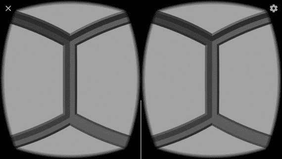

图 14-11。

Using an OBJ shape as a reference in our field of vision

```java
import processing.vr.*;

PShape frame;

void setup() {
  fullScreen(STEREO);
  frame = loadShape("dodecahedron.obj");
  prepare(frame, 500);
}

void draw() {
  background(180);
  lights();
  translate(width/2, height/2);
  eye();
  shape(frame);
}

void prepare(PShape sh, float s) {
  PVector min = new PVector(+10000, +10000, +10000);
  PVector max = new PVector(-10000, -10000, -10000);
  PVector v = new PVector();
  for (int i = 0; i < sh.getChildCount(); i++) {
    PShape child = sh.getChild(i);
    for (int j = 0; j < child.getVertexCount(); j++) {
      child.getVertex(j, v);
      min.x = min(min.x, v.x);
      min.y = min(min.y, v.y);
      min.z = min(min.z, v.z);
      max.x = max(max.x, v.x);
      max.y = max(max.y, v.y);
      max.z = max(max.z, v.z);
    }
  }
  PVector center = PVector.add(max, min).mult(0.5f);
  sh.translate(-center.x, -center.y, -center.z);
  float maxSize = max(sh.getWidth(), sh.getHeight(), sh.getDepth());
  float factor = s/maxSize;
  sh.scale(factor);
}

Listing 14-10.Drawing a Stationary Reference Object

```

`prepare()`函数将形状放在原点的中心，并将其缩放到与我们的场景尺寸相当的大小。这一步在加载`OBJ`文件时很重要，因为它们可能是用不同范围的坐标值定义的，所以它们可能看起来很小或很大。在这种情况下，我们放置十二面体形状，使其以(`cameraX`、`cameraY`、`cameraZ`)为中心，从而为我们在 VR 中的视觉提供参考。接下来我们将看到如何在适当的位置移动这个引用。

### 自动运动

在某些情况下，我们可以创建不受用户控制的运动，从而消除界面的复杂性。例如，如果目标是带用户通过预定的路径，或者在两个检查点之间转换，这可能是一个好的解决方案。

一旦我们构建了场景几何体，我们可以对其应用任何变换以创建运动，将它们包含在`pushMatrix()`和`popMatrix()`之间，以防止变换影响相对于观察者固定的任何形状。清单 [14-11](#Par53) 展示了如何模拟围绕圆形轨迹的旋转。

```java
import processing.vr.*;

PShape frame;
PShape track;

public void setup() {
  fullScreen(STEREO);

  frame = loadShape("dodecahedron.obj");
  prepare(frame, 500);

  track = createShape();
  track.beginShape(QUAD_STRIP);
  track.fill(#2D8B47);
  for (int i = 0; i <= 40; i++) {
    float a = map(i, 0, 40, 0, TWO_PI);
    float x0 = 1000 * cos(a);
    float z0 = 1000 * sin(a);
    float x1 = 1400 * cos(a);
    float z1 = 1400 * sin(a);
    track.vertex(x0, 0, z0);
    track.vertex(x1, 0, z1);
  }
  track.endShape();
}

public void draw() {
  background(255);
  translate(width/2, height/2);

  directionalLight(200, 200, 200, 0, +1, -1);

  translate(1200, +300, 500);
  rotateY(millis()/10000.0);
  shape(track);

  eye();
  shape(frame);
}

void prepare(PShape sh, float s) {
...

Listing 14-11.Moving Along a Predefined Path

```

在这段代码中，我们将圆形轨迹存储在一个`PShape`对象中，将平移应用到相机的右侧，以便用户从轨迹的顶部开始，然后应用旋转来创建围绕轨迹中心的所需移动。该草图的结果如图 [14-12](#Fig12) 所示。

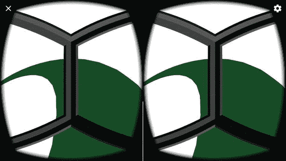

图 14-12。

Using an OBJ shape as a reference in our field of vision

### 自由活动

与前面的例子不同，在前面的例子中，移动是预先定义的，用户只能四处张望，现在我们让用户在 VR 空间中自由漫游。这并不难实现；我们所需要的就是沿着正向向量平移场景中的物体，就像清单 [14-12](#Par56) 中所做的那样。然而，这里我们第一次使用了`calculate()`函数，这是 VR 草图中的一个重要函数，它让我们可以运行每帧只需执行一次的计算。

```java
import processing.vr.*;

PShape frame;
PShape cubes;
PMatrix3D eyeMat = new PMatrix3D();
float tx, ty, tz;
float step = 5;

public void setup() {
  fullScreen(STEREO);

  frame = loadShape("dodecahedron.obj");
  prepare(frame, 500);

  cubes = createShape(GROUP);
  float v = 5 * width;
  for (int i = 0; i < 50; i++) {
    float x = random(-v, +v);
    float y = random(-v, +v);
    float z = random(-v, +v);
    float s = random(100, 200);
    PShape sh = createShape(BOX, s);
    sh.setFill(color(#74E0FF));
    sh.translate(x, y, z);
    cubes.addChild(sh);
  }
}

void calculate() {
  getEyeMatrix(eyeMat);
  if (mousePressed) {
    tx -= step * eyeMat.m02;
    ty -= step * eyeMat.m12;
    tz -= step * eyeMat.m22;
  }
}

public void draw() {
  background(255);
  translate(width/2, height/2);

  directionalLight(200, 200, 200, 0, +1, -1);

  translate(tx, ty, tz);
  shape(cubes);

  eye();
  shape(frame);
}

void prepare(PShape sh, float s) {
...

Listing 14-12.Moving Freely in VR Space

```

在每一帧中，`calculate()`函数只被调用一次，就在`draw()`被调用两次之前，每只眼睛调用一次。这在这个例子中很有用，因为如果我们将翻译代码放在`draw()`中，我们将增加两倍的翻译量，导致不正确的翻译。重要的是，我们要考虑哪些操作应该在`draw()`内部完成——通常是任何与绘图相关的内容——哪些操作应该在`calculate()`内部完成，比如以同样方式影响左右视图的代码。

虚拟现实空间中完全无界运动的一个问题是，它可能会让许多人迷失方向。一个更容易处理的情况是将运动限制在 XZ 平面上。这可以像以前一样用正向矢量来完成，但是你只能用它的 x 和 z 分量来更新平移，如清单 [14-13](#Par59) 所示。

```java
import processing.vr.*;

PShape cubes;
PShape grid;
PMatrix3D eyeMat = new PMatrix3D();
float tx, tz;
float step = 10;
PVector planeDir = new PVector();

public void setup() {
  fullScreen(STEREO);

  grid = createShape();
  grid.beginShape(LINES);
  grid.stroke(255);
  for (int x = -10000; x < +10000; x += 500) {
    grid.vertex(x, +200, +10000);
    grid.vertex(x, +200, -10000);
  }
  for (int z = -10000; z < +10000; z += 500) {
    grid.vertex(+10000, +200, z);
    grid.vertex(-10000, +200, z);
  }
  grid.endShape();

  cubes = createShape(GROUP);
  float v = 5 * width;
  for (int i = 0; i < 50; i++) {
    float x = random(-v, +v);
    float z = random(-v, +v);
    float s = random(100, 300);
    float y = +200 - s/2;
    PShape sh = createShape(BOX, s);
    sh.setFill(color(#FFBC6A));
    sh.translate(x, y, z);
    cubes.addChild(sh);
  }
}

void calculate() {
  getEyeMatrix(eyeMat);
  if (mousePressed) {
    planeDir.set(eyeMat.m02, 0, eyeMat.m22);
    float d = planeDir.mag();
    if (0 < d) {
      planeDir.mult(1/d);
      tx -= step * planeDir.x;
      tz -= step * planeDir.z;
    }
  }
}

public void draw() {
  background(0);
  translate(width/2, height/2);
  pointLight(50, 50, 200, 0, 1000, 0);
  directionalLight(200, 200, 200, 0, +1, -1);
  translate(tx, 0, tz);
  shape(grid);
  shape(cubes);
}

Listing 14-13.Moving in a 2D Plane

```

在`calculate()`函数中，我们从眼睛矩阵的`m02`和`m22`分量构建一个平面方向向量。我们需要对这个向量进行归一化，以确保我们在移动时保持均匀的步幅，即使我们在向上看，向前的向量在 x 和 z 轴上的坐标非常小。该草图的视图如图 [14-13](#Fig13) 所示。

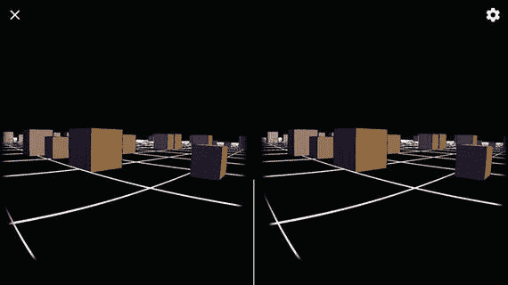

图 14-13。

Movement constrained to a 2D plane

## 摘要

虚拟现实带来了令人兴奋的新可能性以及有趣的挑战。在这一章中，我们学习了一些处理技术来应对这些挑战，并探索虚拟现实的可能性可以带我们去哪里。特别是，我们讨论了直观的交互和运动是如何创造引人入胜的虚拟现实体验的关键。