# 十五、在虚拟现实中绘图

在这最后一章中，我们将一步一步地使用 Android 的处理来开发一个全功能的 VR 绘图应用。我们将应用到目前为止我们所学的所有技术，包括凝视控制的移动和用户界面(UI)。

## 创造成功的虚拟现实体验

在前面的章节中，我们学习了 3D API 在处理方面的基础知识，以及一些我们可以用来在 VR 中创建交互式图形的技术。创造一个成功的虚拟现实体验是一个令人兴奋的挑战。与“传统的”计算机图形相反，在“传统的”计算机图形中，我们可以依赖用户熟悉的表示(例如，透视图与等轴视图)和交互约定(例如，基于鼠标或触摸的手势)，VR 是一种新的媒体，它提供了许多可能性，但也带来了独特的约束和限制。

可以说，虚拟现实的一个中心目标是让用户暂停怀疑，沉浸在虚拟空间中，至少是一小会儿，即使图形不是照片般逼真或交互有限。虚拟现实创造了一种不寻常的体验，那就是置身于一个没有身体的合成 3D 空间中。最近在技术和游戏展上演示的输入硬件(例如，在虚拟现实中骑自行车的自行车支架，产生触摸幻觉的气压，甚至低放电)说明了体现虚拟现实体验的持续努力。

我们还需要了解 Android 处理所支持的 Cardboard 和 Daydream 平台的具体特征。由于我们是用智能手机生成图形，所以它们比由 PC 驱动的 VR 设备生成的图形更受限制。首先，重要的是要确保手机能够处理我们场景的复杂性，并能保持平稳的帧率。否则，断断续续的动画会导致用户头晕和恶心。第二，纸板耳机的交互输入有限，通常只有一个按钮。此外，由于我们需要用双手握住它们(见图 [15-1](#Fig1) )，因此我们不能依赖外部输入设备。我们的 VR 应用中的交互应该考虑到体验的所有这些方面。

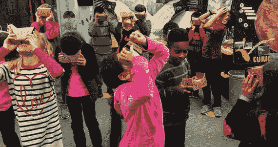

图 15-1。

Students using Google Cardboard during class activities

### 在虚拟现实中绘图

在虚拟现实中创建 3D 对象可能是一项非常有趣的活动，我们不仅可以不受屏幕或物理定律的限制来塑造人物，还可以与我们的虚拟作品处于同一空间。Google Tilt Brush(图 [15-2](#Fig2) )是一个很好的例子，说明了一个设计良好的 VR 体验是如何变得极具沉浸感和趣味性的。受这些想法的启发，实现我们自己的 Cardboard/Daydream 的绘图 VR app 岂不是一个很好的练习？

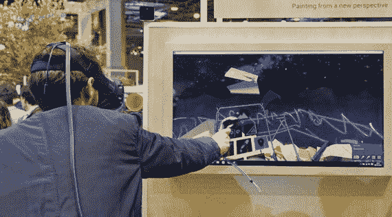

图 15-2。

Google Tilt Brush VR drawing app

正如我们刚刚讨论的，我们将不得不处理更有限的图形和交互能力。如果我们假设没有可用的输入设备，并且我们只有一个按钮来进行单次按压，那么我们基本上只能将凝视作为我们的铅笔来使用。出于这个原因，前一章中使用视线在 VR 空间中选择 3D 元素的一些技术将会派上用场。

### 初始草图

虚拟现实绘画的一个很好的类比是雕刻。根据这个类比，我们可以从一个基座或讲台开始，在其上我们将创建我们的 VR 绘图/雕塑，当我们需要改变我们工作的角度时，用一些 UI 控件来旋转它。我们必须记住，谷歌虚拟现实不会跟踪位置的变化，只会跟踪头部的旋转，这不足以从所有可能的角度进行 3D 绘图。图 [15-3](#Fig3) 为应用勾勒出一个纸笔概念。

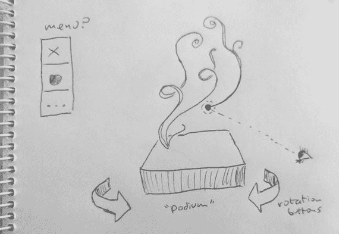

图 15-3。

Pen-and-paper concept sketch for our VR drawing app

我们的视线到达讲台上方空间的点可能是我们的铅笔尖。关键的细节是在不干扰用户界面的情况下，将这支铅笔与我们头部的运动联系起来。我们可以使用按钮按压作为启用/禁用绘图的机制，因此当我们不按按钮时，我们可以自由地移动我们的头部并与 UI 交互。

因此，该应用可以如下工作:当我们处于绘画模式时，我们停留在静态的有利位置，从那里我们在讲台上绘画。我们可以添加一个额外的沉浸元素，让用户在绘画完成后自由移动，这样就可以从不同寻常的角度观看。我们在前一章已经看到了如何在 VR 中实现自由移动，所以我们也可以在我们的应用中使用这种技术。

## 一个简单的虚拟现实界面

让我们首先创建一个应用的初始版本，它只有绘图的基础和一些初始的 UI 元素，但还没有实际的绘图功能。作为清单 [15-1](#Par11) 的临时占位符，我们显示了一个虚拟形状，我们可以使用 UI 旋转它。

```java
import processing.vr.*;

PShape base;

void setup() {
  fullScreen(STEREO);
  createBase(300, 70, 20);
}

void draw() {
  background(0);
  translate(width/2, height/2);
  directionalLight(200, 200, 200, 0, +1, -1);
  drawBase();
  drawBox();
}

void drawBase() {
  pushMatrix();
  translate(0, +300, 0);
  shape(base);
  popMatrix();
}

void drawBox() {
  pushMatrix();
  translate(0, +100, 0);
  noStroke();
  box(200);
  popMatrix();
}

void createBase(float r, float h, int ndiv) {
  base = createShape(GROUP);
  PShape side = createShape();
  side.beginShape(QUAD_STRIP);
  side.noStroke();
  side.fill(#59C5F5);
  for (int i = 0; i <= ndiv; i++) {
    float a = map(i, 0, ndiv, 0, TWO_PI);
    float x = r * cos(a);
    float z = r * sin(a);
    side.vertex(x, +h/2, z);
    side.vertex(x, -h/2, z);
  }
  side.endShape();
  PShape top = createShape();
  top.beginShape(TRIANGLE_FAN);
  top.noStroke();
  top.fill(#59C5F5);
  top.vertex(0, 0, 0);
  for (int i = 0; i <= ndiv; i++) {
    float a = map(i, 0, ndiv, 0, TWO_PI);
    float x = r * cos(a);
    float z = r * sin(a);
    top.vertex(x, -h/2, z);
  }
  top.endShape();
  base.addChild(side);
  base.addChild(top);
}

Listing 15-1.Starting Point of Our Drawing App

```

底座只是一个存储在`PShape`中的圆柱体，加上一个用作顶面的椭圆。正如我们之前看到的，我们可以在一个组中存储不同的处理形状，并且为了绘制这个基础形状，我们只需要得到的`PShape`组。图 [15-4](#Fig4) 展示了这个应用的第一个版本。

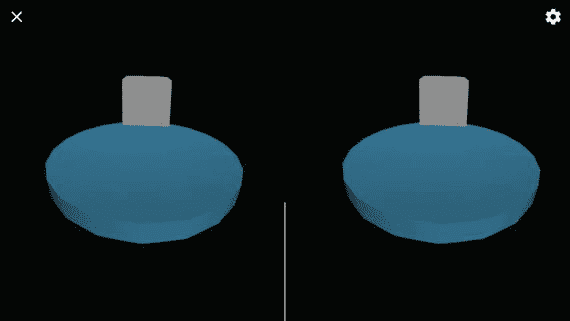

图 15-4。

First step in our VR drawing app: a base shape and a dummy object

作为 UI 的第一次迭代，我们将添加三个按钮:两个用于沿 y 轴旋转底座和盒子，另一个用于重置旋转。清单 [15-2](#Par14) 实现了这个初始 UI(省略了`createBase(), drawBase(),`和`drawBox()`函数，因为它们与前面的代码相同)。

```java
import processing.vr.*;

PShape base;
float angle;
Button leftButton, rightButton, resetButton;

void setup() {
  fullScreen(STEREO);
  textureMode(NORMAL);
  createBase(300, 70, 20);
  createButtons(300, 100, 380, 130);
}

void calculate () {
  if (mousePressed) {
    if (leftButton.selected) angle -= 0.01;
    if (rightButton.selected) angle += 0.01;
    if (resetButton.selected) angle = 0;
  }
}

void draw() {
  background(0);
  translate(width/2, height/2);
  directionalLight(200, 200, 200, 0, +1, -1);
  drawBase();
  drawBox();
  drawUI();
}
...
void createButtons(float dx, float hlr, float ht, float s) {
  PImage left = loadImage("left-icon.png");
  leftButton = new Button(-dx, hlr, 0, s, left);
  PImage right = loadImage("right-icon.png");
  rightButton = new Button(+dx, hlr, 0, s, right);
  PImage cross = loadImage("cross-icon.png");
  resetButton = new Button(0, +1.0 * ht, +1.1 * dx, s, cross);
}

void drawUI() {
  leftButton.display();
  rightButton.display();
  resetButton.display();
  drawAim();
}

void drawAim() {
  eye();
  pushStyle();
  stroke(220, 180);
  strokeWeight(20);
  point(0, 0, 100);
  popStyle();
}

boolean centerSelected(float d) {
  float sx = screenX(0, 0, 0);
  float sy = screenY(0, 0, 0);
  return abs(sx - 0.5 * width) < d && abs(sy - 0.5 * height) < d;
}

class Button {
  float x, y, z, s;
  boolean selected;
  PImage img;

  Button(float x, float y, float z, float s, PImage img) {
    this.x = x;
    this.y = y;
    this.z = z;
    this.s = s;
    this.img = img;
  }

  void display() {
    float l = 0.5 * s;
    pushStyle();
    pushMatrix();
    translate(x, y, z);
    selected = centerSelected(l);
    beginShape(QUAD);
    if (selected) {
      stroke(220, 180);
      strokeWeight(5);
    } else {
      noStroke();
    }
    tint(#59C5F5);
    texture(img);
    vertex(-l, +l, 0, 1);
    vertex(-l, -l, 0, 0);
    vertex(+l, -l, 1, 0);
    vertex(+l, +l, 1, 1);
    endShape();
    popMatrix();
    popStyle();
  }
}

Listing 15-2.Adding a Basic UI

```

封装选择功能的`Button`类是这段代码的核心元素。它的构造函数接受五个参数:按钮中心的(x，y，z)坐标、大小和用作按钮纹理的图像。在`display()`方法的实现中，我们通过使用上一章的屏幕坐标技术来确定按钮是否被选中:如果(screenX，screenY)足够靠近屏幕中心，那么它被认为是被选中的，在这种情况下，按钮得到一条笔划线。UI 事件在`calculate()`方法中触发，以避免在检测到“鼠标”按下(对应于 VR 头戴式耳机中可用的物理触发器)事件时再次应用它们。

按钮的位置由`createButtons()`功能决定，左右旋转按钮位于底座两侧，复位按钮位于稍下方。我们还在眼睛坐标中的(0，0，100)处绘制了一个笔划点，作为帮助绘制和选择的目标。

此时，再次回顾`Button`类中的`display()`函数是很重要的，在这里，除了绘制按钮，我们还测试它是否被选中。这看起来可能是放置该逻辑的错误位置，因为显示功能应该只处理绘图任务。事实证明，`screenX()`和`screenY()`调用要求影响按钮的 3D 变换是当前的，否则它们将返回不正确的结果。因为在绘制几何图形时应用了转换，所以我们也在该阶段执行交互检测。这个草图的结果应该如图 [15-5](#Fig5) 所示。

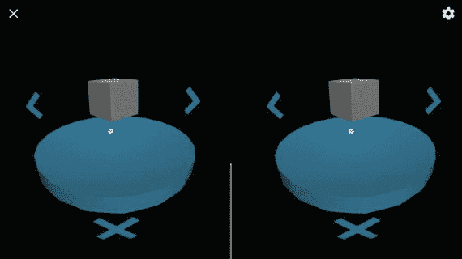

图 15-5。

Adding buttons to the UI

## 三维绘图

当我们在第二章[中实现绘图应用时，我们只需要担心在 2D 画笔画。这很容易，感谢处理中的`pmouseX/Y`和`mouseX/Y`变量，它们允许我们在先前和当前鼠标位置之间画一条线。在三维空间中，想法实际上是一样的:笔画是连续位置之间的一系列线条，不再局限于屏幕平面内。但是如果我们在 VR 空间中没有实际的 3D 指针，我们需要仅从凝视信息来推断 3D 空间中的方向性。](02.html)

我们知道我们凝视的方向包含在向前的向量中，它会自动更新以反映任何头部运动。如果在每一帧，我们向场景的中心投射一个固定量的前向向量，我们将有一个滑动点，可以在我们的绘图中生成笔划。事实上，这与我们为 2D 绘画所做的没有太大的不同，在那里笔画是由`(mouseX, mouseY)`位置的序列定义的。我们还可以计算当前矢量和前一个矢量之间的差值，类似于 2D 的矢量`(mouseX – pmouseX, mouseY – pmouseY)`，以确定我们是否需要在绘图中添加新的点。图 [15-6](#Fig6) 显示了图中差矢量与相应位移之间的关系。

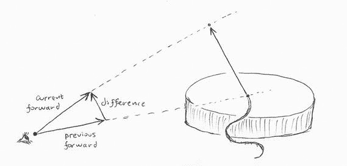

图 15-6。

Calculating displacement using previous and current forward vectors

3D 和 2D 情况之间的一个重要区别是，在后者中，我们不需要跟踪所有过去的位置，只需要跟踪先前的位置。这是因为如果我们不使用`background()`清除屏幕，我们可以简单地在已经绘制的线条上添加最后一条线条。但是在 3D 中，我们必须在每一帧刷新屏幕，因为摄像机的位置不是静态的，所以场景需要不断更新。这意味着，从绘图中记录的第一个位置开始，所有过去的行都必须在每一帧中重新绘制。为此，我们需要将所有位置存储在一个数组中。

然而，如果我们想在用户停止按下耳机中的触发器时中断笔画，那么将绘图中的所有位置存储在一个数组中是不够的。我们还需要保存中断发生的地方。一种可能性是将每个连续的笔划存储在一个单独的数组中，并拥有一个包含所有过去笔划的数组。

有了这些想法，我们就可以开始工作了。因为草图变得相当复杂，所以最好将它分成单独的选项卡，每个选项卡中有相关的代码。例如，我们可以有如图 [15-7](#Fig7) 所示的标签结构。

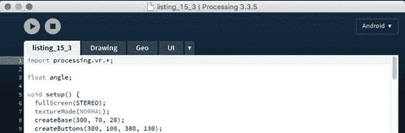

图 15-7。

Tabs to organize our increasingly complex VR drawing sketch

让我们分别检查每个选项卡。清单 [15-3A](#Par24) 所示的主选项卡包含标准的`setup()`、`calculate()`、`draw()`和`mouseReleased()`功能。我们从主选项卡调用的其余功能在其他选项卡中实现。

```java
import processing.vr.*;

float angle;

void setup() {
  fullScreen(STEREO);
  textureMode(NORMAL);
  createBase(300, 70, 20);
  createButtons(300, 100, 380, 130);
}

void calculate() {
  if (mousePressed) {
    if (leftButton.selected) angle -= 0.01;
    if (rightButton.selected) angle += 0.01;
  }
  if (mousePressed && !selectingUI()) {
    updateStrokes();
  }
}

void draw() {
  background(0);
  translate(width/2, height/2);
  directionalLight(200, 200, 200, 0, +1, -1);
  drawBase();
  drawStrokes();
  drawUI();
}

void mouseReleased() {
  if (resetButton.selected) {
    clearDrawing();
    angle = 0;
  } else {
    startNewStroke();
  }
}

Listing 15-3A.Main Tab

```

关于鼠标事件处理程序的一些重要观察。旋转角度的更新保留在`calculate()`中，因为这允许我们通过以 0.01 步增加/减少角度来连续旋转场景，只要我们一直按下耳机上的触发按钮。相比之下，`mousePressed()/mouseReleased()`处理程序仅在按下事件开始或结束时调用，因此只要按钮处于按下状态，它们就不能用于执行某些任务。但是，这种行为对于实现只应在按下或释放按钮时执行的任务很有用。清除绘图就是这种任务的一个例子，这就是为什么`clearDrawing()`被放在`mouseReleased()`里面的原因。

Note

加工草图中的选项卡结构完全是可选的，不影响草图的运行方式。它允许我们组织代码，使其更具可读性。

转到清单 [15-3B](#Par28) 中的绘图选项卡，我们可以检查在`updateStrokes()`中向当前笔划添加新位置的代码，并通过用`drawStrokes()`中的线连接所有连续位置来绘制当前和先前的笔划。

```java
ArrayList<PVector> currentStroke = new ArrayList<PVector>();
ArrayList[] previousStrokes = new ArrayList[0];

PMatrix3D eyeMat = new PMatrix3D();
PMatrix3D objMat = new PMatrix3D();
PVector pos = new PVector();
PVector pforward = new PVector();
PVector cforward = new PVector();

void updateStrokes() {
  translate(width/2, height/2);
  rotateY(angle);
  getEyeMatrix(eyeMat);
  float cameraX = eyeMat.m03;
  float cameraY = eyeMat.m13;
  float cameraZ = eyeMat.m23;
  float forwardX = eyeMat.m02;
  float forwardY = eyeMat.m12;
  float forwardZ = eyeMat.m22;
  float depth = dist(cameraX, cameraY, cameraZ, width/2, height/2, 0);
  cforward.x = forwardX;
  cforward.y = forwardY;
  cforward.z = forwardZ;
  if (currentStroke.size() == 0 || 0 < cforward.dist(pforward)) {
    getObjectMatrix(objMat);
    float x = cameraX + depth * forwardX;
    float y = cameraY + depth * forwardY;
    float z = cameraZ + depth * forwardZ;
    pos.set(x, y, z);
    PVector tpos = new PVector();
    objMat.mult(pos, tpos);
    currentStroke.add(tpos);
  }
  pforward.x = forwardX;
  pforward.y = forwardY;
  pforward.z = forwardZ;
}

void drawStrokes() {
  pushMatrix();
  rotateY(angle);
  strokeWeight(5);
  stroke(255);
  drawStroke(currentStroke);
  for (ArrayList p: previousStrokes) drawStroke(p);
  popMatrix();
}

void drawStroke(ArrayList<PVector> positions) {
  for (int i = 0; i < positions.size() - 1; i++) {
    PVector p = positions.get(i);
    PVector p1 = positions.get(i + 1);
    line(p.x, p.y, p.z, p1.x, p1.y, p1.z);
  }
}

void startNewStroke() {
  previousStrokes = (ArrayList[]) append(previousStrokes, currentStroke);
  currentStroke = new ArrayList<PVector>();
}

void clearDrawing() {
  previousStrokes = new ArrayList[0];
  currentStroke.clear();
}

Listing 15-3B.
Drawing Tab

```

这个选项卡中有许多变量，从保存当前笔画位置的`PVector`对象的数组列表开始，还有一个数组列表的数组，其中每个列表都是一个完整的笔画。一旦检测到鼠标释放事件(在主选项卡中定义的`mouseReleased()`函数中)，调用`startNewStroke()`函数将当前笔划附加到先前笔划的数组中，并为下一个笔划初始化一个空数组列表。

其余的变量用于计算当前笔划的新位置。该代码基于我们之前关于将正向向量扩展预定义量`depth`的讨论(图 [15-6](#Fig6) )。这将“铅笔尖”放在绘图底部的正上方，因为`depth`是相机和场景中心之间的距离。不应该忽视`updateStrokes()`中对象矩阵`objMat`的使用。有必要确保正确绘制笔划，即使存在应用于场景的变换(在这种情况下，如围绕 y 的平移和旋转)。注意我们如何在`updateStrokes()`的开头应用这些转换。即使从`calculate()`调用`updateStrokes()`，它不做任何绘制，我们仍然需要应用我们稍后在`draw()`中使用的相同变换，以确保我们用`getObjectMatrix()`检索的矩阵将应用笔画顶点上的所有变换。

在清单 [15-3C](#Par32) 中看到的 UI 标签中，我们有所有的`Button`类的定义和所有我们目前在界面中使用的按钮对象。

```java
Button leftButton, rightButton, resetButton;

void createButtons(float dx, float hlr, float ht, float s) {
  PImage left = loadImage("left-icon.png");
  leftButton = new Button(-dx, hlr, 0, s, left);
  PImage right = loadImage("right-icon.png");
  rightButton = new Button(+dx, hlr, 0, s, right);
  PImage cross = loadImage("cross-icon.png");
  resetButton = new Button(0, +1.0 * ht, +1.1 * dx, s, cross);
}

void drawUI() {
  leftButton.display();
  rightButton.display();
  resetButton.display();
  drawAim();
}

void drawAim() {
  eye();
  pushStyle();
  stroke(220, 180);
  strokeWeight(20);
  point(0, 0, 100);
  popStyle();
}

boolean selectingUI() {
  return leftButton.selected || rightButton.selected ||
         resetButton.selected;
}

boolean centerSelected(float d) {
  float sx = screenX(0, 0, 0);
  float sy = screenY(0, 0, 0);
  return abs(sx - 0.5 * width) < d && abs(sy - 0.5 * height) < d;
}

class Button {
  float x, y, z, s;
  boolean selected;
  PImage img;

  Button(float x, float y, float z, float s, PImage img) {
    this.x = x;
    this.y = y;
    this.z = z;
    this.s = s;
    this.img = img;
  }

  void display() {
    float l = 0.5 * s;
    pushStyle();
    pushMatrix();
    translate(x, y, z);
    selected = centerSelected(l);
    beginShape(QUAD);
    if (selected) {
      stroke(220, 180);
      strokeWeight(5);
    } else {
      noStroke();
    }
    tint(#59C5F5);
    texture(img);
    vertex(-l, +l, 0, 1);
    vertex(-l, -l, 0, 0);
    vertex(+l, -l, 1, 0);
    vertex(+l, +l, 1, 1);
    endShape();
    popMatrix();
    popStyle();
  }
}

Listing 15-3C.
UI Tab

```

清单 [15-3D](#Par34) 中显示的 Geo 选项卡暂时只包含创建和绘制基础的代码，与之前的一样。

```java
PShape base;

void drawBase() {
  pushMatrix();
  translate(0, +300, 0);
  rotateY(angle);
  shape(base);
  popMatrix();
}

void createBase(float r, float h, int ndiv) {
  base = createShape(GROUP);
  PShape side = createShape();
  side.beginShape(QUAD_STRIP);
  side.noStroke();
  side.fill(#59C5F5);
  for (int i = 0; i <= ndiv; i++) {
    float a = map(i, 0, ndiv, 0, TWO_PI);
    float x = r * cos(a);
    float z = r * sin(a);
    side.vertex(x, +h/2, z);
    side.vertex(x, -h/2, z);
  }
  side.endShape();
  PShape top = createShape();
  top.beginShape(TRIANGLE_FAN);
  top.noStroke();
  top.fill(#59C5F5);
  top.vertex(0, 0, 0);
  for (int i = 0; i <= ndiv; i++) {
    float a = map(i, 0, ndiv, 0, TWO_PI);
    float x = r * cos(a);
    float z = r * sin(a);
    top.vertex(x, -h/2, z);
  }
  top.endShape();
  base.addChild(side);
  base.addChild(top);
}

Listing 15-3D.
Geo Tab

```

做完这些工作，我们应该有一个 VR 的工作绘图 app 了！我们可以在硬纸板或 Daydream 耳机上试用它，如果一切顺利，我们将能够使用它来创建线条画，如图 [15-8](#Fig8) 所示。

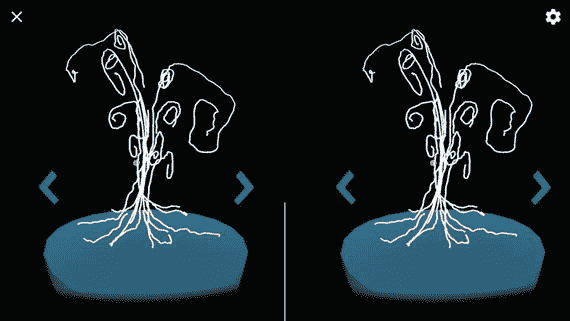

图 15-8。

Our VR drawing app in action!

## 到处飞

使用当前形式的 VR 绘图应用，我们可以用我们的目光指引笔画，并围绕水平方向旋转绘图，以从不同角度添加新的笔画。尽管这应该给我们的用户提供了很多可以玩的东西，我们仍然可以在许多不同的方面改进这个应用。

到目前为止，一个限制是我们停留在绘画讲台前的一个固定位置。例如，虽然我们可以通过移动我们的头部和绕水平轴旋转图形来改变我们的视点，但是我们不能更接近它。我们在前一章中看到了如何在 VR 中实现自由移动，因此我们可以在应用中应用该代码来实现这一功能。

因为我们想通过绘图创建一个飞越，所以当我们四处移动时，我们可以在我们的视图前面添加一对动画翅膀。这些翅膀，相对于我们的位置固定，将提供一个视觉参考，以帮助用户不感到迷失方向。

我们将回顾我们应该引入到先前版本草图的标签中的所有变化。让我们从清单 [15-4A](#Par40) 中的主选项卡开始。

```java
import processing.vr.*;

float angle;
boolean flyMode = false;
PVector flyStep = new PVector();

void setup() {
  fullScreen(STEREO);
  textureMode(NORMAL);
  createBase(300, 70, 20);
  createButtons(300, 100, 380, 130);
}

void calculate() {
  if (mousePressed) {
    if (leftButton.selected) angle -= 0.01;
    if (rightButton.selected) angle += 0.01;
    if (flyMode) {
      getEyeMatrix(eyeMat);
      flyStep.add(2 * eyeMat.m02, 2 * eyeMat.m12, 2 * eyeMat.m22);
    }
  }
  if (mousePressed && !selectingUI() && !flyMode) {
    updateStrokes();
  }
}

void draw() {
  background(0);
  translate(width/2, height/2);
  ambientLight(40, 40, 40);
  directionalLight(200, 200, 200, 0, +1, -1);
  translate(-flyStep.x, -flyStep.y, -flyStep.z);
  drawBase();
  drawStrokes();
  if (flyMode) drawWings();
  drawUI();
}

void mouseReleased() {
  if (resetButton.selected) {
    clearDrawing();
    angle = 0;
  } else if (flyToggle.selected) {
    flyToggle.toggle();
    if (flyToggle.state == 0) {
      flyMode = false;
      flyStep.set(0, 0, 0);
    } else {
      flyMode = true;
    }
  } else {
    startNewStroke();
  }
}

Listing 15-4A.Main Tab with Fly Mode Modifications

```

我们引入了几个额外的变量:一个`flyMode`布尔变量来跟踪我们是否处于飞行模式，以及实际的位移向量`flyStep`，当耳机按钮被按下时，我们通过沿着前进向量前进来更新它。此外，我们添加了一个环境光，这样即使翅膀没有接收到来自定向光源的直射光，它们也是可见的。

我们还必须在`mouseReleased()`中添加一些额外的交互处理。问题是，现在我们需要另一个 UI 元素来在正常的绘制模式和新的飞行模式之间切换。我们通过实现一个专门的切换按钮来实现这一点，该按钮有两个可选的图像来指示我们可以切换到哪个模式。这个切换按钮的位置不明显；当我们启动应用时，它可能就在我们眼前，但如果我们处于飞行模式，它就不可见，我们最终会迷失在虚拟现实中的某个地方。如果这个按钮在我们做一些特定的手势时总是可见的话会更好；比如抬头。如果切换按钮不受飞行运动的影响，并且始终位于摄像机位置的正上方，我们就可以实现这一点。清单 [15-4B](#Par43) 中的代码就是这样做的。

```java
Button leftButton, rightButton, resetButton;
Toggle flyToggle;

void createButtons(float dx, float hlr, float ht, float s) {
  ...
  PImage fly = loadImage("fly-icon.png");
  PImage home = loadImage("home-icon.png");
  flyToggle = new Toggle(-ht, s, fly, home);
}

void drawUI() {
  leftButton.display();
  rightButton.display();
  resetButton.display();
  noLights();
  flyToggle.display();
  if (!flyMode) drawAim();
}
...
boolean selectingUI() {
  return leftButton.selected || rightButton.selected ||
         resetButton.selected || flyToggle.selected;
}
...
class Toggle {
  float h, s;
  boolean selected;
  int state;
  PImage[] imgs;
  color[] colors;

  Toggle(float h, float s, PImage img0, PImage img1) {
    this.h = h;
    this.s = s;
    imgs = new PImage[2];
    imgs[0] = img0;
    imgs[1] = img1;
    colors = new color[2];
    colors[0] = #F2674E;
    colors[1] = #59C5F5;
  }

  void display() {
    float l = 0.5 * s;
    pushStyle();
    pushMatrix();
    getEyeMatrix(eyeMat);
    translate(eyeMat.m03 + flyStep.x - width/2,
              eyeMat.m13 + h + flyStep.y - height/2,
              eyeMat.m23 + flyStep.z);
    selected = centerSelected(l);
    beginShape(QUAD);
    if (selected) {
      stroke(220, 180);
      strokeWeight(5);
    } else {
      noStroke();
    }
    tint(colors[state]);
    texture(imgs[state]);
    vertex(-l, 0, +l, 0, 0);
    vertex(+l, 0, +l, 1, 0);
    vertex(+l, 0, -l, 1, 1);
    vertex(-l, 0, -l, 0, 1);
    endShape();
    popMatrix();
    popStyle();
  }

  void toggle() {
    state = (state + 1) % 2;
  }
}

Listing 15-4B.UI Tab

with Fly Mode Modifications

```

`Toggle`类类似于`Button`，但是它有两个图像纹理，每个图像对应一个切换状态。我们可以通过平移`to (eyeMat.m03 + flyStep.x - width/2, eyeMat.m13 + h + flyStep.y - height/2, eyeMat.m23 + flyStep.z)`使切换按钮总是在用户上方，这取消了我们在`draw()`中应用的平移，所以它被精确地放置在(`eyeMat.m03, eyeMat.m13 + h, eyeMat.m23)`，相机坐标加上沿垂直方向的位移`h`。

最后，清单 [15-4C](#Par46) 显示了我们在飞行模式下绘制的动画翅膀的代码。几何体非常简单:两个较大的旋转四边形用于翅膀，两个较小的矩形用于创建身体。

```java
...
void drawWings() {
  pushMatrix();
  eye();

  translate(0, +50, 100);
  noStroke();
  fill(#F2674E);

  beginShape(QUAD);
  vertex(-5, 0, -50);
  vertex(+5, 0, -50);
  vertex(+5, 0, +50);
  vertex(-5, 0, +50);
  endShape();

  pushMatrix();
  translate(-5, 0, 0);
  rotateZ(map(cos(millis()/1000.0), -1, +1, -QUARTER_PI, +QUARTER_PI));
  beginShape(QUAD);
  vertex(-100, 0, -50);
  vertex(   0, 0, -50);
  vertex(   0, 0, +50);
  vertex(-100, 0, +50);
  endShape();
  popMatrix();

  pushMatrix();
  translate(+5, 0, 0);
  rotateZ(map(cos(millis()/1000.0), -1, +1, +QUARTER_PI, -QUARTER_PI));
  beginShape(QUAD);
  vertex(+100, 0, -50);
  vertex(   0, 0, -50);
  vertex(   0, 0, +50);
  vertex(+100, 0, +50);
  endShape();
  popMatrix();

  popMatrix();
}

Listing 15-4C.
Drawing Tab

with Fly Mode Modifications

```

有了这些附加功能，我们可以切换到飞行模式来快速浏览我们的绘图，并切换回默认的绘图模式来继续绘图或开始一个新的绘图，我们可以在图 [15-9](#Fig9) 中看到一系列的步骤。

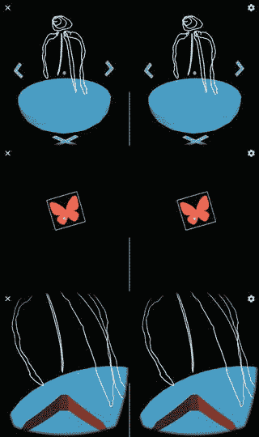

图 15-9。

Transition between draw and fly modes

## 最终调整和打包

我们已经有了一个简单但功能齐全的 VR 绘图应用！在这个过程中，我们遇到了 VR 开发特有的挑战:构建沉浸式 3D 环境，添加可以单独使用凝视访问的 UI 元素，以及在 VR 中自由移动。我们的应用利用一些技术来解决这些挑战，我们应该在未来的 VR 项目中进一步探索。目前，我们只需要做一些最后的调整，就可以在 Play Store 上发布绘图应用了。

### 介绍文本

当用户第一次打开我们的应用时，我们不能指望他们知道该做什么，所以一个好主意是提供一个介绍来解释体验的机制。我们应该让这个介绍尽可能简短，因为大多数用户不希望经历非常冗长或复杂的说明，一个成功的 VR 体验应该尽可能不言自明。

我们可以在眼睛坐标中绘制介绍页面，这样它就面向用户，而不考虑他们的头部位置，当用户按下耳机按钮继续时，它就会消失。清单 [15-5](#Par51) 显示了实现一个简单介绍的附加代码，结果如图 [15-10](#Fig10) 所示。

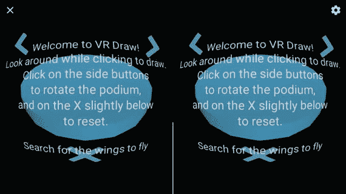

图 15-10。

Intro screen with some instructions on how to use the app

```java
import processing.vr.*;

float angle;
boolean flyMode = false;
PVector flyStep = new PVector();
boolean showingIntro = true;

void setup() {
  fullScreen(STEREO);
  textureMode(NORMAL);
  textFont(createFont("SansSerif", 30));
  textAlign(CENTER, CENTER);
  ...
}
...
void mouseReleased() {
  if (showingIntro) {
    showingIntro = false;
  } else if (resetButton.selected) {
  ...
}
...
void drawUI() {
  leftButton.display();
  rightButton.display();
  resetButton.display();
  noLights();
  flyToggle.display();
  if (showingIntro) drawIntro();
  else if (!flyMode) drawAim();
}

void drawIntro() {
  noLights();
  eye();
  fill(220);
  text("Welcome to VR Draw!\nLook around while clicking to draw.\n" +
       "Click on the side buttons\nto rotate the podium,\n" +
       "and on the X slightly below\nto reset.\n\n" +
       "Search for the wings to fly", 0, 0, 300);
}
...

Listing 15-5.Adding an Intro Screen

```

intro 屏幕的逻辑如下:我们使用`showingIntro`变量来指示我们是否应该绘制 intro，并默认将其设置为`true`。一旦用户释放第一个按钮，介绍就会消失。

### 图标和包导出

创建应用的最后步骤是设计图标，在清单文件中设置最终的包名、标签和版本，然后导出准备上传到 Play Store 的已签名包，所有这些我们在第 [3](03.html) 章中都有介绍。

至于图标，我们需要全套，包括 192 × 192 (xxxhdpi)、144 × 144 (xxhdpi)、96 × 96 (xhdpi)、72 × 72 (hdpi)、48 × 48 (mdpi)、32 × 32 (ldpi)版本，如图 [15-11](#Fig11) 所示。

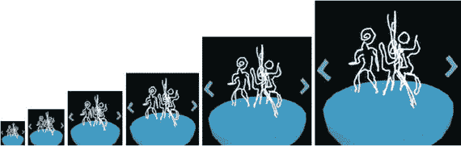

图 15-11。

App icons in all required resolutions

导出的包的清单文件应该包括唯一的完整包名、版本代码和名称，以及在 UI 中用于识别应用的 Android 标签。下面是一个填充了所有这些值的示例:

```java
import processing.vr.*;
<?xml version="1.0" encoding="UTF-8"?>
<manifest xmlns:android="http://schemas.android.com/apk/res/android"
          android:versionCode="1" android:versionName="1.0"
          package="com.example.vr_draw">
    <uses-sdk android:minSdkVersion="19" android:targetSdkVersion="25"/>
    <uses-permission android:name="android.permission.VIBRATE"/>
    <uses-permission android:name=
                     "android.permission.READ_EXTERNAL_STORAGE"/>
    <uses-feature android:name=
                     "android.hardware.sensor.accelerometer"
                     android:required="true"/>
    <uses-feature android:name="android.hardware.sensor.gyroscope"
                  android:required="true"/>
    <uses-feature android:name="android.software.vr.mode"
                  android:required="false"/>
    <uses-feature android:name="android.hardware.vr.high_performance"
                  android:required="false"/>
    <uses-feature android:glEsVersion="0x00020000" android:required="true"/>
    <application android:icon="@drawable/icon"
                 android:label="VR Draw"
                 android:theme="@style/VrActivityTheme">
        <activity android:configChanges=
                  "orientation|keyboardHidden|screenSize"
                  android:name=".MainActivity"
                  android:resizeableActivity="false"
                  android:screenOrientation="landscape">
            <intent-filter>
                <action android:name="android.intent.action.MAIN"/>
                <category android:name="android.intent.category.LAUNCHER"/>
                <category android:name=
                          "com.google.intent.category.CARDBOARD"/>
            </intent-filter>
        </activity>
    </application>
</manifest>

```

## 摘要

我们刚刚完成了书中的最后一个项目！这是最复杂的，但希望它有助于认识到创建虚拟现实应用所涉及的挑战，并学习如何让用户以直观的方式与他们的虚拟现实环境进行交互。通过解决此类应用中涉及的挑战，我们发现了如何应用 Processing 的 3D API 来实现身临其境的图形和交互。现在你有工具来创建新的和原创的 Android 应用，不仅适用于 VR，还适用于手表、手机和平板电脑。享受将你的想法变为现实的乐趣吧！