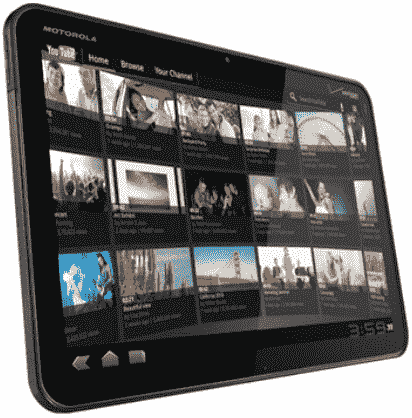

# 一、为什么是安卓？哪个安卓？

如果你正在阅读这本书，很有可能你已经听说过 Android，你应该知道。尽管从未真正成为家喻户晓的名字，但看到 Android 操作系统自发布以来的爆炸式增长，意义重大。要知道，在如此短的时间内，Android 在 iPhone 和 iPad 等设备上已经超过了苹果的 iOS，这是非常了不起的。所以，是的，你可能听说过 Android。也许你听说过它是“机器人”或者三星、摩托罗拉或 HTC。您可能正在寻找一种将 Android 融入日常生活的方式。也许你厌倦了无论去哪里都带着你的大笔记本电脑。也许你的智能手机屏幕太小了，不能做你需要它做的一切。阅读电子邮件、浏览网页，无论你在做什么，你都已经决定是时候使用平板电脑了。

Android 平板电脑不适合特定的外形、个性类型或一般用途。有一款适合各种人的安卓平板电脑。当你得到一台 Android 平板电脑时，你得到的是一张潜力无限的白纸。你的安卓平板电脑可以是复杂的，也可以是简单的，由你选择。Android 平板电脑可以仅仅是你图书馆的存储设备，也可以是你举行网络会议、玩视频游戏、甚至凝视星空的移动指挥中心。在选择购买平板电脑时，你会选择 Android 平板电脑，因为它是适合你的设备。

这本书将为你提供从上到下的指南，让你从众多安卓平板电脑中选择一款。在选择最适合你的设备时，你会得到一些帮助，看看最适合你需要的应用，甚至花一些时间优化你的平板电脑，以充分利用它。将您的 Android 平板电脑发挥到极致！是为每一种对安卓平板感兴趣的人编写的。无论你是技术大神、大学生、足球妈妈还是商业人士，这本书都将帮助你做出明智的决定，并充分利用你的下一个设备。

将您的 Android 平板电脑发挥到极致！涵盖从选择最适合您的设备到提供维护技巧、延长电池寿命以及确保您的平板电脑经久耐用等方方面面。我们将深入“扎根”您的 Android 平板电脑，以及如何不仅实现令人兴奋的新功能，而且获得您需要的工具，以确保您的 Android 平板电脑始终处于谷歌最新、最棒的前沿。我们将包括利用谷歌开发工具的简短教程，并向您展示您需要的一切，以确保您所有的朋友、同事和邻居都准备好为自己获得一个。添加*将您的 Android 平板电脑发挥到极致！*放在你的书架上，准备好充分利用你的平板电脑。

### 安卓:简史

每个人都知道 Android 是“谷歌操作系统”，但这并不完全正确。Android Inc .曾经是自己的公司，Android 是它的心血结晶。2003 年，这家初创公司计划开发一款能够感知用户位置和偏好的智能手机。当时，这是技术根本没有做到的事情，尽管今天基于位置的服务是一种全球趋势。

Android 是创新者集思广益的绝佳例子。然而，作为一家小型初创公司，Android 意识到，它向世界做出改变的速度会慢得多。该公司需要一种强有力的催化剂。我们想不出有哪家公司比谷歌更善于获取独特的创意并将其应用于日常生活。2005 年，当安卓公司只有 22 个月大的时候，它被谷歌收购了。谷歌还没有准备好向大众推出什么东西。有一个更大的计划正在进行中，这将需要许多公司的资源来解决电话世界中一些更基本的问题。

#### 开放手机联盟

2005 年，手机世界有点混乱。每个手机制造商都有不同的插头来给他们的手机充电，而且大多数插头都会随着该制造商新设备的发布而改变。手机的必备功能是摄像头，而电子邮件是大多数人都没有的功能。如果您的设备上有额外的内容，它是由运营商控制的。铃声、壁纸，也许还有几个只在你的手机模型上运行的游戏——基本上就是这些了。3G 在美国大部分地区还是相对较新的事物，我们的手机实际上只是手机。

当谷歌收购 Android 公司时，它的意图是让你随时都能轻松地使用互联网。谷歌主要是一个搜索引擎，该公司会赚很多钱，这样你就可以随时搜索你正在寻找的东西。尽管如此，还是有问题。要想成功，谷歌不能只在一个设备上提供这些功能，当然也不能在一个运营商上提供。Android 需要让尽可能多的人使用，因此谷歌联系了各种类型的公司，成立了开放手机联盟(OHA)。OHA 成立于 2007 年底，由来自世界各地的 34 家公司组成。这些公司各种各样，包括 T-Mobile 和 Sprint 等运营商，PacketVideo 和易贝等软件公司，摩托罗拉和 HTC 等设备制造商，以及英特尔和英伟达等芯片组制造商。我们的目标是让这些公司走到一起，合作开发 OHA 的每个人都能直接受益的解决方案。

来自世界各地的大公司将他们的知识和技能结合到一个项目中，只会给全世界带来直接和间接的好处。例如，看看今天大多数功能手机和智能手机。你会看到 90%的人使用相同的充电插座为他们的设备供电，其中许多人还将设备连接到你的电脑。只有通过这种规模的合作，我们才能看到这样的变化。

谷歌也不满足于仅有 34 家公司。直到今天，开放手机联盟仍在不断壮大，有 70 多家公司参与其中。这种规模的合作需要的不仅仅是公司之间的交流。合作需要不受繁文缛节和所有权的束缚。本着这种合作的精神，来自开放手机联盟的一切都是开源的。

什么是开源？

描述开源有很多方法。这个概念最初是为了让程序员社区能够快速有效地协作而设计的。生成的任何内容都可以简单地与参与项目的任何人共享，并且当项目被发布供使用时，用于创建项目的代码公开供其他任何人使用和帮助。

基本上，任何开源的东西都会被发布，这样拥有所需技能的人就能够改进这些代码，从而允许开源项目在最初创造这个想法的社区之外不断发展。

ANDROID 开源项目

本着真正的开源精神，谷歌维护着一个庞大的网站，专门为任何想下载和构建自己的 Android 的人服务；它还为开发者提供了一个提交系统。当开发者想出一个新的 Android 特性时，开发者可以将他们的修改提交给 Google。这个庞大的变更提交集合由谷歌员工全职负责，符合他们标准的功能将被添加到下一个版本的 Android 中。

这种增长方法，结合谷歌自己的程序员团队，允许在非常短的时间内构思、编写和实现新功能。似乎这个下载和提交系统还不够，网站的社区部分提供了与其他开发者交流的多种方式，可以通过论坛、Google Group、邮件列表或 IRC。这种合作努力确保了即使是半生不熟的想法也能开花结果，并保证 Android 始终处于领先地位，为“下一件大事”做好准备。如果你有兴趣加入 Android 开发者社区，请前往 [`http://source.android.com`](http://source.android.com) 。

机器人“吉祥物”安迪

由于 Android 操作系统可以被任何人操作，它不会总是在每个设备上看起来完全一样。解决这个问题的一个快速而异想天开的方法是给 Android 一个图标，帮助它脱颖而出。在许多现在运行 Android 的设备中，你会看到安迪，这个绿色的小机器人(如图 Figure 1–1 所示)。它有好几个名字，在谷歌校园里被称为“bugdroid”和“Andy”。这个图标已经在操作系统中的几个地方使用过，甚至在引导装载程序中玩滑板。

**注意:**boot loader 是操作系统内部的一部分，负责在 Dalvik 虚拟机中加载 Android。这在第十二章中有更详细的介绍。

**图 1–1。** *安卓图标:bugdroid*

安迪已经在许多设备上出现，并发展了一批与操作系统本身相匹敌的追随者。有数不清的网站有这个角色的纪念品，比如贴纸和贴花，而更深入的网站提供从 T 恤衫到角色外套的所有东西。2009 年，一大群 Android 粉丝聚集在德克萨斯州的奥斯汀，参加一个以 Android 为中心的聚会，这个庆祝活动现在每年都举行，有成千上万的观众。虽然谷歌确实出售自己的印有绿色小机器人的授权衬衫和配件，但粉丝制作的物品从无檐帽到挂绳，甚至是活动人偶的需求都要大得多。

#### T-Mobile G1

2008 年 10 月，在 Android 概念提出整整五年后，但在开放手机联盟成立仅一年后，第一款 Android 设备诞生了。在一次大规模的合作中，T-Mobile G1(如图图 1–2 所示)首先在美国发布，然后于 2009 年初在全球发布。这款设备被广泛视为谷歌对 2007 年首次发布的苹果 iPhone 的回应。G1 提供了一个隐藏在屏幕下的物理键盘，直到滑出使用。将屏幕滑开以露出键盘的铰链机制具有创新性，是开始使用类似技术的一长串未来设备中的第一个。G1 是最初的 Android 设备，它带来了世界各地的公司将 Android 整合到他们的设备产品中的愿望。

**图 1–2。**??【T-Mobile】G1

#### 摩托罗拉 Droid

正如谷歌最初的目标一样，美国的每一家运营商和世界各地的许多运营商很快就计划在其产品线中提供 Android。T-Mobile 已经计划在 2009 年再发布四款 Android 手机，领先于 Sprint 和美国电话电报公司，后者已经迅速采用了自己的 Android 部署策略。威瑞森是最后一个参与进来的，但他们计划一旦决定加入，就对 Android 进行更大规模的投入。

摩托罗拉是开放手机联盟的创始成员之一，他已经将摩托罗拉 Cliq 发布给了 T-Mobile。摩托罗拉与威瑞森建立了合作伙伴关系，以帮助塑造安卓大受欢迎的未来。自 2005 年推出 RAZR 以来，摩托罗拉还没有一款真正成功的手机，它正迅速走向破产，需要一次成功。2009 年 11 月，威瑞森和摩托罗拉发布了摩托罗拉 Droid，这似乎是维持公司运营的最后一搏。这款机器人只配有最新版本的安卓操作系统，它的名字使用了卢卡斯影业的商标，卢卡斯影业是《星球大战》系列的所有者。

Droid 受到了爆炸性销售的欢迎，是 Android 在 2009 年比 2008 年增长 900%以上的驱动力之一。今天，摩托罗拉仍然是最受欢迎的 Android 设备系列的制造商，甚至发布了 droid 系列的多个续集。今天，Droid 系列有 7 款不同的手机，都是威瑞森独有的。

#### 谷歌 Nexus One

为了鼓励 Android 应用的开发，谷歌已经采取了一些措施来鼓励开发者开发更大、更好、功能更丰富的应用。可以说，谷歌采取的最重要的一步是 Nexus One 的发布(如图图 1–3 所示)及其 Nexus 系列设备的开始。Nexus One 的初衷是双重的。谷歌希望提供一款不依赖运营商的设备。它想要一款你可以从谷歌购买的设备，并将其添加到你选择的网络中，而不会被合同所束缚，也不必遵守运营商关于设备政策的服务条款。该设备也非常容易让开发者测试应用，提供了一个强大的设备，以确保它可以在所有 Android 手机上运行。此外，当 Android 操作系统有更新时，它会首先发布到 Nexus 系列，以确保开发者有时间进行任何调整或为他们的应用添加新功能。

**图 1–3。***Nexus One 和 Nexus S*

**注:**Nexus 系列手机都运行 Android，就好像是通过 Android 开源项目编译的一样。这通常被称为“股票安卓”或“谷歌体验”本章的第二部分将涵盖更多关于“Android 的味道”

迄今为止，还没有一款“Nexus”平板电脑。谷歌与许多不同的公司合作将其设备推向市场，但没有像其手机那样与 Nexus 品牌合作。如果谷歌真的决定发布一款 Nexus 平板电脑，它将像它的手机一样，带着最新版本的安卓系统上市，在更新发布到其他平板电脑之前，只适用于该设备。

#### iPad

到 2010 年，很明显，手机市场被以下两种选择所主导:要么选择美国电话电报公司的 iPhone，要么选择美国所有网络和世界各地其他几十个网络中各种形状和大小的几十种安卓设备中的任何一种。单单是可用性和选项就很容易理解为什么安卓如此迅速地超越了苹果设定的标准。市场份额之战越来越近，2010 年初，苹果做了一些改变，将 iPhone 搬上了大屏幕。

iPad(如图图 1–4 所示)被誉为革命性的设备，实现了前所未有的成就。它将已经非常受欢迎的智能手机的功能结合到一个 10 英寸的屏幕上，让观众不仅能够享受他们最喜欢的应用，还能够非常高效地工作。平板电脑的概念并不新鲜。平板电脑在过去已经尝试过几次，运行 Windows，Linux，甚至更早的苹果牛顿平板电脑。以前的问题是软件真的不支持设计。我们都习惯使用的桌面操作系统没有触摸专用的设计。所以，现在苹果平板电脑诞生了；Android 以和智能手机世界一样的方式回应才有意义。

**图 1–4。**??【苹果】iPad

Android 平板电脑提供了与 Android 手机相同的功能，就像 iPad 与 iPhone 的关系一样。两款平板电脑操作系统的关键区别在于应用在设备之间的交互方式。在每台 Android 设备上，用你的账户登录 Play Store，你就可以访问任何你已经付费的应用。当你安装该应用时，它在平板电脑上的运行方式与在手机上的运行方式相同。iPad 上就不是这样了。你必须购买一个支持大屏幕的“iPad 专用”应用。如果你安装了一个为 iPhone 设计的应用，它在屏幕上所占的空间只会和在 iPhone 上一样多。

### 哪款安卓平板适合我？

就像 Android 手机一样，Android 平板电脑有各种形状和尺寸，为各种不同类型的用户设计。在考虑你的 Android 平板电脑时，重要的是首先了解你想用它做什么。你对大量阅读感兴趣吗？你会经常打字吗，比如在学校或者办公室？你是那种经常玩电子游戏的人吗？你的平板电脑会生活在你的客厅里，控制你的家庭影院吗？您会随身携带平板电脑吗？你的平板电脑应该为你的生活和需求定制，你不应该教自己如何适应其他东西。

#### 屏幕类型

可以说，Android 平板电脑最重要的部分是屏幕。如果你不习惯使用你的屏幕，你有什么样的处理器或者它有多少内存并不重要。如果你不能阅读文本，如果你不能轻松地控制你的应用，因为屏幕不是你所需要的，它有什么好处呢？关键在于你如何使用这个设备。

*   电容式触摸屏:这是目前智能手机和平板电脑等设备中最常见的一种屏幕。这些屏幕需要手指触摸才能控制设备，由玻璃或特殊塑料制成。电容屏会增加设备的价格。
*   电阻式触摸屏:这种类型的屏幕常见于“廉价平板电脑”或快餐店使用的屏幕。它们的制造成本比电容屏低得多，而且精确度也低得多。像这样的屏幕不适合玩游戏，但是如果你有指甲或者经常戴手套的话就很好了，因为它们不需要手指触摸。像这样的设备通常配有一个小的塑料手写笔，使它们更容易使用。
*   *有机发光二极管显示器*:这种显示器将向您展示丰富、鲜艳的色彩，非常适合游戏、电影和图片。然而，由于显示器的结构，文本等内容的显示不如其他屏幕类型，这使得它更难用作电子书。
*   液晶显示器:这是电脑显示器中最常见的一种显示器。这个屏幕上的这些颜色不如 AMOLED 屏幕好，但文字看起来更好。这些屏幕是非常棒的全能屏幕。
*   *像素 Qi 显示*:这是一种比较新的屏幕；这些显示器既能显示明亮丰富的色彩，也能转换成 E-Ink 显示器。这项技术为欣赏媒体提供了最佳的显示方式，也可以像 Kindle 一样作为低功耗显示器来查看文本。这些显示器通常更贵，但提供了迄今为止最好的体验。

这些技术都适合一个用例。你将看到的最常见的技术组合是有机发光二极管显示器上的电容式触摸屏。这些是典型的高端设备，如三星 Galaxy Tab。

#### 屏幕尺寸

很有可能你的手和其他人的大小不一样。由于这一严酷的现实，你可能不会像其他人一样舒适地使用相同尺寸的设备。幸运的是，Android 允许制造商发布各种尺寸的设备供我们使用。目前，安卓平板电脑有四种典型尺寸。

*   *不到 7 英寸*:这些设备填补了智能手机和电脑之间的空白，因为迄今为止最大的智能手机/平板电脑混合体是三星 Galaxy Note 和 5 英寸的戴尔 Streak。这些设备就像手机一样便于携带。如果 GPS 包含在这些设备中，它们将成为很好的车载设备，可以提供娱乐和导航。
*   *7 英寸平板电脑*:这种外形非常适合对便携式电子书阅读器、网络浏览器或媒体播放器感兴趣的用户。七英寸的设备非常适合放在后口袋、钱包或西装外套的口袋里。这些设备通常可以在商业环境中工作，带有可连接的物理键盘或吸盘支架，以便在车内欣赏媒体或导航。有些还配备了添加更多内存的功能，或者连接到您的电视，在家庭影院中欣赏您的媒体。
*   *8 至 10 英寸平板电脑*:这些较大的设备通常用于在更大的屏幕上欣赏媒体、浏览网页和玩游戏。它们不太便携，但通常具有与传统笔记本电脑更接近的功能，如 USB 端口、专用视频输出插槽等。这些装置的成本通常是该组中最高的，因为它们的制造涉及额外的成本。

**注:**目前市场上没有大于 10 英寸的平板电脑，但天空是极限，所以人们认为更大的设备出现只是时间问题。

#### 互联网接入

任何平板电脑都能够以某种形式做的一件非常棒的事情就是连接互联网。谷歌首先是一家网络搜索公司，因此 Android 将由网络驱动是很有道理的。这并不要求您必须连接到互联网，但是当您连接到互联网时，您就拥有了一个更强大的设备。通过将你的平板电脑连接到互联网，你可以立即将 Android 与谷歌所有基于互联网的服务结合起来，你的平板电脑就会与谷歌所谓的*云*保持同步。

谷歌的云是世界各地强大计算机的大规模集合。这些电脑的工作是存储你给你的安卓平板电脑的所有信息。可能是联系人列表、图片、文档、电子邮件等等。谷歌将所有这些信息保存在你的平板电脑和云中。这给了你一个独特的机会，让你可以随时获取这些信息。也许你把平板电脑忘在家里了，但需要知道你朋友的手机号码？从任何计算机登录到您的 Gmail 帐户，您的所有联系人都在那里。谷歌的 Picasa 服务在线存储你的照片，并允许你在任何地方访问它们。Play Books 可以让你阅读数百万本书中的任何一本，而且它可以保存你现在在哪一页。现在，让我们假设发生了非常糟糕的事情，你的平板电脑在一本书的中间被毁坏了。如果你走向电脑、手机，甚至另一台平板电脑并登录，谷歌会把你的在线体验带回到你离开时的样子。

##### Wi-Fi 还是 3G/4G？

正如我们所看到的，连接到互联网可以是一个巨大的帮助，但重要的是要决定是否值得你一直连接到互联网。我们周围有很多地方，尤其是在大城市，可以让你免费连接到公共无线互联网，甚至你家里也有无线互联网，这可能是一个很好的赌注。以这种方式将平板电脑连接到互联网不会增加您的任何费用，因为它使用的是您已经向提供商付费的现有互联网。此外，许多 Android 手机能够生成无线网络或移动热点，让您能够与平板电脑共享移动互联网。

用你的手机创建一个移动热点对你的电池寿命是苛刻的。除非你有能力把手机插在某个地方充电，否则你的手机不太可能持续一整天都这样。同样的互联网服务，你可以从你的手机上接收到，但也可以放在你的平板电脑上，让你在任何地方都能上网。这项服务不是免费的，通常意味着您需要为您的手机套餐中的一项单独服务付费。如果您从手机运营商处购买了平板电脑，您可能需要向您的帐户添加新的数据套餐。

您在这里做出的选择实际上是便利性与价格的选择。如果你觉得没有必要为你的平板电脑支付额外的月费，或者如果你只是靠近 Wi-Fi 网络，你永远不会使用该功能，你应该确保你的平板电脑在购买时是“仅 Wi-Fi”的。这通常会降低平板电脑的成本，因为它不具备使用移动网络的能力。

##### 关于 4G，你需要知道什么

如果你选择给自己买一台连接移动网络的平板电脑，你可能已经听说过一两个关于 4G 的东西。重要的是，你要准确理解这意味着什么，与这种更快技术相关的成本，以及你是否获得了最好的 4G 服务。

在您进行任何购买之前，您需要联系您将向其购买服务的运营商，并确保 4G 服务在您经常旅行的地区以及您居住的地方可用。一旦你发现你所在的地区是否有 4G 服务，了解你选择的运营商提供的是哪种“4G”服务是很重要的。根据您所在的地区，有几种选择。

*   LTE :这是长期演进的首字母缩写；这项技术是从当今世界使用的现有 3G 网络发展而来的。这种网络能够以低延迟实现高速度，使其性能可与许多家庭互联网服务相媲美。LTE 网络能够不断升级，速度比现在快得多。
*   HSPA+ :这项技术是全球许多 GSM 运营商提供的现有 HSPA 服务的升级。这种技术是一种改进，因为它提高了速度，但该技术也存在与 HSPA 相同的延迟问题，当您离开广播点的半径时，其性能会迅速下降。
*   *WiMax* :第一批 4G 网络之一，WiMax 在美国仅由 Sprint 部署。WiMax 在许多地方被认为与 HSPA+一样快，并且受益于在美国大多数主要城市都可以使用。

4G 的每种实现方式都略有不同，但如果你的平板电脑支持这些无线技术中的一种，你将能够以更快的速度访问互联网，让你更好地利用视频聊天、视频编辑、流媒体和其他任何你可能找到的功能。

### 了解 Android 用户界面选项

Andy Rubin，Android 公司的首席执行官，现在是谷歌的工程副总裁和 Android 项目的负责人，最近被引用关于谷歌是如何看待 Android 的。

> “我们认为自己是安卓的守护者。有了开源，你真的不知道会发生什么。创新不仅仅发生在这栋大楼里，它就发生在我们周围。”

Android 是开源的，所以任何人都可以获得一个副本，并添加他们认为必要的功能。并不要求通过 Android 开源项目向谷歌提交变更。事实上，现在手机上有几个主要的 Android 版本，很快平板电脑也会有。这些版本由不同的制造商制造，试图改善 Android 用户体验或添加制造商在以前的智能手机上提供的功能。根据设备制造商的不同，这会导致用户体验略有不同，允许您根据自己感兴趣的功能进行选择。

制造商并不是唯一知道“什么对用户最好”的人。美国的一些运营商已经开发了只适用于在他们网络上销售的设备的软件。Sprint 和威瑞森是这些发展中最著名的。SprintID 服务允许用户用数百个选项中的任何一个来快速地为他们的设备设置主题，并且预先安装了任何可以使用该主题的应用。Sprint 上的 NFL 应用也是一个独家应用，为用户提供所有直接来自 NFL 的最新足球统计数据和视频，但它是 Sprint 的独家应用。威瑞森的 VCast 服务是一种点播媒体服务，最初是为功能手机设计的，现在只提供给威瑞森无线客户。

承运人和制造商之间的这些“排他性”条款并不是不平等的。像 Android 生态系统中的许多东西一样，Play Store 中的一个应用已经开发出来，以匹配该服务提供的功能。人们常说，没有两个 Android 设备看起来完全一样，因为你可以通过各种方式定制你的设备，我们将向你展示如何定制。然而现在，我们可以回顾一下 Android 的一些更大的“味道”。

#### HTC Sense

Sense 是 HTC 多年软件发展的结果。该公司花了大量时间专注于用户体验，尽管操作系统并不完善。当被给予 Android 这样一个开放的平台来塑造时，HTC 的软件团队开始创造一种用户体验，这种体验侧重于高度风格化的用户界面，使用大型的整页小部件来访问功能。被修改的也不仅仅是 Android。为了提供一个完整的解决方案，HTC 已经进入了几乎每个核心应用，并对其进行了修改以增强用户体验(见图 1–5)。

**图 1–5。**??【宏达传单】安卓平板

*   桌面时钟(Desk clock):可以说 Sense 的显著特征是一个大的时钟部件，通常占据主屏幕主页的上半部分。除了用非常大的字体显示时间，这个小工具还在屏幕上显示你所在地区的当前天气。当你解锁你的手机时，天气将会在小工具上显示出来，并显示在整个手机上。如果下雨，雨滴会落在你的屏幕上；当天气晴朗时，阳光将从小部件的中心射出。这些动画通常只持续一会儿，可以通过触摸屏幕随时中断。
*   这是一个全页的小部件，如果你已经将一个联系人和他们的联系信息相关联，它会显示你的联系人和他们的图片。这个小工具将获取你与他们的联系方式相关的任何信息，包括他们对 Twitter 或脸书等服务的最新更新。
*   Friendstream 作为一个应用和一个小工具，Friendstream 将你所有的社交网络服务，如 Twitter、脸书、MySpace 等联系在一起，并将它们组织到一个应用中进行滚动，而不是需要单独访问这些服务。如果你想在这些服务中发布一些东西，你可以在应用中这样做。
*   *音乐* : Sense 的音乐应用看起来与“股票”Android 非常不同，为用户提供了可视化导航专辑的能力，而不仅仅是向下滚动播放列表。此外，HTC Sense 的锁定屏幕中嵌入了暂停歌曲或跳过曲目的功能，允许您在不解锁手机和导航到音乐应用的情况下控制音乐。
*   *相机*:相机应用已经以菜单图标为主题，可以更容易地快速调整相机设置，从相机切换到摄像机，并翻转到前置相机。相机应用还增加了其他功能，例如当手机打开时，自动将图片类型从纵向旋转到横向，以及相机效果，如棕褐色和黑白。

HTC Sense 的高度风格化是有代价的。Android 不断发展的本质是每六个月发布一次功能更新，包括 Android 开源项目的最新版本。HTC Sense 设备不会收到这些更新，直到它们被 HTC 格式化和修改，导致 Sense 设备在某些情况下落后多达三个月。一旦有了更新，HTC 就向其设备发布 OTA 更新，以实现新功能。

#### 三星 TouchWiz

三星还大幅修改了其 Android 设备的版本，以便提供一种它认为对用户更好的解决方案。像 SenseUI 一样，TouchWiz 在 Android 之前被三星使用，在世界上的一些地方仍然被用在其 BADA 平台上。TouchWiz(如图图 1–6 所示)结合了许多流行用户界面中的流行视觉元素。

**图 1–6。** *三星生产的平板电脑 Touchwiz】*

*   *编号页面*:与传统或“股票”主屏幕不同，当按下 home 按钮时，中心页面就是登录页面，TouchWiz 包括一个经过修改的页面系统，允许选择任何页面作为主页面。此外，通过点击主屏幕顶部的数字点，可以很容易地在页面之间快速跳转。
*   定制启动器:传统上，启动器按字母顺序组织你的应用，并允许你垂直滚动应用列表。Touchwiz 将应用水平对齐，因此您可以左右拖动手指来查看您的应用。此外，应用可以按照你想要的顺序放置在启动器中，而不是按字母顺序。应用图标以彩色背景显示，允许它们以统一的形状和大小存在。

**注意:**touch wiz 中启动器两侧的图标是可替换的。通过长按启动器左侧或右侧的图标，你可以有效地将应用释放出来，放在主屏幕上或垃圾桶中，然后送回应用抽屉。你可以把任何应用放在启动器的任何一边。

*   定制小部件:所有 TouchWiz 设备都包括社交小部件，它将你的 Twitter、Myspace、脸书等整合到你的主屏幕上的一个可滚动提要中，还有一个每日报告小部件。这个小部件将新闻源、天气、股票等信息放入一个小部件供您访问。

与 SenseUI 一样，TouchWiz 必须完全适应才能更新到下一个版本的 Android，使其与谷歌的更新周期不同步。当发布更改时，三星工程师必须实现 TouchWiz 功能，并在发布更新之前彻底测试它们。迄今为止，三星是唯一一家没有通过 OTA 发布设备更新，而是让消费者通过电脑手动安装的公司。此过程需要 Windows PC 来完成。

#### 亚马逊 Kindle Fire

许多最初的亚马逊 Kindle 用户希望他们神奇的电子书阅读器能做得更多一点。2011 年 11 月，亚马逊发布了基于安卓系统的 7 英寸平板电脑 Kindle Fire(见图 1–7)。

亚马逊对 Fire 上使用的 Android 版本进行了大幅修改，以至于它没有谷歌其他版本的 Android 所包含的任何功能。亚马逊已经用自己的版本取代了这些功能。与大多数 Android 平板电脑不同，亚马逊不会被迫发布最新版本的 Android，而且只有在亚马逊选择这样做的情况下，Android 平板电脑现有的许多功能才会被添加。

*   *亚马逊应用商店*:取代 Android 设备的 Play Store 是亚马逊维护和控制的应用商店。区分亚马逊应用商店和 Play 商店的重要特征之一是一个免费的应用。
*   *亚马逊电影和音乐*:Amazon.com 上所有可供租赁或购买的电视节目、音乐和电影都可以在 Kindle Fire 上找到。拥有亚马逊 Prime 账户的 Amazon.com 用户可以从 Kindle Fire 上获得免费的流媒体内容。
*   *亚马逊 Silk 浏览器*:取代股票 Android 浏览器，亚马逊的 Silk 浏览器是为 Kindle Fire 定制的，让用户访问复杂网站的速度比股票 Android 手机浏览器快得多。

**图 1–7。**亚马逊 Kindle Fire

#### 库存安卓 3.0(蜂巢)

Android 3.0 是第一个专门为超过智能手机典型尺寸的设备设计的 Android 版本。Android 3.0 被称为谷歌字母版本命名系统的一部分，是市场上大多数 Android 平板电脑的基础，也将是本书大部分内容关注的平台。谷歌的意图是既要为平板电脑提供增强的体验，又不要偏离智能手机优化的设计太远，以至于有一个巨大的学习曲线。然而，有一些显著的差异创造了非常不同的用户体验(见图 1–8)。

**图 1–8。** *安卓 3.0“蜂巢”*

*   主屏幕上的更多空间:3.0 的设计让你的主屏幕上的每一页都能够容纳比手机上多得多的内容。在 4 英寸的屏幕上，让一个小部件占据整个页面是有意义的，但这种设计在 7 英寸或 10 英寸的屏幕上就没那么有用了。现在，如果你能在一个页面上并排放上三四个全屏的小部件，那将会给你带来更大的生产力提升。
*   *专用多任务按钮* : Android 3.0 在设计上不需要“返回”或“主页”的物理按钮，而是用屏幕上的按钮来代替。由于这一变化，你不能再长按 home 键来访问你最近打开的应用。现在，这种能力已经被赋予了自己的按钮，位于 home 和 back 按钮旁边，用于快速访问。
*   *优化的 GApps*:Android 3.0 SDK 中包含了为更大屏幕优化您的应用所必需的工具。为了给你提供例子并优化他们自己的应用，谷歌修改了其 Gmail 和谷歌日历应用，以利用房地产的增长，提供了一个版本的 Gmail，它看起来更像电脑上的传统邮件客户端(见图 1–9)。

**图 1–9。**??【运行安卓 3.0 的摩托罗拉 Xoom

*   谷歌地图重访:为了让谷歌地图在任何环境下都能更快地加载，并为导航体验提供更多功能，谷歌地图进行了一点翻新。在谷歌地图中缩小到地面，现在会显示出 3D 导航体验，当你缩小到足够远时，建筑物就会出现在你面前。城市的 3D 渲染允许更快的识别和导航，而不需要非常快的互联网连接或使用太多的处理能力。
*   *新的相机界面*:证明了这么多屏幕可以做这么多事情，Android 的相机应用已经过调整，因此您可以快速更改设置来拍摄照片。屏幕右侧是一系列环，里面有菜单选项，允许您保持设备不动，并随时进行更改。
*   桌面质量的浏览器:谷歌开发了自己的浏览器 Chrome。Android 内部的浏览器不叫 Chrome，但现在看起来确实很像。添加了在浏览器中快速添加和操作“标签”的功能，这样您就可以在浏览器中打开多个主题，并能够在它们之间快速切换。此外，还增加了一个类似 Chrome 浏览器的“匿名”模式，允许你在不保存密码或不留下任何浏览记录的情况下进行浏览。这使你能够将平板电脑交给朋友，而不必担心你不小心保存了他的密码。
*   谷歌电影工作室(Google Movie Studio):作为谷歌提供的应用套件的新成员，电影工作室允许你用平板电脑、手机或相机拍摄照片或视频，并在平板电脑上编辑成视频。Movie Studio 提供了诸如文本插入、音乐曲目以及交互式平移、缩放和淡入淡出等功能。谷歌电影工作室充分利用了平板电脑大小的屏幕的功能和移动性，并允许您将这些电影立即发布到 YouTube。
*   支持更强大的处理器:在过去的几年里，移动世界经历了一些令人印象深刻的发展。虽然移动计算不如传统台式机或笔记本电脑强大，但这一差距正在迅速缩小。如果你手中的手机只不过是一台微型电脑，那么有理由认为有人会希望他们的平板电脑功能更强大一点，谷歌已经考虑到了这一点。双核处理器，在设计上类似于你在传统电脑上看到的，只是更小，提供必要的能力来做一些事情，如看电影和在线聊天，同时将照片库上传到脸书。

#### 安卓 4.0“冰淇淋三明治”

谷歌采用了 Android 3.0 的所有特性和功能，并发布了数千个非常小的变化，以创建一个完美的新操作系统。如图图 1–10 所示，Android 4.0 已经进行了全新的视觉设计，以提供更优雅的外观和感觉。除了视觉上的增强，Android 4.0 在速度和电池寿命方面都有巨大的性能提升。

**图 1–10。** *安卓 4.0 主屏幕*

分裂:消除神话

现在，你可能已经意识到，并非所有的安卓平板电脑都是生而平等的。不同的尺寸、不同的上网方式和不同版本的安卓系统将你走进电子商店或网上购物时看到的选择分隔开来。本章涵盖了 Android 生态系统中的许多可能性，供您选择。事实上，由于有如此多的选择，对 Android 跨众多选项运行能力的批评给了它一个绰号*碎片化*，因为每个设备上的用户体验都不相同。从表面上看，这个问题可以被视为一个非常现实的问题。毕竟，如果你每次拿到新设备都要重新学习如何使用他们的手机或平板电脑，这是没有帮助的，对吗？

事实证明，谷歌已经采取了许多措施来确保 Android 的核心在它包含 GApps 的每台设备上都可以正常运行。在 Android 开发人员社区和 Android 开源项目的支持下，Android SDK 中包含了一些必要的工具，以确保作为开发人员，您的应用在所有 Android 设备上都能正常工作。最重要的是，开放手机联盟的所有成员都同意维护和更新他们的设备，以确保没有任何设备和用户被遗忘。

#### 没有谷歌的安卓“预算平板”

许多制造商急于将 Android 应用到他们的平板电脑和用户手中，选择在获得谷歌批准在他们的设备上使用 GApps 之前发布设备。一些制造商试图创建自己的应用商店来安装应用。一些制造商发布的平板电脑没有应用商店，因此应用必须从互联网上下载并手动安装。一些制造商选择在未经谷歌许可的情况下将 Play Store 放在他们的平板电脑上，结果迫使他们自己采取法律行动。由于各种原因，所有这些平板电脑都没有被谷歌批准在其上安装 Play Store。这些“廉价平板电脑”几乎都是只支持 Wi-Fi 的设备，许多都配有不同尺寸的电阻式触摸屏，因此价格相对低廉。

Android 是任何人都可以免费制作和使用的，但是 Play Store 不开源；它归谷歌所有。Play Store 连接到用户的谷歌钱包账户，这是一项谷歌服务，可以存储信用卡、地址、购买历史等信息。因为这种敏感信息在 Play Store 中，谷歌要求每一个有 Play Store 的 Android 版本都要经过谷歌的批准。如果 Android 版本符合其标准，Play Store 就可以安装了。

### 总结

在决定哪一款平板电脑适合你时，有很多事情需要记住。除了简单地了解这些设备的功能和限制之外，重要的是要准确地考虑您是哪种类型的用户以及哪种类型的设备最适合您的需求。通过满足您的个人需求，您将能够快速决定最适合您的平板电脑以及最适合您使用的配件。