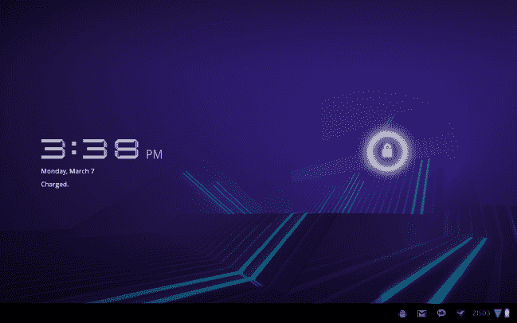

# 二、选择合适的平板电脑

Android 操作系统的众多优势之一是它能够在各种设备上运行。由于每个人的需求不同，一款平板电脑不可能满足每个人的需求。每个人都应该有一个适合自己特定用途的设备。在本章中，我们将介绍典型 Android 设备上的各种功能和服务，它们如何满足您的需求，以及如何选择最适合您的平板电脑。

### 特性

您应该考虑哪些功能？由于不同的公司生产不同的 Android 平板电脑，因此一些 Android 平板电脑会与其他平板电脑有很大的不同。这些差异可能对您很重要，这取决于您选择如何使用平板电脑。以下是选择设备时需要考虑的四个最重要的特性。

#### 尺寸

在购买 Android 平板电脑时，屏幕尺寸可能是一个重要因素。毕竟，平板电脑实际上不仅仅是一个与你互动的屏幕，所以你应该选择一个对你来说最舒适的尺寸。您应该根据您使用该设备时的感受来做出决定。娱乐、企业、学生和旅行用户都有不同的需求，适当的屏幕尺寸可以满足这些需求。

*   屏幕小于 7 英寸的平板电脑非常便携，但不太适合一次输入多个句子。
*   10 英寸屏幕的平板电脑有助于提高工作效率，但增加的尺寸和重量往往使它们与笔记本电脑一样便携。此外，它们通常需要某种支架或坞站来使用很长时间。
*   七英寸平板电脑提供了便携性和工作效率的舒适结合，但并没有真正优化这两者。这种尺寸在大多数情况下都很有用，因为平板电脑小到可以单手操作。

#### 相机

和许多手机一样，大多数平板电脑都可以用来拍照。平板电脑上的摄像头在质量和功能上各不相同。如果在你的平板电脑上安装一个摄像头对你来说很重要，你应该清楚你的选择。

*   前置摄像头:这些摄像头通常很小，分辨率低于 300 万像素，但通常可以让你进行视频聊天。
*   **后置摄像头**:这些摄像头的质量各不相同，通常会产生与手机后置摄像头同样质量的图像和视频。这些相机几乎总是能够比前置相机拍摄更好的照片和录制视频。
*   **旋转摄像头**:这些摄像头通常具有与后置摄像头相同的质量，但被设计为从平板电脑的前面旋转到后面。这种风格不太常见。

#### 记忆

在平板电脑上存储文档、图片、音乐、电影或其他任何东西的能力极其重要。然而，就像电脑一样，可供你使用的存储量直接影响着平板电脑的价格。以下是可用的存储类型。

*   **板载内存**:该内存内置于平板电脑中，无法移除或升级。这些设备的存储容量从 8GB 到 64GB 不等，存储容量越大，成本就越大。所见即所得，但这种类型的内存通常比可移动存储更快。这种存储类型的缺点是，如果平板电脑上的内存发生任何问题(连接电源时的电涌、猛烈跌落到坚硬的表面等)，设备将变得毫无用处，您需要更换整个设备。
*   **可移动存储**:一些平板电脑能够通过可扩展内存插槽扩展您的板载存储。内存插槽通常支持微型 SD 卡，可以根据您的需要购买各种尺寸的微型 sd 卡。目前，micro SD 卡可以在尺寸和速度两种测量中购买(*级*)，增加其中一种将直接影响价格。目前，微型 SD 卡的容量不超过 32GB，这些卡的价格很高，通常不包括在平板电脑的价格中。

#### 互联网

无论你是哪种用户，你都必须使用平板电脑上网。然而，重要的是，你要确定你是否总是需要互联网，并愿意为此付费。以下是您将会遇到的选项:

*   **Wi-Fi only** :您可能在家里、办公室或学校都有无线互联网，因此您可能不需要在任何地方都连接到互联网。
*   **移动互联网 3G/4G 合同**:正如我们在第一章中讨论的，你可以按月付费从你的运营商那里购买一项永远在线的服务。每个运营商的价格都不一样，你通常需要签订一年或两年的合同。
    *   **移动热点**:通常在合同价格之外收取额外费用，这使您能够与任何支持 Wi-Fi 的设备共享 3G/4G 服务。
    *   **网络共享**:与移动热点类似，通过将 USB 电缆从平板电脑连接到电脑，您可以与电脑共享 3G/4G 服务。
*   **现收现付的移动互联网 3G/4G** :一些运营商计划允许你购买数据块或一个月的服务时间。要利用这一点，您的平板电脑必须内置 3G/4G 设备。

### 你是什么样的用户？

用户通常可以根据他们最有可能在平板电脑上进行的活动进行分组。根据这些活动来确定您的需求，有助于您选择最适合您的平板电脑。例如，您认为以下哪一项最符合您的生活方式？

#### 公路战士

你的平板电脑是你的 GPS 的两倍。它会一直跟着你，而且需要非常便携。互联网总是触手可及。当你需要的时候，你的笔记本电脑或台式电脑会帮你完成所有繁重的工作。

*   移动互联网
*   7 英寸或更小的屏幕
*   前置/后置摄像头
*   可移动存储
*   移动热点

#### 一个科技齿轮头

你需要一切最好的东西。你需要最大的屏幕、最快的处理器和最大的存储空间。你现在有最好的小玩意，下周你也会有。

*   十英寸屏幕
*   移动互联网
*   可移动存储
*   旋转摄像机

#### 学生或老师

你需要一台“新时代”的打字机，可以访问你所有的网络资源，你的每本书都包装在一个不比一叠纸大的盒子里。对你来说最重要的是舒适地打字的能力和无论你在哪里都能阅读的能力。

*   任何类型的互联网连接
*   7 到 10 英寸的屏幕
*   车载存储
*   现收现付互联网

#### 一个音乐和电影迷

对于您来说，您需要一个高质量的屏幕、良好的立体声扬声器和足够强大的电池，以便观看几部电影、您最喜欢的电视节目，或者可能只是在办公桌上播放一整天的音乐。大容量存储和高速互联网连接是你最好的朋友。

*   可移动存储
*   7 到 10 英寸的屏幕
*   移动互联网
*   相机可选

#### 书呆子

一个大屏幕远不如将你的书籍、杂志、报纸和 pdf 文件随身携带的能力重要。即使它能容纳成千上万本书，它也不会比你最喜欢的小说重。

*   仅 Wi-Fi
*   七英寸屏幕
*   相机可选
*   车载存储

#### 移动办公用户

因为你的大部分时间是在汽车上、飞机上或者除了你自己的办公室之外的任何人的办公室里度过的，所以你能够在任何地方工作是很重要的。持续的互联网连接、大键盘和随时与老板进行视频会议的能力是你需要的功能。

*   十英寸屏幕
*   移动互联网
*   前置摄像头
*   可移动存储
*   移动热点

### 您应该在哪里购买平板电脑？

我们缩小了范围，以帮助您选择最适合您需求的平板电脑。你可能看过一些商业广告，可能读过一些评论，甚至可能去过几家商店买一两件。现在是时候出去拿你的了！做这个最好的地方在哪里？以下是一些选项:

*   **运营商商店**:如果你正在寻找一款 3G/4G 合约的平板电脑，这是最好的去处。运营商还会为你的新平板电脑储备所有官方配件。
*   **电子商店**:这些商店中的许多商店将提供各种运营商的 Wi-Fi 平板电脑和 3G/4G 平板电脑。此外，商店将出售官方配件以及第三方制造商生产的较便宜的配件。
*   仓库商店:大批量仓库风格的商店可能是购买平板电脑最便宜的地方，但他们的选择通常仅限于只有 Wi-Fi 的型号。这种类型的商店不太可能为你的设备提供很多配件。

#### 保修还是保险？

购买平板电脑时，您可能会被问及是否对设备的延长保修或保险感兴趣。虽然这是一笔额外的费用，但通常情况下，如果你的设备发生任何问题，它们会让你有能力廉价地更换它。那么，这两者有什么区别呢？

*   保险:通常由运营商提供，保险单会在你拥有设备的每个月收取少量费用。如果平板电脑在保险范围内发生任何问题，您将获得一台新的平板电脑。
*   保修:最常见于电子产品商店，保修服务是一种额外的费用，通常基于你预先支付的设备成本的一定比例，没有月费。保修在固定时间内覆盖您的设备，并在发生保修范围内的任何情况时提供设备更换。

#### 配饰？

无论你选择哪一款平板电脑，你都可能希望为你的设备配备一些东西，让它变得更有用。根据您购买平板电脑的地点，您可能会选择专门为您的设备设计的配件。以下是最受欢迎的:

*   **案例**:每一款平板电脑大约有一半的表面积是玻璃，玻璃表面的任何划痕都会严重影响屏幕对触摸的反应。不使用时将屏幕盖住的外壳通常是个好主意。对于某些型号，当折叠起来时，覆盖屏幕的外壳部分也可以兼作支架，使您更容易在虚拟设备键盘上打字。
*   **Dock** :这个配件可以让你在直立状态下给你的设备充电，让你在充电的同时工作而不会弄乱电线，如图图 2–1 所示。大多数坞站都提供附加功能，如音乐扬声器或磁性充电连接，以便您可以快速移除设备。
*   **键盘**:在虚拟键盘上打字对每个人来说都不容易，大多数人在实体键盘上打字更快。大多数平板电脑键盘通过蓝牙连接，并包括一个支架，以便在您键入时支撑平板电脑。图 2–1 显示了平板电脑基座和键盘。

**图 2–1。** *平板电脑坞站和键盘*

### 清理平板电脑

万岁，你选了一块平板电脑！现在有趣的部分可以发生了。在你回家把盒子里的所有东西都撕掉，把你的卧室/办公室/厨房弄得一塌糊涂之前，有几件事你应该做。

*   确保你的盒子不会出问题:这听起来很奇怪，但并不罕见。一些制造商提供巧妙的包装作为赠品。例如，Barnes and Noble Nook Color 的包装可以折叠起来，通过磁力粘在一起，形成一个便宜的纸板支架，用于放置平板电脑。在你销毁盒子之前，确保它不会做一些很酷的事情。
*   **制造商保修信息**:无论您是否从购买平板电脑的商店购买了额外的保修服务，大多数制造商都会提供一年的有限保修，相关文档就在您的包装盒中，您可以填写并发送。

大多数平板电脑都配有给设备充电的电源线和将平板电脑连接到电脑的 USB 电缆。根据平板电脑的电源要求，平板电脑制造商可能会选择以下电缆配置之一:

*   **一根可拆卸线缆**:这种线缆的一端有一个 USB 端口，另一端有一个专用于您设备的特殊连接器，如图图 2–2 所示。要通过墙上的插座为平板电脑充电，制造商可能会提供一个可以接受 USB 连接器的小型电源适配器。

**图 2–2。** *平板电脑电源线*

*   **单独的电源线和 USB 线**:您的制造商可能会决定为您的平板电脑配备一根单独的充电线和一根连接平板电脑和电脑的线。这样，您可以同时为平板电脑充电和同步。
*   **PC dock** :如果你选择购买一个 dock，你很可能能够将你的平板电脑连接到你的桌子或笔记本电脑上，只需将你的平板电脑放在 dock 中就可以同时充电。

既然您已经打开了 Android 平板电脑的包装，让我们启动它吧！

### 设置您的平板电脑

你的新 Android 平板电脑有许多独立的部件，它们组合在一起就能创造出一个伟大的设备。我们将看看平板电脑上可能有的一些东西，以及一些初次使用的最佳实践。

#### 第一次冲锋

与大多数电子产品一样，你的平板电脑会附带大约四分之一的电池。许多平板电脑不提供拆卸电池的功能，因此妥善保管这款平板电脑非常重要。平均而言，电池是设备中最昂贵的部件之一，并且不在大多数保修或保险政策的范围内。在你把平板电脑拿出来玩之前，你可以做几件事来确保电池的长时间使用。

*   给它充满电:我知道打开新玩具玩到你倒下是很诱人的，但是把它插在墙上，让它在打开之前充大约 12 个小时的电。这将确保您在第一次使用之前有一个完全充满的电池，如图图 2–3 所示。

**图 2–3。** *蜂巢装置充满电*

*   **首次使用时耗尽电池电量**:首次使用时，在电池电量完全耗尽之前，不要将平板电脑重新连接到充电器上。第一次使用设备时，请完全耗尽电池电量，然后在再次打开设备之前，再次给设备充满电。

#### 附加端口

到目前为止，我们已经讨论了平板电脑上常见的各种端口:电源端口、数据端口(或者兼而有之的端口)和耳机插孔。对于你们中的一些人来说，可能还有一些其他的插槽，例如图 2–4 中的那些插槽。它们将在用户手册中标明；你可能会发现自己有以下问题:

*   HDMI 端口:HDMI 端口的大小与 USB 端口相似，但形状略有不同，它允许你将平板电脑连接到电视，这样你就可以使用普通的 HDMI 电缆在更大的屏幕上分享音乐、电影、游戏或其他任何东西。通常情况下，这也将允许您以高(更)清晰度查看平板电脑上的内容。
*   **迷你 HDMI 端口**:该端口的工作方式与全尺寸 HDMI 端口相同，但需要一根特殊的电缆，因为平板电脑上的端口要小得多。几乎总能在您购买平板电脑的地方找到这些线缆。
*   **磁条**:这些将仅用于对接您的设备。确保您的设备*仅*连接到支持平板电脑的坞站，以避免任何不必要的硬件问题。

**图 2–4。** *摩托罗拉 Xoom 端口*

#### SIM 卡

如果您购买了支持移动互联网的平板电脑，您可能会有一个 SIM 卡插槽。GSM 运营商(T-Mobile，AT & T)和 4G LTE 移动互联网提供商(威瑞森无线，MetroPCS，AT & T)都使用 SIM 卡，如图 2–5 所示。这些卡片为您的设备提供了从您的提供商处访问服务所需的说明。如果您的平板电脑是从这些提供商处购买的，则在激活时可能会为您插入该卡。SIM 卡易碎，只能由专业人员或在专业人员的帮助下从设备中取出。此卡的损坏会导致平板电脑服务时断时续或质量不佳。如果您觉得您的 SIM 卡有问题，请立即联系您的提供商。

**图 2–5。**SIM 卡

SIM 卡存储信息的方式使您可以在不中断服务的情况下从一个设备快速移动到另一个设备。只需在开机前将 SIM 卡放入新设备中，您的移动互联网服务就可以使用了。移动互联网服务将只提供给当前安装了 SIM 卡的设备。但是不建议频繁地将卡从一个设备移动到另一个设备，因为这样做会损坏它。

#### 通电

每个制造商把它的模型的电源按钮放在稍微不同的位置。如果找不到，请查阅您的用户手册。按住电源按钮，直到屏幕上出现图像。设备现在打开了！给它几秒钟时间启动并向你展示一个动画，你就可以第一次使用你的设备了。那个电源按钮也不仅仅是用来开关设备的。它也是设备的睡眠和唤醒按钮，所以你会经常使用它。

### 总结

购买平板电脑应该像购买个人电脑一样受到个人关注。您的平板电脑应该适合您的需求和偏好，并且价格应该符合您的预算。对于许多人来说，平板电脑是智能手机和电脑之间的桥梁，所以你选择的硬件是你经常想要使用的，这一点很重要。既然您已经选择了一款最适合自己的平板电脑，那么是时候进行设置并准备使用了。