# 三、创建您的 Google 帐户

任何 Android 设备的最大特点之一是它将其他基于网络的谷歌产品和服务——从 Gmail 到谷歌地图——与自己的功能紧密集成。因此，你需要一个谷歌账户来使用这些功能。(使用平板电脑不需要谷歌账户，但如果没有谷歌账户，你将无法访问 Play Store 和其他在线服务。)在这一章中，你将学习如何在你的 Android 平板电脑上或者直接去 Google.com 设置你的谷歌账户。当然，如果你已经有了一个谷歌账户，你可以完全跳过这一步，正如边栏“你已经有一个谷歌账户了吗？”

在本章中，我们还将介绍首次在平板电脑上登录您的 Google 帐户，以及将您的 Google 帐户与您的 Android 平板电脑同步。

你已经有谷歌账户了吗？

如果你目前正在使用谷歌的任何服务，或者已经拥有一部安卓手机，那么你很可能已经有了一个谷歌账户，可以跳过本章接下来的两节。例如，如果您使用以下方式，您将已经拥有一个 Google 帐户:

*   Gmail、Google Talk、Google 日历、文档等核心服务
*   收购了 Picasa、YouTube、Google Voice 等服务
*   谷歌钱包、博客、谷歌地图等综合服务
*   桌面服务，如 iGoogle、Google Desktop、Google SketchUp

如果您已经获得了这些服务的用户名和密码，那么您已经拥有了一个 Google 帐户。为了证实这一点，去 Google.com 吧；在那里，如 Figure 3–1 所示，点击您正在使用的服务的链接，并使用您的登录名登录。您将被带到您的 Google 帐户！将您在这里使用的用户名和密码带到您的 Android 平板电脑上，并在您的平板电脑上登录您的帐户，就像在图 3–2 中一样。

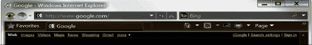

**图 3–1。【Google.com】??**签到

### 在平板电脑上创建谷歌账户

无论你在哪里，谷歌都可以让你很容易地建立一个账户，不需要电脑。既然你面前已经有了新平板电脑，你不妨点击图 3–2 所示的“创建账户”按钮，开始派对。

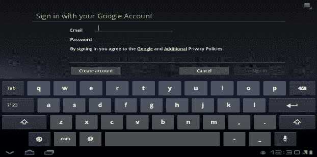

**图 3–2。** *蜂巢签到*

点击“创建账户”按钮，显示如图图 3–3 和图 3–4 所示的“账户设置”屏幕。首先输入您的名字和姓氏，然后选择一个用户名。你的用户名可以是你想要的任何名字，只要其他人没有申请过。您选择的名称也将成为您的新电子邮件地址；只需在您选择的名称后添加“@gmail.com”即可形成您的新地址。选择用户名后，请务必点击“检查可用性”按钮。这将确保当前没有其他人使用该名称。

如果你想要的用户名被盗用，谷歌会为你提供四个选项，尽管你不必选择其中任何一个。要检查不同用户名的可用性，只需删除您的第一个选择，然后重新开始。

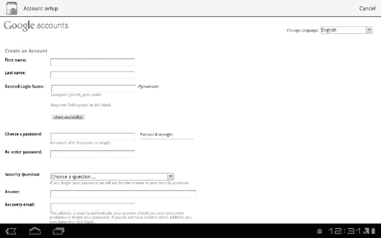

**图 3–3。** *用蜂巢创建谷歌账号*

您的 Google 帐户的安全功能包括密码强度量表、设置您选择的质询问题和答案的能力，以及可选的恢复电子邮件地址，如果您丢失密码，您可以使用该地址将密码发送到另一个电子邮件地址。这些安全功能可以随时通过平板电脑上的设置应用进行更改。

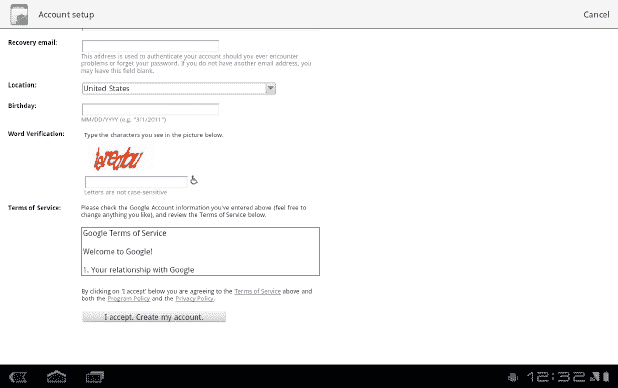

**图 3–4。** *用蜂巢创建谷歌账户(续)*

设置页面还会要求您完成其单词验证字段。这是一个你可以在大多数网站上找到的功能，这些网站要求你创建一个帐户；这是一种安全措施，用于确保程序不会创建虚假帐户或使用窃取的信息创建帐户。只需键入您看到显示的单个字母。如果你看不清或理解不了，按一下轮椅按钮，字母就会念给你听。

在选择“我接受”之前，请阅读服务条款，方法是将手指放入框中并向上“拖动”。此操作将滚动框中的文本，允许您阅读整个协议。阅读完协议后，触摸屏幕上的“我接受”按钮。

### 创建 Google.com 账户

如果你更愿意在你的台式机或笔记本电脑上创建你的谷歌账户，那也一样简单，你可以使用你的键盘！

拿起你选择的浏览器，前往 Google.com，点击“登录”按钮，如图图 3–5 所示。

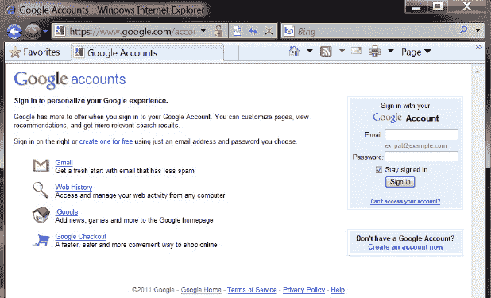

**图 3–5。** *从浏览器创建谷歌账户*

在这里，您应该会看到“立即创建帐户”链接，该链接会引导您进入帐户创建表单，类似于您在平板电脑上看到的表单。点击链接，您将看到显示在图 3–6 中的表格。

当您从平板电脑创建 Google 帐户时，系统会提示您选择一个用户名，该用户名将用作您的 Google 帐户的登录用户名以及@gmail.com 电子邮件地址的基础。当你在谷歌网站上创建一个账户时，你会获得一些灵活性。例如，如果你有一个电子邮件地址，而这个地址已经是你处理所有事情的地址，那就没有理由再创建一个你不太可能使用的新账户，对吗？创建 Google 帐户时，您可以选择将您现有的电子邮件地址连接到该帐户，无论它是哪种电子邮件地址。如果您决定同时建立一个 Gmail 帐户，您可以选择左侧的 Gmail 链接，而不是“创建帐户”链接，然后您将看到一个表格，允许您创建您的 Google 帐户*和 Gmail 帐户*。如果您决定现在使用现有的电子邮件地址，以后再创建一个 Gmail 帐户，这很容易做到。几乎所有的谷歌服务都是免费的，可以随时添加到谷歌账户中。

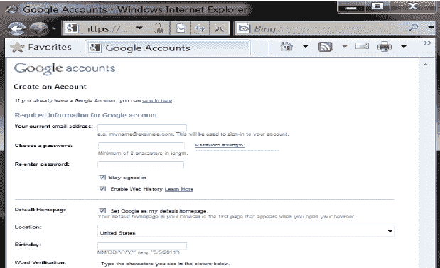

**图 3–6。** *从浏览器创建谷歌账户(续)*

### 与您的 Google 帐户同步

你在 Android 平板电脑上做的一切都可以同步到你的谷歌账户和你使用的其他谷歌设备，如 Android 手机。这包括您在 Play Store 购买的应用和图书、您保存在 Gmail 或 Google Talk 帐户中的联系人以及日历事件。您保存在从 Play Store 安装的应用中的信息也会保存在您的 Google 帐户中。这使您能够通过登录 Google.com 或登录您的 Android 设备从任何计算机访问您的个人信息。

首次成功登录 Android 设备时，系统会提示您激活这些同步功能，如 Figure 3–7 所示。

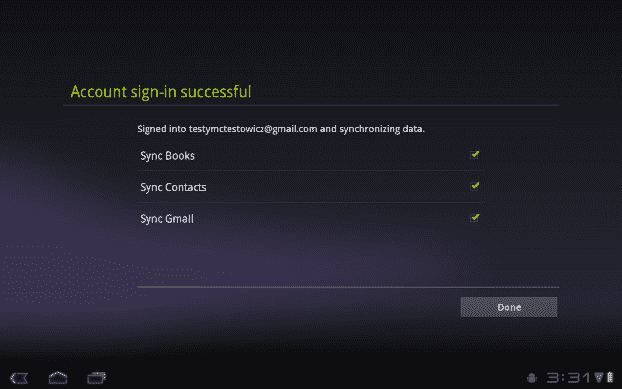

**图 3–7。** *蜂巢签到成功屏幕*

这些功能也可以在设置应用中随时控制，设置应用可以在我的应用中找到。从“设置”中，点击“帐户和同步”选项卡，您将看到一个帐户列表以及一些通用的同步设置。点击您想要修改的帐户，您将看到您的帐户同步控件，如 Figure 3–8 所示。

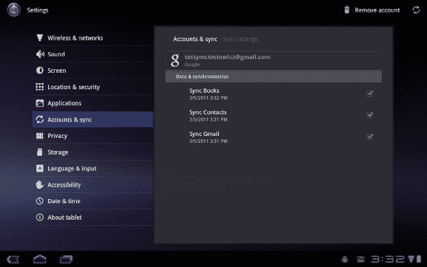

**图 3–8。** *用蜂巢同步你的谷歌应用*

选择同步所有数据可以防止不必要的任务重复。例如，如果你在平板电脑上阅读一封电子邮件，难道你不想让你的手机和电脑知道吗？如果你读完了你一直在读的那本书的一章，如果你所有的其他设备*都知道*在你下次登录时让你开始下一章，不是更容易吗？Sync 为您的所有 Google 账户设备提供了这一功能。如果您在会议中更新了同事的电子邮件地址，当您回到平板电脑时，它已经做出了更改。

启用同步也是灾难恢复的理想选择。假设你的家被洪水淹没了，或者你遇到了事故，你的平板电脑损坏了。因为你的数据被备份到你的谷歌账户中，所以没有必要担心你丢失了任何信息。当你拿到替换设备时，只需重新登录你的谷歌账户，一切都会恢复原样。

### 添加联系人

每个应用都有能力从你的谷歌账户中的联系人信息中提取你可能需要的任何信息。或许在 Google Talk 上聊天、发送电子邮件、分享图片...什么都有可能。如果您一直在使用其他服务来存储您的所有联系人，如 AOL 或客户端应用，如 Microsoft Office 或 ACT！，有一些快速简单的步骤来获取该列表，并将其添加到您的谷歌帐户，使用您的平板电脑或另一台电脑。您也可以手动添加联系人。我们将在接下来的两节中讨论所有这些技术。

#### 导入联系人

要将其他服务或程序中的联系人添加到您的平板电脑，您必须先导出他们。每种电子邮件服务都能够将您的联系人导出到一个文件中，通常是一个逗号分隔(CSV)文件。一旦你获得了这个文件，你所需要做的就是将文件发送到你的谷歌账户，你的联系人将被组织起来并在你的设备间同步。

如果您使用电脑来填充 Google 联系人列表，您需要登录平板电脑上使用的 Gmail 帐户，并从左侧导航栏中选择我的联系人。从这里开始，您将看到左侧列表中的几个选项(如图图 3–9 所示)。在该列表的底部，您将看到导入联系人。从列表中选择，弹出图 3–9 所示的窗口。

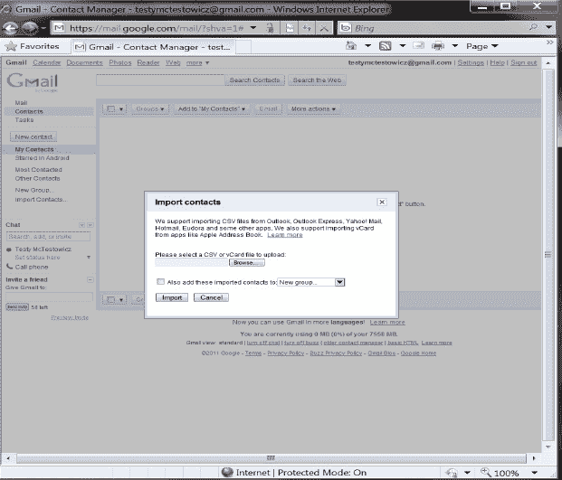

**图 3–9。** *用浏览器导入联系人到 Google.com*

看到“导入联系人”弹出窗口后，单击浏览，找到您在电脑上创建的联系人文件。(此文件的位置会因导出方式和完成此任务所使用的服务而异。常见位置是桌面和下载文件夹。)一旦选择了联系人文件，点击导入。这将启动排序和同步过程，这可能需要几分钟时间，具体取决于您的互联网连接和您的联系人数量。当联系人在您的 Google 帐户之间同步时，您会看到他们开始出现在您的平板电脑上。同步过程可能需要一个小时，因此如果某些联系人没有立即出现，请不要担心。

您可能已经能够使用平板电脑上的网络浏览器下载您的联系人文件，或者您可能已经将文件复制到 SD 卡或将文件传输到您的平板电脑。从平板电脑导入联系人的步骤类似。

#### 手动添加联系人

“我的应用”中的“联系人”应用是平板电脑上所有联系人数据的集中位置。在这里，您可以添加、编辑、删除和组织您认为合适的联系人。一旦您打开了联系人应用(如图 3–10 所示)，您将看到菜单图标显示在应用的右上角。

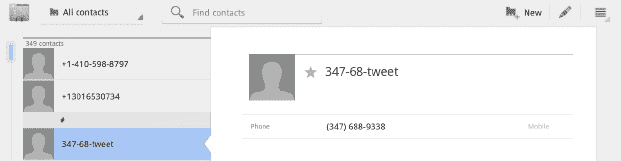

**图 3–10。** *联系人应用中的单个联系人示例*

看到菜单选项后，点击列表中的导入/导出(如 Figure 3–11 所示)。在这里，您可以在平板电脑上浏览联系人文件。选择正确的文件，联系人将被同步到您的 Google 帐户，开始组织和同步过程。

**图 3–11。** *显示联系人 app 菜单蜂巢*

因此，也许你只有十个朋友，或者你所有的联系人都是从脸书或 Twitter 等服务自动同步的，你只需要再添加几个。完成导入过程将花费与手动输入联系人一样多的时间。

在电脑版和平板电脑版的联系人管理器中，您都可以输入单个联系人。

当您在图 3–11 中选择屏幕右上角的新建时，您将看到一个新的联系表单(如图图 3–12 所示)。该表单将创建一个联系人。您放在该文件中的所有信息都将保存到您的 Google 帐户中。您可以添加联系人的照片，如果您的平板电脑有摄像头，您还可以通过点击灰色轮廓从文件中拍摄联系人的照片。物理地址等信息将被保存为谷歌地图的链接，在那里可以查看，也可以请求方向。

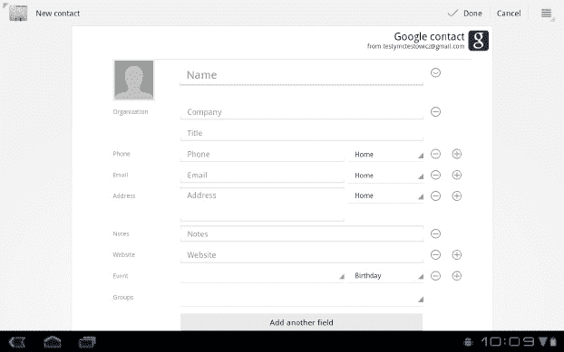

**图 3–12。**??【蜂巢】中增加新的联系人

您在此处创建的联系人将成为个人的动态档案，为您提供的信息不仅仅是姓名和电子邮件地址。点击“添加另一个字段”按钮，您可以添加即时消息的姓名、昵称、您与联系人的关系等等。完成后，点击完成复选标记，该联系人将保存到您的设备并同步到您的 Google 帐户。

### 总结

你的谷歌账户是你在安卓平板电脑上可以使用的最强大的工具之一。有了它，你的信息、你的偏好以及你放入账户的一切都可以在线存储并备份到其他地方。拥有一个谷歌账户有助于将查看电子邮件、聊天或记住你在哪个页面的日常琐事限制在一个单一的任务上，而不是必须在不同设备上重复的任务。

这些能力远远没有达到你谷歌账号的潜力极限。在 Android 设备上，您的谷歌帐户还可以让您访问一系列强大的应用，这些应用有助于推动 Android 体验。在下一章中，你将了解谷歌平板电脑中包含的单个应用，这些应用将让你访问关键的谷歌账户功能，以及流行的 Google.com 网络服务。