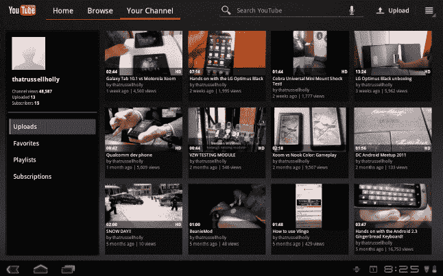

# 四、利用 Google Apps

Android 操作系统中最强大的功能是组成 Google Apps 套件的应用集合。该套件由仅在谷歌批准的设备上可用的应用组成，平板电脑制造商为了访问该套件而经历的过程是由谷歌设置的，以确保设备的质量和制造商保持设备更新的承诺。Google Apps 本质上是 Google 在其网站和 Play Store 上提供的工具的集合。

在本章中，你将了解如何使用最受欢迎的谷歌 Android 应用来增强你的平板电脑体验，以及一些帮助你充分利用这些应用的提示和技巧。让我们从 Gmail 开始吧，它可能是你最常用的应用。

### Gmail

谷歌的电子邮件服务是一个极其受欢迎的产品，仅次于该公司标志性的搜索栏。Gmail 在全球几乎所有智能手机操作系统上都有使用。像谷歌的所有应用一样，Gmail 深深地集成到 Android 中，允许你快速访问它来附加照片、视频等等。Gmail 可以被快速调用，直接从您的联系人列表中向联系人或 vCard 发送电子邮件，并提供您从其基于网络的实现中获得的所有相同功能。

**注意:**在平板电脑上登录谷歌账户后，会自动登录 Gmail，就像在安卓智能手机上一样。

在本节中，您将学习浏览 Gmail、撰写电子邮件以及根据个人喜好定制 Gmail 体验的基础知识。本章中的示例和步骤适用于 Android 3.0 和更高版本，但其中许多相同的说明适用于所有 Android 平板电脑。

#### 浏览 Gmail

在平板电脑上，你有几种方法可以进入 Gmail。Gmail 图标与其他应用图标一起位于名为“我的应用”的应用抽屉中。轻按红色镶边的白色信封，启动 Gmail。此外，您可以通过通知进入 Gmail。如果您有一个 Gmail 通知，它会以信封的形式出现在您的通知托盘中，您可以点击该图标，直接进入您的 Gmail 收件箱。在这一部分，您将学习如何浏览您的收件箱和电子邮件。

##### 收件箱视图

无论您是纵向还是横向拿着平板电脑，收件箱视图都会向您显示收件箱中所有邮件的滚动列表。它将为每封邮件提供足够的空间，让您可以简要查看电子邮件，以及收到邮件的时间和每封邮件的对话计数，以防您正在查看的邮件是邮件线索之一。这些功能就像 Gmail 网站一样。在您的左侧(如图 Figure 4–1 所示)，有一个可单独滚动的文件夹列表，允许您快速切换到任何文件夹，而无需离开该视图。

**注意:** Honeycomb 用户在 Gmail 应用中可以随时返回收件箱视图，只需点击应用右上角的文件盒图标即可。

**图 4–1。** *Gmail for Android 3.0 收件箱视图*

##### 电子邮件视图

电子邮件视图有两种不同的“模式”,具体取决于您手持平板电脑的方式，是纵向还是横向。对于许多 Android 平板电脑，尤其是蜂巢或 Android 3.0 及更新的设备，风景是最常见的。一旦你选择了一封邮件，左边的文件夹导航就会滑开，留给你一封可滚动的电子邮件和一个单独可滚动的收件箱，但现在变得更薄了(如图 4–2 所示)。在纵向视图中，选择一封电子邮件会导致收件箱和文件夹一起滑动，从而为该电子邮件留出整个空间。

**图 4–2。***Android 3.1E 版 Gmail 邮件视图*

当您发送新邮件或答复现有邮件时，收件箱和电子邮件视图看起来是一样的，因为您只能与正在处理的电子邮件进行交互。发送完邮件后，您将返回到之前的视图。

现在，您已经了解了浏览 Gmail 应用的基本知识，您可以撰写电子邮件了。

#### 撰写一封电子邮件

在撰写邮件之前，您需要进入 Gmail 撰写屏幕。有两种方法可以导航到新的消息撰写屏幕:

*   在 Gmail 应用中，选择新的电子邮件图标(前面带有加号的信封，如 Figure 4–2 所示)。
*   从任何地方，如果您正在附加文本、图片或网站链接，点击菜单中的共享选项，并从共享选项列表中选择 Gmail。

一旦你到达这个屏幕，如 Figure 4–3 所示，你就可以撰写新的信息了。

**图 4–3。** *在 Android 3.1 上编写电子邮件*

在撰写屏幕上，您可以随意选择一些选项，就像您希望在任何现代电子邮件客户端(如 Outlook Express)中看到的那样。

*   *收件人、抄送人和密件抄送人*:像您曾经使用过的任何其他电子邮件应用一样填写这些字段。这三者都与你的谷歌联系人直接相关。如果您要发送电子邮件的人在您的联系人列表中，您只需输入他们的姓名，电子邮件地址就会出现。若要向多个收件人发送邮件，请用逗号分隔联系人。要打开抄送和密件抄送字段向同事发送副本或密件抄送，点击**至**字段右侧的**+抄送/密件抄送**符号。
*   *邮件正文*:在正文中，你只需在“收件人”、“抄送”和“密件抄送”栏下的白色大框中点击一下，你的键盘就会出现，供你输入电子邮件。在单个空间中按住，粘贴功能将出现，以防您需要粘贴您从其他地方复制的任何内容。
*   *附加*:就像你电脑上的 Gmail 一样，你可以将平板电脑上的任何图像、歌曲、视频片段或网址附加到电子邮件中。轻按“附加”图标(通常是一个回形针)，并浏览出现的菜单以找到您想要附加的内容。
*   垃圾:所以，他们并不都是赢家。如果你不喜欢你正在处理的邮件，点击屏幕右上方的垃圾桶图标，邮件将被删除，并返回收件箱视图。在您执行另一个操作之前，屏幕顶部会有一个“撤销”按钮。点击撤消将返回到撰写电子邮件的状态。
*   *保存草稿*:如果您正在处理一封邮件，并且需要做其他事情，您可以通过点击垃圾桶旁边的保存草稿按钮将邮件保存为草稿。您的草稿会保存到“草稿”文件夹中，您可以在收件箱中访问该文件夹。此外，如果您在撰写邮件的过程中离开 Gmail 应用，该应用会自动将邮件保存到草稿文件夹中。
*   *发送*:当你的信息完成后，点击发送，或者如果你被打断了，点击保存草稿，这样你可以稍后再回复。

这样，你的电子邮件就会从你的平板电脑飞到预定的目的地。此外，你所有的文件夹和草稿也都在你的 Gmail.com 账户上，让你可以在它们之间无缝切换。但是，有一些功能允许您根据自己的利益定制体验(如 Figure 4–4 所示)。

#### 定制 Gmail

正如你可以在台式机或笔记本电脑上对 Outlook 等传统电子邮件客户端或 Gmail 等基于网络的客户端进行更改一样，Gmail 应用有一个设置页面，用于控制同步频率、签名和其他一些功能，以根据你的需求定制你的电子邮件体验。

每个版本的 Android 都可以在应用中访问设置。只需点击 Gmail 应用中的菜单按钮，设置选项就会出现。点击设置按钮会将你带到设置面板。如果您的平板电脑上加载了多个帐户，请从左侧列表中选择您想要修改的帐户(如 Figure 4–4 所示)。

**图 4–4。**Gmail 设置安卓 3.1

在此页面上，您可以更改您帐户的同步选项。这包括同步频率，您可以根据个人喜好进行修改。如果您想在电子邮件发送给您时立即收到它，您可以提高帐户与设备同步的速度。

**注意:**您将设备同步到 Gmail 的频率越高，消耗的电池电量就越多。如果您没有收到很多电子邮件，或者不关心电子邮件到达设备的速度，请考虑降低频率以延长电池寿命。

您还可以控制将哪些标签同步到平板电脑。正如您在图 4–4 中看到的，您可以选择只同步收件箱中的内容，也可以同步草稿、垃圾邮件甚至回收站文件夹中的所有内容；这完全取决于你的喜好。

默认情况下，您的 Gmail 应用设置为每当您收到通知栏中带有图标的电子邮件以及某种预选铃声时都会通知您。这些也可以在这个页面上修改，包括关闭或选择任何你想作为通知的铃声的能力。

签名是定制的另一个重要的东西。“设置”页允许您设置您的签名，默认情况下，该签名将在您每次回复或创建新邮件时显示。

当最大限度地使用时，Gmail 是一个功能强大、用途广泛的工具，就像它的网络版一样，能够在 Android 内的几乎任何地方出于任何原因快速发送电子邮件，这使它更有价值。与谷歌的许多应用一样，Gmail 可以通过整个操作系统的分享功能访问。你会发现它在图片、网站、你复制的文本和许多其他地方的旁边。share 中的 Gmail 按钮可以让你将分享的内容附加到电子邮件中。

Gmail.com 被用作谷歌几乎所有服务的门户。由于有超过 10 亿个活跃的 Gmail 帐户，如果 Gmail 中有其他事情要做，你也会使用它们，这是有道理的。在下一部分，您将了解 Google Talk 及其在平板电脑上的工作方式。

### Google Talk

您的“ [@gmail.com](http://@gmail.com) ”电子邮件地址让您可以访问所有 Google 的主要产品。因此，您的 Gmail 地址也被用来在 Google Talk 上创建一个即时消息帐户(如图图 4–5 所示)，这是 Google 的消息服务。每个拥有 Gmail 账户的人都有一个 Google Talk 登录名，而且有很多 Gmail 用户*，所以你可能认识一些每天都在使用 Google Talk 的人。如果你不想使用这项服务，你可以选择不使用它，但就像谷歌的许多其他服务一样，它是 Android 平板电脑上的一个伟大工具，因为它的集成程度非常高。*

*

**图 4–5。***Android 3.0 上的 Google Talk 主屏幕*

让我们来看看如何使用 Talk 与同事和朋友交流。

很有可能你以前使用过即时消息服务。像 Google Talk 一样，大多数其他即时通讯服务都内置于产生它们的服务中。比如雅虎！Messenger、AOL Instant Messenger (AIM)和 Windows Live Messenger 最初并不是像今天这样的独立服务。谷歌的服务提供了许多相同的功能，并内置于 Gmail 服务中。这款应用是该服务的延伸，提供了大量相同的功能。

#### 添加一些朋友

如果你以前从未使用过 Google Talk，你会想要一些朋友。Google Talk 应用在你的“我的应用”抽屉里，形状像一个白色的语音气泡，上面用蓝色写着 *TALK* 。在应用的右上角，你会看到一个人的轮廓，下面有一个加号。点击该图标会弹出一个窗口，要求你邀请一个朋友来聊天(如图图 4–6 所示)。要邀请朋友，您只需知道他们的 Google Talk 地址，这几乎总是他们的 Gmail 地址。

**注意:** Google 的商业服务使 Google Talk 可以用于那些更愿意使用自己的电子邮件地址，而不是以“@gmail.com”结尾的电子邮件地址的公司。因此，您的一些 Google Talk 朋友可能不会使用他们的 gmail 帐户来使用 Google Talk。

**图 4–6。** *谷歌聊天邀请*

#### 设置您的状态信息

现在你有了一些朋友，通过状态信息让他们知道你的世界正在发生什么。每当您的任何朋友在网上看到您时，它就会出现在您的名字旁边。这些消息带有一个可用性图标，绿色表示可用，红色表示不可用或忙碌。此外，如果您的状态设置为绿色，并且您超过一个小时没有活动，则状态图标将变为橙色，表示您没有积极使用 Google Talk。要添加状态，请点击带有铅笔图标的灰色框，并使用将弹出的虚拟键盘填写您的状态。设置状态后，您可以选择是否有空，该信息将显示在您邀请与您一起使用 Google Talk 的任何人的好友列表中。

#### 与朋友聊天

Google Talk 应用的设置使您可以随时访问屏幕左侧的朋友列表，如果您有很多朋友，可以滚动按字母顺序排列的列表。当你点击你的朋友时，你就开始和他们聊天了。右边的窗口会改变，提示你给朋友发消息。当您与朋友进行聊天时，他们的名字和图标会显示在您的好友列表的顶部。如果你和朋友有多个对话，它们都在最上面，这样就很容易在对话中来回切换。要终止对话，点击聊天窗口右上角的 X，他们的名字将返回到按字母顺序排列的位置。

#### 与朋友视频聊天

Android 平板电脑越来越受欢迎的一个功能是与朋友视频聊天。Google Talk 中视频聊天的独特之处在于，您可以与拥有 Google Talk 帐户的任何人进行视频聊天。如果他们在电脑、受支持的 Android 手机或其他平板电脑上，您可以使用平板电脑上的摄像头和麦克风与他们聊天(如图 4–7 所示)。通过 Wi-Fi 连接，任何人都可以进行视频聊天，但通过 3G 或 4G 进行视频聊天将取决于您的运营商。

**图 4–7。** *Google Talk 视频聊天*

当您查看您的好友列表时，您准备好进行视频聊天的好友的状态图标将是绿色摄像头，而不是绿色圆圈。在聊天窗口的右侧轻按您想要与其开始视频聊天的用户。目前，您一次只能与一个人进行视频聊天。一旦你点击摄像头，Google Talk 就会“呼叫”你想与之聊天的人，一旦他们应答，视频聊天会话就会开始。与普通聊天会话一样，点击右上角的 X 可终止聊天。

#### 自定义您的设置

点击应用中菜单按钮，设置就会出现。点击设置，将出现设置页面，允许您自定义聊天体验。如果您登录了多个 Google Talk 帐户，您可以通过点击要更改的帐户来更改每个帐户的单独设置。

如果你不打算使用 Google Talk，你可以通过点击来移除默认设置“自动登录”，只有当你从“我的应用”菜单中打开应用时，Google Talk 才会运行。您也可以选择将您的图标从绿色圆圈或相机更改为移动指示器(如 Figure 4–8 所示)，让每个人都知道您在移动设备上。

**图 4–8。**Google Talk 设置

如果您希望 Google Talk 有一个单独的铃声，或者如果您对收到消息时平板电脑的振动不感兴趣，这里可以提供通知设置。你可以将铃声设置为任何可用的通知铃声，或者完全关闭此应用的声音。

视频聊天设置允许您控制接收新视频聊天的方式，包括当有人通过视频聊天“呼叫”您时您希望听到的铃声。默认情况下，该应用被配置为当有聊天时在屏幕上弹出，并允许您立即回答，而无需离开您当前所在的应用。

Google Talk 随时准备好等待您以您选择的任何方式与您的朋友交流，如果您选择，该应用将始终在后台运行，因此只要您在平板电脑附近，您的朋友就可以联系到您。

### 谷歌地图

当我第一次开始使用它的时候，我肯定从来没有想到我的 Android 平板电脑可以取代我的 GPS，但是谷歌已经包括了这样做所需的所有功能！或者，如果你只是想要一个漂亮的地图应用来寻找当地的餐馆，计划一次旅行，甚至是看看你的朋友在哪里，谷歌地图也可以做到这一点。事实上，你可以在谷歌地图网站上做的一切都可以在平板电脑上完成，这使得它对任何用户来说都是一个非常强大的工具(图 4–9)。

**图 4–9。** *安卓 3.1 版谷歌地图*

#### 在地图上寻找地点

如果你不熟悉多点触控屏幕，导航谷歌地图对你来说将是一种全新的体验。第一次打开这个应用，你看到的是一张世界地图。如果您想放大地图上的特定点，有几个选项可供选择。如果你知道你想去的地方，你可以通过点击左上角显示*搜索地图*的放大镜，在搜索栏中输入地址或位置(如图图 4–9)。如果你不太确定你想去哪里，你可以双击地图上的任何地方，它会放大一些到那个位置。您可以继续双击，直到到达您想要去的地方。最后，你可以捏屏幕来放大你想去的地方。将两个手指放在屏幕上您想要去的地方，并在玻璃上展开手指。张开手指时，地图会放大。

#### 用图层添加地图信息

当你使用地图时，谷歌可以让你在显示屏上添加对你的旅行有帮助的信息。这些附件是由层提供的，就像传统解剖学文本或工程图中使用的透明覆盖层一样。每一层都包含完全不同的信息，并且层可以组合起来给你更多的信息。您可以通过点击右上角的图标来访问您的图层，该图标看起来像一叠三张纸。图 4–10 显示了可用的内容。

**图 4–10。**谷歌地图中的*图层*

*   *交通*:激活时，这一层将在主要道路上提供一个彩色覆盖图，让你了解这些道路上的交通状况。根据流量的严重程度，覆盖图可以是绿色、黄色、红色或灰色，灰色表示“未知”
*   *卫星*:从太空拍摄的照片将取代构成默认地图的矢量图像，给你一个真实世界的视角。
*   地形:一张地形图覆盖在原始图像上，给地图增加了山谷、山脉等的深度。Terrain 图层和卫星图层不能同时打开。
*   *维基百科*:储存在 Wikipedia.com 的历史地标、著名地点等被叠加到地图上。选择地图上出现的任何单个项目，都会弹出与之相关的维基百科文章的一小块，然后是完整文章的链接。该层位于“层”列表底部的“更多层”按钮下。
*   公交线路:公交车站和火车站会在地图上高亮显示，选择它们会弹出一个窗口，显示到达和离开的时间，如果有的话。该层位于“层”列表底部的“更多层”按钮下。

尽管整天玩地图很有趣，但你可能会想用它来提高工作效率。最好的方法是使用该应用查找去任何地方的路线。

#### 获取路线

如果您决定通过搜索地址来导航应用，那么您将收到的结果是地图上的一个点，上面的地址在一个气泡中。如果你点击那个气泡，就会弹出一个菜单，里面有分享位置、搜索附近的位置和找到去那里的路的选项。方向和导航图标是一个中间带有右转符号的菱形图标，当您点击它时，它会提示您选择到达此目的地的方式。你可以选择语音逐向导航到该位置，或者你可以只获得方向。

点击获取路线将提示您从您选择的起始地址导航到该位置，或者通过 GPS 使用您的当前位置。一旦你提供了这些信息，谷歌地图将会回到你旅行的起点，并在地图上给你一步一步的指示，由一条高亮的线引导。在左侧，您还可以在一个可滚动列表中看到每一步的方向，如果您点击任何一个单独的方向，地图将会压缩到旅程中的该点(如图 4–11 所示)。当您到达目的地后，只需点击方向右上角的 X，它就会消失。

**图 4–11。** *谷歌地图中的行车路线*

拥有一份方向列表是一种很好的方式来规划你要去的地方，但是你也可以在开车或步行去目的地的时候，一次一个转弯地让别人告诉你方向。

#### 通过导航找到您的路

当你试图在谷歌地图中找到一个被搜索的位置时，路线导航是你可以选择的其他选项之一。点击驾驶导航或步行导航，导航应用将启动，并开始为您提供前往您所在位置的路线指引。

导航中的驾驶方向看起来与许多其他 GPS 设备非常相似。一旦你选择了驾驶导航，你会看到一个蓝色的大三角形，它会在你的旅途中与你同行。当你接近转弯时，逐向导航会探测出旅程的下一步。在这种模式下，你可以用手指在地图上向任何方向滑动，以查看方向的下一步或查看交通状况。到达目的地后，系统会提示您输入新位置或退出导航。步行方向以同样的方式工作；只有谷歌导航会从人行道给你指路，包括过马路的最佳地点。综上所述，你的平板电脑将能够带你去任何地方。

很多人每天都在使用谷歌地图，所以谷歌开发了一个工具，让你可以看到你的朋友在地图上的位置。这项服务被称为谷歌纬度。

#### 用纬度定位朋友

谷歌提供了一个系统，在这个系统中，任何使用谷歌地图系统并连接到 Gmail 账户的人都可以在地图上看到对方，如果他们要求看到对方的话。这项服务叫做 Latitude。这是百分之百的选择加入。没有人可以看到你，除非你明确给予许可。你也有能力要求别人给你看他们的纬度，如果他们同意，你就能看到他们的位置。与他人共享纬度后，您可以通过激活纬度过滤器在地图上看到他们(如 Figure 4–12 所示)。

**图 4-12。** *谷歌 Latitude*

Latitude 将根据某人最后一次在设备中打开 GPS 的时间来显示他们的位置。此外，你有能力不断监测某人与他们的全球定位系统。例如，如果您已经为某人指明了某个位置的方向，并正在检查他们是否在正确的方向转弯，Latitude 将为您完成这项工作。轻按地图右侧的纬度栏，并从列表中选择一个朋友。选择地图图标，应用会将您缩放到他们在地图上的位置。

谷歌地图在一个应用中提供了完整的 GPS 解决方案、社交网络知识和谷歌全球资源的财富，使其成为平板电脑上最强大的工具之一。

谷歌地图被广泛誉为当今 Play Store 上最伟大的导航工具之一，它对每一款 Android 平板电脑或手机都是免费的。这项服务已经为无数用户取代了独立的 GPS 设备，正是这一特性促使许多平板电脑制造商为他们的设备提供车载安装。在下一节中，您将了解谷歌的视频观看和分享应用 YouTube。

### YouTube

谷歌没有发明 YouTube，但谷歌确实在几年前收购了该公司，并从那时起与最初的发明者密切合作，将它变成了今天的大规模视频剪辑库。对于平板电脑，谷歌已经实现了一个用户界面，可以轻松搜索新视频，观看您的收藏夹，并轻松上传新视频。

YouTube 是一个独立的视频观看和分享服务，谷歌收购它来取代自己的谷歌视频服务。从那时起，YouTube 就渗透到了谷歌服务的方方面面。包含 YouTube 视频的电子邮件可以直接从电子邮件中观看，而不需要将你重定向到任何地方或让你离开你正在做的事情。在这一节中，你将了解到谷歌如何将 YouTube 的强大功能融入到一个应用中，让你无论身在何处都能欣赏和分享视频。

#### 查看墙壁

当你第一次加载 YouTube 应用时，你会看到一个被称为墙的全屏视频，这些视频目前正在互联网上被观看(如图图 4–13 所示)。在你加载应用的任何两次中，这面墙上的大多数视频都不会是相同的，因为 YouTube 被全世界数百万人全天候使用。当你使用 YouTube 时，该应用会根据你已经看过的内容为你改变墙上的项目，以包括推荐。这也是可滚动的；只需在墙上从右向左拖动手指，它就会旋转，露出更多视频供您观看。

**图 4–13。** *安卓 3.1 上的 YouTube app，显示墙*

如果你要找的东西不在墙上，搜索 YouTube 也很容易。该应用的右上角有标准的谷歌放大镜，标签为搜索 YouTube。在这个栏中输入你的搜索，你会立即看到 YouTube 为你提供的任何搜索结果。当你继续使用此应用时，你的搜索将被保存，使你能够快速返回到你以前寻找的内容。

如果你看了很多 YouTube 视频，你可能会花很多时间在墙上。如果你更多的是视频制作者，而不是视频观看者，那么你的频道可能是你花费大部分时间的地方。

#### 存储视频

YouTube 免费为你提供一个属于你自己的地方，来储存你制作的任何视频，并与世界分享。也许你已经用平板电脑上的摄像头录制了一些东西，或者你已经使用了 Play Store 中的许多应用中的一个，这些应用将帮助你制作视频；您现在可以快速轻松地上传它们。按下应用左上方的选项卡，从墙上访问您的频道。到达后，左侧面板将出现选项，供您导航现有视频或上传新视频(参见图 4–14)。

**图 4–14。** *你在安卓 3.1 YouTube app 的频道*

位于该页面右上角的上传按钮将帮助您在平板电脑中搜索想要上传的视频。如果你在另一个应用中，为了制作视频，这些应用中的分享按钮会有一个 YouTube 选项。选择该选项将开始向您的 YouTube 帐户上传。

如果你对 YouTube 并不陌生，并且你已经有了自己的频道，你可以通过分享功能与你的朋友和粉丝分享你的视频，甚至是新上传的视频。

#### 分享视频

当你的频道中已经有一个视频时，YouTube 希望你能够与全世界分享它。所以才会有分享按钮。选择您频道中的任何视频，调出视频的详细视图。在视频的右上角，您会看到“分享”按钮。轻触该按钮将会弹出一个列表，列出您的平板电脑目前已知的所有分享该视频的方式(如 Figure 4–15 所示)。Gmail，如果你想把链接发给某人，或者脸书？蓝牙，Dropbox，Twitter，Android 支持的任何东西都可以分享这个视频。你可以分享视频的方式随着你安装的每个新应用而增加。

**图 4–15。***YouTube app 中的分享功能*

YouTube 是一个很棒的视频工具，能够快速与任何人分享视频，这使它成为 Android 平板电脑的一个很好的工具，不仅可以创建视频，还可以在大屏幕上观看视频。平板电脑上的摄像头可以让你捕捉生活中发生的事情，并迅速将其上传到 YouTube 上与全世界分享。在下一节中，您将了解 Google 如何将其第一个也是最强大的产品 Search 整合到整个 Android 中。

### 搜索

谷歌首先是一家搜索公司。正因为如此，它对我们如何寻找东西略知一二。你在本章中看到的每个应用都为你提供了一种在应用中搜索某样东西的方法，但是当你不确定在你的设备上找到想要的东西的确切位置时，会发生什么呢？谷歌通过允许你从主屏幕搜索整个平板电脑解决了这个问题，如图 4–16 所示。

#### 使用键盘搜索您的平板电脑

在主屏幕的左上方，寻找谷歌标志性的放大镜。点击图标，调出键盘，输入您的搜索请求。当您键入时，主屏幕将消失，取而代之的是左侧的网络潜在搜索结果和右侧的平板电脑潜在搜索结果(如图 4–16 所示)。您输入的字母越多，这些结果将会改变并变得越准确，直到您找到想要的结果。如果你从左边选择一个网页结果，你将被带到浏览器，在那里你会看到结果，就像你在 Google.com 的[上搜索过一样。右边的结果将是从应用的名称到联系人，甚至是存储在设备上的文件或图片的名称。根据结果的类型，您将被带到您正在寻找的信息，或者您正在寻找的应用将启动。](http://google.com)

**图 4–16。** *安卓 3.1 中的搜索*

#### 用语音搜索您的平板电脑

使用搜索栏进行搜索令人印象深刻，但是如果您不知道它是如何拼写的，或者您只是很忙，该怎么办？几乎在你平板电脑上看到放大镜的每个地方，麦克风通常都在不远处。点击麦克风而不是放大镜会弹出语音搜索框。当弹出窗口准备好听取您的请求时，会提示您，如图图 4–17 所示。说清楚，当你说完的时候，谷歌会把你的请求翻译成文本，给你看搜索结果。这和搜索结果一样强大，包括启动应用的能力。想要浏览器？轻点麦克风，说出*浏览器*这个词，过一会儿应用就会加载。

**图 4–17。** *安卓 3.1 中的语音搜索*

在你的安卓平板电脑上，搜索功能非常强大，多亏了谷歌，它每天都在变得更好。更多的语言、更多的内容和更快的结果传递总是被添加到应用中，正如一个主要功能是搜索的公司所期望的那样。

### 总结

所有的谷歌应用都是其最初基于浏览器的亲戚的卓越版本。它们在平板电脑上的实用性使它们成为任何平板电脑上最常用的应用。然而，谷歌在平板电脑上推出的另一款应用是你不可或缺的。你可以用 YouTube 和 Gmail 创建内容，用 Google Maps 防止自己迷路，用 Google Talk 和十亿个可能的朋友中的任何一个聊天。所有这些应用，包括搜索功能，都深深地融入了安卓系统。这是迄今为止你的平板电脑最有用的功能，尤其是如果你已经在使用这些产品中的一个。

在下一章中，你将了解 Android Play 商店，以及如何使用它为你的 Android 平板电脑提供全球开发者开发的最新应用。*