# 五、游戏商店

谷歌在其 Android 操作系统中包含了各种强大而有用的工具和应用。然而，就像互联网上的其他东西一样，即使是谷歌的大脑也不可能考虑到所有的事情。不管你有多聪明，互联网上很有可能有人比你更聪明，或者拥有更多资源来开发伟大的东西。考虑到这一点，谷歌为任何人为 Android 编写和销售应用开发了必要的工具，并为用户提供了一个安全的地方来查找和购买这些应用。

这项服务被称为游戏商店。在本章中，你将学习如何使用 Play Storeto 来搜索、购买和安装 Android 应用，以及谷歌图书、电影和音乐。

### 查找和使用 Android 应用

在你的平板电脑上，Play Store 可以通过它的图标快速识别:一个绿色手柄的白色购物袋和一个从右上角偷看的 Android 的图像是所有 Android 设备的通用图像。通常，你会在手机的主屏幕上找到 Play Storeon。然而，和所有应用一样，你也可以在你的应用抽屉里找到 Play Storein。找到设备上的播放商店图标，轻按一次即可打开商店。

**注:**蜂巢用户还可以在 Apps 中找到 Play Store 的快捷方式。购物袋图标总是在你的应用抽屉的右上角，尽管这个版本的图标要小得多，并且都是白色的，在角落里有一个黑色的机器人

Play Storehome 主页，如图图 5–1 所示，是当今市场上一些活动的快照。当商店在新的应用、电影、音乐和书籍中循环浏览时，该页面会经常发生变化。如果你用手指从屏幕底部向顶部滑动，你会看到商店内正在进行的所有活动。左侧的登录类别会根据您想要的内容将您带到您想要去的商店部分。从这里，点击应用选项卡。

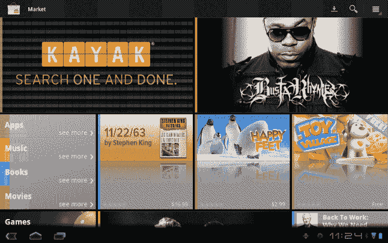

**图 5–1。** *蜂巢游戏商店首页*

应用选项卡是 Play Store 中 200，000 多个可用应用的中心位置。应用的特色面板有编辑选择和工作人员挑选的应用，这些应用会经常更改。当你在屏幕上从左向右滑动手指时，你会看到一个类别列表，便于你浏览特定类型的应用。如果你在屏幕上从右向左滑动，你会看到一个针对平板电脑优化的应用的更大的员工列表。

如果你不喜欢按类别浏览 20 多万个应用，这个搜索巨头为你提供了一个让它们出名的工具版本:搜索栏。搜索栏位于大型滑动横幅上方，您只需在搜索栏中输入名称或关键词(或两三个)，就可以快速浏览商店(如图图 5–2 所示)。Play Storesearch 栏将根据描述和应用名称为您提供搜索结果。这样，如果你正在搜索一个特定的应用，或者如果你只是在寻找执行特定任务的应用，你的搜索结果将是多样化的。

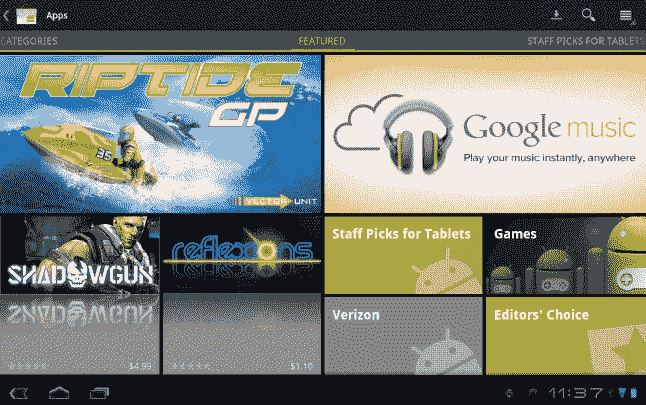

**图 5–2。**蜂巢商店中的*类别视图*

#### 选择应用

当你找到一个你认为可能会喜欢的应用时，点击它，你就会被带到该应用的产品页面。该页面为您提供了该应用的功能描述，以及该应用的截图和该应用的其他用户给出的评论。

你在这个页面上看到的第一件事，在屏幕的左边，是应用图标，应用的价格和它的评级。在下面，您将看到您正在查看的应用的版本，以及应用的大小和自应用在商店上线以来的总下载次数，如图 5–3 所示。应用的大小通常可以帮助您决定何时安装应用。如果它是一个大的应用(例如，20 到 30 兆字节)，如果你在一个数据连接不好的地区，安装应用需要一些时间。此外，如果你每月的移动数据量有限，你可以考虑等到有了 Wi-Fi 网络后再安装大型应用，以保存数据。

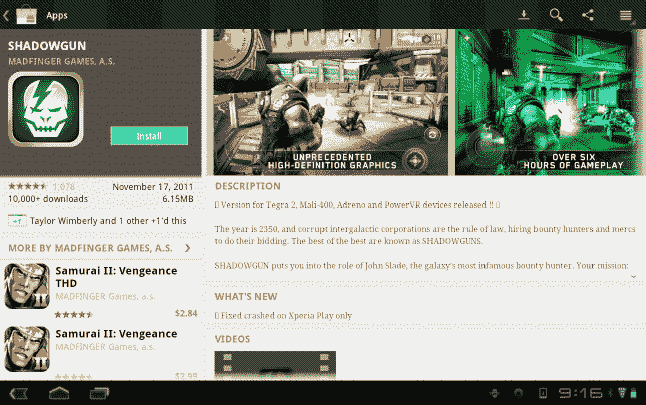

**图 5–3。**??【蜂巢店】App 查看

在此信息的右侧，您将看到由应用开发者提供的应用描述。这通常包括功能、优势和任何其他可能帮助您决定安装应用的有用信息。大多数已经在商店上架一段时间的应用都利用描述下方的“新功能”部分来讨论新功能，或者宣布他们已经修复了之前在应用中发现的错误。通过这种方式，如果您过去使用过某个应用，但决定将其替换为功能更强大的应用，您可以选择快速查看某个应用自上次使用以来是否有所改进。所有这些都显示在图 5–3 中。

截图可以让用户快速了解应用在他们设备上的样子。对于游戏来说，这是一个展示图形有多好看的快速方法，对于其他应用来说，这是一个展示功能的好方法。该页面的屏幕部分从左向右滚动，显示各种屏幕。有了这个功能，应用开发人员可以展示他们的产品，并帮助你决定这个应用对你有多大价值(如图 Figure 5–3 所示)。

感受这款应用如何工作的最好方法是查看评论。Play Store 允许任何安装了应用的用户对应用进行评级和评论。这些评论不受应用开发者的控制，除非有人说了一些完全不合时宜的话，在这种情况下，开发者可以标记出来，让谷歌看看，并决定是否删除它。这意味着这里的信息是原始的，未经编辑的，真实的。评分从一颗星到五颗星，综合评分显示在屏幕顶部，应用开发人员需要努力让用户开心(如图图 5–4 所示)。这一部分的评论通常是几个句子，但是用户可以写很多，如果他们愿意的话。

如果你有兴趣查看一些关于开发商的信息，比如他们的网站，或者如果你想通过电子邮件联系开发商，这些选项可以在每个产品页面的底部找到，以及一些相关应用的快照，以防你在这个产品页面上没有找到你想要的东西，或者你想看看竞争应用提供了什么。如果你已经决定这是适合你的应用，是时候安装它了！

#### 安装应用

在产品页面上，安装按钮位于左上角的灰色框中，就在价格下方。如果应用需要付费，图标将被标记为“购买”。如果没有，它将被标记为安装。选择购买应用会打开一个弹出窗口，提示您为应用付款。如果你从未使用过，这个弹出窗口的右上角会显示“添加卡”。点击此按钮将启动将您的信用卡添加到 Google Checkout 的过程。

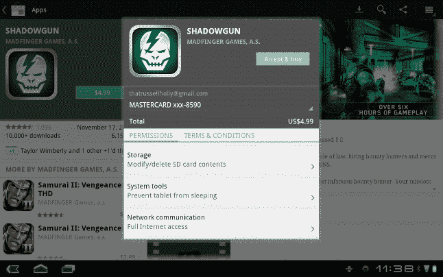

**图 5–4。** *在 app 蜂巢商店购买应用*

谷歌钱包是一项服务，让你在互联网上尽可能少点击购物，同时使用安全的支付方式。谷歌已经让现有的谷歌钱包用户轻松点击 OK，确认他们想要进行购买，并完成交易，如图 Figure 5–4 所示。对于从未使用过谷歌钱包的用户，会出现一个表格，让你将信用卡信息添加到谷歌钱包中以完成交易(如图图 5–5 所示)。如果你愿意，你可以告诉谷歌钱包保存这张卡，以便将来交易，或者你可以在每次想要购买时重复这个过程。一旦您在 Google Checkout 中选择了您的支付方式，您将回到 app 购买弹出窗口。

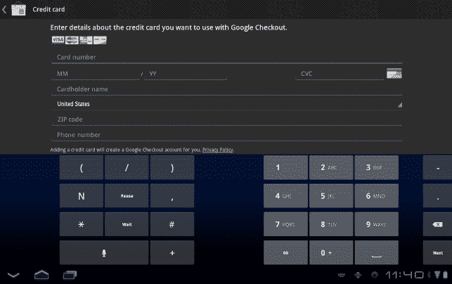

**图 5–5。** *在蜂巢店添加信用卡*

从这里你会得到一些安全信息。如果某个应用需要使用您设备的任何部分，您会在此屏幕上得到通知，如图 5–5 所示。应用可以请求使用资源，如平板电脑上的存储空间或互联网连接，也可以请求使用联系人、位置等信息。应用必须告诉你他们可以访问什么，并标在“这个应用可以访问”下面谷歌的应用指南确保应用开发人员无法保存任何此类信息；他们只能暂时访问它。请务必查看这些信息，以防您想要的应用需要持续的互联网连接，或者需要访问您的位置才能正常工作。

一旦你查看了安全信息，你所需要做的就是点击 OK 按钮，你的应用将开始下载并安装。根据应用的大小和你的互联网连接速度，这应该会很快发生。完成后，您将被重定向到商店中的我的应用，在那里您将在您已经安装的应用中看到您的新应用(如 Figure 5–6 所示)。在这里，你可以点击“打开”,然后继续使用你的应用。此外，应用图标现在将出现在您的应用抽屉中。

#### 更新 App

随着你继续安装应用，开发者不仅会开发新的应用，还会给现有的应用增加新的功能。当开发人员向应用添加新功能时，您会收到通知，告知您有一个应用的更新可用。一旦开发人员将更新推送到商店，这些更新就会立即出现。当你看到这个通知时，只需点击它，你就会被带到 Android 商店的“我的应用”部分。如果某个应用有更新，您会在应用页面上看到一个新按钮。“更新”按钮将出现在“打开”按钮下。点击此按钮时，将下载并安装应用更新。如果此更新影响了该应用与您的设备的交互方式，您将看到一个新的安全通知列表，让您知道该应用可以访问哪些内容。

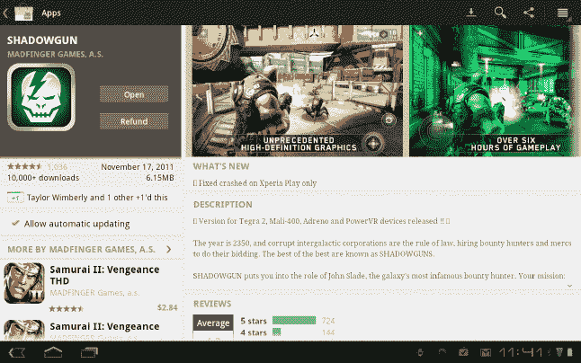

**图 5–6。** *我的应用查看，应用更新蜂巢商店*

如果你有很多应用，当有新的更新可用时，单独更新每个应用可能会有点耗时。为了让你更容易做到这一点，谷歌已经为你安装的每个应用添加了一个“允许自动更新”复选框，如图 Figure 5–6 所示。这将允许不需要新功能的更新在可用时自动安装。如果应用请求使用您平板电脑的新部件，您仍需要手动批准这些更改。

#### 提交评审

虽然这不是必须的，但是你可以在 Android Market 中留下你的任何体验的反馈。这个反馈被发送回发布者，并且每个使用 Android Market 的人都可以看到。不管你的经历是积极的还是消极的，留下反馈对每个人都有好处。当你试图决定安装哪个应用来完成一项任务时，查看这些应用的评论来了解其他人如何享受他们的体验通常是一个很好的工具。

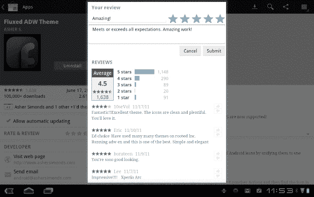

**图 5–7。** *在安卓商店对一款应用进行评级和评论*

Play Store 中所有内容的详细视图在屏幕左侧中间有一个评级和查看按钮。点击此按钮打开审核提交屏幕，如图 5–7 所示。在这里，你可以从一星到五星对每个应用进行评级，并对你的体验发表评论。完成后，点击提交按钮，Play Store 上的每个人都可以看到反馈。

Play 的特别之处在于，所有这些都是在平板电脑上完成的。你不需要将它连接到你的电脑上，你已经购买的应用会保存到你的帐户中，所以如果你移动到一个新的设备上，这些应用会一直在那里等着你。但是，如果您更愿意使用计算机，您也可以使用该选项，您将在下一节中了解到这一点。

### 使用网上商店播放

使用任何网络浏览器，包括您电脑上的浏览器，您还可以在您拥有的任何 Android 设备上远程安装和管理您的 Android 应用。在任何浏览器、任何设备上，转到`[`market.android.com`](http://market.android.com)`。如果你使用的是 Android 3.0 或更高版本的设备，这个网站看起来很像你在平板电脑上看到的市场的扩展版。这个网站旨在尽可能简单地查看 Play Storeas 中的 200，000 多个应用，并让您能够快速浏览这些应用，甚至无需触摸就可以在平板电脑上安装应用，并撰写应用的评论，所有这些都来自网络。

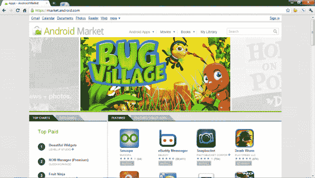

**图 5–8。** *从网络浏览器玩商店*

就像你平板电脑上的商店一样，首先迎接你的是一个巨大的滑动横幅，上面有特色应用，它们会从你身边滑过。在横幅下方，您可以看到更多精选应用，以及在免费和付费应用排行榜上名列前茅的应用(如图 5–8 所示)。当你在电脑上向下滚动这一页时，你会看到符合这些类别的其余应用。

在这个页面上，你还可以看到类别和特色平板电脑应用的标签。点击类别选项卡将会在一个可滚动列表中显示与您的 Android 平板电脑相同的类别列表。这里的信息与您在平板电脑上看到的完全相同，只是组织方式稍有不同，以便在您的计算机上更容易使用。

当你准备安装一个应用时，事情会有一点不同。对于同时拥有 Android 平板电脑和 Android 手机的用户，这里会提示您选择要在哪个设备上安装该应用(如 Figure 5–9 所示)。这并不意味着你不能在两者上安装它，但是如果你想为你的平板电脑安装一个优化的 Twitter 客户端或者一个动态壁纸，而你不想在你的手机上安装，你可以很容易地做到这一点，而不需要触摸任何一个 Android 设备。

选择购买或安装后，根据应用的不同，会询问您希望它去哪里。在图 5–9 中，该窗口底部的大按钮将显示当前使用您的 Google 帐户登录的设备列表。选择您想要的设备，然后轻按“继续”。

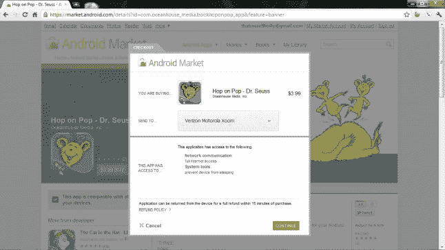

**图 5–9。** *从 Web Play 商店安装应用*

Web Play Storeinterface 是一种无需实际接触设备就能与设备互动的好方法。作为“云计算”的一部分，预计未来越来越多的谷歌产品将采用这种方式。平板电脑、智能手机、电脑只是你想使用的服务和活动的窗口。谷歌图书是一项已经以这种方式运作的谷歌服务。

### 使用游戏书

Play Storeisn 不仅仅是您所有应用的一站式商店。谷歌也将该商店作为其电子书的数字商店。谷歌拥有一个每天都在增长的庞大电子书图书馆，它为任何 Android 设备提供电子书阅读器服务 Google Books。因此，你在 Play Storewill 购买的任何电子书都可以在任何 Android 设备上阅读，也可以在任何带有网络浏览器的设备上阅读，比如你的电脑。在 Play Storehome 主页上，屏幕左上方的 Android 应用旁边有一个“图书”标签。点击那个标签，你就会被带到游戏书店。

**注:**适用于 Android 平板电脑的 Play Book Storefor 仅适用于 Android 3.0 及更高版本的设备。对于运行早期版本 Android 的 Android 平板电脑，这些书籍仍然可以在平板电脑上购买和查看，但您必须从网络浏览器的`[`play.google.com`](http://play.google.com)`开始。

Play Books 选项卡的布局与 Android Apps 选项卡的布局几乎相同。然而，与 Android 应用页面不同，这里的所有内容都是蓝色主题，而不是绿色，但导航非常相似。在图 5–10 中，你右边的类别视图现在提供了一个可滚动的书籍类型列表，从传记到游记。在列表中上下滑动手指以找到您感兴趣的流派，然后轻按类别以进入这些书籍的列表视图，其中显示了每本书的封面。

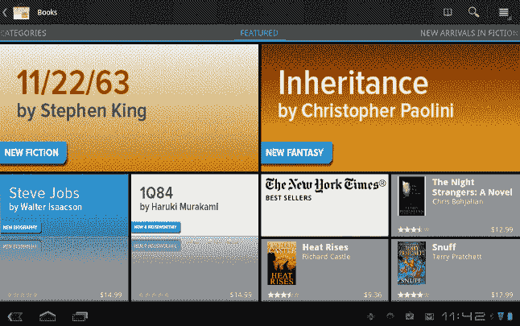

**图 5–10。** *在游戏店玩书*

快照视图现在向您显示分组中的热门图书，如顶级图书、畅销书和顶级免费图书。在页面顶部的图 5–10 中，你会看到一些特色标题，这些标题被谷歌选为新颖、值得关注、热门话题或畅销书。轻按任何页面上显示的任何标题都会将您带到该书的产品页面。

与 Android Apps 产品页面一样，图书产品页面为您提供了每本书的丰富信息。在页面的右边，你可以看到作者对这本书的描述，下面是从 Play Books Store 下载了这本书的用户写的关于这本书的评论。在书评下面，你还会发现一些相关的标题，它们的评级显示在书的封面旁边。

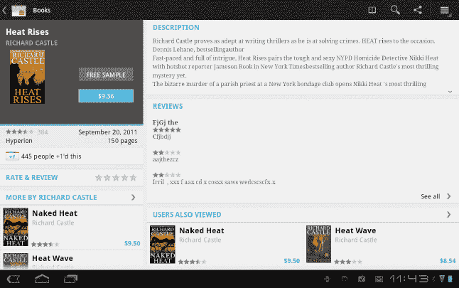

**图 5–11。** *图书查看谷歌图书*

在图 5–11 所示的产品页面右侧，您会看到图书评级、图书封面以及购买或下载图书的选项，具体取决于图书是否免费。如果这本书不是免费的，在购买按钮下面有一个免费的样本按钮，它会给你这本书的前 20 到 25 页。当您的免费样品用完时，Play Books 会提示您返回商店的“关于这本书”产品页面，或者允许您购买这本书，如图图 5–12 所示。

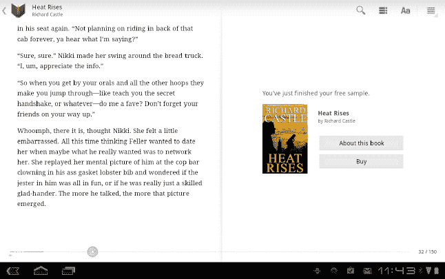

**图 5–12。** *免费试读完蜂巢书店供玩的书籍*

当您选择购买一本书时，Google Wallet 支付网关会提示您输入一张新的信用卡或选择一张您之前用 Google Wallet 保存的信用卡。完成购买后，您可以立即在平板电脑上的 Google Books 应用中以及任何网络浏览器上看到这本书。

### 使用播放电影

随着越来越多的人不断连接到互联网，从数字商店而不是实体商店租借电影的想法变得越来越流行。显而易见的好处是，数字商店给你提供了一个更大的图书馆，你永远不用担心是否有你想看的电影的拷贝。考虑到这一点，谷歌通过 Play Store 提供电影租赁服务，让你无论在哪里都能看到这些电影。

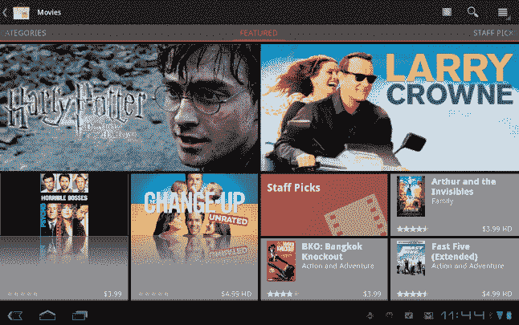

**图 5–13。** *播放商店里的电影商店*

在 Play Store 的主屏幕上，找到右上角的“电影”选项卡，然后点击该选项卡。如 Figure 5–13 所示，电影商店会在您到达时提供要添加到库中的最新电影的快照。如果您知道您要查找的电影，请点击屏幕右上方的搜索图标，然后输入您想要租赁的电影的名称。如果您想要浏览，请在屏幕上从左向右滑动手指，以显示您可以浏览的类别。或者，如果你在屏幕上从右向左滑动手指，你会看到一些员工选择，谷歌员工在商店里挑选出他们最喜欢的电影。找到您想要租赁的电影后，轻按电影标题。

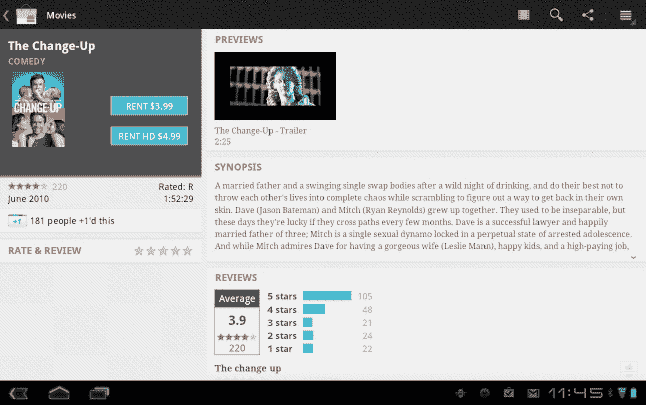

**图 5–14。** *详细查看*在 Play 电影商店找到的变速

 *如 Figure 5–14 所示，当您查看商店中任何电影的详细视图时，您可以访问电影的官方预告片、文件概要以及 Play Store 中看过该电影的其他人对该电影的评论。许多电影为你提供租借标准清晰度或高清晰度版本的能力。

**注意:**视频的高清版本比标清大很多。如果你通过移动网络观看电影，你将会使用更多的月流量来观看高清电影。

轻按您想要的租赁选项，您将通过谷歌钱包完成结账过程。当您完成结帐过程后，系统会邀请您下载电影以便在没有连接到互联网的情况下观看，或者点击播放按钮以播放电影。此外，该电影将出现在平板电脑上播放电影应用中您租借的电影中，如 Figure 5–15 所示。这些电影不仅可以在你的平板电脑上观看。现在您已经租借了这部电影，您可以在任何连接了 Gmail 帐户的地方观看它。如果你用的是电脑或谷歌电视，去 YouTube，这部电影会出现在你账户的“租借电影”部分。

**图 5–15。** *用从 Play Store 租借的电影播放电影 app*

当你租一部电影时，你可以看 30 天。在这 30 天内，你可以随时开始观看这部电影。一旦你开始看你租的电影，你就可以 24 小时看这部电影，然后电影就到期了，你就可以归还这部电影。

Android Market 电影商店使得在旅途中观看电影变得非常容易，而且因为它与 Play Movies 应用配合得非常好，我们将在第七章中详细讨论，所以它是 Android 平板电脑的一个很好的补充。

### 使用 Google Play 音乐

对许多人来说，完全转向数字音乐提供商是不切实际的。我不知道有多少人的收藏中没有成堆的 CD、磁带，甚至唱片。再次购买所有的音乐，只是为了让它在你所有的新音乐中可以数字播放是行不通的。在第七章中，你会学到一些谷歌让你轻松地把你已经拥有的音乐转移到你的平板电脑上的方法，但是一旦你有了，购买相同数字格式的新歌不是更有意义吗？有了 Play Store 中的 Google Play 音乐商店，你不仅可以购买歌曲，还可以收听庞大的免费音乐库。

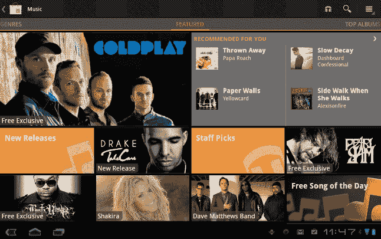

**图 5–16。** *Google 音乐商店中的 Play 商店*

找到 Play Store 主屏幕左下角的音乐选项卡，然后轻按音乐。如图 5–16 所示，如果您使用 Google Play 音乐应用，音乐商店将向您显示添加到服务中的最新音乐，以及根据您的收听历史为您推荐的一些音乐。你也会在这个页面上看到谷歌员工的选择。

如果你从左向右滑动手指，你会看到一个流派列表，你可以浏览找到你想听的音乐。如果你从右向左滑动，你会看到 Play Store 中最畅销专辑的列表。此外，如果您知道您要查找的艺术家或歌曲，您只需点击右上角的搜索图标，然后键入您要查找的内容。找到艺术家、专辑或您想听的内容后，您可以轻按您的选择来查看详细视图。

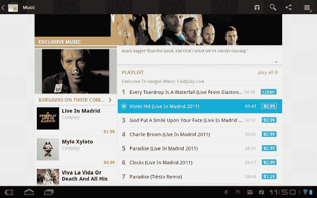

**图 5–17。***Google Play 音乐商店中酷玩的详细视图*

谷歌音乐商店中艺术家的详细视图，如图 Figure 5–17 所示，将使您能够浏览他们的专辑，在购买前在商店中听歌，并让您访问他们可能提供的任何免费内容。艺术家可以提供的一些附加内容是采访或 Placy 音乐商店独有的音乐。

若要在购买前试听歌曲，请轻按歌曲名称，如果您已接入互联网，歌曲将立即开始播放。歌曲名称旁边会出现一个暂停图标，让您可以随意暂停和播放。当你找到一首你喜欢的歌曲或专辑时，点击蓝色的价格标签就可以进入谷歌钱包。

一旦您完成购买，您刚刚购买的所有内容都可以立即在您的平板电脑和 Google Play 音乐应用中播放。

### 总结

Android 市场是一个不断增长和变化的生态系统。随着谷歌增加在那里销售的内容类型，用户将进一步纠结于使用谷歌作为他们的内容提供商。玩应用，玩书，看电影，听音乐……也许最终我们会看到谷歌配件都通过这个应用销售。使用商店的次数越多，就越能从集中管理现有应用和服务中获益。

在下一章中，我们将了解如何在平板电脑上使用相机应用，以及与设备上的相机应用交互的应用。*