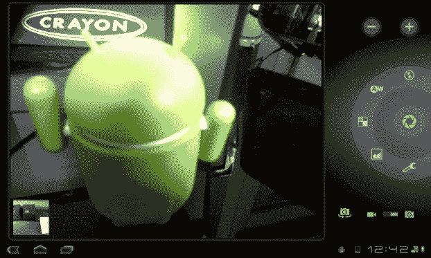
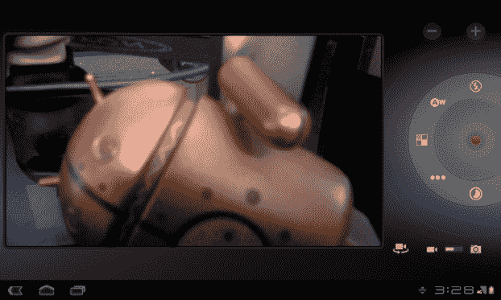
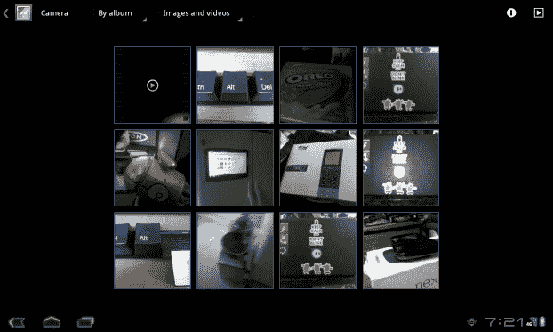
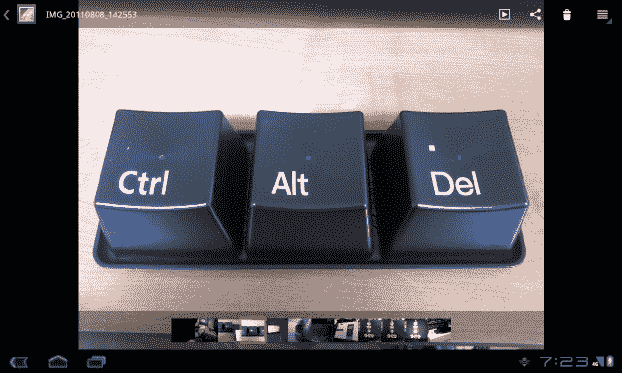
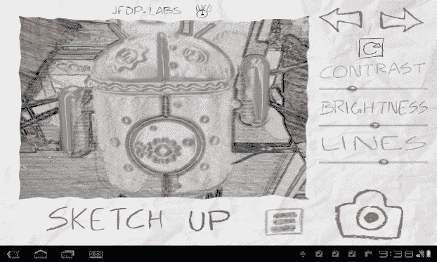
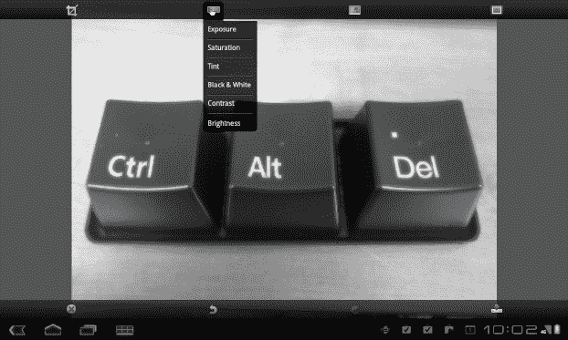

# 六、使用相机

不久前，在手机上安装摄像头的想法还被认为是疯狂的。手机上的摄像头被广泛认为是不必要的，无聊的附加物，应该专注于真正擅长打电话。虽然花了一点时间，但在手机上安装摄像头开始越来越受欢迎。这一趋势开始后，不到一年，每部售出的手机都内置了摄像头。起初，它们并不是很好的相机，而且大多数手机的屏幕都很小，质量也很差，以至于你不得不将照片传输到电脑上才能真正欣赏。今天的情况并非如此。

如今，移动设备上的相机有望拍摄出媲美傻瓜相机的照片，并录制高质量的视频，以便快速与朋友分享。现在，一种新的趋势开始了。辅助摄像机也面向用户放置，与另一个摄像机具有相同的期望。通过前置摄像头，用户可以给自己拍照，也可以与其他用户进行视频通话。这种趋势开始时很慢，但已经迅速蔓延，以至于许多平板电脑现在都有两个摄像头。在本章中，我们将讨论这些相机的不同用途，包括一些第三方应用，为您提供一些附加功能。

### 介绍安卓相机应用

与 Android 手机非常相似，平板电脑上的相机是由两个不同的应用控制的:相机应用，负责拍照和录制视频，以及画廊应用，允许您查看用平板电脑拍摄的照片和视频。这些应用并不像 Gmail 或 Play Store 那样在每台安卓平板电脑上都完全相同。这是因为谷歌为 Android 设备制造商提供了工具，让他们按照自己认为合适的方式操纵相机应用的外观和感觉。然而，大多数人还是照原样使用这款应用。正因为如此，本章中的所有例子都将来自“库存”蜂巢。

让我们仔细看看这两个应用，从相机开始。

### 使用平板相机

你可以使用安卓相机拍摄静态照片或视频。我们将从使用相机拍摄单幅图片开始。

要使用 Android 平板相机，请导航至应用抽屉，并从列表中选择相机应用。寻找中间有蓝色球体的圆形图标，与普通 Android 手机上的图标相同。

如图 6–1 所示，相机应用的主屏幕提供了一个大的观看区域，向您显示您将要拍摄的照片。因为大多数 Android 平板电脑都大于 7 英寸，所以该应用被设计成当你拿着平板电脑时，几乎只能用你的右手拇指来控制一切。在屏幕的左下方，您会看到一个小窗口，上面有之前拍摄的照片。轻按该框将带您进入画廊应用，我们将进入下一步。

**图 6–1。** *蜂巢相机 app*

#### 选择相机设置

应用右侧的圆形转盘容纳了相机的控制和选项，其中心有一个用于拍照的大按钮。拨号盘可让您快速控制相机:

###### 闪光

位于表盘顶部，点击此图标将显示闪光模式。这里的三个选项是自动、开和关。第一次打开相机时，应用会默认自动设置。

###### 白平衡

该按钮位于表盘上闪光灯模式的左侧，为您周围的灯光类型提供了五种设置选项。这些设置包括自动、白炽灯、日光、荧光和多云。自动是默认选项，在您首次使用该应用时设置。

###### 颜色效果

颜色效果位于表盘上白平衡设置的正下方，有六种图像滤镜可供选择。从单色、深褐色、负片、曝光、色调分离或无中选择将立即在您的查看屏幕上设置滤镜。

###### 场景模式

该按钮位于表盘上的颜色效果图标下方，可让您访问各种环境的预编程设置列表。这些环境包括动作、肖像、风景、夜晚、夜间肖像、剧院、海滩和雪。默认情况下，“自动”设定为动态选择最佳设置。

###### 相机设置

在转盘的底部，您可以看到一系列控制照片拍摄细节的设置。如果您的平板电脑有 microSD、SD 或 USB 插槽，您可以更改商店位置。您可以调整平板电脑的对焦模式，以更好地适应您正在拍摄的图片类型。您可以更改拍摄图像的曝光度，以及图像尺寸和图像质量。这些设置中有许多是为熟练的摄影师准备的，他们可以从平板电脑上获得比自动设置更好的照片。

###### 一款云视频会议软件

在控制盘的正上方，你会发现一个大的加号(+)和减号(–)，允许你放大和缩小。除非你的平板电脑有光学变焦，否则你将使用所谓的*数码变焦*。数码变焦会拉伸图像，使其看起来像是放大了某些东西。

###### 切换摄像机

如果您的平板电脑有前置摄像头，您会在控制转盘下方看到一个图标，可让您快速从前置摄像头切换到后置摄像头。这个图标旁边有一个开关，可以让你从拍摄单张照片切换到录制视频。

#### 拍照

当你按照你想要的方式设置好你的相机后，按住表盘中央的按钮。一旦你开始，相机会聚焦，并通过点亮聚焦区域上方的绿色电子框来提醒你已经准备好拍照了。当你得到你想要的照片时，把你的手指从按钮上移开，照片就会被拍摄下来。如果你赶时间，快速点击相机按钮会使相机更快地完成摄影步骤，但你会经常发现照片不太清晰。

#### 录制视频

相机应用中的摄像机功能旨在简单易用。右边还是一样的表盘，只是有些功能不一样了。例如，你有视频质量，而不是场景模式。视频质量允许您在设备的可用模式之间切换。这些模式会根据你的相机类型和质量而有所不同。位于刻度盘底部的其他功能(如图图 6–2 所示)是延时录像的设置。点击图标时，从显示的时间测量值中进行选择，您就可以开始记录了。若要开始录制，请轻按一下表盘中央的红色按钮，并准备好在完成录制后再次轻按。

**图 6–2。**相机 app 中的*蜂巢摄录机功能*

#### 拍摄或记录自己

前面有摄像头的平板电脑将允许您轻松地为自己拍照或录制视频。有了前后都有摄像头的平板电脑，你就可以在用后置摄像头还是前置摄像头拍照或录像之间切换了。

在设置环的左下方寻找摄像机图标，如 Figure 6–2 所示，其下方有一个旋转箭头。默认情况下，相机将始终与相机应用中的后置摄像头一起打开。如果您使用摄像头进行视频聊天，它将默认为前置摄像头。如果你点击图标，它会切换到对面的摄像头。在录制视频时，您可以任意多次切换摄像机，应用将从当时活动的摄像机继续录制。

现在，您已经拍摄了照片，拍摄了一些视频，并使用了所有设置，是时候去画廊应用看看您的工作了！

### 使用画廊

Gallery 应用是平板电脑上所有图像的集中位置。如果你从网上、电子邮件、甚至是应用下载图片，这些图片将会进入图库。这个应用也是你从平板电脑上拍摄的任何照片或视频都会显示的地方。在这个应用中，你可以对你的图片和视频进行分类，按照你认为合适的方式进行编辑，并与全世界分享。

有两种方法可以访问图库应用。您可以使用应用抽屉中的应用图标，也可以使用相机应用内部的快速访问按钮。这两个按钮中的任何一个都可以将您带到图库应用的主屏幕。

#### 网格视图

当你第一次激活 Gallery 应用时，你会看到你所有的图像和视频都呈现在一个左右滚动的网格中。用手指在屏幕上拖动，以访问更多图片和视频。如果您收集了大量图片或视频，您可以使用屏幕左上角的控件对其进行分类(如 Figure 6–3 所示)。当您点击这些过滤器时，它们会下拉，允许您按日期、时间、地点等进行排序。如果你想查看更多关于图片的信息，在右上角有一个图标，里面有一个 *i* 。点击图标，然后点击您想要查看更多信息的图像。一旦你找到你想要的图像或视频，点击它，你将被带到单项视图。

**图 6–3。** *蜂巢画廊 app，网格视图*

#### 单项视图

单一项目视图允许您使用一些工具在网格视图中查看任何图片的更大版本，以便您可以充分利用您的照片。然而，如果你发现自己在错误的图像上，在这个视图的底部有一个线条视图，可以让你快速改变图片。确保您有想要编辑或共享的图像。

在单项视图中，您可以通过将两个手指放在屏幕上并移动这两个手指使其靠近或远离来放大或缩小图片。通过将手指移得更远，图像会放大。通过将手指靠拢，图像会缩小。此外，如果你在屏幕上想要自动放大的地方双击，你也可以这样做。要返回图片的原始缩放比例，只需双击屏幕中心。

如果您想裁剪您拍摄的图像，点击屏幕右上角的菜单按钮(如 Figure 6–4 所示)。下拉列表包括旋转图像、将图像设置为联系人照片或壁纸以及裁剪图像的选项。

**图 6–4。** *蜂巢画廊 App，单品查看*

要裁剪图像，请点击裁剪功能。将出现一个框，覆盖屏幕上的图像。用手指将此框的壁拖到您想要裁剪的区域。一旦你将方框放置在你想要的位置，从右上角选择 OK，图像将被裁剪。这将创建一个新的图像，所以不用担心不小心破坏了一个图片。

现在你的照片看起来像你喜欢的样子，是时候分享它了。屏幕右上方的不完整三角形会显示出不同的位置，当您点击它时，您可以共享照片或视频。选择你想要共享图片的方式，你将被重定向到该应用以共享图像或视频。

### 使用其他应用

当然，你不必使用平板电脑自带的相机应用。事实上，Play Store 中的几十个应用可以让你的相机做出各种新花样。例如，考虑纸相机。

正如你在图 6–5 中看到的，这个应用与谷歌给你的大相径庭。这款应用为你提供了一套新的滤镜和功能，让你可以尽情享受相机带来的乐趣，这是原生应用无法做到的。一旦你拍了一张照片，这个应用就会把照片保存在你的图库中进行编辑和分享，就像相机应用一样。

**图 6–5。** *纸相机 app*

拍照很有趣，但如果你想在平板电脑上编辑这些照片做更多的事情呢？Play Store 也为您提供了大量选择。Adobe 在 Android 平板电脑上有一个流行的图片编辑软件版本，叫做 Adobe Photoshop Express。

Adobe 的免费应用允许您使用比图库中包含的工具更多的工具来编辑和更改图库中的任何照片(如图 6–6 所示)。一旦你进行了编辑，该应用将保存照片，就像它是一个新的图像一样，允许你保留你最初拍摄的照片。

**图 6–6。** *Adobe Photoshop Express 应用。*

### 总结

虽然你不太可能拿出你的大平板电脑来拍照，特别是如果你有一个真正的相机或手机，相机仍然是任何平板电脑上的一个强大工具，Play Store 有很多方法可以让使用相机变得更有趣和更有效率。

在下一章中，您将了解如何通过平板电脑上的音乐、电影和游戏，将平板电脑变成数字娱乐世界的中心。