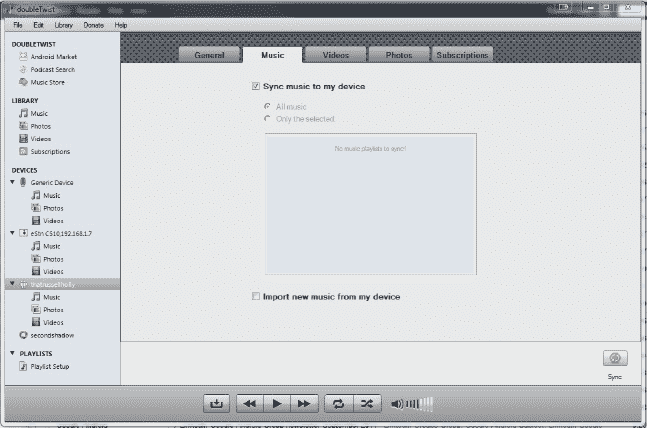

# 七、音乐、电影和游戏

您的 Android 平板电脑不仅仅是一个用于办公和收发电子邮件的联网设备。它也是几乎所有数字娱乐形式的入口。如果你有一张 CD，如果你曾经买过一部电影的数字拷贝，或者甚至你订阅了网飞，你的平板电脑可以用来存储，流式播放和欣赏电影，无论你在哪里。

在本章中，您将了解如何将音乐和电影放入平板电脑，以及如何将这些内容从在线服务传输到平板电脑。我们也不会止步于音乐和电影，因为你的 Android 平板电脑也可以访问各种类型的多个游戏库。您将了解在平板电脑上玩游戏可以做的许多不同的事情，以及一些可以用来将平板电脑变成一个完整娱乐系统的配件。

### 在平板电脑上听音乐

你可能有一架子的 CD。你可能已经把其中一些 CD 拷贝到你的电脑上了。你甚至可以使用 iTunes 或 Windows Media Player 这样的音乐管理器来收集音乐。如果你对这些东西中的任何一个说“这就是我”，那么你就可以非常简单地将你的音乐转移到你的 Android 平板电脑上。

不过，也许你的电脑上没有音乐收藏。也许你使用网络电台或其他形式的基于网络的服务来播放音乐。你的安卓平板电脑也支持你。本质上，任何当前的音乐消费方式都可以通过你的 Android 平板电脑得到增强。为了简单起见，我们将分解将音乐移动到平板电脑的步骤。

#### 播放储存的音乐

无论你是拥有一堆 CD，还是一直在下载音乐，你的 Android 平板电脑都可以让你轻松地将音乐从电脑转移到平板电脑上。

**注意:**要将 Android 平板电脑连接到电脑，您需要一根 USB 电缆，最好是设备自带的电缆。

将平板电脑连接到电脑。一旦平板电脑和计算机检测到连接，您将在桌面上看到一个弹出窗口，并在平板电脑上看到一个通知(如 Figure 7–1 所示)。

**图 7–1。** *Windows 7 检测你的平板电脑*

打开文件夹后，双击音乐文件夹。进入音乐文件夹后，您需要在电脑上找到音乐。您只需将音乐从现有的音乐文件夹移动到平板电脑上的音乐文件夹。为此，将您的音乐从音乐文件夹拖到平板电脑上的音乐文件夹(如图 Figure 7–2 所示)。

**图 7–2。** *将音乐从电脑传输到平板电脑*

将音乐拖到平板电脑的音乐文件夹后，弹出的进度条会显示音乐传输到平板电脑需要多长时间，如 Figure 7–2 所示。

**警告:**请勿在传输过程中断开平板电脑与电脑的连接。如果平板电脑在此过程中断开连接，您将面临音乐无法传输或无法播放的风险，您需要重新开始此过程。

音乐传输完成后，您可以通过拔下 USB 电缆断开平板电脑的连接，现在就可以开始在平板电脑上听音乐了。

在应用抽屉中找到 Google Play 音乐应用，轻按一次将其打开。每次打开音乐应用时，它都会在您的平板电脑中搜索新的音乐来播放，因此您刚刚传输到平板电脑的歌曲已经在应用中，可以随时播放。

音乐应用的旋转视图允许您在屏幕上拖动手指，并显示您已传输到平板电脑的所有歌曲的专辑封面(如 Figure 7–3 所示)。在此视图中，您可以通过轻按专辑封面来选择特定专辑并显示其曲目

**图 7–3。** *Google Play 音乐的旋转木马视图*

在专辑视图中，您会看到专辑中的所有歌曲(如 Figure 7–4 所示)。轻按列表中的任何歌曲都会播放它。您需要播放、停止、暂停和调节歌曲音量的控件总是位于屏幕底部。

**图 7–4。** *Google Play 音乐列表视图*

您可以选择任何方式组织 Google Play 音乐应用中的歌曲。如果你点击应用左上方耳机图标旁边的单词，你会看到一个显示音乐标题的列表。例如，如果您选择歌曲视图，您将看到一个清单中所有歌曲的列表(参见 Figure 7–5)。这样，如果您选择列表顶部的随机播放选项，Google Play 音乐应用将会随机播放您所有的歌曲。

**图 7–5。** *Google Play 音乐的排序菜单*

一旦你的音乐开始播放，你就可以离开应用，去使用平板电脑上的其他应用。您的音乐将继续播放。选择您想听的歌曲，点击主屏幕按钮，进入主屏幕(如 Figure 7–6 所示)。

从平板电脑上的任何位置，您都可以选择主屏幕右下角的数字时钟，调出您的设置和通知快速面板(如 Figure 7–6 所示)。如果您正在播放音乐，基本的音乐控制将显示在该面板中，允许您在 Google Play 音乐应用中快速暂停、播放或跳过曲目，而无需离开您正在做的事情。

**图 7–6。** *蜂巢主屏幕上的音乐播放器*

#### 使用其他音乐应用

所以，也许你有一个相当大的图书馆，你真的不想让你的平板电脑长时间插在电脑上。有一个解决方案，但它需要一两个与你的平板电脑不兼容的应用。

前往 Play Store，购买 doubleTwist 应用和 doubleTwist AirSync 应用。doubleTwist 是平板电脑自带的 Google Play 音乐应用的替代产品。一旦你安装了 doubleTwist，系统会提示你允许它把你电脑的应用用电子邮件发给你。在应用中输入你的电子邮件地址，然后到你的电脑前安装程序。

**注意:**要实现这一点，你的电脑和平板电脑需要在同一个网络上。您需要一个 Wi-Fi 连接来连接平板电脑。

一旦你在电脑上安装了程序，点击 doubleTwist 应用中的 AirSync 按钮。该图标将位于应用的左下方。完成后，该应用将开始引导您通过 Wi-Fi 连接平板电脑和电脑(如图 Figure 7–7 所示)。

**图 7–7。** *麻花蜂巢 app 设置*

这个过程从 doubleTwist 为您提供一个五位数的代码开始。在您的电脑上，从 doubleTwist 应用左侧的面板中找到并选择您的用户名。该用户名旁边会有 AirSync 图标。

当您选择用户名时，会要求您输入平板电脑上 doubleTwist 应用刚刚提供给您的五位数代码(如图 7–8 所示)。只要你正确地复制了这些信息，你的平板电脑和电脑会立即让你知道你成功了。

**图 7–8。** *DoubleTwist AirSync PC 设置*

当您的平板电脑显示如图图 7–9 所示的成功屏幕时，您将能够将音乐传输到平板电脑，而无需将其连接到电脑。从计算机中，选择音乐选项卡，并确保选中“将音乐同步到我的设备”框。然后你会看到橙色的同步按钮在程序的右下角亮起(参见图 7–10)。当您点击该图标时，您的音乐将开始传输到您的平板电脑。此时，您会在平板电脑的通知栏中看到 AirSync 图标。在传输完成之前，您的平板电脑必须保持 Wi-Fi 连接，这一点很重要。

**图 7–9。** *DoubleTwist AirSync 蜂巢 app 确认画面*

**图 7–10。** *DoubleTwist AirSync 音乐页面*

在 Play Store 中还有许多其他方式来享受音乐，您应该觉得自己有能力安装尽可能多的不同音乐应用，并探索这些应用提供的功能如何让您受益匪浅。

例如，懒鬼电台可以让你创建一个个性化的电台，只播放你选择的艺术家的音乐。或者，如果你发现自己处于这样一种痛苦的境地，一首歌的名字就在你的舌尖上，但你就是不能说出它的名字，那么试试 SoundHound 应用。你可以播放一首歌的一部分，甚至只是对着应用唱歌，它会告诉你艺术家的名字和你正在听的歌曲。

无论你去哪里，都能把你的音乐带在身边，这是一个很好的方式，不仅可以让你的整个图书馆触手可及，还可以有一个备份，以防 CD 或你的家用电脑发生任何问题。虽然在音乐上这样做很棒，但你可能会惊讶地发现你可以在电影上做同样的事情。

### 用平板电脑看电影

如今，许多电影在发行 DVD 时都包含了额外的数字拷贝。这项服务是为那些喜欢在电脑、智能手机、MP4 播放器或平板电脑上观看电影的人提供的。其中许多设备，尤其是平板电脑，没有内置 DVD 播放器，所以需要一个数字拷贝。此外，有许多电影流媒体服务可以让你通过互联网观看电影，而无需将电影存储在你的电脑上。

#### 在平板电脑上观看储存的电影

就像我们处理音乐一样，需要一根连接到电脑的 USB 电缆来将储存在电脑上的电影传输到平板电脑上。将电影传输到平板电脑之前，请确保它已充满电，因为许多平板电脑无法通过电脑上的 USB 端口充电。

**注:**一般标准清晰度的正片长度的电影大约要占用 700MB 的空间。同样一部高清电影可能会占用多达 2GB 的存储空间。这意味着，电影不仅会在平板电脑上占据更多空间，而且传输时间也更长。

将平板电脑连接到电脑后，电脑上会弹出一个窗口，询问您下一步该做什么。从列表中选择“打开设备以查看文件”。当窗口打开时，您会在列表中看到一个“影片”文件夹。双击“电影”文件夹将其打开。当“影片”文件夹打开时，将您的影片从电脑拖到“影片”文件夹。

传输完成后，断开平板电脑与电脑的连接。现在电影已经在你的电脑上了，从应用抽屉进入你的视频应用。

平板电脑上的视频应用有两种模式，一种用于显示流媒体视频，另一种用于存储视频。从应用的左上角选择个人视频选项卡，如 Figure 7–11 所示。视图将变为可供观看的视频的水平列表，包括您传输到平板电脑或直接通过互联网从在线商店购买的视频。如果平板电脑上有摄像头，该列表还将包括您用平板电脑录制的视频。轻按您想要观看的电影，电影将会充满屏幕。若要退出应用，请轻按主屏幕按钮或后退按钮返回菜单。

**图 7–11。** *蜂巢视频 app 个人视频标签*

#### 在平板电脑上观看流媒体电影

你应该在网上一次租一部电影，还是按月付费来访问电影库？这些选项已经在 PC 和手机上提供了很长一段时间，现在它们也可以在平板电脑上提供，这使得你可以在任何有互联网连接的地方访问你的电影服务帐户。对于电影租赁，谷歌在你的平板电脑上提供自己的服务谷歌视频。对于订阅服务，我们将介绍 Play Store 中为您提供的几个选项。

##### 租借 Google Play 电影

Android 版 Google Play Movies 应用允许你从库中租借电影，然后在任何联网的地方观看。你可以在你的电脑、平板电脑、谷歌电视或智能手机上观看你租的电影，你可以在这些设备之间来回切换，你租的电影将从它停止的地方继续播放。你租的电影你可以看 30 天，直到你开始看，然后你可以看 24 小时。

从应用抽屉中，点击 Google Play 电影应用。当应用加载时，底部会显示最常租借的视频列表，应用中间会显示当前租借的视频(参见图 7–12)。因为这是你第一次使用该应用，你没有租赁，所以我们去租一个吧。点击屏幕右上角的商店图标。

**图 7–12。** *Google Play 电影 app for 蜂巢*

谷歌视频商店是 Play 商店的一部分，所以不需要注册新账户。你的谷歌个人资料会被自动识别，如果你已经购买了一个应用或一本书，你的谷歌结账信息也会显示在那里。当您浏览电影类别时，请注意每部电影的价格都在电影封面和片名旁边(如图 Figure 7–13 所示)。轻按您想要观看的影片以查看该影片的详细视图。

**图 7–13。** *用蜂巢 app 购买电影*

详细视图向您展示了电影的概要，随后是电影的预览(参见图 7–14)。用手指向下滚动以显示演员和演职员表的附加信息。在这个页面上，你可以使用右上角的分享按钮来分享电影的详细信息，或者如果你还没有找到你想要的电影，你可以浏览相关的电影。要购买这部电影，你可以在标准清晰度和高清之间进行选择；只需点击您的选择，并通过谷歌钱包完成购买。

**图 7–14。** *电影购买详解*

**警告:**高清视频比标清大很多。如果你通过移动数据连接观看电影，你将会更快地消耗你每月分配的高清电影数据。

一旦购买完成，视频将立即显示在 Google Play Movies 应用的“我的租赁”部分(如图 7–15 所示)。要观看电影，请点击它的艺术，然后您将被带到电影。现在，该电影已在应用中，它也将出现在您登录的任何电脑上的 YouTube 上。

**图 7–15。** *用购买的电影播放电影 app*

##### 查看 Hulu、网飞、大片视频等

许多基于网络的视频服务也有 Android 应用，只要你有互联网连接，你就可以从平板电脑上访问这些内容。在 Play Store 中搜索您选择的服务，并像安装其他应用一样安装该应用。如果您拥有这些服务的帐户，系统会提示您登录(参见图 7–16 中的网飞登录屏幕)。

**图 7–16。** *蜂巢上的网飞 app*

如果您以前从未使用过这些服务，系统会提示您创建一个帐户。如果你感兴趣的服务像网飞和 Hulu 一样按月收费，或者像 Blockbuster 一样按视频收费，你会被要求将你的支付信息存储在他们的服务中，而不是通过谷歌钱包。

##### 在电视上观看平板电脑视频

如果您安装了我们讨论过的任何视频观看解决方案，您就已经创建了一个非常强大的将视频随身携带的方式。当旅行、拜访朋友和家人，甚至只是为旅途中的孩子们提供一些娱乐时，视频会成为一种很大的干扰。然而，很有可能你的平板电脑并不是你家里最大的屏幕。如果您的平板电脑有 HDMI 端口，您可以使用 HDMI 电缆将平板电脑连接到电视，然后在电视上观看您的所有视频。如果你不确定你的平板电脑是否有 HDMI 端口，一定要查看第一章。

平板电脑连接电视的另一种方式是通过无线服务。许多新的高清电视支持一种叫做 DLNA 的技术。这项技术允许您将存储在平板电脑上的视频无线传输到高清电视上。有许多支持 DLNA 的电视，Play Store 中的几个应用提供了一步一步的说明。你将无法使用 DLNA 在电视上播放 Hulu 或网飞等内容，但你储存在平板电脑上的任何视频都可以播放。

当谈到视频时，你每天可以用平板电脑做越来越多的事情。只要有合适的应用，这台微型电脑就可以成为你的娱乐中心、保姆或旅行伴侣。

### 在平板电脑上玩游戏

我的第一部手机上有一个游戏叫蛇。我的手机有一个 2 英寸的蓝色背光屏幕，如果我盯着它看太久，会有点伤害我的眼睛，更不用说试图在上面阅读了。尽管如此，我记得每当我排队等候时，当我遇到红灯时，甚至当我无法入睡时，蛇都是我的首选。这个游戏没什么特别的。它没有 PC 游戏的高强度图形，也没有主机游戏的舒适控制器或手持游戏系统的新奇感。游戏正好在我想有事做的时候，就玩了起来。

快进到今天，像《愤怒的小鸟》这样的手机游戏已经家喻户晓。移动游戏环境已经成为它自己的平台。游戏设计师不再认为为手机制作游戏是额外的事情，而是认为这是必须的。

现在，我们有了平板电脑。更大的屏幕、更强大的硬件和更大的电池续航能力都意味着你将接触到的游戏将丰富多彩、引人入胜，并有可能一次吸引你几个小时的注意力。

#### 寻找游戏

Android 上的游戏和任何其他应用一样，它们可以从几个来源获得。我们来看两个:Play Store 和 Nvidia Tegra Zone。

##### 寻找 Play Store 游戏

如果你去平板电脑上的 Play Store 或者电脑浏览器上的`[`play.google.com`](http://play.google.com)`，你会在 Play Store 的主页上看到一个游戏区。

游戏和任何其他类型的应用一样在 Play Store 中进行组织。在类别中搜索您可能喜欢的游戏，并像安装任何其他应用一样安装它(如 Figure 7–17 所示)。有些游戏比其他游戏大得多，会在你的平板电脑上占据更多的空间。一定要在商店里的应用的详细视图中检查游戏的大小。

**图 7–17。** *游戏商店的游戏视图*

##### 寻找 Nvidia Tegra Zone 游戏

谷歌的 Play Store 是预装的，提供各种类型的游戏。然而，对于一些平板电脑来说，某些高质量的游戏是专门为包含特殊处理器的平板电脑设计的。Nvidia Tegra Zone 就是这种情况。如果你的 Android 平板电脑运行 Nvidia Tegra 2 处理器，你就可以使用 Tegra Zone 中的游戏。

Tegra Zone 游戏套件提供了可与传统游戏机上的一些游戏相媲美的视觉体验。事实上，如果你有一个兼容 HDMI 的系统，你甚至可以将平板电脑连接到电视上，在电视上玩 Tegra Zone 游戏，就像你玩游戏机一样。

如果您在 Tegra Zone 中找到一款您想要购买或安装的游戏，您可以点击绿色的“立即获取”按钮，然后进入 Play Store 中的结账屏幕，您可以像在 Play Store 中一样购买应用(如图 7–18 所示)。从 Tegra Zone 购买的游戏将像从 Play Store 安装的其他应用一样进行更新。

**图 7–18。**??【泰格拉区】蜂巢上

#### 添加控制器

你的安卓平板电脑屏幕很大。因此，在玩一些更注重动作的游戏时，并不总是容易将手放在正确的位置。能够通过向左或向右转动平板电脑来移动汽车很酷，但有时传统的控制台风格的控制器确实是使用起来最舒适的设备。蜂巢平板电脑支持将 USB 控制器连接到您的平板电脑(如 Figure 7–19 所示)，并以传统控制器的准确性和稳定性玩游戏。

**图 7–19。** *控制器连接到蜂巢平板*

### 总结

说到娱乐，你的 Android 平板电脑能够提供你能想象到的各种体验，其中很多你可能还没有想到。无论是像最新大片《拼字游戏》(Scrabble)这样的平静游戏，还是你最喜欢的乐队的录音，你都可以在平板电脑上观看和播放。

在下一章中，你将学习到一些最佳实践，无论你去哪里都带着你的 Android 平板电脑，并使用它为你带来好处。