# 八、无论走到哪里，都可以使用您的 Android 平板电脑

到目前为止，在本书中，你已经学会了如何让你的平板电脑成为你谷歌体验的中心，以及如何从中获得乐趣。你的 Android 平板电脑可以取代你通常必须坐在电脑前才能完成的许多功能:管理电子邮件、网上冲浪、视频聊天等等。但是，您的平板电脑能够为您做更多的事情。事实上，许多用户在外出时都在用平板电脑取代笔记本电脑，因为它们非常便携。

在本章中，您将了解平板电脑如何扩展您的桌面，以及提供新的工具来探索您周围的世界。

### 让您的平板电脑更像您的台式机

每天越来越多的事情在我们的电脑上完成。很少有人打开黄页去寻找地址或电话号码。正因为如此，谷歌的搜索引擎是这个星球上使用最多的网站之一。使用电脑有助于快速获取信息，但除非你决定打印或写下这些信息，否则它们会一直留在你的电脑上。如果你有一个 Android 平板电脑，有一个快速简单的方法来完成同样的目标，不需要打印或书写。

或者，假设您需要在旅途中访问文档。你可以用电子邮件来回发送文件，或者在口袋里放一个闪存盘，但是如果你有一个平板电脑，你可以使用一些工具来更智能地处理这些文件。在这一节中，我们将介绍一些工具，用于将平板电脑与其他谷歌应用同步，以及将文档存储在任何设备都可以访问的位置。

#### 将您的平板电脑与谷歌浏览器同步

如果你经常使用网络，很有可能你的网络浏览器已经为你保存了一些东西。你可能有几个你最喜欢的网站的书签，或者当你在网上订购时，你的地址已经保存在网站上了。也许当你登录脸书时，你发现你已经登录了，因为你的浏览器已经保存了你的位置。这些都是非常好的功能，但是当你移动到一个新的设备时，它们会立即消失，因为没有保存任何东西。如果用谷歌 Chrome 搭配安卓平板，完全不是这么回事。

打开 Google Chrome，就像我们在 Figure 8–1 中所做的那样，点击工具栏最右边的扳手图标。前往刚刚弹出的列表底部，选择设置。选项标签将在 Chrome 中打开，显示所有你可以在 Chrome 中更改的内容。从左侧选择个人资料，然后选择同步，这是新页面上出现的第一个选项。

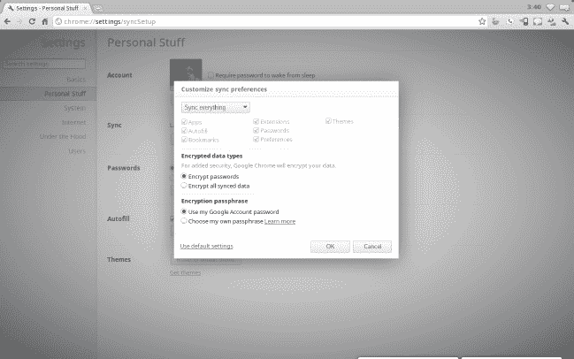

**图 8–1。** *电脑上的 Chrome 同步设置表单*

从网络浏览器启用同步后，您将能够在平板电脑上激活它并开始传输信息。在主屏幕上，点击右下角的时钟，然后从弹出窗口中选择设置图标。在列表中找到“帐户与同步”并轻按它，显示选择帐户的选项。轻按您的帐户以继续您的帐户选项，并从列表中选择“同步浏览器”。

几分钟之内，你的书签、密码和你可能保存的任何自动填充字段将被同步到你的平板电脑浏览器，让你在电脑上也能轻松使用。

#### 将平板电脑与手机同步

能够同步您电脑上已经存在的所有内容是一个很有价值的工具，但是当您正在阅读您最喜欢的新闻网站上的一篇文章时，如果您不得不跑出门外，会发生什么情况呢？当你在谷歌地图上查找了一个方向，想把它移动到你的平板电脑上，会发生什么？谷歌对此的回答是 Chrome to Phone，这项服务可以让你从电脑上的网络浏览器向平板电脑发送信息。

你需要做的第一件事就是在你的电脑上安装 Chrome to Phone。你首先前往 Google.com，搜索 *Chrome 手机*。你将看到的第一个选项是 Chrome 到手机的扩展链接。单击此链接进入安装页面。从这里你会看到一个类似于图 8–2 中的蓝色方框，在右下角有一个安装按钮。点击安装，几秒钟后你就会在浏览器的右上角看到一个带黄色箭头的小手机图标，就在扳手旁边。

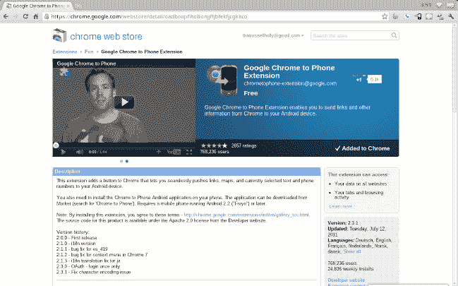

**图 8–2。** *Chrome to Phone 在谷歌 Chrome for PC 中安装屏幕*

点击此图标，系统会提示您选择一个 Gmail 地址进行登录。输入您在 Android 平板电脑上使用的电子邮件地址。完成后，您将完成浏览器，并准备好移动到您的平板电脑。

从你的主屏幕，前往你的应用抽屉，并前往播放商店。到达后，点击搜索按钮，搜索 *Chrome 给*打电话。首先出现的选项将是谷歌制作的应用，它补充了你刚刚安装的扩展，如图 Figure 8–3 所示。在免费应用上选择安装，并在安装完成后打开应用。当你加载应用时，Chrome to Phone 会要求你验证你想要同步的 Gmail 帐户。请确保您选择了与 Chrome 扩展相同的帐户。完成后，系统会提示您允许该应用访问您的 Gmail 帐户。从选项中选择 Accept，您将看到如图 Figure 8–4 所示的选项，要么自动启动发送至手机的链接，要么仅在提示时启动链接。

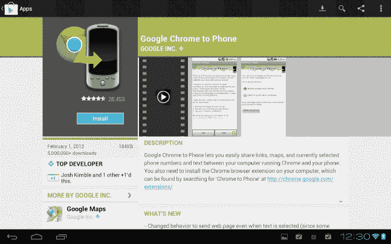

**图 8–3。** *平板电脑 Play Storefor 的谷歌 Chrome 至手机安装屏幕*

这个选项完全是你的偏好。如果您选择自动启动链接，当您单击桌面上的 Chrome to Phone 按钮时，您发送到平板电脑的数据网站将立即弹出。如果您选择“让我手动启动链接”，将会出现一个弹出窗口，您可以在不忙的时候选择在平板电脑上启动它。

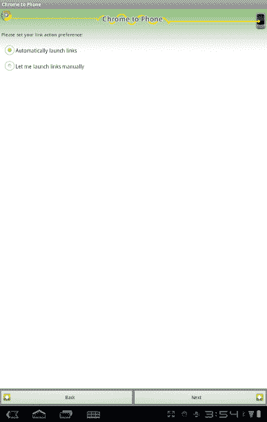

**图 8–4。** *谷歌 Chrome 平板手机设置*

现在你已经设置好了一切，你可以随时使用 Chrome 打电话了。任何时候你在一个网站上想要发送到你的手机上，只要点击你电脑上浏览器窗口右上角的 Chrome to Phone 按钮，无论你的平板电脑在哪里，这个网站都会被发送到你的设备上。如果您选择手动接受链接，您将会在屏幕的右下角得到一个通知，如图 Figure 8–5 所示。如果您在`[`maps.google.com`](http://maps.google.com)`在电脑上使用谷歌地图，并选择 Chrome to Phone 按钮，谷歌地图应用将在您的平板电脑上打开，而不仅仅是网站。

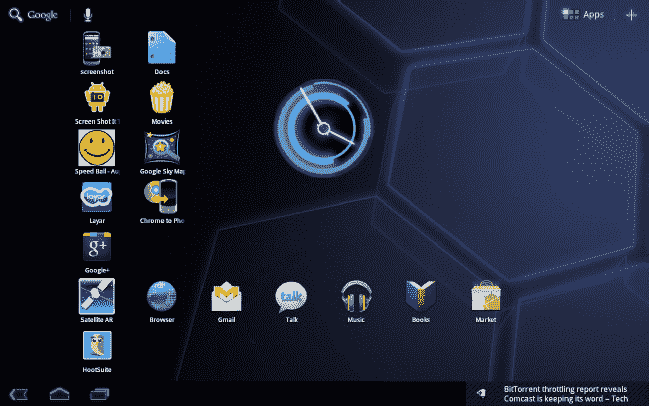

**图 8–5。** *谷歌 Chrome 手机通知*

#### 使用 Dropbox 在云中存储文件

谷歌没有提供自己的基于云的存储系统，但 Play Storehas 有几个选项供你选择，让你快速轻松地访问平板电脑上的文件。我们将在本书中使用的例子是 Dropbox。Dropbox 提供了一项服务，允许用户在线存储文件，但可以通过应用或网页从任何地方访问这些文件。每个帐户都可以免费获得 2GB 的在线存储空间，为付费帐户提供更多存储空间。要创建帐户，请在您的电脑上转到`[www.dropbox.com](http://www.dropbox.com)`。

从 Dropbox 网站，如图 8–6 所示，选择下载 Dropbox 按钮并安装应用。此安装的一部分是创建一个本地文件夹。您放在此文件夹中的文件将自动上传到 Dropbox 服务。将任何文档、电子表格或任何类型的文件放在那里。

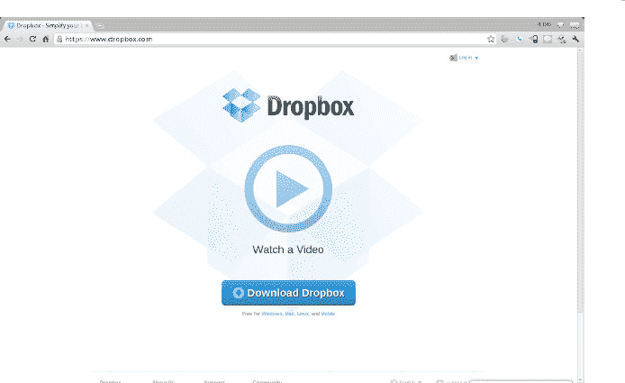

**图 8–6。*Dropbox.com 电脑上的***下载页面

现在你有文件要看了，去你的 Android 平板电脑上的 Play Storeon 搜索 *Dropbox* 。Dropbox 是一个免费的应用，所以只需点击安装即可下载该应用。下载完应用后，轻按“打开”。

Dropbox 应用会要求你要么登录现有账户，要么创建一个新账户。如果您按照前面的说明操作，您应该能够选择“登录到现有帐户”输入您的用户名和密码并登录到应用。这只需要做一次。

现在您已经登录到应用，您将看到您已经上传到 Dropbox 的文件，如 Figure 8–7 所示。大多数文件都可以通过点击任何一个文件来查看。要编辑文件，您需要按住特定的文件。这将弹出一个菜单，其中包括下载文件的选项。下载完文件后，您将能够使用您选择的任何应用在平板电脑上编辑该文件。

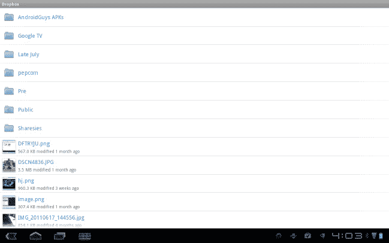

**图 8–7。** *Dropbox 平板电脑应用，列表查看*

### 增强你的现实

互联网上充满了信息。你可以查找电影放映时间，搜索电影院附近的餐馆，甚至可以查看餐馆的质量。或者，也许你正在一个你从未去过的地方观光，你想在没有导游的情况下游览。平板电脑中的技术，加上一种叫做*增强现实*的软件，为你提供了一种全新的完成任务的方式。这项技术采用我们所看到的世界视图，并将计算机生成的信息叠加在该视图之上，因此您可以同时看到信息和真实世界。

#### 使用谷歌天空地图导航夜空

理解增强现实最简单的方法之一就是看一看谷歌天空地图。前往 Play Storeand 搜索*谷歌天空地图*。这是一个免费的应用，所以只需点击安装。应用安装完成后，选择打开。

关于谷歌天空地图，你会注意到的第一件事，如图 8–8 所示，就是你现在看到的是天空中的星图。这基本上是真的。你实际上看到的是平板电脑后面的星空地图。当你移动平板电脑时，地图会根据平板电脑的位置显示相应的星星。你可以在周围移动你的平板电脑，看夜空。这个应用还允许你搜索特定的恒星、行星等等。

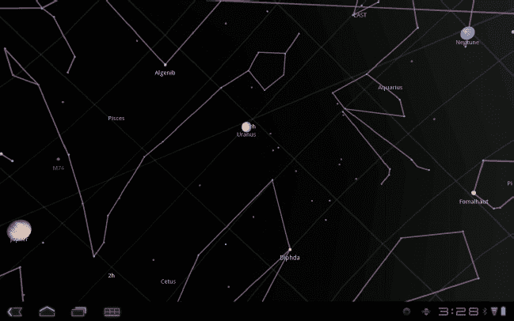

**图 8–8。** *谷歌天空地图*

点击屏幕左下角的菜单按钮。在弹出的选项中，您会看到搜索按钮。当搜索栏弹出时，输入你想要寻找的天体的名称，然后按回车键。该应用将创建一个类似于图 8–9 中的环，它将引导您找到太阳物体相对于您的设备的实际位置。当你到达你要寻找的物体时，圆环会变成橙色。这个应用对任何想和明星一起玩的人来说都很棒。

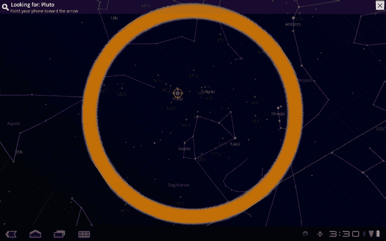

**图 8–9。** *谷歌天空地图搜索视图*

#### 通过 Layar 了解更多位置信息

增强现实是一个很酷的概念，但只有当现实世界的数据提供给软件来帮助你时，它才变得真正有用。Layar 就是这样一个应用的完美例子。与许多其他增强现实应用不同，Layar 允许你获取多个数据集，并将它们分层放置在屏幕上。前往 Play Storeand 搜索 *Layar* 。这是一个免费的应用，所以只需点击安装。应用安装完成后，选择打开。

从一开始，如图 8–10 所示，您将能够从许多不同种类的层中进行选择。从菜单中，轻按“流行”并查看最流行的来源列表。在这个菜单中，从列表中选择 Yelp。Yelp 是一项收集餐馆、购物和娱乐等各种数据的服务。该服务还允许用户评价他们对当地企业的体验，并提供评论。点击应用右上角的启动按钮开始此层。

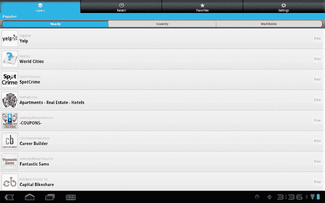

**图 8-10。** *Layar 流行层层查看*

你会注意到的第一件事是，你现在正通过平板电脑上的摄像头观看，就好像你要拍照一样。你还会看到一个带有彩色三角形的网格，就像你在 Figure 8–11 中看到的那样。这些三角形中的每一个都是 Yelp 找到的位置。如果您点击任何位置，您将获得关于该位置的更多信息。地图上的位置已经被放置在它们的地理位置上，所以如果你在屏幕上看到一个位置，它实际上就是你的平板电脑当前指向的方向。如果你需要更具体的方向，点击图标并从弹出的菜单中选择“带我去那里”，你将被带到谷歌地图，导航到那个位置。

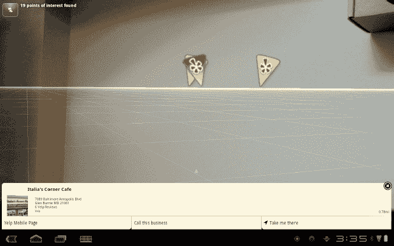

**图 8–11。** *Layar Yelp 层视图*

Layar 的用途不仅仅是找一家餐馆或电影院。你可以用维基百科寻找历史地点，用 HotPads 搜索出租公寓，甚至可以用捕龙者图层找点乐子。所有这些选项都利用您的位置和摄像头的力量，将您的平板电脑变成您整个世界的平视显示器。

### 总结

您的平板电脑可以让您将家用电脑扩展到任何地方。每天都有更多的应用提供更多的这些关键工具，使你的平板电脑越来越接近于电脑替代品。

随着你开始带着平板电脑四处走动，你会慢慢意识到，你可以舒服地用它做更多的事情。虽然它当然非常适合音乐和电影，但你也可以查看 PDF 文件，编辑文档和电子表格，甚至可以拍摄视频文件和制作电影。在平板电脑上存储所有这些东西会占用很大的空间，而将文件从电脑转移到平板电脑上意味着要拔掉 USB 线，坐着等待。幸运的是，云存储不需要这样做，在第十章中有几个选项可供你选择，它们既可以在你的电脑上也可以在你的平板电脑上共享文件，而不用把它们存储在你的平板电脑上。

在下一章中，您将了解如何使用您的平板电脑，不仅将其作为在家和外出时的绝佳工具，还可以使用您的 Android 平板电脑在工作场所完成更多工作。