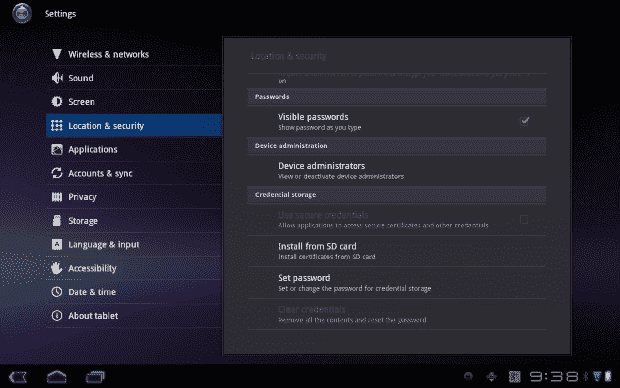

# 九、在工作中使用平板电脑

到目前为止，我们已经介绍了很多关于在个人生活中使用 Android 平板电脑的信息。然而，对于许多人来说，很难将个人设备和工作设备混合使用。你的雇主会有顾虑，即使你经营自己的企业，你也会想采取措施保护其素材。

对于任何系统管理员来说，在将平板电脑设备添加到公司网络时，都会担心安全性问题，例如与设备共享的信息的敏感性，以及员工离开公司时该做些什么。对于企业来说，某些工具使得把你的安卓平板带到工作场所变得更加容易处理。我们将在本章中向您展示如何操作。

### 保护您的平板电脑

说服你的雇主或客户在你的 Android 平板电脑上存储专有信息是可以的，最好的方法是证明它是一个安全的设备。幸运的是，在你的 Android 平板电脑上，只需几个步骤就能轻松做到。在本节中，您将学习如何通过锁定屏幕来保护您的平板电脑，加密您存储在其中的信息，在平板电脑丢失(或被盗)时轻松识别您的所有者，以及安装和管理您访问工作场所系统所需的安全凭据。

#### 锁定您的屏幕

现在，当你想进入你的平板电脑时，你所要做的就是将气泡滑动到环上，设备就会解锁。这很方便，但也意味着任何人都可以拿起你的平板电脑并以同样的方式解锁。有几种方法可以保护您的平板电脑，让您成为唯一可以访问您的平板电脑的人。轻按屏幕右上角的应用图标，打开应用抽屉。找到您的设置并点击应用打开。从“设置”菜单中，找到“位置与安全”选项。向下滚动此页面，直到看到锁定屏幕的设置。现在，“锁屏”下的选项应该显示“不安全”，如图图 9-1 所示。点击“配置锁屏”来改变这一点。从以下选项中选择最适合您的选项:

*   *Off* :这将完全移除锁屏，使设备在您按下电源按钮将其唤醒后即可使用。
*   *未锁定*:这是当前设置，启用基本锁定屏幕，允许您将锁定气泡移出戒指以解锁设备。
*   *图案*:这种安全措施允许您通过要求您设计的图案来解锁设备，从而保护您的设备。如果您点击模式，将会引导您完成设置模式的过程。
*   *PIN 码*:用 PIN 码保护您的平板电脑，这样您只需输入您选择的 PIN 码即可访问平板电脑。PIN 可以是您选择的任意位数，但至少必须是四位数。
*   *密码*:与保护电脑的方式类似，您可以选择使用自己选择的密码解锁设备，这样只有拥有密码的人才能解锁平板电脑。

**图 9-1。** *在蜂巢中配置锁屏*

#### 让别人知道你是主人(以及如何联系你)

除了保护您的平板电脑之外，您还可以选择将信息留给可能拿走您的平板电脑并试图使用它的人。在“配置锁定屏幕”功能的正下方，您将看到所有者信息。点击“所有者信息”来显示在你的锁定屏幕上留言的能力，如图 9-2 所示，给任何偶然发现的人。

**图 9-2。** *蜂巢中的车主信息屏幕*

如果你使用的是 10 英寸的平板电脑，你在这里有相当大的空间，至少有八行文本，所以你可以随意在这里写下你想要的任何信息。一旦你在这个字段中写了任何东西，这些改变将会立即反映在你的锁定屏幕上，如图图 9-3 所示。

**图 9-3。** *蜂巢图案锁屏带主人信息*

这是一个让大多数人远离你的平板电脑的非常可靠的方法，但是就像对待电脑一样，也有办法绕过它。当您使用的不是自己的电脑时，您的 Android 平板电脑可以提供额外的安全性。

#### 保护您的谷歌账户

当你在电脑上使用 Gmail 时，另一个可以用来保护你的平板电脑和 Gmail 账户的工具是启用谷歌的*两步验证*。这个工具将使您能够使用您的密码以及每隔几秒钟随机生成的代码来保护您的帐户，使您很难侵入您的帐户。

首先在电脑上登录您的 Gmail 帐户。在屏幕的右上角，你会看到一个头像在齿轮的左边。单击此图标打开 Google 帐户菜单，然后选择帐户设置。在账户设置中，选择“账户概述”，如图图 9-4 所示。从出现的列表中选择“使用两步验证”。您将被重定向到两步验证的设置页面。

**图 9-4。** *来自电脑的谷歌账号概述*

要实现两步验证，你需要给谷歌一个电话号码，它可以给你发短信或打电话给你一个验证码。这一步是确认你是一个人，你知道这是发生在你的帐户。输入您首选的代码接收方式，点击“发送代码”，如图图 9-5 所示。很快您将收到您的代码，现在您在步骤 2 中输入。当你输入了代码，点击验证，谷歌将确认你已经完成了这一步。完成此步骤后，您将能够激活两步验证。

**图 9-5。**??【电脑两步验证设置】

使用你的平板电脑，进入 Play Store 并搜索*谷歌认证器*。这是谷歌的一款免费应用，安装完成后只需点击下载并打开应用即可。该应用将要求您使用上一步中生成的代码连接到您的 Google 帐户。输入代码，Google Authenticator 就可以使用了。

现在，每当你从一台新电脑上登录你的 Gmail 账户时(在你的电脑上每 30 天一次)，你不仅会被要求使用你的密码登录，还会被要求使用从 Google Authenticator 随机生成的密码登录，如图图 9-6 所示。

**图 9-6。** *蜂巢中的谷歌认证器 app*

### 加密存储的信息

一个人想要多走一步来保护自己的设备有很多原因。也许你的公司有敏感或私人信息，只有在安全的情况下才会允许你带着这些信息离开办公室。也许你是身份盗窃的受害者，希望确保你的个人信息是安全的。也许你想首先避免身份盗窃。无论你的理由是什么，如果你想加密你的 Android 平板电脑上的信息，这个选项是可用的。

在主屏幕左上方的应用抽屉中找到您的设置应用。从“设置”菜单中，轻按“位置与安全”向下滚动，直到您在列表中看到“加密平板电脑”并点击该选项。

 **警告:**要继续加密你的平板电脑，设备必须充满电并连接电源。如果您的设备当前使用电池供电，您必须将平板电脑连接到电源，并让设备充满电。此外，为了进行加密，您必须设置一个锁屏 PIN 或密码。

当您准备好加密您的设备时，选择如图图 9-7 所示的加密平板电脑按钮。您将被要求提供您的安全 PIN 或密码才能继续。平板电脑警告说，这个过程可能需要一个小时或更长时间，当它重新启动并继续加密过程时，您不能打扰平板电脑。操作完成后，每次平板电脑启动时，都会要求您输入 PIN 或密码。

**图 9-7。** *蜂巢中的加密平板视图*

### 保护您的专有网络连接

特定类型的网络需要安全连接才能远程访问。当试图访问这些网络时，通常要求您使用的设备提供所谓的*安全凭证*以便访问该网络。这对于使用虚拟专用网络(VPN)的办公室来说很常见。如果您的办公室使用 VPN，您可能会获得一个安装在设备上的安全证书，以便让您的平板电脑访问 VPN。Android 平板电脑不仅提供了安装这些证书的方法，还提供了在设备上保护它们的方法。

#### 安装安全证书

如果您需要一个安全证书，您首先应该获取该证书。通常，管理您的 VPN 的任何人都能够生成一个。证书需要通过电子邮件、MicroSD 卡或 USB 传输到平板电脑。一旦您的设备上有了证书，您就可以开始安装了。

在主屏幕左上方的应用抽屉中找到您的设置应用。从“设置”菜单中，轻按“位置与安全”向下滚动，直到看到凭据存储。从图 9-8 所示的列表中选择安装。如果您的平板电脑检测到多个证书，您将被要求选择您想要安装的证书。如果您只有一个证书，安装过程将开始。如果证书被接受，这个过程应该只需要一会儿，并弹出一个“安装成功”的提示。如果安装不成功，您需要联系您的证书作者以获得正确的证书。

**图 9-8。** *蜂巢中的凭证存放视图*

在安装选项上方，“使用安全凭证”选项将不再是灰色的，您可以通过点击复选框来激活安全凭证。一旦这个盒子被点亮，你将能够使用你的安全连接。当此选项亮起时，您的通知托盘中会出现一个图标。轻触该图标会将您带回到此设置菜单，允许您快速禁用证书的使用。

#### 使用密码保护您的证书

作为一项附加的安全措施，您可以在存储您的安全证书的文件夹上设置密码，以防您的 MicroSD 卡从您的设备中被释放，或者该文件夹以某种方式从您的平板电脑中被提取。

在主屏幕左上方的应用抽屉中找到您的设置应用。从“设置”菜单中，轻按“位置与安全”向下滚动，直到您看到凭证存储，并选择“设置密码”将出现一个密码框，要求您为平板电脑上的安全凭据文件夹创建一个八个字符(或更多)的密码。如图 9-9 所示，输入密码，然后在下方的字段中确认密码。完成后，点击确定。

**图 9-9。**??【蜂巢】密码保护凭证

如果你的工作需要安全凭证，你的 Android 平板电脑不仅可以提供这一功能，还可以保证它作为你的个人设备的安全性。通过能够自己保护设备，您通常可以避免雇主直接管理设备的需要。

### 增强系统管理员的能力

如果您的 Android 平板电脑的主要用途是工作，或者如果您的 Android 平板电脑是作为工作设备发放给您的，则可能需要远程设备管理。远程管理是 Android 设备从管理员那里接收附加安全协议的一种方式。此外，它使管理员能够远程定位设备，或者在发生盗窃时擦除平板电脑上的所有数据。

 **注意:**设备管理仅适用于 Google Apps 帐户用户。这是一个典型的使用谷歌的电子邮件或文档的公司使用的工具。如果您不是 Google Apps 用户，这不适用于您。

要启用此服务，请从应用或应用抽屉右侧的 Play store 快捷方式进入 Play store。点击搜索图标，搜索*谷歌应用套件设备策略*。这是谷歌的一款免费应用，安装完成后点击“安装”并打开应用。

安装 app 时，会提示您激活设备管理员。将出现一条策略警告，通知您这将使远程管理员能够执行以下操作:

*   通过工厂重置，在没有警告的情况下擦除所有数据
*   更改屏幕解锁密码
*   为允许用户生成的密码设置特定规则
*   计算错误输入密码的次数，如果失败次数过多，您可以永久锁定设备
*   控制屏幕锁定的方式和时间
*   要求加密存储的应用数据

管理员将从其 Google Apps 帐户的控制面板中访问这些功能。这些附加措施将确保您的平板电脑尽可能安全，并帮助阻止潜在入侵者访问敏感数据。

### 总结

你的 Android 平板电脑可以成为工作场所的一个强大工具，前提是你有适当的安全措施来保持你的数据完整无损，并且你知道在你的平板电脑发生任何事情时该怎么办。这些步骤将保护你的信息安全。

在下一章中，您将了解如何使用云计算和 Android 平板电脑上的存储工具来保存您的数据。