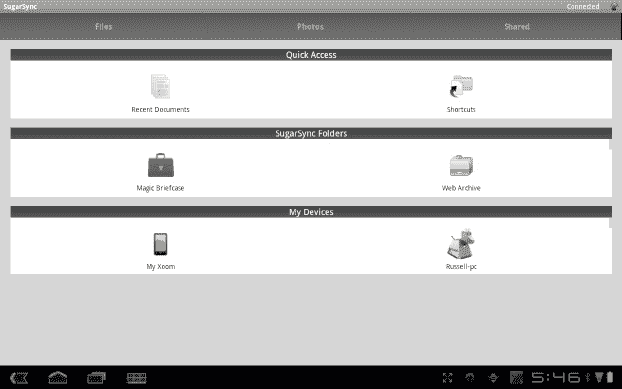
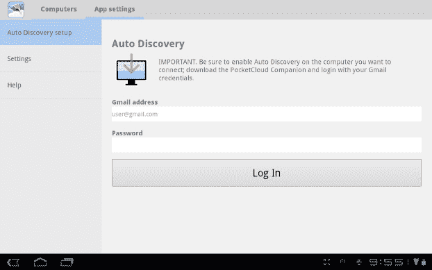

# 十、利用平板电脑上的“云”

尽管你的安卓平板电脑功能强大，但与笔记本电脑或台式机相比，这款设备在许多方面都存在局限性。首先，平板电脑的存储空间或内存远不如传统电脑。此外，传统计算机的处理器将会快得多。Android 平板电脑上的许多应用通过互联网连接与远程电脑共享特定任务的工作，从而绕过了这两个限制。这种除了你的平板电脑之外的计算机的使用，通常位于巨大的计算机“农场”中，被称为*云计算*。

在本章中，您将了解云计算和云存储用于提高 Android 平板电脑性能的一些方法。

### 将您的数据存储在云中

在第八章中，我们简要介绍了一个名为 Dropbox 的工具，它允许使用云存储从你的电脑中访问文件。如果你在电脑上做很多工作，这是一个很好的实用工具，但在自动将文件从平板电脑共享回 Dropbox 文件夹时，该软件是有限的。在本节中，您将看到一些应用，它们可以轻松地将平板电脑上的数据与存储在云中的数据同步。

#### 使用 SugarSync 存储数据

在云中存储文件的能力是一个很有价值的工具，尤其是在存储量有限的设备上。(即使有扩展 MicroSD 卡或 SD 卡适配器，你能希望的最大存储是 128GB，这也非常昂贵。)能够检测何时有新的照片、文档等，并能够自动将该文件与您的帐户同步是非常重要的。该功能尤其是 SugarSync 服务的强项。

SugarSync 应用在 Play Store 中是免费的，你可以通过搜索 *SugarSync* 来定位该应用。点击下载按钮进行安装，安装完成后点击打开。由于 SugarSync 是一项在线服务，您的信息将保存在这里，因此您有必要创建一个 SugarSync 帐户。当您打开应用时，首先会提示您创建一个帐户。按照此处的说明创建您的 SugarSync 帐户。

成功登录 SugarSync 后，系统会询问您是否想要同步您的文件，如 Figure 10–1 所示，并注明您拍摄的任何其他照片都将在后台上传到 SugarSync 服务，这意味着它会在不通知您的情况下进行同步。您可以选择立即开始此过程，立即激活该功能，或者选择不使用它。如果您选择现在开始更新，系统会询问您是否希望 SugarSync 在移动网络上也执行后台更新。这仅适用于您支付每月移动数据计划。

**图 10–1。** *蜂巢上的 SugarSync 设置屏幕*

一旦决定了 SugarSync 的工作方式，服务的主菜单就会出现。在该页面中，如 Figure 10–2 所示，您可以查看和下载与您的帐户关联的任何其他设备上的文件，或者选择其他文件或文件夹上传到服务。为此，请在“我的设备”部分找到您当前所在的设备。从这里你会得到一个基本的文件管理器，如图图 10–3 所示，你可以通过滚动和点击来导航。如果您愿意，您可以按住单个文件或文件夹，这会弹出一个菜单，询问您是否要将该文件或文件夹同步到您的帐户。一旦你选择了同步一个文件夹，SugarSync 会询问你该应用是否应该持续扫描该文件夹并上传该文件夹中出现的新项目。

**图 10–2。** *蜂巢上的 SugarSync 主菜单*

**图 10–3。** *蜂巢上的 SugarSync 文件管理器*

如果你愿意，SugarSync 会记住上传你所有的新文件。当涉及到保存你的照片和文件时，这项服务可以为你做很多繁重的工作，而且它可以自动完成所有这些工作。

#### 使用谷歌文档管理 Word 文档

虽然我们已经在第三章中讨论了如何使用 Google Docs，但值得一提的是，这是一个将云用于个人用途的完美例子。谷歌文档首先是一项在线服务。Google Docs 是一款为网络浏览器设计的文字处理器。如图图 10–4 所示，Android 应用不仅能让你访问，还能编辑和创建新文档，并从你开始使用它们的那一刻起就将它们保存到云端。

**图 10–4。** *蜂巢上的谷歌文档主屏幕*

### 使用云服务进行计算

云计算这个术语最常用于描述完全在线的服务。这个概念的一个完美例子是谷歌音乐。无论你在哪里，你都可以用同样的音乐访问同样的服务。然而，当涉及到你的平板电脑时，云计算可以用来协助那些需要比你的平板电脑所能提供的更多能力的操作。

#### 用谷歌眼镜搜索图片

当你搜索某样东西时，你输入最准确的描述，点击搜索，然后浏览结果，希望你的描述足以得到你想要的结果。这真的很容易做到，只要你在寻找一些容易描述的东西，但它并不总是那么容易。谷歌建议，如果你能拍一张照片，可能会更容易找到更准确的信息。谷歌眼镜可以让你拍下任何东西的照片，并使用照片而不是文字进行搜索。

谷歌护目镜应用在安卓市场是免费的；只需在市场上搜索*护目镜*即可。轻按“下载”以安装应用，并在应用安装完成后轻按“打开”。当你打开应用，你会得到一个基本的教程，你可以用谷歌眼镜做的事情。通过图片搜索并不是它唯一的技巧；它还可以执行以下操作:

*   *翻译文字*:拍摄另一种语言的文字照片，Goggles 会进行翻译。
*   *解数独谜题*:拍一张数独谜题的照片，Goggles 会带着谜题的解答返回。
*   *保存名片*:用护目镜拍下名片的照片，你就可以将这些信息保存为新的 Gmail 联系人。
*   *扫描条形码*:抓拍一张普通条形码或二维码的照片，Goggles 会上网搜索结果。在二维码的情况下，Goggles 会将你带到二维码指向的网站或文件。

当你准备好拍照时，你会看到一个类似于相机应用的屏幕。如果你正在扫描一个条形码，就像图 10–5 中的那个，app 会检测条形码并自动搜索；没必要拍照。对于其他事情，请稳定地拿着平板电脑，准备好了就拍照。一旦发生这种情况，当谷歌扫描图片中的信息时，你会看到一束光来回掠过图像，如图图 10–6 所示。当结果准备好时，该应用将带你到谷歌搜索结果页面，或者根据图像完成前面提到的任务之一。

**图 10–5。** *二维码扫描谷歌眼镜找蜂巢*

**图 10–6。**??【谷歌护目镜】蜂巢中的图像扫描

Goggles 通过将艰难的工作发送到互联网上寻找正确的答案，使几种工作变得更容易。

#### 使用 Wyse PocketCloud 访问您的家庭数据存储

在家用电脑和平板电脑之间来回同步文件可能很容易，但许多人仍然使用家用电脑来存储大量信息。这些服务中有许多只免费给你 2GB 的存储空间，虽然这是一个很大的方便，但对一些人来说，当他们家里的电脑已经有数百 GB 的存储空间时，似乎没有必要在线支付存储空间。此外，如果您正在处理任何类型的大型文件，将这些文件从您的电脑移动到平板电脑并不是一个快速的过程，尤其是如果您使用的是移动网络，您可以使用的带宽有限。Wyse 的团队创建了 PocketCloud 来解决这个问题。PocketCloud 让你不仅可以使用平板电脑查看，还可以完全远程控制你的电脑。

PocketCloud 有付费版和免费版两种。免费版将允许您使用 Wyse 的远程连接服务访问您的计算机，而付费版通过使用 Wyse 的云计算系统来增强体验，从而显著提高性能并提供更多功能。此外，付费版可以让你将文件直接传输到平板电脑上，也可以通过互联网播放平板电脑上的视频或音频文件。如果你选择安装免费版本，如果你觉得你会经常使用该服务，那么升级到付费版本是非常容易的。

第一次打开 PocketCloud 应用时，您会被邀请参加设置 PocketCloud 的指导教程，如 Figure 10–7 所示。对你来说，在你的电脑前进行设置是很重要的，因为这涉及到在你的电脑上安装软件。设置过程完成后，系统会提示您使用 Google 帐户登录应用。这将扫描 PocketCloud 网络，查找任何使用您的 Google 帐户连接到该服务的计算机，并自动配对连接。

**图 10–7。**??【Wyse 口袋云】蜂巢中的自动发现屏幕

选择连接后，屏幕将立即开始显示您桌面上的内容，如 Figure 10–8 所示。从这一点上，你将能够从任何有互联网连接的地方访问你的桌面。然而，互联网连接速度越慢，家里的电脑响应速度就越慢。在这款应用的付费版本中，PocketCloud 服务器会在云中存储你桌面的虚拟副本，以使这种体验更快。

**图 10–8。** *Wyse PocketCloud 蜂巢桌面视图*

#### 使用 Opera Mini 浏览器加速互联网浏览

在平板电脑等移动设备上浏览互联网时，大型网站或包含大量交互式内容的网站通常会降低浏览速度。平板电脑上的处理器和浏览器无法处理它正在接收的信息量，或者有时信息不是以平板电脑浏览器可以处理的格式呈现的。在这些情况下，如果浏览器能够以某种方式将处理内容的工作交给云，那么信息可以以平板电脑更容易处理的格式呈现，这将是有益的。这正是 Opera Mini 浏览器为你做的。

Opera Mini 浏览器是 Play Store 中的一款免费应用。在 Play Store 中搜索 *Opera Mini* ，点击下载。应用安装完成后，轻按“打开”。在您开始使用浏览器之前，Opera 会要求您同意其服务条款。如果您同意显示的条款，请点击应用左下角的“接受”。

如果你习惯了 Android 浏览器，你会注意到 Opera 工作方式的一些显著差异。首先，图 10–9 中显示的起始页提供了一个你以前去过的网站的网格，以便于你返回这些网站。只需点击网格中的一个方块，页面就会开始加载。Opera Mini 通过其应用观察你的所有网络流量，并将自动压缩图像和调整进入网站的字体大小，这将使平板电脑在尝试向你呈现网页时做的工作少得多。Opera Mini 目前不支持传递使用 Flash 创建的内容的能力，Flash 是一种常用于高度互动网站的技术。

**图 10–9。** *蜂巢中 Opera 迷你浏览器启动画面*

Opera Mini 非常适合您在旅途中或使用移动宽带上网时使用；即使在较慢的互联网连接上，Opera Mini 加载页面的速度也会比 Android 浏览器快很多，因为它能够在图像到达你面前之前对其进行压缩。

### 总结

术语*云计算*指的是多种多样的技术，但是你可以使用这些技术从你的 Android 平板电脑中获得更多。不仅谷歌的许多服务几乎完全基于云，而且越来越多的公司每天都在追随谷歌的脚步。在下一章中，你将了解通过一个叫做*生根*的过程，获得对你的 Android 平板电脑的更深层次控制背后的风险和好处。