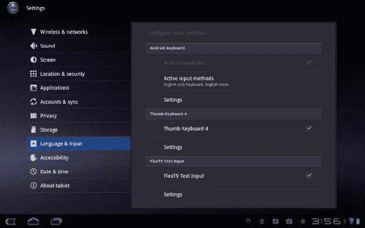
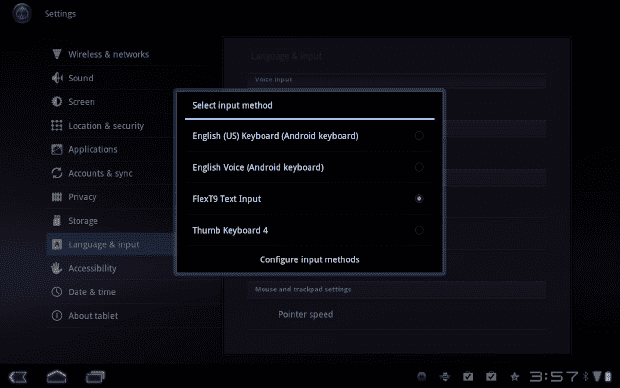
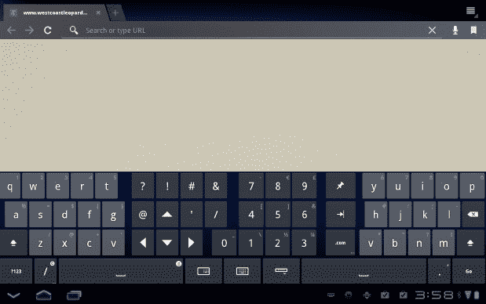
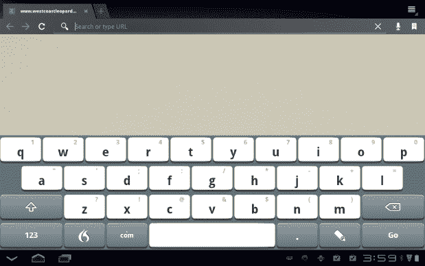
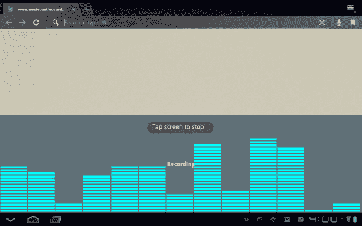
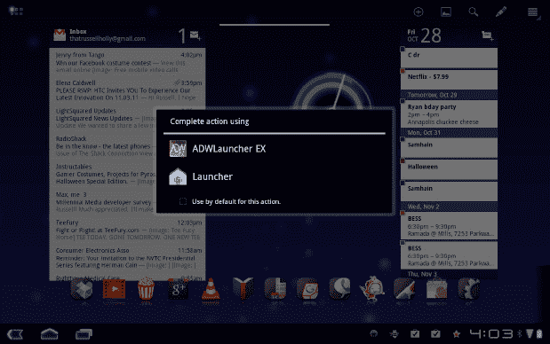
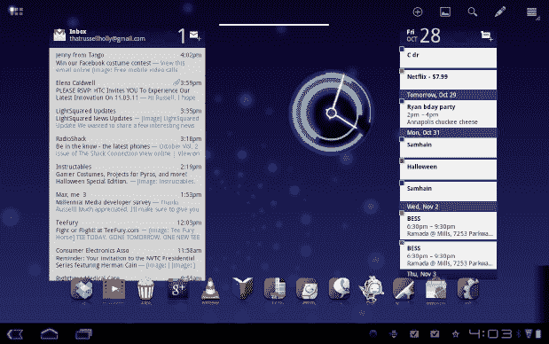
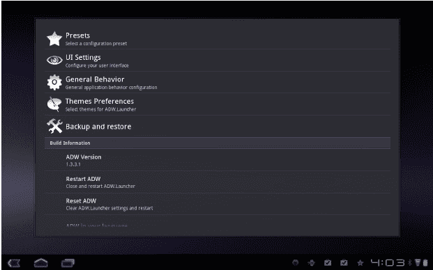
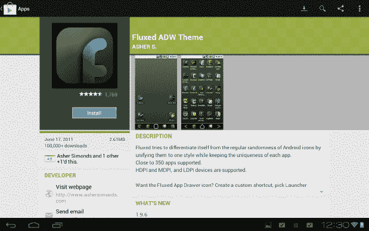
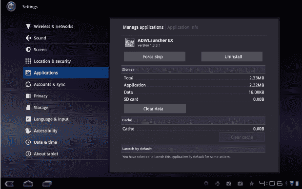

# 十一、定制您的 Android 平板电脑

如果你像大多数平板电脑用户一样，让设备感觉像是你的一样对你来说很重要。现在，你有同样的背景壁纸，同样的虚拟键盘，和其他人一样的一切。但是有一些工具可以让你与众不同，并提供一种更好的方式来完成平板电脑上的基本任务。

在这一章，我们将看看两种方法来定制您的电脑。首先，我们将寻找修改平板电脑附带的虚拟键盘的方法，然后我们将了解如何修改它的主屏幕。

### 定制键盘

很可能你在任何安卓平板电脑上体验的最重要部分是虚拟键盘。如果你不喜欢平板电脑上的键盘，你可能不会经常使用它。为了享受平板电脑的体验，你需要一个适合你的键盘。对于一些人来说，他们平板电脑上的普通键盘可能不是很好的体验。幸运的是，这是 Android 很容易替换的东西。你需要做的就是搜索 Play Store，选择一款更适合自己的键盘。最受欢迎的两个选择是拇指键盘和 Flex ??。

#### 将键盘放在拇指可及的地方

如果你有一个 10 英寸的平板电脑，当你在横向模式下拿着设备时，不容易使用你的拇指。虚拟键盘横跨平板电脑的整个宽度，很难触及中间的字符。你可以一只手打字，另一只手拿着平板电脑，但那样会慢很多。拇指键盘将键盘从正中间分开，并将其左右两半推向平板电脑的边缘，使它们在你的拇指范围内。

拇指键盘不是免费应用。如果你认为这是你想要使用的键盘，请在 Play Store 购买该应用。点击购买并完成给出的说明；然后在应用安装完成后退出 Play Store。与大多数应用不同，一旦安装了拇指键盘，你就不会打开它，因为它是 Android 操作系统的一个组件。

在主屏幕上，轻按屏幕右上角的应用图标，然后搜索您的设置应用。在“设置”菜单中，找到屏幕中间的“语言和输入”并点击。滑动到打开的菜单底部，在那里你会找到键盘设置，如图 Figure 11–1 所示。要激活拇指键盘，您需要点击“配置输入法”并允许拇指键盘作为键盘的替代品。

**图 11–1。** *蜂巢中的键盘设置*

所有安装的键盘都会出现在“选择输入法”列表中；只需点击拇指键盘旁边的复选框，如 Figure 11–2 所示。当绿点出现时，您将能够使用拇指键盘。此外，如果您想调整拇指键盘的任何设置，您可以在拇指键盘菜单中的设置下进行调整。点击返回箭头进入上一级菜单。

**图 11–2。** *多键盘输入选择屏幕*

就在前面的选择之上，我们现在需要点击“当前输入法”将弹出一个菜单，要求您选择您想要使用的键盘。选择拇指键盘，然后轻按主屏幕按钮。从此以后，任何时候你需要键盘，拇指键盘就会出现，如图 Figure 11–3 所示。

**图 11–3。**??【拇指键盘】平板电脑

#### 接受手写和语音输入

自从我们在计算机上输入信息以来，就有公司试图改进我们输入信息的方法。当数字袖珍设备变得流行时，甚至出现了使用手写输入信息的趋势。后来，终于有了一个语音翻译器，可以让你简单地说话，单词就会出现在屏幕上。这是 Flex ?? 键盘提供的多样性礼物。您可以选择使用语音到文本，使用手写，或简单地在键盘上键入，以便将文字显示在屏幕上。

Flex ??，如图 Figure 11–4 所示，不是免费的 app，但是你可以在安卓市场找到。按照说明在平板电脑上激活 Flex ??。在主屏幕上，轻按屏幕右上角的应用图标，然后搜索您的设置应用。在你的设置菜单中，找到屏幕中间的“语言&输入”并点击。在打开的菜单底部，你会找到键盘设置。要激活 Flex ??，您需要点击“配置输入法”并允许 Flex ?? 充当您的键盘的替代品。

**图 11–4。** *Flex ?? 平板电脑键盘*

所有安装的键盘都将出现在此列表中；只需点击 Flex ?? 旁边的复选框。当复选标记出现时，您将能够使用 Flex ??。此外，如果您想要调整 Flex ?? 的任何设置，您可以在 Flex ?? 菜单中的设置下进行调整。点击返回箭头进入上一级菜单。

就在前面的选择之上，我们现在需要点击“当前输入法”将弹出一个菜单，要求您选择您想要选择的键盘。选择 Flex ??，然后轻按主屏幕按钮。从此以后，任何时候你需要键盘，Flex ?? 都会出现。

使用 Flex ?? 作为您的键盘选择很容易，但您也可以使用它直接与平板电脑对话，并将文字翻译成文本。点击键盘上的火焰，屏幕上会出现发声选项，如图 Figure 11–5 所示。当你说完你想说的句子时，点击发声器，翻译就会出现在屏幕上。此外，如果你点击铅笔，你将能够在屏幕上单独绘制字母，它们看起来就像是你输入的一样。

**图 11–5。** *平板电脑 Flex ?? 上的语音翻译*

### 定制您的主屏幕

你可以定制 Android 中任何适合你的东西。主屏幕是为你制作的，你可以在屏幕上放置任何你想要的应用或小工具，并能够享受你自己的体验。然而，有几件事你可以自定义，需要其他应用的帮助。这就是像 ADW Launcher 这样的项目的用武之地。ADW Launcher 不允许你定制单个元素，而是允许你用全新的体验替换整个主屏幕。

去安卓市场搜索 *ADW Launcher* 。ADW Launcher 是市场上的一款免费应用，但提供了一个名为 ADW EX 的更新，增加了一些功能。挑一个你喜欢的安装。完成后，轻按主屏幕按钮。系统会提示你在 ADW 启动器和 Android 自带的启动器之间进行选择。点击 ADW 启动器。每当你点击 home 键时，这个询问你更喜欢使用哪个启动器程序的弹出消息就会出现，如图图 11–6 所示。如果你决定继续使用 ADW，你可以勾选“默认使用这个动作”，这个消息就不会再弹出来了。

**图 11–6。**蜂巢中的*发射架选择画面*

ADW Launcher 看起来和感觉上与你一直使用的 Launcher 非常不同。首先，你的应用按钮在左上角，而不是右上角。顶部现在有一些小的快速访问按钮。您可以使用加号按钮快速添加到主屏幕，使用壁纸按钮更改壁纸，搜索平板电脑，更改主屏幕窗口的数量，以及快速访问您的设置。

你会注意到的下一件事是横跨你的主屏幕底部的工具条，如图图 11–7 所示。这是一个 dock，类似于你在 Windows 7 或苹果 OS X 中看到的 dock。你可以将应用的图标拖放到 dock 中，然后将它们放在 dock 中。无论您在哪个主屏幕窗口上，dock 都会跟着您。这样，如果你有常用的应用，你就不用去找了。

**图 11–7。**??【蜂巢上的 ADW 发射器 EX】??

ADW 启动器有自己的设置集合。如果点击屏幕右上角的设置图标，您将看到 ADW 设置，如 Figure 11–8 所示。点击此菜单项将显示您可以使用 ADW Launcher 自定义的所有功能。您可以调整应用在应用抽屉中的外观，或者调整停靠栏中图标的大小。你甚至可以改变主屏幕上有多少列和多少行，让你可以随心所欲地安装或多或少的应用和小工具。虽然改变功能的能力令人印象深刻，但定制 ADW Launcher 的真正能力来自于用 ADW 主题来主题化您的 ADW 体验的能力。

**图 11–8。** *ADW 发射器 EX 设置菜单*

点击 ADW 设置菜单中的主题和偏好选项，你将被要求要么安装一个现有的主题，要么获得一个新的。点击获取主题！然后你会被带到安卓市场去看收藏。数百名开发人员合作，用 ADW Launcher 为您的平板电脑创建不同的主题。选择任意一个 ADW 主题，像安装应用一样安装它们，如图 Figure 11–9 所示。当主题安装完成后，按 back 键返回到 ADW 启动器设置菜单。

**图 11–9。** *ADW 主题漫步者游戏商店*

你现在会看到你安装的主题与股票 ADW 主题。点击您想要激活的主题，然后点击安装主题。ADW Launcher 将询问您是否愿意将壁纸更改为主题建议的壁纸。这不是一项要求；如果你点击主页按钮，你会看到你的主题已经安装。

如果你想回到平板电脑自带的主屏幕，你可以卸载 ADW Launcher 或者进入设置菜单。从“设置”菜单中，点击“应用”菜单，然后点击“管理应用”在列表中找到 ADW 启动器，点击以显示此应用的管理选项。滚动直到您看到“默认启动”这里你会看到一个标签为“清除默认值”的选项点击它，如 Figure 11–10 所示，并按下 home 按钮，这时系统会再次提示您选择想要使用的启动器。

**图 11–10。**??【蜂巢】重置发射器默认值

### 总结

定制是使用任何设备的重要部分。所以很多人买很多东西的个性化配件。手机外壳、方向盘套、家居装饰品...它们都成为我们所有权的个性化延伸。只有在你计划每天使用的设备上实现同样程度的个性化才有意义。

在下一章中，你将学习如何通过扎根于你的平板电脑并获得 Android 的更多技术部分来进一步定制。