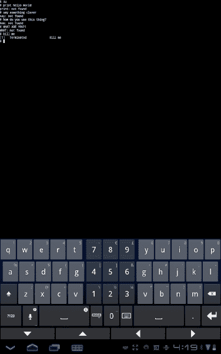
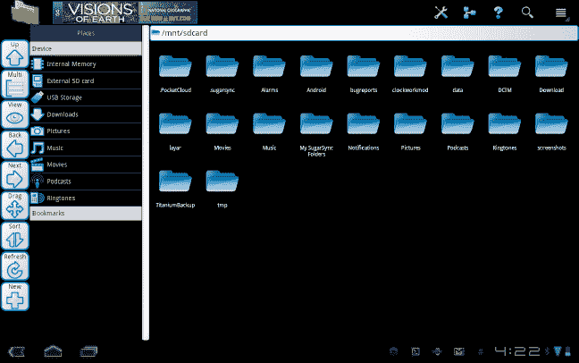
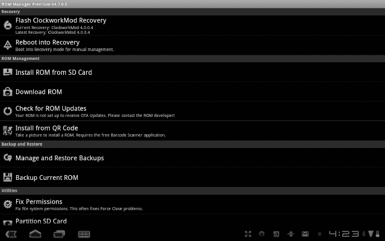
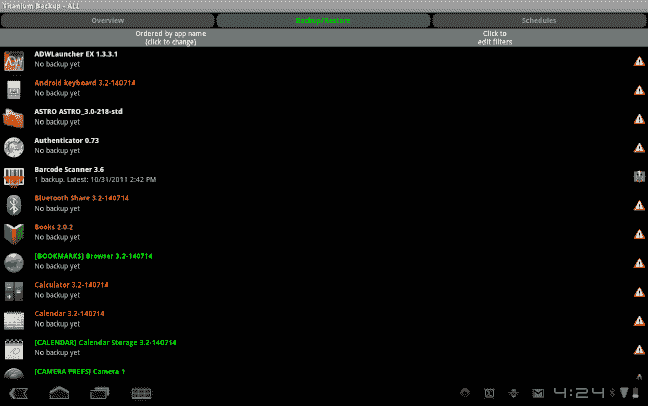
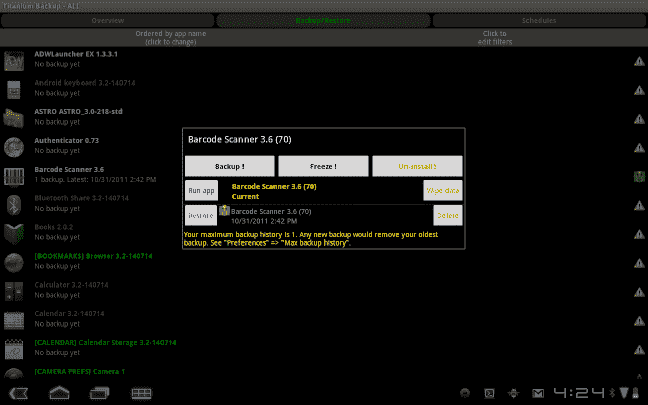
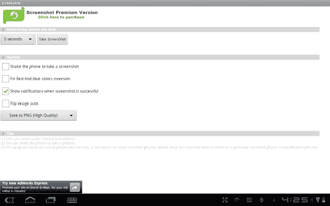
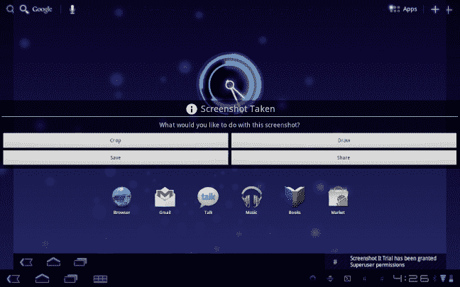

# 十二、将平板电脑 Root

现在你已经掌握了使用 Android 平板电脑的基本概念。你可以享受所有你想享受的音乐、电影和游戏。你可以从平板电脑上运行你的数字世界，从电子邮件和即时消息到脸书和推特。然而，那些正在阅读的人无疑在寻找如何进一步推动你的 Android 平板电脑。这些都是你的 Android 平板电脑可能没有特别设计的东西，但是开发者发现了这一点，并与你分享了做这些事情的能力。你首先要做的只有一件小事，那就是给你的平板电脑装上 *root* 。

Android 是建立在一个叫做 Linux 的操作系统上的。像大多数形式的 Linux 一样，您可以通过将用户类型从普通用户更改为超级用户来获得对操作系统的完全控制。当您授予自己在 Android 平板电脑上的超级用户权限时，您就能够控制平板电脑的各个方面，并运行能够突破平板电脑极限的应用。这不是一个通过扳动开关就能完成的过程，而是一个涉及改变平板电脑关键组件的过程。完成这些调整后，一个类似于平板电脑上任何其他应用的超级用户应用将被调用，以授权访问任何需要超级用户功能的内容。

我们将从如何获得 Android 操作系统的超级用户身份开始这一章，之后我们将探索一旦你拥有它，你可以完成的一些很酷的事情。

### 获得 Root 权限

并非所有的安卓平板电脑都生而平等。在你的平板电脑上实现超级用户访问可能很容易，也可能你的平板电脑上还没有解决这个问题。这个过程完全基于黑客，他们有时间和资源来解决这个问题，然后在网上公布他们是如何完成这个任务的，这样你就可以重现他们的成就。通常情况下，如果你只需谷歌< *以>为根*的平板电脑名称，你就可以很容易地发现你的平板电脑是否已被根。一旦你知道你可以扎根于你的平板电脑，你就准备向前迈进。

**检查您的保修服务**

你需要检查你的设备的保修，以确保找到你的设备没有无效。对于大多数设备，没有问题；但是，在尝试对平板电脑进行根操作之前，一定要确定这一点。给你的平板电脑找根并不违法，但如果你为每月的移动数据计划付费，这通常会遭到反对，因为在某些情况下，可以使用超级用户身份与其他设备共享你的互联网连接，而无需付费。

互联网上到处都是论坛，用户们知道如何为平板电脑扎根，也愿意提供建议来帮助你。这些团体没有获得授权或许可来支持您的平板电脑，但这些团体都是高技能的个人，如果您需要，他们愿意提供帮助。如果你正在寻找如何继续的指导，下面是我推荐的其中两个。

#### XDA——开发商

组成 XDA 开发者论坛的黑客、修改者、主题者和开发者是互联网上最活跃的一些人。这些论坛都是非常熟悉平板电脑根操作的用户，通常都有简单易懂的分步指导，告诉你如何根操作平板电脑。前往[XDA-Developers.com](http://XDA-Developers.com)看看你的平板电脑是否在他们的名单上。

#### root zwaki . com

RootzWiki 不仅仅是一个传统的论坛，它还有一个让大多数平板电脑扎根的最佳实践列表。该网站还提供了一个传统的论坛，在这里你可以向有经验的用户提问并获得帮助，但维基的组织方式使你更容易找到扎根平板电脑的最佳方式。

明确遵循设备的说明，您将在平板电脑上以超级用户权限返回。恭喜你！现在，你用它做什么？

### 充分利用扎根平板电脑

一旦你有了平板电脑的超级用户权限，最明显的是通过在你的平板电脑上安装超级用户应用，你现在可以开始探索你的平板电脑的更深层次。首先，你需要几个应用来帮助你。

#### 使用终端浏览 Android 上的文件

任何熟悉 Linux 操作系统(Android 基于该系统)的人都会喜欢在平板电脑上获得终端体验的能力。“终端”允许您浏览平板电脑的完整文件系统以及其中保存的所有信息。对于那些想要在没有某种预制应用的情况下改变现有平板电脑体验的用户来说，终端是从平板电脑上探索的最佳方式。

从终端，您可以像在 Linux 终端一样访问超级用户帐户。当您启动时，您将在命令提示符下看到$。在这里输入 **su** ，如图图 12–1 所示，然后按回车键。如果你有超级用户权限，&会变成一个#，你就可以导航到那些对普通用户锁定的文件夹。

**图 12–1。** *蜂巢上的终端 app*

许多人以前从未使用过 Linux 风格的终端，但仍然希望探索根文件系统并做出改变。对于该用户，Play Store 中的根文件浏览器应用将为您提供您正在寻找的工具。

根文件资源管理器在熟悉的文件夹风格的视觉体验中分解文件系统。轻按文件夹以查看其内容，并使用后退键返回到上一个文件夹。图 12–2 显示了一个典型的显示。

**图 12–2。** *用根文件浏览器浏览安全文件夹*

#### 备份您的设备或应用

你可能会在玩平板电脑的内部部件时获得一些乐趣，但是如果你弄坏了什么东西而不知道如何修理，所有的乐趣可能会嘎然而止。一旦你在平板电脑上有了 root 权限，有一个非常简单的解决方案。虽然谷歌为你提供了从他们的应用(Gmail、谷歌文档、谷歌音乐)中备份和同步数据的功能，但这并不适用于你平板电脑上的任何其他应用。因此，您需要一款既能备份数据，又能备份整个平板电脑以防出错的设备。

##### 使用 Rom 管理器执行备份和恢复

如果你能够抓取你的平板电脑现在的*快照*(这是一个备份)并保存它以备不时之需，这会让你非常安心。这样，如果有东西坏了，你可以恢复备份，就像新的一样。在你的 Android 平板电脑上做这件事的最好方法是使用 Rom 管理器。

从安卓市场安装 Rom Manager，打开应用。系统将提示您做的第一件事是设置您的恢复以接受来自 rom 管理器的命令。你需要同意这一改变才能继续前进。Rom Manager 将用制作该应用的团队创建的系统替换现有的恢复系统。此过程完成后，您将可以访问图 12–3 中所示的应用。

**图 12–3。** *安卓版罗经理*

向下滚动，直到找到应用的备份和恢复部分。从这里，您可以选择备份当前 rom。系统将提示您命名备份。命名备份后，平板电脑将重新启动。为了进行完整备份，平板电脑需要处于启动序列的开始部分。您将看到备份过程开始，随着备份的进行，底部会出现一个小条形。备份完成后，平板电脑将重新启动。您的备份已保存到平板电脑的存储器中。为了获得额外的保护，请将备份复制到您的家庭或办公室计算机上，以便将备份保存在其他地方。

##### 使用 Titanium Backup 进行选择性备份

备份整个平板电脑是确保您的平板电脑体验安全的绝佳方式；您可能不想更改您的恢复，因为这可能会影响您的保修。因此，您可以使用一种侵入性较低的备份方式(称为 Titanium Backup)来备份您的所有应用和数据。此应用允许您挑选要备份的应用和数据。

安装钛备份免费从播放商店。当应用打开时，你会看到三个标签横跨顶部；点击中间的备份/恢复选项卡。在这里，您将看到安装在您平板电脑上的应用列表，如 Figure 12–4 所示，以及列表中是否有任何应用备份的注释。点击你想要备份的应用，会出现一个类似于图 12–5 的弹出窗口，询问你下一步要做什么。点击“备份”，将应用和数据保存到备份中。您将看到一个简短的进度条，随后是一个完成通知。

**图 12–4。** *钛备份选择性备份*

**图 12–5。** *钛金备份个人 app 还原*

当您完成备份您想要存档的应用后，通过将平板电脑连接到电脑并传输文件，将其传输到您的电脑以安全保存。当您需要文件时，将它们移回平板电脑。当您想要恢复应用或应用中的数据时，请点击列表中的应用，然后选择恢复。

#### 截图

你可以用你的安卓平板电脑做很多事情，但是除非你坐在关心你的人旁边，否则大部分时间你只能一个人享受平板电脑。有了一个有根的 Android 平板电脑，你就可以把你当时在平板电脑上做的任何事情截图下来，然后和全世界分享，就像你分享任何其他图片一样。

截图在 Play 商店免费提供。安装应用后，您可以打开它来访问一些设置，如 Figure 12–6 所示。你可以选择设置图片的质量和截图的方式。我已经设置了五秒钟后拍照，并在通知托盘上给我一个按钮，这样我就可以随时快速截图。

**图 12–6。**??【蜂巢平板】截图 app

当您进行截图时，会出现一个屏幕，询问您想要如何保存截图，如 Figure 12–7 所示，以及您是否准备好与全世界分享。

**图 12–7。** *截图保存蜂巢截图 app 中的菜单*

### 总结

平板电脑并不适合所有人。如果是的话，谷歌会向我们发布包含 root 权限的 Android。通过赋予我们自己这种能力，我们以一种全新的方式对我们的设备负责。许多人认为这种对设备的控制是你真正“拥有”它的唯一方式。