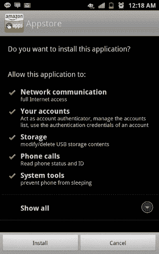
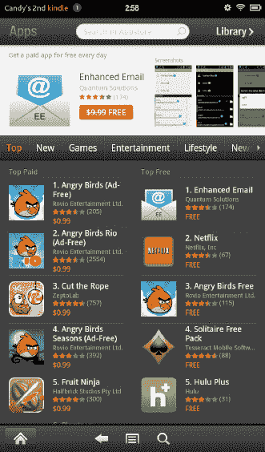
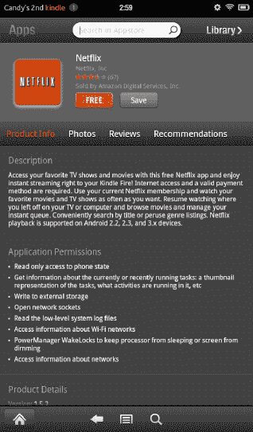
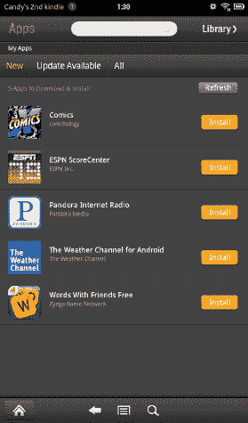
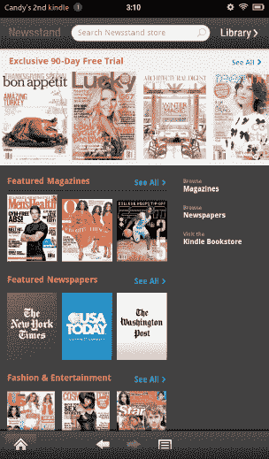
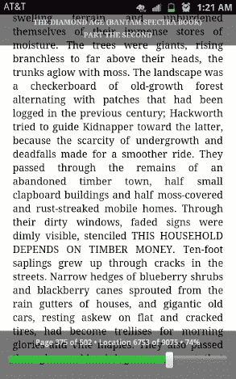
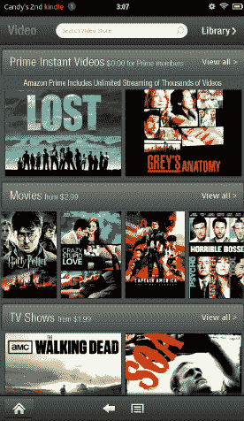
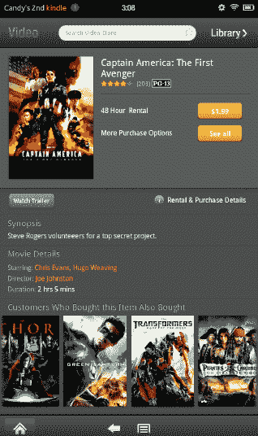

# 十三、使用亚马逊应用

因为越来越多的人使用互联网购物，Amazon.com 已经成为一个家喻户晓的名字。亚马逊上可以找到的商品种类是无与伦比的，它的常客计划 Amazon Prime 鼓励每天都有更多的购物。习惯于网上购物的用户也开始习惯于从数字零售商那里购买电影、书籍和视频游戏。亚马逊将 iTunes 音乐商店的概念应用到自己的商业模式中，并开始将其庞大的图书图书馆转移到数字/电子书领域。不久之后，亚马逊发布了 Kindle，这是一款黑白的电子书阅读器，电池续航时间很长，可以携带数十万本书，可以直接连接到 Amazon.com 购买书籍。

Kindle 的成功促使亚马逊将其业务扩展到音乐、电影的数字商店，并最终扩展到智能手机的应用。Kindle 应用和亚马逊应用商店现在适用于市场上的每一款安卓设备。这些服务可以单独安装，它们让任何 Android 设备都可以访问亚马逊通过这些服务收集的大量内容。凭借一系列新的数字产品，亚马逊发布了彩色 Kindle Fire，以支持其所有现有服务，外加一些新服务。

Kindle Fire 是一款运行 Android 操作系统的平板电脑，但被亚马逊大幅修改，用亚马逊制作和控制的应用取代了谷歌的许多产品和服务。因此，Kindle Fire 不能运行前面章节中演示的任何谷歌应用。你不会在 Kindle Fire 上看到 Gmail、Play Store 或任何其他谷歌开发的应用。

在这一章中，你将学习如何使用亚马逊应用来替代谷歌应用。我们将从最关键的替代品开始:亚马逊应用商店。

### 使用亚马逊应用商店

亚马逊能够通过用亚马逊控制的类似服务来取代谷歌服务，从而将安卓操作系统与让该平台如此受欢迎的谷歌服务完全分离。对亚马逊来说，这些服务中最重要的是 Play Store。亚马逊用自己的 Play Storeand 取代了 Play Storeand，并为开发者提供了必要的工具，方便他们在 Google Play Storeand 和亚马逊的产品上发布应用。现在，亚马逊应用商店可以在每一款 Android 平板电脑上使用，并且预装在 Kindle Fire 上。

亚马逊通过其当日免费应用向 Play Storewith 提供有竞争力的服务。每天，亚马逊都会拿出一款你通常会付费的应用，在亚马逊应用商店上免费提供。一旦你安装了这个应用，你就可以终身免费使用。

如果你不是火主，你需要安装 App Store。

#### 安装亚马逊应用商店

如果你没有 Kindle Fire，你需要做一些事情来安装亚马逊应用商店。因为亚马逊应用商店不是可以通过安卓市场安装的东西，你必须手动安装。

在主屏幕上，打开应用抽屉，选择设置应用。在“设置”中，找到“应用”选项卡，然后轻按一次。在可用选项列表中，您会看到一个“未知来源”选项。点击此选项旁边的框将允许您在不使用 Play Store 的情况下安装应用。点击此复选框后，按下主屏幕图标返回主屏幕。

打开应用抽屉，选择浏览器应用。当浏览器加载时，点击顶部的 URL 栏并输入`[www.amazon.com](http://www.amazon.com)`。当你点击 Go 时，你将被带到亚马逊网站。从这里，你会看到一个获取 Android 亚马逊应用的图标。点击此图标将带您进入适用于您设备的亚马逊应用列表。在这个列表中，你会看到亚马逊应用商店。轻按 App Store 图标开始下载应用。

下载完成后，您会在通知托盘中看到以下消息:“Amazon_Appstore-release.apk 已完成下载。”点击通知弹出窗口开始安装过程。安装屏幕，如图 13–1 所示，将向您显示安装亚马逊应用商店所需的权限。点击弹出窗口左下角的安装按钮。安装完成后，您将能够打开应用并开始使用亚马逊应用商店。

**图 13–1。**亚马逊应用商店安装屏幕

#### 浏览应用商店

进入 Appstore 首先看到的是当天的免费应用。Appstore 屏幕顶部的这个空间每天都会显示不同的应用。你会看到该应用的一系列截图，以及该应用之前列出的价格。该应用可能是面向生产力或健身，或者它可能是一个游戏。应用是根据应用开发者和亚马逊之间的协议选择的，你将收到应用的更新，就像你已经购买了它一样。

如图 13–2 所示，在当日免费应用的下方是不同类型应用的导航栏。在栏上滑动手指以显示更多流派。在导航栏下面，亚马逊的应用商店里有排名前 100 的付费应用。这些应用根据其安装次数进行评级。从屏幕底部向屏幕顶部滑动手指，查看这两个类别中 100 个应用的更多内容。如果你已经知道你在找哪个应用，或者你在找一个特定种类的应用，应用顶部的搜索栏会搜索 Appstore。找到您感兴趣的应用后，轻触该应用的图标，进入该应用的扩展视图。

**图 13–2。** *亚马逊应用商店主视图*

应用的扩展视图提供了亚马逊关于它的所有信息，就像你从它的网站上看应用一样。从这里，你可以看到如果你要安装它，应用会要求你提供什么权限，包括应用运行的屏幕截图，亚马逊客户编写的应用评论，以及安装该应用的用户对其他应用的建议。在此视图的顶部，应用被评级，满分为五星。此评级是该应用获得的所有评级的组合。如图 13–3 所示，在星星旁边，括号内，你会看到有多少人对该应用进行了评分。

**图 13–3。** *网飞 app 展开图*

**注意:**关注收视率。一个有五颗星但只被评价了两次的 app，不一定比一个 100 多个用户有四颗星的 app 好。如果一个应用是新的，它可能只有两个来自帮助开发者测试他的应用的人的评价。

一旦您决定安装应用，点击扩展视图顶部的金色图标。如果应用需要付费，你将被引导到亚马逊结账菜单。交易完成后，应用将开始安装。一旦安装完成，亚马逊 Kindle Fire 用户将在他们的库中找到该应用，而其他 Android 平板电脑用户将在应用抽屉中找到他们的新应用。

#### 安装应用更新

当一个应用的开发者发布了亚马逊应用商店的更新时，你就可以在任何时候安装应用的更新。当您在平板电脑上打开 Appstore 时，您将收到通知，告知您有更新可供安装。如果你是 Kindle Fire 用户，你将不会收到通知。相反，当您进入 Appstore 并按下 Menu 键时，您会在更新图标旁边看到一个红色气泡，气泡中显示了需要更新的应用数量。如果你是 Kindle Fire 用户，点击这个气泡。其他 Android 平板电脑只需在弹出通知时轻触即可。

有可用更新的应用将出现在类似于 Figure 13–4 的列表中。若要安装更新，请点击应用旁边的金色安装按钮。如果应用的更新需要使用任何新的权限，您将在此处收到通知。点击每个应用进行更新，应用将在安装完成后从列表中移除。

**图 13–4。** *亚马逊应用商店的应用更新*

亚马逊 Appstore 为 Play Store 提供有竞争力的服务，除非你用的是 Kindle Fire。今天的免费应用是在你的设备上保留亚马逊应用商店并定期检查的一个很好的理由。

Kindle 电子书阅读器是一款永远免费的亚马逊应用，它向任何 Android 平板电脑用户开放了 Kindle 电子书的世界。我们将在下一节讨论这个应用。

### 使用 Kindle 应用

最初，亚马逊的数字图书服务只有在你有亚马逊 Kindle 的情况下才能使用。最终，亚马逊开始向其他数字设备提供 Kindle 图书馆的访问权限。现在，几乎任何带有屏幕和互联网接入的设备都能够显示 Kindle 图书。

#### 安装 Kindle 应用

Kindle 应用适用于所有安卓平板电脑，并预装在 Kindle Fire 上。要安装 Kindle 应用，请在 Android Market 或亚马逊应用商店中搜索单词 *Kindle* 。找到后，轻按“安装”。像亚马逊的所有服务一样，你需要一个亚马逊帐户才能访问应用，但如果你没有，从 Kindle 应用创建一个也很容易。

Kindle 应用可以访问亚马逊图书馆的书籍、杂志、报纸等。Kindle 图书馆允许您购买书籍和订阅杂志和报纸，如图 13–5 所示。在 Kindle 应用中，点击屏幕右上角的商店图标，访问 Kindle 书店和 Kindle 报刊亭。

**图 13–5。**亚马逊 Kindle 报刊亭

亚马逊图书馆是按流派组织的，在导航栏下面有亚马逊书店当前的畅销书列表。该应用的顶部是一个搜索栏，允许您搜索特定的标题或主题。一旦你选择了一本书或杂志，你将被要求通过亚马逊结账购买该商品。购买完成后，您的 Kindle 图书将出现在图书馆中。

#### 在 Kindle 应用中阅读

一旦你的图书馆中有了一个项目，你可以选择通过下载几个章节将书“流式”到你的平板电脑上，或者你可以下载整本书。要下载图书，请用手指按住图书，直到出现菜单。从列表中选择“下载到主页”，图书将开始下载。现在，即使你没有连接到互联网，你也可以访问这本书。

无论你是决定下载这本书，还是访问传输到平板电脑的章节，Kindle 应用都会通过亚马逊称为 Whispersync 的软件跟踪你在书中的位置。当你离开 Kindle 应用时，亚马逊会存储你正在阅读的书籍中的位置。当您连接到互联网时，Kindle 应用会与您的亚马逊帐户共享这些信息。现在，如果你想从电脑或其他设备上阅读 Kindle 书籍，这本书会立即回到你离开的地方。当你在一本书里时，你可以轻触屏幕，显示你在书中的进度，如图图 13–6 所示。

**图 13–6。** *Kindle Whispersync*

Kindle 应用占用的空间比实体图书馆少得多，并且允许您存储比大多数人的空间更多的书籍、杂志和报纸。在你的平板电脑和电脑上查看 Kindle 提供的所有内容的能力使你在任何地方都可以很容易地访问你的书籍。

### 使用亚马逊视频商店

Kindle Fire 上的每个亚马逊应用(除了亚马逊视频应用)都有一个副本，可以安装在任何其他 Android 平板电脑上。这个应用让用户可以访问亚马逊数字视频库。通过这款应用，用户可以购买电影和电视节目，并从 Amazon.com 下载视频或将视频下载到 Kindle Fire。如果你是亚马逊 Prime 用户，亚马逊图书馆中的许多视频都可以免费传输到你的 Kindle Fire 上。

在 Kindle Fire 的主屏幕上，点击视频标签，进入视频商店。音像店的主视图分为三个部分。Prime 即时视频部分是一个免费视频的集合，如果你有亚马逊 Prime 帐户，可以将这些视频传输到你的 Kindle Fire。在此之下，图 13–7 中的电影和电视节目选项卡提供可供租赁和购买的精选视频。在每个部分，你都可以用手指从右向左滑动来浏览所提供的视频。如果您想查看某个部分的更多内容，请点击“查看全部”进入该部分的类别视图。每个部分都允许您按类型或通过使用应用顶部的搜索来浏览视频集合。当您看到想要了解更多信息的视频时，轻按该视频的图像。

**图 13–7。***Kindle Fire 上的亚马逊视频应用*

从任何视频的扩展视图中，您都可以访问大量信息。如果你正在看一部电影，如图 13–8 所示，你可以通过应用观看电影的预告片。您可以阅读电影简介或轻按“电影详细信息”来查看谁主演了这部电影。如果您正在寻找类似的电影，页面底部有一个电影选择，其他看过此视频的客户也考虑过。

**图 13–8。**??【亚马逊视频商店】扩展视图

如果你决定看这个视频，你可以选择租借或购买电影。如果您租借影片，它将在您的资料库中可用 48 小时，然后影片将自行移除。如果你选择购买电影，你将能够下载电影或从亚马逊流媒体播放。如果你下载了这部电影，你就不需要互联网连接来观看它。

亚马逊视频商店每天都在增长，只要你有互联网连接，你在那里购买的电影总是可以得到的。这些视频在很多地方都可以看到，不仅仅是你的 Kindle Fire。任何装有网络浏览器的电脑都可以从你的亚马逊账户上访问视频，许多蓝光播放器和“智能电视”现在都提供亚马逊视频库，让你几乎可以在任何地方观看你的数字视频。

### 总结

亚马逊已经将其庞大的数字图书馆转变为一系列应用，让你可以随身携带你最喜欢的书籍、电影、电视节目和游戏。唯一的限制是你的设备上有多少存储空间(如果你没有一直连接到互联网)。

感谢您花时间阅读《将您的 Android 平板电脑发挥到极致》。我最深感欣慰的是，这些页面中的信息不仅能帮助您享受平板电脑，还能让您对使用平板电脑充满信心。我希望你能把你从这本书里学到的知识分享给你认识的所有正在考虑平板电脑的人。每天都有更多新的事情要用平板电脑来做。新的应用正在被编写，随之而来的是新的特性和新的可能性。无论您的平板电脑是笔记本电脑的替代品，还是客厅的有趣新工具，或者只是您在旅途中阅读书籍的一种方式，我希望这本书对您有所帮助。