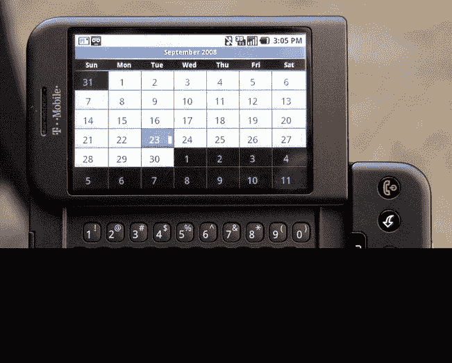
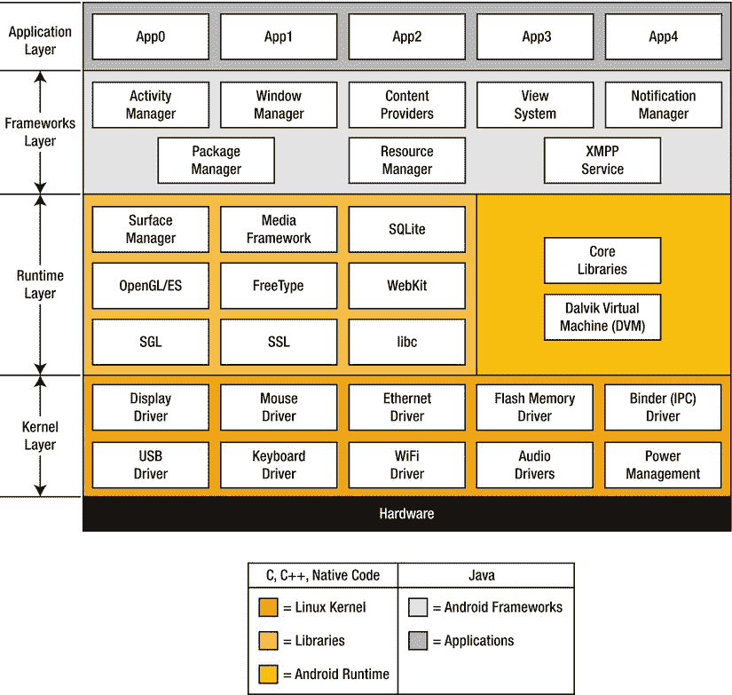
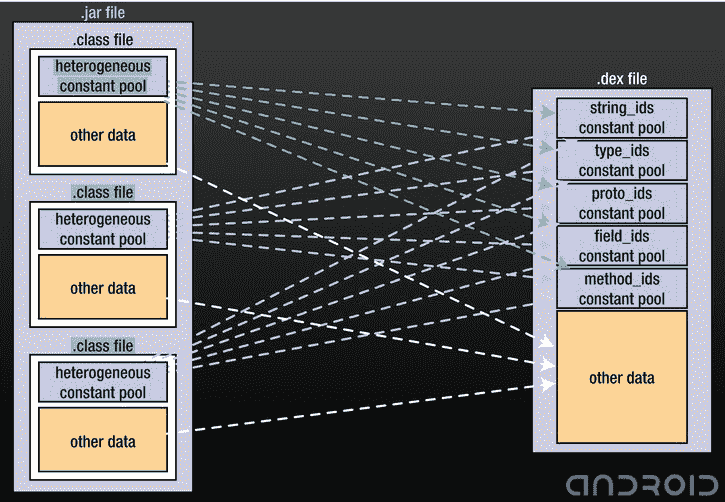
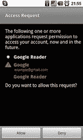

第章 1

安卓架构

谷歌进入手机市场的方式只有价值数十亿美元的公司才能承受得起:它收购了一家公司。2005 年，谷歌公司收购了安卓公司。当时，安卓相对不为人知，尽管有四个非常成功的人作为它的创造者。由安迪·鲁宾、里奇·迈纳、克里斯·怀特和尼克·西尔斯于 2003 年创立的安卓系统并不引人注目，它开发了一个手机操作系统。为了开发一款更了解主人偏好的智能手机，Android 操作系统背后的团队秘密地辛勤工作。该团队只承认他们正在开发手机软件，但在 2005 年收购之前，他们对 Android 操作系统的真实性质保持沉默。

在谷歌资源的全力支持下，Android 开发快速增长。截至 2011 年第二季度，Android 已经在面向终端用户的手机操作系统中占据了近 50%的市场份额。四位创始人在收购后留任，鲁宾担任移动业务高级副总裁。Android 1.0 版本的正式推出发生在 2008 年 9 月 23 日，第一个运行它的设备是 HTC Dream(见[图 1-1](#Fig1) )。



[图 1-1](#_Fig1) 宏达梦想(迈克尔·奥瑞尔提供)

Android 操作系统的一个独特之处是，它的二进制文件和源代码是作为开源软件发布的，这使得它得以快速发展。您可以下载 Android 操作系统的完整源代码，它大约占用 2.6 GB 的磁盘空间。理论上，这允许任何人设计和制造运行 Android 的手机。保持软件开源的想法一直延续到 3.0 版本。Android 包括 3.0 及以上版本仍然是闭源。在接受彭博商业周刊采访时，鲁宾说 3.x 版本的代码库采取了许多捷径来确保它能快速上市，并能与非常特殊的硬件一起工作。如果其他硬件供应商采用这个版本的 Android，那么负面的用户体验将是可能的，谷歌希望避免这种情况。 [<sup>1</sup>](#Fn0011)

Android 架构的组件

Android 架构分为 以下四个主要组件(见[图 1-2](#Fig2) ):



[图 1-2](#_Fig2) Android 架构

1.  内核
2.  库和 Dalvik 虚拟机
3.  应用程序框架
4.  应用程序

内核

Android 运行在 Linux 2.6 内核之上。内核是与设备硬件交互的第一层软件。与运行 Linux 的台式电脑类似，Android 内核将负责电源和内存管理、设备驱动程序、进程管理、网络和安全。安卓内核在 http://android.git.kernel.org/.有售

作为一名应用程序开发人员，修改和构建一个新的内核不是您想要考虑的事情。一般来说，只有硬件或设备制造商想要修改内核，以确保操作系统与他们特定类型的硬件一起工作。

图书馆

库组件还与运行时组件共享其空间。库组件充当内核和应用程序框架之间的转换层。这些库是用 C/C++编写的，但是通过 Java API 向开发人员公开。开发人员可以使用 Java 应用程序框架来访问底层的核心 C/C++库。一些核心库包括:

*   *LibWebCore* :允许访问网络浏览器。
*   *媒体库*:允许访问流行的音频和视频录制和播放功能。
*   *图形库*:允许访问 2D 和 3D 图形绘制引擎。

运行时组件由 Dalvik 虚拟机组成，它将与应用程序交互并运行应用程序。虚拟机是 Android 操作系统的重要组成部分，执行系统和第三方应用程序。

达尔维克虚拟机

丹·博恩施泰因最初编写了达尔维克虚拟机。他以冰岛的一个小渔村命名，因为他相信他的一个祖先曾经起源于那里。Dalvik VM 主要用于在资源非常有限的设备上执行应用程序。通常，移动电话会属于这一类，因为它们受到处理能力、可用内存量和电池寿命短的限制。

什么是虚拟机？

虚拟机是在另一个主机操作系统中运行的独立的客户操作系统。虚拟机将执行应用程序，就像它们在物理机上运行一样。虚拟机的主要优势之一是可移植性。不管底层硬件如何，您编写的代码都可以在虚拟机上运行。对于开发人员来说，这意味着您只需编写一次代码，就可以在任何运行兼容 VM 的硬件平台上执行。

达尔维克虚拟机执行。dex 文件。一个。dex 文件是通过取编译好的 Java 制作的。类别或。jar 文件，并将所有常量和数据整合到每个文件中。类文件放入一个共享常量池中(参见图 1-3[)。Android SDK 中包含的 dx 工具执行这种转换。转换后，。dex 文件的文件大小明显较小，如](#Fig3)[表 1-1](#Tab1) 所示。



[图 1-3](#_Fig3) 将. jar 文件转换为. dex 文件

[表 1-1](#_Tab1) 。文件大小比较(以字节为单位)。罐子和。dex 文件

| 应用 | 未压缩。冲突 | 压缩的。冲突 | 未压缩。DEXEDRINE 的简称 |
| --- | --- | --- | --- |
| 通用系统库 | 21445320 = 100% | 10662048 = 50% | 10311972 = 48% |
| 网络浏览器应用 | 470312 = 100% | 232065 = 49% | 209248 = 44% |
| 闹钟应用程序 | 119200 = 100% | 61658 = 52% | 53020 = 44% |

应用框架

应用程序框架是最终系统或最终用户应用程序的构建块之一。该框架提供了一套服务或系统，开发者在编写应用程序时会发现这些服务或系统很有用。该框架通常被称为 API(应用程序编程接口)组件，将为开发人员提供对按钮和文本框等用户界面组件的访问，提供通用内容提供商以便应用程序可以在它们之间共享数据，提供通知管理器以便设备所有者可以收到事件警报，并提供活动管理器来管理应用程序的生命周期。

作为开发人员，您将编写代码并使用 Java 编程语言中的 API。[清单 1-1](#list1) ，摘自 Google 的样例 API 演示([http://developer . Android . com/resources/samples/API demos/index . html](http://developer.android.com/resources/samples/ApiDemos/index.html))，演示了如何使用应用程序框架播放视频文件。粗体的 import 语句允许通过 Java API 访问核心 C/C++库。

***[清单 1-1](#_list1) 。*** 一个视频播放器演示(由谷歌公司提供)

/*

*版权所有(C)2009 Android 开源项目

*

*根据 Apache 许可证 2.0 版(“许可证”)获得许可；

*除非符合许可协议，否则您不得使用此文件。

*您可以从以下网址获得许可证副本

*

*[http://www.apache.org/licenses/LICENSE-2.0](http://www.apache.org/licenses/LICENSE-2.0)

*

*除非适用法律要求或书面同意，否则软件

*根据许可证分发是基于“原样”分发，

*没有任何明示或暗示的担保或条件。

*有关管理权限的特定语言，请参见许可证

*许可证下的限制。

*/

包 com . example . Android . APIs . media；

**导入 com . example . Android . APIs . r；**

**导入 Android . app . activity；**

**导入 Android . OS . bundle；**

**导入 Android . widget . media controller；**

**导入 android . widget . toast**

**导入 android . widget . videoview**

公共类 VideoViewDemo 扩展活动{

/**

* TODO:将 path 变量设置为流式视频 URL 或本地媒体

*文件路径。

*/

私有字符串路径= " "；

mVideoView 专用视频视图：

@覆盖

公共 void onCreate(捆绑冰柱){

很好，oncreate(icic)；

setContentView(请参阅 layout.videoview)：

mvideoview =(video view)findviewbyid(r . id . surface _ view)；

if (path == "") {

//告诉用户提供媒体文件 URL/路径。

烤面包。makeText(

VideoViewDemo.this，

请编辑视频视图演示活动，并设置路径

+"媒体文件 URL/路径的变量"，

吐司。长度 _ 长)。show()；

} else {

/*

*或者，对于流媒体，您可以使用

* mvideoview . set video uri(uri . parse(URL string))；

*/

mvideoview . setvideoplath(path)；

mVideoView.setMediaController(新媒体控制器(this))；

mVideoView.requestFocus()：

}

}

}

应用程序

Android 操作系统的应用程序组件最接近最终用户。这是联系人、电话、信息和愤怒的小鸟应用程序所在的地方。作为开发人员，您的成品将通过使用 API 库和 Dalvik VM 在这个空间中执行。在本书中，我们将广泛地研究 Android 操作系统的这个组件。

尽管 Android 操作系统的每个组件都可以修改，但你只能直接控制你自己的应用程序的安全性。然而，这并不意味着您可以随意忽略如果设备受到内核或虚拟机漏洞攻击会发生什么。确保您的应用程序不会因为无关的利用而成为攻击的受害者也是您的责任。

这本书是关于什么的

现在你已经对 Android 架构有了一个总体的了解，让我们转向你在这本书里将要*而不是*学到的东西。首先，你不会在这本书里从头开始学习如何开发 Android 应用。你会看到很多例子和源代码清单；虽然我将解释代码的每一部分，但你可能会有在本书中找不到答案的其他问题。你需要在为 Android 平台编写 Java 应用程序方面有一定的经验和技能。我还假设您已经使用 Eclipse IDE 设置了 Android 开发环境。在本书中，我将重点介绍如何为 Android 操作系统开发更安全的应用程序。

Android 也有相当多的安全挫折和一系列值得研究和借鉴的恶意软件。掌握了在哪里寻找和如何解决 Android 开发的安全问题，不一定会让你成为一个更好的程序员，但它会让你开始对最终用户的隐私和安全更加负责。

我试图以一种能帮助你理解与你开发的应用程序相关的安全概念的方式来写这本书。在大多数情况下，我发现我能做到这一点的最好方法是通过实例教学。因此，你通常会发现我要求你先编写并执行源代码清单。然后，我会继续解释我们所涉及的具体概念。考虑到这一点，让我们来看看 Android 操作系统上可用的一些安全控件。

安全

安全不是一个肮脏的词，黑爵士！

——梅尔切特将军，*黑爵士 IV*

安全 是一个庞大的主题，适用于许多领域，这取决于它所处的环境。我写这本书是为了介绍安全性的一小部分。本文旨在让您更好地了解 Android 应用程序安全性。然而，这到底意味着什么呢？我们要保护什么？谁将从中受益？为什么重要？让我们试着回答这些问题，并可能提出一些新的问题。

首先，让我们认清你到底是谁。你是开发者吗？也许你是一名从事研究的安全从业者。或者，您可能是一个对保护自己免受攻击感兴趣的最终用户。我愿意认为我符合这些类别中的每一个。毫无疑问，你会适合其中的一个或多个。然而，绝大多数人都符合一个类别:希望以不损害隐私和安全的方式使用编写良好的应用程序的功能的最终用户。如果你是一名开发人员，我猜你是，如果你拿起这本书，这是你的目标受众:最终用户。您编写应用程序来分发给您的用户。你可以选择出售或者免费赠送。不管是哪种情况，你正在编写的应用程序最终会被安装在其他人的设备上，可能在几千英里之外。

保护您的用户

您的应用程序应该努力提供尽可能好的功能，同时注意保护用户的数据。这意味着在开始开发之前要考虑安全性。

你的用户可能并不总是知道你在应用程序“幕后”采用的安全措施，但是你的应用程序中的一个漏洞就足以确保他所有的 Twitter 和脸书追随者发现。在应用程序的开发阶段之前规划和考虑安全性，可以避免差评的尴尬和付费客户的流失。最终用户几乎不会很快原谅或忘记。

在此过程中，您将了解识别敏感用户数据和创建保护这些数据的计划的原则和技术。目标是消除或大大减少应用程序可能造成的任何意外伤害。那么，您真正要保护最终用户免受什么危害呢？

安全风险

与台式电脑用户相比，移动设备用户面临一些独特的风险。除了设备丢失或被盗的可能性更高之外，移动设备用户还面临着丢失敏感数据或隐私泄露的风险。为什么这与桌面用户不同？首先，存储在用户移动设备上的数据质量往往更加个人化。除了电子邮件，还有即时消息、SMS/MMS、联系人、照片和语音邮件。“那又怎么样？”你说。"其中一些东西存在于台式电脑上."没错，但是考虑一下这个:你移动设备上的数据很可能比你桌面上的数据更有价值，因为你一直把它带在身边。它是计算机和手机的融合平台，包含更丰富的个人数据。因为智能手机上的用户交互水平更高，所以数据总是比台式电脑上的数据更新。即使您已经配置了与远程位置的实时同步，这也只能防止您丢失数据，而不能保护您的隐私。

还要考虑存储在移动设备上的数据格式是固定的。每部手机都有短信/彩信、联系人和语音邮件。功能更强大的手机将拥有照片、视频、GPS 定位和电子邮件，但所有这些都是通用的，与操作系统无关。现在考虑一下所有这些信息对最终用户有多重要。对于没有备份的用户来说，丢失这种性质的数据是不可想象的。丢失重要的电话号码、视频中捕捉到的女儿迈出第一步的珍贵瞬间，或者重要的短信，对于日常电话用户来说都是灾难性的。

对于在手机上同时进行商务和个人活动的用户来说呢？如果有人从你的手机上复制了你的 office 服务器群的整个密码文件，你会怎么做？或者，如果一封包含商业秘密和提案保密定价的电子邮件泄露到互联网上呢？丢了孩子学校的地址怎么办？假设一个跟踪者获得了这些信息以及更多信息，比如你的家庭住址和电话号码。

很明显，在大多数情况下，手机上存储的数据远比手机本身更有价值。最危险的攻击类型是无声无息、远程进行的攻击；攻击者不需要物理接触你的电话。这些类型的攻击可能在任何时候发生，并且由于设备上其他地方的安全薄弱而经常发生。这些安全性上的失误可能不是因为您的应用程序不安全。它们可能是由于内核或 web 浏览器中的错误造成的。问题是:即使攻击者通过不同的途径访问设备，您的应用程序能否保护其数据免受攻击？

Android 安全架构

正如我们之前讨论的，Android 运行在 Linux 2.6 内核之上。我们还了解到 Android Linux 内核负责操作系统的安全管理。让我们来看看 Android 的安全架构。

权限分离

Android 内核在执行应用程序时实现了权限分离模型。这意味着，像在 UNIX 系统上一样，Android 操作系统要求每个应用程序都使用自己的用户标识符(uid)和组标识符(gid)来运行。

系统架构本身的各个部分以这种方式分离。这确保了应用程序或进程没有访问其他应用程序或进程的权限。

什么是特权分离？

*权限分离*是一项重要的安全特性，因为它拒绝了一种更常见的攻击类型。在许多情况下，首先进行的攻击并不是最有效的攻击。它通常是更大攻击的垫脚石或入口。通常，攻击者会首先利用系统的一个组件；一旦到了那里，他们就会试图攻击系统中更重要的组件。如果这两个组件以相同的权限运行，那么对于攻击者来说，从一个组件跳到下一个组件是一件非常简单的事情。通过分离权限，攻击者的任务变得更加困难。他必须能够将其权限升级或更改为他希望攻击的组件的权限。通过这种方式，攻击被停止，如果不是减慢的话。

因为内核实现了权限分离，这是 Android 的核心设计特性之一。这种设计背后的理念是确保任何应用程序都不能读取或写入其他应用程序、设备用户或操作系统本身的代码或数据。因此，应用程序可能无法随意使用设备的网络堆栈来连接到远程服务器。一个应用程序可能无法直接读取设备的联系人列表或日历。这个特性也被称为*沙箱*。两个进程在各自的沙箱中运行后，它们相互通信的唯一方式是显式请求访问数据的权限。

权限

我们举个简单的例子。我们有一个应用程序，记录来自设备内置麦克风的音频。为了让这个应用程序正常工作，开发人员必须确保在应用程序的 AndroidManifest.xml 文件中添加对 RECORD_AUDIO 权限的请求。这允许我们的应用程序请求使用处理录音的系统组件的权限。但是谁来决定是允许还是拒绝访问呢？Android 允许最终用户执行这一最终批准过程。当用户安装我们的应用程序时，会出现如图[图 1-4](#Fig4) 所示的屏幕提示。值得注意的是，当应用程序执行时，不会出现权限提示。相反，需要在安装时授予权限。



[图 1-4](#_Fig4) 。Android 权限请求屏幕

如果我们没有明确设置我们对 RECORD_AUDIO 权限的需求，或者如果设备所有者在我们请求后没有授予我们权限，那么 VM 将抛出一个异常，应用程序将失败。开发人员需要知道如何请求权限，并通过捕获相关异常来处理权限未被授予的情况。要请求此权限，项目的 AndroidManifest.xml 文件中必须包含以下标记:

```java
<uses-permission android:name="android.permission.RECORD_AUDIO" />
```

本书的附录中给出了权限的完整列表。

申请代码签名

任何要在 Android 操作系统上运行的应用程序都必须经过签名。Android 使用个人开发者的证书来识别他们，并在操作系统中运行的各种应用程序之间建立信任关系。操作系统将不允许未签名的应用程序执行。不需要使用证书颁发机构来签署证书，Android 将愉快地运行任何使用自签名证书签署的应用程序。

与权限检查一样，证书检查仅在应用程序安装期间进行。因此，如果您的开发人员证书在您的应用程序安装到设备上后过期，则该应用程序将继续执行。在这一点上，唯一的区别是您需要在签署任何新的应用程序之前生成一个新的证书。Android 要求应用程序的调试版本和发布版本有两个单独的证书。通常，运行 Android 开发工具(ADT)的 Eclipse 环境已经设置好，可以帮助您生成密钥并安装证书，这样您的应用程序就可以自动打包并签名。Android 模拟器的行为与物理设备相同。像物理设备一样，它将只执行已签名的应用程序。我们将详细介绍应用程序代码签名，以及在线发布和销售您的应用程序。

摘要

正如我们到目前为止所看到的，由于谷歌对 Android 的收购，Android 在资源和关注度方面获得了巨大的提升。同样的关心和关注帮助推动 Android 成为当今世界上增长最快的智能手机操作系统之一。Android 的开源模式帮助其数量增长，主要是因为许多不同的硬件制造商可以在他们的手机上使用该操作系统。

我们也看到了 Android 的核心是基于 Linux 内核的。内核的两个主要任务是(1)充当硬件和操作系统之间的桥梁，以及(2)处理安全性、内存管理、进程管理和网络。当不同的硬件制造商开始采用 Android 与其硬件一起工作时，内核通常是将被修改的主要组件之一。

围绕 Android 内核的下一层是运行时层，包括核心库和 Dalvik 虚拟机。Dalvik VM 是在 Android 平台上执行应用程序的基础部分。正如您将在接下来的章节中看到的，在资源受限的环境中安全高效地执行应用程序时，Dalvik VM 有一些独特的特性。

接下来要添加的上层分别是框架和应用程序。您可以将框架层视为 Java API 和本机代码以及运行在下面的系统进程之间的又一座桥梁。这是所有 Android Java APIs 存在的地方。您希望在程序中导入的任何库都是从这里导入的。应用层是您的应用程序最终生活和工作的地方。您将与其他开发者应用程序和 Android 的捆绑应用程序(如电话、日历、电子邮件和消息应用程序)共享这个空间。

然后，我们简要地看了一下安全风险，你如何有责任保护你的终端用户，以及 Android 促进这一点的一些方式。我们研究的三个领域是特权分离、权限和应用程序代码签名。在接下来的章节中，我们将探讨如何不仅利用这些特性，还增加您自己的安全级别和最终用户保护。

[<sup>1</sup>](#_Fn0011) *彭博社《商业周刊》*，《谷歌捧蜂巢紧》，阿什利·万斯和布拉德·斯通，[www . business week . com/technology/content/mar 2011/TC 2011 03 24 _ 269784 . htm](http://www.businessweek.com/technology/content/mar2011/tc20110324_269784.htm)，2011 年 3 月 24 日。