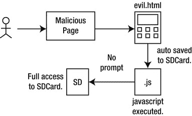
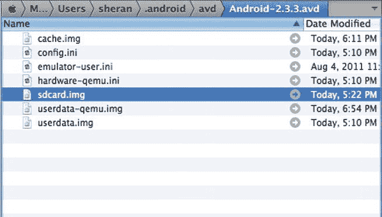
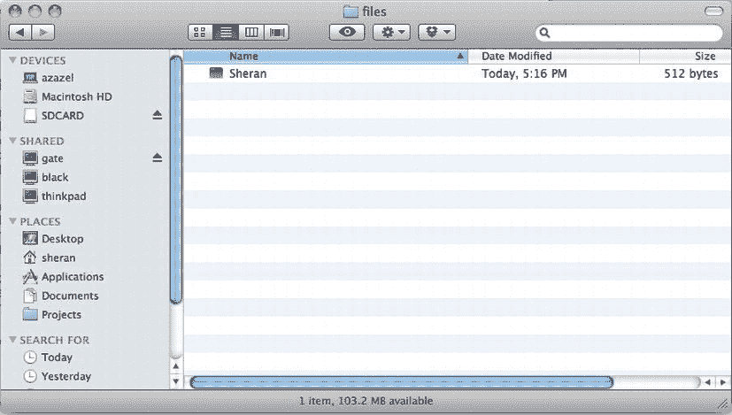
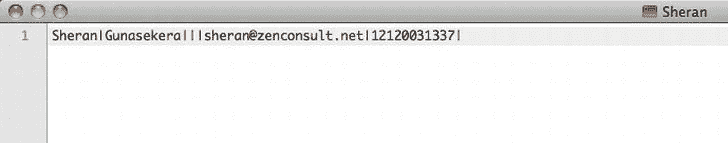
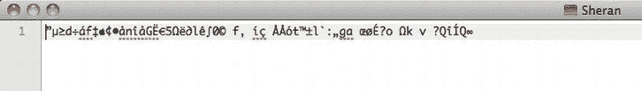

# 二、信息：一个应用的基础

所有有意义的应用程序的基础是信息，我们设计和构建应用程序来交换、创建或存储信息。移动应用程序也不例外。在当今连接良好的移动领域，信息交换是游戏的名称。为了说明这一点，想象一部没有移动网络或 WiFi 覆盖的 Android 手机。虽然这种手机仍有用武之地，但你将无法访问手机上一些更重要的应用程序。例如，电子邮件、即时消息、网页浏览和任何其他需要互联网的应用程序现在都将无法运行。

在后面的章节中，我们将集中精力检查传输中的信息以及如何保护它。在本章中，我们将主要关注存储的信息发生了什么变化。

保护您的应用免受攻击

当创建或接收数据时，数据需要存储在某个地方。这些信息的存储方式最终将反映出您的应用程序的安全性。向公众发布你的应用程序应该像在互联网上建立一个网站一样小心谨慎。您应该假设您的应用程序在某个时候会受到直接或间接的攻击，并且您的应用程序是最终用户隐私和数据保护之间的唯一障碍。

间接攻击

尽管最后一句话听起来很有戏剧性，但它并非毫无根据。在我们进一步讨论之前，让我们看看我散布恐惧是否有道理。2010 年后期和 2011 年初，分别在 Android 和 2.3 版本中发现了两个漏洞。该漏洞本质上是相同的，在该漏洞中，攻击者可以复制存储在设备 SD 卡上的任何文件，而无需许可，甚至没有可见的提示。该漏洞的工作原理如图[图 2-1](#Fig1) 所示。



[图 2-1](#_Fig1) 。数据窃取漏洞

以下是最值得注意的几点:

1.  用户访问托管文件的恶意网站，如evil.html。
2.  由于漏洞的一部分，在没有提示用户的情况下，evil.html文件被下载并保存到设备 SD 卡。
3.  由于该漏洞的另一部分，保存的文件可以在保存后立即执行 JavaScript 代码。同样，对最终用户没有提示。
4.  由于此漏洞的最后一部分，前面执行的 JavaScript(因为它运行在设备的“本地”上下文中)将完全有权将存储在 SD 卡上的文件上传到攻击者选择的网站。

为了便于讨论，假设您的应用程序将所有保存的信息写入 SD 卡，存储在它自己的目录下。由于刚才讨论的漏洞，您的应用程序使用的数据有被窃取的风险。任何运行您的应用程序和易受攻击的固件版本的 Android 设备都会给其最终用户带来数据被盗的风险。这是对您的应用程序进行间接攻击的一个例子。

您的应用程序对于间接攻击的脆弱性很大程度上取决于您在开始编写一行代码之前，在设计*和*考虑安全方面*方面投入了多少努力。你可能会问这样的问题，“我只是一个计划在网上低价出售我的应用程序的小应用程序开发者，所以我真的需要浪费时间事先做这么多计划吗？”我会响亮地回答你:“是的！”无论您是 30 名开发人员团队的一员，还是在家工作的个人，一个架构良好的应用程序都是您应该努力创建的。我希望这是你将从本书中学到的东西。*

直接攻击

直接攻击明显不同，可以采取多种不同的形式。直接攻击可以分为直接针对您的应用程序的攻击。因此，攻击者希望利用应用程序设计中的弱点来收集应用程序用户的敏感信息，或者攻击应用程序与之对话的服务器。以一个移动银行应用程序为例。攻击者可能会追踪属于特定银行的移动应用程序。如果应用程序设计薄弱 — 例如，如果敏感的用户数据以明文形式存储，或者应用程序和服务器之间的通信没有受到 SSL — 的保护，那么攻击者可以专门针对这些弱点发起攻击。这是对特定应用程序的直接攻击。我将在本书第 9 章的[中更详细地讲述直接攻击。](09.html)

项目 1:“Proxim”和数据存储

让我们从一个名为 Proxim 的简单例子开始。我已经签约编写一个应用程序，当用户在一组 GPS 坐标的一定范围内时，该应用程序可以向特定的、已定义的联系人发送 SMS。例如，使用这个应用程序，用户可以将他的妻子添加为联系人，并且每当他在他的工作场所和家的三英里范围内时，就让应用程序给她发短信。这样，她就知道他什么时候离家和办公室近了。

您可以从 Apress 网站的源代码/下载区域([【www.apress.com】](http://www.apress.com))下载并检查 Proxim 应用程序的整个源代码。为了清楚起见，让我们看一下最重要的区域。

数据存储程序如清单 2-1 中的[所示。](#list1)

***[清单 2-1](#_list1) 。*** 保存例程，SaveController。java

包 net . Zen consult . Android . controller；

导入 Java . io . file；

导入 Java . io . file notfounindexception；

导入 java.io.FileOutputStream：

导入 java . io 异常：

导入 net . Zen consult . Android . model . contact；

导入 net . Zen consult . Android . model . location；

导入 Android . content . context；

导入 Android . OS . environment；

导入 android.util.Log：

公共类 SaveController {

私有静态最终字符串*标签*= " save controller "；

公共静态 void saveContact(上下文 Context，Contact contact) {

if ( *isReadWrite* ()) {

尝试{

File output File = new File(context . getexternalfilesdir(null)，contact . get first name())；

FileOutputStream outputStream = new FileOutputStream（outputFile）;

output stream . write(contact . getbytes())；

output stream . close()；

} catch(file notfounindexception e)}

日志。 *e* ( *标签*，“找不到文件”)；

} catch(io exception e)}

Log. *e* ( *TAG* ,"IO Exception");

}

} else {

日志。 *e* ( *TAG* ，“读写模式下打开媒体卡出错！”);

}

}

公共静态 void saveLocation(上下文上下文，位置位置){

if ( *isReadWrite* ()) {

尝试{

File outputFile = new File（context.getExternalFilesDir（null），location.getIdentifier（））;

FileOutputStream outputStream = new FileOutputStream（outputFile）;

output stream . write(location . getbytes())；

output stream . close()；

} catch(file notfounindexception e)}

日志。 *e* ( *标签*，“找不到文件”)；

} catch(io exception e)}

日志记录。 *e* ( *标记*，“IO 异常”)；

}

} else {

日志。 *e* ( *TAG* ，“读写模式下打开媒体卡出错！”);

}

}

私有静态布尔值 isReadOnly() {

日志。 *e* ( *标记*，环境

.*get xternalstoragestate*)；

回归环境。*媒体装载只读*。等于(环境

.*get xternalstoragestate*)；

}

私有静态布尔 isReadWrite() {

日志。 *e* ( *标记*，环境

.*get xternalstoragestate*)；

回归环境。*介质安装*。等于(环境

.*get xternalstoragestate*)；

}

}

每次用户选择“保存位置”按钮或“保存联系人”按钮时，都会触发前面的代码。让我们更详细地看看位置(见[清单 2-2](#list2) )和联系人(见[清单 2-3](#list3) )类。虽然我们可以实现一个主要的保存例程，但我将它分开，以防需要以不同的方式对不同的对象进行操作。

***[清单 2-2](#_list2) 。***Location.java外景班

包 net . Zen consult . Android . model；

publicclass location

私有字符串标识符；

私人双 latitude

私人双倍长度；

公共位置(){

}

publicdouble get attitude()±

返回纬度；

}

publicvoid setLatitude(双纬度){

this.latitude =纬度；

}

public double get length()= & gt

返回经度；

}

publicvoid setLongitude(双经度){

this.longitude =经度；

}

publicvoid setidentifier(字符串标识符)

this.identifier =标识符；

}

public string getiidentificar()= & gt

返回标识符；

}

公共字符串 toString() {

string builder ret = new string builder()；

ret . append(get identifier())；

ret . append(string . value of(get distance()))；

ret . append(string . value of(get length()))；

return ret.toString()：

}

公有字节[] getBytes() {。

返回到 String（）.getBytes（）;

}

}

***[清单 2-3](#_list3) 。【Contact.java】的***触点类，的

**包**net . Zen consult . Android . model；

publicclass contact

**私**串名；

**私有**字符串姓氏；

**私有**字符串 address1

**私有**字符串 address2

**私人**字符串邮件；

**私人**串线电话；

**公共**联系人(){

}

**public** 字符串 getFirstName()>

**返回**名字；

}

**public void**set first name(String first name){

**这个**。firstName =名字；

}

**public**String get last name(){

**返回**姓氏；

}

**public void**set last name(String last name){

**这个**。lastName =姓氏；

}

**public** 字符串 get ddress 1()= >

**返回**地址 1；

}

**publicvoid** setAddress1(字符串地址 1) {

**this**. address 1 = address 1；

}

**public** 字符串 getaddress 2()>

**返回**address 2；

}

**publicvoid** setAddress2(字符串地址 2) {

**这个**. address 2 = address 2；

}

**public** 字符串 getemail()>

**回复**邮件；

}

**发布**【set email(string email)】

**这个**。email = email

}

**public** String getPhone() {

**返回**电话；

}

**public void**set phone(String phone){

**这个**。电话=电话；

}

**public** String toString() {

StringBuilder ret = **新**string builder()；

ret . append(get first name()+|)；

ret . append(get astname()+|)；

ret . append(get address 1()+|)；

ret . append(get address 2()+|)；

ret . append(get mail()+|)；

ret . append(get microphone()+|)；

**返回**ret . tostring()；

}

公有字节[] getBytes() {。

**返回**tostring()getbytes()；

}

}

位置和联系类是标准类，用于保存特定于每种类型的数据。它们中的每一个都包含了 toString() 和 getBytes() 方法，这些方法将类的全部内容作为一个字符串或一个字节数组返回。

如果我们要手动添加一个联系人对象，那么我们很可能会使用类似于[清单 2-4](#list4) 中所示的代码。

***[清单 2-4](#_list4) 。*** 代码，增加一个新的联系对象

**期末**联系人= **新**联系人()；

contact . set first name(" Sheran ")；

contact . set last name(" Gunasekera ")；

contact.setAddress1(" ")

contact.setAddress2(" ")

contact . set email(" sheran @ Zen consult . net ")；

contact . set phone(" 12120031337 ")；

现在假设当用户填充屏幕向应用程序添加新联系人时，调用清单 2-4 中的代码。您将使用显示在主视图上的每个 EditText 对象的 getText() 方法，而不是看到硬编码的值。

如果您在您的 Android 模拟器中执行代码save controller . save Contact(getApplicationContext()、Contact))， SaveController 将获取新创建的联系人并将其存储在外部媒体源中(回头参考[清单 2-1](#list1) )。

**注意**使用 getExternalFilesDir() 方法在 Android 设备上查找 SD 卡的位置始终是一个好的做法。因为 Android 可以在大量不同规格的设备上运行，所以 SD 卡目录的位置可能并不总是在 /sdcard 。 getExternalFilesDir() 方法将向操作系统查询 SD 卡的正确位置，并将该位置返回给您。

让我们一次看一行，从 saveContact() 方法的构造函数开始:

```java
public static void saveContact(Context context, Contact contact) {
        if (*isReadWrite*()) {
                        try {
```

前面的代码片段需要一个上下文对象和一个联系人对象。Android 上的每个应用程序都有自己的环境。一个上下文对象包含应用程序特定的类、方法和资源，它们可以在应用程序中的所有类之间共享。例如，上下文对象将包含关于 SD 卡目录位置的信息。要访问它，您必须调用context . getexternalfilesdir()方法。该方法接受参数后，将检查设备上的 SD 卡是否已安装，以及是否可写。 isReadWrite() 方法将执行并返回一个真或假值来表明这一点:

```java
File outputFile = new File(context.getExternalFilesDir(null),contact.getFirstName());
```

这段代码创建了一个指向 SD 卡目录位置的文件对象。我们使用联系人对象的名字作为文件名:

```java
FileOutputStream outputStream = new FileOutputStream(outputFile);
outputStream.write(contact.getBytes());
outputStream.close();
```

使用这段代码，我们创建了一个指向我们的文件对象的位置的文件输出流。接下来，我们使用 getBytes() 方法将联系人对象的内容写入输出流，以返回一个字节数组。最后，我们关闭文件输出流。

当执行完成时，我们应该有一个名为“Sheran”的文件写入设备上的 SD 卡目录。我在 Mac OS X 雪豹上使用安卓模拟器。因此，当我导航到模拟器的位置时，我可以看到如图[图 2-2](#Fig2) 所示的屏幕。



[图 2-2](#_Fig2) Max OS X 上的 SD 卡镜像文件 T5

当通过导航到Android/data/net . Zen consult . Android/files来挂载该图像时，新创建的联系人文件名可见(参见[图 2-3](#Fig3) )。



[图 2-3](#_Fig3) 被写入文件的联系对象

如果我们在文本编辑器中打开文件，我们可以看到从应用程序中保存的纯文本数据(见[图 2-4](#Fig4) )。



[图 2-4](#_Fig4) 。联系对象的内容

信息分类

当我开始从事移动应用程序开发时，我所面临的一个问题是，我必须从一开始就开始编写代码。我会在脑海中构思这些特征，并在进行过程中编写代码。很多时候，我会花时间修改我的代码，然后中途回去写一个计划。这对我的截止日期和交付成果产生了毁灭性的影响。这也对我的应用程序的安全性产生了不利影响。

从那以后，我认识到写一份我即将着手的项目的简要大纲将有助于我提前考虑事情。虽然这似乎是一件显而易见的事情，但我所接触过的许多开发人员都没有遵循这个简单的步骤。我也开始认真做的另一件事是找时间查看我的应用程序将要处理的信息或数据。例如，我使用一个类似于[表 2-1](#Tab1) 中所示的表来对我的应用程序处理的数据进行分类。桌子很基础；然而，通过将它写在纸上，我能够想象我的应用程序将处理的数据类型，而且，我能够制定一个计划来保护这些信息。

[表 2-1](#_Tab1) 。数据分类表

| 数据类型 | 私人的？ | 敏感？ | 创造 | 商店 | 发送 | 接收 |
| --- | --- | --- | --- | --- | --- | --- |
| 名字 | 是 | 不 | X | X | x |  |
| 电子邮件地址 | 是 | 是 | X | X | x |  |
| 电话号码 | 是 | 是 | X | X |  |  |
| 地址 | 是 | 是 | X | X |  |  |

如果你仔细看一下[表 2-1](#Tab1) 中的数据分类表，你会发现有些标题非常主观。不同的人对什么是敏感信息或个人信息会有不同的看法。然而，通常最好是尝试并集中在一个共同的参考框架上，以确定什么是敏感信息和个人信息。在本节中，您将首先查看表格标题，然后查看每一列:

*   *数据类型*:您将在您的应用程序中处理这些数据。这是不言自明的。
*   *个人？*:此栏表示数据类型是否归类为个人信息。
*   *敏感？*:此栏表示数据类型是否属于敏感信息。
*   *Create* :您的应用程序允许这个用户创建这个数据类型吗？
*   *Store* :您的应用程序将这种数据类型存储在设备上还是远程服务器上？
*   *Sent* :这种数据类型是通过网络发送给另一方还是服务器？
*   *接收*:这种数据类型是通过网络从另一方接收的吗？

什么是个人信息？

个人信息可以归类为你和你的社交圈内有限数量的人所知道的数据。个人信息通常是你的隐私，但你愿意与亲密的朋友和家人分享。个人信息的例子可以是您的电话号码、地址和电子邮件地址。泄露这些信息通常不会对你或你的家庭成员造成严重的身体或精神伤害。相反，它可能会给你带来极大的不便。

什么是敏感信息？

敏感信息比个人信息更有价值。敏感信息通常是您在大多数情况下不会与任何人共享的信息。这类数据包括您的密码、网上银行凭证(如 PIN 码)、手机号码、社会保险号或地址。如果敏感信息被泄露，那么后果可能会给你带来身体或精神上的伤害。无论信息是在传输中还是在存储中，都应该始终受到保护。

**警告**敏感信息的丢失会对您的身体或情感造成怎样的伤害？考虑丢失您的网上银行凭证。攻击者会偷走你所有的钱，给你造成巨大的经济(身体和情感)损失。跟踪者掌握了你的电话号码或地址，会对你或你家人的身体健康造成严重威胁。

代码分析

如果我们回到本章前面讨论的间接攻击，很明显，在 SD 卡上清晰可见地保存数据是一个巨大的风险，应该不惜一切代价避免。数据失窃或泄露已经成为企业财务和声誉损失的主要原因之一。但是，仅仅因为你为智能手机的单一用户编写应用程序，并不意味着你应该对数据盗窃掉以轻心。就 Proxim 而言，明文数据存储的这一弱点是存在的。任何能够访问该设备 SD 卡的人都可以复制个人信息，如姓名、地址、电话号码和电子邮件地址。

我们可以追踪原始代码中的缺陷，直到我们保存数据的地方。数据本身没有以任何方式隐藏或加密。如果我们加密数据，那么个人信息仍然是安全的。让我们看看如何在我们的原始 Proxim 代码中实现加密。第 5 章将深入讨论公钥基础设施和加密；因此，出于这个练习的目的，我们将介绍一个非常基本的高级加密示例标准(AES)加密。公钥加密或非对称加密是一种通过使用两种不同类型的密钥来加密或混淆数据的方法。每个用户有两个密钥，一个公钥和一个私钥。他的私钥只能解密由公钥加密的数据。这个密钥被称为公共密钥，因为它是免费提供给其他用户的。其他用户将使用这个密钥来加密数据。

在哪里实现加密

我们会在将数据保存到 SD 卡之前对其进行加密。这样，我们就永远不会以任何人都可以读取的格式将数据写入 SD 卡。收集您的加密数据的攻击者必须首先使用密码来解密数据，然后才能访问它。

我们将使用 AES 通过密码或密钥加密我们的数据。加密和解密数据都需要一个密钥。这也称为对称密钥加密。与公钥加密不同，该密钥是唯一用于加密和解密数据的密钥。这个密钥需要安全地存储，因为如果它丢失或泄露，攻击者可以用它来解密数据。[清单 2-5](#list5) 显示了加密程序。

***[清单 2-5](#_list5) 。*** 一个加密例程

**私有字节**【加密】**字节**键、**字节**数据{。

SecretKeySpec =**new**SecretKeySpec(key，" AES ")；

密码密码；

字节[]塞浦路斯文本=**null；**

**试试** {

密码=密码。*getInstance*【AES】；

cipher.init(密码。 *ENCRYPT_MODE* ，sKeySpec)；

密文= cipher.doFinal(数据)；

}**catch**(nosuchin 算法异常 e)}

日志。 *e* ( *标签*，“nosuchalgrimetricexception”)；

}**catch**(nosuchtpaddingexception e)}

日志。 *e* ( *标签*，“NoSuchPaddingException”)；

} **catch** (非法块阻止异常 e)}

日志。 *e* ( *标签*，“IllegalBlockSizeException”)；

}**catch**(badpaddingexception e)}

日志。 *e* ( *标签*，“BadPaddingException”)；

}**catch**(invalidkeyexception e)>

日志。 *e* ( *标签*，“InvalidKeyException”)；

}

**返回**密文；

}

让我们一段一段地检查代码。第一位代码初始化 SecretKeySpec 类，并创建一个新的密码类实例，为生成 AES 密钥做准备:

```java
SecretKeySpec sKeySpec = new SecretKeySpec(key,"AES");
Cipher cipher;
byte[] ciphertext = null;
```

前面的代码还初始化了一个字节数组来存储密文。下一位代码为密码类使用 AES 算法做准备:

```java
cipher = Cipher.*getInstance*("AES");
cipher.init(Cipher.*ENCRYPT_MODE*, sKeySpec);
```

cipher.init() 函数初始化密码对象，因此它可以使用生成的密钥执行加密。下一行代码加密纯文本数据，并将加密的内容存储在密文字节数组中:

```java
ciphertext = cipher.doFinal(data);
```

为了让前面的例程工作，它应该总是有一个加密密钥。重要的是，我们对解密程序使用相同的密钥。否则就会失败。通常最好编写自己的密钥生成器，它将生成一个基于随机数的密钥。这将使攻击者比普通密码更难猜到。在这个练习中，我使用了[清单 2-6](#list6) 中所示的密钥生成算法。

***[清单 2-6](#_list6) 。*** 一种密钥生成算法

**publicstatic byte**[]generate key(byte[]randomained)>

SecretKey sKey = null

**试试** {

key generator keygen = key generator。*getinstance*(" AES ")；

securerandom = securerandom。*getinstance*(" sha 1 prng ")；

random . setseed(randomNumberSeed)；

keyGen.init(256，随机)；

skey = key gen . generate key()；

}**catch**(nosuchin 算法异常 e)}

日志。 *e* ( *标签*，“无此类算法异常”)；

}

**return**skey . get encoded()；

}

现在，让我们分析代码。这两行代码初始化 KeyGenerator 类，这样它就可以生成特定于 AES 的密钥，然后初始化设备的随机数生成器，这样它就可以生成随机数:

```java
KeyGenerator keyGen = KeyGenerator.*getInstance*("AES");
SecureRandom random = SecureRandom.*getInstance*("SHA1PRNG");
```

这些随机数用 SHA1 编码。SHA1 或安全哈希算法 1 是一种加密哈希函数。该算法将对具有任意长度的一段数据进行操作，并将产生固定大小的短字符串。如果被散列的数据的任何部分被改变，那么产生的散列将会变化。这表明一部分数据已经被篡改。

下一段代码使用提供的随机数种子，通过这个随机数生成一个 256 位密钥:

```java
random.setSeed(randomNumberSeed);
keyGen.init(256,random);
sKey = keyGen.generateKey();
```

只需运行一次密钥生成算法，并保存生成的密钥以供解密例程使用。

加密的结果

当我们检查 SD 卡中的同一个联系人对象时，内容出现乱码(见[图 2-5](#Fig5) )，任何不经意的窥探者或蓄意攻击者都无法读取。



[图 2-5](#_Fig5) 联系对象的加密内容

返工项目 1

我们对 Proxim 项目的更改主要影响了 saveController() 方法(参见[清单 2-7](#list7) )。

***[清单 2-7](#_list7) 。*T5【返工 SaveController.java】法**

包 net . Zen consult . Android . controller；

导入 Java . io . file；

导入 Java . io . file notfounindexception；

导入 java.io.FileOutputStream：

导入 java . io 异常：

导入 Java . security . invalidkeyexception；

导入 Java . security . nosuchalgorithm exception；

导入 javax . crypto . badpaddingexception：

导入 javax . crypto . cipher；

导入 javax.crypto。非法块异常：

导入 javax . crypto . key generator；

导入 javax . crypto . nosucpaddingexception：

导入 javax . crypto . spec . secretkeyspec；

import net . zenconsultant . Android . crypto . crypto；

导入 net . Zen consult . Android . model . contact；

导入 net . Zen consult . Android . model . location；

导入 Android . content . context；

导入 Android . OS . environment；

导入 android.util.Log：

公共类 SaveController {

private static final String TAG = " save controller "；

公共静态 void saveContact(上下文 Context，Contact contact) {

if (isReadWrite()) {

尝试{

文件输出文件 = 新文件（context.getExternalFilesDir 

(null)，contact . get first name()；

fileoutput stream output stream = new file output stream

（输出文件）;

字节[] key =加密。generate key

（"randomtext".getBytes（））;

outputStream.write(encrypt(key，contact . getbytes()))；

output stream . close()；

} catch(file notfounindexception e)}

Log.e(标签，“找不到文件”)；

} catch(io exception e)}

Log.e(标记，“io exception”)；

}

} else {

Log.e(标签，“以读/写模式打开媒体卡时出错！”);

}

}

公共静态 void saveLocation(上下文上下文，位置位置){

if (isReadWrite()) {

尝试{

文件输出文件 = 新文件（context.getExternalFilesDir 

(null)、location . geti identifier()；

fileoutput stream output stream = new file output stream

（输出文件）;

字节[] key =加密。generate key

（"randomtext".getBytes（））;

outputStream.write(encrypt(key，location . getbytes()))；

output stream . close()；

} catch(file notfounindexception e)}

Log.e(标签，“找不到文件”)；

} catch(io exception e)}

Log.e(标记，“io exception”)；

}

} else {

Log.e(标签，“以读/写模式打开媒体卡时出错！”);

}

}

私有静态布尔值 isReadOnly() {

Log.e(标签，环境

。getexternalstragraestate())；

回归环境。MEDIA_MOUNTED_READ_ONLY.equals(环境

。getexternalstragraestate())；

}

私有静态布尔 isReadWrite() {

Log.e(标签，环境

。getexternalstragraestate())；

回归环境。MEDIA_MOUNTED.equals(环境

。getexternalstragraestate())；

}

私有静态字节[]加密(字节[]密钥，字节[]数据){

SecretKeySpec = new SecretKeySpec(key，“AES”)；

密码密码；

字节[]塞浦路斯文本= null

尝试{

cipher = cipher . getinstance(" AES ")；

cipher.init(密码。ENCRYPT_MODE，sKeySpec)；

密文= cipher.doFinal(数据)；

} catch(nosuchcalgorithexception e)}

Log.e(标记“nosuchcalgorithexception”)；

} catch(nosuchtpaddingexception e)}

Log.e(标记“nosuchcpaddingexception”)；

} catch(非法块异常 e)}

Log.e(标记，" illegal block exception ")；

} catch(badpaddingexception e)}

Log.e(标签，" badpaddingexception ")；

} catch(invalid key exception e)}

Log.e(标记，" invalidkeyexception ")；

}

返回密文；

}

}

锻炼

There are many ways to encrypt the data in our Proxim application. What I have done is to encrypt it at storage time. Your exercise is to rewrite the Proxim application so that the data is encrypted as soon as it is created.Tip Do not modify the SaveController.java file. Look elsewhere.Use the Android API reference and write a simple decryption routine based on the same principle as the encryption routine. Create a new class called LoadController that will handle the loading of information from the SD Card.

摘要

在移动设备上存储纯文本或其他容易阅读的数据是你应该不惜一切代价避免的事情。即使您的应用程序本身可能是安全编写的，来自设备上完全不同区域的间接攻击仍然可以收集和读取您的应用程序编写的敏感或个人信息。在应用程序设计期间，请遵循以下基本步骤:

1.  首先，确定应用程序存储、创建或交换什么数据类型。接下来，将它们分类为个人数据或敏感数据，这样您将知道在应用程序执行期间如何处理这些数据。
2.  拥有一个可以在应用程序中重用的加密例程集合。最好将此集合保存为一个单独的库，可以包含在项目中。
3.  为您编写的每个应用程序生成一个不同的密钥。编写一个好的密钥生成器算法，创建冗长且不可预测的密钥。
4.  在创建或存储时加密数据。