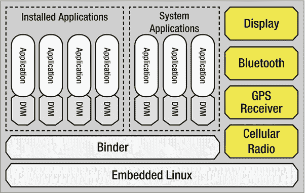
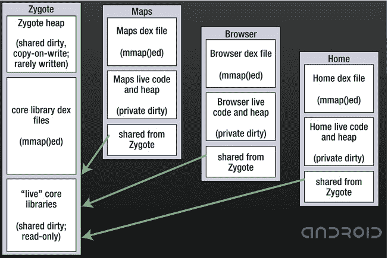
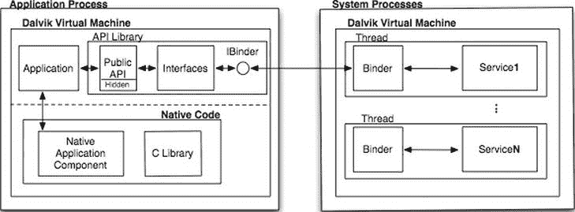
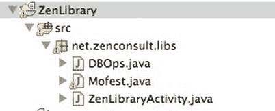
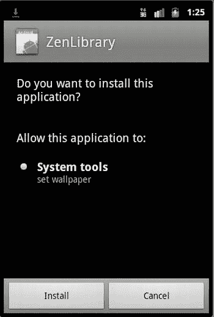

# 三、Android 安全架构

在第 2 章中，我们看了一个如何使用加密保护信息的简单例子。然而，这个例子没有利用 Android 内置的安全和权限架构。在这一章中，我们将看看 Android 在安全性方面能够为开发者和最终用户提供什么。我们还将了解一些可能发生在应用上的直接攻击，以及如何采取必要的保护措施来最大限度地减少私有数据的丢失。

Android 平台有几个控制系统和应用安全性的机制，它试图确保每个阶段的应用隔离和划分。Android 中的每个进程都有自己的特权集，如果没有最终用户提供的明确许可，任何其他应用都无法访问该应用或其数据。尽管 Android 向开发人员公开了大量的 API，但如果不要求最终用户授权访问，我们就无法使用所有这些 API。

重新审视系统架构

让我们从再次查看 Android 架构开始。我们在第 1 章中讨论了 Android 系统架构，在那里你会记得每个进程都运行在它自己的隔离环境中。除非明确允许，否则应用之间不可能进行交互。能够进行这种交互的机制之一是使用权限。再次在[第 1 章](01.html)中，我们看了一个简单的例子，我们需要设置 RECORD_AUDIO 权限，这样我们的应用就可以使用设备的麦克风。在这一章中，我们将更详细地了解权限架构(见[图 3-1](#Fig1) )。



[图 3-1](#_Fig1) 。Android 系统架构

[图 3-1](#Fig1) 描绘了一个比[第二章](02.html)中的 Android 架构更简单的版本；具体来说，该图更侧重于应用本身。

正如我们之前看到的，Android 应用将在 Dalvik 虚拟机(DVM)上执行。DVM 是*字节码*或者最基本的代码块将执行的地方。它类似于今天存在于个人计算机和服务器上的 Java 虚拟机(JVM)。如图[图 3-1](#Fig1) 所示，每个应用——甚至是内置系统应用——都将在自己的 Dalvik 虚拟机实例中执行。换句话说，它在一个有围墙的花园中运行，没有其他应用之间的外部交互，除非明确允许。由于启动单个虚拟机可能非常耗时，并且可能会增加应用启动和启动之间的延迟，因此 Android 依靠预加载机制来加速该过程。这个过程被称为合子，它有两个功能:首先作为新应用的发射台；第二，作为所有应用在其生命周期中都可以引用的实时核心库的存储库。

Zygote 进程 负责启动虚拟机实例，并预加载和预初始化虚拟机所需的任何核心库类。然后，它等待接收应用启动的信号。合子进程在引导时启动，工作方式类似于队列。任何 Android 设备都会运行一个主要的 Zygote 进程。当 Android Activity Manager 收到启动应用的命令时，它会调用作为 Zygote 进程一部分的虚拟机实例。一旦这个实例被用来启动应用，一个新的实例就会被派生出来取代它的位置。启动的下一个应用将使用这个新的 Zygote 过程，依此类推。

Zygote 进程 的存储库部分将始终使核心库集在应用的整个生命周期中可用。[图 3-2](#Fig2) 显示了多个应用如何利用主 Zygote 进程的核心库。



[图 3-2](#_Fig2) 。应用如何使用 Zygote 的核心库库

了解权限体系结构

正如我们在[第 1 章](01.html)中所讨论的，运行在 Android 操作系统上的应用都使用它们自己的一组用户和组标识符(分别是 UID 和 GID)。应用执行的受限方式使得一个应用无法从另一个应用读取或写入数据。为了促进应用之间的信息共享和进程间通信，Android 使用了一个权限系统。

默认情况下，某个应用无权执行任何类型的活动，这些活动可能会对设备上的其他应用造成损害或严重影响。它也不能与 Android 操作系统交互，也不能调用任何受保护的 API 来使用相机、GPS 或网络堆栈。最后，默认应用无法读取或写入任何终端用户的数据。Linux 内核处理这项任务。

为了让一个应用访问高特权 API 或者甚至获得对用户数据的访问，它必须获得最终用户的许可。作为开发人员，在向公众发布应用之前，您必须了解应用需要哪些权限。一旦你列出了所有你需要的权限，你需要把它们添加到你的 AndroidManifest.xml 文件中。然后，当首次安装应用时，设备会提示终端用户根据应用的要求授予或拒绝特定权限。因此，一个好的做法是以这样一种方式开发应用，如果用户不提供特定的权限，该方式将在模块化上失败。例如，假设您编写了一个使用 GPS 位置查询、访问用户数据和发送 SMS 消息的应用。最终用户授予您的应用三种权限中的两种，但不包括 SMS 消息发送。您应该能够编写这样的应用，即需要 SMS 发送的功能将会自行禁用(除非忽略此权限会破坏整个应用)。这样，最终用户仍然可以使用功能减少的应用。

在进一步探索权限之前，您需要熟悉 Android 软件开发和安全环境中使用的几个主题:*内容提供商* 和*意图* 。虽然您很可能已经听说过这些术语，但还是让我们在这里过一遍，以确保您的理解是完整的。

内容提供商

内容提供者与数据存储同义。它们充当应用可以读写的信息库。由于 Android 架构不允许公共存储区域，内容提供商是应用交换数据的唯一方式。作为开发人员，您可能对创建自己的内容提供者感兴趣，这样其他应用就可以访问您的数据。这就像在 android.content 包中子类化 ContentProvider 对象一样简单。我们将在本书的后续章节中更详细地介绍自定义 ContentProvider 对象的创建。

除了允许创建自己的内容提供商，Android 还提供了几个内容提供商，允许您访问设备上最常见的数据类型，包括图像、视频、音频文件和联系信息。Android provider 包， android.provider ，包含许多方便的类，允许你访问这些内容提供者；[表 3-1](#Tab1) 列出了这些。

[表 3-1。](#_Tab1) 内容提供商类

| 类别名 | 描述 |
| --- | --- |
| 闹钟 | 包含一个意向动作和附加动作，可以用来启动一个活动，在闹钟应用中设置一个新的闹钟。 |
| 浏览器 |  |
| 浏览器。书签栏 | 在书签 _URI 提供的混合书签和历史项目的列定义。 |
| 浏览器。搜索列 | 搜索历史表的列定义，可从搜索 _URI 获得。 |
| 呼叫日志 | 包含有关已拨和已接呼叫的信息。 |
| CallLog。通话次数 | 包含最近的通话。 |
| 接触冲突 | 联系人提供者和应用之间的合同。 |
| 接触冲突。聚合知觉〔t1〕 | 联系人聚合例外表的常数，该表包含覆盖自动聚合所用规则的聚合规则。 |
| 联系人联系人。常见数据种类 | 存储在 ContactsContract 中的通用数据类型定义的容器。数据表。 |
| 联系人联系人。CommonDataKinds.Email | 表示电子邮件地址的数据类型。 |
| 联系人联系人。CommonDataKinds.Event | 表示事件的数据类型。 |
| 联系人联系人。common data kinds . group membership | 小组成员。 |
| 接触冲突。CommonDataKinds.Im | 表示 IM 地址的数据类型。您可以使用为 ContactsContract 定义的所有列。数据，以及下面的别名。 |
| 联系人联系人。CommonDataKinds .昵称 | 表示联系人昵称的数据类型。 |
| 联系人联系人。CommonDataKinds.Note | 关于联系人的注释。 |
| 联系人联系人。common data kinds . Organization | 代表组织的数据类型。 |
| 联系人联系人。CommonDataKinds.Phone | 代表电话号码的数据类型。 |
| 联系人联系人。CommonDataKinds.Photo | 代表联系人照片的数据类型。 |
| 联系人联系人。公共数据类型.关系 | 表示关系的数据类型。 |
| 联系人联系人。CommonDataKinds.SipAddress | 代表联系人的 SIP 地址的数据类型。 |
| 联系人联系人。common data kinds . structured name | 表示联系人正确姓名的数据类型。 |
| 联系人联系人。common data kinds . structured postal | 表示邮政地址的数据类型。 |
| 联系人联系人。CommonDataKinds.Website | 表示与联系人相关的网站的数据类型。 |
| 接触冲突。联系人〔t1〕 | Contacts 表的常量，该表包含代表同一个人的每个原始 Contacts 集合的记录。 |
| 联系人联系人。联系人.聚集建议 | 包含所有聚合建议(其他联系人)的单个联系人聚合的*只读*子目录。 |
| 接触冲突。联系人。日期 | 单个联系人的子目录，包含所有组成的 raw contactContactsContract。数据行 |
| 联系人联系人。联系人.实体 | 联系人的子目录，包含其所有的contacts contact。原始联系人，以及联系人。数据行。 |
| 接触冲突。联系人。照片 | 单个联系人的*只读*子目录，包含该联系人的主要照片。 |
| 接触冲突。日期〔t1〕 | 包含与原始联系人关联的数据点的数据表的常数。 |
| 联系人联系人。目录 | 代表一组联系人。 |
| 联系人联系人。群组 | 组表的常数。 |
| 接触冲突。试〔t1〕 | 包含用于创建或管理涉及联系人的意图的助手类。 |
| 接触冲突。尝试插入〔t1〕 | 包含用于创建联系意图的字符串常量的便利类。 |
| 接触冲突。phone lookup〔t1〕 | 表示查找电话号码结果的表(例如，查找来电显示)。 |
| 接触冲突。快速联络〔t1〕 | 帮助器方法显示 QuickContact 对话框，允许用户在特定的联系人条目上旋转。 |
| 接触冲突。rawcontacts〔t1〕 | 原始联系人表的常量，该表包含每个同步帐户中每个人的一行联系人信息。 |
| 接触冲突。RawContacts .日期 | 单个原始联系人的子目录，包含其所有的contacts contact。数据行。 |
| 接触冲突。RawContacts.Entity | 单个原始联系人的子目录，包含其所有的contacts contact。数据行。 |
| 接触冲突。rawcontact sensity〔t1〕 | 原始 contacts 实体表的常量，可以认为是数据表的 raw_contacts 表的外部连接。 |
| 联系人联系人。设置 | 各种账户的联系人特定设置 |
| 接触冲突。状态更新〔t1〕 | 状态更新链接到一个 ContactsContract。Data row 并通过相应的源捕获用户的最新状态更新。 |
| 接触冲突。SyncState | 为同步适配器提供的用于存储专用同步状态数据的表。 |
| LiveFolders | 一个 LiveFolder 是一个特殊的文件夹，其内容由一个 ContentProvider 提供。 |
| 媒体商店 | 媒体提供程序包含内部和外部存储设备上所有可用媒体的元数据。 |
| 媒体商店。音频 | 所有音频内容的容器。 |
| 媒体商店。音频专辑 | 包含音频文件的艺术家。 |
| 媒体商店。音频艺术家 | 包含音频文件的艺术家。 |
| 媒体商店。音频.艺术家.专辑 | 每个艺术家的子目录，包含出现该艺术家歌曲的所有专辑。 |
| 媒体商店。音频类型 | 包含所有类型的音频文件。 |
| 媒体商店。音频.流派.成员 | 包含所有成员的每个流派的子目录。 |
| 媒体商店。音频媒体 |  |
| 媒体商店。音频.播放列表 | 包含音频文件的播放列表。 |
| 媒体商店。音频.播放列表.成员 | 包含所有成员的每个播放列表的子目录。 |
| 媒体商店。文件 | 媒体提供者表，包含媒体存储器中所有文件的索引，包括非媒体文件。 |
| 媒体商店。图像 | 包含所有可用图像的元数据。 |
| 媒体商店。图像.媒体 |  |
| 媒体商店。图像.缩略图 | 允许开发者查询获得两种缩略图: MINI_KIND (512 × 384 像素)和 MICRO_KIND (96 × 96 像素)。 |
| 媒体商店。视频 |  |
| 媒体商店。视频媒体 |  |
| 媒体商店。视频.缩略图 | 允许开发者查询获得两种缩略图: MINI_KIND (512 × 384 像素)和 MICRO_KIND (96 × 96 像素)。 |
| 搜索最近建议 | 提供对searchrecentsuggestionprovider的访问的工具类。 |
| 设置 | 包含全局系统级设备首选项。 |
| 设置。名称值表 | 名称/值设置表的公共库。 |
| 设置。安全 | 包含应用可以读取但不允许写入的系统偏好设置的安全系统设置。 |
| 设置。系统 | 包含各种系统偏好设置的系统设置。 |
| 同步状态合同 | 用于将数据与任何数据阵列帐户相关联的 ContentProvider 契约。 |
| 同步状态合同。常数〔t1〕 |  |
| SyncStateContract。助手 |  |
| 用户词典 | 为输入法提供用户定义的单词，以用于预测文本输入。 |
| 用户词典。单词 | 包含用户定义的单词。 |

访问内容提供商需要预先了解以下信息:

*   内容提供者对象(联系人、照片、视频等。)
*   此内容提供者所需的栏
*   获取此信息的查询

如前所述，内容提供商的行为方式类似于关系数据库，如 Oracle、Microsoft SQL Server 或 MySQL。当您第一次尝试查询时，这一点变得很明显。例如，您访问媒体商店。Images.Media 用于查询图像的内容提供商。假设我们想要访问存储在设备上的每个图像名称。我们首先需要创建一个内容提供商 URI 来访问设备上的外部商店:

```java
Uri images = MediaStore.Images.Media.EXTERNAL_CONTENT_URI;
```

接下来，我们需要为将要获取的数据创建一个 receiver 对象。简单地声明一个数组就可以做到这一点:

```java
String[] details = new String[] {MediaStore.MediaColumns.DISPLAY_NAME};
```

为了遍历得到的数据集，我们需要创建并使用一个 managedQuery ，然后使用得到的 Cursor 对象来遍历行和列:

```java
Cursor cur = managedQuery(details,details, null, null null);
```

然后我们可以使用我们创建的光标对象迭代结果。我们使用 cur.moveToFirst() 方法移动到第一行，然后读取图像名称，如下所示:

```java
String name = cur.getString(cur.getColumnIndex(MediaStore.MediaColumns.DISPLAY_NAME));
```

之后，我们通过调用 cur.moveToNext() 方法将光标移动到下一条记录。为了查询多条记录，这个过程可以包装在一个用于循环的中，或者包装在 do / while 块中。

请注意，有些内容提供者是受控制的，您的应用在试图访问它们之前需要请求特定的权限。

意图

意图是一个应用发送给另一个应用以控制任务或传输数据的消息类型。Intents 与三种特定类型的应用组件一起工作:活动、服务和广播接收器。让我们举一个简单的例子，您的应用需要启动 Android 设备浏览器并加载 URL 的内容。一个意图对象的一些主要组成部分包括意图动作和意图数据。对于我们的例子，我们希望我们的用户查看浏览器，所以我们将使用意图。ACTION_VIEW 常量来处理 URL 上的一些数据，T5【http://www.apress.com】T6。我们的意图对象将如下创建:

```java
Intent intent = new Intent(Intent.ACTION_VIEW, Uri.parse([http://www.apress.com);](http://www.apress.com);)
```

为了调用这一意图，我们将这段代码称为:

```java
startActivity(intent);
```

为了控制哪些应用可以接收 intent，可以在分派之前向 intent 添加权限。

检查权限

我们非常简要地介绍了内容提供者和意图，包括 Android 操作系统如何通过使用权限来控制对这些对象的访问。在第 1 章的[中，我们看到了应用如何向最终用户请求与系统交互的特定权限。让我们看看权限检查实际上是如何进行的，以及在哪里进行的。](01.html)

验证机制将处理 Android 操作系统中的权限检查。当您的应用进行任何 API 调用 时，权限验证机制将检查您的应用是否具有完成调用所需的权限。如果用户授予权限，则处理 API 调用；否则，抛出一个安全异常。

API 调用分三步处理。首先，调用 API 库。其次，该库将调用一个私有代理接口，该接口是 API 库本身的一部分。最后，这个私有代理接口将使用进程间通信来查询系统进程中运行的服务，以执行所需的 API 调用操作。这个过程如图 3-3 中的[所示。](#Fig3)



[图 3-3](#_Fig3) 。API 调用过程

在某些情况下，应用也可以使用本机代码来执行 API 调用。这些本机 API 调用也以类似的方式受到保护，因为除非通过 Java 包装器方法调用，否则不允许继续进行。换句话说，在调用本机 API 调用之前，它必须通过一个包装的 Java API 调用，然后该调用服从标准的权限验证机制。所有权限验证都由系统进程处理。此外，需要访问蓝牙、写 _ 外部 _ 存储和互联网权限的应用将被分配到一个 Linux 组，该组有权访问与这些权限相关的网络套接字和文件。这一小部分权限在 Linux 内核中进行验证。

使用自定义权限

Android 允许开发者创建和执行他们自己的权限。与系统权限一样，您需要在 AndroidManifest.xml 文件中声明特定的标记和属性。如果您编写的应用提供其他开发人员可以访问的特定类型的功能，您可以选择用自己的自定义权限来保护某些功能。

在您的应用的 AndroidManifest.xml 文件中，您必须如下定义您的权限:

```java
<manifest xmlns:android="http://schemas.android.com/apk/res/android"
    package="net.zenconsult.mobile.testapp" >
    <permission android:name="net.zenconsult.mobile.testapp.permission.PURGE_DATABASE"
        android:label="@string/label_purgeDatabase"
        android:description="@string/description_purgeDatabase"
        android:protectionLevel="dangerous" />
    ...
</manifest>
```

您在 android:name 属性中定义您的权限名称。需要 android:label 和 android:description 属性。它们是指向您在 AndroidManifest.xml 文件中定义的字符串的指针。这些字符串将标识权限是什么，并描述该权限对浏览设备上存在的权限列表的最终用户做了什么。您可能希望用一些描述性的内容来设置这些字符串，如下例所示:

```java
<string name=" label_purgeDatabase ">purge the application database </string>
<string name="permdesc_callPhone">Allows the application to purge the core database of the information store. Malicious applications may be able to wipe your entire application information store.</string>
```

android:protectionLevel 属性是必需的。它将权限分类为前面讨论的四个保护级别之一。

或者，您也可以添加一个 android:permissionGroup 属性，让 android 将您的权限与系统组或您自己定义的组一起分组。将您的自定义权限与现有的权限组进行分组是最好的方法，因为这样，您可以在浏览权限时向最终用户呈现更清晰的界面。例如，要将 purgeDatabase 权限添加到访问 SD 卡的组中，您需要将以下属性添加到 AndroidManifest.xml 文件中:

```java
android:permissionGroup=" android.permission-group.STORAGE"
```

需要注意的一点是，您的应用需要在任何其他依赖应用之前安装在设备上。通常是这种情况；但是在开发过程中，需要记住这一点，因为如果没有首先安装应用，您可能会遇到困难。

保护等级

创建您自己的权限时，您可以选择根据您希望操作系统提供的保护级别对权限进行分类。在前面的例子中，我们将清除数据库的权限的保护级别定义为“危险”。【危险】保护级别表示，通过授予该权限，最终用户将允许应用以可能对其产生不利影响的方式修改私人用户数据。

标有保护级别 【危险】或更高的权限将自动触发操作系统提示或通知最终用户。这种行为是为了让最终用户知道正在执行的应用有可能造成伤害。它还为用户提供了一个机会，通过授予或拒绝所请求的 API 调用来表明对应用的信任或不信任。权限保护级别的描述见[表 3-2](#Tab2) 。

[表 3-2。](#_Tab2) 权限保护等级

| 常数 | 价值 | 描述 |
| --- | --- | --- |
| 正常 | 0 | 一种低风险权限，允许应用访问独立的应用级功能，对其他应用、系统或用户的风险最小。系统会在安装时自动将这种权限授予发出请求的应用，而不需要用户的明确批准(尽管用户总是可以选择在安装前检查这些权限)。 |
| 危险 | 1 | 一种高风险权限，允许发出请求的应用以可能对用户产生负面影响的方式访问私有用户数据或控制设备。因为这种类型的权限会带来潜在的风险，所以系统可能不会自动将它授予请求应用。应用请求的任何危险许可都可以显示给用户，并在继续之前要求确认，或者可以采取一些其他方法，以便用户可以避免自动允许使用这些设施。 |
| 签名 | 2 | 只有当发出请求的应用使用与声明该权限的应用相同的证书签名时，系统才会授予该权限。如果证书匹配，系统会自动授予权限，而不通知用户或要求用户明确批准。 |
| 签字追踪系统 | 3 | 系统仅将此权限授予 Android 系统映像*或*中使用相同证书签名的包。请避免使用此选项，因为签名保护级别应该足以满足大多数需求，并且无论应用安装在哪里，它都可以正常工作。此权限用于某些特殊情况，其中多个供应商将应用构建到系统映像中，并且这些应用需要显式共享特定功能，因为它们是一起构建的。 |

样本代码 为自定义权限

本节中的示例代码提供了如何在 Android 应用中实现自定义权限的具体示例。项目包和类结构如图 3-4 所示。



[图 3-4](#_Fig4) 。示例的结构和类

Mofest.java文件包含一个名为 permissions 的嵌套类，该类保存将由调用应用调用的权限字符串常量。源代码在[清单 3-1](#list1) 中。

***[清单 3-1](#_list1) 。*** 最富阶层

**包**net . Zen consult . libs；

**公共类** Mofest {

**public** Mofest(){

}

**公共类**权限{

**public** permission(){

**最终**字符串清除 _ 数据库= 

”net . Zen consult . libs . mo fest . permission . purge _ DATABASE”；

}

}

}

此时，DBOps.java文件并不重要，因为它不包含任何代码。ZenLibraryActivity.java 的文件包含了我们应用的入口点。它的源代码在[清单 3-2](#list2) 中给出。

***[清单 3-2](#_list2) 。*T5【Zen library activity】类**

**包**net . Zen consult . libs；

**导入**Android . app . activity；

**导入**Android . OS . bundle；

**公共类** ZenLibraryActivity **扩展** Activity {

/**首次创建活动时调用。*/

@覆盖

**公见**oncreate(bundle savedinstancestate)>

超级。oncreate(savedinstancestat)：

set content view(r . layout .*main*)；

}

}

同样，这个类没有做什么值得注意的事情；它启动了这个应用的主要活动。真正的变化在于这个项目的 AndroidManifest.xml 文件，如[清单 3-3](#list3) 所示。这是定义和使用权限的地方。

***[清单 3-3](#_list3) 。*T5 项目的 AndroidManifest.xml 文件**

【1.0】编码=*【utf-8】*？>

<manifest xmlns:android="<i">【http://schemas . Android . com/apk/RES/Android】</manifest>

package =*" net . Zen consult . libs "*

android:版本代码=【1】

android:版本名称=*【1.0】*>

<uses-sdk android:minsdkversion="<i">【10】/></uses-sdk>

<**权限 Android:name = " net . Zen consult . libs . mofest . permission . purge _ DATABASE**"

**Android:protection level =**"**危险**

**Android:label =**"**@ string/label _ purge database**

**Android:description =**"**@ string/description _ purge database**

**Android:permission group =**"**Android . permission-group。成本 _ 金钱** "/ >

<**uses-permission Android:name =**"**net . Zen consult . libs . mofest . permission******

**。清除 _ 数据库**/>

<uses-permission android:name="<i">" Android . permission . set _ WALLPAPER "/></uses-permission>

<application android:icon="<i">" @ drawable/icon "Android:label =*" @ string/app _ name "*></application>

<activity android:name="<i">".禅藏馆活动"</activity>

**Android:permission =**"**net . Zen consult . libs . mofest . permission******

**。清除 _ 数据库**

Android:label =*" @ string/app _ name "*

>

<action android:name="<i">《Android . intent . action . main》/></action>

<category android:name="<i">" Android . intent . category . launcher "/></category>

如您所见，我们在这个应用中都声明并使用了 PURGE_DATABASE 权限。粗体显示的代码都与这个应用的自定义权限实现有关。

为了确保安装程序将提示权限请求屏幕，您必须将项目构建为。 apk 归档并签字。接下来，上传。apk 文件到网络服务器或复制到设备。单击此文件将启动安装过程；此时，设备将向最终用户显示权限请求屏幕。[图 3-5](#Fig5) 显示了这个屏幕的样子。



[图 3-5](#_Fig5) 。权限请求屏幕

摘要

在这一章中，我们讨论了 Android 权限，包括内置权限和自定义权限。我们还详细研究了意图、内容提供者以及如何检查权限。讨论的要点如下:

*   Android 有一套处理应用隔离和安全的核心机制。
*   每个应用都将在自己的隔离空间中运行，具有唯一的用户和组标识符。
*   应用不允许交换数据，除非它们明确请求用户的许可。
*   内容提供商存储并允许访问数据。它们的行为类似于数据库。
*   意图是在应用或系统进程之间发送的消息，用于调用或关闭另一个服务或应用。
*   使用权限来控制对特定 API 的访问。权限分为四个类别，类别 1、2 和 3 权限将始终通知或提示最终用户。由于这些权限可能会对用户数据和体验产生负面影响，因此将它们交给用户进行最终确认。

可以创建自定义权限来保护您的单个应用。希望使用您的应用的应用需要通过使用 AndroidManifest.xml 文件中的 < uses-permission > 标签来明确请求您的许可。