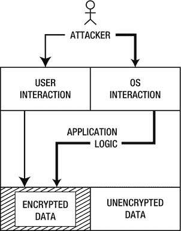
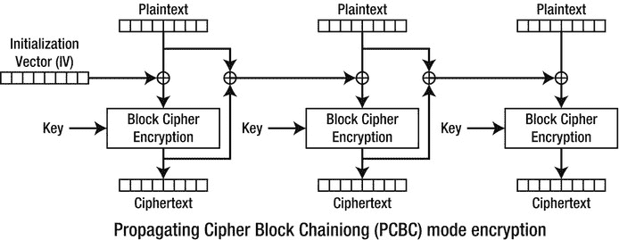
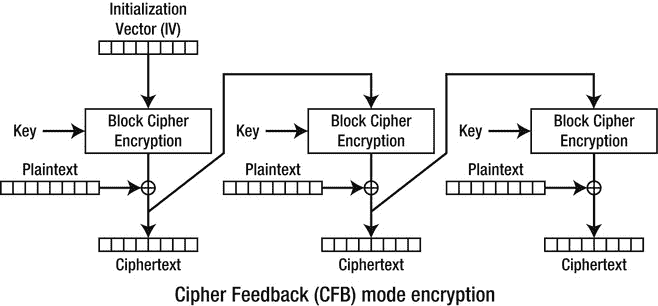
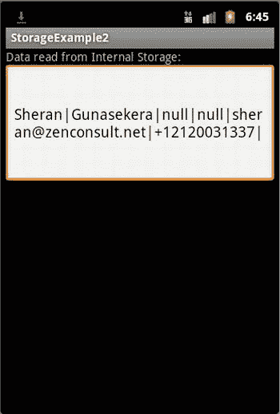
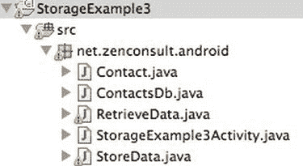
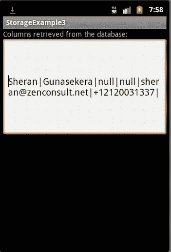
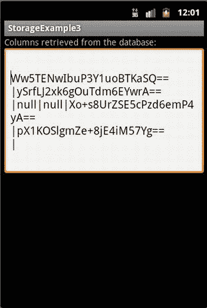

第章 5

数据存储和密码学

我们在第 4 章中非常简要地提到了密码学。本章将更多地关注使用加密技术来混淆和保护将要存储或传输的用户数据的重要性。首先，我们将介绍密码学的基础知识，以及它们在应用程序开发中的应用。接下来，我们将看看 Android 平台上存储数据的各种机制。在这个过程中，我将举例说明如何从不同的机制中存储和检索数据，并概述每个存储最适合执行的功能。

要记住的非常重要的一点是，除非你熟悉加密主题，否则你应该*永远不要*试图编写你自己的加密例程。我见过许多开发人员试图这样做，但最终都在移动设备和 web 应用程序中得到易受攻击的应用程序。密码学本身是一门庞大的学科；而且，在我看来，我认为最好是留给那些为这个主题奉献一生的人。作为一名应用程序开发人员，您只会对密码学中特定的主题子集感兴趣。

我不会涉及密码学的历史。您只需要记住一件事:让您的敏感用户数据对未经授权的用户不可读。如果攻击者使用间接或直接攻击危及你的应用，那么你的加密附加层(见[图 5-1](#Fig00051) )不会让他轻易窃取敏感的用户数据。相反，他有一个额外的层，他必须攻击。这一原则类似于美国国家安全局制定的深度防御的信息保证原则。



[图 5-1](#_Fig00051) 纵深防御原则的一个例子

公钥基础设施

既然我们是在密码学的主题上，学习一点关于公钥基础设施(PKI)的知识是值得的。PKI 基于基于可信第三方的身份和信任验证原则。让我们来看一个说明相关原理的场景。请记住，这个例子暂时与应用程序开发*无关。我们很快就会深入探讨这个问题。*

Krabs 先生拥有 Krusty Krab，这是该市最受欢迎的快餐店之一。他把它受欢迎的原因归功于他著名的大钳蟹肉饼(一种非常湿润、美味的汉堡)。除了克莱伯先生，没有人知道大钳蟹馅饼的超级秘方。鉴于他的受欢迎程度，他最近开始向他的餐馆出售特许经营权。由于他的特许经营下的大多数新分店在地理上相距遥远，克莱伯先生决定通过快递将他的秘方发送给店主。这种方法的唯一问题是，克莱伯先生的竞争对手谢尔登·詹姆斯·普兰克以前曾试图窃取他的秘方，而且很可能还会再次尝试。

我喜欢食物，尤其是汉堡，所以我决定在我的城市开一家 Krusty Krab 连锁店。我联系了克莱伯先生。除了相关的文书工作，他还附上了一份文件，告诉我应该如何接收和保护他的大钳蟹馅饼秘方。我将省去无数页的细节和法律术语，而只列出最突出的要点。指令 声明我要做以下事情:

1.  通过 IV 部门在最近的警察局注册 KK 项目。
2.  从警察局第四部门领取一把配有一把钥匙的挂锁。
3.  把挂锁交给我的警察部门。
4.  用我的生命守护钥匙。
5.  接收并打开将通过快递寄给我的钢盒。

果然，在我完成这些步骤后，一个包裹邮寄到了。奇怪的是，外部的纸板包装似乎被篡改了，但挂锁或里面的坚固的钢盒子却没有被篡改。钥匙很容易打开挂锁！我有大钳蟹馅饼的秘方。后来，我听克莱伯先生说，普兰克曾试图劫持并打开钢盒，但没有成功。这解释了我注意到的外包装篡改。

为了避免我的愚蠢，我将把这个故事中的角色和对象与 PKI 相关的元素联系起来(见[表 5-1](#Tab00051) )。

[表 5-1](#_Tab00051) 。故事和 PKI 的关系

| 故事元素 | PKI 元素 |
| --- | --- |
| 克莱伯先生 | 消息发送者 |
| 我 | 消息接收者 |
| 浮游生物 | 袭击者 |
| 秘方 | 消息/敏感数据 |
| 钢盒子 | 加密的消息 |
| 我的挂锁 | 我的公钥 |
| 我挂锁的钥匙 | 我的私人钥匙 |
| 警察局 | 认证机构(CA) |
| KK 计划 | CA 域 |
| 第四部 | 注册机构(RA) |

当您查看[表 5-1](#Tab00051) 时，很明显 PKI 的设置和运行非常复杂。然而，所有的元素都是必不可少的，并且服务于一个非常特定的目的，以确保消息*和*密钥以一种安全可信的方式交换。我们来分析一下每一个元素。

*   Krabs 先生和我:他们分别是发送者和接收者。我们需要交换敏感数据(秘方),并遵循 PKI 策略和程序来这样做。
*   *浮游生物:*他就是攻击者。他想要访问敏感数据，并决定在传输过程中攻击这些数据。
*   *秘方:*这是敏感数据。我们想交换这份食谱，并且保密。
*   *钢盒:*这是加密信息。发送方将加密或锁定它，这样只有密钥持有者才能打开它。钥匙持有者(我)是接收者。
*   我的挂锁:这是我的公钥。当你思考这个故事时，你可能会想一把挂锁怎么也能是一把钥匙，但是从隐喻的角度来看。我的挂锁是任何人都可以用来锁定或加密信息的东西。我不怕给任何人我的挂锁或公钥，因为只有我能打开消息。我可以有无限数量的挂锁给任何想安全地给我发信息的人。
*   我挂锁的钥匙:这是我的私人钥匙。它是私有的，因为没有其他人有副本。只有我能用这把钥匙打开我的挂锁。我必须时刻保护好这把钥匙，因为如果攻击者获得了这把钥匙，那么他就可以打开所有用我的挂锁锁住的钢盒，从而获得敏感数据。
*   *警察局:*这是认证机构(CA)。作为 PKI 的基本组件之一，CA 相当于可信的第三方。Krabs 先生和我都信任我们当地的警察部门，因此他们是 CA 的优秀候选人。我们依靠他们来维护法律和诚信行事。因此，即使某个我不认识或从未见过面的人想要给我发送安全消息，我也不必担心是否信任这个人。我只需要相信告诉我这个人就是他所说的那个人的权威。
*   对于我们的故事来说，这是一个 CA 域。例如，警察局或 CA 可以在许多不同的场景中充当可信的第三方。CA 域将确保所有事务发生在相同的上下文中。因此，KK 项目的存在只是为了处理克莱伯先生的特许经营权。
*   第四部门:这是我们的注册机构(RA)。如果一个人想要发送或接收安全消息，他首先必须向 RA 注册。RA 将要求您用官方颁发的文件证明您的身份，如国民身份证或护照。RA 将确定该文件的真实性，并可能使用其他方法来确定该人是否是他所说的那个人。在令人满意地满足注册局的注册要求后，该人将被注册并获得一把公共和私人钥匙。

你可能会有这样一个问题:两个不同城市，甚至两个不同国家的两个警察部门是如何相互信任的？我们将假设所有警察部门通过内部机制建立信任，在一定程度上，许多部门可以作为一个实体。

总而言之，我和 Krabs 先生将使用可信任的第三方来确保我们避免向冒名顶替者发送或接收消息。那么攻击这个系统呢？攻击该系统有两种主要方式: *1)* 攻击者可以试图欺骗注册过程并劫持合法用户的身份，以及 *2)* 攻击者可以试图对传输中的加密消息进行物理攻击。

这种基础设施的好处是，如果浮游生物试图冒充克莱伯先生或我，他必须通过欺骗 CA 的注册过程来这样做。在许多情况下，由于身份证明阶段，这很难完成。为了减轻在传输过程中对消息的物理攻击，系统采用了坚固的、牢不可破的锁。这些锁是使用的加密算法。

密码学中使用的术语

在这一章中，我要感谢 Bruce Schneier 和他的书*应用密码学*(约翰·威利&的儿子们，1996)。我在很多场合都提到过它，包括在写这本书的时候。它为密码学提供了很好的基础，并且非常全面。如果你想对密码学有更深入的了解，那么我强烈推荐这本书。

学习正确的密码学术语至关重要。没有学习正确的术语，你仍然可以掌握密码学，但是速度可能会慢一些。表 5-2 列出了在编写和保护你自己的应用程序时用到的密码学术语。

[表 5-2](#_Tab00052) 。密码学中使用的术语

| 学期 | 描述 |
| --- | --- |
| 纯文本/纯文本 | 这是你的信息。它是您编写的文本文件、您存储的用户数据，或者您希望防止他人窥探的原始消息。一般每个人都可读。 |
| 加密 | 该过程用于获取明文并使其不可读或模糊。 |
| 密文 | 这就是加密明文的结果。这是加密信息。 |
| [通信]解密 | 这是加密的逆过程。这是一个将混乱的密文变回可读的明文的过程。 |
| 密码算法/算法/密码 | 这是用于加密和解密明文的特定类型的数学函数。 |
| 钥匙 | 该值将唯一地影响正在使用的加密或解密算法。可以有单独的密钥用于加密或解密。最常用的算法依赖于一个密钥来工作。 |
| 共享密钥/对称密钥 | 这是一个既能加密又能解密数据的密钥。发送方和接收方都有这个密钥；因此，它被定义为*共享密钥*。 |
| 非对称密钥 | 这是指一个密钥用于加密，另一个密钥用于解密。您可以使用这种类型的密钥为特定的人加密数据。你所要做的就是用这个人的公钥加密数据，然后他可以用他的私钥解密。因此，有一个密钥用于加密(公钥)，另一个用于解密(私钥)。 |
| 密码分析学 | 这是指在没有密钥或算法的先验知识的情况下破解密文的研究。 |

移动应用中的加密技术

为一般的、每天的应用程序实现 PKI 似乎有些矫枉过正，尤其是当您考虑到所涉及的工作量和复杂性时。当您考虑移动应用程序时，由于可用资源有限，您将面临更艰巨的任务。然而，这是可能的，2008 年在新加坡举行的第 11 届 IEEE 新加坡国际会议上发表了一篇详细介绍移动环境中轻量级 PKI(LPKI)理论的论文([【http://ieeexplore.ieee.org/xpl/freeabs_all.jsp?arnumber = 4737164】](http://ieeexplore.ieee.org/xpl/freeabs_all.jsp?arnumber))。

但是我们不会在任何应用程序中使用 PKI 或 LPKI。相反，我们将试图找到一个平衡点，并以一种适合移动计算环境的有限资源的方式使用来自密码学的技术。因此，让我们检查一下我们希望密码学如何适应我们的应用程序。正如我在前面章节中提到的，保护你的用户数据是至关重要的。如果你回头看一下第 2 章中关于联系对象加密的例子，你能确定我们使用的是什么类型的密钥吗？我们使用了*高级加密标准* (AES)算法。这是一个对称密钥算法，因为加密和解密只有一个密钥。如果你仔细观察，你会开始质疑我使用一个随机的 256 位密钥的合理性。你可能会问，如果我们一开始只是用一个随机密钥来加密数据，我们如何解密数据？我希望你在第二章的[结尾的练习中回答了这个问题。如果您还没有，那么让我们现在就着手解决这个问题。](02.html)

对称密钥算法

AES 是对称密钥算法 或分组密码。正如我们所见，这意味着在加密和解密中只使用一个密钥。算法用于加密或解密数据。如何处理这些数据导致了对称算法的进一步划分。例如，我们可以一次处理固定数量的数据位，称为数据块；或者我们可以一次处理一位数据，称为流。这种区别给了我们分组密码和流密码。通常，AES 被认为是对 128 位长的数据组进行操作的分组密码。128 位长的明文块将具有相同长度的密文块。AES 允许 0 到 256 位的密钥大小。在我们的例子中，我们使用了最大密钥大小。对于这本书，我将使用 AES 分组密码。我已经在[表 5-3](#Tab00053) 中包含了一些 Android 自带的其他著名的分组密码。为其他分组密码生成密钥的原理与[清单 5-1](#list1) 中的一样，在下一节中显示。只需将 AES 的key generator . getinstance()方法中的算法名称替换为表中列出的一种分组密码。

[表 5-3](#_Tab00053) 。可以在 Android 2.3.3 中使用的分组密码

| 分组密码 | 块大小 | 密钥大小(位) |
| --- | --- | --- |
| 俄歇电子能谱 | 128 位 | 0–256 |
| 山茶 | 128 位 | 128, 192, 256 |
| 河豚 | 64 位 | 0–448 |
| 双鱼 | 128 位 | 128, 192, 256 |

密钥生成

密钥是加密技术不可或缺的一部分。大多数现代加密算法都需要密钥才能正常工作。在我们第 2 章的例子中，我使用了一个伪随机数发生器(PRNG)来生成我们的加密密钥(见[清单 5-1](#list1) )。我使用的一个好的经验法则是总是选择算法的最大密钥大小。如果我在测试时发现我的应用程序严重滞后，那么我会将密钥减小到下一个更小的值。在密码学中，你总是希望为你的算法使用尽可能大的密钥长度。这样做的原因是为了更难对您的密钥进行暴力攻击。

为了说明，让我们假设您选择了 16 位的密钥大小。这意味着攻击者必须尝试 1 和 0 的组合总共 2 <sup>16</sup> 或 65，536 次。然而，如果你选择了完整的 256 位密钥大小，那么攻击者必须进行 2 次 <sup>256</sup> 或 11.6 次 <sup>77</sup> (1.16e77)尝试来破解你的密钥，这将花费他几年的时间。当然，这个持续时间可以随着计算能力的进步而减少，但这在密码分析的所有领域都是如此。因此，大的密钥大小和强大的算法确保了攻击者不能轻易破坏您的密文。

在大多数情况下，加密数据对追求唾手可得的果实的攻击者起着威慑作用。他们不会花时间去破解你的密码，而是会转向下一个容易被攻击的应用程序 — ，当然，前提是你的数据的价值不会超过攻击者愿意为破解你的密码而投入的时间、精力和资源的价值。

**注意**当攻击者通过基于不同字符集(如 A-Z、A-Z、0-9 和特殊字符)的组合连续创建和尝试密码，不断尝试猜测正确的密码时，就会发生对密钥或密码的暴力攻击。最终，在尝试所有可能的组合的过程中，她很可能猜出正确的密码。

我知道一些开发人员仍然认为加密密钥等同于密码。不是的。不完全是。在我们的密钥生成示例中，我们使用一个随机的 256 位密钥。一般来说，这些加密程序都发生在幕后；而且虽然用户密码可以变成密钥，但我不建议这么做。避免这样做的一个原因是，用户密码几乎总是不超过 10 到 12 个字节，这甚至还不到密钥长度的一半(256 / 8 = 32 个字节)。根据我们对暴力攻击的了解，最好选择允许的最大密钥长度。

***[清单 5-1。](#_list1)*** 一种密钥生成算法

```java
**public static****byte[]** generateKey(byte[] randomNumberSeed) {
                SecretKey sKey  =  null;
                **try** {
                     KeyGenerator keyGen  =  KeyGenerator.*getInstance*("AES");
                     SecureRandom random  =  SecureRandom.*getInstance*("SHA1PRNG");
                     random.setSeed(randomNumberSeed);
                     keyGen.init(256,random);
                     sKey  =  keyGen.generateKey();
                } **catch** (NoSuchAlgorithmException e) {
                     Log.*e*(*TAG*,"No such algorithm exception");
                }
                **return** sKey.getEncoded();
        }
```

数据填充

到目前为止，我已经讨论了处理固定数据块大小的对称算法。但是，当您的数据小于算法要求的输入块大小时会出现什么情况呢？考虑图 5-2 中[的情况。这里，我们有两个数据块，但其中只有一个包含完整的块大小(为了简化，我们将使用 8 字节的块大小)；第二个仅包含 4 位。如果我们用 AES 算法运行这最后一块，它会失败。为了应对这种情况，有几种不同的填充选项可用。](#Fig00052)


[图 5-2](#_Fig00052) 两个数据块没有正确对齐

当你遇到图 5-2 中的情况时，你的第一个想法可能是用零填充剩余的 4 位。这是可能的，被称为*零填充*。存在其他不同的填充选项。在这一点上，我不会说得太详细，但是你需要记住，你不能简单地将明文通过分组密码。分组密码总是以固定的输入块大小工作，并且总是具有固定的输出块大小。[图 5-3](#Fig00053) 和 [5-4](#Fig00054) 显示了零填充和 PKCS5/7 填充的例子。


[图 5-3](#_Fig00053) 。两个带零填充的数据块。填充以粗体显示。


[图 5-4](#_Fig00054) 。具有 PKCS5/7 填充的两个数据块。填充以粗体显示。

**注意** *PKCS5/7 填充*是取需要填充的剩余位的长度，并将其用作填充位。例如，如果还剩下 10 位来将块填充到正确的大小，则填充位为 0A(十六进制为 10)。类似地，如果有 28 位要填充，那么填充位将是 1C。

我在[第 2 章](02.html)中的例子没有指定任何填充。默认情况下，Android 将使用 PKCS5 填充。

分组密码的操作模式

分组密码有各种加密和解密机制。最简单的加密形式是将一个明文块加密成一个密文块。然后对下一个明文块进行加密，得到下一个密文块，依此类推。这被称为电子代码簿(ECB)模式。 [图 5-5](#Fig00055) 显示了 ECB 加密的可视化表示。


[图 5-5](#_Fig00055) 。ECB 加密(维基百科提供)

尽管简单，ECB 模式并不能防止模式识别密码分析。这意味着如果消息文本包含两个相同的明文块，那么也将有两个对应的密文块。进行密码分析时，使用的技术之一是识别和定位密文中的模式。在模式被识别之后，可以更容易地推断出使用了 ECB 加密，因此，攻击者只需要专注于解密密文的特定块。他不需要解密整个消息。

为了防止这种情况，分组密码有几种其他的操作模式: *1)* 密码分组链接(CBC)*2)*传播密码分组链接(PCBC)*3)*密码反馈(CFB)和 *4)* 输出反馈(OFB)。在这一节中，我只介绍加密例程(只需颠倒加密模式中的步骤就可以得到解密例程):

*   *CBC* *模式* *:* 密码块链接模式(见[图 5-6](#Fig00056) )使用一个称为*初始化向量* (IV)的附加值，该值用于对第一个明文块执行 XOR 运算。在此之后，每个结果密文块与下一个明文块进行异或运算，依此类推。这种类型的模式确保每个结果密文块依赖于前一个明文块。【T13

    

    [图 5-6](#_Fig00056) CBC 加密（维基百科提供)

*   *PCBC 模式* *:* 传播密码块链接模式(见[图 5-7](#Fig00057) )与 CBC 模式非常相似。不同之处在于，PCBC 模式不是仅对第一块的 IV 和后续块的密文进行异或运算，而是对第一块的 IV *和*密文进行异或运算，然后对附加块的明文*和*密文进行异或运算。这种模式的设计使得密文中的微小变化会在整个加密或解密过程中传播。【T13

    

    [图 5-7](#_Fig00057) PCBC 加密（维基百科提供)

*   **模式* *:* 密码反馈模式(参见[图 5-8](#Fig00058) )在 CBC 模式的 IV 和明文之间切换位置。因此，不是将明文异或并加密，随后将密文与明文异或；CFB 模式将首先加密 IV，然后将其与明文进行 XOR 运算以获得密文。然后，对于后续的块，密文再次被加密，并与明文进行异或运算，以给出下一个密文块。

    

    [图 5-8](#_Fig00058)T19 .中心纤维体加密（维基百科提供

    )*
**   **模式* *:* 输出反馈模式(见[图 5-9](#Fig00059) )与 CFB 模式非常相似。不同之处在于，它不是使用 XORd IV 和密文，而是在 xor 运算发生之前使用。因此，对于第一个块，IV 用密钥加密，并用作下一个块的输入。然后，来自第一块的密文与第一块明文进行异或运算。在 xor 运算之前，使用前一个块的密文进行后续加密。【T10

    

    [图 5-9](#_Fig00059)OFB加密（维基百科提供)** 

 ****注** XOR (用符号^表示)是逻辑运算*异或*(又称*异或*)的标准缩写。其真值表如下:

0 ^ 0 = 0

0 ^ 1 = 1

1 ^ 0 = 1

1 ^ 1 = 0

如果您查看我的原始示例，您会发现我没有使用特定的加密模式。默认情况下，Android 将使用 ECB 模式来执行加密或解密。作为开发人员，您可以选择更复杂的加密模式，如 CBC 或 CFB。

现在，您对 AES 对称算法的内部工作原理有了更多的了解，我将向您展示如何在加密时更改填充和操作模式。回到我们最初的例子，将代码改为与清单 5-2 中的[相同。请注意粗体代码行。我们只做了几处改动。首先我们把 AES 改成了 AES/CBC/pkcs 5 padding；其次，我们将初始化向量(IV)添加到我们的 init() 方法中。正如我之前提到的，当您只指定 AES 编码时，Android 将使用的默认模式是 AES/ECB/PKCS5Padding。您可以通过运行程序两次来验证这一点，一次使用 AES，一次使用 AES/ECB/PKC5Padding。两者都会给你相同的密文。](#list2)

***[清单 5-2。](#_list2)*** 用 CBC 加密模式重做加密程序

```java
private static byte[] encrypt(byte[] key, byte[] data, byte[] iv){
                SecretKeySpec sKeySpec  =  new SecretKeySpec(key,"AES");
                Cipher cipher;
                byte[] ciphertext  =  null;
                try {
                     **cipher**  =  **Cipher.getInstance("AES/CBC/PKCS5Padding");**
                     **IvParameterSpec ivspec**  =  **new IvParameterSpec(iv);**
                     cipher.init(Cipher.ENCRYPT_MODE, sKeySpec, ivspec);
                     ciphertext  =  cipher.doFinal(data);
                } catch (NoSuchAlgorithmException e) {
                     Log.e(TAG,"NoSuchAlgorithmException");
                } catch (NoSuchPaddingException e) {
                     Log.e(TAG,"NoSuchPaddingException");
                } catch (IllegalBlockSizeException e) {
                     Log.e(TAG,"IllegalBlockSizeException");
                } catch (BadPaddingException e) {
                     Log.e(TAG,"BadPaddingException");
                } catch (InvalidKeyException e) {
                     Log.e(TAG,"InvalidKeyException");
             }
             return ciphertext;

        }

```

假设您选择了自己选择的密钥。你可以编写一个类似于[清单 5-3](#list3) 所示的程序，而不是使用随机数生成器来生成你的密钥。在这个清单中， stringKey 是用来加密数据的密钥。

***[清单 5-3。](#_list3)*** 修改了固定键值的密钥生成示例

```java
**public static byte**[] generateKey(String stringKey) {
                **try** {
                     SecretKeySpec sks  =  **new**
                     SecretKeySpec(stringKey.getBytes(),"AES");

                } **catch** (NoSuchAlgorithmException e) {
                     Log.e(TAG,"No such algorithm exception");
                }
                **return** sks.getEncoded();
  }

```**  **Android 中的数据存储

我想在一章中涵盖密码学和数据存储的主题，因为我相信你可以将两者联系起来，提供一个更安全的应用程序。Android 在独立的安全环境中运行应用程序。这意味着每个应用程序将使用自己的 UID 和 GID 运行；当一个应用程序写入数据时，其他应用程序将无法读取该数据。如果您想要在应用程序之间共享数据，那么您将需要通过使用内容提供者来显式地启用这种共享。我可以看到你的问题正在形成:“如果 Android 已经保护了数据，为什么还要涵盖所有的加密主题？”正如我在本章开始时提到的，我们可以在 Android 安全层上建立另一层安全，只是为了那些不可预见的漏洞、病毒或木马抬头的时候。

Android 允许你使用五种不同的选项来存储数据(参见[表 5-4](#Tab00054) )。显然，您需要根据您的需求决定在哪里存储您的特定于应用程序的数据。

[表 5-4。](#_Tab00054)的机制将的数据存储在 Android 上

| 存储方法 | 描述 | 数据保密 |
| --- | --- | --- |
| 共享偏好设置 | 允许您存储原始数据类型(例如， int 、 Boolean 、 float 、 long 和 String )，这些数据类型将在整个设备会话中保持不变。即使您的应用程序没有运行，您的数据也将持续存在，直到设备重新启动。 | 可以设置四种隐私模式: MODE_PRIVATE 、 MODE_WORLD_READABLE 、 MODE_WORLD_WRITABLE 和 MODE_MULTI_PROCESS 。默认模式是 MODE_PRIVATE |
| 内部存储器 | 允许您将数据存储在设备的内部存储器中。通常，其他应用程序甚至最终用户都无法访问这些数据。这是一个私人数据存储区。存储在此处的数据即使在设备重新启动后仍将存在。当最终用户删除你的应用时，Android 也会删除你的数据。 | 可以设置三种隐私模式: MODE_PRIVATE 、 MODE_WORLD_READABLE 和 MODE_WORLD_WRITABLE 。默认模式是模式 _ 私有。 |
| 外部存储器 | 存储在这里的数据是全球可读的。设备用户和其他应用程序可以读取、修改和删除这些数据。外部存储器与 SD 卡或设备内部存储器(不可移动)相关联。 | 默认情况下，数据是全局可读的。 |
| SQLite 数据库 | 如果您需要为您的应用程序创建一个数据库来利用 SQLite 的搜索和数据管理功能，请使用 SQLite 数据库存储机制。 | 应用程序中的任何类都可以访问您创建的数据库。外部应用程序无法访问该数据库。 |
| 网络连接 | 您可以通过 web 服务远程存储和检索数据。你可以在[第 6 章](06.html)中读到更多这方面的内容。 | 基于您的 web 服务设置。 |

选择哪种机制来存储数据在很大程度上取决于您的需求。在第 2 章中查看我们的 Proxim 应用程序，我们也可以考虑将我们的数据存储在 SQLite 数据库中，因为这将使我们免于不必要地决定实施数据结构。让我们看几个例子，看看如何使用这些机制来存储和检索数据。

共享偏好设置

共享偏好设置对于储存应用程序设置非常有用，这些设置在设备重新启动之前一直有效。顾名思义，存储机制最适合保存用户对应用程序的偏好。假设我们必须存储关于电子邮件服务器的信息，我们的应用程序需要从该服务器检索数据。我们需要存储邮件服务器的主机名、端口以及邮件服务器是否使用 SSL。我已经给出了存储(见清单 5-4 )和检索(见清单 5-5[)数据到共享首选项的基本代码。 StorageExample1 类将所有这些放在一起(参见](#list5)[清单 5-6](#list6) )，伴随的输出显示在[图 5-10](#Fig000510) 中。

***[清单 5-4。](#_list4)*** 将 数据存储到 SharedPreferences 的代码

```java
package net.zenconsult.android;

import java.util.Hashtable;

import android.content.Context;
import android.content.SharedPreferences;
import android.content.SharedPreferences.Editor;
import android.preference.PreferenceManager;

public class StoreData {
        public static boolean storeData(Hashtable data, Context ctx) {
                SharedPreferences prefs  =  PreferenceManager
                     .getDefaultSharedPreferences(ctx);
                String hostname  =  (String) data.get("hostname");
                int port  =  (Integer) data.get("port");
                boolean useSSL  =  (Boolean) data.get("ssl");
                Editor ed  =  prefs.edit();
                ed.putString("hostname", hostname);
                ed.putInt("port", port);
                ed.putBoolean("ssl", useSSL);
                return ed.commit();
        }
}
```

***[清单 5-5。](#_list5)*** 从 SharedPreferences 中检索 数据的代码

```java
package net.zenconsult.android;

import java.util.Hashtable;

import android.content.Context;
import android.content.SharedPreferences;
import android.preference.PreferenceManager;

public class RetrieveData {
        public static Hashtable get(Context ctx) {
                String hostname  =  "hostname";
                String port  =  "port";
                String ssl  =  "ssl";

                Hashtable data  =  new Hashtable();
                SharedPreferences prefs  =  PreferenceManager
                     .getDefaultSharedPreferences(ctx);
                data.put(hostname, prefs.getString(hostname, null));
                data.put(port, prefs.getInt(port, 0));
                data.put(ssl, prefs.getBoolean(ssl, true));
                return data;
        }
}
```

***[清单 5-6。](#_list6)*** StorageExample1，主类

```java
package net.zenconsult.android;

import java.util.Hashtable;

import android.app.Activity;
import android.content.Context;
import android.os.Bundle;
import android.util.Log;
import android.widget.EditText;

public class StorageExample1Activity extends Activity {
        /** Called when the activity is first created. */
        @Override
        public void onCreate(Bundle savedInstanceState) {
                super.onCreate(savedInstanceState);
                setContentView(R.layout.main);
                Context cntxt  =  getApplicationContext();

                Hashtable data  =  new Hashtable();
                data.put("hostname", "smtp.gmail.com");
                data.put("port", 587);
                data.put("ssl", true);

                if (StoreData.storeData(data, cntxt))
                     Log.i("SE", "Successfully wrote data");
                else
                     Log.e("SE", "Failed to write data to Shared Prefs");

                EditText ed  =  (EditText) findViewById(R.id.editText1);
                ed.setText(RetrieveData.get(cntxt).toString());
        }

```

}


[图 5-10](#_Fig000510)T3。StorageExample1 应用程序的输出

内存储器

正如我们所见， SharedPreferences 非常适合键值对数据类型。这有点类似于一个散列表或者甚至是标准的 Java 属性对象。 SharedPreferences 机制的限制是您只能存储原始数据类型。你将无法存储更复杂的类型，如向量或哈希表。如果你想存储原始类型之外的数据，你可以看看内存。内部存储机制将允许您通过输出流写入数据。因此，任何可以序列化为字节字符串的对象都可以写入内部存储。让我们首先创建我们的 StorageExample2 类(参见[清单 5-7](#list7) )。和以前一样，我在单独的清单中展示了存储和检索模块(分别参见清单 5-8 和清单 5-9 )。[图 5-11](#Fig000511) 显示了输出。

***[清单 5-7。](#_list7)*** StorageExample2，主类

```java
package net.zenconsult.android;

import android.app.Activity;
import android.content.Context;
import android.os.Bundle;
import android.widget.EditText;

public class StorageExample2Activity extends Activity {
        /** Called when the activity is first created. */
        @Override
        public void onCreate(Bundle savedInstanceState) {
                super.onCreate(savedInstanceState);
                setContentView(R.layout.main);

                Context ctx  =  getApplicationContext();

                // Store data
                Contact contact  =  new Contact();
                contact.setFirstName("Sheran");
                contact.setLastName("Gunasekera");
                contact.setEmail("sheran@zenconsult.net");
                contact.setPhone("  +  12120031337");

                StoreData.storeData(contact.getBytes(), ctx);

                // Retrieve data

                EditText ed  =  (EditText) findViewById(R.id.editText1);
                ed.setText(new String(RetrieveData.get(ctx)));

        }
}
```

***[清单 5-8。](#_list8)*** 使用 StoreData.java将数据存储在内部存储器中

```java
package net.zenconsult.android;

import java.io.FileNotFoundException;
import java.io.FileOutputStream;
import java.io.IOException;

import android.content.Context;
import android.util.Log;

public class StoreData {
        public static final String file  =  "contacts";

        public static void storeData(byte[] data, Context ctx) {

                try {
                     FileOutputStream fos  =  ctx.openFileOutput(file, ctx.MODE_PRIVATE);
                     fos.write(data);
                     fos.close();
                } catch (FileNotFoundException e) {
                     Log.e("SE2", "Exception: "  +  e.getMessage());
                } catch (IOException e) {
                     Log.e("SE2", "Exception: "  +  e.getMessage());
                }
        }
}
```

***[清单 5-9。](#_list9)*** 使用 RetrieveData.java从内存中检索数据

```java
package net.zenconsult.android;

import java.io.ByteArrayOutputStream;
import java.io.FileInputStream;
import java.io.FileNotFoundException;
import java.io.IOException;

import android.content.Context;
import android.util.Log;

public class RetrieveData {
        public static final String file  =  "contacts";

        public static byte[] get(Context ctx) {
                byte[] data  =  null;
                try {
                     int bytesRead  =  0;
                     FileInputStream fis  =  ctx.openFileInput(file);
                     ByteArrayOutputStream bos  =  new ByteArrayOutputStream();
                     byte[] b  =  new byte[1024];
                     while ((bytesRead  =  fis.read(b)) !  =  -1) {
                     bos.write(b, 0, bytesRead);
                     }
                     data  =  bos.toByteArray();

                } catch (FileNotFoundException e) {
                     Log.e("SE2", "Exception: "  +  e.getMessage());
                } catch (IOException e) {
                     Log.e("SE2", "Exception: "  +  e.getMessage());
                }
                return data;
        }

```

}



[图 5-11](#_Fig000511)T3。StorageExample2 应用程序的输出

注意清单 5-7 中的[使用了 Proxim 示例中旧的联系人对象来存储数据。](#list7)

SQLite 数据库

我将跳过外部存储的例子，因为您已经知道如何在外部存储数据(例如，看看 Proxim 应用程序的源代码)。它将其所有数据存储在外部存储器中。相反，让我们关注如何使用 Android 的 SQLite 数据库对象创建、存储和检索数据。我将创建一个数据库表，我们可以用它来存储来自 Proxim 应用程序的联系人对象。[表 5-5](#Tab00055) 显示了工作台的布局。我采取了简单的方法，将所有列指定为文本。当您创建自己的表时，请确保根据您的数据类型指定数字、日期或时间列。

表 5-5。Contacts db SQLite 数据库中的联系人表T3

| 列名 | 列数据类型 |
| --- | --- |
| 名字 | 正文 |
| 姓氏 | 正文 |
| 电子邮件 | 正文 |
| 电话 | 正文 |
| 地址 1 | 正文 |
| 地址 2 | 正文 |

在您的开发环境中创建一个名为 StorageExample3 的新项目，其结构如图 5-12 所示。如果需要联系人对象，从 Proxim 示例中复制它。



[图 5-12](#_Fig000512)T3。存储示例 3 项目结构

StorageExample3 类显示了使用 SQLite 数据库的主类 ，创建了一个包含数据的联系人对象(参见[清单 5-10](#list10) )。[清单 5-11](#list11) 显示了一个可以用来操作 SQLite 数据库的助手类，而[清单 5-12](#list12) 显示了如何使用一个类将数据从 Contact 对象写入数据库。最后，[图 5-13](#Fig000513) 展示了如何从 SQLite 数据库中获取数据并返回一个联系对象。一旦您有机会仔细阅读这些清单，我们将仔细看看这段代码的每一部分是做什么的，以及它是如何做到的。

***[清单 5-10。](#_list10)***存储示例 3

```java
package net.zenconsult.android;

import android.app.Activity;
import android.os.Bundle;
import android.util.Log;
import android.widget.EditText;

public class StorageExample3Activity extends Activity {
        /** Called when the activity is first created. */
        @Override
        public void onCreate(Bundle savedInstanceState) {
                super.onCreate(savedInstanceState);
                setContentView(R.layout.main);

                // Store data
                Contact contact  =  new Contact();
                contact.setFirstName("Sheran");
                contact.setLastName("Gunasekera");
                contact.setEmail("sheran@zenconsult.net");
                contact.setPhone("  +  12120031337");

                ContactsDb db  =  new ContactsDb(getApplicationContext(),"ContactsDb",null,1);
                Log.i("SE3",String.valueOf(StoreData.store(db, contact)));

                Contact c  =  RetrieveData.get(db);

                db.close();

                EditText ed  =  (EditText)findViewById(R.id.editText1);
                ed.setText(c.toString());

        }
}
```

***[清单 5-11。](#_list11)***ContactsDB 助手类 处理我们的 SQLite 数据库

```java
package net.zenconsult.android;

import android.content.Context;
import android.database.sqlite.SQLiteDatabase;
import android.database.sqlite.SQLiteOpenHelper;
import android.database.sqlite.SQLiteDatabase.CursorFactory;

public class ContactsDb extends SQLiteOpenHelper {
        public static final String tblName  =  "Contacts";

        public ContactsDb(Context context, String name, CursorFactory factory,
                     int version) {
                super(context, name, factory, version);
        }

        @Override
        public void onCreate(SQLiteDatabase db) {
                String createSQL  =  "CREATE TABLE "  +  tblName
                     + " ( FIRSTNAME TEXT, LASTNAME TEXT, EMAIL TEXT,"
                     + " PHONE TEXT, ADDRESS1 TEXT, ADDRESS2 TEXT);";
                db.execSQL(createSQL);
        }

        @Override
        public void onUpgrade(SQLiteDatabase db, int oldVersion, int newVersion) {
                // Use this to handle upgraded versions of your database
        }
}
```

***[清单 5-12。](#_list12)***StoreData 类 将数据从联系人对象写入数据库

```java
package net.zenconsult.android;

import android.content.ContentValues;
import android.database.sqlite.SQLiteDatabase;

public class StoreData {
        public static long store(ContactsDb db, Contact contact) {
                // Prepare values
                ContentValues values  =  new ContentValues();
                values.put("FIRSTNAME", contact.getFirstName());
                values.put("LASTNAME", contact.getLastName());
                values.put("EMAIL", contact.getEmail());
                values.put("PHONE", contact.getPhone());
                values.put("ADDRESS1", contact.getAddress1());
                values.put("ADDRESS2", contact.getAddress2());

                SQLiteDatabase wdb  =  db.getWritableDatabase();
                return wdb.insert(db.tblName, null, values);
        }
}
```

***清单 5-13。***retrieve Data 类 从 SQLite 数据库中获取数据并返回一个联系对象

```java
package net.zenconsult.android;

import android.database.Cursor;
import android.database.sqlite.SQLiteDatabase;

public class RetrieveData {
        public static Contact get(ContactsDb db) {
                SQLiteDatabase rdb  =  db.getReadableDatabase();
                String[] cols  =  { "FIRSTNAME", "LASTNAME", "EMAIL", "PHONE" };
                Cursor results  =  rdb.query(db.tblName, cols, "", null, "", "", "");

                Contact c  =  new Contact();
                results.moveToLast();
                c.setFirstName(results.getString(0));
                c.setLastName(results.getString(1));
                c.setEmail(results.getString(2));
                c.setPhone(results.getString(3));
                return c;
        }
}
```



[图 5-13](#_Fig000513)T3。StorageExample3 应用程序的输出

根据我的经验，我很少不得不使用平面文件来存储数据。除非我处理纯二进制数据(例如，照片、视频或音乐)，否则我存储的大部分数据要么以键值对的形式存储，要么存储在 SQLite 数据库中。因此，我可以使用 Android 的 SharedPreferences 或 SQLiteDatabase 来做这件事。这两种机制都提供了非常好的可管理性，这是对我最大的吸引力。如果您以前没有使用过 SQLite 数据库，那么您可能需要考虑更深入地了解它。事实上，大多数现代移动操作系统，包括苹果的 iOS 和 RIM 的黑莓智能手机操作系统，都提供了对 SQLite 数据库的原生支持。好的一面是 SQLite 数据库非常便于移植，您可以在几乎任何主流操作系统上创建、读取和修改 SQLite 数据库，包括 Mac OS X、Linux 和 Windows。

让我们分析一下 StorageExample3 项目的源代码。[清单 5-10](#list10) 是主类，它创建了一个联系人对象，其中包含数据:

```java
Contact contact  =  new Contact();
contact.setFirstName("Sheran");
contact.setLastName("Gunasekera");
contact.setEmail("sheran@zenconsult.net");
contact.setPhone("  +  12120031337");
```

接下来，它使用了 ContactsDb 类 ( [清单 5-11](#list11) )，该类子类化了 SQLiteOpenHelper 类:

```java
ContactsDb db  =  new ContactsDb(getApplicationContext(),"ContactsDb",null,1);
```

如果你想创建自己的数据库，那么子类化 SQLiteOpenHelper 是一个不错的选择。然后，代码使用 StoreData 类的([清单 5-12](#list12) ) store() 方法保存刚刚创建的联系人对象。我们调用 store() 方法，并传递我们新创建的 SQLite 数据库和我们的 Contact 对象。 StoreData 将把联系人对象分解成内容值对象:

```java
ContentValues values  =  new ContentValues();
values.put("FIRSTNAME", contact.getFirstName());
values.put("LASTNAME", contact.getLastName());
values.put("EMAIL", contact.getEmail());
values.put("PHONE", contact.getPhone());
values.put("ADDRESS1", contact.getAddress1());
values.put("ADDRESS2", contact.getAddress2());
```

**提示**如果您正在创建自己的数据对象，并且您知道您将使用 SQLite 数据库机制来存储您的数据，您可能想要考虑为您的数据对象扩展 ContentValues 。这使得在存储和检索数据时更容易传递给。

接下来，我们将这些值写入数据库表。 SQLiteOpenHelper 对象可以检索一个可写数据库或者一个可读数据库。当从表中插入或查询数据时，我们使用最合适的方法:

```java
SQLiteDatabase wdb  =  db.getWritableDatabase();
return wdb.insert(db.tblName, null, values);
```

RetrieveData 类处理从数据库中检索数据。这里，我们只对插入的最后一行值感兴趣。在生产应用程序中，我们将迭代我们的光标来获取每一行:

```java
SQLiteDatabase rdb  =  db.getReadableDatabase();
String[] cols  =  { "FIRSTNAME", "LASTNAME", "EMAIL", "PHONE" };
Cursor results  =  rdb.query(db.tblName, cols, "", null, "", "", "");
```

从表中获取数据后，我们重新创建一个返回的 Contact 对象:

```java
Contact c  =  new Contact();
results.moveToLast();
c.setFirstName(results.getString(0));
c.setLastName(results.getString(1));
c.setEmail(results.getString(2));
c.setPhone(results.getString(3));
return c;
```

输出(见[图 5-13](#Fig000513) )看起来和前面的例子一样。

将数据存储与加密相结合

在这一章中，我们讨论了两个非常重要的问题，但是我们是分开讨论的。如果你尝试了第 2 章中的练习，那么你已经对我们下一步需要做什么有了一个公平的想法。我们可以清楚地看到，无论我们选择哪种存储机制，我们存储的任何数据都被放置在明文中。我们可以依靠 Android 来确保我们的数据不被未经授权的应用程序读取，但如果下周一种全新的病毒被释放到野外怎么办？这种病毒只影响 Android 手机，能够绕过 SQLite 数据库权限，读取设备上的所有数据库。现在，您保持数据隐私的唯一希望已经被破坏，您的所有数据都很容易被从您的设备上复制下来。

我们在前面的章节中讨论了这种攻击，并将它们归类为间接攻击。它们是间接的，因为病毒不会直接攻击您的应用程序。相反，它盯上了 Android 操作系统。目的是复制所有 SQLite 数据库，希望病毒作者可以复制存储在那里的任何敏感信息。然而，如果你增加了另一层保护，那么病毒作者看到的将是乱码数据。让我们构建一个可以在所有应用程序中重用的更永久的加密库。让我们首先创建一组简短的规范 :

*   *使用对称算法:*我们的库将使用对称算法或分组密码来加密和解密我们的数据。我们将解决 AES，虽然我们应该能够在以后修改它。
*   *使用固定密钥:*我们需要能够包含一个可以存储在设备上的密钥，用于加密和解密数据。
*   *存储在设备上的密钥:*密钥将驻留在设备上。虽然从直接攻击的角度来看，这对我们的应用程序来说是一个风险，但它应该足以保护我们免受间接攻击。

让我们从我们的密钥管理模块开始(参见[清单 5-14](#list14) )。因为我们计划使用一个固定的密钥，所以我们不需要像在过去的例子中那样生成一个随机的密钥。因此按键管理器将执行以下任务:

1.  接受一个键作为参数( setId(byte[] data) 方法)
2.  接受一个初始化向量作为参数( setIv(byte[] data) 方法)
3.  将密钥存储在内部存储区的文件中
4.  从内部存储的文件中检索密钥(方法 getId(byte[] data)
5.  从内部存储的文件中检索 IV(方法 getIv(byte[] data)

***[清单 5-14。](#_list14)*** 按键管理器模块

```java
package net.zenconsult.android.crypto;

import java.io.ByteArrayOutputStream;
import java.io.FileInputStream;
import java.io.FileNotFoundException;
import java.io.FileOutputStream;
import java.io.IOException;

import android.content.Context;
import android.util.Log;

public class KeyManager {
        private static final String TAG  =  "KeyManager";
        private static final String file1  =  "id_value";
        private static final String file2  =  "iv_value";

        private static Context ctx;

        public KeyManager(Context cntx) {
                ctx  =  cntx;
        }

        public void setId(byte[] data) {
                writer(data, file1);
        }

        public void setIv(byte[] data) {
                writer(data, file2);
        }

        public byte[] getId() {
                return reader(file1);
        }

        public byte[] getIv() {
                return reader(file2);
        }
        public byte[] reader(String file) {
                byte[] data  =  null;
                try {
                     int bytesRead  =  0;
                     FileInputStream fis  =  ctx.openFileInput(file);
                     ByteArrayOutputStream bos  =  new ByteArrayOutputStream();
                     byte[] b  =  new byte[1024];
                     while ((bytesRead  =  fis.read(b)) !  =  -1) {
                     bos.write(b, 0, bytesRead);
                     }
                     data  =  bos.toByteArray();
                } catch (FileNotFoundException e) {
                     Log.e(TAG, "File not found in getId()");
                } catch (IOException e) {
                     Log.e(TAG, "IOException in setId(): "  +  e.getMessage());
                }
                return data;
        }

        public void writer(byte[] data, String file) {
                try {
                     FileOutputStream fos  =  ctx.openFileOutput(file,
                     Context.MODE_PRIVATE);
                     fos.write(data);
                     fos.flush();
                     fos.close();
                } catch (FileNotFoundException e) {
                     Log.e(TAG, "File not found in setId()");
                } catch (IOException e) {
                     Log.e(TAG, "IOException in setId(): "  +  e.getMessage());
                }
        }

}
```

接下来，我们做加密模块(见[清单 5-15](#list15) )。这个模块负责加密和解密。我在模块中添加了一个 armorEncrypt() 和 armorDecrypt() 方法，以便更容易地将字节数组数据转换为可打印的 Base64 数据，反之亦然。

***[清单 5-15。](#_list15)*** 密码模块

```java
package net.zenconsult.android.crypto;

import java.security.InvalidAlgorithmParameterException;
import java.security.InvalidKeyException;
import java.security.NoSuchAlgorithmException;

import javax.crypto.BadPaddingException;
import javax.crypto.Cipher;
import javax.crypto.IllegalBlockSizeException;
import javax.crypto.NoSuchPaddingException;
import javax.crypto.spec.IvParameterSpec;
import javax.crypto.spec.SecretKeySpec;

import android.content.Context;
import android.util.Base64;

public class Crypto {
        private static final String engine  =  "AES";
        private static final String crypto  =  "AES/CBC/PKCS5Padding";
        private static Context ctx;

        public Crypto(Context cntx) {
                ctx  =  cntx;
        }

        public byte[] cipher(byte[] data, int mode)
                     throws NoSuchAlgorithmException, NoSuchPaddingException,
                     InvalidKeyException, IllegalBlockSizeException,
                     BadPaddingException, InvalidAlgorithmParameterException {
                KeyManager km  =  new KeyManager(ctx);
                SecretKeySpec sks  =  new SecretKeySpec(km.getId(), engine);
                IvParameterSpec iv  =  new IvParameterSpec(km.getIv());
                Cipher c  =  Cipher.getInstance(crypto);
                c.init(mode, sks, iv);
                return c.doFinal(data);
        }

        public byte[] encrypt(byte[] data) throws InvalidKeyException,
                     NoSuchAlgorithmException, NoSuchPaddingException,
                     IllegalBlockSizeException, BadPaddingException,
                     InvalidAlgorithmParameterException {
                return cipher(data, Cipher.ENCRYPT_MODE);
        }

        public byte[] decrypt(byte[] data) throws InvalidKeyException,
                     NoSuchAlgorithmException, NoSuchPaddingException,
                     IllegalBlockSizeException, BadPaddingException,
                     InvalidAlgorithmParameterException {
                return cipher(data, Cipher.DECRYPT_MODE);
        }

        public String armorEncrypt(byte[] data) throws InvalidKeyException,
                     NoSuchAlgorithmException, NoSuchPaddingException,
                     IllegalBlockSizeException, BadPaddingException,
                     InvalidAlgorithmParameterException {
                return Base64.encodeToString(encrypt(data), Base64.DEFAULT);
        }
        public String armorDecrypt(String data) throws InvalidKeyException,
                     NoSuchAlgorithmException, NoSuchPaddingException,
                     IllegalBlockSizeException, BadPaddingException,
                     InvalidAlgorithmParameterException {
                return new String(decrypt(Base64.decode(data, Base64.DEFAULT)));
        }

}
```

您可以在任何需要加密数据存储的应用程序中包含这两个文件。首先，确保您的密钥和初始化向量有一个值，然后在存储数据之前对数据调用任何一种加密或解密方法。[清单 5-16](#list16) 显示了对 StorageExample3 类所需的更改。此外，[清单 5-17](#list17) 和 [5-18](#list18) 分别显示了对 StoreData 和 RetrieveData 文件所需的更改。

***[清单 5-16。](#_list16)*** 新存储例 3 带加密

```java
package net.zenconsult.android;

import net.zenconsult.android.crypto.Crypto;
import net.zenconsult.android.crypto.KeyManager;
import android.app.Activity;
import android.os.Bundle;
import android.util.Log;
import android.widget.EditText;

public class StorageExample3Activity extends Activity {
        /** Called when the activity is first created. */
        @Override
        public void onCreate(Bundle savedInstanceState) {
                super.onCreate(savedInstanceState);
                setContentView(R.layout.main);

                String key  =  "12345678909876543212345678909876";
                String iv  =  "1234567890987654";

                KeyManager km  =  new KeyManager(getApplicationContext());
                km.setIv(iv.getBytes());
                km.setId(key.getBytes());

                // Store data
                Contact contact  =  new Contact();
                contact.setFirstName("Sheran");
                contact.setLastName("Gunasekera");
                contact.setEmail("sheran@zenconsult.net");
                contact.setPhone("  +  12120031337");

                ContactsDb db  =  new ContactsDb(getApplicationContext(), "ContactsDb",
                     null, 1);
                Log.i("SE3", String.valueOf(StoreData.store(new Crypto(
                     getApplicationContext()), db, contact)));

                Contact c  =  RetrieveData.get(new Crypto(getApplicationContext()), db);

                db.close();

                EditText ed  =  (EditText) findViewById(R.id.editText1);
                ed.setText(c.toString());

        }
}
```

***[清单 5-17。](#_list17)*** 修改 StoreData 类

```java
package net.zenconsult.android;

import java.security.InvalidAlgorithmParameterException;
import java.security.InvalidKeyException;
import java.security.NoSuchAlgorithmException;

import javax.crypto.BadPaddingException;
import javax.crypto.IllegalBlockSizeException;
import javax.crypto.NoSuchPaddingException;

import net.zenconsult.android.crypto.Crypto;
import android.content.ContentValues;
import android.database.sqlite.SQLiteDatabase;
import android.util.Log;

public class StoreData {
        public static long store(Crypto crypto, ContactsDb db, Contact contact) {
                // Prepare values
                ContentValues values  =  new ContentValues();
                try {
                     values.put("FIRSTNAME", crypto.armorEncrypt(contact.getFirstName()
                     .getBytes()));
                     values.put("LASTNAME", crypto.armorEncrypt(contact.getLastName()
                     .getBytes()));
                     values.put("EMAIL", crypto.armorEncrypt(contact.getEmail()
                     .getBytes()));
                     values.put("PHONE", crypto.armorEncrypt(contact.getPhone()
                     .getBytes()));
                     values.put("ADDRESS1", contact.getAddress1());
                     values.put("ADDRESS2", contact.getAddress2());
                } catch (InvalidKeyException e) {
                     Log.e("SE3", "Exception in StoreData: "  +  e.getMessage());
                } catch (NoSuchAlgorithmException e) {
                     Log.e("SE3", "Exception in StoreData: "  +  e.getMessage());
                } catch (NoSuchPaddingException e) {
                     Log.e("SE3", "Exception in StoreData: "  +  e.getMessage());
                } catch (IllegalBlockSizeException e) {
                     Log.e("SE3", "Exception in StoreData: "  +  e.getMessage());
                } catch (BadPaddingException e) {
                     Log.e("SE3", "Exception in StoreData: "  +  e.getMessage());
                } catch (InvalidAlgorithmParameterException e) {
                     Log.e("SE3", "Exception in StoreData: "  +  e.getMessage());
                }
                SQLiteDatabase wdb  =  db.getWritableDatabase();
                return wdb.insert(ContactsDb.tblName, null, values);
        }
}
```

***[清单 5-18。](#_list18)*** 修改后的检索数据类

```java
package net.zenconsult.android;

import java.security.InvalidAlgorithmParameterException;
import java.security.InvalidKeyException;
import java.security.NoSuchAlgorithmException;

import javax.crypto.BadPaddingException;
import javax.crypto.IllegalBlockSizeException;
import javax.crypto.NoSuchPaddingException;

import net.zenconsult.android.crypto.Crypto;
import android.database.Cursor;
import android.database.sqlite.SQLiteDatabase;
import android.util.Log;

public class RetrieveData {
        public static Contact get(Crypto crypto, ContactsDb db) {
                SQLiteDatabase rdb  =  db.getReadableDatabase();
                String[] cols  =  { "FIRSTNAME", "LASTNAME", "EMAIL", "PHONE" };
                Cursor results  =  rdb.query(ContactsDb.tblName, cols, "", null, "", "",
                     "");

                Contact c  =  new Contact();
                results.moveToLast();

                try {
                     c.setFirstName(crypto.armorDecrypt(results.getString(0)));
                     c.setLastName(crypto.armorDecrypt(results.getString(1)));
                     c.setEmail(crypto.armorDecrypt(results.getString(2)));
                     c.setPhone(crypto.armorDecrypt(results.getString(3)));
                } catch (InvalidKeyException e) {
                     Log.e("SE3", "Exception in RetrieveData: "  +  e.getMessage());
                } catch (NoSuchAlgorithmException e) {
                     Log.e("SE3", "Exception in RetrieveData: "  +  e.getMessage());
                } catch (NoSuchPaddingException e) {
                     Log.e("SE3", "Exception in RetrieveData: "  +  e.getMessage());
                } catch (IllegalBlockSizeException e) {
                     Log.e("SE3", "Exception in RetrieveData: "  +  e.getMessage());
                } catch (BadPaddingException e) {
                     Log.e("SE3", "Exception in RetrieveData: "  +  e.getMessage());
                } catch (InvalidAlgorithmParameterException e) {
                     Log.e("SE3", "Exception in RetrieveData: "  +  e.getMessage());
                }

                return c;
        }
}
```

[图 5-14](#Fig000514) 显示了任何人在没有解密信息的情况下访问 SQLite 数据库的会是什么样子。为了复制这个，我没有让 RetrieveData 类解密任何数据。



[图 5-14](#_Fig000514)T3。如果不解密，数据会是什么样子

摘要

在这一章中，我们讲述了密码学的基础知识。我们研究了 PKI 和可信第三方是如何工作的，以及对于我们的目的来说，PKI 甚至 LPKI 是如何变得多余的。然后，我们看了加密数据的简单机制，并学习了术语。我们看到加密不像选择对称算法那样简单，您必须考虑不同的方面，如填充和操作模式。

然后我们看了 Android 上存储数据的各种机制。我们讨论了每一个例子，并选择 SQLite 数据库和 SharedPreferences 来存储应用数据。然后，我们研究了如何使用加密来混淆我们的数据，我们构建了一个通用库来执行加密和解密。这个库可以包含在我们未来需要以安全的方式存储数据的任何程序中。**