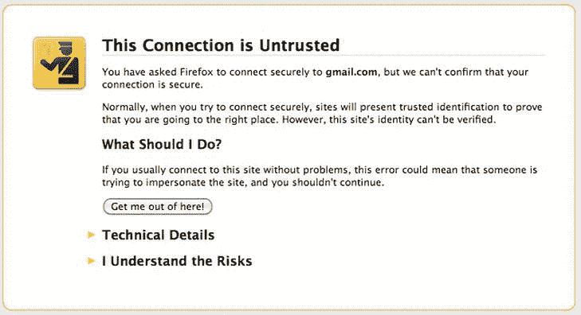

# 六、与网络应用交互

在某些时候，您将不得不与 web 应用程序进行交互。无论您是与第三方的 RESTful API 对话，还是与您自己的后端 web 应用程序交换数据，您的移动应用程序都需要接受与其他应用程序交互的想法。当然，作为一个负责任的开发人员，您的工作是确保数据交换完成，这样攻击者就不能访问或更改属于最终用户的私有数据。在前面的章节中，当我们研究数据存储和加密时，我们花了时间来探索“静态数据”。在本章中，我们将讨论“传输中的数据”

最初，我不打算花太多时间讨论加密传输中的数据的好处。通常，SSL 或 TLS 将处理传输中数据的安全部分。然而，最近对荷兰 DigiNotar 认证机构的入侵让我重新考虑这个选项(更多信息见 http://en.wikipedia.org/wiki/DigiNotar 的 [)。最后，作为开发人员，我将让您来决定如何保护您的传输数据；但是很明显，最近的这次攻击让我想到，即使信任 SSL 也不总是最好的选择。因此，我将介绍一些与 web 应用程序安全性相关的主题，以及您的移动应用程序应该如何与这样的 web 应用程序进行交互。我还将简要介绍开放 Web 应用程序安全项目(OWASP );这是保护您的 web 应用程序的一个非常好的资源。](http://en.wikipedia.org/wiki/DigiNotar)

考虑清单 6-1 中的源代码有多安全。现在问问你自己，你会做些什么来使它更安全？(查看本章末尾的解决方案，并比较您自己的笔记，看看您的思路是否正确。)

***[清单 6-1](#_list1) 。*** *客户端登录*

```java
package net.zenconsult.android.examples;

import java.io.IOException;
import java.io.UnsupportedEncodingException;
import java.util.ArrayList;
import java.util.List;

import org.apache.http.HttpResponse;
import org.apache.http.NameValuePair;
import org.apache.http.client.ClientProtocolException;
import org.apache.http.client.HttpClient;
import org.apache.http.client.entity.UrlEncodedFormEntity;
import org.apache.http.client.methods.HttpPost;
import org.apache.http.impl.client.DefaultHttpClient;
import org.apache.http.message.BasicNameValuePair;

import android.util.Log;

public class Login {
  private final String TAG = "HttpPost";

  public Login() {

  }

  public HttpResponse execute() {
       HttpClient client = new DefaultHttpClient();
       HttpPost post = new HttpPost(" [http://logindemo1.appspot.com/logindemo](http://logindemo1.appspot.com/logindemo)");
       HttpResponse response = null;

       // Post data with number of parameters
       List  <  NameValuePair  >       nvPairs = new ArrayList  <  NameValuePair  >  (2);
       nvPairs.add(new BasicNameValuePair("username", "sheran"));
  nvPairs.add(new BasicNameValuePair("password", "s3kretc0dez"));

       // Add post data to http post
       try {
       UrlEncodedFormEntity params = new UrlEncodedFormEntity(nvPairs);
       post.setEntity(params);
       response = client.execute(post);

       } catch (UnsupportedEncodingException e) {
       Log.e(TAG, "Unsupported Encoding used");
       } catch (ClientProtocolException e) {
       Log.e(TAG, "Client Protocol Exception");
       } catch (IOException e) {
       Log.e(TAG, "IOException in HttpPost");
       }
       return response;
       }

}
```

**准备我们的环境**

让我们从设置测试环境开始。我们显然需要一个现成的 web 应用程序托管基础设施。当我需要快速部署或测试 web 应用程序时，我通常依赖 Google App Engine。这为我节省了很多时间，而且我不必担心设置硬件、web 服务器和应用服务器。有了 Google App Engine，我可以用最小的设置开销开始编码。

让我们首先在 Google App Engine 上注册一个帐户(如果您已经有了 Gmail 的 Google 帐户，那么您可以跳过以下步骤使用它):

1.  导航到(参见[图 6-1](#Fig00061) )。【T6

    

    [图 6-1](#_Fig00061)T14 .谷歌应用引擎主页

2.  点击注册链接。出现提示时，使用您的 Gmail 帐户登录。然后你将被带到你的应用列表(见[图 6-2](#Fig00062) )。

    

    T11】图 6-2T13 .应用程序列表

    T15】
3.  单击创建应用程序按钮。下一页允许您选择有关您的应用程序的详细信息。(参见[图 6-3](#Fig00063) )。由于您的应用程序将公开可见，Google 为您提供了一个子域。appspot.com。这个子域池在应用引擎开发者的整个用户群中共享；因此，在某些情况下，您可能收不到您想要的应用程序名称。例如，你不太可能收到登录域名 1 子域名，因为我已经注册了。您可以通过单击“检查可用性”按钮来检查子域的可用性。【T6

    

    [图 6-3](#_Fig00063)T14 .为您的应用程序命名 
4.  填写你想要的应用的子域；应该是类似 **<** ***你的名字***>ogindemo 1. appspot . com(见[图 6-3](#Fig00063) )。给你的应用一个标题，比如登录演示 1。保持其余选项不变，然后单击 Create Application。
5.  如果一切顺利，您将会看到一个类似于图 6-4 的页面，告诉您您的应用程序已经成功创建。接下来，您可以通过单击“dashboard”链接来查看您的应用程序的状态。你的应用程序还没有做任何事情，所以统计数据仍然是空的(见[图 6-5](#Fig00065) )。


[图 6-4](#_Fig00064) 。成功创建应用T5


[图 6-5](#_Fig00065) 。应用仪表板

接下来，您必须下载用于 Google App Engine 的 SDK，以便在将应用程序发布到 Google App Engine 服务器之前，您可以在本地计算机上编写、运行和调试应用程序。我在大部分开发中使用 Eclipse，我将概述下载 SDK 并将其直接与 Eclipse 集成所需的步骤。此外，由于我们正在覆盖 Android，我们将坚持 Java SDK 的应用引擎。

你可以在以下网址找到如何安装 Eclipse 的 Google Apps 插件的详细说明:[http://code.google.com/eclipse/docs/getting_started.html](http://code.google.com/eclipse/docs/getting_started.html)。即使最终的 URL 发生了变化，您也应该能够通过导航到基本 URL，即 http://code.google.com/eclipse 的，到达文档部分。

我们还不打算写任何后端代码。首先，让我们编写一个存根应用程序，我们可以从它开始并在其上进行构建。在您的 Eclipse IDE 中，通过转到 FileNewWeb Application Project 来创建一个新的 Google App Engine 项目。将项目名填写为 LoginDemo，将包名填写为 net.zenconsult.gapps.logindemo，取消选中使用 Google Web Toolkit 旁边的复选框(参见[图 6-6](#Fig00066) )。完成后，点按“完成”。您将最终得到一个名为 LoginDemo 的项目；在命名的包中，您会发现一个名为的文件。该文件包含清单 6-2 中的代码。目前，它没有什么特别的。代码等待一个 HTTP GET 请求，然后用纯文本进行响应:“Hello，world。”


[图 6-6](#_Fig00066) 创建一个新的谷歌应用引擎项目

***[清单 6-2](#_list2) 。*** *默认存根应用包* *，net . Zen consult . gapps . logindemo*

```java
import java.io.IOException;
import javax.servlet.http.*;

@SuppressWarnings("serial")
public class LoginDemoServlet extends HttpServlet {
  public void doGet(HttpServletRequest req, HttpServletResponse resp)
            throws IOException {
            resp.setContentType("text/plain");
            resp.getWriter().println("Hello, world");
  }

}
```

让我们将这个应用程序部署到 Google App Engine，看看我们能否通过 web 浏览器访问它。要部署应用程序，在 Eclipse 包管理器中右键单击它，然后单击 Google  Deploy to App Engine。

然后会提示您选择您在 Google 网站上创建的远程应用程序的名称。在应用 ID 字段中输入您创建的名称(参见[图 6-7](#Fig00067) )并点击确定。在下一个窗口中，单击 Deploy 将您的应用程序上传到 Google(参见[图 6-8](#Fig00068) )。


[图 6-7](#_Fig00067) 。选择远程应用程序的名称


[图 6-8](#_Fig00068) 。将应用程序部署到 Google

成功部署应用程序后，您可以通过导航到创建应用程序时选择的 URL([http://<your](http://<your)name>log in demo 1 . appspot . com)来检查应用程序。在我的例子中，当我导航到 http://logindemo1.appspot.com 的，时，我会看到“你好，世界”响应消息(参见[图 6-9](#Fig00069) )。


[图 6-9](#_Fig00069) 。访问登录 servlet

我们现在有了自己的工作 web 应用程序，可以随心所欲地使用它。你可能已经注意到设置一个 Google App Engine 应用程序是多么的方便。这无疑节省了我们构建服务器、安装操作系统、安装服务器软件和配置服务器的时间和精力。让我们来看一些与 web 应用程序相关的理论。

**HTML、网络应用和网络服务**T3】

任何 web 开发人员都知道 HTML 是什么。它是任何现代网站的基本组成部分之一。HTML(超文本标记语言)始于 1991 年的一份草稿；这是一种非常简单的语言，可以用来创建基本的网页。快进到 2008 年，HTML 版本 5 的草案发布了。纯 HTML 页面 被称为*静态*页面。换句话说，它们呈现在最终用户的浏览器上，并保持在那里，直到用户导航到另一个页面。

一个*网络应用* 是终端用户通过网络 — 访问的一个软件，就像 HTML 页面一样。然而，web 应用程序比普通的 HTML 包含更多的动态元素。例如，现代网络应用程序有许多*服务器端*T7】语言。这些语言(例如 PHP、JSP 和 ASP)在运行时根据最终用户的输入动态生成静态 HTML。web 应用程序安装在 web 服务器上，并托管在最终用户可以通过网络(如互联网)访问的硬件上。服务器端应用框架负责呈现用户界面、任何应用逻辑(例如，搜索、计算或任何其他过程)以及数据存储或检索功能。最终用户所要做的就是带着他最喜欢的网络浏览器出现在聚会上。换句话说，因为所有复杂的处理都发生在后端或服务器端，所以更薄、更轻的 web 浏览器只不过是一种与用户界面交互的机制。

网络应用为开发者提供了许多优势 并且是当今网络生活中无处不在的一部分。它们最大的优势之一是能够向服务器推出更新或补丁，而不必担心更新成百上千的客户端。web 应用程序的另一大优势是，最终用户只需要一个瘦客户端——web 浏览器——仅此而已。因此，您不仅可以接触到来自个人计算群体的大量用户，还可以接触到移动计算群体。

一个 *web 服务* 类似于一个 web 应用程序，因为它可以通过网络远程访问。它的相似之处还在于它也运行某种服务器软件。然而，主要的区别是用户不能交互地访问服务。在大多数情况下，web 服务与其他客户端或服务器应用程序进行交互。在大多数情况下，web 服务能够描述它提供的服务以及其他应用程序如何访问它们。它使用 Web 服务描述语言(WSDL)文件来完成这项工作。其他应用程序可以通过处理发布的 WSDL 文件来了解如何使用 web 服务。通常，web 服务使用特定的 XML 格式来交换信息。其中一个流行的协议是 SOAP(简单对象访问协议)。SOAP 由基于特定应用的各种 XML 有效载荷组成。清单 6-3 显示了一个 SOAP 消息的例子。

***[清单 6-3](#_list3) 。*** *一个 SOAP 消息的例子(由维基百科提供)*

```java
POST /InStock HTTP/1.1
Host:[www.example.org](http://www.example.org)
Content-Type: application/soap  +  xml; charset = utf-8
Content-Length: 299
SOAPAction: "[http://www.w3.org/2003/05/soap-envelope](http://www.w3.org/2003/05/soap-envelope)"

```

“1.0”？>T1】

<envelope xmlns:soap="<span" class="FontName1">></envelope>

<getstockprice xmlns:m="<span" class="FontName1">></getstockprice>

IBM

web 服务的另一种工作方式是公开 RESTful API。REST 或表述性状态转移是一种架构，它使用底层的、无状态的客户端-服务器协议来公开 web 服务的端点。REST 的前提是使用一种简单得多的访问介质(如 HTTP ),对每个资源使用单独的 URIs，而不是依赖更复杂的协议，如 SOAP(使用单个 URI 和多个参数)。

你可以在罗伊·菲尔丁的学位论文[www . ics . UCI . edu/∞Fielding/pubs/disserious/REST _ arch _ style . htm](http://www.ics.uci.edu/∼fielding/pubs/dissertation/rest_arch_style.htm)或维基百科的[http://en . Wikipedia . org/wiki/representative _ state _ transfer](http://en.wikipedia.org/wiki/Representational_state_transfer)上阅读更多关于 REST 的内容。尽管使用 RESTful web 服务很简单，但它仍然可以执行与使用 SOAP 的 web 服务相同的任务。以清单 6-3 中的 SOAP 为例。如果我们的 web 服务将它作为 RESTful API 公开给我们，那么我们会做这样的事情:

```java
 [http://www.example.com/stocks/price/IBM](http://www.example.com/stocks/price/IBM) 
```

请注意，这是请求的范围。它可以作为一个简单的 HTTP GET 请求发送给服务器，然后服务器可以做出响应。有时，服务器可以用几种不同的表示形式返回数据。例如，如果我们向服务器请求 XML 输出，我们可以添加一个扩展 xml 。如果我们想要 JSON 格式的，我们可以添加一个 json 扩展名，如下所示:

```java
 [http://www.example.com/stocks/price/IBM.xml](http://www.example.com/stocks/price/IBM.xml) 
 [http://www.example.com/stocks/price/IBM.json](http://www.example.com/stocks/price/IBM.json) 
```

现在是谈论 HTTP(超文本传输协议)的好时机。HTTP 是驱动 web 的协议。虽然超文本最初指的是普通的老式 HTML，但现在可以扩展到包括 XML(可扩展标记语言)。XML 遵循 HTTP 的规则，但是它包括可以使用的自定义 HTML 标签(或关键字)。HTTP 作为一种请求-响应协议。请求-响应循环发生在称为客户端和服务器的两方之间。客户端，或者说*用户代理*(一个网络浏览器)，向网络服务器发出请求，网络服务器返回一个 HTML 或者 XML 的响应。大多数经验丰富的 web 开发人员有时也会期待与 XML 类似的格式，比如 JSON(JavaScript Object Notation)。

HTTP 请求被进一步细分为请求类型，或*方法* 。有几种方法，最常用的是 GET 和 POST 。 GET 请求用于检索数据， POST 请求用于提交数据。如果你正在填写注册表格，点击提交按钮会提示浏览器将你的数据发送到服务器。如果你回头看本章开头的[清单 6-1](#list1) ，你会看到这一行:

```java
HttpPost post = new HttpPost(" [http://logindemo1.appspot.com/logindemo](http://logindemo1.appspot.com/logindemo) ");
```

这是对特定 URL 的 HTTP POST 请求的创建。您可能知道，URL(统一资源定位器)是一种地址，它告诉用户代理从哪里检索特定的资源。资源可以是远程存储在服务器上的文件、文档或对象。HTTP 请求和响应都有相似的结构。两者都包含标题和内容区域。你可以在 www.w3.org 的T3 找到很多关于 HTTP 的附加信息。

**Web 应用程序中的组件**

Web 应用程序由不同的层组成。典型的 web 应用程序有三层(见[图 6-10](#Fig000610) ):表示层、逻辑层和数据层。根据应用程序的要求和复杂性，层数可能会增加。拥有多层应用程序有许多优势:其中之一是系统所有者可以独立于其他层替换或扩展硬件或服务器配置。考虑公司需要增加数据存储量的情况；IT 部门可以升级这一层，而无需对其他层进行重大更改。下一个优势是安全团队可以在每一层进行更精细的控制。每一层都有不同的功能，因此有不同的要求和相关的安全控制。多层应用程序允许所有者在各个层拥有更多锁定的控制，而不是留下空白，因为所有三层都在一个系统上。

因此，基于三层架构 ，一个 web 应用将包含一个呈现其数据的 web 服务器，一个处理所有数据交换请求的应用服务器，以及一个存储和检索数据的数据库服务器。


[图 6-10](#_Fig000610)T3。一个三层的网络应用程序(由维基百科提供)

让我们通过一个例子来看看每一层是如何涉及的。

**登录流程**

客户端与服务器进行的标准用户身份验证会话如下所示:

1.  客户端从 web 服务器**【Web 服务器/表示层】**请求登录页面。
2.  客户端将凭证发送到 web 服务器**【Web 服务器/表示层】**。
3.  应用服务器接收数据并检查其是否符合验证规则**【应用服务器/逻辑层】**。
4.  如果数据是好的，那么应用服务器查询数据库服务器以发现是否存在匹配的凭证**【应用服务器/逻辑层】**。
5.  数据库服务器响应应用服务器成功或失败**【数据库服务器/数据层】**。
6.  应用服务器告诉 web 服务器向客户端提供其门户(如果凭证正确)或错误消息(如果凭证不匹配)**【应用服务器/逻辑层】**。
7.  Web 服务器显示来自应用服务器**【Web 服务器/表示层】**的消息。

虽然这是一个简化的示例，但它确实说明了流程如何从外部移动到内部 — ，然后再返回。

**Web App 技术**

web 应用程序的每一层都可以使用多种技术。您可以从许多 web 服务器、应用程序框架、应用程序服务器、服务器端脚本语言和数据库服务器中进行选择。您的选择标准取决于多种因素，如应用要求、预算以及对您选择的技术的支持的可用性。

因为 Android 开发主要是在 Java 上完成的，所以我决定在我们的 web 应用程序中也坚持使用 Java。除了 Java，您还可以使用其他服务器端技术。这里列举了其中的一些:

*   PHP:[www.php.net](http://www.php.net)T3】
*   python:[www.python.org](http://www.python.org)
*   决哥: [www .决哥 project.com](http://www.djangoproject.com)
*   perl:(不太常用，但有时仍会使用)
*   冷聚变:[www.adobe.com/product/coldfusion-family.html](http://www.adobe.com/product/coldfusion-family.html)T3】
*   ASP。净:
*   ruby on Rails:[www.rubyonrails.org](http://www.rubyonrails.org)T3】

类似地，根据您的需求，您可以将许多流行的数据库用于您的数据层应用程序。存在许多免费的和商业的数据库。这是您或您的应用程序架构师最初必须做出的又一个决定。这里有一个流行数据库的简短列表和一个 URL ,表明您可以在哪里了解更多关于它们的信息:

*   Oracle:[www . Oracle . com](http://www.oracle.com)
*   微软 SQL Server:[www.microsoft.com/sqlserver](http://www.microsoft.com/sqlserver)T3】
*   MySQL:[www.mysql.com](http://www.mysql.com)T3】
*   PostgreSQL:[www.postgresql.org](http://www.postgresql.org)T3】
*   couch db:[http://couchdb.apache.org](http://couchdb.apache.org)T3】
*   莽哥布:[www .mon 哥布. org](http://www.mongodb.org)

现在让我们花几分钟时间来完成我们的 web 应用程序，以便它支持基本的密码检查。请注意，我故意让这个例子非常简单。实际 web 应用程序的身份验证例程将更加复杂。查看清单 6-4 中的代码。

***[清单 6-4](#_list4) 。*** *新的凭证验证码*

```java
package net.zenconsult.gapps.logindemo;

import java.io.IOException;
import javax.servlet.http.*;

@SuppressWarnings("serial")
public class LoginDemoServlet extends HttpServlet {
  private String username = "sheran";
  private String password = "s3kr3tc0dez"; // Hardcoded here intended to
  // simulate a database fetch

  public void doGet(HttpServletRequest req, HttpServletResponse resp)
      throws IOException {
    resp.setContentType("text/plain");
  resp.getWriter().println("Hello, world");
  }

  public void doPost(HttpServletRequest req, HttpServletResponse resp)
      throws IOException {
    String user = req.getParameter("username"); // No user input validation
                                                    // here!
    String pass =   req.getParameter("password"); // No user input validation
                                                    // here!

    resp.setContentType("text/plain");
    if (user.equals(username) && pass.equals(password)) {
      resp.getWriter().println("Login success!!");
    } else {
      resp.getWriter().println("Login failed!!");
      }

    }
}
```

下一步是发布您的代码，就像您第一次设置 Google App Engine 帐户时所做的那样，然后创建一个新的处理身份验证的 Android 项目(项目结构见[图 6-11](#Fig000611) )。[清单 6-5、](#list5) [6-6、](#list6) [6-7、](#list7)和 [6-8](#list8) 分别包含了登录、登录民主客户端 1 活动、字符串. xml 和 main.xml 文件的源代码。确保将这一行添加到您的 AndroidManifest.xml 文件中，因为您将需要访问互联网来访问您的 Google App Engine 应用程序:

<uses-permission Android:name =【Android . permission . internet】></uses-permission>


[图 6-11](#_Fig000611)T3。项目结构

***[清单 6-5](#_list5) 。*** *登录类*

```java
package net.zenconsult.android.examples;

import java.io.IOException;
import java.io.UnsupportedEncodingException;
import java.util.ArrayList;
import java.util.List;

import org.apache.http.HttpResponse;
import org.apache.http.NameValuePair;
import org.apache.http.client.ClientProtocolException;
import org.apache.http.client.HttpClient;
import org.apache.http.client.entity.UrlEncodedFormEntity;
import org.apache.http.client.methods.HttpPost;
import org.apache.http.impl.client.DefaultHttpClient;
import org.apache.http.message.BasicNameValuePair;

import android.util.Log;

public class Login {
  private final String TAG = "HttpPost";
  private String username;
  private String password;

  public Login(String user, String pass) {
       username = user;
       password = pass;
  }

  public HttpResponse execute() {
       Log.i(TAG, "Execute Called");
       HttpClient client = new DefaultHttpClient();
       HttpPost post = new HttpPost("[http://logindemo1.appspot.com/logindemo](http://logindemo1.appspot.com/logindemo)");
       HttpResponse response = null;

       // Post data with number of parameters
       List< NameValuePair  >       nvPairs = new ArrayList  <  NameValuePair  >  (2);
       nvPairs.add(new BasicNameValuePair("username", username));
       nvPairs.add(new BasicNameValuePair("password", password));

       // Add post data to http post
  try {
            UrlEncodedFormEntity params = new UrlEncodedFormEntity(nvPairs);
            post.setEntity(params);
            response = client.execute(post);
            Log.i(TAG, "After client.execute()");

       } catch (UnsupportedEncodingException e) {
       Log.e(TAG, "Unsupported Encoding used");
       } catch (ClientProtocolException e) {
            Log.e(TAG, "Client Protocol Exception");
       } catch (IOException e) {
            Log.e(TAG, "IOException in HttpPost");
  }
  return response;
  }

}
```

6-5 中列出的代码[包含登录程序。类构造函数 Login 有两个参数，分别是用户名和密码。 execute() 方法](#list5) 将使用这些参数向服务器发出 HTTP POST 请求。

***[清单 6-6](#_list6) 。****logindemoclient 1 活动类*

```java
package net.zenconsult.android.examples;

import java.io.BufferedReader;
import java.io.IOException;
import java.io.InputStreamReader;

import org.apache.http.HttpResponse;
import org.apache.http.HttpStatus;

import android.app.Activity;
import android.os.Bundle;
import android.util.Log;
import android.view.View;
import android.view.View.OnClickListener;
import android.widget.Button;
import android.widget.EditText;

public class LoginDemoClient1Activity extends Activity implements
  OnClickListener {
  private final String TAG = "LoginDemo1";
  private HttpResponse response;
  private Login login;

  /** Called when the activity is first created. */
  @Override
  protected void onCreate(Bundle savedInstanceState) {
      super.onCreate(savedInstanceState);
      setContentView(R.layout.main);

      Button button =     (Button) findViewById(R.id.login);
      button.setOnClickListener(this);

  }

  @Override
  public void onClick(View v) {
      String u = ((EditText) findViewById(R.id.username)).toString();
      String p = ((EditText) findViewById(R.id.password)).toString();

      login = new Login(u, p);

      String msg = "";
      EditText text =         (EditText) findViewById(R.id.editText1);
  text.setText(msg);

  response = login.execute();
      Log.i(TAG, "After login.execute()");

      if (response ! = null) {
  if (response.getStatusLine().getStatusCode() == HttpStatus.SC_OK) {
      try {
  BufferedReader reader =     new BufferedReader(
  new InputStreamReader(response.getEntity()
  .getContent()));
  StringBuilder sb =     new StringBuilder();
  String line;
      while ((line = reader.readLine()) ! = null) {
  sb.append(line);
  }
  msg = sb.toString();
  } catch (IOException e) {
  Log.e(TAG, "IO Exception in reading from stream.");
      }

  } else {
      msg = "Status code other than HTTP 200 received";
  }
  } else {
  msg = "Response is null";
  }
      text.setText(msg);
  }
}
```

6-6 中列出的代码[是一个标准的 Android 活动。这可以被认为是应用程序的入口或起点。](#list6)

***[清单 6-7](#_list7) 。****strings . XML 文件*

```java
<?xml version = "1.0" encoding = "utf-8"?>
<resources>
  <string name = "hello"  >  Web Application response:</string>
  <string name = "app_name"  >  LoginDemoClient1</string>
  <string name = "username"  >  Username</string>
  <string name = "password"  >  Password</string>
  <string name = "login"  >  Login</string>
</resources>
```

***[清单 6-8](#_list8) 。****main . XML 文件*

```java
<?xml version = "1.0" encoding = "utf-8"?>
<LinearLayout xmlns:android = " [http://schemas.android.com/apk/res/android](http://schemas.android.com/apk/res/android) "
  android:orientation = "vertical"
  android:layout_width = "fill_parent"
  android:layout_height = "fill_parent"
  android:weightSum = "1">
  <TextView android:textAppearance = "?android:attr/textAppearanceLarge"
  android:id = "@  +  id/textView1" android:layout_height = "wrap_content"
  android:layout_width = "wrap_content" android:text = "@string/username">
  </TextView>
<EditText android:layout_height = "wrap_content"
  android:layout_width = "match_parent" android:id = "@  +  id/username">
</EditText>
<TextView android:textAppearance = "?android:attr/textAppearanceLarge"
  android:id = "@  +  id/textView2" android:layout_height = "wrap_content"
  android:layout_width = "wrap_content" android:text = "@string/password">
</TextView>
<EditText android:layout_height = "wrap_content"
  android:layout_width = "match_parent" android:inputType = "textPassword"
  android:id = "@  +  id/password">
</EditText>
<Button android:text = "@string/login" android:layout_height = "wrap_content"
  android:layout_width = "166dp" android:id = "@  +  id/login">
</Button>
<TextView android:text = "@string/hello" android:layout_height = "wrap_content"
  android:layout_width = "fill_parent">
</TextView>
<EditText android:id = "@  +  id/editText1" android:layout_height = "wrap_content"
  android:layout_width = "match_parent" android:inputType = "textMultiLine"
  android:layout_weight = "0.13">
  <requestFocus  >  </requestFocus>
</EditText>
</LinearLayout>
```

strings.xml 和 main 。 xml 文件分别包含我们定义的字符串常量集和应用程序的图形布局。

运行您的应用程序并输入不同的用户名和密码。您应该会看到两条不同的响应消息，一条表示成功，另一条表示密码失败(参见[图 6-12](#Fig000612) )。就是这样！您已经完成了移动登录客户端和服务器的编写。接下来，我们将讨论 web 上的安全性，以及在您的 web 应用程序中可能会遇到的各种攻击。


[图 6-12](#_Fig000612)T3。登录失败

**OWASP** **和网页攻击**

开放 web 应用安全项目(OWASP)[【www.owasp.org】](http://www.owasp.org)是一个为测试和保护 Web 应用提供大量知识、技术和指南的组织。OWASP 成立于 2001 年 12 月，并于 2004 年获得美国非营利慈善机构地位。它的核心目标是"*成为一个蓬勃发展的全球社区，推动全球软件安全性的可见性和发展。*“这是了解和修复 web 应用程序安全性的绝佳资源。

OWASP 十大项目自 2004 年以来一直是 OWASP 基金会 的子项目。在半定期的基础上，OWASP 十大漏洞列出了十个最重要的应用程序安全漏洞。这些漏洞被列为项目成员和全球安全专家在 web 应用程序中所经历的广泛共识。十大清单被大量商业组织使用和采纳，它已经成为 web 应用程序安全的事实标准。

在这本书出版的时候，2010 年 OWASP 十大仍然是最近更新的名单 。这里可以找到:【www.owasp.org/index.php/Top_10_2010】T4。

下面列出了 2010 年 OWASP 十大主题:

*   A1:注射
*   A2:跨站点脚本(XSS)
*   A3:不完整的认证和会话管理
*   A4:不安全的直接对象引用
*   A5:跨站点请求伪造(CSRF)
*   A6:安全错误配置
*   A7:不安全的加密存储
*   A8:无法限制 URL 访问
*   A9:传输层保护不足
*   A10:未经验证的重定向和转发

较新的 OWASP 项目之一是移动十大，它是 OWASP 移动安全项目 的一部分。该项目仍在开发中，在撰写本文时还没有发布最终的清单。然而，网站上有一个实用技巧的列表，将证明对你这个移动开发者有巨大的帮助。本章涵盖的大多数主题都与移动十大共享许多技术和原则。以下是该列表涵盖的主题:

*   识别和保护移动设备上的敏感数据。
*   在设备上安全地处理密码凭证。
*   确保敏感数据在传输过程中受到保护。
*   正确实施用户认证/授权和会话管理。
*   保持后端 API(服务)和平台(服务器)的安全。
*   安全地执行与第三方服务/应用程序的数据集成。
*   特别注意收集和存储同意收集和使用用户数据。
*   实施控制以防止对付费资源(如钱包、短信和电话)的未授权访问。
*   确保移动应用的安全分发/供应。
*   仔细检查代码的任何运行时解释是否有错误。

**认证技术**

现在，让我们继续讨论保护“传输中的数据”的主题。我希望你对 web 应用程序的幕后工作有一个公平的理解，这就是为什么我在本章中讨论了与 web 应用程序相关的主题。如果你致力于成为一名移动应用程序开发人员，那么看看你的应用程序如何与你想与之交流的 web 应用程序进行通信是很有趣的。更好地理解应用程序还可以帮助您提高安全性和性能。如果像我一样，您从头到尾都在编写代码，包括 web 应用程序开发，那么您可能已经熟悉了我将要讨论的主题。不管怎样，既然您已经对 web 应用程序和安全性有了一个简短的回顾，那么让我们继续手头的主要任务。

身份验证是需要与远程 web 应用程序交互的移动应用程序的一个重要特性。几乎所有当今的应用程序都依赖某种形式的用户名和密码或 PIN 组合来授权对其数据的访问。用户名和密码存储在服务器上，每当最终用户希望通过应用程序进行身份验证时，就会进行比较。如果你重新看一下清单 6-1，你会发现我们正在这么做。以下几行包含 web 应用程序的用户名和密码:

```java
nvPairs.add(new BasicNameValuePair("username", "sheran"));
nvPairs.add(new BasicNameValuePair("password", "s3kretc0dez"));
```

在这种情况下，信息是硬编码的，但它可以很容易地存储在设备上(当然是加密的！)并在用户想要登录时检索。但是如果我们的流量在传输过程中被拦截了呢？“啊哈！但是我们有 SSL！”你说。这是真的，但是我们似乎没有在我们的例子中使用它，因为我们的 POST 请求发送到一个非 SSL/TLS 端口:

```java
HttpPost post = new HttpPost(" [http://logindemo1.appspot.com/logindemo](http://logindemo1.appspot.com/logindemo) ");
```

好吧，那是个卑鄙的手段。但是我们认真考虑一下，我们的 SSL 流量被攻破了。窃听我们与 web 应用程序对话的攻击者现在可以访问我们的凭据。她现在要做的就是直接在完整的网络应用程序或另一个移动设备上使用它们。如果她这样做，她将完全控制我们的用户资料。如果这是一个社交网站，那么我们可能不会太在意；然而，如果这是我们的网上银行应用程序，那么我们会非常担心。

到目前为止，我们知道在进行远程身份认证时面临的风险。尽管我们的数据可能会通过安全通道，但仍然容易受到攻击。而且不一定是像 DigiNotar 事件那样的严重攻击，攻击者可以颁发她自己的证书。例如，攻击可能像 SSL 中间人攻击一样平淡无奇。

因为我不止一次提到 DigiNotar 和不信任 SSL，所以我认为我概述一下我的理由是公平的。

你不能总是相信 SSL 。一般来说，最终用户认为 SSL 意味着他们是安全的。浏览器上的挂锁图标和地址栏变成绿色表示您正在浏览一个安全的网站。然而，这不一定是真的。我想花点时间回顾一下 SSL 的一些概念。

SSL(安全套接字层)是一种传输协议，它对两台计算机之间传输的数据进行加密。一个窃听者不可能不经过一番努力就截获加密数据——。因此，SSL 确保数据在客户端和服务器计算机之间保持私密。SSL 已经过时了。大多数人把客户端和服务器之间的加密 HTTP 数据传输称为 SSL 但实际上，较新的协议是 TLS(传输层安全)。SSL 和 TLS 不可或缺的一部分是 X.509 证书。X.509 是公钥基础设施(PKI)的标准，我在第 5 章中简单介绍过。通常，用户会将 X.509 服务器证书称为 SSL 证书。这是 SSL 的一个关键且非常重要的组件。[图 6-13](#Fig000613) 显示了设置 SSL 会话的浏览器。


[图 6-13](#_Fig000613)T3。设置 SSL/TLS 会话

TLS 和 SSL 结合使用加密技术来确保数据传输的安全性。现在让我们来看看这个会话设置。我不会给你外科手术的细节，因为你几乎永远不需要写自己的 TLS 协商算法。相反，本节将让您了解如何设置加密以及在 TLS 会话期间发生了什么。

首先，客户端或浏览器将联系 web 服务器并向其发送一些信息。该信息包含它可以支持的 TLS 版本的详细信息和加密算法列表。这些被称为*密码套件* ，它们包含支持各种任务的算法，如密钥交换、认证和批量密码。

接下来，服务器在选择了它支持的特定密码套件以及客户机和服务器都支持的最高通用 TLS 版本后做出响应。然后，服务器还会向客户端发送其 SSL 证书。

然后，客户端使用服务器的公钥加密并交换一个*预主*密钥，一个生成主密钥的密钥。

交换预主密钥后，客户端和服务器将使用随机值和预主密钥来生成最终的主密钥。这个主密钥存储在客户端和服务器上。

然后，服务器和客户端切换到加密所有来回发送的数据。使用选定的密码套件，并在两端使用对称主密钥来加密和解密数据。[图 6-14](#Fig000614) 显示了如果您能够捕获客户端和服务器之间的加密数据会话，您会看到什么。[图 6-15](#Fig000615) 显示了使用 OpenSSL 查看时的握手和其他相关细节。只要看一眼就会立即告诉您，绝对没有可供攻击者使用的数据。那么，这对开发人员来说意味着什么呢？您应该使用 SSL，并且在客户机和服务器之间交换敏感数据时永远不用担心被窥探？我暂时不会接受你的回答。我们先来看几个细节，稍后再来回答你。


[图 6-14](#_Fig000614)T3。SSL 会话的流量捕获


[图 6-15](#_Fig000615)T3。使用 OpenSSL 的 s_client 选项查看 SSL 握手

SSL 与信任息息相关。实际上，X.509 是关于信任的。SSL 证书是根据特定标准颁发给个人或公司的。颁发机构，也称为 CA 或证书颁发机构，负责确定您是否是您所说的那个人。例如，你不能只申请一个www.google.com 证书而不证明你以某种方式隶属于该公司，或者有能力代表该公司行事。这很重要，因为如果 CA 不检查这些凭证，那么任何人都可以申请 SSL 证书并将其安装在自己的 web 服务器上。

通过欺骗最终用户，让他们相信你的服务器是 google.com 服务器，你可以实施中间人攻击，拦截他的所有数据。我们很快会看到中间人攻击；但是首先，我想介绍另一个您可能知道的话题，即自签名证书。

**注意**CA 向客户端颁发 SSL 证书。颁发证书时，CA 还将使用自己的根证书对 SSL 证书进行签名。这个签名表明 CA 信任发布的 SSL 证书。浏览器可以通过首先查看 CA 签名并验证签名是否与根证书匹配来验证 SSL 证书。

世界各地都有许多知名的根 ca。通常，CA 根证书打包在您的 web 浏览器中。这允许浏览器验证由不同 ca 颁发的 SSL 证书。

例如，假设您向 VeriSign 申请了您的域名、example.com的证书。VeriSign 首先确定您是该域的正确所有者，然后为您的 web 服务器颁发证书。它用自己的根证书签署该证书。收到 SSL 证书后，您可以将其安装在 web 服务器上并建立您的网站。现在当我访问您的网站时，我的浏览器首先查看您的 SSL 证书，然后尝试验证您的证书是否确实是由受信任的 CA 颁发的。为此，我的浏览器将查看其可信根证书的内部存储，以确定 VeriSign 根证书的签名是否与您的证书上的签名匹配。如果是的话，我可以继续浏览你的网站。但是，如果难以验证您的证书，我的浏览器会警告我无法验证证书。

请注意，在给证书开绿灯之前，您的浏览器将验证关于证书的许多其他细节。

**自签名证书**

在一些项目的开发和测试阶段，开发人员有时会在他们的网站上使用自签名证书。这种类型的证书在所有方面都与 CA 颁发的 SSL 证书相同。但是，主要的区别在于该证书上的签名不是来自可信的 CA。相反，开发人员自己签署证书。当浏览器使用自签名 SSL 证书连接到站点时，它无法验证谁签署了证书。这是因为签名者没有列在浏览器的内部可信证书库中。然后浏览器会向用户发出类似于图 6-16 中[所示的警告。](#Fig000616)



[图 6-16](#_Fig000616)T3。不可信或自签名证书的警告

发生在浏览器上的验证阶段非常重要。它的存在使得攻击者不能简单地给自己颁发一个属于的证书来欺骗用户。如果浏览器无法验证 SSL 证书，它将始终提醒用户。

**中间人攻击**

中间人(MitM) 攻击是一种攻击者可以窃听双方之间的网络流量或数据流动的方法。攻击者将自己定位成能够拦截来自发送方和接收方的流量，有效地将自己置于两者之间(见[图 6-17](#Fig000617) )。在这个位置上，他能够在双方之间截取和传递信息。如果执行正确，会话两端的用户都不会知道攻击者在中继和拦截他们的流量。


[图 6-17](#_Fig000617)T3。艾丽丝和鲍勃中间的马洛里(维基百科提供)

下面是一个 MitM 攻击的例子，使用[图 6-17](#Fig000617) 作为参考T3:

```java
Alice "Hi Bob, it's Alice. Give me your key"--> Mallory Bob
Alice Mallory "Hi Bob, it's Alice. Give me your key"--> Bob
Alice Mallory <--[Bob's_key] Bob
Alice <--[Mallory's_key] Mallory Bob
Alice "Meet me at the bus stop!"[encrypted with Mallory's key]--> Mallory Bob
Alice Mallory "Meet me in the windowless van at 22nd Ave!"[encrypted with Bob's
 key]--> Bob

```

大多数时候，我们看到的攻击都集中在自签名证书上，或者诱骗浏览器相信攻击者拥有有效的证书。直到最近，攻击者对 CA 安全知之甚少，涉及 CA 的事件也少得多。不管怎么说，直到 2011 年 6 月之前都是如此。

理论上，攻击 CA 以获取合法签名的可信 SSL 证书也是一种选择。没有多少攻击者会考虑这一点，因为他们显然希望 CAs 具有高度的安全性。正确错了！2011 年 6 月，一个名为 DigiNotar 的 CA 遭到攻击。攻击者给自己颁发了 500 多个由 DigiNotar 签名的欺诈 SSL 证书。作为一个可信的 CA，DigiNotar 在所有现代浏览器中都有根证书。这意味着攻击者拥有合法的 SSL 证书，可以用来执行 MitM 攻击。由于浏览器已经信任 DigiNotar 根证书，它们将总是验证这些流氓 SSL 证书，最终用户永远不会知道攻击者正在拦截她的数据。

为什么会这样？DigiNotar 的基础设施安全控制非常松散。攻击者能够远程破坏其服务器，并访问负责颁发合法证书的系统。在这之后，对于攻击者来说，随时为自己颁发证书是一个相对简单的任务。一些有流氓证书的比较著名的网站 包括:

*   *.google.com (指【google.com】的任何子域，包括【mail.google.com】【docs.google.com】【plus.google.com】等等)
*   *.android.com
*   *.microsoft.com
*   *.mozilla.org
*   *.wordpress.org
*   www.facebook.com
*   www.mossad.gov.il
*   www.sis.gov.uk

所有的网页浏览器开发者都将 DigiNotar 的根证书列入黑名单，DigiNotar 开始系统地撤销所有的流氓证书。不幸的是，当这一切发生的时候，DigiNotar 已经失去了全球成千上万用户的信任。该公司于 2011 年 9 月宣布破产。

如果这么大的 CA 可以遭受这么大的安全漏洞，危及数百个 SSL 证书，那么我们真的可以一直依赖 SSL 吗？事实上，我们可以。像 DigiNotar 这样的事件很少发生，所以我会选择信任 SSL。然而，我也会选择在我的移动应用和服务器之间部署我自己的数据加密层。然后，如果 SSL 层被以任何方式破坏，攻击者将有另一层加密要处理。在大多数情况下，这一额外的层将作为一种威慑，攻击者可能会离开您的应用程序。

有没有一种方法可以防止攻击者在通过 SSL 传输时窥探我们的凭据？确实是的！让我们来看两种方法，即使我们的安全传输通道出现故障，我们也可以防止我们的凭据被破坏。一个是 OAuth ，一个是挑战/响应。

**听觉**

OAuth 协议允许被称为*消费者* 的第三方网站或应用程序使用被称为*服务提供商* 的网络应用程序上的最终用户数据。最终用户对他可以授予这些第三方的访问权限拥有最终控制权，并且这样做时不必泄露或存储他现有的 web 应用程序凭证。

以 Picasa 网络相册为例；照片编辑应用 Picnik([www.picnik.com](http://www.picnik.com))允许最终用户编辑他们的照片。Picnik 还允许终端用户从 Picasa 和 Flickr 等其他网站导入内容。在 OAuth 之前，用户必须登录 Picnik，*还要*输入他的 Picasa 或 Flickr 用户名和密码，这样 Picnik 就可以开始从这些网站导入照片。这种方法的问题是，现在用户已经用 Picnik 保存或使用了他的凭证。他的曝光度增加了，因为他在 Picasa *和* Picnik 保存了自己的凭证。

如果用 OAuth 重现相同的场景，那么用户就不必在 Picnik 站点上再次输入凭证。相反，Picnik(消费者)会将他重定向到他的 Picasa(服务提供商)网站(见[图 6-18](#Fig000618) )并要求他允许或拒绝访问 Picasa 上存储的照片(见[图 6-19](#Fig000619) )。这样，用户的凭证更安全。


[图 6-18](#_Fig000618)T3。Picnik 请求连接到 Picasa，这样它就可以请求一个访问令牌T5】


[图 6-19](#_Fig000619)T3。Picasa 请求授权让 Picnik 查看一些照片

OAuth 通过使用请求令牌来工作。想要访问 web 应用程序中的数据的站点需要从该应用程序获得一个令牌，然后才能开始访问这些数据。

让我们先来看看 OAuth 是如何为 Picasa 网络相册工作的。例如，假设您编写了一个列出用户 Picasa 相册的 Android 应用程序。您的 Android 应用程序需要访问用户的 Picasa 网络相册才能做到这一点。在这种情况下，参与者是您的 Android 应用程序(消费者)、Picasa(服务提供商)和您的最终用户。

OAuth 要求您首先在进行身份验证的站点上注册您的消费者应用程序。这是必要的，因为您将收到一个需要在代码中使用的应用程序标识符。要注册您的应用程序，您必须访问[【http://code.google.com/apis/console】](http://code.google.com/apis/console)(参见[图 6-20](#Fig000620) )，创建一个项目，并创建一个 OAuth 客户端 ID(参见[图 6-21](#Fig000621) 、 [6-22](#Fig000622) 、 [6-23](#Fig000623) 和 [6-24](#Fig000624) )。


[图 6-20](#_Fig000620)T3。在 Google APIs 上创建一个新项目


[图 6-21](#_Fig000621)T3。创建新的客户端 ID


[图 6-22](#_Fig000622)T3。填写您的申请详情


[图 6-23](#_Fig000623)T3。选择您的申请类型


[图 6-24](#_Fig000624)T3。您的客户端 ID 和客户端密码现在已创建

现在你已经得到了 OAuth 客户端 ID，让我们来看看 OAuth 应用程序的认证流程 (见[图 6-25](#Fig000625) )


[图 6-25](#_Fig000625)T3。OAuth 认证流程(由 Google 提供)

OAuth 是一个包含三个主要交互方的多阶段流程。消费者是希望从服务提供者那里访问数据的应用程序，这只有在用户明确授权消费者的情况下才会发生。让我们详细回顾一下这些步骤:

当最终用户打开您的 Android 应用程序 时，会启动以下场景:

1.  *流程 A:* 消费者应用程序(您的 Android 应用程序)向服务提供商(Picasa)请求令牌。
2.  流程 B: Picasa 告诉您的应用程序将最终用户重定向到 Picasa 的网页。然后，您的应用程序会打开一个浏览器页面，将最终用户指引到特定的 URL。
3.  *流程 C:* 最终用户在该屏幕中输入她的凭证。请记住，她正在登录服务提供商(Picasa)网站，并授权访问您的应用程序。她将凭据发送到网站，而不是存储在设备上的任何地方。
4.  *流程 D:* 一旦 Picasa 确认最终用户输入了正确的用户名和密码，并授予了对您的应用程序的访问权限，它会回复一个响应，指示请求令牌是否已被授权。此时，您的应用程序必须检测到这种响应并采取相应的行动。假设授权被授予，您的应用程序现在有一个授权的请求令牌。
5.  *流程 E:* 使用这个授权的请求令牌，你的应用向服务提供商发出另一个请求。
6.  *流程 F:* 然后，服务提供者将请求令牌交换为访问令牌，并在响应中将其发送回去。
7.  你的应用程序现在使用这个访问令牌来访问任何受保护的资源(在这个例子中是用户的 Picasa 相册)，直到令牌过期。

您的应用程序现已成功访问 Picasa，无需存储最终用户的凭据。如果用户的手机遭到破坏，攻击者复制了所有应用程序数据，他将无法在您的应用程序数据中找到 Picasa 用户名和密码。这样，你就确保了你的应用不会不必要地泄露敏感数据。

我在这里使用 Picasa 只是作为一个参考框架。我们的最终目标是为我们的后端应用程序创建一个 OAuth 认证系统。因此，您的后端 web 应用程序 将成为 OAuth 服务提供者，而不是 Picasa 作为服务提供者。您的最终用户必须通过 web 浏览器登录到您的应用程序，并明确授权它访问资源。接下来，您的移动应用程序和后端 web 应用程序将使用请求和访问令牌进行通信。最重要的是，你的移动应用程序不会保存你的网络应用程序的用户名和密码。

为了说明这些概念，我为 Picasa 创建了一个示例应用程序。我将在第 8 章向你展示如何在你的 web 应用程序中实现 OAuth。

**用密码术挑战/响应**

保护您的最终用户凭证不通过 Internet 的第二种机制是使用挑战/响应技术。这种技术在许多方面与 OAuth 相似，因为没有凭证通过网络。相反，一方请求另一方挑战。然后，另一方将根据特别选择的算法和密码功能对随机信息进行加密。用于加密这些数据的密钥是用户密码。这个加密的数据被发送到质询方，然后质询方使用存储在其末端的密码对同一条信息进行加密。然后比较密文；如果匹配，则允许用户访问。学习这种技术的最好方法是通过一个实际的例子。与 OAuth 一样，我在第 8 章中包含了源代码和应用示例。

**总结**

在这一章中，我们重点讲述了如何将我们的数据从移动应用程序安全地传输到 web 应用程序。我们还介绍了如何使用成熟的协议和机制来保护传输中的数据。与此同时，我们看到，在某些情况下，我们无法信任协议本身。在这种情况下，我们会考虑一些选项，帮助我们保护最终用户的凭据不被窃取或拦截。

我们还讨论了涉及 web 应用程序安全性的主题。考虑到大多数移动应用程序以某种形式与 web 应用程序通信，了解这方面的技术如何工作总是有好处的。最后，我们查看了一些有助于我们保护 web 应用程序的有用资源，以及一些在传输过程中保护用户凭证的具体示例。