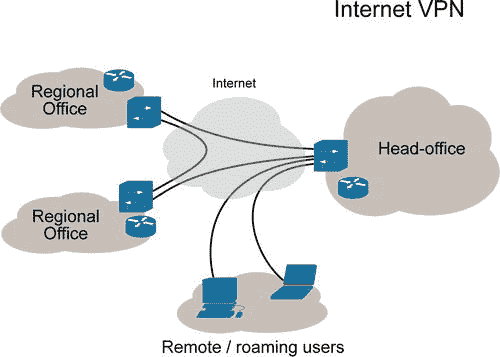
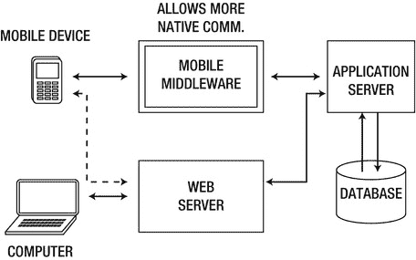
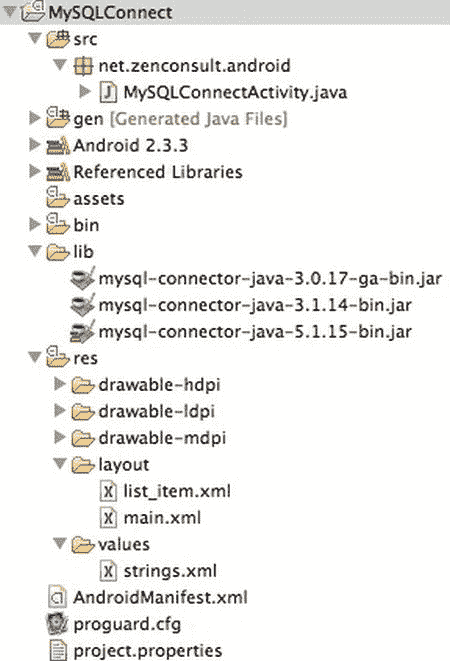
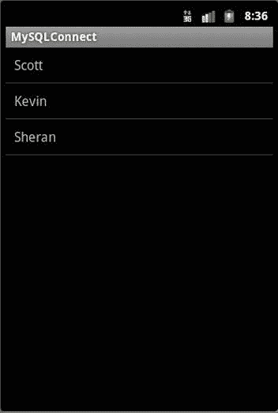
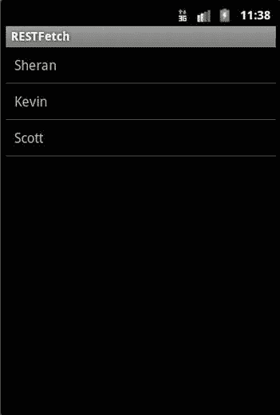
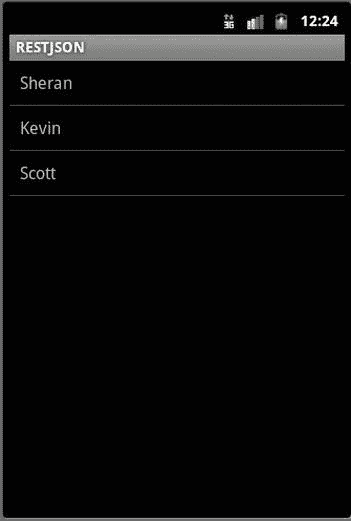

# 七、企业安全

一直以来，我们都是站在个人开发者的角度来看待移动应用。尽管我相信个人开发者或较小的开发公司远远超过企业开发者，但我认为关注企业开发者和他可能面临的独特挑战是有益的。你可能想跳过这一章，因为你不属于“企业开发者”的范畴；然而，我会敦促你考虑这一点:现在大多数企业都在考虑外包他们的开发工作。

对于一个企业来说，拥有一个内部的移动开发团队可能是没有意义的，除非这是公司的核心业务。我见过许多企业将开发工作外包给个人或小公司，这样他们就不用担心管理内部移动开发团队。

如果有一天，一家公司雇佣你为它开发一个移动应用程序，那么在你开始开发之前，你可能需要考虑几个领域。在大多数方面，你的目标群体比你向公众发布你的应用要小得多。

然而，重要的一点是，就企业而言，您可能要处理的不仅仅是个人信息的丢失。例如，在企业环境中，您处理机密信息(例如，商业秘密、公司财务信息或敏感的服务器凭证)的可能性比您处理向公众发布的应用程序的可能性要高得多。此外，您的应用程序可能会更容易成为攻击目标，因为目前许多攻击者认为移动平台由于安全性较低而“容易得手”。让我们首先来看一下企业应用程序与公开发布的应用程序的一些主要区别。

连通性

最近，从远程位置连接到企业环境已经变得司空见惯。远程办公、远程支持和外包都导致企业技术团队允许授权用户进入他们组织的网络。这并不意味着网络管理员只是让防火墙对远程登录和远程桌面敞开大门；入站连接受到某些安全控制。为了确保最安全的路由，组织通常会使用 VPN 或虚拟专用网络(见[图 7-1](#Fig00071) )，以允许远程用户加入其网络。



[图 7-1](#_Fig00071) 。虚拟专用网(VPN)(由维基百科提供)

VPN 通常是网络管理员通常会在其边界网络设备上创建的附加逻辑或虚拟网络。该网络充当公共网络(如互联网)和企业的私有内部网络之间的桥梁。用户可以通过这个公共网络连接到 VPN，并使用企业的内部资源(包括文件服务器、内部应用程序等)，就像他们实际连接到内部网络一样。

VPN 也逐渐进入移动领域。黑莓、iPhone 和 Android 等设备现在能够连接到企业网络并安全地传输数据。在为企业设计时，请记住这一点。很有可能企业网络管理员会告诉你需要使用 VPN 但是如果她没有提到，你应该提出这个话题。这里的目标不是让一个企业向互联网公开更多它不应该公开的内容。

如果出于某种原因，你遇到一个没有或没有使用 VPN 的组织，那么你可能想花一点时间讨论一下 VPN 的优点。如果这是绝对不行的，那么你将不得不对应用程序和服务器之间的数据进行加密。但是，请记住，这样做的成本很高，尤其是在有大量数据交换的情况下。在这种情况下，您可能还需要考虑数据压缩。在这一章的后面我会给你一个数据压缩的例子。所有这些都增加了处理器的使用，但是，你需要考虑到，在几乎所有的情况下，这将耗尽你的终端用户的设备电池。

企业应用程序

那么，我一直在谈论的这些企业应用是什么呢？请放心，他们不像独角兽那样神秘；他们确实存在。如果你没有太多的机会在企业中工作，那么你可能不会马上认出一个企业系统。有许多不同的类型，但这里我们将重点放在企业资源规划(ERP) 应用程序上，主要是因为它们往往涵盖了企业中广泛的用途。典型的 ERP 应用程序通常涵盖以下领域之一:

*   供应链管理
*   客户关系管理
*   制造业
*   人力资源
*   财务和会计
*   项目管理

你将不得不使用的 ERP 应用程序很可能是成熟的和完善的。作为新的开发人员，您还可能需要编写自己的应用程序来与现有系统一起工作。这可能有点令人沮丧，尤其是当这意味着您必须在移动应用程序的某些功能上做出妥协的时候。在我看来，解决这个问题的最好方法之一是采用和使用某种形式的移动中间件 。

移动中间件

与其让自己的移动应用程序与遗留的企业应用程序一起工作，还不如花些时间开发自己的移动中间件平台。简单地说，移动中间件平台在您的移动应用程序与企业系统的通信中充当中间人的角色。目标 是让您的移动应用程序能够处理企业应用程序中的数据，而不会影响操作系统功能或移动设备上可用的有限资源。

我曾经测试过一个银行手机应用的安全性。移动应用程序开发人员在与一个非常专有的、封闭的、文档记录不充分的应用程序集成时，遵循了使用移动中间件的思想。开发人员以屏幕翻译器的形式创建了一个移动中间件组件。本质上，这是一个基于服务器的应用程序，它将从银行应用程序 获取网站，挖掘或复制特定页面上的所有文本，然后将这些页面转换为移动格式的文本。

看一下[图 7-2](#Fig00072) 。它展示了移动应用程序如何连接到一个中间件系统，该中间件系统抽象了遗留应用程序的数据和用户界面。在某些情况下，移动客户端可以通过移动浏览器直接访问遗留应用程序，但在这种情况下，它不会提供理想的用户体验。因此，通过与移动中间件接口，应用程序的通信基础设施可以标准化。与遗留应用程序的大多数交互 将在更强大的硬件上完成。



[图 7-2](#_Fig00072) 。移动中间件示例

考虑到这一点，当我们决定开发企业移动应用程序时，我们需要确定我们将会遇到的一些关键场景。在这一章中，我着眼于开发企业移动应用时被证明是一个挑战的两个领域:数据库访问 和数据表示。在移动企业应用程序开发过程中，这些特定的领域被证明是一个挑战。让我们从数据库访问开始。

数据库访问

Android 支持可以用来访问数据库服务器的 javax.sql 和 java.sql 包。让我们从一个非常简单但不安全的示例应用程序 — 开始，向您展示这种方法的不足之处。接下来，我们将看看一些更好的技术。您可能会奇怪，为什么我要浪费您的时间来详细研究一个不安全的解决方案。重点是看它为什么没有安全感；只有当你明白它是多么的不安全，你才会充分体会到正确方法的好处。随意向前跳——后果自负！

该应用程序将连接到一个 MySQL 数据库，并从名为 apress 的表中读取数据。为了正确执行，Android 设备和数据库服务器应该位于同一个网络上。我将把数据库的设置和创建留给您。确保您设置了数据库服务器来监听公共 IP 地址。你可以通过编辑 MySQL 安装中的 my.cnf 文件来实现。清单 7-1 包含了数据库模式。确保首先创建名为 android 的数据库。创建表格后，向其中输入一些测试数据，这样当您使用 Android 应用程序连接到表格时就可以检索到它。

***[清单 7-1。](#_list1)*** 一条 MySQL SQL 语句创建一个 apress 表

```java
CREATE TABLE `apress` (
   `id` int(11) unsigned NOT NULL AUTO_INCREMENT,
   `name` varchar(50) NOT NULL DEFAULT '',
   `email` varchar(50) DEFAULT NULL,
   PRIMARY KEY (`id`)
) ENGINE = MyISAM AUTO_INCREMENT = 4 DEFAULT CHARSET = latin1;
```

现在让我们开始开发应用程序吧。创建一个名为 MySQLConnect 的新项目。在您的项目文件夹中，创建一个名为 lib 的新文件夹。现在从 www.mysql.com/products/connector/下载最新版本的 MySQL Connector/J。接下来，解压存档并复制。jar 文件到您的 lib 目录。该文件应该类似于MySQL-connector-Java-5 . 1 . 15-bin . jar。如果您正在使用 Eclipse 进行开发，那么您的项目布局将类似于图 7-3 中的布局。在我的布局中，你可以看到我有几个版本的 MySQL 连接器，但是我使用的是最新的版本。



[图 7-3](#_Fig00073) 。MySQLConnect 项目结构

在这个例子中，我们创建了一个列表视图布局。这为我们从数据库中检索的数据提供了一个很好的全屏列表。因为列表视图将包含单独的项目，我们必须告诉 Android 每个项目是什么。为此，我们创建一个名为 list_item.xml 的新 XML 文件，包含[清单 7-2](#list2) 中的文本，然后将其保存在布局文件夹下，如图 7-3 所示。

***[清单 7-2。](#_list2)***list _ item . XML 文件内容

```java
<?xml version  =  *"1.0"*encoding  =  *"utf-8"*?>
<TextView xmlns:android  =  "http://schemas.android.com/apk/res/android"
   android:layout_width  =  *"fill_parent"*
   android:layout_height  =  *"fill_parent"*
   android:padding  =  *"10dp"*
   android:textSize  =  *"16sp"*>
</TextView>
```

这告诉 Android 每个列表项都是文本类型的，并给它一些关于文本填充和字体大小的详细信息。接下来是MySQLConnectActivity.java文件的代码(见[清单 7-3](#list3) )。记下将主机 IP 地址、用户名和密码更改为您创建的内容。

***[清单 7-3。](#_list3)【MySQLConnectActivity.java】***源代码

```java
package net.zenconsult.android;

import java.sql.Connection;
import java.sql.DriverManager;
import java.sql.PreparedStatement;
import java.sql.ResultSet;
import java.sql.SQLException;
import java.util.Enumeration;
import java.util.Hashtable;

import android.app.ListActivity;
import android.os.Bundle;
import android.util.Log;
import android.view.View;
import android.widget.AdapterView;
import android.widget.AdapterView.OnItemClickListener;
import android.widget.ArrayAdapter;
import android.widget.ListView;
import android.widget.TextView;
import android.widget.Toast;

public class MySQLConnectActivity extends ListActivity {
   /** Called when the activity is first created. */
   @Override
   public void onCreate(Bundle savedInstanceState) {
      super.onCreate(savedInstanceState);

      Connection conn  =  null;
      String host  =  "192.168.3.105";
      int port  =  3306;
      String db  =  "android";

      String user  =  "sheran";
      String pass  =  "P@ssw0rd";

      String url  =  "jdbc:mysql://"  +  host  +  ":"  +  port  +  "/"  +  db  +  "?user = "
      + user  +  "&password = "  +  pass;
      String sql  =  "SELECT * FROM apress";

      try {
         Class.forName("com.mysql.jdbc.Driver").newInstance();
         conn  =  DriverManager.getConnection(url);

         PreparedStatement stmt  =  conn.prepareStatement(sql);
         ResultSet rs  =  stmt.executeQuery();
         Hashtable  < String, String  >  details  =  new Hashtable  < String, String  > ();
         while (rs.next()) {
           details.put(rs.getString("name"), rs.getString("email"));
         }
         String[] names  =  new String[details.keySet().size()];
         int x  =  0;
         for (Enumeration  < String  >  e  =  details.keys(); e.hasMoreElements();) {
           names[x]  =  e.nextElement();
           x++;
         }
         conn.close();
         this.setListAdapter(new ArrayAdapter  < String  > (this,
           R.layout.list_item, names));

         ListView lv  =  getListView();
         lv.setTextFilterEnabled(true);

         lv.setOnItemClickListener(new OnItemClickListener() {
           public void onItemClick(AdapterView  < ?  >  parent, View view,
           int position, long id) {
             Toast.makeText(getApplicationContext(),
             ((TextView) view).getText(), Toast.LENGTH_SHORT).show();
            }
         });

         } catch (ClassNotFoundException e) {
           Log.e("MYSQL", "Class not found!");
         } catch (SQLException e) {
           Log.e("MYSQL", "SQL Exception "  +  e.getMessage());
         } catch (InstantiationException e) {
           Log.e("MYSQL", "Instantiation error "  +  e.getMessage());
         } catch (IllegalAccessException e) {
           // TODO Auto-generated catch block
           e.printStackTrace();
         }

   }
}
```

因为我们正在访问网络，你必须确保你的应用程序具有在 AndroidManifest.xml 文件中设置的Android . permission . internet权限。

保存您的项目并在您的 Android 模拟器上运行它。您的应用程序应该启动，连接到数据库，检索数据，并以类似于[图 7-4](#Fig00074) 所示的全屏列表视图显示数据。



[图 7-4](#_Fig00074) 。应用程序正确执行时的输出

正如你所看到的，即使我们能够直接从数据库中读取数据，除了用我们的应用程序打包大型 JDBC 驱动程序库之外，似乎还有很多繁琐的代码需要我们编写。

在某些情况下，如果你不得不连接到一个没有纯 JDBC 驱动的数据库，那么你就被困住了。如果您考虑安全问题，那么您需要考虑您的数据库服务器必须暴露在互联网或 VPN 上，因为移动设备和数据库服务器都应该能够相互通信。最后，您可以看到数据库凭证存储在应用程序中。

请看下面这段代码:

```java
Connection conn  =  null;
   String host  =  "192.168.3.105";
   int port  =  3306;
   String db  =  "android";

   String user  =  "sheran";
   String pass  =  "P@ssw0rd";
   String url  =  "jdbc:mysql://"  +  host  +  ":"  +  port  +  "/"  +  db  +  "?user = "
    + user  +  "&password = "  +  pass;
   String sql  =  "SELECT * FROM apress";

```

以 String user 和 String pass 开始的行显示了数据库凭证是如何在应用程序中被硬编码的。如果手机遭到破坏，攻击者可以从你的应用程序数据中读取数据库凭据，并使用它们从另一台计算机连接，直接攻击你的数据库。

因此，在你的 Android 应用中使用原生 JDBC 连接并不是最好的方法。最好编写一个移动中间件模块，让 app 以更方便、更安全的方式访问数据。

我们如何改进数据库访问过程？HTTP 是最简单也可能是最成熟的请求/响应机制之一。通过使用 HTTP ，我们当然可以简化和提高我们的数据访问方法的安全性。Android 已经内置了非常强大的 HTTP 客户端；我们有 SSL 来保护我们的数据；而且，如果需要，我们可以为来回传输的数据添加额外的加密层。你可能会说使用 HTTP 是不需要动脑筋的，所以我们就这么做吧。

但是我们应该如何使用 HTTP 从数据库中请求数据呢？我们可以使用 web 服务从后端获取数据。我们可以使用 REST(表述性状态转移)进行通信，而不是制作非常复杂的 web 服务。公开 RESTful API 将极大地简化我们的移动应用程序请求数据的方式。考虑这个例子:

```java
 [https://192.168.3.105/apress/members](https://192.168.3.105/apress/members) 
```

通过发出这个 get 请求，我们可以获取与之前在 MySQLConnect 示例中获取的数据集相同的数据集。使用 HTTP 请求获取数据肯定要简单得多。当然，下一步是检索数据。因为我们选择了 HTTP 作为我们的传输机制，所以我们必须使用 HTTP 友好的响应机制。这就给我们带来了数据表示的问题。我们将在下一节中讨论这一点。

我希望您正在构建自己的库集，以便以后重用。这是一个很好的练习。我有几个不同的库，它们是我在开发时为不同的任务创建的。我有一个处理数据库连接的库，一个处理数据编码和解码的库，还有许多我在构建应用程序时使用的其他小工具库。它们加快了我的开发周期，并且通常使一切保持一致的状态。我现在提出这一点是因为，如果您打算开始构建自己的定制移动中间件的旅程，那么如果您将它设计成可以插入到尽可能多的部署场景中，您会更好。从那里，您可以调整配置设置，这样您就可以快速启动并运行。

**注意**自定义库

开发你自己的库是一个很好的实践。对我来说，编写自己的库意味着我永远不会忘记几个月前完成的一个特定的实现。我可以简单地调用我的共享库函数，并毫不费力地集成它。

但是，请记住，您所有的外部库函数都应该非常简单。这些基本功能以后可以串联起来执行一个复杂的功能。因此，您可以构建自己的库，并完全加快开发时间。

假设您花费了大量的时间和精力为您的客户编写一个电子商务应用程序。项目完成后，可能没有明确要求保留源代码。然而，如果你遇到另一个客户希望你建立一个类似的电子商务商店，这可能对你很重要。如果您对自己在早期应用程序中编写的代码拥有无可争议的所有权，您就可以重用它，从而大大减少准备新应用程序所需的时间。

数据表示

解决了这个问题之后，让我们来谈谈数据表示。通过*数据表示*，我指的是您的移动应用程序如何从后端 web 应用程序接收数据。在我们的案例中，我们正试图将我们的移动应用程序接收和处理数据的方式标准化。目前最常见的数据表示格式是 XML(可扩展标记语言)和 JSON (JavaScript 对象表示法)。因此，让我们致力于编写移动应用程序框架来接收和处理这种类型的数据。关于 XML 和 JSON 的快速入门，请参考附录。选择这种类型的数据表示的另一个原因是，有许多第三方的开源库，您可以根据自己的目的使用或修改。

回到我们的 RESTful API 请求，让我们看看我们可能从移动中间件得到的以下两个潜在响应:

```java
XML
<?xml version = "1.0" encoding = "UTF-8"?>
<apress>
   <users>
    <user name = "Sheran" email =  "sheranapress@gmail.com" />
      <user name = "Kevin" email = "kevin@example.com" />
      <user name = "Scott" email = "scottm@example.com" />
   </users>
</apress>
JSON
{
   users:{
    user:[
    {
    name:'Sheran',
    email:'sheranapress@gmail.com'
    },
    {
    name:'Kevin',
    email:'kevin@example.com'
     },
    {
    name:'Scott',
    email:'scottm@example.com'
     }
     ]
  }
}
```

好的一面是，您不需要编写这么多代码来读取 XML 和 JSON 表示。Android 包括解析这两种格式的库。让我们看一些源代码。再次创建一个新项目，并将其命名为 RESTFetch 。像前面的例子一样创建 list_item.xml 文件，然后将Android . permission . internet权限分配给应用程序。清单 7-4 包含应用程序的代码，它将发出请求，处理 XML 响应，并在列表中呈现结果。[图 7-5](#Fig00075) 包含输出。

***[清单 7-4。](#_list4)*** 使用 RESTful API 获取数据并处理 XML 输出

```java
packagenet.zenconsult.android;

import java.io.BufferedReader;
import java.io.IOException;
import java.io.InputStreamReader;
import java.io.StringReader;
import java.net.URI;
import java.net.URISyntaxException;

import javax.xml.parsers.DocumentBuilder;
import javax.xml.parsers.DocumentBuilderFactory;
import javax.xml.parsers.ParserConfigurationException;

import org.apache.http.HttpResponse;
import org.apache.http.client.HttpClient;
import org.apache.http.client.methods.HttpGet;
import org.apache.http.impl.client.DefaultHttpClient;
import org.w3c.dom.Document;
import org.w3c.dom.NodeList;
import org.xml.sax.InputSource;
import org.xml.sax.SAXException;

import android.app.ListActivity;
import android.os.Bundle;
import android.util.Log;
import android.view.View;
import android.widget.AdapterView;
import android.widget.AdapterView.OnItemClickListener;
import android.widget.ArrayAdapter;
import android.widget.ListView;
import android.widget.TextView;
import android.widget.Toast;

public class RESTFetchActivity extends ListActivity {
   @Override
   public voidonCreate(Bundle savedInstanceState) {
    super.onCreate(savedInstanceState);
    BufferedReader in =  null;

    try{
    HttpClient client =  new DefaultHttpClient();
    HttpGet request =  new HttpGet();
    request.setURI(new URI("http://192.168.3.105/apress/members"));
    HttpResponse response =  client.execute(request);
    in =  new BufferedReader(new InputStreamReader(response.getEntity()
    .getContent()));
    StringBuffer sb =  new StringBuffer("");
    String line =  "";
    String newLine =  System.*getProperty*("line.separator");
    while ((line =  in.readLine()) ! =  null ) {
      sb.append(line  +  newLine);
    }
    in.close();

    Document doc =  null ;

    DocumentBuilderFactory dbf =  DocumentBuilderFactory.*newInstance*();

    DocumentBuilder db =  dbf.newDocumentBuilder();

    InputSource is =  new InputSource();
    is.setCharacterStream(new StringReader(sb.toString()));
    doc =  db.parse(is);

    NodeList nodes =  doc.getElementsByTagName("user");
    String[] names =  new String[nodes.getLength()];
    for (int k =  0; k  <  nodes.getLength(); ++k) {
      names[k] =  nodes.item(k).getAttributes().getNamedItem("name")
        .getNodeValue();
    }

    this .setListAdapter(new ArrayAdapter  < String  > (this ,
      R.layout.*list_item*, names));

    ListView lv =  getListView();
    lv.setTextFilterEnabled(true );

    lv.setOnItemClickListener(new OnItemClickListener() {
     public void onItemClick(AdapterView  < ?  >  parent, View view,
       int position,long id) {
        Toast.*makeText*(getApplicationContext(),
        ((TextView) view).getText(), Toast.*LENGTH_SHORT*)
        .show();
    }
    });

    }catch (IOException e) {
       Log.*e*("REST", "IOException "  +  e.getMessage());
    }catch (URISyntaxException e) {
       Log.*e*("REST", "Incorret URI Syntax "  +  e.getMessage());
    }catch (ParserConfigurationException e) {
       //TODO Auto-generated catch block
    e.printStackTrace();
    }catch (SAXException e) {
       //TODO Auto-generated catch block
       e.printStackTrace();
    }

   }
}
```



[图 7-5](#_Fig00075) 。带有 XML 响应的 RESTful API 查询的输出

对于 JSON 请求/响应代码和输出，分别看一下[清单 7-5](#list5) 和[图 7-6](#Fig00076) 。

***[清单 7-5。](#_list5)*** 使用 RESTful API 获取数据并处理 JSON 输出

```java

package net.zenconsult.android;

import java.io.BufferedReader;
import java.io.IOException;
import java.io.InputStreamReader;
import java.net.URI;
import java.net.URISyntaxException;

import org.apache.http.HttpResponse;
import org.apache.http.client.HttpClient;
import org.apache.http.client.methods.HttpGet;
import org.apache.http.impl.client.DefaultHttpClient;
import org.json.JSONArray;
import org.json.JSONException;
import org.json.JSONObject;

import android.app.ListActivity;
import android.os.Bundle;
import android.util.Log;
import android.view.View;
import android.widget.AdapterView;
import android.widget.AdapterView.OnItemClickListener;
import android.widget.ArrayAdapter;
import android.widget.ListView;
import android.widget.TextView;
import android.widget.Toast;

public class RESTJSONActivity extends ListActivity {
   @Override
   public void onCreate(Bundle savedInstanceState) {
    super .onCreate(savedInstanceState);
    BufferedReader in =  null ;
    try {
        HttpClient client =  new DefaultHttpClient();
        HttpGet request =  new HttpGet();
        request.setURI(new URI("http://192.168.3.105/apress/members.json"));
        HttpResponse response =  client.execute(request);
        in =  new BufferedReader(new InputStreamReader(response.getEntity()
        .getContent()));
        StringBuffer sb =  new StringBuffer("");
        String line =  "";
        while ((line =  in.readLine()) ! =  null ) {
           sb.append(line);
        }
        in.close();
        JSONObject users =  new JSONObject(sb.toString())
          .getJSONObject("users");
        JSONArray jArray =  users.getJSONArray("user");
        String[] names =  new String[jArray.length()];
        for (int i =  0; i  <  jArray.length(); i++) {
           JSONObject jsonObject =  jArray.getJSONObject(i);
           names[i] =  jsonObject.getString("name");
        }
    this .setListAdapter(new ArrayAdapter  < String  > (this ,
        R.layout.*list_item*, names));

      ListView lv =  getListView();
      lv.setTextFilterEnabled(true );
      lv.setOnItemClickListener(new OnItemClickListener() {
      public void onItemClick(AdapterView  < ?  >  parent, View view,
      int position,long id) {
         Toast.*makeText*(getApplicationContext(),
        ((TextView) view).getText(), Toast.*LENGTH_SHORT*)
        .show();
       }
     });
        }catch (IOException e) {
        Log.*e*("RESTJSON", "IOException "  +  e.getMessage());
        }catch (URISyntaxException e) {
        Log.*e*("RESTJSON", "Incorret URI Syntax "  +  e.getMessage());
        }catch (JSONException e) {
        //TODO Auto-generated catch block
        e.printStackTrace();
        }
   }
}
```



[图 7-6](#_Fig00076) 。带有 JSON 响应的 RESTful API 查询的输出

如果需要，可以将 XML 和 JSON 示例合并到一个类文件中。为了区分响应类型，通常可以在成员请求后附加一个文件扩展名。因此，对于 XML 响应，调用[http://192 . 168 . 3 . 105/a press/members . XML；](http://192.168.3.105/apress/members.xml;) 并且，对于 JSON 响应，调用[http://192 . 168 . 3 . 105/a press/members . JSON](http://192.168.3.105/apress/members.json)。同样，我们可以修改我们的示例，以便我们分析响应数据来自动发现结构。这将使我们能够根据某些关键字提取数据，而不管它们出现在哪里。然而，在大多数情况下，在代码中定义你的数据结构是无害的，因为毕竟，你的移动应用程序只会与你的移动中间件对话。

说到移动中间件，生成 XML 和 JSON 响应的服务器端代码到底在哪里？目前，这样的代码超出了本书的范围。但是为了让您更好地理解如何实现这种类型的移动中间件，请看附录中一个非常基本的例子，它也共享了部署说明。

摘要

如果让您开发一个与遗留企业系统一起工作的移动应用程序，我们快速地看了一下您将面临的两个问题。毫无疑问，当您涉足移动企业应用程序开发领域时，您可能会遇到不同的挑战。几乎在所有情况下，您都可以通过在移动中间件中构建翻译或桥接模块来克服这些问题。

就安全性而言，在本章的开始，我们讨论了向公众开放企业环境是一个坏主意。最好的方法是通过使用中间件来减少企业系统的暴露。我们决定使用 HTTP，不仅因为它的简单，还因为我们不需要做任何神奇的事情来保护它。可以应用与 SSL 相同的安全控制，而无需更改我们的任何代码。当然，我们也可以为我们的数据创建额外的加密和压缩层。