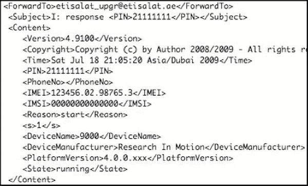
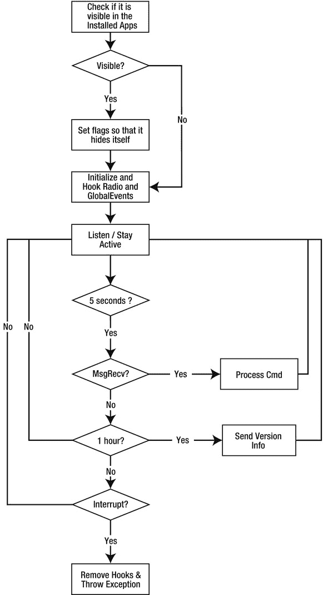
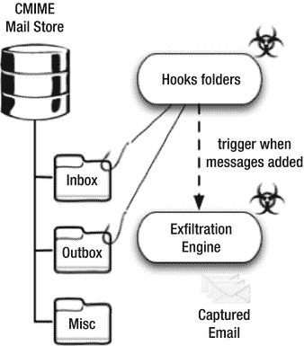
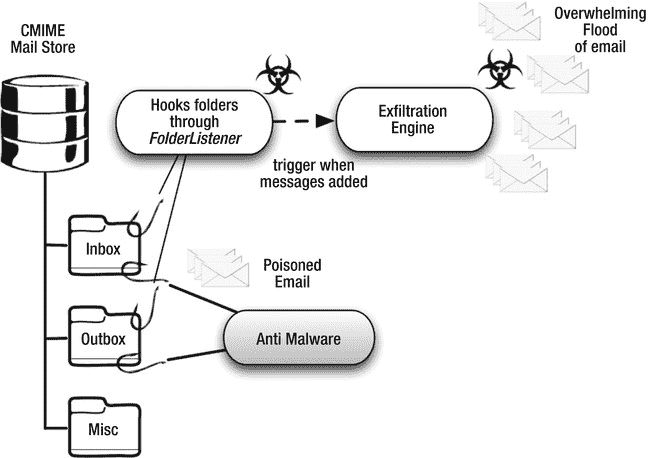

# 十、恶意软件和间谍软件

像个人电脑一样，移动智能手机也容易受到各种恶意软件的攻击。在本章中，我将把恶意软件和间谍软件统称为恶意软件。尽管我这样做了，但了解这些类型的恶意应用之间的区别是非常重要的。

*恶意软件*被定义为 驻留在用户电脑或智能手机上的任何恶意软件，其唯一任务是破坏数据、窃取个人信息或访问系统资源，以获得对其所在设备的完全控制。编写恶意软件的唯一目的是造成伤害；通常，恶意软件作者会编写恶意软件来针对操作系统或平台中的特定弱点。通常，恶意软件作者会希望最大化其恶意软件的传播，并寻求实现一种机制，使其软件能够将自身复制到其他类似的设备上。

*间谍软件* 是一个术语，用来指从设备中访问和窃取个人或私人信息的恶意软件。例如，在手机恶意软件的情况下，应用可能会跟踪最终用户的电子邮件、联系人列表、SMS 消息，甚至照片。间谍软件通常需要隐蔽并长时间驻留在设备上。因此，间谍软件作者的目标是在设备上执行很少或没有破坏性的活动，以便最终用户不知道她的数据被盗。几乎任何人都可以使用恶意软件；不再要求您知道如何自己编写恶意软件代码。

许多公司向个人、大公司甚至政府出售恶意软件(参见本章后面的案例研究)。我见过两种出售恶意软件的公司:一种卖给大型组织或政府，另一种卖给个人零售消费者。正如我们将在本章后面回顾的那样，一家大型中东电信提供商被发现在监视其整个黑莓用户群。有助于做到这一点的软件是由一家著名的专门从事合法监听的美国公司出售的。原来，源代码完全是从头开始开发的，它的唯一目的是从受感染的设备上捕获和泄露电子邮件。

另一方面，你会发现恶意软件或间谍软件被打包出售给任何愿意监视她认识的人。在大多数情况下，销售这类软件的公司会宣称“抓住出轨的配偶！”显然，这对一些人来说很有吸引力！我还将更详细地看一下这些版本的零售恶意软件。

恶意软件的四个阶段

我们可以将恶意软件操作分为四个不同但截然不同的阶段。虽然不是正式的，但这些阶段在大多数在设备上发现恶意软件的情况下都是可见的。

感染

这是恶意软件被引入设备的阶段。感染的圣杯是不涉及终端用户交互的圣杯。当恶意软件可以通过一些无害的方式复制到设备上时，就会发生这种情况，如向用户发送 SMS 消息或在无线网络上损害设备。

第二种感染方式是通过部分辅助行为。用户被要求单击恶意网站中的链接。一旦他这样做了，恶意软件就会把自己复制到设备上。攻击者通过 SMS 或电子邮件将此链接发送给用户。虽然有效，但这需要用户干预；在大多数情况下，勤奋的用户总是对点击发送给他们的随机链接持怀疑态度。

最后一种感染形式是攻击者通过 USB 端口或浏览网站，将恶意软件物理复制到设备上。这发生在攻击者和终端用户彼此认识，或者攻击者可以物理访问终端用户的设备的情况下。如果用户对其设备进行了密码保护，并且需要密码才能使用设备或在设备上安装应用，则此技术无效。

妥协

大多数情况下，感染和妥协是相伴而生的。在这种情况下，我使用单词 compromise 来描述恶意软件如何能够获得对设备的超级用户访问。因此，恶意软件可以以它选择的任何方式对设备配置进行更改 — ，而不需要设备所有者的交互。

正如我们在前面章节中看到的，运行在 Android 上的程序需要用户明确授权才能访问互联网或阅读电子邮件。在危害阶段，恶意软件将利用操作系统中的弱点来规避权限授予过程，从而允许它在用户不知情的情况下执行任何功能。

传播

除非专门针对个人，否则恶意软件作者通常会想要感染大量用户。他可能想要控制一大批设备，或者只是从许多不同的人那里获取私人信息。Zeus 特洛伊木马(在个人计算机平台上发现)将利用操作系统中的弱点进行传播。它的唯一目的是收集用户的按键，并收集银行和社交网站的凭据。

最近，另一种流行的传播甚至感染机制是使用谷歌 Android 市场(作者可以在这里出售或免费分发他们的应用)。恶意软件作者可以将游戏或社交网络互动工具等看起来无害的应用上传到 Android Market。当最终用户购买或下载该应用时，她的设备就会被感染。

渗出

恶意软件通常以个人或机密信息为目标。它可能会记录击键，试图获取网上银行和电子邮件等网站的用户名或密码。然而，仅仅收集这些信息是不够的。攻击者需要访问这些信息，因此恶意软件会找到一种“呼叫总部”或与远程服务器通信的方式，要么接收新的指令，要么上传捕获的信息。这个阶段叫做*渗出*。让我们来看一个案例研究，说明这是如何工作的。

案例研究 1:政府批准的恶意软件

2009 年 7 月，阿拉伯联合酋长国(UAE)的电信提供商 Etisalat 向其所有黑莓手机用户发送了一条短信,要求下载并安装系统补丁。该补丁旨在提高手机 3G 功能的性能。原来，这个“补丁”只不过是一个恶意软件，旨在读取每个用户的外发电子邮件。

直到今天，该公司仍坚称该补丁旨在提高性能。大多数检查过该恶意软件的研究人员，包括我自己和 Research In Motion (RIM )，都可以看到它没有任何性能上的好处。相反，检查代码会发现有人故意试图捕获设备所有者的所有外发电子邮件，并将其副本发送到提供商的服务器进行检查。

这个案件的标题，政府批准的恶意软件，可能有点强，特别是当你考虑到没有确凿的证据已经从这个案件的调查具体化。我选择这个标题是基于我在阿联酋工作的 11 年(其中 5 年为 Etisalat 工作)、最近的媒体事件，以及我对政府和监管机构控制该国媒体和通信基础设施的密切程度的了解。

我提到的媒体事件发生在 2010 年 8 月左右，当时阿联酋政府宣布，如果 RIM 公司不提供监控用户信息的手段，包括电子邮件和 BlackBerry Messenger(允许黑莓用户相互发送信息的本地消息平台)，它将关闭该国境内的所有黑莓服务。由于我不是在写间谍小说，我将为我的下一本书搁置我所有的理论，而是带你了解恶意软件本身的一些更真实的方面。在本案例研究中，我们将尝试唯一确定恶意软件感染的阶段。

感染

Etisalat 通过使用简单的 WAP-push 消息将恶意软件引入其用户的设备。这是一条出现在设备的 SMS 收件箱中的消息，它包含文本和 URL。WAP-push 消息的文本如下:

亲爱的 Etisalat BlackBerry 客户:

Etisalat 始终热衷于为您提供最佳的黑莓服务和终极体验，为此，我们将向您发送一个性能增强补丁，您需要将其安装在您的设备上。如需更多信息，请拨打 101

-

借助 Etisalat 的黑莓和移动解决方案提升您的业务

一旦用户点击附带的 URL，设备就会下载并安装一个名为 Registration 的应用。该设备将提示终端用户授予应用特定的权限。由于 WAP-push 消息来自看似合法的来源，大多数用户没有理由不信任该请求，并且通常授予应用完全权限。

妥协

在这种情况下，恶意软件没有依靠操作系统中的弱点来获取个人信息。用户认为应用是合法的，因此在安装阶段授予了所有必要的权限。

传播

Etisalat 发布的恶意软件旨在保留在设备上并收集信息。它不是为传播到其他设备而设计的。恶意软件依赖于 WAP-push 消息，而不是传播。安装将一次性完成，此后不会扩散。

渗出

这是 Etisalat 恶意软件最重要的阶段。它被设计成将自己附加到用户发送的电子邮件中，并向 Etisalat 内部的服务器发送每条外发邮件的副本。这由内置的 BlackBerry API 调用来完成。

图 10-1 中描述了一条真实的消息(恶意软件用来向服务器登记)。这是一条每小时发送到服务器的消息。然后，恶意软件系统的操作员可以看到哪些设备被恶意软件感染，包括哪些设备定期检查。



[图 10-1](#_Fig00101)T3。注册恶意软件使用的捕获的“心跳”消息

检测

这种特定的恶意软件之所以被检测出来，是因为它写得很糟糕。恶意软件一发布，本应接收泄漏数据的服务器就被信息淹没了。无法承受负载，服务器崩溃。这导致设备上的恶意软件不断重试连接到无响应的服务器。这种持续的连接尝试增加了设备本身的处理器使用率。

此时，最终用户开始注意到他们的设备性能缓慢，电池过早耗尽。一些用户甚至注意到他们的设备过热。这促使几名研究人员调查注册应用，于是他们发现这实际上是恶意软件。[图 10-2](#Fig00102) 显示了恶意软件安装在设备上时如何运行的流程图。以下是注册恶意软件特征的详细列表:

*   它检查它是否在 BlackBerry 安装的应用中被列为可见。
*   如果它是可见的，它会隐藏自己，不让订阅者看到。这可以防止用户找到并删除它。
*   它遍历手持设备上的所有邮件帐户，并将自己附加到每个帐户上，查找收到的电子邮件和 PIN 消息。
*   它截取并监控手持设备的状态，以发现发生的网络事件。当这些事件发生时，它通知服务提供商的服务器。
*   它监听通过电子邮件或 BlackBerry PIN 从特定地址收到的消息。这些控制消息可以启用或禁用对用户消息的拦截。
*   它定期向预定义的服务提供商服务器报告。
*   如果启用，应用会将订户发出的电子邮件的副本转发到服务提供商服务器。



[图 10-2](#_Fig00102)T3。Etisalat 恶意软件操作流程图

案例研究 2:零售恶意软件—FlexiSPY

现在让我们看看第二个恶意软件应用:FlexiSPY，一种零售恶意软件。当攻击者在目标设备上安装 FlexiSPY 时，它会窃听所有通信。最新版本的 FlexiSPY Omni 为 Android 用户提供了以下功能:

*   捕获短信和电子邮件
*   捕获通话记录
*   通过 GPS 和手机信号塔信息发现 GPS 位置
*   把手机变成监听设备
*   拦截电话
*   SIM 卡更换通知

对于监视任何人来说，这似乎已经足够了，我发现这个特性列表非常有趣，足以获得一个副本并对其进行分析。

**注意**本着全面披露的精神，我要提一下，在我评估 FlexiSPY 的时候，我查看了黑莓版本，因为那是我的主要手机。激活和启用设备的协议都是基于网络的，所以它们或多或少保持相同，不管支持的设备平台是什么(当然包括 Android)。

一旦买家支付了 349 美元，她就会收到一本用户手册，上面提供了如何在目标客户的手机上安装该应用的信息。当浏览用户手册时，首先映入我眼帘的是它提供了*。。。明确指示* *将黑莓手持设备的默认权限设置为允许所有* **。**

这意味着，不仅仅是 FlexiSPY，目标安装在手机上的每一个应用都可以获得对手持设备的完全控制(在编程接口或 API 的范围内)。显然，在这种情况下，用户保护并不是最重要的。类似地，查看 FlexiSPY 的 Android 手册，在您可以成功地在设备上安装恶意软件之前，设备本身必须是根。该网站以*超级一键点击*的形式提供了一个根设备的解决方案。除了这段文字，该网站没有提供直接链接。找到漏洞是客户的责任。

FlexiSPY 需要激活才能开始监视目标。为此，用户必须拨打号码 *#900900900 ，这将激活一个隐藏的屏幕。在此屏幕上，系统会提示用户输入激活码。从来没有一个离开家没有我最喜欢的网络数据包嗅探器，Wireshark，我嗅探了激活过程中通过的流量。以下是通过网络传递的信息:

*   邮件/t4l-mcli/cmd/productactivate？模式=【0】&【查看】【0302】&【PID =【FSP _ bb _ v 4.2】&【act code】【启用代码】&散列=)

此请求是向具有下列二级域的服务器发出的:

```java
aabackup.info
```

它解析为与之前列出的主机 djp.cc 相同的 IP 地址。正如你所看到的，手机的 IMEI 被发送回 FlexiSPY 总部。还可以看到激活码，它返回一个哈希值。看起来手机计算了一个类似的算法，并等待一个匹配的散列。一旦收到正确的散列，应用就被激活。

从这一点上说，这是一个配置应用拦截短信，电子邮件，通话记录，等等。该应用有一个通过短信的命令通道。因此，您有一个包含八个命令的列表，它们执行以下操作:

*   开始捕获:开始捕获事件，如电子邮件、SMS、位置等。
*   停止捕获:停止已经开始的捕获。
*   立即发送:将所有收集的事件发送到中央日志记录主机。
*   发送诊断信息:发送诊断信息。
*   启动 SIM 卡监视器:观察任何改变 SIM 卡的企图。
*   停止 SIM 卡监控:停止监控 SIM 卡。
*   启动麦克风监听:等待触发号码的来电。
*   停止麦克风监听:停止监听来自该触发号码呼叫。

有趣的是，命令频道 SMS 消息不能被删除，所以手册建议用户选择像“早上好”或类似的短语来开始捕捉信息。措辞应该选择得不会引起目标的怀疑。

请记住，我在 BlackBerry 版本的 FlexiSPY 上执行了前面的检查。考虑到运行 Java 的每个平台的相似性，Android 也会以相似的方式运行。

反取证

目前，最广泛使用的检测机制 是基于签名的。这意味着任何反恶意软件公司编写删除或检测功能需要事先了解恶意软件*。如果它遇到它，那么它可以删除它。因此，不太可能检测到新的恶意软件。这是不幸的，因为如果反恶意软件公司无法跟上恶意软件的发展，那么从恶意软件发布到发现并解决它总是有一个滞后。在此滞后期间，所有用户都面临风险。*

 *作为开发人员，您无法直接控制用户是否选择安装反恶意软件应用。您的责任在于确保您的应用安全地处理其数据。我们在前面的章节中已经介绍了这些技术中的大部分，但是我想强调另一个可用的、非正统的选项:反取证。

*反取证*是一种 技术，用于通过降低可收集信息的质量来挫败对计算机或移动设备的取证分析。法医分析包括检查这种设备的证据。大多数情况下，需要收集的证据非常脆弱。反取证试图通过使用定期运行的自动化工具来销毁这些信息。然后，当进行法医分析时，调查人员只会发现乱码或无用的数据。这大大降低了可检索信息的质量。我们可以使用类似的技术来阻止恶意软件的行为。

我将从一个简单的例子开始:假设您的应用读写设备的消息存储。既然可以接触到这些数据，就可以人为生成邮件信息，随意删除。假设在设备上安装了等待复制进入收件箱的消息的恶意软件应用。通过生成许多虚假消息，然后定期删除它们，您正在为恶意软件提供低质量、无用的数据。如果操作正确，这个过程会使恶意软件作者提取有效信息变得非常繁琐。这个概念在[图 10-3](#Fig00103) 和[图 10-4](#Fig00104) 中进行了说明。



[图 10-3](#_Fig00103)T3。恶意软件拦截邮件信息



[图 10-4](#_Fig00104)T3。生成假消息T5】

这种技术可以被认为有点咄咄逼人；显然，最终用户应该同意您的应用的这种行为。我在这里提到它是作为另一种要考虑的技术。至于如何想出击败恶意软件的额外机制，我将留给你的想象力。然而，除非你的主要目标是开发这样的反恶意软件应用，否则你可以选择跳过它们。

摘要

在本章中，我们看了恶意软件和间谍软件以及它们是什么。我们还研究了恶意软件的各个阶段，以及我们如何将它们分成几大类。我们了解到恶意软件可以被任何人使用，并且有许多商业实体向个人和公司消费者提供恶意软件。我们的案例研究涉及 2009 年发生的真实世界恶意软件感染，当时阿联酋的电信提供商之一 Etisalat 将其整个黑莓用户群置于间谍软件应用之下。

我们已经看到，作为一名应用开发人员，您通常在控制什么样的恶意软件被引入设备方面能力有限。相反，您的目标是安全地处理应用的数据(和最终用户数据)。我们非常简要地讨论了一个主题，即如何使用一些反取证技术有目的地向恶意软件提供无用的数据，从而迫使恶意软件作者费力地通过这些消息找到真正的消息。虽然这绝不是一个万无一失的解决方案，但这种技术主要是作为一种威慑。除非恶意软件作者专门针对你，否则他不太可能浪费时间筛选无用的数据。相反，他会把注意力转移到下一个被他感染的人身上。*