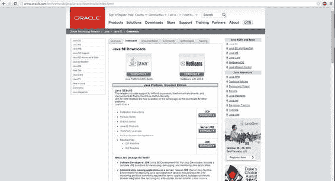
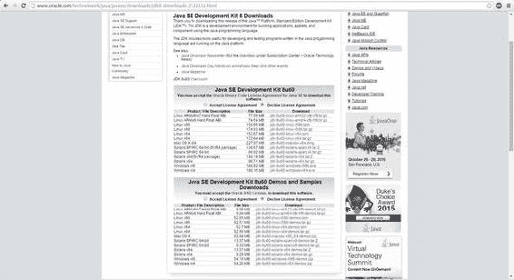
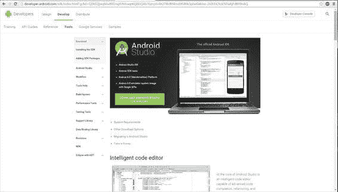
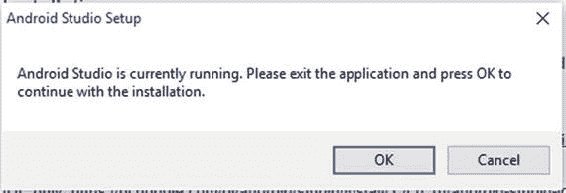
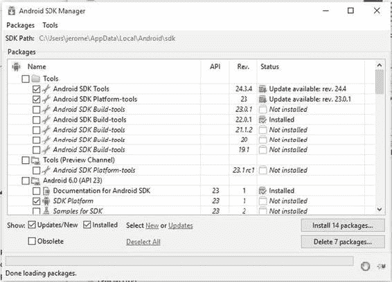
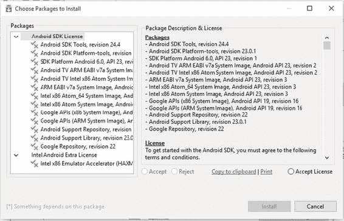

# 一、设置 Android Studio

欢迎来到*安卓工作室游戏开发*。这本书聚焦于在 Android Studio 中执行的游戏开发过程中的特定任务。在本章中，您将安装 Android Studio 和所需的 Java 开发工具包(JDK) 。本章结束时，你将拥有一个实用的 Android Studio 集成开发环境(IDE) ，你可以用它来开发令人惊叹的基于 Android 的游戏。开始吧！

## 安装 JDK

您要执行的第一步是下载并安装 JDK。因为 Android 应用程序——包括游戏——是用 Java 开发的，Android Studio 需要 JDK 来运行。JDK 包括很多 Java 工具，比如编译器( javac ) 、文档生成器( javadoc ) 、key tool ( keytool )。

**注意**虽然大部分安卓应用确实是完全用 Java 开发的，但是你可以通过使用安卓原生开发套件(NDK)用 C 或 C++来部分开发安卓应用和游戏。对于希望在不同版本之间共享一个公共库的开发人员来说，这是一个特别受欢迎的选择——例如，在为 Android 和 iPhone 开发同一款游戏时，您可以移植一个用两个系统都可以本地解释的公共语言编写的库。

在 www.oracle.com/technetwork/java/javase/downloads/index.html 的可以找到 JDK。[图 1-1](#Fig1) 说明了 JDK 下载页面。

###### [图 1-1](#_Fig1) 。JDK 下载页面

选择下载 JDK 的选项，您将被引导至图 1-2 所示的页面。

###### [图 1-2](#_Fig2) 。许可协议页面

接受许可协议后，下载 JDK 的链接将会激活。此时，您只需要下载 JDK，而不是演示或示例。和往常一样，确保你为你的系统下载了正确版本的 JDK，如果你在基于 32 位 Intel x86 的指令芯片组上运行 Linux，你下载 jdk- <版本> -linux-i586.tar.gz ，而如果你运行 64 位 Windows，你下载 jdk- <版本> -windows-x64.exe 。

下载了与您的系统兼容的 JDK 版本后，运行该文件并安装 JDK。我很幸运地简单执行了安装包并接受了所有的默认设置。

安装 JDK 后，您需要在特定系统上为 JDK 设置一个 path 环境变量。环境变量告诉应用程序在哪里可以找到 JDK。因为 Android Studio 依赖于 JDK，所以它需要知道在你的系统上哪里可以找到它。在这种情况下，变量需要命名为 JAVA_HOME 。

**注意**您的系统上可能已经有了 Java_HOME 环境变量，尤其是如果您过去使用过 JAVA、JAVA 软件开发工具包(SDK)或 JDK。然而，仔细检查也无妨。

在 Windows 10 上，通过按下 Win+Break 键来设置这个变量。在那里，选择高级系统设置环境变量。现在，创建一个名为JAVA _ HOMET3】的新环境变量，并设置为您的 JDK 文件夹的路径。

安装 JDK 后，您可以继续安装 Android Studio。

## 安装 Android Studio

安卓工作室下载可以在[【http://developer.android.com/sdk/index.html】](http://developer.android.com/sdk/index.html)T3【找到。[图 1-3](#Fig3) 说明了 Android Studio 下载页面。

###### [图 1-3](#_Fig3) 。Android 开发者，Android Studio 下载页面

一旦你点击下载 Android Studio 按钮，你会看到一个条款和条件协议。接受条款和条件，激活下载链接，见[图 1-4](#Fig4) 。

###### [图 1-4](#_Fig4) 。条款和条件页面

下载安装程序后，您可以将 Android Studio 安装到您的系统中。执行安装程序，按照提示安装 Android Studio。我非常幸运地接受了安装程序提供的所有默认选项。

这个安装程序设置 Android Studio IDE，并为环境的运行方式和位置设置默认选项。它还设置模拟器的默认大小。

**注意**虽然模拟器是一个很棒的工具，并且可以用于调试，但我发现使用 Android 手机(或其他 Android 设备)进行调试要容易得多，也快得多。模拟器加载运行应用程序的速度往往很慢。如果您正在开发商业风格的软件，这对您来说可能不是问题。然而，我发现对于游戏开发来说，模拟器运行速度太慢，GPU 模拟不够准确，无法运行完全模拟的游戏。因此，如果你有一个 Android 设备，将它置于开发者模式，并用于调试(将在本书后面讨论)。

既然已经安装了 Android Studio，是时候更新它了。

## 更新 安卓工作室

第一次打开 Android Studio。IDE 可能看起来不熟悉，但是我们现在不要担心它；您将在第 3 章中浏览 IDE。现在，让我们看看您可能已经收到的通知。

Android Studio 很可能会在 ide 的右侧弹出一个或多个通知。图 1-5 和 [1-6](#Fig6) 说明了这些通知。

###### [图 1-5](#_Fig5) 。Android Studio 更新通知

###### [图 1-6](#_Fig6) 。Android Studio SDK 更新通知

根据您下载和发布 Android Studio 新版本的时间，可能会有更新。Android Studio 更新的好处是它们相当无痛。

点击通知中的更新链接，开始图 1-5 所示的更新。点击这个链接会把你带回 Android 开发者网站，在那里所需的可执行文件会被自动下载，如图[图 1-7](#Fig7) 所示。

###### [图 1-7](#_Fig7) 。Android 更新下载页面

一旦你的更新被下载，在你执行它之前，你必须关闭 Android Studio。如果没有，你会得到一个温和的提醒，如图 1-8 中的[所示。](#Fig8)

###### [图 1-8](#_Fig8) 。关闭 Android Studio 的提醒

图 1-5 所示的这种更新是对 Android Studio 的整体更新。然而，[图 1-6](#Fig6) 中的更新略有不同:这是一次组件更新。此更新将更改您的 Android SDK。

**注意**只有在您的系统上安装了现有版本的 Android Studio 时，此步骤才适用。SDK 管理器虽然仍然是 Android Studio 的重要组成部分，但在最新版本的 Android Studio 中会略有不同。如果您安装了新版本的 Android Studio，请随意跳过这一部分。

通过单击通知中的更新链接，以与启动 Android Studio 更新相同的方式启动 SDK 更新。现在可以看出这两种类型的更新之间的差异。

Android Studio 提示您通过关闭 Android Studio 来完成更新，并允许它打开 Android SDK 管理器。Android SDK 管理器如[图 1-9](#Fig9) 所示。

###### [图 1-9](#_Fig9) 。Android Studio，Android SDK 管理器

Android SDK 管理器跟踪和管理各种 Android SDK 的所有组件，这些组件适用于您的系统，并且已经安装在您的系统上。例如，如果您想了解您的应用程序在 Android Jelly Bean 下如何运行，您可以从这个屏幕安装 SDK。

现在，您只需点击标签为 Install <number>Packages 的按钮来安装或更新推荐的组件。点击该按钮显示如图[图 1-10](#Fig10) 所示的许可协议窗口。</number>

###### [图 1-10](#_Fig10) 。许可受理窗口

接受许可协议并开始更新。更新完成后，重启 Android Studio。

应用所有更新后，您就可以开始探索 Android Studio IDE 了。在下一章中，你将会发现使 Android Studio 成为一个伟大的 IDE 的所有特性和工具。