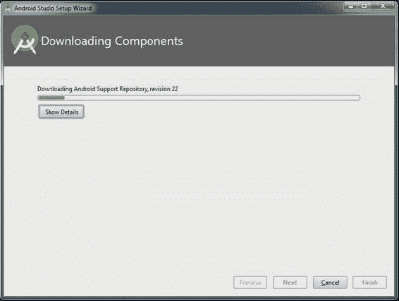
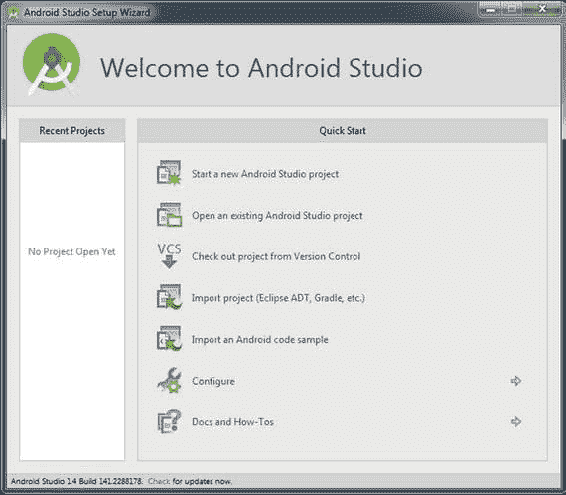
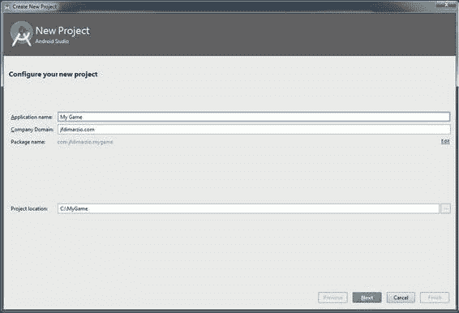
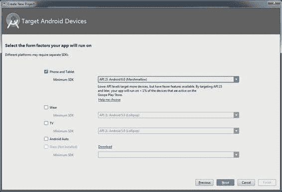
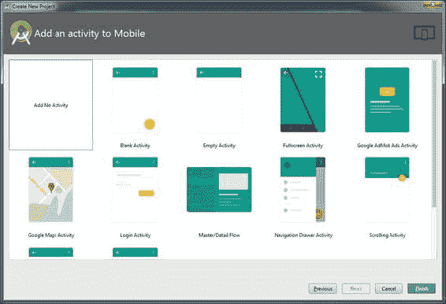
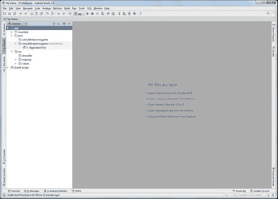

# 第章 2

# 创建新项目

在前一章中，您安装了 Android Studio。在这一章中，你将创建一个新的 Android 项目来突出 Android Studio 的一些特性。Android 项目是组成应用程序的所有文件的主要存储库。

## 第一次打开 Android Studio

如果这是你第一次打开 Android Studio，它首先会尝试更新一些功能组件。在 Android Studio IDE 打开之前，你可能最终会看到如图 2-1 所示的窗口。

###### [图 2-1](#_Fig1) 。更新窗口

**注意**我知道 Android Studio 似乎正在进行大量更新。然而，直到现在，IDE 还没有运行，它需要确保您拥有自信运行所需的一切。

下载并安装所有更新后，你会看到 Android Studio 欢迎屏幕，如图 2-2 所示。

###### [图 2-2](#_Fig2) 。Android Studio 欢迎屏幕

在下一节中，您将创建一个在 Android Studio 中运行的新项目。

## 创建新项目

Android Studio 欢迎屏幕为您提供了几个选项。在此窗口中，您可以创建一个新项目，打开或导入一个现有项目—从 Android Studio 或另一个兼容的 IDE，或者选择 Android Studio 的配置设置。让我们选择标记为开始一个新的 Android Studio 项目的选项。

选择该选项将打开新项目配置窗口，如图 2-3 所示。在此窗口中，您将输入项目的名称和位置。

###### [图 2-3](#_Fig3) 。Android Studio 新项目配置窗口

在应用程序名称文本框中输入名称，将项目命名为 **My Game** 。接下来，在代表您的项目的公司域文本框中输入一个名称。Android Studio 试图通过使用您在公司域文本框中输入的内容来自动命名您的 Java 包。

如果要更改系统中保存项目的默认位置，可以在项目位置文本框中进行更改。点击下一步按钮，进入目标 Android 设备窗口。

目标 Android 设备窗口，如图 2-4 所示，让你选择应用程序运行的目标。如果您要创建 Android Wear 或 Android Auto 应用程序，请在此处选择。因为此项目将用于游戏开发，所以请选中“手机和平板电脑”复选框。

###### [图 2-4](#_Fig4) 。目标 Android 设备窗口

最低 SDK 下拉列表配置应用程序运行的最低操作系统级别。通过项目的配置，Android 允许你瞄准特定的设备。这让您可以在开发过程中预测可以使用什么操作系统级别的工具集来创建您的应用程序。

Android Studio 为您显示每个目标 SDK 的安装统计数据，并自动为您选择安装基数最大的最小 SDK。截至本书写作之时，那个 SDK 还是果冻豆。

**注意**虽然棉花糖在[图 2-4](#Fig4) 中是可选的，但是你可以看到一个只在这个 SDK 上运行的项目只能在当前安装基础的不到 1%上运行。

单击“下一步”进入“将活动添加到移动设备”窗口。

在[图 2-5](#Fig5) 所示的“添加活动到手机”窗口中，你选择你希望 Android 默认为你创建的活动类型。为了创建游戏项目，请选择“不添加活动”，然后单击“完成”。

###### [图 2-5](#_Fig5) 。向移动窗口添加活动

当 Android Studio 编译完您选择的选项后，Android Studio IDE 将会打开，如图[图 2-6](#Fig6) 所示。

###### [图 2-6](#_Fig6) 。Android Studio IDE

在下一章中，您将浏览 IDE 的特性，并学习如何识别用于开发的窗口。