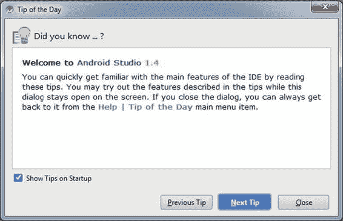
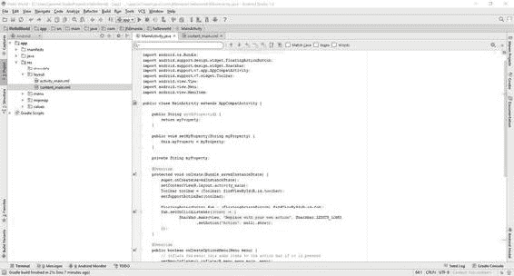
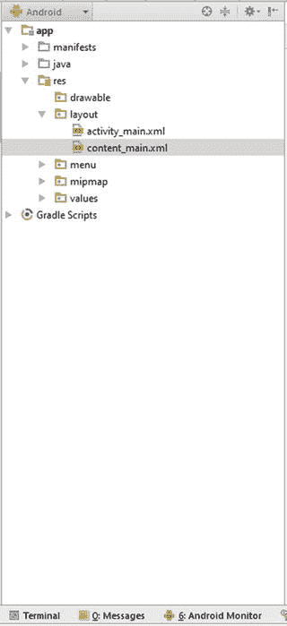
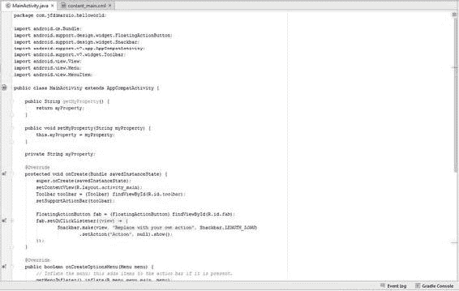
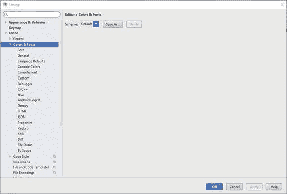
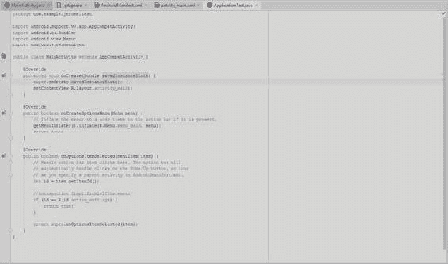
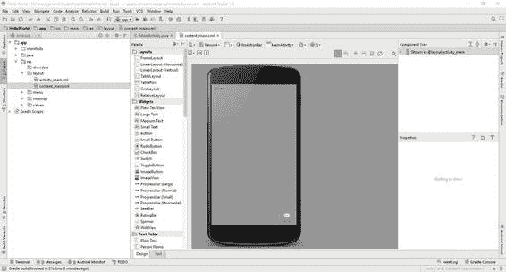
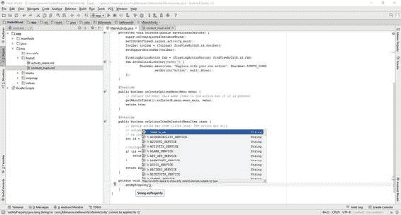
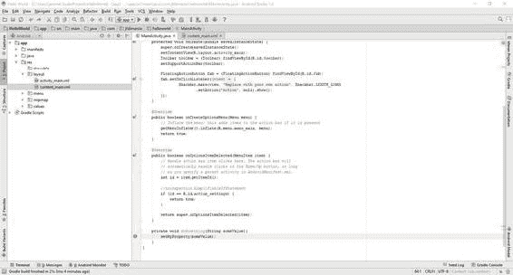
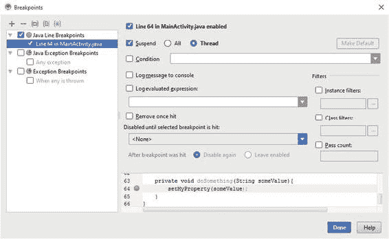

# 三、探索 IDE

在本章中，你将探索 Android Studio IDE 接口。Android Studio 中的许多工具和功能有助于简化 Android 应用的开发过程。本章包括以下内容:

*   Android Studio 的布局
*   IntelliJ
*   断点

请记住，Android Studio 是一个巨大的、功能齐全的 IDE，我不可能在这本迷你书中涵盖它所有令人惊叹的功能。然而，在本章结束时，你会对 Android Studio 的主要特性足够熟悉，从而使在 Android 平台上开发游戏的过程变得更加容易。

**注意**如果你熟悉任何其他 ide，比如 Eclipse、NetBeans 或 Visual Studio，本章将帮助你把你以前的经验用在 Android Studio 中。

打开 Android Studio 时，你会看到一个弹出的每日提示窗口，如图 3-1 所示。许多人会立即取消选中“启动时显示提示”复选框，但你可以通过在打开 Android Studio 时快速浏览这个弹出窗口来学习一些有用的技巧。我建议让它开着，至少开一小会儿。



###### [图 3-1](#_Fig1) 。弹出每日提示

现在，我们来看看 Android Studio 及其特性是如何布局的。

## Android Studio Windows

Android Studio 布局在一系列窗口中。这些窗口包含开发应用所需的工具和功能。打开 Android Studio，你会看到一个类似于[图 3-2](#Fig2) 的界面。



###### [图 3-2](#_Fig2) 。Android Studio 界面

你在图 3-2 中看到的是你在 Android Studio 中开发时会用到的三个主要窗口中的两个:项目窗口和代码编辑器。

### 项目窗口

[图 3-3](#Fig3) 中的所示的*项目窗口* 为您列出了所有存在的项目及其各自的文件。这为您提供了一种在项目中导航的简单方法。



###### [图 3-3](#_Fig3) 。项目窗口

**注意**所有的 Android 项目，不管最终的应用是什么，都应该有相同的文件结构。您的类位于 src 文件夹中，您的 XML 和资源位于 main 文件夹中，您引用的外部库位于 libs 文件夹中。

要添加一个新文件——不管是类、图像还是其他什么——你可以右键单击项目窗口的适当文件夹并选择要添加的新的 <文件类型>,或者你可以从 Android Studio 外部拖动一个现有的文件并将其放入项目窗口中所需的文件夹。

通过双击项目窗口中的文件，Android Studio 将尝试在其相应的编辑器窗口中打开该文件。例如，类和其他代码文件将在代码编辑器中打开，布局文件将在布局编辑器中打开，图像将在图像查看器中打开。

### 代码编辑器

代码编辑器 是你使用 Android Studio 进行大量工作的地方。这个窗口是执行所有类和 XML 开发的地方。[图 3-4](#Fig4) 说明了代码编辑器。



###### [图 3-4](#_Fig4) 。Android Studio 代码编辑器

该窗口中的代码用颜色突出显示，以便于阅读。许多开发者对这个窗口做的一个改变是把它变暗。许多开发人员往往会因为长时间查看白色背景上的默认彩色文本而感到头痛和眼疲劳。将代码编辑器背景更改为黑色会有所帮助。

Android Studio 提供了一个*编辑器*主题来帮助开发者改变这个窗口的外观。从“文件”菜单中，选择“设置”。这将打开如图[图 3-5](#Fig5) 所示的设置窗口。



###### [图 3-5](#_Fig5) 。设置窗口

从这里，选择编辑器和颜色&字体。“方案”下拉列表允许您选择 Darcula 主题。这会使代码编辑器背景变暗，如图 3-6 中的[所示。](#Fig6)



###### [图 3-6](#_Fig6) 。Darcula 主题后的代码编辑器

在本章的后面，当我探索 IntelliJ 时，我会介绍更多关于代码窗口的编辑器。

### 布局编辑器

*布局编辑器* 是一个强大的图形工具，允许您创建和布局您的 Android 应用屏幕。虽然如果你只是专注于游戏开发，你可能不会经常使用这个编辑器，但是你仍然应该熟悉它的功能。[图 3-7](#Fig7) 说明了布局编辑器。



###### [图 3-7](#_Fig7) 。版面编辑

在布局编辑器中，您可以将小部件拖放到不同 Android 设备的模型上。这使您可以直观地展示应用的设计，几乎可以立即看到它在成品设备上的外观。

然而，为了进一步调整，您总是可以通过选择编辑器底部的 text 选项卡将编辑切换到 XML 文本视图。(如前面的[图 3-7](#Fig7) 所示，文本选项卡在设计选项卡旁边。)

现在您已经找到了 Android Studio 中使用的两个主要编辑器，是时候探索它最强大的特性之一了:IntelliJ 集成。

## IntelliJ

IntelliJ ，或 IntelliJ IDEA，是由 JetBrains 开发的 Java IDEA 。由于其强大的特性集，它已经成为 Java 开发的事实上的 IDE。Android Studio 基于 IntelliJ IDEA 的开源社区版。这意味着许多使 IntelliJ IDEA 成为 Java 开发的非凡 IDE 的特性也使 Android Studio 成为 Android 的 Java 开发的非凡 IDE。

让我们回到代码编辑器，看看 Android Studio 和 IntelliJ 是如何处理代码生成的。

### 代码生成

IntelliJ 通常有很多特性，它也有一整套工具来帮助代码生成。接下来的章节只涵盖了你在游戏开发过程中最有可能经常遇到的问题。

**注**要获得 IntelliJ 提供的功能的完整列表，请访问 www.jetbrains.com/idea/help/intellij-idea.html 的T3。

### Getters 和 Setters

当用 Java 或者其他语言创建属性时，不断地创建 getters 和 setters 会很乏味。IntelliJ 为你简化了这个过程。例如，在编辑器中编写以下代码:

```java
private String myProperty;
```

将光标放在 myProperty 旁边，然后按 Alt+Insert。这将打开一个 IntelliJ 上下文窗口。在这个窗口中，您可以选择 getter 和 setter，Android Studio 会自动构建您合适的 Java getter 和 setter 代码:

```java
public String getMyProperty() {
    return myProperty;
}

public void setMyproperty(String myProperty) {
    this.myProperty = myProperty;
}
```

### 自动完成

自动完成是 IntelliJ 在 Android 开发中最常用的特性之一。假设我们创建了一个函数，如下所示:

```java
private void DoSomething(String someValue){
    setMyProperty();
}
```

这个简单的函数接受字符串变量 someValue 。注意，该函数调用了 setMyProperty() 。我们知道 setMyProperty() ，它是 IntelliJ 为我们创建的 setter，接受一个字符串值。将光标放在 setMyProperty() 的括号内，按 Ctrl+Alt+Space。这将打开 IntelliJ 自动完成窗口，如图 3-8 所示。



###### [图 3-8](#_Fig8) 。IntelliJ 自动完成窗口

关于这个窗口值得注意的一点是，它不仅列出了可以传递到 setMyProperty() 中的可用字符串值，而且还按照它认为您最有可能使用的值对它们进行了排序。在这种情况下，首先显示的是some value——传递给我们函数的值。

## 断点

在本书的后面，我将带你调试你的游戏。然而，让我们花一点时间来讨论断点。*断点* 就像你代码中的书签，告诉 Android Studio 在你调试的时候你想在哪里暂停执行。

若要放置断点，请在代码编辑器的右边空白处，单击要暂停代码执行的行旁边。设置的断点如图[图 3-9](#Fig9) 所示。



###### [图 3-9](#_Fig9) 。设置断点

Android Studio 中断点的一个很棒的地方就是你可以用条件来设置它们。如果你右击你的断点，你会得到一个可以展开的上下文菜单，如[图 3-10](#Fig10) 所示。



###### [图 3-10](#_Fig10) 。断点上下文菜单

在此窗口中，您可以设置断点的条件。例如，如果您有一个名为 myInteger 的整数值，并在其上设置了断点，那么您可以设置一个条件，仅当 myInteger 的值大于 100 时才中断。任何可以评估为真或假的条件都可以用作断点条件。

在我们 Android Studio 之旅的最后一部分，[第 4 章](04.html)以设置 GitHub 作为你的版本控制系统结束。