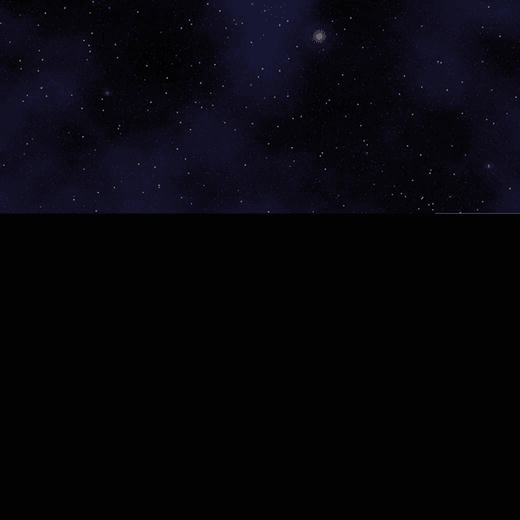
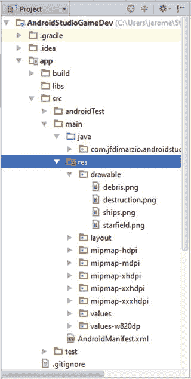
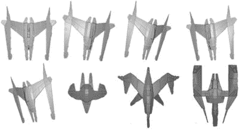

# 七、加载图像和子图片

如果没有图像，安卓游戏就不会那么有趣了。我们都能记住标志性的视频游戏图像，如马里奥、《我的世界》的史蒂夫和军士长。在本章中，你将加载一个图像到你的游戏中，并把它作为纹理映射到你在前一章中创建的多边形上。

你正在处理的图像是一个星域，如图 7-1 所示。



###### [图 7-1](#_Fig1) 。星域图像

## 将图像添加到项目中

在使用图像之前，您需要将其添加到项目中。将图像添加到项目时，有两件事必须确认。

首先，图像的大小需要是 2 的倍数，OpenGL ES 才能正常工作。这意味着你的形象也必须是方的。[图 7-1](#Fig1) 中的星域是一幅 512×512 的图像。我已经养成了以 512×512 的分辨率加载所有图片的习惯。OpenGL ES 可以处理任何符合这个参数的图像，所以 32×32 甚至 256×256 都是有效的。

第二，Android Studio 项目窗口需要在项目视图中，而不是 Android 视图中，以便能够通过使用拖放向您的项目添加图像。要确认这一点，请查看项目窗口的右上角；一个下拉控件默认指示 Android 或者 Project。还有其他选项，但是现在您只想确认您的窗口是否在项目视图中。

现在，您可以将图像添加到您的项目中。

展开你的项目树，打开资源文件夹 res ，如图[图 7-2](#Fig2) 所示。



###### [图 7-2](#_Fig2) 。项目窗口中的 res 文件夹

resources 文件夹中应该有一个名为 drawable 的文件夹。如果该文件夹不存在，请随意创建。您所有的图像都将被放入 drawable 文件夹中。将您的图像从桌面拖放到此文件夹中。

图像在你的项目中之后，你可以把它作为一个纹理，加载到游戏中。

### 加载图像

在前一章中，你创建了星域级。这个类在当前状态下创建一个多边形。在本节中，您将向该类添加一个 loadTexture() 方法，以允许您的图像被加载到 Starfield 类中。然后将它映射到多边形上。

将以下方法添加到您的 Starfield 类中:

```java
public void loadTexture(int texture, Context context) {
    InputStream imagestream = context.getResources().openRawResource(texture);
    Bitmap bitmap = null;

    android.graphics.Matrix flip = new android.graphics.Matrix();
    flip.postScale(-1f, -1f);

    try {

        bitmap = BitmapFactory.decodeStream(imagestream);

    }catch(Exception e){

    }finally {
        try {
            imagestream.close();
            imagestream = null;
        } catch (IOException e) {
        }
    }

    GLES20.glGenTextures(1, textures, 0);
    GLES20.glBindTexture(GLES20.GL_TEXTURE_2D, textures[0]);

    GLES20.glTexParameterf(GLES20.GL_TEXTURE_2D, GLES20.GL_TEXTURE_MIN_FILTER, GLES20.GL_NEAREST);
    GLES20.glTexParameterf(GLES20.GL_TEXTURE_2D, GLES20.GL_TEXTURE_MAG_FILTER, GLES20.GL_LINEAR);

    GLES20.glTexParameterf(GLES20.GL_TEXTURE_2D,
           GLES20.GL_TEXTURE_WRAP_S, GLES20.GL_REPEAT);
    GLES20.glTexParameterf(GLES20.GL_TEXTURE_2D,
           GLES20.GL_TEXTURE_WRAP_T, GLES20.GL_REPEAT);

    GLUtils.texImage2D(GLES20.GL_TEXTURE_2D, 0, bitmap, 0);

    bitmap.recycle();
}
```

这个类接受一个 int 纹理，它将是一个指向 res/drawable 文件夹中资源的指针。在本节的后面，您将从游戏循环中传递这个内容。

需要注意的一点是:在行中 gles 20 . gltexparameter f(gles 20。2D 纹理，GLES20。GL_TEXTURE_WRAP_S，GLES20。【GL _ REPEAT】， GL_REPEAT 使纹理(图像)在你映射到的多边形上移动时自我重复。把它想象成你在盒子外面移动的包装纸:当你向任何方向移动纸时，图像将继续重复。

为了防止图像重复，使用 GL_CLAMP_TO_EDGE 。然而，在这种情况下，您使用重复使星域看起来好像是无限滚动。

接下来，向类中添加一些变量来处理纹理操作:

```java
private float texture[] = {
        -1f, 1f,
        -1f, -1f,
        1f, -1f,
        1f, 1f,
};

private int[] textures = new int[1];
private final FloatBuffer textureBuffer;
static final int COORDS_PER_TEXTURE = 2;
public static int textureStride = COORDS_PER_TEXTURE * 4;
Add a new texture buffer to the Starfield constructor.
        bb = ByteBuffer.allocateDirect(texture.length * 4);
        bb.order(ByteOrder.nativeOrder());
        textureBuffer = bb.asFloatBuffer();
        textureBuffer.put(texture);
        textureBuffer.position(0);
```

**注意**如果看起来令人困惑，这些类的完整文本包含在本节的末尾。

现在，编辑 Starfield 的 draw() 方法 ，将纹理绑定到多边形上。这里展示了整个 draw() 方法，因为操作的顺序很重要:

```java
public void draw(float[] mvpMatrix) {

    GLES20.glUseProgram(mProgram);

    mPositionHandle = GLES20.glGetAttribLocation(mProgram, "vPosition");

    GLES20.glEnableVertexAttribArray(mPositionHandle);

    int vsTextureCoord = GLES20.glGetAttribLocation(mProgram, "TexCoordIn");

    GLES20.glVertexAttribPointer(mPositionHandle, COORDS_PER_VERTEX,
            GLES20.GL_FLOAT, false,
            vertexStride, vertexBuffer);

    GLES20.glVertexAttribPointer(vsTextureCoord, COORDS_PER_TEXTURE,
            GLES20.GL_FLOAT, false,
            textureStride, textureBuffer);

    GLES20.glEnableVertexAttribArray(vsTextureCoord);

    GLES20.glActiveTexture(GLES20.GL_TEXTURE0);
    GLES20.glBindTexture(GLES20.GL_TEXTURE_2D, textures[0]);
    int fsTexture = GLES20.glGetUniformLocation(mProgram, "TexCoordOut");
    GLES20.glUniform1i(fsTexture, 0);
    mMVPMatrixHandle = GLES20.glGetUniformLocation(mProgram, "uMVPMatrix");
    GameRenderer.checkGlError("glGetUniformLocation");
    GLES20.glUniformMatrix4fv(mMVPMatrixHandle, 1, false, mvpMatrix, 0);
    GameRenderer.checkGlError("glUniformMatrix4fv");
    GLES20.glDrawElements(GLES20.GL_TRIANGLES, drawOrder.length, GLES20.GL_UNSIGNED_SHORT, drawListBuffer);

    GLES20.glDisableVertexAttribArray(mPositionHandle);
}
```

在下一节中，您将添加使图像滚动所需的代码。

### 使图像滚动

需要做两个改变来允许你的图像滚动。第一个是对片段着色器，第二个是对 draw() 方法。

片段着色器是图像实际滚动的地方。将片段着色器更改为如下所示:

```java
private final String fragmentShaderCode =
        "precision mediump float;" +
        "uniform vec4 vColor;" +
        "uniform sampler2D TexCoordIn;" +
        "uniform float scroll;" +
        "varying vec2 TexCoordOut;" +
        "void main() {" +
        " gl_FragColor = texture2D(TexCoordIn, " +
        "    vec2(TexCoordOut.x ,TexCoordOut.y + scroll));" +
        "}";
```

注意，您已经添加了一个名为 scroll 的浮点变量，并且您正在将该变量的值添加到 TexCoordOut.y 中。这有效地沿 y 轴移动了图像。要沿着 x 轴滚动，您可以将滚动条中的值添加到 TextCoordOut.x 中。

随着着色器逻辑的完成，您需要一种方法来更改滚动值。这是在 draw() 方法中完成的:

```java
public void draw(float[] mvpMatrix, float scroll) {

    GLES20.glUseProgram(mProgram);

    mPositionHandle = GLES20.glGetAttribLocation(mProgram, "vPosition");

    GLES20.glEnableVertexAttribArray(mPositionHandle);

    int vsTextureCoord = GLES20.glGetAttribLocation(mProgram, "TexCoordIn");

    GLES20.glVertexAttribPointer(mPositionHandle, COORDS_PER_VERTEX,
            GLES20.GL_FLOAT, false,
            vertexStride, vertexBuffer);

    GLES20.glVertexAttribPointer(vsTextureCoord, COORDS_PER_TEXTURE,
            GLES20.GL_FLOAT, false,
            textureStride, textureBuffer);

    GLES20.glEnableVertexAttribArray(vsTextureCoord);

    GLES20.glActiveTexture(GLES20.GL_TEXTURE0);
    GLES20.glBindTexture(GLES20.GL_TEXTURE_2D, textures[0]);
    int fsTexture = GLES20.glGetUniformLocation(mProgram, "TexCoordOut");
    int fsScroll = GLES20.glGetUniformLocation(mProgram, "scroll");
    GLES20.glUniform1i(fsTexture, 0);
    GLES20.glUniform1f(fsScroll, scroll);
    mMVPMatrixHandle = GLES20.glGetUniformLocation(mProgram, "uMVPMatrix");
    GameRenderer.checkGlError("glGetUniformLocation");
    GLES20.glUniformMatrix4fv(mMVPMatrixHandle, 1, false, mvpMatrix, 0);
    GameRenderer.checkGlError("glUniformMatrix4fv");
    GLES20.glDrawElements(GLES20.GL_TRIANGLES, drawOrder.length, GLES20.GL_UNSIGNED_SHORT, drawListBuffer);

    GLES20.glDisableVertexAttribArray(mPositionHandle);
}
```

您已经向 draw() 方法添加了一个新的参数浮动滚动。使用 glGetUniformLocation()，可以访问着色器中的 scroll 变量，然后使用 glUniform1f() 为其赋一个新值。

最后一步是返回到 GameRenderer 类并调用 Starfield ，给它传递一个图像指针和滚动值。

图像指针应该从 onSurfaceCreated() 传入 loadTexture() 方法 :

```java
@Override
public void onSurfaceCreated(GL10 unused, EGLConfig config) {
    GLES20.glClearColor(0.0f, 0.0f, 0.0f, 1.0f);

    starfield = new Starfield();

    starfield.loadTexture(R.drawable.starfield, context);

}
```

onDrawFrame() 方法 现在可以调用 Starfield 的 draw 方法并传入变量进行滚动。请注意，因为您在不断地向 scroll 变量添加值，所以您必须对其进行测试，以确保您没有使 float 达到最大值并造成溢出:

```java
@Override
public void onDrawFrame(GL10 unused) {
    float[] matrix = new float[16];

    GLES20.glClear(GLES20.GL_COLOR_BUFFER_BIT | GLES20.GL_DEPTH_BUFFER_BIT);

    Matrix.setLookAtM(mViewMatrix, 0, 0, 0, -3, 0f, 0f, 0f, 0f, 1.0f, 0.0f);

    Matrix.multiplyMM(mMVPMatrix, 0, mProjectionMatrix, 0, mViewMatrix, 0);

    starfield.draw(mMVPMatrix, starfieldScroll);

    if(starfieldScroll == Float.MAX_VALUE){
        starfieldScroll = 0;
    }

    starfieldScroll += .001;

}
```

完成的星域职业和玩家 应该如下图所示。如果你有 GitHub 的权限，你也可以从[https://github.com/jfdimarzio/AndroidStudioGameDev](https://github.com/jfdimarzio/AndroidStudioGameDev)下载。

```java
public class GameRenderer implements GLSurfaceView.Renderer {

    private static final String TAG = "GameRenderer";
    private Context context;
    public static float[] mMVPMatrix = new float[16];
    public static float[] mProjectionMatrix = new float[16];
    public static float[] mViewMatrix = new float[16];

    private Starfield starfield;

    float starfieldScroll = 0;

    public GameRenderer(Context gameContext) {
        context = gameContext;
    }

    @Override
    public void onSurfaceCreated(GL10 unused, EGLConfig config) {
        GLES20.glClearColor(0.0f, 0.0f, 0.0f, 1.0f);

        starfield = new Starfield();

        starfield.loadTexture(R.drawable.starfield, context);
    }

    @Override
    public void onSurfaceChanged(GL10 unused, int width, int height) {
        GLES20.glViewport(0, 0, width, height);

        float ratio = (float) width / height;

        Matrix.frustumM(mProjectionMatrix, 0, -ratio, ratio, -1, 1, 3, 7);

    }

    @Override
    public void onDrawFrame(GL10 unused) {
        float[] matrix = new float[16];

        GLES20.glClear(GLES20.GL_COLOR_BUFFER_BIT | GLES20.GL_DEPTH_BUFFER_BIT);

        Matrix.setLookAtM(mViewMatrix, 0, 0, 0, -3, 0f, 0f, 0f, 0f, 1.0f, 0.0f);

        Matrix.multiplyMM(mMVPMatrix, 0, mProjectionMatrix, 0, mViewMatrix, 0);

        starfield.draw(mMVPMatrix, starfieldScroll);

        if(starfieldScroll == Float.MAX_VALUE){
            starfieldScroll = 0;
        }

        starfieldScroll += .001;

    }

    public static int loadShader(int type, String shaderCode){

        int shader = GLES20.glCreateShader(type);
        GLES20.glShaderSource(shader, shaderCode);
        GLES20.glCompileShader(shader);

        return shader;
    }

    public static void checkGlError(String glOperation) {
        int error;
        while ((error = GLES20.glGetError()) != GLES20.GL_NO_ERROR) {
            Log.e(TAG, glOperation + ": glError " + error);
            throw new RuntimeException(glOperation + ": glError " + error);
        }
    }

}
```

这是完成的星域级:

```java
public class Starfield {

    static float squareCoords[] = {
            -1f,  1f, 0.0f,   // top left
            -1f, -1f, 0.0f,   // bottom left
            1f, -1f, 0.0f,    // bottom right
            1f,  1f, 0.0f };  // top right

    private final short drawOrder[] = { 0, 1, 2, 0, 2, 3 };

    private final String vertexShaderCode =
            "uniform mat4 uMVPMatrix;" +
            "attribute vec4 vPosition;" +
            "attribute vec2 TexCoordIn;" +
            "varying vec2 TexCoordOut;" +
            "void main() {" +
            "  gl_Position = uMVPMatrix * vPosition;" +
            "  TexCoordOut = TexCoordIn;" +
            "}";

    private final String fragmentShaderCode =
            "precision mediump float;" +
            "uniform vec4 vColor;" +
            "uniform sampler2D TexCoordIn;" +
            "uniform float scroll;" +
            "varying vec2 TexCoordOut;" +
            "void main() {" +
            " gl_FragColor = texture2D(TexCoordIn, " +
            "    vec2(TexCoordOut.x ,TexCoordOut.y + scroll));" +
            "}";
    private float texture[] = {
            -1f, 1f,
            -1f, -1f,
            1f, -1f,
            1f, 1f,
    };

    private int[] textures = new int[1];
    private final FloatBuffer vertexBuffer;
    private final ShortBuffer drawListBuffer;
    private final FloatBuffer textureBuffer;
    private final int mProgram;
    private int mPositionHandle;
    private int mColorHandle;
    private int mMVPMatrixHandle;

    static final int COORDS_PER_TEXTURE = 2;
    static final int COORDS_PER_VERTEX = 3;
    private final int vertexStride = COORDS_PER_VERTEX * 4;
    public static int textureStride = COORDS_PER_TEXTURE * 4;

    public void loadTexture(int texture, Context context) {
        InputStream imagestream = context.getResources().openRawResource(texture);
        Bitmap bitmap = null;

        android.graphics.Matrix flip = new android.graphics.Matrix();
        flip.postScale(-1f, -1f);

        try {

            bitmap = BitmapFactory.decodeStream(imagestream);

        }catch(Exception e){

        }finally {
            try {
                imagestream.close();
                imagestream = null;
            } catch (IOException e) {
            }
        }

        GLES20.glGenTextures(1, textures, 0);
        GLES20.glBindTexture(GLES20.GL_TEXTURE_2D, textures[0]);

        GLES20.glTexParameterf(GLES20.GL_TEXTURE_2D,
               GLES20.GL_TEXTURE_MIN_FILTER, GLES20.GL_NEAREST);
        GLES20.glTexParameterf(GLES20.GL_TEXTURE_2D,
               GLES20.GL_TEXTURE_MAG_FILTER, GLES20.GL_LINEAR);

        GLES20.glTexParameterf(GLES20.GL_TEXTURE_2D,
               GLES20.GL_TEXTURE_WRAP_S, GLES20.GL_REPEAT);
        GLES20.glTexParameterf(GLES20.GL_TEXTURE_2D,
               GLES20.GL_TEXTURE_WRAP_T, GLES20.GL_REPEAT);

        GLUtils.texImage2D(GLES20.GL_TEXTURE_2D, 0, bitmap, 0);

        bitmap.recycle();
    }
    public Starfield() {
        ByteBuffer bb = ByteBuffer.allocateDirect(squareCoords.length * 4);
        bb.order(ByteOrder.nativeOrder());
        vertexBuffer = bb.asFloatBuffer();
        vertexBuffer.put(squareCoords);
        vertexBuffer.position(0);

        bb = ByteBuffer.allocateDirect(texture.length * 4);
        bb.order(ByteOrder.nativeOrder());
        textureBuffer = bb.asFloatBuffer();
        textureBuffer.put(texture);
        textureBuffer.position(0);

        ByteBuffer dlb = ByteBuffer.allocateDirect(drawOrder.length * 2);
        dlb.order(ByteOrder.nativeOrder());
        drawListBuffer = dlb.asShortBuffer();
        drawListBuffer.put(drawOrder);
        drawListBuffer.position(0);

        int vertexShader = GameRenderer.loadShader(GLES20.GL_VERTEX_SHADER, vertexShaderCode);
        int fragmentShader = GameRenderer.loadShader(GLES20.GL_FRAGMENT_SHADER, fragmentShaderCode);

        mProgram = GLES20.glCreateProgram();
        GLES20.glAttachShader(mProgram, vertexShader);
        GLES20.glAttachShader(mProgram, fragmentShader);
        GLES20.glLinkProgram(mProgram);
    }

    public void draw(float[] mvpMatrix, float scroll) {

        GLES20.glUseProgram(mProgram);

        mPositionHandle = GLES20.glGetAttribLocation(mProgram, "vPosition");

        GLES20.glEnableVertexAttribArray(mPositionHandle);

        int vsTextureCoord = GLES20.glGetAttribLocation(mProgram,
                            "TexCoordIn");

        GLES20.glVertexAttribPointer(mPositionHandle, COORDS_PER_VERTEX,
                GLES20.GL_FLOAT, false,
                vertexStride, vertexBuffer);

        GLES20.glVertexAttribPointer(vsTextureCoord, COORDS_PER_TEXTURE,
                GLES20.GL_FLOAT, false,
                textureStride, textureBuffer);

        GLES20.glEnableVertexAttribArray(vsTextureCoord);

        GLES20.glActiveTexture(GLES20.GL_TEXTURE0);
        GLES20.glBindTexture(GLES20.GL_TEXTURE_2D, textures[0]);
        int fsTexture = GLES20.glGetUniformLocation(mProgram, "TexCoordOut");
        int fsScroll = GLES20.glGetUniformLocation(mProgram, "scroll");
        GLES20.glUniform1i(fsTexture, 0);
        GLES20.glUniform1f(fsScroll, scroll);
        mMVPMatrixHandle = GLES20.glGetUniformLocation(mProgram, "uMVPMatrix");
        GameRenderer.checkGlError("glGetUniformLocation");
        GLES20.glUniformMatrix4fv(mMVPMatrixHandle, 1, false, mvpMatrix, 0);
        GameRenderer.checkGlError("glUniformMatrix4fv");
        GLES20.glDrawElements(GLES20.GL_TRIANGLES, drawOrder.length, GLES20.GL_UNSIGNED_SHORT, drawListBuffer);

        GLES20.glDisableVertexAttribArray(mPositionHandle);
    }

}
```

## 使用 Spritesheets

*spritesheet* 是一种特殊的图像，在一个位图中包含多个图像。[图 7-3](#Fig3) 显示了一个斜桅板。



###### [图 7-3](#_Fig3) 。一个人物 spritesheet

使用 spritesheet 的好处是你可以放大聚焦到一个图像上，然后通过滚动到表单中的另一个图像来改变角色的外观。

这是另一个名为 Hero 的类，基于 Starfield 类，它使用一个 spritesheet 来显示一艘宇宙飞船。将这个职业添加到你的游戏中。这个类和 Starfield 的唯一区别是纹理的大小和移动纹理以显示正确图像的方式。

图 7-3 中的位图显示了一个能够显示 4×4 图像的 spritesheet。这意味着可以使用 x，y 坐标在矩阵上绘制每个图像左上角的位置，如下所示:(0，0)表示第一行中的第一个图像，(0，25)表示第一行中的第二个图像，(25，0)表示第二行中的第一个图像，依此类推。

在 onDrawFrame() 方法 中，您将在矩阵乘法中使用这些坐标来显示正确的图像:

```java
public class Hero {

    static float squareCoords[] = {
            -0.25f,  0.25f, 0.0f,   // top left
            -0.25f, -0.25f, 0.0f,   // bottom left
            0.25f, -0.25f, 0.0f,    // bottom right
            0.25f,  0.25f, 0.0f };  // top right

    private final short drawOrder[] = { 0, 1, 2, 0, 2, 3 };

    private final String vertexShaderCode =
            "uniform mat4 uMVPMatrix;" +
                    "attribute vec4 vPosition;" +
                    "attribute vec2 TexCoordIn;" +
                    "varying vec2 TexCoordOut;" +
                    "void main() {" +
                    "  gl_Position = uMVPMatrix * vPosition;" +
                    "  TexCoordOut = TexCoordIn;" +
                    "}";

    private final String fragmentShaderCode =
            "precision mediump float;" +
                    "uniform vec4 vColor;" +
                    "uniform sampler2D TexCoordIn;" +
                    "uniform float posX;" +
                    "uniform float posY;" +
                    "varying vec2 TexCoordOut;" +
                    "void main() {" +
                    " gl_FragColor = texture2D(TexCoordIn, vec2(TexCoordOut.x + posX ,TexCoordOut.y + posY ));" +
                    "}";
    private float texture[] = {
            0f, 0.25f,
            0f, 0f,
            0.25f, 0f,
            0.25f, 0.25f,
    };

    private int[] textures = new int[1];
    private final FloatBuffer vertexBuffer;
    private final ShortBuffer drawListBuffer;
    private final FloatBuffer textureBuffer;
    private final int mProgram;
    private int mPositionHandle;
    private int mMVPMatrixHandle;

    static final int COORDS_PER_TEXTURE = 2;
    static final int COORDS_PER_VERTEX = 3;
    private final int vertexStride = COORDS_PER_VERTEX * 4;
    public static int textureStride = COORDS_PER_TEXTURE * 4;

    public void loadTexture(int texture, Context context) {
        InputStream imagestream = context.getResources().openRawResource(texture);
        Bitmap bitmap = null;

        android.graphics.Matrix flip = new android.graphics.Matrix();
        flip.postScale(-1f, -1f);

        try {

            bitmap = BitmapFactory.decodeStream(imagestream);

        }catch(Exception e){

        }finally {
            try {
                imagestream.close();
                imagestream = null;
            } catch (IOException e) {
            }
        }

        GLES20.glGenTextures(1, textures, 0);
        GLES20.glBindTexture(GLES20.GL_TEXTURE_2D, textures[0]);

        GLES20.glTexParameterf(GLES20.GL_TEXTURE_2D, GLES20.GL_TEXTURE_MIN_FILTER, GLES20.GL_LINEAR);
        GLES20.glTexParameterf(GLES20.GL_TEXTURE_2D, GLES20.GL_TEXTURE_MAG_FILTER, GLES20.GL_LINEAR);

        GLES20.glTexParameterf(GLES20.GL_TEXTURE_2D, GLES20.GL_TEXTURE_WRAP_S, GLES20.GL_CLAMP_TO_EDGE);
        GLES20.glTexParameterf(GLES20.GL_TEXTURE_2D, GLES20.GL_TEXTURE_WRAP_T, GLES20.GL_CLAMP_TO_EDGE);

        GLUtils.texImage2D(GLES20.GL_TEXTURE_2D, 0, bitmap, 0);

        bitmap.recycle();
    }
    public Hero() {
        ByteBuffer bb = ByteBuffer.allocateDirect(squareCoords.length * 4);
        bb.order(ByteOrder.nativeOrder());
        vertexBuffer = bb.asFloatBuffer();
        vertexBuffer.put(squareCoords);
        vertexBuffer.position(0);

        bb = ByteBuffer.allocateDirect(texture.length * 4);
        bb.order(ByteOrder.nativeOrder());
        textureBuffer = bb.asFloatBuffer();
        textureBuffer.put(texture);
        textureBuffer.position(0);

        ByteBuffer dlb = ByteBuffer.allocateDirect(drawOrder.length * 2);
        dlb.order(ByteOrder.nativeOrder());
        drawListBuffer = dlb.asShortBuffer();
        drawListBuffer.put(drawOrder);
        drawListBuffer.position(0);

        int vertexShader = GameRenderer.loadShader(GLES20.GL_VERTEX_SHADER, vertexShaderCode);
        int fragmentShader = GameRenderer.loadShader(GLES20.GL_FRAGMENT_SHADER, fragmentShaderCode);

        mProgram = GLES20.glCreateProgram();
        GLES20.glAttachShader(mProgram, vertexShader);
        GLES20.glAttachShader(mProgram, fragmentShader);
        GLES20.glLinkProgram(mProgram);
    }

    public void draw(float[] mvpMatrix, float posX, float posY) {

        GLES20.glUseProgram(mProgram);

        mPositionHandle = GLES20.glGetAttribLocation(mProgram, "vPosition");

        GLES20.glEnableVertexAttribArray(mPositionHandle);

        int vsTextureCoord = GLES20.glGetAttribLocation(mProgram, "TexCoordIn");

        GLES20.glVertexAttribPointer(mPositionHandle, COORDS_PER_VERTEX,
                GLES20.GL_FLOAT, false,
                vertexStride, vertexBuffer);

        GLES20.glVertexAttribPointer(vsTextureCoord, COORDS_PER_TEXTURE,
                GLES20.GL_FLOAT, false,
                textureStride, textureBuffer);

        GLES20.glEnableVertexAttribArray(vsTextureCoord);

        GLES20.glActiveTexture(GLES20.GL_TEXTURE0);

        int fsTexture = GLES20.glGetUniformLocation(mProgram, "TexCoordOut");
        int fsPosX = GLES20.glGetUniformLocation(mProgram, "posX");
        int fsPosY = GLES20.glGetUniformLocation(mProgram, "posY");
        GLES20.glUniform1i(fsTexture, 0);
        GLES20.glUniform1f(fsPosX, posX);
        GLES20.glUniform1f(fsPosY, posY);
        mMVPMatrixHandle = GLES20.glGetUniformLocation(mProgram, "uMVPMatrix");
        GameRenderer.checkGlError("glGetUniformLocation");
        GLES20.glUniformMatrix4fv(mMVPMatrixHandle, 1, false, mvpMatrix, 0);
        GameRenderer.checkGlError("glUniformMatrix4fv");

        GLES20.glBindTexture(GLES20.GL_TEXTURE_2D, textures[0]);

        GLES20.glDrawElements(GLES20.GL_TRIANGLES,
               drawOrder.length, GLES20.GL_UNSIGNED_SHORT, drawListBuffer);

        GLES20.glDisableVertexAttribArray(mPositionHandle);
    }
}
```

将游戏页面修改成这样:

```java
public class GameRenderer implements GLSurfaceView.Renderer {

    private static final String TAG = "GameRenderer";
    private Context context;
    public static float[] mMVPMatrix = new float[16];
    public static float[] mProjectionMatrix = new float[16];
    public static float[] mViewMatrix = new float[16];
    public static float[] mTranslationMatrix = new float[16];

    private Starfield starfield;
    private Hero hero;

    float starfieldScroll = 0;

    float heroSprite = 0;

    public GameRenderer(Context gameContext) {
        context = gameContext;

    }

    @Override
    public void onSurfaceCreated(GL10 unused, EGLConfig config) {
        GLES20.glClearColor(0.0f, 0.0f, 0.0f, 1.0f);

        starfield = new Starfield();
        hero = new Hero();

        starfield.loadTexture(R.drawable.starfield, context);
        hero.loadTexture(R.drawable.ships, context);
    }

    @Override
    public void onSurfaceChanged(GL10 unused, int width, int height) {
        GLES20.glViewport(0, 0, width, height);

        float ratio = (float) width / height;

        Matrix.frustumM(mProjectionMatrix, 0, -ratio, ratio, -1, 1, 3, 7);

    }

    @Override
    public void onDrawFrame(GL10 unused) {
        float[] matrix = new float[16];

        GLES20.glClear(GLES20.GL_COLOR_BUFFER_BIT | GLES20.GL_DEPTH_BUFFER_BIT);

        Matrix.setLookAtM(mViewMatrix, 0, 0, 0, -3, 0f, 0f, 0f, 0f, 1.0f, 0.0f);

        Matrix.multiplyMM(mMVPMatrix, 0, mProjectionMatrix, 0, mViewMatrix, 0);

        starfield.draw(mMVPMatrix, starfieldScroll);

        GLES20.glEnable(GLES20.GL_BLEND);
        GLES20.glBlendFunc(GLES20.GL_SRC_ALPHA, GLES20.GL_ONE_MINUS_SRC_ALPHA);
        Matrix.setIdentityM(mTranslationMatrix,0);
        Matrix.translateM(mTranslationMatrix, 0,0,-.5f,0);

        Matrix.multiplyMM(matrix, 0, mMVPMatrix, 0, mTranslationMatrix, 0);

        hero.draw(matrix,0,0);

        GLES20.glDisable(GLES20.GL_BLEND);

        if(starfieldScroll == Float.MAX_VALUE){
            starfieldScroll = 0;
        }

        starfieldScroll += .001;

    }

    public static int loadShader(int type, String shaderCode){

        int shader = GLES20.glCreateShader(type);

        // add the source code to the shader and compile it
        GLES20.glShaderSource(shader, shaderCode);
        GLES20.glCompileShader(shader);

        return shader;
    }

    public static void checkGlError(String glOperation) {
        int error;
        while ((error = GLES20.glGetError()) != GLES20.GL_NO_ERROR) {
            Log.e(TAG, glOperation + ": glError " + error);
            throw new RuntimeException(glOperation + ": glError " + error);
        }
    }

}
```

最后要注意的一点是:行 GLES20.glBlendFunc(GLES20。GL_SRC_ALPHA，GLES20。 onDrawFrame() 方法中的 GL_ONE_MINUS_SRC_ALPHA) 有助于透明度。spritesheet 有一个透明的背景，可以透过它看到星空。如果不使用混合功能，在这种情况下，spritesheet 的背景将呈现为黑色。

在下一章，你将测试玩家输入。