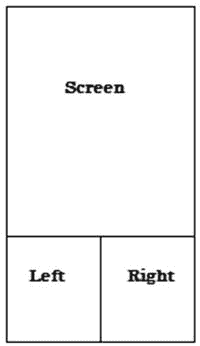
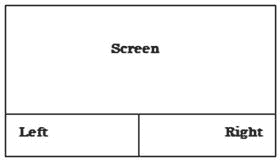

# 八、读取用户输入

如果你从未为移动设备或平板电脑编写过游戏代码，一个问题很快就会出现。不像游戏控制台，甚至台式机，明显缺乏输入选项来将玩家的意图反馈到游戏代码中。如果没有游戏控制器、键盘或鼠标，为玩家提供复杂的输入系统会很困难。

玩家的大部分输入将来自设备的触摸屏。连接游戏来检测和响应设备上的触摸事件并不像表面上看起来那么困难。

## 使用 onTouchEvent()

在你的游戏视图类中，覆盖 onTouchEvent() 如下:

```java
@Override
public boolean onTouchEvent(MotionEvent event) {
}
```

onTouchEvent() 接受一个运动事件。当事件调用生成时，这个运动事件由系统自动传入。

MotionEvent 包含了所有你需要的信息来帮助你判断和解读玩家的动作。从动作事件中，你可以获得诸如玩家触摸的 x 和 y 坐标，以及触摸的压力和持续时间等信息。你甚至可以决定滑动的方向。

在本例中，您将获得玩家的触摸坐标:

```java
@Override
public boolean onTouchEvent(MotionEvent event) {

               float x = event.getX();
               float y = event.getY();
}
```

现在，您可以根据需要对 x 和 y 坐标做出反应。

如果您想要检测多个触摸点，请使用getPointerCount()和 PointerCoords 来帮助检索用于检测多点触摸输入的指针对象。

传递给 onTouchEvent() 的 MotionEvent 可以跟踪多达五个不同的同时屏幕触摸。这里的概念是遍历所有使用 getPointerCount() 检测到的指针。在循环内部，您将使用getPointerID()来检索每个指针所需的信息。

首先设置您的 onTouchEvent() 并遍历检测到的指针:

```java
@Override
public boolean onTouchEvent(MotionEvent event) {

   MotionEvent.PointerCoords[] coords = new
             MotionEvent.PointerCoords[event.getPointerCount()];

   For(int i = 0; i< event.getPointerCount(); i++)
   {
        event.getPointerCoords(i, coords[i]);
   }
}
```

现在，您可以从检测到的每个指针中获得所需的所有信息。

假设你正在创建一个平台游戏，玩家可以向左向右跑。您已经设置了您的 onTouchEvent() ，并且您正在捕捉玩家每次触摸屏幕时的 x 和 y 坐标。你怎么能轻易地确定这些坐标应该把玩家推向左边还是右边呢？

答案是将屏幕分成 *个触摸区域*——在这种情况下，一个区域在屏幕左侧，一个区域在右侧。几个简单的 if 语句可以用来检查玩家在屏幕上触摸的位置。

以平台游戏为例，玩家只能向左和向右移动，你可以把屏幕分成两半，一个代表左边，一个代表右边。你也可以考虑将触摸区放在屏幕底部，玩家的拇指可能会在那里。

这意味着您必须忽略落在左右触摸区上方的任何触摸坐标。看一看图 8-1 和图 8-2 中的[图，了解这一概念的直观表示。](#Fig1)



###### [图 8-1](#_Fig1) 。肖像模式左右触摸区



###### [图 8-2](#_Fig2) 。横向模式左右触摸区

第一步是获得屏幕的高度:

```java
@Override
public boolean onTouchEvent(MotionEvent event) {
        //get the non-touchable area of the screen -
        //the upper 2/3rds of the screen
        Point size = new Point();
activity.getWindowManager().getDefaultDisplay().getSize(size);
int width = size.x;
int height = size.y / 3;

        //the playable area is now the lower 3rd of the screen
        int playableArea = size.y - height;
}
```

使用值 playableArea 作为 y 轴值，您可以很容易地判断您的玩家是否触摸了屏幕的正确部分。创建一个简单的 if 语句来测试玩家触摸坐标的位置:

```java
 @Override
public boolean onTouchEvent(MotionEvent event) {
        //get the non-touchable area of the screen -
        //the upper 2/3rds of the screen
        Point size = new Point();
activity.getWindowManager().getDefaultDisplay().getSize(size);
int width = size.x;
int height = size.y / 3;

        //the playable area is now the lower 3rd of the screen
        int playableArea = size.y - height;

        if (y > playableArea){

        //this y coordiate is within the touch zone

        }
}
```

现在您知道玩家已经触摸了屏幕的正确区域，可以通过测试 x 坐标是大于还是小于屏幕的中心点来确定触摸区的左侧和右侧:

```java
@Override
public boolean onTouchEvent(MotionEvent event) {
        //get the non-touchable area of the screen -
        //the upper 2/3rds of the screen
        Point size = new Point();
        activity.getWindowManager().getDefaultDisplay().getSize(size);

        //get the center point of the screen
        int width = size.x / 2;

        int height = size.y / 3;

        //the playable area is now the lower 3rd of the screen
        int playableArea = size.y - height;

        if (y > playableArea){

        //this y coordiate is within the touch zone

           if(x < center){
                //The player touched the left
           }else{
                //The player touched the right
           }

        }
}
```

您已成功确定玩家触摸了屏幕的左侧还是右侧。将注释替换为您的特定代码，以根据玩家触摸的位置启动操作。

对于一些游戏(比如《神庙逃亡》)，你想让玩家滑动或投掷屏幕来指示他们想要移动的方向。例如，向上一扔可能代表一次跳跃。这可能是一种更加通用的玩家输入方法，但是也需要更多的设置代码。

## 添加手势监听器

打开你的 游戏视图并实例化一个简单的斯图利斯坦纳 :

```java
GestureDetector.SimpleOnGestureListener gestureListener = new
                 GestureDetector.SimpleOnGestureListener(){

};
```

您需要在手势监听器中实现几个方法。然而，在这个解决方案中，您唯一要使用的是 OnFling() :

```java
GestureDetector.SimpleOnGestureListener gestureListener = new
                GestureDetector.SimpleOnGestureListener(){
        @Override
        public boolean onDown(MotionEvent arg0) {
                // TODO Auto-generated method stub
                return false;
        }

        @Override
        public boolean onFling(MotionEvent e1, MotionEvent e2, float velocityX,
                        float velocityY) {
                //React to the fling action
                return false;
        }
        @Override
        public void onLongPress(MotionEvent e) {
                // TODO Auto-generated method stub

        }
        @Override
        public boolean onScroll(MotionEvent e1, MotionEvent e2, float distanceX,
                        float distanceY) {
                // TODO Auto-generated method stub
                return false;
        }
        @Override
        public void onShowPress(MotionEvent e) {
                // TODO Auto-generated method stub

        }
        @Override
        public boolean onSingleTapUp(MotionEvent e) {
                // TODO Auto-generated method stub
                return false;
        }

    };
```

现在，创建一个新变量:

```java
private GestureDetector gd;
```

手势检测器将用于抛出手势事件。在活动的 onCreate() 中初始化检测器:

```java
@Override
public void onCreate(Bundle savedInstanceState) {
     super.onCreate(savedInstanceState);
     gd = new GestureDetector(this,gestureListener);
}
```

最后，在 OnTouchEvent() 中，抛出给的手势监听器:

```java
@Override
public boolean onTouchEvent(MotionEvent event) {
    return gd.onTouchEvent(event);
}
```

当玩家甩出屏幕时，会执行 OnFling() 中的代码。这就解决了“什么”和“什么时候”的问题现在你需要确定哪个方向。

注意 OnFling() 有两个运动事件属性。因为您之前使用过它，所以您知道运动事件包含一个 getX() 和一个 getY() 用于获取事件各自的坐标。

e1 和 e2 这两个事件代表了投掷的起点和终点。因此，使用每个事件的 x 和 y 坐标，可以计算出玩家向哪个方向移动。

```java
float leftMotion = e1.getX() - e2.getX();
    float upMotion = e1.getY() - e2.getY();

    float rightMotion = e2.getX() - e1.getX();
    float downMotion = e2.getY() - e1.getY();

    if((leftMotion == Math.max(leftMotion, rightMotion)) &&
       (leftMotion > Math.max(downMotion, upMotion)) )
    {
        //The player moved left
    }

    if((rightMotion == Math.max(leftMotion, rightMotion))
        && rightMotion > Math.max(downMotion, upMotion) )
{
        //The player moved right
}
if((upMotion == Math.max(upMotion, downMotion))
    && (upMotion > Math.max(leftMotion, rightMotion)) )
{
        //The player moved up
}

if((downMotion == Math.max(upMotion, downMotion))
    && (downMotion > Math.max(leftMotion, rightMotion)) )
{
        //The player moved down
}
```

现在你可以为你在游戏中需要采取的行动填入适当的代码。

在下一章中，你将会根据被检测到的触摸来移动屏幕上的图像。