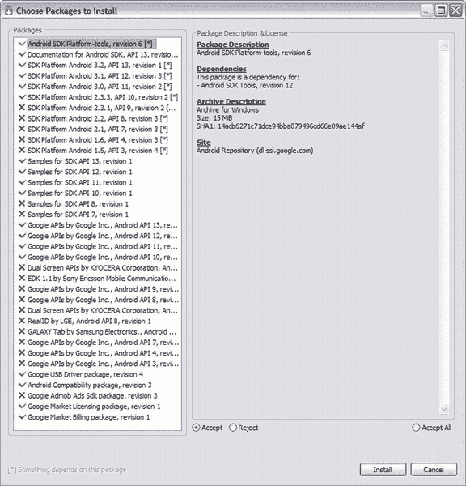

# 一、简介

2011 年 5 月，谷歌举行了年度开发者大会 Google IO，向大约 5000 名与会者展示了其最新技术。除了对谷歌 API 或核心搜索技术等已经众所周知的技术进行改进，谷歌还将重点放在了两大主题上:Chrome 和 Android。一如既往，Android 平台的最新进展得到了展示和讨论，但谷歌稍后在 Android keynote 上宣布的内容有点令人惊讶:谷歌的第一个 Android 设备与外部硬件通信的标准。Android 开放附件标准和附件开发工具包(ADK)将是与硬件通信和为 Android 设备构建外部附件的关键。为了鼓励开发，谷歌向感兴趣的与会者分发了 ADK 硬件包，并展示了一些 ADK 项目的例子，如将数据传输到连接的安卓设备的跑步机和可以用安卓设备控制的巨大倾斜迷宫。活动结束后不久，第一个 DIY 项目浮出水面，这已经显示了 ADK 的巨大潜力。

由于我不能参加这次活动，我没有机会得到其中的一个工具包；当时，谷歌 ADK 版只有一家经销商，而这家经销商并没有为如此大的需求做好准备。这并没有阻止我自己建立一个替代方案，并体验 Android 开发这一新领域的乐趣。随着时间的推移，越来越多的分销商生产了最初的谷歌 ADK 板的衍生产品，在大多数情况下，这些产品更便宜，而且只提供让你一起开始黑客项目的基础。

您可能只想一头扎进去，但是首先您应该了解 ADK 的具体情况，并设置您的开发环境。你不会在不知道怎么做或者没有合适的工具的情况下盖房子，是吗？

### 什么是 ADK？

附件开发套件(ADK)基本上是一个微控制器开发板，它遵循 Google 创建的简单开放附件标准协议作为参考实现。尽管这可能是任何符合 ADK 兼容规范的主板，但大多数主板都基于 Arduino 设计，这是 2005 年创建的开放式硬件平台。这些板是基于 Arduino Mega2560 和 Circuits@Home USB Host Shield 实现的支持 USB 的微控制器板。然而，还有其他已知的 ADK 兼容板设计，如基于 PIC 的板，甚至普通 USB 主机芯片板，如 FTDI 的 VNCII。Google 决定在 Arduino Mega2560 设计的基础上构建其参考套件，并以开源方式提供软件和硬件资源。这是一个聪明的举动，因为 Arduino 社区在过去的几年里发展迅速，使得设计师、爱好者和普通人可以很容易地将他们的想法变成现实。随着 Android 和 Arduino 爱好者群体的不断增长，ADK 有了一个很好的开始。

为了与硬件板通信，支持 Android 的设备需要满足某些标准。随着 Android Honeycomb 版本 3.1 和 backported 版本 2.3.4 的推出，引入了必要的软件 API。然而，这些设备还必须配备合适的 USB 驱动程序。该驱动程序支持通用 USB 功能，但特别支持所谓的附件模式。附件模式允许没有 USB 主机功能的 Android 设备与外部硬件通信，外部硬件反过来充当 USB 主机部分。

开放附件标准的规范规定，USB 主机必须为 USB 总线提供电源，并且可以枚举连接的设备。根据 USB 2.0 规范，外部设备必须在 5V 下提供 500mA 用于 Android 设备的充电目的。

ADK 还为开发板提供固件，固件以一组源代码文件、库和一个*演示套件草图*的形式出现，演示套件草图是 Arduino 术语，指项目或源代码文件。固件关心 USB 总线的枚举，并寻找与附件模式兼容的连接设备。

谷歌还为 Android 设备提供了一个示例应用，可以轻松访问和演示参考板及其传感器和执行器的功能。如果您使用的衍生板没有相同种类的传感器，您仍然可以使用示例应用，但您可能希望将代码剥离到通信的基本部分。

当你在 ADK 建立一个硬件项目时，你是在打造一个所谓的*安卓配件*。您的硬件项目是 Android 设备的附件，例如，键盘是 PC 的附件，不同之处在于您的附件为整个系统提供动力。配件需要支持已经提到的设备电源，并且它们必须遵守 Android 配件协议。该协议规定附件遵循四个基本步骤来建立与 Android 设备的通信:

1.  附件处于等待状态，并试图检测任何连接的设备。
2.  附件检查设备的附件模式支持。
3.  如有必要，附件会尝试将设备设置为附件模式。
4.  如果设备支持 Android 配件协议，则配件会建立通信。

如果你想了解更多关于 ADK 和开放附件标准的信息，请查看位于`[http://developer.android.com/guide/topics/usb/adk.html](http://developer.android.com/guide/topics/usb/adk.html)`的 Android 开发者页面。

### 硬件开发板

本节将概述目前市场上各种兼容 ADK 的开发板。请注意，我不能保证这个列表的完整性，因为社区发展的速度如此之快，以至于新的委员会可能会随时出现。在撰写本文时，我将集中讨论最受欢迎的主板。

#### 谷歌 ADK

谷歌 ADK 是在 2011 年 5 月的谷歌 IO 上展示的参考套件，它是第一个遵循开放附件标准的主板。该套件带有 ADK 基板和演示屏蔽，如图[图 1-1](#fig_1_1) 所示。

***图 1-1。**谷歌 ADK 板和演示盾*

基板([图 1-2](#fig_1_2) )包含 DC 电源连接器、连接手机或平板电脑的 USB 连接器(A 型插座)以及连接电脑用于编程和调试的微型 USB 连接器(微型 B 型插座)。它的顶部安装了 Atmel 的 ATmega2560 AVR 芯片，针对 C 编译代码进行了优化，这使得它非常快速且易于编程，而不是必须用汇编语言编程的可比微控制器。ATmega2560 有一个 256 千字节的内部闪存和一个 8 位 CPU，工作频率为 16MHz。它提供 8KB 的 SRAM 和 4KB 的 EEPROM。ATmega 芯片的 IO 端口控制 16 个模拟引脚，提供 10 位输入分辨率，支持 1，024 个不同值的模数转换。默认情况下，它们的测量范围是从地到 5V。该芯片有 54 个数字引脚，其中 14 个是 PWM(脉宽调制)使能的，例如，允许 led 变暗或控制伺服系统。板的中间是一个复位按钮，用于复位板上的程序执行。该板的工作电压为 5V。虽然您可以通过 USB 电缆为电路板供电，但如果您打算控制伺服系统或驱动电机，则应该考虑使用电源适配器。

***图 1-2。**近距离观察谷歌 ADK 董事会*

*Demo Shield* 是一个附加板，包含各种不同的传感器和执行器。 *Shield* 是 Arduino 术语，指可以放在 Arduino 基板上的扩展板。这种连接是通过可堆叠的引脚接头实现的。基板的 IO 引脚大多委托给屏蔽层的引脚，因此可以重复使用。然而，某些屏蔽可能会占用引脚来操作它们的传感器。演示屏蔽罩本身预焊有插头，因此没有额外的屏蔽罩可以堆叠在上面。这并不令人惊讶，因为 shield 使用大多数引脚来让基板与其所有传感器进行通信。由于屏蔽隐藏了基板的重置按钮，它本身包含一个按钮，因此您仍然可以使用重置功能。然而，最重要的部分是传感器和致动器，而且数量很多。

*   一个模拟操纵杆
*   三个按钮
*   三个 RGB LEDs
*   起温度传感器作用的晶体管
*   具有用于光感测的集成光电二极管的 IC
*   安卓标志形式的电容式触摸区域
*   两个带螺丝端子的继电器，可切换 24V 至 1A 的外部电路
*   三个伺服连接器

谷歌 ADK 最初是由一家日本公司为谷歌 IO 生产的。可以在`[www.rt-net.jp/shop/index.php?main_page=product_info&cPath=3_4&products_id=1](http://www.rt-net.jp/shop/index.php?main_page=product_info&cPath=3_4&products_id=1)`订购。价格约为 400 美元(不包括销售税)，是最贵的主板之一。

#### Arduino ADK

Arduino ADK ( [图 1-3](#fig_1_3) )是 Arduino 系列制造商自己生产的 ADK 兼容基板。它也基于 ATmega2560，与 Google 参考板仅略有不同。

***图 1-3。** Arduino ADK 板*

Arduino ADK 板还有一个 DC 电源连接器和一个 USB 连接器(A 型插座),用于连接 Android 设备。然而，编程和调试连接器与标准 USB 连接器不同(B 型插座)。重置按钮位于电路板的远端，ATmega 芯片位于电路板的中间。IO 引脚布局与 Google board 中的完全相同，并且具有相同的模拟和数字引脚特性。然而，Arduino ADK 有两个 ICSP 6 针接头，用于微芯片的在线串行编程(ICSP)。Arduino ADK 和谷歌 ADK 共享相同的引脚布局和外形，与演示盾和其他基于 Arduino 的盾兼容。

Arduino ADK 在意大利制造，可以直接从 Arduino 网站`[http://store.arduino.cc/ww/index.php?main_page=product_info&cPath=11_12&products_id=144](http://store.arduino.cc/ww/index.php?main_page=product_info&cPath=11_12&products_id=144)`订购，也可以从遍布全球的经销商`[http://arduino.cc/en/Main/Buy](http://arduino.cc/en/Main/Buy)`处订购。

它的价格约为 90 美元(不包括可能的运输成本和税收)，对于普通爱好者和硬件黑客来说，它比谷歌 ADK 更实惠。

#### IOIO

IOIO(发音为 yo-yo)板([图 1-4](#fig_1_4) )是一种基于 PIC 微控制器的开发板，由 Sparkfun Electronics 在开放附件标准公布之前开发。

***图 1-4。**火花乐趣 IOIO 板*

IOIO 板设计用于所有版本为 1.5 及以上的 Android 设备。最初的固件设计旨在与 Android Debug Bridge (ADB)配合使用，后者通常在 Android 应用的开发过程中用于调试过程和文件系统操作。在开放附件标准公布后，IOIO 被更新为新的固件，以支持开放附件协议和作为后备的 ADB 协议，从而仍然支持较旧的设备。在撰写本书时，固件仍处于测试阶段。因为你需要通过 PIC 编程器更新板的固件，以使板 ADK 兼容，它可能不是一个没有经验的修补程序的完美选择。

该板的硬件特性如下。IOIO 的外形尺寸约为常规 ADK 兼容板的四分之一，这使它成为目前最小的板之一。然而，它几乎跟上了它的老大哥的众多 IO 引脚。总共 48 个 IO 引脚中有许多都有几种工作模式，这可能会使引脚分配有点混乱。

在 48 个 IO 引脚中，所有引脚都可以用作通用输入输出端口。此外，其中 16 个引脚可用作模拟输入，3 对引脚可用于 I C 通信，1 个引脚可用作外设输入，28 个引脚可用于外设输入和输出。通常，这些引脚只能承受 3.3V 电压，但 22 个引脚能够承受 5V 输入和输出。I C 引脚提供快速简单的双线接口，与传感器板等外部集成电路通信。

除 IO 引脚外，该板还提供 3 个 Vin 引脚为板供电。在电路板的底部，您可以焊接一个额外的 JST 连接器来连接一个 LiPo 电池作为电源。应提供 5V 至 15V 的工作电压。此外，它有 3 个引脚用于 3.3V 输出，3 个引脚用于 5V 输出，9 个引脚用于接地。

该板上唯一的连接器是所需的 USB (A 型插座)连接器。这是因为不需要对硬件编程，不像其他 ADK 兼容板，硬件部分需要 C 编译代码。IOIO 提供了实现所有需求的固件。你只需要通过使用高级 API 来编写 Android 部分，以便于 pin 访问。

电路板上一个有趣的组件是一个小型微调电位计，可以限制 Android 设备的充电电流，以便在电路板处于电池模式时不会消耗太多电力。IOIO 有一个 PIC 微控制器芯片，而不是大多数其他板使用的 AVR 芯片。PIC24FJ256-DA206 芯片工作频率为 32MHz，具有 256KB 可编程存储器和 96KB RAM。

IOIO 由 Sparkfun Electronics 开发，可通过 Sparkfun 网站`[www.sparkfun.com/products/10748](http://www.sparkfun.com/products/10748)`或其经销商订购。

运费和税之前的价格约为 50 美元，这是最便宜的主板之一，但对初学者来说不是最友好的。

#### seeed uino ADK 主板

seedeuino ADK 板([图 1-5](#fig_1_5) )也源自 ATmega 板，看起来与标准的 Arduino ADK 板非常相似，但乍一看，它有一些不错的额外功能。

***图 1-5。** Seeeduino ADK 董事会(图片由 Seeedstudio 提供)*

它有 56 个数字 IO 引脚，其中 14 个支持 PWM，16 个模拟输入引脚和 1 个 ICSP 接头。板上的连接器与最初谷歌设计中的连接器类型相同。它有一个 DC 电源连接器、一个 USB 连接器(A 型插座)和一个微型 USB 连接器(微型 B 型插座)。

与大多数其他类似 Atmega 的板的最大区别是，Seeeduino ADK 板已经随 MicroBridge 固件一起发运，因此它可以在操作系统版本 2.3.4 及以上的 Android 设备上以 ADK 模式工作，在操作系统版本 2.3.4 之前的设备上以 ADB 模式工作，这与 IOIO 非常相似。

Seeeduino ADK 板由 Seeedstudio 开发，可在该公司网站`[www.seeedstudio.com/depot/seeeduino-adk-main-board-p-846.html](http://www.seeedstudio.com/depot/seeeduino-adk-main-board-p-846.html)`订购，也可从其经销商处订购。

它的售价为 79 美元(不含运费和税)，这使它成为一款非常实惠但功能强大的主板。

#### 更多 ADK 的可能性

在你看到了最常见的支持 ADK 的主板后，你可能会想知道是否只有这些。虽然开放附件标准只有大约一年的历史，但已经可用的板的数量是令人难以置信的，在这个年轻但快速发展的开源硬件领域中还有许多。使用开放附件标准进行开发还有很多其他的可能性。一些代表纯粹的 DIY(自己动手)方法，而另一些则是在 ADK 问世之前就已经使用的主板的扩展。

一种早期的方法是将 ADK 港移植到通用的 Arduino Uno 或 Duemilanove。你唯一需要的是一个额外的 USB 主机屏蔽来连接 Android 设备。我是早期的 DIY 黑客中的一员，也是朝着这个方向发展的。当时，它是最初的谷歌参考板的唯一负担得起的替代品。如今，我不会推荐它；已经有完美的一体化主板，不需要额外的屏蔽、黑客攻击或剥离代码。如果你仍然想使用你的普通 Arduino，有很多商店出售 USB 主机保护罩，你可以使用:

*   `[www.circuitsathome.com/products-page/arduino-shields/usb-host-shield-2-0-for-arduino/](http://www.circuitsathome.com/products-page/arduino-shields/usb-host-shield-2-0-for-arduino/)`
*   `[www.sparkfun.com/products/9947](http://www.sparkfun.com/products/9947)`
*   `[www.dfrobot.com/index.php?route=product/product&filter_name=usb%20host&product_id=498](http://www.dfrobot.com/index.php?route=product/product&filter_name=usb%20host&product_id=498)`
*   `[http://emartee.com/product/42089/Arduino%20ADK%20Shield%20For%20Android](http://emartee.com/product/42089/Arduino%20ADK%20Shield%20For%20Android)`

您可能已经了解了与运行低于 2.3.4 版本操作系统的 Android 设备进行通信的可能性，一些主板提供了这种可能性。如果你也想在你的项目中支持这一点，你应该看看使用亚行建立通信的微桥项目。请在`[http://code.google.com/p/microbridge/](http://code.google.com/p/microbridge/)`查看项目页面了解更多详情。

一些一体式主板还捆绑成套件，让您可以摆弄一堆传感器。这些套件通常提供一些与谷歌演示盾功能相同的传感器。

Arduino 商店出售一套 ADK 传感器套件，包括一个 Arduino ADK 巨型板和一个巨型传感器屏蔽。传感器护罩有 22 个 3 针连接器，可轻松连接传感器模块，无需担心布线和设置。更多信息请访问`[http://store.arduino.cc/eu/index.php?main_page=product_info&cPath=2&products_id=140](http://store.arduino.cc/eu/index.php?main_page=product_info&cPath=2&products_id=140)`。

Seeedstudio 也有一个套件，称为格罗夫 ADK 仪表板套件。像 Arduino 套件一样，它也提供了一个简单的即插即用机制，可以立即启动，并且它具有一系列适用于各种用途的传感器。在`[http://www.seeedstudio.com/depot/grove-adk-dash-kit-p-929.html](http://www.seeedstudio.com/depot/grove-adk-dash-kit-p-929.html)`有售。

如果你仍然想要一个基于谷歌原始设计的套件，但进口日本原始设计不是一个选项，你也可以考虑下面的德国克隆，这几乎是一个精确的克隆，略有改进，提供了一个镀金的触摸区域，具有更好的导电性和阻碍氧化。它也比原来的更实惠，而且根据你住的地方，运费可能会更低。查看`[www.troido.de/de/shoplsmallgbuy-android-stufflsmallg/product/view/1/1](http://www.troido.de/de/shoplsmallgbuy-android-stufflsmallg/product/view/1/1)`了解更多信息。

#### 你应该使用哪种板？

现在，您已经了解了支持开放附件标准的各种电路板，您可能想知道哪种电路板最适合您自己的项目。这总是一个难题，没有唯一的答案。你应该提前计划好你的项目，分析哪种板最合适。

如果你是硬件开发和 ADK 的初学者，你应该坚持使用最常用的板。在撰写本文时，这将是谷歌 ADK 董事会，它被分发给数百名参加谷歌 IO 2011 的开发者。如果你不是幸运地收到这些主板中的一个，并且你的预算相当紧张——这是通常的情况——考虑标准的 Arduino ADK 主板。到目前为止，我所见过的大多数黑客和创客项目都使用这两种板，如果你有需要，它们周围有一个巨大的社区可以帮助你。

[表 1-1](#tab_1_1) 给出了正在讨论的电路板的概况。

T2】

### 支持的 Android 设备

随着越来越多支持 Android 的平板电脑的推出，在 Android Honeycomb 版本中，开放附件标准作为 Android API 的一部分被引入。为了不仅支持蜂窝设备，Google 决定将必要的类移植到 2.3.4 版本，使它们也可以用于手机。较新的功能作为 Google API 附加库被反向移植。这个库基本上是一个 JAR 文件，必须包含在 Android 项目的构建路径中。

第一批获得必要版本更新并支持开放配件模式的候选产品是摩托罗拉 Xoom 和谷歌 Nexus S。其他设备很快就会跟进，这很快导致了众所周知的碎片问题。通常，当涉及不同版本的操作系统时，碎片通常是一个问题，但现在的问题是，即使设备有必要的操作系统版本 2.3.4 或 3.1，开放附件模式仍有可能无法在设备上工作。怎么会这样呢？问题是仅仅更新系统软件是不够的。设备的 USB 驱动程序必须与开放附件模式兼容。很多开发者更新自己的设备甚至 rooted 安装了 Cyanogen mod 这样的自制 Mod 最终运行 2.3.4 版本，却发现设备厂商的 USB 驱动不兼容。

然而，有很多设备已经过测试，据说可以在开放附件模式下完美工作，其中一些是官方的，另一些是由 DIY mods 驱动的。以下是一些已经过社区验证可与 ADK 配合使用的设备列表:

*   谷歌 Nexus S
*   谷歌 Nexus One
*   摩托罗拉 Xoom
*   钢图标 A100
*   钢图标 A500
*   LG Optimus Pad
*   ASUS Eee 垫转座垫 TF101
*   三星 Galaxy Tab 10.1
*   三星 Galaxy S
*   三星 Galaxy Ace

就个人而言，我建议使用 Nexus S 这样的谷歌开发者设备，因为这些设备对最新的 API 和功能提供了最好的支持。

### 设置开发环境

你对 ADK 的历史和技术细节了如指掌，但是在你的想法变成现实之前，你需要建立你的工作环境。您需要为您的 Android 设备和硬件板编写软件，让双方能够相互通信，并控制执行器或读取传感器值。编程是在两个集成开发环境(ide)的帮助下完成的。要编写 Android 应用，Google 建议使用 Eclipse IDE。Eclipse IDE 是最常见的 Java 开发 IDE，拥有最大的社区之一、各种插件和出色的支持。由于硬件板基于 Arduino 设计，您将使用 Arduino IDE 对它们进行编程，以编写所谓的*草图*，这些草图将被上传到板上。为了让这些 ide 正常工作，您还需要 Java 开发工具包(JDK)，它比普通的 Java 运行时环境(JRE)具有更多的功能，并且您的系统可能已经安装了它。您还需要 Android SDK 来编写您的 Android 应用。

这个分步指南将帮助您建立必要的开发环境。请严格按照您选择的操作系统的步骤操作。如果您遇到任何问题，也可以参考软件网站上的官方安装指南。

#### Java 开发工具包

你首先需要的是 JDK。转到`[www.oracle.com/technetwork/java/javase/downloads/index.html](http://www.oracle.com/technetwork/java/javase/downloads/index.html)`并点击 JDK 下载按钮([图 1-6](#fig_1_6) )。

***图 1-6。** JDK 下载页面*

接受许可协议并为您的操作系统选择文件([图 1-7](#fig_1_7) )。x86 文件适用于 32 位操作系统，x64 文件必须安装在 64 位系统上，因此请确保选择正确的文件。

***图 1-7。** JDK 平台下载量*

您可能会注意到，Mac OS 上没有 JDK 文件。这些并没有在甲骨文网站上发布，因为苹果提供了自己版本的 JDK。JDK 应该预装在您的 Mac OS X 系统上。您可以通过在终端窗口中键入`java -version`来验证这一点。您应该会在终端窗口中看到您当前安装的 Java 版本。

##### 在 Windows 上安装

下载完可执行文件后，打开它并按照指导您完成安装过程的说明进行操作。之后，您应该将 JDK 路径设置为您的 Windows `PATH`变量。path 变量用于方便地从系统中的任何地方运行可执行文件。否则，您将不得不总是键入完整的路径，以便从命令行执行某些东西，比如`C:\Program Files\Java\jdk1.7.0\bin\java`。

Eclipse 也依赖于要设置的`JAVA_HOME`变量。要设置系统环境变量，您必须执行以下操作。

*   Right-click My Computer and select Properties as shown in [Figure 1-8](#fig_1_8).

    ***图 1-8。**打开系统属性对话框*

*   On the system Properties dialog select the Advanced tab. Near the bottom you should see the Environment Variables button ([Figure 1-9](#fig_1_9)), which opens the variables dialog to set User and System variables.

    ***图 1-9。**打开环境变量对话框*

*   Click New in the System Variables area and insert the following:

    变量名:`JAVA_HOME`

    变量值:`C:\Program Files\Java\jdk1.7.0`

*   点击`OK`。
*   另外选择`PATH`变量进行编辑([图 1-10](#fig_1_10) ，点击`Edit`。在其他值前面插入`%JAVA_HOME%/bin;`。
*   点击`OK`。
*   Now your JDK is set up and ready for work.

    ***图 1-10。**设置环境变量*

##### 在 Linux 上安装

为您的系统(32 位/ 64 位)下载`tar.gz`文件，并将该文件移动到您想要安装 JDK 的位置。通常 JDK 安装在`/usr/java/`中，但是请记住，您需要 root 权限才能安装到该目录中。

打开包装并安装 JDK，包括:

`# tar zxvf jdk-7-linux-i586.tar.gz`

JDK 安装在当前目录下的`/jdk1.7.0`目录中。

为了让您的系统知道您在哪里安装了 JDK，并且能够从系统中的任何地方运行它，您必须设置必要的环境变量。为此，创建一个简短的 shell 脚本放在`/etc/profile.d`目录中是一个好主意。

在该目录中创建一个名为`java_env.sh`的脚本，并将以下内容添加到脚本中:

`#!/bin/bash

JAVA_HOME=/usr/java/jdk1.7.0

PATH=$JAVA_HOME/bin:$PATH

export PATH JAVA_HOME
export CLASSPATH=.`

最后要做的事情是在新创建的脚本上设置权限，以便系统在用户登录时执行它。

`# chmod 755 java_env.sh`

重新登录后，将设置环境变量。

##### 在 Mac OS X 上安装

如前所述，Mac 版 JDK 不是通过 Oracle 下载网站发布的。JDK 预装在 Mac OS X 上，但也可以通过 Apple Store 下载。如果您的环境变量`JAVA_HOME`和`PATH`尚未设置，您可以参考 Linux 安装中使用的相应步骤，因为 Mac OS X 也是基于 Unix 的。您可以在终端窗口中使用以下命令检查变量是否已设置:

`# echo $JAVA_HOME And similar for the PATH variable:
# echo $PATH`

#### Android SDK

为了能够编写 Android 应用，你需要 Android 软件开发工具包，它提供了 Google 目前支持的所有 Android 版本的所有库和工具。

你可以在`[http://developer.android.com/sdk/index.html](http://developer.android.com/sdk/index.html)`从 Android 开发者页面([图 1-11](#fig_1_11) )下载 SDK。

***图 1-11。** Android SDK 下载页面*

该网站提供了适用于 Windows、Linux 和 Mac 的 SDK 的压缩文档。还有另一个 Windows 版本，它是一个可执行文件，应该会引导您完成安装过程。由于所有平台的初始设置都是相同的，因此没有特定于操作系统的步骤。

下载完 SDK 档案后，将其移动到您选择的位置并解压缩。您将看到`add-ons`和`platforms`目录都是空的。只有`tools`目录包含几个二进制文件。现在该目录中的重要文件是`android`脚本。它启动 SDK 和 AVD 管理器([图 1-12](#fig_1_12) )。

***图 1-12。** SDK 经理*

SDK 管理器是 SDK 的核心。它管理已安装的 Android 版本，并更新新版本和附加包。使用 SDK 和 AVD 管理器，你还可以设置模拟器来测试 Android 应用。

在第一次启动时，它会连接到谷歌服务器检查版本更新，然后会提示您安装 SDK 包([图 1-13](#fig_1_13) )。这是一个好主意，只需点击接受所有并安装安装所有的 SDK 版本和额外的软件包。这可能需要很长时间，取决于您的互联网连接。如果您只想安装绝对必要的软件包，只需接受以下软件包，拒绝所有其他软件包:

*   Android SDK 平台-工具
*   Android SDK 的文档
*   Android 2.3.3、API 10 和所有更新版本的 SDK 平台
*   SDK API 10 和所有更新版本的示例
*   谷歌公司的谷歌 API，Android API 10 和所有更新的 API
*   谷歌 USB 驱动程序包
*   Android 兼容性包

***图 1-13。** SDK 包安装*

您可以通过单击“已安装和可用的软件包”来管理 SDK 安装，从而随时卸载和安装软件包。当 SDK 管理器下载完所有必要的包后，你会看到你的 SDK 目录已经增长，并且有了一些新的文件夹。我后面会讲到其中的一些，所以现在没有必要去理解。SDK 现在已经可以开发了。

#### Eclipse IDE

Eclipse 集成开发环境是软件开发人员最常用的 ide 之一。它有一个巨大的支持社区和一些针对各种开发场景的最强大的插件。您将需要 Eclipse 来开发您的 Android 应用。编写 Android 应用的编程语言是 Java。尽管您正在编写 Java 代码，但最终它将被编译成 Android 特有的`dex`代码，并打包成一个以文件结尾`.apk`的归档文件。这个存档文件将被放到您的 Android 设备上进行安装。

要下载 Eclipse，请前往`[www.eclipse.org/downloads/](http://www.eclipse.org/downloads/)`。在分发列表的右上角选择您的操作系统([图 1-14](#fig_1_14) )。

***图 1-14。**月食下载网站*

您应该选择 Eclipse 经典版，因为它没有针对其他目的进行预配置。单击您的系统类型(32 位/64 位)的下载按钮。现在选择下载的默认镜像页面或选择离你最近的镜像([图 1-15](#fig_1_15) )。

***图 1-15。**下载镜像选择*

根据您的操作系统，下载的文件可能是`zip`或`tar.gz`存档文件。您不需要安装 Eclipse，因为它已经打包好可以运行了。将归档文件移动到您希望放置 Eclipse 的目录中，并提取它。Eclipse IDE 现在可以进行普通的 Java 开发了。然而，您需要安装一个额外的插件并进行一些配置，以便为 Android 开发准备 Eclipse。

你首先需要的是谷歌的 Android 开发工具(ADT)插件。ADT 插件用一套强大的 Android 开发工具增强了 Eclipse。除了能够设置特定于 Android 的项目，您还将受益于用于用户界面(UI)开发、资源管理、调试和监控视图以及构建和分析工具的专用编辑器。关于 ADT 插件的细节可以在`[http://developer.android.com/sdk/eclipse-adt.html](http://developer.android.com/sdk/eclipse-adt.html)`找到。ADT 插件通过其更新机制从 Eclipse 中安装。

打开 Eclipse，点击`Help`。选择`Install New Software` ( [图 1-16](#fig_1_16) )。

***图 1-16。** Eclipse 插件安装*

点击右上角的`Add`。在存储库对话框中，您必须输入更新站点的 URL 和一个识别名称([图 1-17](#fig_1_17) )。名称可以是任何东西，但建议使用描述性的东西，如 ADT 插件。在 URL 字段中输入`[https://dl-ssl.google.com/android/eclipse/](https://dl-ssl.google.com/android/eclipse/)`。如果您在建立 SSL 连接时遇到困难，您也可以使用 http 作为协议，但是它不太安全。

***图 1-17。**添加插件网站*

将列出更新站点可用软件。选中`Developer Tools`处的复选框，点击`Next` ( [图 1-18](#fig_1_18) )。

***图 1-18。**插件包选择*

将会显示一个安装摘要，您可以点击`Next`。最后一步是接受许可协议并点击`Finish` ( [图 1-19](#fig_1_19) )。

***图 1-19。**许可协议*

如果弹出一个对话框说真实性或有效性没有保证，点击`OK`。插件现在已经安装好了，Eclipse 将提示您要么重启 Eclipse，要么只应用更改。重启 Eclipse 总是一个好主意，这样在加载插件时就不会出现副作用。在您能够设置 Android 项目之前，您需要在 Eclipse 中设置一些首选项。在顶栏中选择`Window`和`Preferences`([图 1-20](#fig_1_20) )。

***图 1-20。**配置首选项*

在左侧列表中选择`Android`。如果你第一次点击它，会弹出一个对话框，要求你发送使用统计数据到谷歌服务器。您不需要允许这样做，但是您必须做出选择并点击`Proceed`关闭对话框。现在您必须配置您的 Android SDK 位置。点击`Browse…`，选择放置 SDK 安装的目录，如图[图 1-21](#fig_1_21) 所示。

***图 1-21。**设置 Android SDK 路径*

应用更改并点击`OK`。您已经完成了设置，现在准备开发 Android 应用。

#### Arduino IDE

与 Eclipse 相比，Arduino 集成开发环境是一个非常小的 IDE。您将使用它为基于 Arduino 的微控制器板编写代码。Arduino IDE 本身是基于 Java 的，但是您将使用 c 编写代码。IDE 使用 avr-gcc 编译代码。Arduino 的编写软件是一个所谓的草图。IDE ( [图 1-22](#fig_1_22) )本身包含一个带有语法高亮显示的代码编辑器，一个用于调试和信息目的的控制台，它通过串行连接(USB)连接到你的硬件板。IDE 附带了许多方便的库，用于各种 IO 操作。Arduino 社区有一个庞大的、不断增长的社区，由设计师、爱好者和开发人员组成，他们也制作各种各样的库和草图。

***图 1-22。**Arduino IDE*

根据您的操作系统，您可以从位于`[http://arduino.cc/en/Main/Software](http://arduino.cc/en/Main/Software)`的 Arduino 网站([图 1-23](#fig_1_23) )下载 IDE 作为档案文件或磁盘映像。

***图 1-23。** Arduino 下载网站*

##### 在 Windows 和 Linux 上安装 Arduino IDE

如果你使用的是 Windows 或者 Linux，你必须下载一个存档文件，你可以把它放在任何你喜欢的目录下。之后，解压存档文件。不需要安装，IDE 已经准备就绪。

##### 在 Mac OS X 上安装 Arduino IDE

如果你使用的是 Mac OS X 系统，你必须下载一个`.dmg`文件，这是一个磁盘镜像。如果系统没有自动装载它，请双击该文件。安装后，您会看到一个名为`Arduino.app`的文件。将该文件移动到主目录中的应用文件夹中。IDE 现在已经安装完毕，可以开始编码了。

#### 安装硬件驱动程序

外部硬件几乎总是需要所谓的驱动程序。驱动程序是一个软件，它让你的操作系统知道硬件。驱动程序使操作系统能够与外部设备通信。因为在编程阶段你有两个硬件设备要与之通信(ADK 板和 Android 设备)，所以你也必须为这些设备提供驱动程序。

##### 在 Windows 上安装硬件驱动程序

尽管 ADK 板基于 ATmega 2560，其驱动程序已经与 Arduino IDE 一起部署，但 Windows 用户应该下载一个包含 ADK 型板驱动程序定义的档案文件。为此，请访问位于`[http://arduino.cc/en/Main/ArduinoBoardADK](http://arduino.cc/en/Main/ArduinoBoardADK)`的 Arduino ADK 详细页面。

您将在页面底部或以下网址找到存档文件:`[http://arduino.cc/en/uploads/Main/Arduino_ADK.zip](http://arduino.cc/en/uploads/Main/Arduino_ADK.zip)`。

归档文件只包含一个`.inf`文件。将你的 ADK 板连接到你的电脑上，你会被提示提供一个驱动程序或者让系统搜索一个。选择手动安装一个，指向提到的`.inf`文件。系统将安装驱动程序，并且系统知道您的 ADK 板。

Android 设备还需要一个驱动程序，以便您能够部署和调试您编写的应用。在大多数情况下，您的 Android SDK 安装提供的通用驱动程序就足够了。当您在 SDK 管理器中安装额外的 SDK 包时，您选择了一个名为`Google USB Driver Package, revision x`的包。当您第一次连接您的 Android 设备时，系统会提示您手动选择一个驱动程序或让系统搜索一个。再次选择手动分配驱动程序，并在% `SDK_HOME%\extras\google\usb_driver`的 SDK 安装目录中选择通用驱动程序。

 **注意**在某些情况下你可能需要特定厂商的 USB 驱动。你可以在制造商主页上找到它们。例如，三星将其驱动程序与同步工具 Kies 打包在一起。

##### 在 Linux 上安装硬件驱动程序

Linux 系统应该自动检测你的硬件板和你的 Android 设备。当您稍后将代码上传到 ADK 板时，您可以在 Arduino IDE 中选择 ATmega2560 设置。如果在 Linux 机器上设置开发板有任何问题，请参考`[www.arduino.cc/playground/Learning/Linux](http://www.arduino.cc/playground/Learning/Linux)`的安装指南。

##### 在 Mac OS X 上安装硬件驱动程序

在 Mac 上，同样的情况也适用于 Linux 机器。应该可以自动检测设备。但是，如果你在使用 ADK 板时遇到了问题，安装你之前下载的磁盘镜像文件附带的 FTDI 驱动程序可能会有所帮助。双击名为`FTDIUSBSerialDriver_xx_xx_xx_xx_xx_xx.mpkg`的文件即可。遵循安装说明并重新启动系统。如果还是有问题，可以参考`http://arduino.cc/en/Guide/MacOSX`的安装指南。

#### ADK 参考包

为了给你的想法一个起点，谷歌提供了一个 ADK 参考包。该软件包包含用于制造的开发板的原始设计、固件、ADK 开发板的演示草图以及与 ADK 开发板通信的示例 Android 应用。可以在`[https://dl-ssl.google.com/android/adk/adk_release_0512.zip](https://dl-ssl.google.com/android/adk/adk_release_0512.zip)`下载。你应该下载参考资料包，因为它将是你的第一个项目和整本书的例子的基础。

 **注**ADK 参考包的版本可能会不时更新。你可以在开发者页面的`[http://developer.android.com/guide/topics/usb/adk.html](http://developer.android.com/guide/topics/usb/adk.html)`ADK 组件部分找到当前链接。

#### Fritzing(可选软件)

虽然 Fritzing 是一个完全可选的开源软件组件，但并不一定需要，我想给你一个简短的概述，介绍它如何在以后的项目中帮助你。Fritzing 是一个强大的原型制作工具，可以让您以不同的形式可视化您的电路和硬件设计。它旨在支持业余爱好者、设计师和制造商的项目文档、可视化和制造。

使用 Fritzing，您可以创建如图 1-24 所示的试验板原理图。

***图 1-24。**油炸面包板示意图*

您可以将您的设计抽象为电路原理图，如图[图 1-25](#fig_1_25) 所示。

***图 1-25。**烧结电路原理图*

您甚至可以将您的设计转化为 PCB 设计([图 1-26](#fig_1_26) )，以便日后生产。

***图 1-26。**烧结 PCB 原理图*

该工具有各种各样的部件，从最常见的，如电阻和常见的 IC(集成电路)，到 Sparkfun 目录中的几个部件，再到用户自己生成的部件。这个社区正在 Arduino 用户中成长，它越来越成为一个伪标准。虽然它可能不如 CadSoft 的 EAGLE 强大，它是电气工程的行业标准工具，但它仍然拥有业余爱好者或制造商需要的一切，而且完全免费。你会看到本书所有项目中使用的 Fritzing 原理图，以帮助可视化项目设置。如果你想更深入地了解它，你可以点击`[http://fritzing.org](http://fritzing.org)`阅读更多关于 Fritzing 的内容。

#### 准备，集合，开始

恭喜你！您已经完成了为 Android 开放附件开发套件设置开发环境的繁琐任务。你也了解了一些关于仍然年轻的 ADK 的历史，以及哪些硬件存在于野外。接下来的章节将带领你创建一个 ADK 项目。接下来，我将通过设置不同种类的实验和项目来描述您需要了解的关于 ADK 板和可能的外部元件的基础知识。每个项目教给你一个具体的细节，你可能需要在后续的项目。这些例子大部分是建立在彼此的基础上的；最后，您将利用目前所学的知识建立更复杂的项目。这些项目将基于最常见的 ADK 兼容板，Arduino ADK 板。

现在你已经准备好了，让我们开始你的第一个项目。