# 二、Android 和 Arduino：相互了解

既然你已经了解了 Android 和 Arduino 平台的基础知识，是时候让他们互相了解了。本章将指导你完成你的第一个 Android 开放附件开发包(ADK)项目。您将了解开放附件协议的细节以及它在双方是如何实现的。您将编写您将在本书中用于所有后续示例的代码基础。为了了解代码示例的生命周期和结构，您将从为这两个平台编写有史以来最受欢迎的“Hello World”开始。

您将从为 Arduino 和 Android 创建两个非常基本的项目开始，学习如何在这两个平台上设置项目。一步一步，你将实现必要的功能，让 Android 设备和 ADK 板相互识别时，他们连接。最后，您将实现实际的通信，从 Android 设备向 ADK 板发送文本消息，反之亦然。

### 你好 Arduino

首先，打开你安装的 Arduino IDE。如果您以前没有使用过 Arduino IDE，请不要害怕。它有一个非常清晰和基本的结构，它提供了足够的功能让你为 Arduino 平台进行适当的开发。

你会看到一个很大的文本可编辑区域，在这里你可以编写你的代码([图 2-1](#fig_2_1) )。代码编辑器提供了语法突出显示，但不幸的是，没有代码补全，这可能会使针对外部库的开发更加困难，因为您必须直接在库代码中查找函数定义。

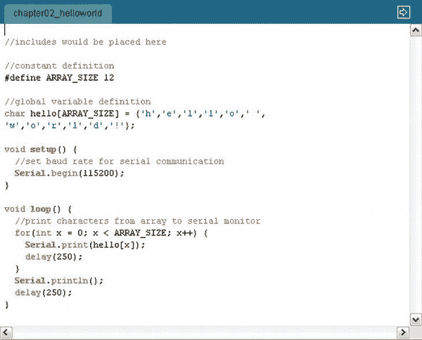

***图 2-1。** Arduino IDE 代码编辑器*

编辑器的顶部是操作栏。操作栏可让您快速访问编译等功能，以及`New`、`Open`、`Save`和`Upload`等文件操作，并启动串行监视器进行调试或直接向连接的电路板发送命令。在顶部的系统栏中(如图[图 2-2](#fig_2_2) 所示)，你可以选择更细粒度的操作，比如选择合适的板卡、通信端口、导入外部库等等。

***图 2-2。** Arduino IDE 系统栏和操作栏*

编辑器底部的状态栏显示你的编译和上传进度以及警告或编译错误(见[图 2-3](#fig_2_3) )。关于 Arduino IDE 更详细的解释，你可以参考 Arduino 网站上的原始文档。

***图 2-3。** Arduino IDE 状态字段*

Arduino 草图有两个重要的方法。第一个是`setup`方法，它只在代码执行开始时运行一次。这是你初始化程序的地方。第二种是`loop`法。该方法无限循环运行，直到板复位。这是实现程序逻辑的地方。正如你在[图 2-4](#fig_2_4) 中看到的，Arduino 草图的生命周期相当简单。

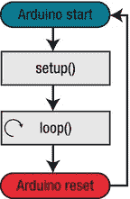

***图 2-4。**草图生命周期*

您也可以在同一个草图中定义自己的方法，或者链接其他源文件或库。要链接一段代码，可以使用 C 开发中已知的`#include`指令。包括放置在草图的最顶部。全局变量也必须在你的 include 指令下面的草图的顶部定义。由于 Arduino ADK 和大多数其他 ADK 板有 256 千字节的内存限制，你必须记住写干净的代码，这意味着没有代码重复，你必须坚持尽可能最小的数据类型，以便不耗尽内存。幸运的是，编译器总是向您显示编译后代码的确切大小，并在超出限制时发出警告。

现在是时候为 Arduino 编写你的“Hello World”程序了。在 Arduino IDE 中，选择操作栏中的`New`。在新打开的编辑器窗口中，输入如[清单 2-1](#list_2_1) 所示的代码。

***清单 2-1。** Arduino Hello World 草图*

`//includes would be placed here

//constant definition
#define ARRAY_SIZE 12

//global variable definition
char hello[ARRAY_SIZE] = {'h','e','l','l','o',' ','w','o','r','l','d','!'};

void setup() {
//set baud rate for serial communication
Serial.begin(115200);
}

void loop() {
//print characters from array to serial monitor
for(int x = 0; x < ARRAY_SIZE; x++) {
Serial.print(hello[x]);
delay(250);
}
Serial.println();
delay(250);
}`

我们来谈谈代码是做什么的。首先，您为数组的大小定义了一个常数。然后定义了一个 char 数组，其大小为 12。因为您的 char 数组中有 12 个字符的空间，所以您可以将“hello world！”投入其中。

在设置方法中，为串行通信准备电路板。串行对象提供了简化串行通信的方法。要开始通信，您可以使用参数 115200 调用 begin 方法。这就是所谓的*波特率*，定义了每秒可以传输多少位。串行通信中的接收方必须配置相同的波特率，以正确读取传输数据。

如前所述，循环方法会无休止地运行，直到电路板复位。在 loop 方法中，在 for 循环的帮助下打印 char 数组的每个字符，for 循环遍历所有元素。使用 Serial 类的 print 方法将元素打印到串行监视器上。您还会看到在每个字符打印输出之间调用了一个 delay 方法来降低输出速度，以获得更好的可读性。延迟参数以毫秒为单位。

当您输入所有内容后，单击操作栏中的 Verify，查看您的代码是否可以编译而不出现错误。如果一切正常，你可以连接你的 ADK 板到你的电脑。您需要告诉 IDE 您将 ADK 板连接到了哪个端口，以及它实际上是哪种类型的板，这样 IDE 才能以正确的方式将程序代码传输到板上。

点击工具板，选择 Arduino Mega 2560(参见[图 2-5](#fig_2_5) )。

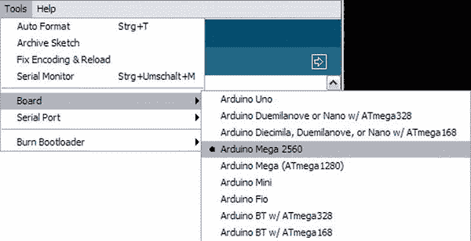

***图 2-5。** Arduino IDE 板选择*

现在转到工具串行端口并选择你的板连接的端口([图 2-6](#fig_2_6) )。

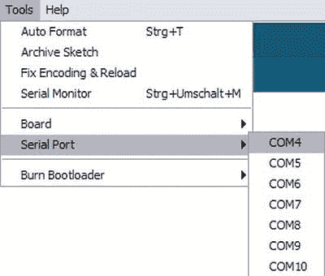

***图 2-6。** Arduino IDE 串口选择*

完成所有配置后，点击操作栏中的上传。你的代码将被编译并转移到 ADK 董事会。完成后，状态字段将显示“上传完成”。代码现在由您的 ADK 板处理并开始执行。单击 IDE 操作栏中的串行监视器，打开串行监视器并查看打印输出。要正确查看传输的数据，请确保将波特率正确设置为代码中的 115200。这是在串行监视器的右下角完成的。你现在应该看到“你好，世界！”在串行监视器窗口中反复打印，如图[图 2-7](#fig_2_7) 所示。

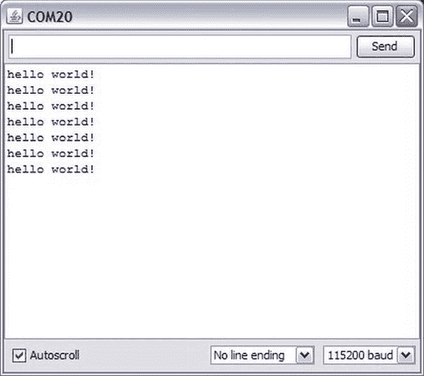

***图 2-7。** Arduino IDE 串行监视器*

恭喜你！你已经写好了你的第一张 Arduino 草图，并且已经做好了一切准备来开始真正的 ADK 部分。

 **注意**在撰写本文时，Arduino IDE 的新版本正在发布。1.0 版在内部库和 IDE 用户界面中引入了许多变化。一些与 ADK 相关的库可能还不完全兼容。如果您在编译示例时遇到任何问题，您可能希望确保使用 IDE 的旧版本。本书中的示例是用 Arduino IDE 修订版 0022 编写和编译的。

### 你好安卓

如果你以前没有使用过 Android，那么最好先熟悉一下这个平台的基础知识，了解一下它的关键组件。由于这本身就可以写满另一本书，我强烈建议你看看 Android 开发者页面，通读基础知识和基本原理，这样当我提到*活动*或*广播接收者*时，你就知道我在说什么了。下面简单介绍一下我刚才提到的基本组件。更多详情请参考 Android 开发指南。

*   *Activity*:Activity 是处理用户交互的组件。它的主要目的是以内容视图元素的形式提供一个用户界面，例如，用于文本显示或文本输入。活动用于可视化程序流。它们可以彼此交互，系统以堆栈结构维护它们。这种堆栈结构在系统需要从一个到另一个导航时特别有用。
*   *服务*:服务是长时间运行的过程，不需要用户交互。它们不会被误认为是线程，因为它们被绑定到同一个应用程序进程。服务还可以用于向其他应用程序公开功能。
*   broadcast receiver:broadcast receiver 是一个接收和处理系统或其他应用程序发送的广播的组件。当实现时，它可以在某些情况下做出反应，例如电池电量低，或者甚至可以用来启动应用程序。
*   *content provider*:content provider 用于在多个应用程序之间共享数据。例如，它提供了访问数据库中数据的方法。Android 系统中一个流行的 ContentProvider 是 ContentProvider for your contacts，它可以被很多应用程序使用。

你可以在`[http://developer.android.com/guide/index.html](http://developer.android.com/guide/index.html)`找到 Android 开发指南和其他几篇文章。

要编写 Android 的“Hello World”等价物，您必须打开 Eclipse IDE。一旦启动，选择`File`  `New`  `Other`(见[图 2-8](#fig_2_8) )。

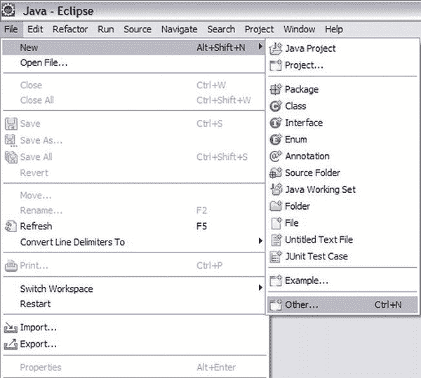

***图 2-8。** Eclipse IDE 新项目创建*

一个新的对话框将会弹出，里面有很多项目类型可供选择。您需要选择`Android Project`，点击`Next`，如图[图 2-9](#fig_2_9) 所示。

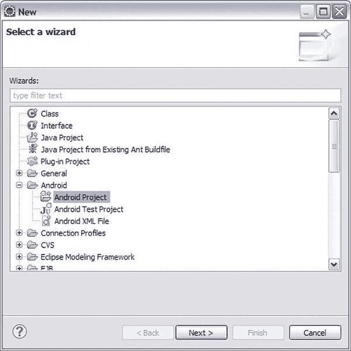

***图 2-9。** Eclipse IDE 项目类型选择*

在下一个对话框中，您可以配置项目设置。输入项目的名称，如`HelloWorld`。然后选择一个构建目标。目标取决于您使用的设备。如果您使用 Android 版本 2.3.4 或更高版本的设备，则选择`Google APIs platform 2.3.3 API level 10`。如果您使用的是 Android 或更高版本的设备，请选择`Google APIs platform 3.1 API level 12`。(参见[图 2-10](#fig_2_10) 。)

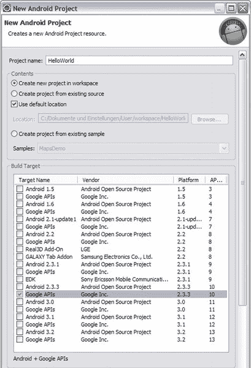

***图 2-10。** Eclipse IDE Android 项目向导(上半部分)*

接下来，定义您的应用程序名称。也可以输入`HelloWorld`。现在选择你的包名。包名将是 Android Market 中的唯一标识符，通常反映您的公司或组织的域名。对于这个例子，你可以输入`helloworld.adk`。检查显示`Create Activity`的复选标记，并键入`HelloWorldActivity`。最小 SDK 版本字段描述了应用程序兼容的 API 级别。因为您将需要 USB API 特性，如果您使用 2.3.4 设备，您应该为 API 级别 10 选择`10`,否则为 API 级别 12 选择`12`。其余的设置可以保持不变。(参见[图 2-11](#fig_2_11) 。)

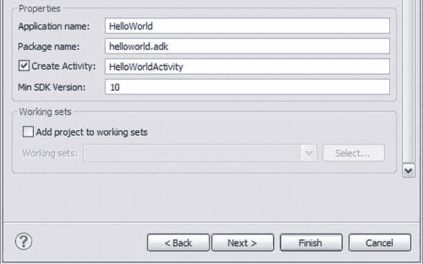

***图 2-11。** Eclipse IDE Android 项目向导(下部分)*

点击`Finish`，等待 Eclipse 建立您的第一个 Android ADK 项目。你新创建的项目应该看起来像[图 2-12](#fig_2_12) 。

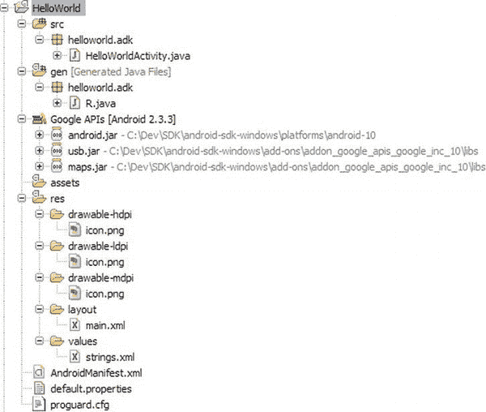

***图 2-12。**hello world 项目的 Eclipse IDE 包浏览器视图*

如果您看一下左边的 Package Explorer 区域，您会看到 Eclipse 用几个文件夹和文件创建了一个新项目。让我们看看他们都是什么意思。

首先你会看到的是`src`文件夹，它包含了你将要编写的所有 Java 源代码。您已经可以看到 Eclipse 已经构建了您配置的包结构，并将给定的`HelloWorldActivity.java`文件放入其中。在查看那个项目之前，您将进一步探索生成的项目。

除了`src`文件夹，还有一个文件夹叫`gen`。如果项目中的资源发生了变化，则每次构建项目时都会自动生成该文件夹及其内容。在那个文件夹里有一个叫做`R.java`的文件。这是一个文件，其中所有的资源都被索引并映射到整数。这些静态数字用于在代码中以一种简单的方式访问您的资源。你不应该接触`gen`文件夹，因为 Android 构建过程直接管理`R.java`文件，你手动做的每一个改变都会在下一次构建中被覆盖。

接下来你看到的是将在你的构建路径中使用的引用库。您应该看到`Google APIs`，旁边是您配置的目标版本。如果您展开节点，您会看到项目引用了一个`android.jar`，它包含您选择的 Android 版本的系统类文件；一个`usb.jar`，它包含您与 ADK 设备进行 USB 通信所需的 USB 特定类；以及一个`maps.jar`，它用于 Google Maps 集成。

下一个文件夹叫做`assets`，它通常包含你必须自己管理的额外资源。您必须通过它们在应用程序中的相对路径来引用它们，因为构建系统不会将引用放入`R.java`文件中。

第二个资源文件夹是一个名为`res`的托管文件夹。放入该文件夹的每个资源都会在`R.java`文件中获得一个自动生成的 id，以便于访问。你已经可以在`res`文件夹中看到几个子文件夹。`drawable`文件夹有一个带有屏幕密度标识符的后缀。如果在这些文件夹中为不同的屏幕密度提供不同的图像，系统将在执行应用程序时选择正确的文件。还有一个文件夹叫做`layout`。该文件夹包含定义应用程序 UI 的 xml 布局文件。一个布局文件可以有多个视图元素，这些元素构成了您的用户界面。您看到的最后一个文件夹是`values`文件夹。在`values`文件夹中，你可以为静态资源定义 xml 文件，比如字符串、维度、数组等等。

除了所有这些文件夹，你还会看到一些独立的文件:`AndroidManifest.xml`、`default.properties`和`proguard.cfg`。您唯一感兴趣的文件是`AndroidManifest.xml`，它是您的应用程序的中央注册表。关于活动、服务、权限、强制设备特性和许多其他特性的细节必须在这个文件中定义。

生成的项目不仅仅是一个骨架。它已经是一个成熟的应用程序，尽管非常初级。它只显示“Hello World，HelloWorldActivity”。让我们来看看这个应用程序的结构和生命周期。每个 Android 应用的起点是`AndroidManifest.xml`。打开它，看看它的结构([清单 2-2](#list_2_2) )。

***清单 2-2。** AndroidManifest.xml*

`<?xml version="1.0" encoding="utf-8"?>
<manifest xmlns:android="http://schemas.android.com/apk/res/android"
package="helloworld.adk"
android:versionCode="1"
android:versionName="1.0">
<uses-sdk android:minSdkVersion="10" />

<application android:icon="@drawable/icon" android:label="@string/app_name">
<activity android:name=".HelloWorldActivity" android:label="@string/app_name" android:screenOrientation="portrait">
<intent-filter>
<action android:name="android.intent.action.MAIN" />
<category android:name="android.intent.category.LAUNCHER" />
</intent-filter>
</activity>
</application>
</manifest>`

您可以看到一个`application`标签，它的属性定义了应用程序的`icon`和`label`。这两个资源都用 xml 资源语法`@resource-type/id`引用。用`@string/app_name`引用的应用程序名称将取自`res/values`文件夹中`strings.xml`文件中定义的字符串。相同的资源查找语法适用于 drawables 和您将在任何 xml 文件中看到的所有其他资源。

在应用程序节点中，您定义了所有的活动、服务、内容提供者和广播接收者。到目前为止，清单中只声明了一项活动。看看那个。`name`属性必须是活动的类名。因为该类在应用程序默认包中，所以它前面有一个点。如果您将类移动到另一个包中，请确保使用正确的包结构更新名称，否则系统将无法再找到它。

活动节点中重要的是`intent-filter`。`intent-filter`定义了系统如何启动活动以及如何触发活动。

在`action`标签中，您可以看到该活动被标记为应用程序的主活动，并且将在用户启动应用程序时首先启动。

`category`标签指定了启动器类别，这意味着应用程序链接将放入设备上的应用程序概览菜单中，将启动您的活动。

在与`application`标签相同的层次级别上，您可以看到`uses-sdk`标签，它定义了 Android API 级别版本，并且是必需的。在该层级中，您还可以定义用户在安装过程中必须授予的权限，例如访问附件。

您已经知道应用程序的起点在哪里。现在让我们看看你的主要活动实际上是做什么的。打开`HelloWorldActivity.java`文件并查看其内容([清单 2-3](#list_2_3) )。

***清单 2-3。HelloWorldActivity.java***

`package helloworld.adk;

import android.app.Activity;
import android.os.Bundle;

public class HelloWorldActivity extends Activity {
/** Called when the activity is first created. */
@Override
public void onCreate(Bundle savedInstanceState) {
super.onCreate(savedInstanceState);
setContentView(R.layout.main);
}
}`

如你所见，这个文件很小。该类必须扩展`Activity`类，它是 Android 系统的一部分。因为活动负责提供用户界面，所以您必须提供一些视图来显示给用户。视图通常在活动创建时加载。Android 平台提供了活动生命周期的挂钩，这样您就可以创建资源、运行应用程序逻辑，并在活动的相应阶段进行清理。一个 Android 活动的生命周期比一个简单的 Arduino 草图要复杂一些，如图 2-13 所示。

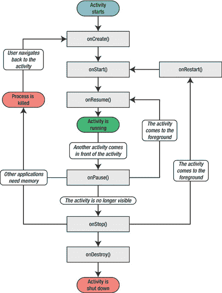

***图 2-13。**安卓活动生命周期(谷歌公司图片财产来源:`[http://developer.android.com/guide/topics/fundamentals/activities.html](http://developer.android.com/guide/topics/fundamentals/activities.html)` )*

你可以看到`setContentView`方法是以布局资源为参数调用的。该方法采用`layout/main.xml`中的布局定义，并将其所有视图呈现在设备屏幕上。如果你打开这个`main.xml`文件，你可以看到它只定义了两个视图元素(见[清单 2-4](#list_2_4) )。

***清单 2-4。**布局文件 main.xml*

`<?xml version="1.0" encoding="utf-8"?>
<LinearLayout xmlns:android="http://schemas.android.com/apk/res/android"
android:orientation="vertical"
android:layout_width="fill_parent"
android:layout_height="fill_parent"
>
<TextView
android:layout_width="fill_parent"
android:layout_height="wrap_content"
android:text="@string/hello"
/>
</LinearLayout>`

`LinearLayout`是一个可以容纳其他视图或容器的容器视图。`layout_width`和`layout_height`属性被设置为在设备的整个屏幕上延伸。`orientation`属性指定所包含的元素应该垂直对齐。目前包含在`LinearLayout`中的唯一元素是`TextView`元素。从它的属性可以看出，它应该填充屏幕的宽度，但应该只与它自己的内容一样高。`TextView`的文本由来自`strings.xml`文件的`@string/hello`引用解析。如果您在 Eclipse 中从 xml 编辑器切换到图形布局编辑器，您应该已经在虚拟设备屏幕上看到文本`“Hello World, HelloWorldActivity!”`。现在够了。让我们在真实设备上看看这个应用程序。

将您的 Android 设备连接到您的计算机，右键单击该项目，选择`Run As`，然后选择`Android Application`。您的应用程序应该被打包成一个`apk`文件，并被推送到设备上进行安装。如果一切正常，您应该看到应用程序在您的设备上启动。例如，如果系统由于缺少驱动程序而无法识别你的设备，它将使用默认的 Android 虚拟设备(AVD)启动一个模拟器。当应用程序启动后，你应该会看到类似[图 2-14](#fig_2_14) 的内容。

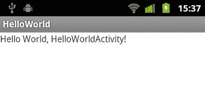

***图 2-14。**运行在安卓设备上的 HelloWorld 应用*

### 相识

恭喜你！您已经编写了您的第一个 Arduino 应用程序和第一个 Android 应用程序。现在，您对设置项目和为两个平台编写代码已经稍微熟悉了一些，让我们看看这两个设备如何在开放附件协议的帮助下相互识别。

#### 为 Arduino 扩展 Hello World

您先前下载的 ADK 参考包包含两个库，您将需要它们来建立 USB 通信。一个是`USB_Host_Shield`库的修改版本，最初是由 Oleg Mazurov 为 Circuits@Home 创建的。该库最初设计用于 Arduino USB 主机保护。由于 ADK 兼容板上的 USB 芯片相当于 USB host shield，因此只对库进行了一些小的修改。第二个库是`AndroidAccessory`库，负责实现开放附件协议。将在`ADK_release_xxxx\firmware\arduino_libs\`找到的两个库文件夹复制到`arduino-xxxx\libraries`的 Arduino IDE 安装的库文件夹中。修改你的 Arduino `HelloWorld`草图，如清单 2-5 所示。

***清单 2-5。** Hello World Sketch 扩展识别安卓设备*

`#include <Max3421e.h>
#include <Usb.h>
**#include <AndroidAccessory.h>**

#define ARRAY_SIZE 12

**AndroidAccessory acc("Manufacturer", "Model", "Description",**
**"Version", "URI", "Serial");**

char hello[ARRAY_SIZE] = {'h','e','l','l','o',' ',
'w','o','r','l','d','!'};

**void setup() {
Serial.begin(115200);
acc.powerOn();
}**

**void loop() {
if (acc.isConnected()) {
for(int x = 0; x < ARRAY_SIZE; x++) {
Serial.print(hello[x]);
delay(250);
}
Serial.println();
delay(250);
}
}**`

如您所见，准备开放式配件沟通的草图只需三处改动。这里你要做的第一件事是初始化一个`AndroidAccessory`对象，这个实现了开放附件协议，这样你就不用担心了。你用一些描述性的字符串来初始化它，这些字符串定义了你创建的附件。这些字段是不言自明的。最重要的参数是`Manufacturer`、`Model`和`Version`。它们将在 Android 应用程序中用于验证您是否与正确的 ADK 板通信。此外，如果没有安装安卓应用程序，安卓系统使用 URI 参数来寻找合适的安卓应用程序。这可以是一个链接到 Android 市场或产品页面。

在`setup`例程中，您用`powerOn`方法将对象设置为活动状态。`loop`例程在每个循环中检查是否有东西连接到附件，然后才执行其中的代码。在这个方便的方法中，实现了实际的连接协议。

只用了三行代码，ADK 板就能识别支持附件模式的连接的 Android 设备。就这么简单。如果你把代码上传到你的 ADK 板上，你会看到“你好，世界！”只有当您将 Android 设备连接到 ADK 板时，才会打印到串行监视器。您将在串行监视器上看到如下内容:

`Device addressed... Requesting device descriptor.
found possible device. switching to serial mode
device supports protcol 1

Device addressed... Requesting device descriptor.
found android accessory device
config desc
interface desc
interface desc
5
7`

第一段告诉你，一般来说，一个设备已经被识别，并且这个设备支持开放的 Android 附件协议。在第二段中，再次读取设备描述符，以查看 Android 设备是否将自己标识为处于附件模式的设备。每个 USB 设备都有这样一个描述符，用于向连接系统标识自己。您可以看到，该设备被正确识别为配件模式兼容。现在正在读取配置和接口描述符，您将看到的最后两个数字是要使用的通信的输入和输出端点。如果一切顺利，你会看到“你好，世界！”是一个字符一个字符打印出来的。如果你想了解更多关于`AndroidAccessory`库的内部，以及它是如何实现开放附件协议的，可以看看`[http://developer.android.com/guide/topics/usb/adk.html](http://developer.android.com/guide/topics/usb/adk.html)`的“实现 Android 附件协议”一节。

#### 为 Android 扩展 Hello World

要为开放附件协议准备 Android 应用程序，您还不需要编写任何代码。你要做的第一件事是在`AndroidManifest.xml`中做一些改变。你必须声明你正在使用 USB 功能。由于您希望通过 USB 进行通信，因此需要在 Android 版本低于 3.1 的设备的清单中声明 USB 库的使用。将下列行添加到`AndroidManifest.xml`:

`<uses-feature android:name="android.hardware.usb.accessory" />

<application android:icon="@drawable/icon" android:label="@string/app_name">
<uses-library android:name="com.android.future.usb.accessory" />
…
</application>`

这个 USB 库被反向移植到 Android 版本 2.3.4，并被命名为 com.android.future.usb。Android 版本 3.1 的类被放在名为 android.hardware.usb 的包中。如果你想支持广泛的设备，你应该使用 com . Android . future . USB 包，因为它对两个版本都兼容。在蜂窝设备上，com.android.future.usb 包中的类只是包装类，它们委托给 android.hardware.usb 包中的类。

接下来需要声明的是另一个意图过滤器，当 Android 设备连接到附件时，它会启动应用程序。在 HelloWorldActivity 的 activity 节点中添加以下代码行:

`<activity android:name=".HelloWorldActivity" android:label="@string/app_name"
android:screenOrientation="portrait">
<intent-filter>
<action android:name="android.intent.action.MAIN" />
<category android:name="android.intent.category.LAUNCHER" />
</intent-filter>
<intent-filter>
<action android:name="android.hardware.usb.action.USB_ACCESSORY_ATTACHED" />
</intent-filter>
<meta-data android:name="android.hardware.usb.action.USB_ACCESSORY_ATTACHED"
android:resource="@xml/accessory_filter" />
</activity>`

如您所见，这里添加了第二个意图过滤器，它对 USB_ACCESSORY_ATTACHED 动作做出反应。当您将 Android 设备连接到 ADK 兼容板时，这将触发 HelloWorldActivity。还添加了一个新元素。元数据标签引用额外的资源，这些资源可被提供给意图过滤器以进一步细化过滤机制。这里引用的 accessory_filter.xml 定义了一个更细粒度的过滤标准，只匹配您的附件，不匹配其他附件。在/res 文件夹中创建一个名为 xml 的文件夹。在创建的文件夹中添加一个名为 accessory_filter.xml 的新文件。现在将清单 2-6 中的内容添加到 xml 文件中。

***清单 2-6。**定义附件过滤的元文件*

`<?xml version="1.0" encoding="utf-8"?>
<resources>
<usb-accessory manufacturer="Manufacturer" model="Model" version="Version" />
</resources>`

请注意，您在这里指定的值必须与初始化`AndroidAccessory`对象时 Arduino 草图中的值相同。如果这些值与板传输的值匹配，过滤器将触发活动开始。将您的 Android 设备连接到您的 PC，并上传更改后的应用程序。现在把你的设备连接到 ADK 板上。您可能会看到弹出一个对话框，询问您是否希望总是将您的应用程序与已识别的意图相关联。您可以确认这一点，然后，您将看到应用程序已经启动。如果您发现连接设备后没有任何反应，请检查您的过滤器是否与 Arduino 草图中定义的值相匹配。另一个错误来源是，您的主板无法提供足够的功率来为 Android 设备正常供电。由于这是开放附件标准的要求，如有必要，请确保使用外部电源为电路板供电。

### 我们谈谈吧

现在，您已经确保了两台设备能够相互识别，但您希望它们能够真正相互通话。通信是在一个相当简单的自定义协议中完成的。消息通过字节流发送和接收。在 Android 应用程序中，这是通过读写一个特殊文件的输入输出流来完成的。在 Arduino 端，`AndroidAccessory`类提供了读写消息的方法。对于通信协议应该是什么样子没有限制。在示例`demokit`应用程序中，Google 将消息定义为 3 字节长的字节数组。(参见[图 2-15](#fig_2_15) )。第一个字节是命令类型。它定义了传输哪种类型的消息。在`demokit`应用程序中使用的命令是伺服系统、发光二极管、温度传感器和许多其他设备的命令类型。第二个字节是该命令的实际目标。谷歌演示盾有多个发光二极管和伺服连接器，并解决适当的，目标字节使用。第三个字节是应该发送到该目标或从该目标接收的值。一般来说，当您自己实现这些消息时，您可以选择您想要的任何消息结构，但是我建议您坚持使用示例，因为您可能会在整个 Web 上找到基于相同消息结构的教程和示例。请记住，您只能传输字节，因此您必须相应地转换更大的数据类型。在大多数例子中，你也会遵循这个惯例。

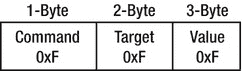

***图 2-15。**Google 在 demokit 应用中定义的默认消息协议*

然而，对于第一个例子，你必须稍微改变一下规则，定义一个自定义协议来传输文本信息(见[图 2-16](#fig_2_16) )。传输的数据也是字节数组，但形式略有不同。第一个字节将定义命令类型，第二个字节将定义目标，第三个字节定义文本消息的长度(不超过 252 个字节)，最后剩余的字节定义实际的文本消息。

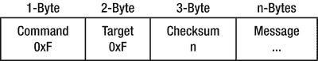

***图 2-16。**发送和接收短信的自定义短信协议*

#### 处理 Arduino 命令

Arduino 草图中的通信实现非常简单。如清单 2-7 中的[所示扩展草图。](#list_2_7)

***清单 2-7。**hello world Sketch 中的通信实现*

`#include <Max3421e.h>
#include <Usb.h>
#include <AndroidAccessory.h>

**#define ARRAY_SIZE 25
#define COMMAND_TEXT 0xF
#define TARGET_DEFAULT 0xF**

AndroidAccessory acc("Manufacturer", "Model", "Description",
"Version", "URI", "Serial");

**char hello[ARRAY_SIZE] = {'H','e','l','l','o',' ',
'W','o','r','l','d',' ', 'f', 'r', 'o', 'm', ' ',
'A', 'r', 'd', 'u', 'i', 'n', 'o', '!'};**

**byte rcvmsg[255];
byte sntmsg[3 + ARRAY_SIZE];**

void setup() {
Serial.begin(115200);
acc.powerOn();
}

**void loop() {
if (acc.isConnected()) {
//read the sent text message into the byte array
int len = acc.read(rcvmsg, sizeof(rcvmsg), 1);
if (len > 0) {
if (rcvmsg[0] == COMMAND_TEXT) {
if (rcvmsg[1] == TARGET_DEFAULT){
//get the textLength from the checksum byte
byte textLength = rcvmsg[2];
int textEndIndex = 3 + textLength;
//print each character to the serial output
for(int x = 3; x < textEndIndex; x++) {
Serial.print((char)rcvmsg[x]);
delay(250);
}
Serial.println();
delay(250);
}
}
}

sntmsg[0] = COMMAND_TEXT;
sntmsg[1] = TARGET_DEFAULT;
sntmsg[2] = ARRAY_SIZE;
for(int x = 0; x < ARRAY_SIZE; x++) {
sntmsg[3 + x] = hello[x];**` `**}
acc.write(sntmsg, 3 + ARRAY_SIZE);
delay(250);
}
}**`

让我们看看这里有什么新内容。因为您想要向 Android 设备发送更具体的文本，所以您需要更改文本消息及其大小常量。

`#define ARRAY_SIZE 25
char hello[ARRAY_SIZE] = {'H','e','l','l','o',' ',
'W','o','r','l','d',' ', 'f', 'r', 'o', 'm', ' ',
'A', 'r', 'd', 'u', 'i', 'n', 'o', '!'};`

接下来您需要做的是为接收的消息声明一个字节数组，为要发送的消息声明一个字节数组。

`byte rcvmsg[255];
byte sntmsg[3 + ARRAY_SIZE];`

请注意，要发送的字节数组的大小等于消息本身加上命令类型、目标和校验和的附加字节。命令类型字节和目标字节也可以定义为常量。

`#define COMMAND_TEXT 0xF
#define TARGET_DEFAULT 0xF`

在循环方法中，您将处理消息的接收和发送。首先看一下信息是如何被接收的:

`if (acc.isConnected()) {
//read the sent text message into the byte array
int len = acc.read(rcvmsg, sizeof(rcvmsg), 1);
if (len > 0) {
if (rcvmsg[0] == COMMAND_TEXT) {
if (rcvmsg[1] == TARGET_DEFAULT){
//get the textLength from the checksum byte
byte textLength = rcvmsg[2];
int textEndIndex = 3 + textLength;
//print each character to the serial output
for(int x = 3; x < textEndIndex; x++) {
Serial.print((char)rcvmsg[x]);
delay(250);
}
Serial.println();
delay(250);
}
}
}
…
}`

AndroidAccessory 对象的 read 方法读取 inputstream 并将其内容复制到提供的字节数组中。作为参数，read 方法采用应该填充的字节数组、该字节数组的长度以及一个阈值，以防传输未被确认。之后，执行检查以查看是否传输了正确的命令和目标类型；只有这样，才能确定传输消息的长度。从 for 循环中的字节数组读取实际的文本消息，并逐字符打印到串行输出。收到一条消息后，另一条消息被发送到 Android 设备，如下所示:

`if (acc.isConnected()) {
…
sntmsg[0] = COMMAND_TEXT;
sntmsg[1] = TARGET_DEFAULT;
sntmsg[2] = ARRAY_SIZE;
for(int x = 0; x < ARRAY_SIZE; x++) {
sntmsg[3 + x] = hello[x];
}
acc.write(sntmsg, 3 + ARRAY_SIZE);
delay(250);
}`

同样，要发送的字节数组是根据自定义协议构建的。第一个字节设置为命令类型常量，第二个字节设置为目标常量，第三个字节设置为作为校验和的实际文本消息的大小。现在，程序遍历 hello char 数组，用文本消息填充字节数组。当字节数组设置完毕后，调用 AndroidAccessory 对象的 write 方法，通过 outputstream 将数据传输到 Android 设备。write 方法有两个参数:要传输的字节数组和传输的字节大小。

正如你所看到的，Arduino 草图非常简单，AndroidAccessory 对象为你做了所有的脏工作。现在让我们来看看 Android 通信部分。

#### 处理 Android 命令

在 Android 中实现通信部分比在 Arduino 端需要更多的工作。扩展`HelloWorldActivity`类，如清单 2-8 中的[所示。此后，您将了解每个代码片段的作用。](#list_2_8)

***清单 2-8。【HelloWorldActivity.java T2(进口和变量)】***

`package helloworld.adk;

import java.io.FileDescriptor;
import java.io.FileInputStream;
import java.io.FileOutputStream;
import java.io.IOException;

import android.app.Activity;
import android.app.PendingIntent;
import android.content.BroadcastReceiver;
import android.content.Context;
import android.content.Intent;
import android.content.IntentFilter;
import android.os.Bundle;
import android.os.ParcelFileDescriptor;
import android.util.Log;` `import android.widget.TextView;

import com.android.future.usb.UsbAccessory;
import com.android.future.usb.UsbManager;

public class HelloWorldActivity extends Activity {

private static final String TAG = HelloWorldActivity.class.getSimpleName();

private PendingIntent mPermissionIntent;
private static final String ACTION_USB_PERMISSION = "com.android.example.USB_PERMISSION";
private boolean mPermissionRequestPending;

private UsbManager mUsbManager;
private UsbAccessory mAccessory;
private ParcelFileDescriptor mFileDescriptor;
private FileInputStream mInputStream;
private FileOutputStream mOutputStream;

private static final byte COMMAND_TEXT = 0xF;
private static final byte TARGET_DEFAULT = 0xF;

private TextView textView;

…`

首先让我们来看看你需要做的变量声明。

`private static final String TAG = HelloWorldActivity.class.getSimpleName();`

constant 标签是当前类的标识符，在 Android 中仅用于记录目的。如果您在设备或模拟器运行时查看 Eclipse 中的 logcat 视图，您会看到记录的消息与一个标记相关联，这简化了读取日志输出。(参见[图 2-17](#fig_2_17) 。)您可以为此定义任何字符串，但是出于调试目的使用应用程序名甚至类名是个好主意。

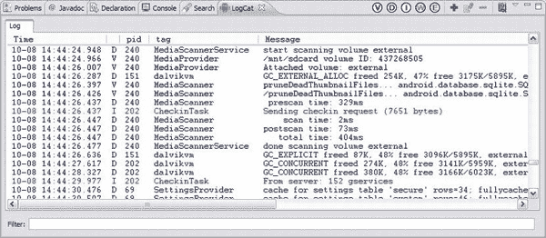

***图 2-17。**月食日志视图*

`private static final byte COMMAND_TEXT = 0xF;
private static final byte TARGET_DEFAULT = 0xF;`

COMMAND_TEXT 和 TARGET_DEFAULT 与 Arduino 草图中使用的常量相同。它们构成了数据协议的前两个字节。

`private PendingIntent mPermissionIntent;
private static final String ACTION_USB_PERMISSION = "com.android.example.USB_PERMISSION";
private boolean mPermissionRequestPending;`

与外部设备建立连接必须得到用户的许可。当用户授予连接到您的 ADK 板的权限时，PendingIntent 将广播 ACTION_USB_PERMISSION，并带有一个反映用户是确认还是拒绝访问的标志。布尔变量 mPermissionRequestPending 仅用于在用户交互仍未完成时不再显示权限对话框。

`private UsbManager mUsbManager;
private UsbAccessory mAccessory;
private ParcelFileDescriptor mFileDescriptor;
private FileInputStream mInputStream;
private FileOutputStream mOutputStream;`

UsbManager 是一项系统服务，用于管理与设备 USB 端口的所有交互。它用于列举连接的设备，并请求和检查连接到附件的许可。UsbManager 还负责打开与外部设备的连接。USB 存储器是连接附件的参考。ParcelFileDescriptor 是在与附件建立连接时获得的。它用于访问附件的输入和输出流。

`private TextView textView;`

唯一用户可见的 UI 元素是 textView，它应该显示从 ADK 板传输的消息。

这就是你需要声明的所有变量。现在我们将看看活动的生命周期方法([清单 2-9](#list_2_9) )。

***清单 2-9。【HelloWorldActivity.java T2(生命周期方法)】***

`/** Called when the activity is first created. */
@Override
public void onCreate(Bundle savedInstanceState) {
super.onCreate(savedInstanceState);

mUsbManager = UsbManager.getInstance(this);
mPermissionIntent = PendingIntent.getBroadcast(this, 0, new Intent( ACTION_USB_PERMISSION), 0);
IntentFilter filter = new IntentFilter(ACTION_USB_PERMISSION);
filter.addAction(UsbManager.ACTION_USB_ACCESSORY_DETACHED);
registerReceiver(mUsbReceiver, filter);

setContentView(R.layout.main);
textView = (TextView) findViewById(R.id.textView);
}

/** Called when the activity is resumed from its paused state and immediately after onCreate(). */
@Override
public void onResume() {
super.onResume();

if (mInputStream != null && mOutputStream != null) {
return;
}

UsbAccessory[] accessories = mUsbManager.getAccessoryList();
UsbAccessory accessory = (accessories == null ? null : accessories[0]);
if (accessory != null) {
if (mUsbManager.hasPermission(accessory)) {
openAccessory(accessory);
} else {
synchronized (mUsbReceiver) {
if (!mPermissionRequestPending) {
mUsbManager.requestPermission(accessory, mPermissionIntent);
mPermissionRequestPending = true;
}
}
}
} else {
Log.d(TAG, "mAccessory is null");
}
}

/** Called when the activity is paused by the system. */
@Override
public void onPause() {` `super.onPause();
closeAccessory();
}

/** Called when the activity is no longer needed prior to being
removed from the activity stack. */
@Override
public void onDestroy() {
super.onDestroy();
unregisterReceiver(mUsbReceiver);
}` 

每个活动类的第一个生命周期回调方法是 onCreate 方法。这个方法通常是你进行基本初始化的地方。不过，要小心。onCreate 方法只在系统创建活动时调用一次。该活动将继续存在，直到系统需要释放内存并终止它，或者如果您显式调用该活动的 finish 方法来告诉系统不再需要该活动。

`/** Called when the activity is first created. */
@Override
public void onCreate(Bundle savedInstanceState) {
super.onCreate(savedInstanceState);

mUsbManager = UsbManager.getInstance(this);
mPermissionIntent = PendingIntent.getBroadcast(this, 0, new Intent(
ACTION_USB_PERMISSION), 0);
IntentFilter filter = new IntentFilter(ACTION_USB_PERMISSION);
filter.addAction(UsbManager.ACTION_USB_ACCESSORY_DETACHED);
registerReceiver(mUsbReceiver, filter);

setContentView(R.layout.main);
textView = (TextView) findViewById(R.id.textView);
}`

在生命周期回调方法中需要做的最重要的事情是将调用委托给被扩展的父类；否则，将发生异常。委托调用 super . oncreate(savedInstanceState)允许父 activity 类完成它的所有初始化逻辑，然后 HelloWorldActivity 可以继续它自己的初始化。接下来，获取一个对 USB 系统服务的引用，以便您稍后可以调用它的方法。现在定义了一个带有 ACTION_USB_PERMISSION 参数的 PendingIntent。当您请求用户允许连接到 USB 设备时，您将需要它。您在这里看到的意图过滤器与广播接收器一起使用，以确保应用程序只侦听特定的广播。过滤器定义它对您在开始时定义为常量的 ACTION_USB_PERMISSION 动作和 ACTION_USB_ACCESSORY_DETACHED 动作起作用，用于 ADK 附件断开时。registerReceiver 方法在系统中向所描述的意图过滤器注册广播接收器。因此，当系统发送广播时，广播接收器将得到通知，并可以采取相关措施。

在 onCreate 方法中，您需要做的最后一件事是设置您的 UI 元素，以便用户可以实际看到正在发生的事情。您已经了解到 Android 中的 UI 布局大部分是在 xml 文件中定义的。再次使用 setContentView 方法加载布局。代码中的最后一行用于从布局中获取对视图元素的引用，以便可以在代码中对其进行管理。findViewById 方法获取一个视图标识符，并返回该引用的通用视图元素。这就是为什么需要对视图元素的正确实现进行强制转换的原因。为了能够从布局 xml 文件中引用视图，这些视图需要定义一个标识符。在 res/layout/打开 main.xml 文件，并将 id 属性添加到 TextView。

`<TextView
android:id="@+id/textView"
android:layout_width="fill_parent"
android:layout_height="wrap_content"
android:text="@string/hello"
/>`

这里可以看到动态资源生成的新语法。语法@+id/textView 意味着该视图元素应该分配有 id textView。id 前面的加号意味着，如果这个 id 在 R.java 文件中不存在，那么应该在那里创建一个新的引用。

您已经完成了活动的创建阶段。现在你进入下一个重要的生命周期阶段，onResume 生命周期钩子。每次活动从暂停状态返回时，都会调用 onResume 方法。当您离开活动开始新的活动或返回设备的主屏幕时，您的活动将被设置为暂停状态，而不是被终止。系统这样做是为了节省时间和内存分配，以防稍后再次显示该活动。在暂停状态下，活动对用户不再可见。如果应该再次显示该活动，则该活动仅从其暂停状态返回，并设置为恢复状态，而不是再次完全初始化。当这种情况发生时，onResume 生命周期方法被调用。onResume 方法不应该负责进行主要的初始化。在这种情况下，它应该检查您是否仍然能够与附件通信。这正是你在这里做的。

`@Override
public void onResume() {
super.onResume();

if (mInputStream != null && mOutputStream != null) {
return;
}

UsbAccessory[] accessories = mUsbManager.getAccessoryList();
UsbAccessory accessory = (accessories == null ? null : accessories[0]);
if (accessory != null) {
if (mUsbManager.hasPermission(accessory)) {
openAccessory(accessory);
} else {
synchronized (mUsbReceiver) {
if (!mPermissionRequestPending) {
mUsbManager.requestPermission(accessory, mPermissionIntent);
mPermissionRequestPending = true;
}
}
}
} else {
Log.d(TAG, "mAccessory is null");
}
}`

如果输入和输出流仍然是活动的，那么你可以进行通信，并且可以从 onResume 方法中提前返回。否则，您必须从 UsbManager 获取附件的参考。如果您已经拥有与设备通信的用户权限，您可以打开并重新分配输入和输出流。这部分是在一个名为 openAccessory 的方法中实现的，稍后会详细介绍。这里我要讲的最后两个生命周期方法是 onPause 方法和 onDestroy 方法。

`@Override
public void onPause() {
super.onPause();
closeAccessory();
}

@Override
public void onDestroy() {
super.onDestroy();
unregisterReceiver(mUsbReceiver);
}`

onResume 方法的反面是 onPause 方法。您已经了解了活动的暂停状态，因为您在 onResume 方法中打开了到附件的连接，所以您应该注意在 onPause 方法中关闭连接以释放内存。

如果调用生命周期方法 onDestroy，您的活动将被终止，并且不再出现在应用程序活动堆栈中。这个生命周期阶段可以描述为 onCreate 方法的对立面。尽管您在 onCreate 阶段完成了所有的初始化工作，但是您将在 onDestroy 阶段完成反初始化和清理工作。因为应用程序只有这一个活动，所以当 onDestroy 在活动上被调用时，应用程序也会被系统杀死。您在创建时注册了一个广播接收器，以收听特定于配件的事件。由于应用程序不再存在，你应该在这里注销这个广播接收器。为此，使用广播接收器作为参数调用 unregisterReceiver 方法。

生命周期方法到此结束。到目前为止，这相当容易。通信部分的实现一开始看起来有点棘手，但是不要担心。我会引导你完成它(见清单 2-10 )。

***清单 2-10。【HelloWorldActivity.java T2】(建立附件连接)***

`private final BroadcastReceiver mUsbReceiver = new BroadcastReceiver() {
@Override
public void onReceive(Context context, Intent intent) {
String action = intent.getAction();
if (ACTION_USB_PERMISSION.equals(action)) {
synchronized (this) {
UsbAccessory accessory = UsbManager.getAccessory(intent);
if (intent.getBooleanExtra(UsbManager.EXTRA_PERMISSION_GRANTED, false)) {
openAccessory(accessory);
} else {
Log.d(TAG, "permission denied for accessory " + accessory);
}
mPermissionRequestPending = false;
}
} else if (UsbManager.ACTION_USB_ACCESSORY_DETACHED.equals(action)) {
UsbAccessory accessory = UsbManager.getAccessory(intent);
if (accessory != null && accessory.equals(mAccessory)) {` `closeAccessory();
}
}
}
};

private void openAccessory(UsbAccessory accessory) {
mFileDescriptor = mUsbManager.openAccessory(accessory);
if (mFileDescriptor != null) {
mAccessory = accessory;
FileDescriptor fd = mFileDescriptor.getFileDescriptor();
mInputStream = new FileInputStream(fd);
mOutputStream = new FileOutputStream(fd);
Thread thread = new Thread(null, commRunnable, TAG);
thread.start();
Log.d(TAG, "accessory opened");
} else {
Log.d(TAG, "accessory open fail");
}
}

private void closeAccessory() {
try {
if (mFileDescriptor != null) {
mFileDescriptor.close();
}
} catch (IOException e) {
} finally {
mFileDescriptor = null;
mAccessory = null;
}
}`

这里首先看到的是 BroadcastReceiver 的实现。现在您知道您需要在各自的生命周期方法中注册和注销广播接收器，但是现在让我们看看应该如何实现广播接收器。

`private final BroadcastReceiver mUsbReceiver = new BroadcastReceiver() {

@Override
public void onReceive(Context context, Intent intent) {
String action = intent.getAction();
if (ACTION_USB_PERMISSION.equals(action)) {
synchronized (this) {
UsbAccessory accessory = UsbManager.getAccessory(intent);
if (intent.getBooleanExtra(UsbManager.EXTRA_PERMISSION_GRANTED, false)) {
openAccessory(accessory);
} else {
Log.d(TAG, "permission denied for accessory " + accessory);
}
mPermissionRequestPending = false;
}
} else if (UsbManager.ACTION_USB_ACCESSORY_DETACHED.equals(action)) {` `UsbAccessory accessory = UsbManager.getAccessory(intent);
if (accessory != null && accessory.equals(mAccessory)) {
closeAccessory();
}
}
}
};`

广播接收器是作为 broadcast receiver 类型的匿名内部类实现的。您必须覆盖的唯一方法是 onReceive 方法，如果该广播接收器已注册并与提供的 intent-filter 匹配，则系统会调用该方法。记住，在意图过滤器中定义了两个动作。您必须检查在调用广播接收器时发生了什么操作。如果您收到描述许可请求已被回应的操作，您必须检查用户是否被授予与您的配件通信的许可。如果是这样，您可以打开附件的通信通道。可能已经触发广播接收器的第二个动作是附件已经从 Android 设备分离的通知。在这种情况下，你需要清理并关闭你的沟通渠道。如您所见，BroadcastReceiver 调用 openAccessory 方法和 closeAccessory 方法来打开和关闭附件的通信通道。接下来我们来看看那些方法。

`private void openAccessory(UsbAccessory accessory) {
mFileDescriptor = mUsbManager.openAccessory(accessory);
if (mFileDescriptor != null) {
mAccessory = accessory;
FileDescriptor fd = mFileDescriptor.getFileDescriptor();
mInputStream = new FileInputStream(fd);
mOutputStream = new FileOutputStream(fd);
Thread thread = new Thread(null, commRunnable, TAG);
thread.start();
Log.d(TAG, "accessory opened");
} else {
Log.d(TAG, "accessory open fail");
}
}`

在 openAccessory 方法中，您委托 USB 服务方法(也称为 openAccessory)来获取附件的 FileDescriptor。FileDescriptor 管理您将用来与设备通信的输入和输出流。一旦流被分配，你也将启动一个单独的线程，该线程将实际接收和发送消息，但稍后会详细介绍。

如果您还没有权限连接到您的附件，并且您没有处于用户权限的挂起状态，您必须通过调用 USB 服务上的 request permission 方法来请求您的附件的权限。requestPermission 方法有两个参数，您请求权限的附件和待定意向。这个挂起的意图是您在 onCreate 方法中定义的 mPermissionIntent，它负责在用户授予或拒绝与附件通信的权限时发送带有 ACTION_USB_PERMISSION 的广播。您可能还记得，您还在 onCreate 方法中注册了一个广播接收器，该方法为完全相同的操作提供了一个 intent-filter。一旦广播被发送，广播接收器将对其做出反应。

closeAccessory 方法负责关闭附件的所有剩余的打开连接。

`private void closeAccessory() {
try {
if (mFileDescriptor != null) {
mFileDescriptor.close();
}
} catch (IOException e) {
} finally {
mFileDescriptor = null;
mAccessory = null;
}
}`

它所做的只是关闭附件的文件描述符。系统将处理与其流相关联的所有底层 OS 资源。

当您最终打开与附件的连接时，您可以来回发送和接收数据。[清单 2-11](#list_2_11) 显示了实际的通信实现。

***清单 2-11。【HelloWorldActivity.java T2】(通信实施)***

`Runnable commRunnable = new Runnable() {

@Override
public void run() {
int ret = 0;
byte[] buffer = new byte[255];

while (ret >= 0) {
try {
ret = mInputStream.read(buffer);
} catch (IOException e) {
break;
}

switch (buffer[0]) {
case COMMAND_TEXT:

final StringBuilder textBuilder = new StringBuilder();
int textLength = buffer[2];
int textEndIndex = 3 + textLength;
for (int x = 3; x < textEndIndex; x++) {
textBuilder.append((char) buffer[x]);
}

runOnUiThread(new Runnable() {

@Override
public void run() {
textView.setText(textBuilder.toString());
}
});` `sendText(COMMAND_TEXT, TARGET_DEFAULT, "Hello World from Android!");
break;

default:
Log.d(TAG, "unknown msg: " + buffer[0]);
break;
}

}
}
};
public void sendText(byte command, byte target, String text) {
int textLength = text.length();
byte[] buffer = new byte[3 + textLength];
if (textLength <= 252) {
buffer[0] = command;
buffer[1] = target;
buffer[2] = (byte) textLength;
byte[] textInBytes = text.getBytes();
for (int x = 0; x < textLength; x++) {
buffer[3 + x] = textInBytes[x];
}
if (mOutputStream != null) {
try {
mOutputStream.write(buffer);
} catch (IOException e) {
Log.e(TAG, "write failed", e);
}
}
}
}`

一旦建立了与附件的连接，就可以开始实际发送和接收消息了。您可能还记得，openAccessory 方法中启动了一个单独的线程，负责消息处理。

`Thread thread = new Thread(null, commRunnable, TAG);
thread.start();`

传递给线程的 Runnable 对象也是您必须实现的匿名内部类。只要您拥有来自附件的活动 inputstream，就会执行它的 run 方法。

`Runnable commRunnable = new Runnable() {

@Override
public void run() {
int ret = 0;
byte[] buffer = new byte[255];

while (ret >= 0) {
try {` `ret = mInputStream.read(buffer);
} catch (IOException e) {
break;
}

switch (buffer[0]) {
case COMMAND_TEXT:
final StringBuilder textBuilder = new StringBuilder();
int textLength = buffer[2];
int textEndIndex = 3 + textLength;
for (int x = 3; x < textEndIndex; x++) {
textBuilder.append((char) buffer[x]);
}
runOnUiThread(new Runnable() {

@Override
public void run() {
textView.setText(textBuilder.toString());
}
});
sendText(COMMAND_TEXT, TARGET_DEFAULT, "Hello World from Android!");
break;

default:
Log.d(TAG, "unknown msg: " + buffer[0]);
break;
}
}
}
};`

在每个迭代步骤中，inputstream 的内容被读入一个字节数组。如果第一个字节表示您收到了 COMMAND_TEXT 类型的消息，那么将使用 StringBuilder 从发送的剩余字节中构建消息。

既然您已经完成了消息，那么您需要向用户显示它。记住你仍然在一个单独的线程中。系统只允许 UI 更新发生在 UI 线程上。要更新 TextView UI 元素的文本，可以使用方便的方法 runOnUiThread，该方法在系统 UI 线程上执行给定的 Runnable 对象。

这就是消息处理的接收部分。收到一条消息后，另一条消息会立即发送回公告板。为此，您将编写自己的名为 sendText 的方法，该方法采用前两个标识符字节和实际消息来构建您的消息数据结构，您可以通过 outputstream 将其发送到附件。

`public void sendText(byte command, byte target, String text) {
int textLength = text.length();
byte[] buffer = new byte[3 + textLength];
if (textLength <= 252) {
buffer[0] = command;
buffer[1] = target;
buffer[2] = (byte) textLength;` `byte[] textInBytes = text.getBytes();
for (int x = 0; x < textLength; x++) {
buffer[3 + x] = textInBytes[x];
}
if (mOutputStream != null) {
try {
mOutputStream.write(buffer);
} catch (IOException e) {
Log.e(TAG, "write failed", e);
}
}
}
}`

恭喜你！您已经完成了通信双方的实现。现在，将 Arduino 草图上传到您的 ADK 板上，并将 Android 应用程序部署到您的设备上。如果你把你的 Android 设备连接到你的 ADK 板，你应该看到你的 Android 应用程序自动启动，它将打印 ADK 板发送的信息。如果您在开发板连接到 PC 时打开串行监视器，您可以看到来自 Android 设备的信息。每个设备显示对方的信息，如图[图 2-18](#fig_2_18) 和[图 2-19](#fig_2_19) 所示。

***图 2-18。**Android 设备上的 HelloWorld 应用程序接收消息*

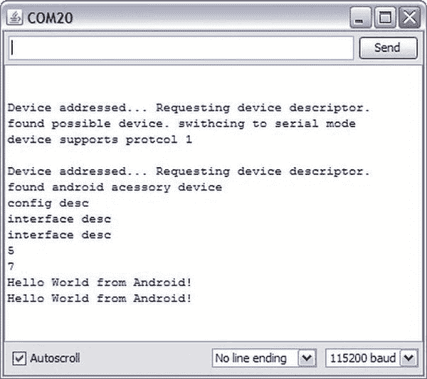

***图 2-19。**接收消息的 Arduino 应用程序的串行监视器输出*

### 总结

您已经了解了 Android 设备和 Arduino 配件在连接时如何相互识别。您了解了在 Arduino 端和通信的 Android 端实现开放附件协议的必要条件。Arduino 端的实现相当简单，因为大部分工作已经在 AndroidAccessory Arduino 库的帮助下完成了。你已经看到，软件的挑战在于 Android 设备的编码，因为有更多的工作要做。本章向您展示了如何使用自定义的数据结构跨两个平台传输文本消息。接下来的章节将基于你已经学到的知识，使你能够用 ADK 板读取传感器值或控制执行器。您在此完成的项目将是本书中后续示例的基础。