## C H A P T E R 3

## 输出

源自原始 Arduino 设计的 ADK 板有几个引脚和连接器。这些引脚大多数是数字引脚。这种 ADK 板上的数字引脚可以配置为输入或输出。本章描述了如何将数字引脚配置为输出引脚。

在这种特殊情况下，*输出*意味着什么？这意味着当设置为输出模式时，引脚将发射功率。源自 Arduino 的 ADK 板上的数字引脚可以发射高达 5V 的电压。它们可以用在数字环境中，可以有两种状态，`HIGH`和`LOW`。将输出引脚设置为`HIGH`意味着它将发出 5V。如果设置为`LOW`，则发出 0V，因此没有电压。一些输出引脚也可用于模拟环境。这意味着它们能够发出从 0V 到 5V 的输出值范围。

以下两个项目将在实际应用中解释这两种用例。

### 项目 1:切换 LED

这是您将使用附加硬件部件的许多项目中的第一个。您将利用 ADK 板的数字引脚作为输出端口来为发光二极管(LED)供电，并编写一个 Android 应用程序来打开和关闭 LED。

#### 零件

您将在本项目中使用以下硬件(如[图 3-1](#fig_3_1) 所示):

*   ADK 董事会
*   试验板
*   工作电压为 5V 的 LED
*   S7-1200 可编程控制器
*   一些电线

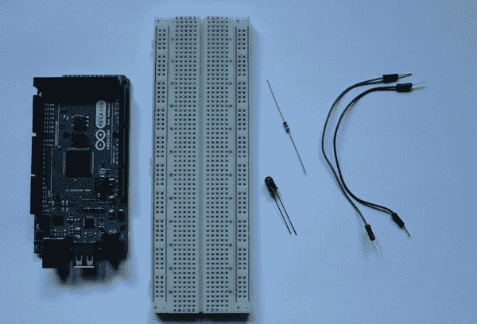

***图 3-1。**项目 1 零件(ADK 板、试验板、电阻器、LED、电线)*

##### LED

一个*发光二极管* (LED)是一个充当光源的小半导体(见[图 3-2](#fig_3_2) )。你家里几乎所有的电子设备上都可以找到 led。大多数情况下，它们被用作状态指示器。led 被设计成非常节能和可靠。这就是为什么他们也找到了进入艺术装置、汽车前灯和普通家庭照明解决方案的方法，这里仅举几个例子。

***图 3-2。**5 毫米红色 LED*

有许多类型的发光二极管。它们在尺寸、色谱和工作电压上有所不同。led 具有方向性，这意味着如何在电路中连接它们至关重要。普通 led 有一个阳极(正极连接器)和一个阴极(负极连接器)。你必须将能量源的正极连接到阳极，负极连接到阴极。如果你把它反过来连接，你会永久损坏它。在普通 LED 上，您可以通过几种方式区分连接器。您可能会注意到，LED 的引脚长度不同。长腿是阳极(正极连接器)，短腿是阴极(负极连接器)。如果您有一个透明的 LED 透镜，您可能会看到两个 LED 连接器在其嵌入端具有不同的形式。看起来像半个箭头的小一点的就是所谓的*帖*。接线柱是阳极连接器的嵌入端。阴极预埋件称为*砧*。一些发光二极管在其透镜的一侧也有一个扁平点。这一面标志着阴极。你可以看到，我们已经做了很多工作来区分两种连接器，这样你就不会因为连接错误而意外损坏 LED。

在这个项目中，您将使用 ADK 板的一个数字输出端口，当它被设置为`HIGH`时在 5V 下工作，当它被设置为`LOW`时在 0V 下工作。你应该使用同样在 5V 电压下工作的 LED，这样它的寿命会更长。您也可以使用 3.3V 的较低额定 LED，但较高的电压水平会更快地磨损 LED。LED 通常在 20mA 到 30mA 的电流下工作，您应该限制流动的电流，以便 LED 不会被更高的电流损坏。为了限制电流，你使用一个电阻。如果没有这样的限流电阻，就不应该使用 led。

##### 电阻器

电阻器是用来限制电路中电流的电子元件。电阻是施加在电阻上的电压与流过电阻的电流成正比的比值。这个比例是由欧姆定律定义的。*欧姆定律*是电气工程中最重要的公式之一。你经常需要它来决定在电路中使用哪个电阻来限制电流，这样你就不会烧坏你的元件。该公式的定义如下:

V = R × I

如你所见，电压是电阻和电流的乘积。电压用伏特测量，单位符号为 v。电流用安培测量，单位符号为 a。电阻用欧姆测量，单位符号为希腊字母ω。在一个简单的例子中，公式可以这样应用:

5V = 250Ω × 0.02A

标准的 3 毫米和 5 毫米 led 在 20mA 至 30mA 的电流限制下工作。当数字输出端口设置为`HIGH`时，您希望将电流限制在 30mA 左右，并提供 5V 电压。如果你应用欧姆定律并重新排列，你就可以计算出所需电阻的电阻值。

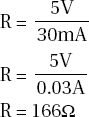

电阻有标准化的范围，你找不到像 166ω这样的特定值。您应该始终使用下一个可用的较高电阻值，而不要使用较低值，因为您不想因过载而永久损坏您的组件。下一个更高的电阻值是 220ω电阻。

你已经学会了如何确定在这个项目中你需要的电阻值。现在，我们来看看常见的电阻种类，以及如何通过观察来识别它们的值。

电阻有多种形式和尺寸，但除了小型表面贴装器件(SMD)，最常用的电阻是碳化合物电阻和薄膜电阻，如图[图 3-3](#fig_3_3) 所示。

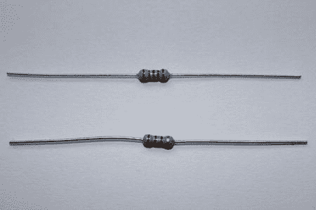

***图 3-3。**碳化合物电阻器(下)，薄膜电阻器(上)*

碳化合物电阻器由碳和其他化合物组成，因此得名。电阻值取决于混合物中的碳含量。碳化合物电阻器通常比其他电阻器更耐用，因为它们可以更好地处理高脉冲，而不会对其电阻值产生长期影响。缺点是它们不是最精确的电阻。

薄膜电阻器具有由金属薄膜覆盖的绝缘陶瓷棒或基底。金属涂层的厚度决定了电阻器的电阻特性。薄膜电阻器不如碳化合物电阻器坚固，因为它们容易受到高脉冲和过载的影响，这会损害它们的电阻能力。这些电阻的优点是比碳化合物电阻更精确。

上述标准应在生产电路设计中考虑，但不适用于我们的简单项目。

两种类型的电阻器表面都涂有彩色条纹。这些条带有助于识别电阻器的电阻值。碳化合物电阻器具有 4 段颜色编码，而薄膜电阻器具有 5 段颜色编码。

[表 3-1](#tab_3_1) 给你一个颜色编码的概述。

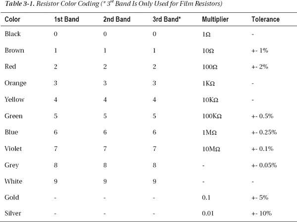

您可能想知道应该从电阻的哪一端读取色带。如果你仔细观察，你会发现一个波段与其他波段的距离稍大。这是公差带。[图 3-4](#fig_3_4) 显示了一个 4 频段碳化合物 220ω电阻，公差为+- 5%。第一个频段为红色(2)，第二个频段为红色(2)，乘法器频段为棕色(10)，即 22×10ω= 220ω。公差带为金色(+- 5%)。

***图 3-4。**220ω+-5%碳化合物电阻器*

##### 试验板

一个*试验板*，也称为原型板，是一种不需要焊接的原型板。它通常是一块有穿孔的塑料。这些孔的标准间距通常为 0.1 英寸(2.54 毫米)。

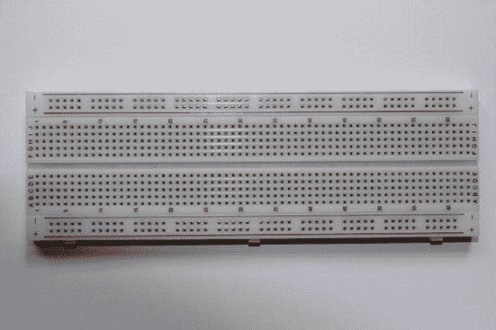

***图 3-5。**试验板/原型板*

嵌入电路板的是以特殊布局排列的导电触点。这些板允许即插即用机制，以便您可以专注于电路设置，而不是将所有东西焊接在一起。这样，如果你在设置中犯了错误，你可以快速调整电路。电路板有多种形式和尺寸，但基本布局基本相同。顶部和底部导轨上的触点主要用于连接电源的正极和负极端口。电路板中间的区域是实际的原型制作区域。嵌入试验板的连接布局如图[图 3-6](#fig_3_6) 所示。

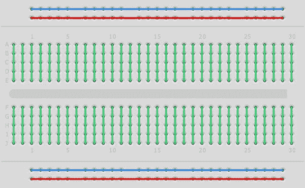

***图 3-6。**试验板触点布局*

##### ADK 董事会

在[第 1 章](01.html#ch1)中，您了解了 ADK 板的规格。Arduino 衍生的 ADK 板有几个数字输入和输出引脚。您将使用其中一个引脚作为输出端口来开关 LED。输出端口可以提供高达 5V 的电压。您将使用在[图 3-7](#fig_3_7) 中看到的数字输出引脚 2，并且您将在数字环境(`HIGH` / `LOW`)中设置输出值。

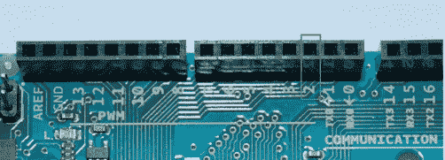

***图 3-7。**数字输出引脚 2*

##### 电线

你需要一些电线将试验板上的电阻和 LED 连接到 ADK 板上。对于原型制作和试验板工作，有特殊的试验板或跳线。使用这些电线的好处是你不必自己剥开它们，它们有不同的长度，并且有公母接头。

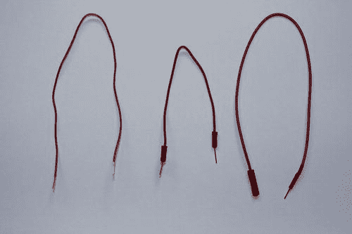

***图 3-8。**左起:电子线、跳线(公对公)、跳线(母对公)*

如果你不想买现成的电线，你也可以使用电子或贝尔线。您必须剥去这些电线上的电线末端，露出大约 3/16 英寸至 5/16 英寸(5 毫米至 8 毫米)的电线，以便与嵌入试验板的触点良好接触。你可以用小刀小心地切开电线绝缘体，然后把它剥掉，但我强烈推荐使用电缆剥线钳，这是一种更安全、更容易操作的工具。你只需抓住电线，施加一些软压力，将隔离器从电线上剥离。(参见[图 3-9](#fig_3_9) 。)

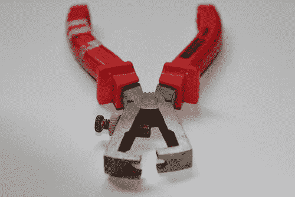

***图 3-9。**剥线器*

#### 设置

你需要把电阻串联到发光二极管上。ADK 板的数字输出引脚 2 将连接到您的电阻器，电阻器连接到 LED 的阳极，ADK 板的地(GND)将连接到 LED 的阴极(负极引线)。如[图 3-10](#fig_3_10) 所示连接所有部件。

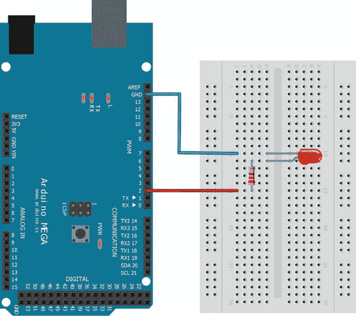

***图 3-10。**项目 1 设置*

#### 软件

硬件设置已经完成，是时候编写控制 LED 的代码了。您将编写一个 Arduino 草图，它接收切换命令，并根据 Android 应用程序发送的命令切换 LED。Android 应用程序将由一个控制开关状态的切换按钮组成。

##### Arduino 草图

以[第二章](02.html#ch2)中写的 Arduino 草图作为这个草图的基础。您已经在其中实现了特定于 ADK 的部分，您只需通过为 LED 切换场景定义另一个数据协议来更改通信部分。创建一个新的草图，并输入清单 3-1 中[所示的代码。之后，我会解释发生了什么变化。](#list_3_1)

***清单 3-1。**项目一:Arduino 草图*

`#include <Max3421e.h>
#include <Usb.h>
#include <AndroidAccessory.h>

**#define COMMAND_LED 0x2**
**#define TARGET_PIN_2 0x2**
**#define VALUE_ON 0x1**
**#define VALUE_OFF 0x0**

**#define PIN 2**

AndroidAccessory acc("Manufacturer",
"Model",
"Description",
"Version",
"URI",
"Serial");

**byte rcvmsg[3];**

void setup() {
Serial.begin(19200);
acc.powerOn();
**pinMode(PIN, OUTPUT);**
}

**void loop() {**
**if (acc.isConnected()) {**
**//read the received data into the byte array**
**int len = acc.read(rcvmsg, sizeof(rcvmsg), 1);**
**if (len > 0) {**
**if (rcvmsg[0] == COMMAND_LED) {**
**if (rcvmsg[1] == TARGET_PIN_2){**
**//get the switch state**
**byte value = rcvmsg[2];**
**//set output pin to according state**
**if(value == VALUE_ON) {**
**digitalWrite(PIN, HIGH);**` `**} else if(value == VALUE_OFF) {**
**digitalWrite(PIN, LOW);**
**}**
**}**
**}**
**}**
**}**
**}**`

你可能注意到的第一件事是来自[第二章](02.html#ch2)的短信专用代码被删除了。在这个项目中你不需要发送文本，所以代码已经被修改以支持 3 字节数据协议，这在第 2 章中也提到过。为了评估从 Android 设备接收的数据，您必须定义一个命令字节、一个目标字节和一个值字节常量。定义的数据协议字节常量`COMMAND_LED`、TARGET_PIN_2、`VALUE_ON,`和`VALUE_OFF`的含义应该是不言自明的。您还定义了一个`PIN`常量，它反映了应该被控制的管脚。

除了已知的必须在`setup`方法中进行的附件初始化之外，您还需要配置想要使用的数字引脚的模式。因为您希望引脚作为输出工作，所以需要用`pinMode(PIN, OUTPUT)`设置引脚模式。

在`loop`方法中，您检查已建立的连接并读取传入的数据。然后计算第三个字节的值。如果您接收到一个`0x1`字节，您将引脚设置为`HIGH`以输出 5V，如果您接收到一个`0x0`字节，您将引脚设置为`LOW`以使其输出为 0V。为此，您将使用`digitalWrite`方法。它的参数是要设置的引脚和它应该切换到的状态，`HIGH`或`LOW`。

Arduino 部分到此为止。让我们继续 Android 软件部分。

##### Android 应用程序

对于 Android 部分，你也将建立在你在第 2 章中从你的 Android 应用程序中学到的原则之上。您还必须调整数据协议并引入一个新的 UI 元素，一个 ToggleButton，它允许用户打开和关闭 LED。让我们看看清单 3-2 中的[类，以及您必须做出的更改。](#list_3_2)

***清单 3-2。项目一:ProjectOneActivity.java***

`**package project.one.adk;**

import java.io.FileDescriptor;
import java.io.FileInputStream;
import java.io.FileOutputStream;
import java.io.IOException;

import android.app.Activity;
import android.app.PendingIntent;
import android.content.BroadcastReceiver;
import android.content.Context;
import android.content.Intent;
import android.content.IntentFilter;
import android.os.AsyncTask;
import android.os.Bundle;
import android.os.ParcelFileDescriptor;` `import android.util.Log;
**import android.widget.CompoundButton;**
**import android.widget.CompoundButton.OnCheckedChangeListener;**
**import android.widget.ToggleButton;**

import com.android.future.usb.UsbAccessory;
import com.android.future.usb.UsbManager;

**public class ProjectOneActivity extends Activity {**

**private static final String TAG = ProjectOneActivity.class.getSimpleName();**

private PendingIntent mPermissionIntent;
private static final String ACTION_USB_PERMISSION = "com.android.example.USB_PERMISSION";
private boolean mPermissionRequestPending;

private UsbManager mUsbManager;
private UsbAccessory mAccessory;
private ParcelFileDescriptor mFileDescriptor;
private FileInputStream mInputStream;
private FileOutputStream mOutputStream;

**private static final byte COMMAND_LED = 0x2;**
**private static final byte TARGET_PIN_2 = 0x2;**
**private static final byte VALUE_ON = 0x1;**
**private static final byte VALUE_OFF = 0x0;**

**private ToggleButton ledToggleButton;**

/** Called when the activity is first created. */
@Override
public void onCreate(Bundle savedInstanceState) {
super.onCreate(savedInstanceState);

mUsbManager = UsbManager.getInstance(this);
mPermissionIntent = PendingIntent.getBroadcast(this, 0, new Intent(
ACTION_USB_PERMISSION), 0);
IntentFilter filter = new IntentFilter(ACTION_USB_PERMISSION);
filter.addAction(UsbManager.ACTION_USB_ACCESSORY_DETACHED);
registerReceiver(mUsbReceiver, filter);

**setContentView(R.layout.main);**
**ledToggleButton = (ToggleButton) findViewById(R.id.led_toggle_button);**
**ledToggleButton.setOnCheckedChangeListener(toggleButtonCheckedListener);**
}

/**
* Called when the activity is resumed from its paused state and immediately
* after onCreate().
*/
@Override` `public void onResume() {
super.onResume();

if (mInputStream != null && mOutputStream != null) {
return;
}

UsbAccessory[] accessories = mUsbManager.getAccessoryList();
UsbAccessory accessory = (accessories == null ? null : accessories[0]);
if (accessory != null) {
if (mUsbManager.hasPermission(accessory)) {
openAccessory(accessory);
} else {
synchronized (mUsbReceiver) {
if (!mPermissionRequestPending) {
mUsbManager.requestPermission(accessory, mPermissionIntent);
mPermissionRequestPending = true;
}
}
}
} else {
Log.d(TAG, "mAccessory is null");
}
}

/** Called when the activity is paused by the system. */
@Override
public void onPause() {
super.onPause();
closeAccessory();
}

/**
* Called when the activity is no longer needed prior to being removed from
* the activity stack.
*/
@Override
public void onDestroy() {
super.onDestroy();
unregisterReceiver(mUsbReceiver);
}

**OnCheckedChangeListener toggleButtonCheckedListener = new OnCheckedChangeListener() {**

**@Override**
**public void onCheckedChanged(CompoundButton buttonView, boolean isChecked) {**
**if (buttonView.getId() == R.id.led_toggle_button) {**

**new AsyncTask<Boolean, Void, Void>() {**

**@Override**
**protected Void doInBackground(Boolean... params) {**` `**sendLedSwitchCommand(TARGET_PIN_2, params[0]);**
**return null;**
**}**
**}.execute(isChecked);**
**}**
**}**
**};**

private final BroadcastReceiver mUsbReceiver = new BroadcastReceiver() {
@Override
public void onReceive(Context context, Intent intent) {
String action = intent.getAction();
if (ACTION_USB_PERMISSION.equals(action)) {
synchronized (this) {
UsbAccessory accessory = UsbManager.getAccessory(intent);
if (intent.getBooleanExtra(UsbManager.EXTRA_PERMISSION_GRANTED, false)) {
openAccessory(accessory);
} else {
Log.d(TAG, "permission denied for accessory " + accessory);
}
mPermissionRequestPending = false;
}
} else if (UsbManager.ACTION_USB_ACCESSORY_DETACHED.equals(action)) {
UsbAccessory accessory = UsbManager.getAccessory(intent);
if (accessory != null && accessory.equals(mAccessory)) {
closeAccessory();
}
}
}
};

private void openAccessory(UsbAccessory accessory) {
mFileDescriptor = mUsbManager.openAccessory(accessory);
if (mFileDescriptor != null) {
mAccessory = accessory;
FileDescriptor fd = mFileDescriptor.getFileDescriptor();
mInputStream = new FileInputStream(fd);
mOutputStream = new FileOutputStream(fd);
Log.d(TAG, "accessory opened");
} else {
Log.d(TAG, "accessory open fail");
}
}

private void closeAccessory() {
try {
if (mFileDescriptor != null) {
mFileDescriptor.close();
}
} catch (IOException e) {
} finally {
mFileDescriptor = null;` `mAccessory = null;
}
}

**public void sendLedSwitchCommand(byte target, boolean isSwitchedOn) {**
**byte[] buffer = new byte[3];**
**buffer[0] = COMMAND_LED;**
**buffer[1] = target;**
**if (isSwitchedOn) {**
**buffer[2] = VALUE_ON;**
**} else {**
**buffer[2] = VALUE_OFF;**
**}**
**if (mOutputStream != null) {**
**try {**
**mOutputStream.write(buffer);**
**} catch (IOException e) {**
**Log.e(TAG, "write failed", e);**
**}**
**}**
**}**
}`

如果您像这里一样更改了活动名和包名，请确保您也更改了 AndroidManifest.xml 条目以反映这种重命名。

***清单 3-3。**项目 1: AndroidManifest.xml*

`<manifest xmlns:android="http://schemas.android.com/apk/res/android"
**package="project.one.adk"** android:versionCode="1" android:versionName="1.0">
…
<activity **android:name=".ProjectOneActivity"** android:label="@string/app_name"
android:screenOrientation="portrait">
…
</manifest>`

数据协议常量已从 4 字节协议更改为 3 字节协议。正如您在 Arduino 草图中所做的那样，您还为 LED 切换数据消息定义了常数。

`private static final byte COMMAND_LED = 0x2;
private static final byte TARGET_PIN_2 = 0x2;
private static final byte VALUE_ON = 0x1;
private static final byte VALUE_OFF = 0x0;`

这个项目的范围是开关 LED，所以你不需要显示任何文本。因此，TextView UI 元素已被 ToggleButton 替换。

`private ToggleButton ledToggleButton;

@Override
public void onCreate(Bundle savedInstanceState) {
super.onCreate(savedInstanceState);
…
setContentView(R.layout.main);
ledToggleButton = (ToggleButton) findViewById(R.id.led_toggle_button);
ledToggleButton.setOnCheckedChangeListener(toggleButtonCheckedListener);
}`

您可以看到一个`OnCheckedChangeListener`被分配给了`ledToggleButton`，它实现了一个回调方法，每次按钮被按下时都会触发这个回调方法。`ToggleButton`是`Button`的一个特殊的有状态实现，这意味着它知道自己是否被选中。`OnCheckedChangeListener`的实现是在匿名内部类中完成的。唯一需要实现的方法是`onCheckedChange`方法，它有两个参数:触发事件的按钮和指示按钮新状态的布尔标志。

`OnCheckedChangeListener toggleButtonCheckedListener = new OnCheckedChangeListener() {

@Override
public void onCheckedChanged(CompoundButton buttonView, boolean isChecked) {
if (buttonView.getId() == R.id.led_toggle_button) {
new AsyncTask<Boolean, Void, Void>() {

@Override
protected Void doInBackground(Boolean... params) {
sendLedSwitchCommand(TARGET_PIN_2, params[0]);
return null;
}
}.execute(isChecked);
}
}
};`

如果您有多个按钮使用同一个监听器，您应该总是验证是否按下了正确的按钮。这里就是这么做的。在这个特定的项目中，您不需要检查这一点，因为您只使用了一个按钮，但是如果您计划将侦听器用于更多的组件，这是一个很好的实践。在确认正确的按钮触发了事件后，您可以开始向 ADK 板发送命令来切换 LED。`sendText`方法已经被移除，因为在这个项目中不需要它。实现了一种新方法，将 3 字节数据消息发送到名为`sendLedSwitchCommand`的板。它有两个参数，LED 连接的 ADK 板的目标引脚和它应该切换到的状态。

你可能想知道这个`AsyncTask`是怎么回事。事件回调方法在 UI 线程上执行。如果您只是将消息发送到那里，您也可以在 UI 线程中执行 outputstream 操作。这通常是可行的，但这是一种不好的做法。较长的操作可能会阻塞用户界面，这对用户来说是非常令人沮丧的。为了避免这些情况，你可以做几件事:打开另一个`Thread`，利用 Android 的`Handler`机制，或者像在这种情况下一样，使用一个`AsyncTask`来实现并发。解释每种方法的优缺点超出了本书的范围，但是你可以在`http://developer.android.com/guide/topics/fundamentals/processes-and-threads.html`的 Android 开发指南中读到很多。`AsyncTask`基本上做的是在后台打开另一个线程来处理你的操作，同时你的 UI 线程运行来服务用户。这里只实现了`doInBackground`方法，因为这是您所需要的。此外，`AsyncTask`具有运行在 UI 线程上的回调方法，以可视化后台操作的进度或在操作完成时更新 UI 元素。

`sendLedSwitchCommand`方法看起来类似于您已经知道的`sendText`方法，但是它实现了 3 字节数据协议。

`public void sendLedSwitchCommand(byte target, boolean isSwitchedOn) {
byte[] buffer = new byte[3];
buffer[0] = COMMAND_LED;
buffer[1] = target;
if (isSwitchedOn) {
buffer[2] = VALUE_ON;
} else {
buffer[2] = VALUE_OFF;
}
if (mOutputStream != null) {
try {
mOutputStream.write(buffer);
} catch (IOException e) {
Log.e(TAG, "write failed", e);
}
}
}`

代码改动到此为止。您记得应该向用户显示一个`ToggleButton`，所以您也需要在布局文件`main.xml`中做一些更改([清单 3-4](#list_3_4) )。

***清单 3-4。**项目一:main.xml*

`<?xml version="1.0" encoding="utf-8"?>
<LinearLayout xmlns:android="http://schemas.android.com/apk/res/android"
android:orientation="vertical"
android:layout_width="fill_parent"
android:layout_height="fill_parent"
android:gravity="center">
**<ToggleButton android:id="@+id/led_toggle_button"
android:layout_width="wrap_content"
android:layout_height="wrap_content"
android:textOn="@string/led_on"
android:textOff="@string/led_off" />**
</LinearLayout>`

如您所见，`TextView`元素被`ToggleButton`元素所取代。它被定义为只和它自己的内容一样宽一样高；勾选或取消勾选时显示的文本在`strings.xml`文件中被引用。如果你在 Eclipse 中切换到图形布局编辑器，你已经可以在你的布局中间看到这个按钮了([图 3-11](#fig_3_11) )。

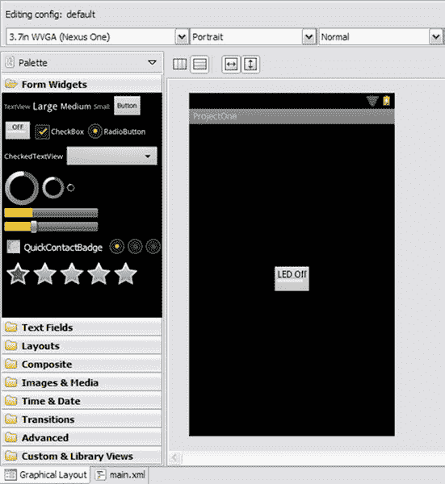

***图 3-11。**项目 1:main . XML 的 Eclipse 图形化布局*

这就是这个项目的 Android 部分要做的全部工作。项目 1 现在已经完成，可以测试了。上传两个设备的应用程序，将它们连接在一起，你应该会得到类似于你在图 3-12 中看到的东西。

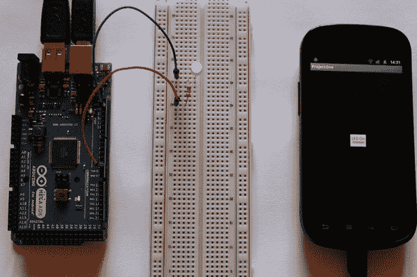

***图 3-12。**项目 1:最终结果*

### 项目 2:调暗 LED 灯

在本项目中，您将了解 ADK 板上数字 IO 引脚的另一个特性，即脉宽调制。你将学习什么是脉宽调制，以及如何用它来调暗 LED。您将编写一个 Android 应用程序，在滑块的帮助下控制调光过程。

#### 零件

这个项目的部件与项目 1 中的完全相同。你不需要任何新的硬件部件。

*   ADK 董事会
*   面包板
*   工作电压为 5V 的 LED
*   S7-1200 可编程控制器
*   一些电线

这些部件已经在项目 1 中解释过了，但你将使用 ADK 板的一个新功能，我将在下面解释。

##### ADK 董事会

ADK 板的一些数字 IO 引脚有一个称为 PWM 的附加功能。PWM 代表脉宽调制。具有该特性的管脚在 Arduino 衍生的 ADK 板上有标记，如图[图 3-13](#fig_3_13) 所示。

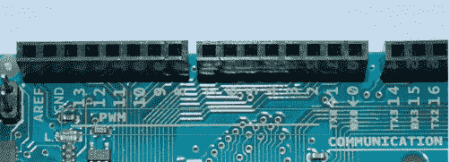

***图 3-13。**Arduino 板上的 PWM 标记*

PWM 可以被描述为数字输出的快速高-低来回切换。切换时，数字引脚产生方波信号(参见[图 3-14](#fig_3_14) )。

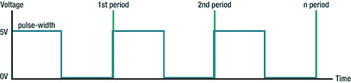

***图 3-14。**占空比为 50%的脉宽调制示例*

信号处于开启状态的时间与其处于关闭状态的时间相比称为占空比。信号处于 on 状态的时间称为脉冲宽度。因此，在图 3-14 中，占空比为 50%。

引脚的快速状态变化直接影响模拟特性，即引脚提供的电压。占空比为 100%时，该引脚产生约 5V 的模拟值。Arduino 衍生板将 256 个值映射到 0V 和 5V 之间的范围。因此，值 127 将导致引脚产生占空比为 50%的方波，产生约 2.5V 的电压。

为了控制 Arduino 草图中管脚的脉冲宽度，使用了`analogWrite`方法，其参数是要使用的数字管脚，值在 0 到 256 之间。

#### 设置

电路设置与项目 1 完全相同，参见[图 3-10](#fig_3_10) 以供参考。

#### 软件

两个平台的大部分代码都可以保持原样。您将只更改较小的细节来传输更宽的脉冲宽度值范围，并且您将在 Android 代码中引入一个新的 UI 元素`SeekBar`，用于选择 PWM 值。

##### Arduino 草图

支持 PWM 输出的更改后的 Arduino 代码可以在[清单 3-5](#list_3_5) 中看到。

***清单 3-5。**项目二:Arduino 草图*

`#include <Max3421e.h>
#include <Usb.h>
#include <AndroidAccessory.h>

**#define COMMAND_LED 0x2
#define TARGET_PIN_2 0x2

#define PIN 2**

AndroidAccessory acc("Manufacturer",
"Model",
"Description",
"Version",
"URI",
"Serial");

byte rcvmsg[3];

void setup() {
Serial.begin(19200);
acc.powerOn();
pinMode(PIN, OUTPUT);
}

void loop() {
if (acc.isConnected()) {
//read the received data into the byte array
int len = acc.read(rcvmsg, sizeof(rcvmsg), 1);
if (len > 0) {
if (rcvmsg[0] == COMMAND_LED) {
if (rcvmsg[1] == TARGET_PIN_2){
//get the analog value
byte value = rcvmsg[2];
**//set output pin to according analog value
analogWrite(PIN, value);**
}
}
}
}
}`

您可以看到，LED 状态的常量(`VALUE_ON` / `VALUE_OFF`)已被删除，因为您现在使用的是模拟值，而不是数字状态。Android 应用程序传输的字节值被读取并直接输入到`analogWrite`方法中。如果数字引脚支持 PWM，这种方法会触发数字引脚产生具有特定占空比的方波。作为参数，它采用要使用的引脚和一个 0 到 255 的字节值，该值映射到 0V 到 5V 范围内的模拟值。

##### Android 应用程序

来自项目 1 的 Android 应用程序也可以用作这个项目的基础。在这个项目中，你不需要改变很多东西。您将为您的应用程序引入一个新的 UI 元素:`SeekBar`。在查看了`ProjectTwoActivity`的完整代码清单后，我将解释已更改的部分，这些部分使您能够传输 ADK 板稍后用于 PWM 的值范围。因为代码的大部分没有改变，并且在前面的清单中有描述，所以我将用三个点(`…`)隐藏它们的实现部分，以便只关注重要的部分(参见[清单 3-6](#list_3_6) )。然而，和往常一样，完整的代码参考可以在`www.apress.com`找到。

***清单 3-6。项目二:ProjectTwoActivity.java***

`**package project.two.adk;**

import java.io.FileDescriptor;
import java.io.FileInputStream;
import java.io.FileOutputStream;
import java.io.IOException;

import android.app.Activity;
import android.app.PendingIntent;
import android.content.BroadcastReceiver;
import android.content.Context;
import android.content.Intent;
import android.content.IntentFilter;
import android.os.AsyncTask;
import android.os.Bundle;
import android.os.ParcelFileDescriptor;
import android.util.Log;
**import android.widget.SeekBar;
import android.widget.SeekBar.OnSeekBarChangeListener;
import android.widget.TextView;**
import com.android.future.usb.UsbAccessory;
import com.android.future.usb.UsbManager;

**public class ProjectTwoActivity extends Activity {

private static final String TAG = ProjectTwoActivity.class.getSimpleName();**

private PendingIntent mPermissionIntent;
private static final String ACTION_USB_PERMISSION = "com.android.example.USB_PERMISSION";
private boolean mPermissionRequestPending;

private UsbManager mUsbManager;
private UsbAccessory mAccessory;
private ParcelFileDescriptor mFileDescriptor;
private FileInputStream mInputStream;
private FileOutputStream mOutputStream;

private static final byte COMMAND_LED = 0x2;
private static final byte TARGET_PIN_2 = 0x2;

**private TextView ledIntensityTextView;
private SeekBar ledIntensitySeekBar;

@Override
public void onCreate(Bundle savedInstanceState) {
super.onCreate(savedInstanceState);
…
setContentView(R.layout.main);
ledIntensityTextView = (TextView) findViewById(R.id.led_intensity_text_view);
ledIntensitySeekBar = (SeekBar) findViewById(R.id.led_intensity_seek_bar);
ledIntensitySeekBar.setOnSeekBarChangeListener(ledIntensityChangeListener);
ledIntensityTextView.setText("LED intensity: " + ledIntensitySeekBar.getProgress());
}**

@Override
public void onResume() {
super.onResume();
…
}

@Override
public void onPause() {
super.onPause();
…
}

@Override
public void onDestroy() {
super.onDestroy();
…
}

**OnSeekBarChangeListener ledIntensityChangeListener = new OnSeekBarChangeListener() {
@Override
public void onProgressChanged(SeekBar seekBar, int progress, boolean fromUser) {
ledIntensityTextView.setText("LED intensity: " + ledIntensitySeekBar.getProgress());
new AsyncTask<Byte, Void, Void>() {

@Override
protected Void doInBackground(Byte... params) {
sendLedIntensityCommand(TARGET_PIN_2, params[0]);
return null;
}
}.execute((byte) progress);
}

@Override
public void onStartTrackingTouch(SeekBar seekBar) {
// not implemented
}

@Override
public void onStopTrackingTouch(SeekBar seekBar) {
// not implemented
}
};**

private final BroadcastReceiver mUsbReceiver = new BroadcastReceiver() {
…
};

private void openAccessory(UsbAccessory accessory) {
…
}

private void closeAccessory() {
…
}

**public void sendLedIntensityCommand(byte target, byte value) {
byte[] buffer = new byte[3];
buffer[0] = COMMAND_LED;
buffer[1] = target;
buffer[2] = value;
if (mOutputStream != null) {
try {
mOutputStream.write(buffer);
} catch (IOException e) {
Log.e(TAG, "write failed", e);
}
}
}**
}`

你可以看到，这里也删除了 LED 开关状态的字节常量。在这个项目中，向用户显示了两个 UI 元素。第一个是一个`TextView`，它应该显示当前传输到 ADK 板的选定值。第二个元素是一个`SeekBar`,它是一个滑块控件，让用户可以轻松地在预定义的范围内选择一个值。

`private TextView ledIntensityTextView;
private SeekBar ledIntensitySeekBar;

@Override
public void onCreate(Bundle savedInstanceState) {
super.onCreate(savedInstanceState);
…
setContentView(R.layout.main);
ledIntensityTextView = (TextView) findViewById(R.id.led_intensity_text_view);
ledIntensitySeekBar = (SeekBar) findViewById(R.id.led_intensity_seek_bar);
ledIntensitySeekBar.setOnSeekBarChangeListener(ledIntensityChangeListener);
ledIntensityTextView.setText("LED intensity: " + ledIntensitySeekBar.getProgress());
}`

像所有其他的`View`元素一样，`SeekBar`可以注册一组广泛的监听器，当某些事件发生时，这些监听器会得到通知。一个专用于`SeekBar`的监听器是在`onCreate`方法中注册的`OnSeekBarChangeListener`。如果滑块收到第一个触摸手势，如果滑块改变其值，如果触摸被释放，它会得到通知。您只关心`SeekBar`的变化状态，因此实现如下:

`OnSeekBarChangeListener ledIntensityChangeListener = new OnSeekBarChangeListener() {

@Override
public void onProgressChanged(SeekBar seekBar, int progress, boolean fromUser) {
ledIntensityTextView.setText("LED intensity: " + ledIntensitySeekBar.getProgress());
new AsyncTask<Byte, Void, Void>() {

@Override
protected Void doInBackground(Byte... params) {
sendLedIntensityCommand(TARGET_PIN_2, params[0]);
return null;
}
}.execute((byte) progress);
}

@Override
public void onStartTrackingTouch(SeekBar seekBar) {
// not implemented
}

@Override
public void onStopTrackingTouch(SeekBar seekBar) {
// not implemented
}
};`

当调用`onProgressChanged`方法时，它从系统接收三个参数。第一个是触发事件的实际的`SeekBar`元素，第二个是`SeekBar`的当前进度，第三个是一个布尔标志，指示进度的改变是由用户滑过`SeekBar`造成的，还是进度是通过编程设置的。实现非常简单。在`TextView`的帮助下，你向用户显示数值的变化，然后你将数值传送到 ADK 板。注意`progress`的数据类型是 byte。稍后你会看到`SeekBar`的范围被配置为从 0 到 255。然而，数据类型字节的范围是从-128 到 127。实际情况是，进度值被转换成一个字节，如果该值大于 127，它就变成负数。这与位算术和所谓的符号位有关。这不应该是你现在关心的问题，因为在 Arduino 端，当一个可能的负字节值被提供给`analogWrite`方法时，它将被转换回原来的表示。请注意，一般来说，这种强制转换是不安全的，尽管在这个例子中它是有效的。

您已经了解到 IO 操作应该在 UI 独立的线程中进行，因此您将再次使用`AsyncTask`来实现这一目的。实际的通信逻辑封装在`sendLedIntensityCommand`方法中。

`public void sendLedIntensityCommand(byte target, byte value) {
byte[] buffer = new byte[3];
buffer[0] = COMMAND_LED;
buffer[1] = target;
buffer[2] = value;
if (mOutputStream != null) {
try {
mOutputStream.write(buffer);
} catch (IOException e) {
Log.e(TAG, "write failed", e);
}
}
}`

实现几乎等于来自项目 1 的`sendLedSwitchCommand`。您将传输`SeekBar`的当前值，其范围从 0 到 255，而不是只传输两种可能的状态。

这就是项目 2 的所有代码实现。您仍然需要更改 main.xml 文件，以便向用户实际显示`TextView`和`SeekBar`。新的 main.xml 文件看起来像[清单 3-7](#list_3_7) 。

***清单 3-7。**项目 2–main . XML*

`<?xml version="1.0" encoding="utf-8"?>
<LinearLayout xmlns:android="http://schemas.android.com/apk/res/android"
android:orientation="vertical"
android:layout_width="fill_parent"
android:layout_height="fill_parent"
android:gravity="center">
<TextView android:id="@+id/led_intensity_text_view"
android:layout_width="wrap_content"
android:layout_height="wrap_content"
android:text="LED intensity: 0"/>
**<SeekBar android:id="@+id/led_intensity_seek_bar"
android:layout_width="fill_parent"
android:layout_height="wrap_content"
android:max="255" />**
</LinearLayout>`

您已经了解了`TextView`元素的属性，所以让我们看看`SeekBar`有什么特别之处。除了已经知道的`id`、`layout_width`、`layout_height`等属性之外，你看到一个叫做`max`的属性。该属性定义了`SeekBar`可以达到的最大值。初始值 0 是默认值，您不必自己定义。所以在布局中，您已经定义了从 0 到 255 的范围。如果您切换到图形布局编辑器，您已经可以看到该用户界面的预览([图 3-15](#fig_3_15) )。

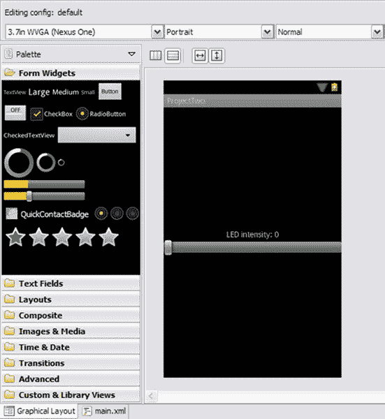

***图 3-15。**项目 2:main . XML 的 Eclipse 图形化布局*

项目 2 现已完成，准备测试。将应用程序上传到您的设备并启动它们。你完成的项目应该看起来像图 3-16 。

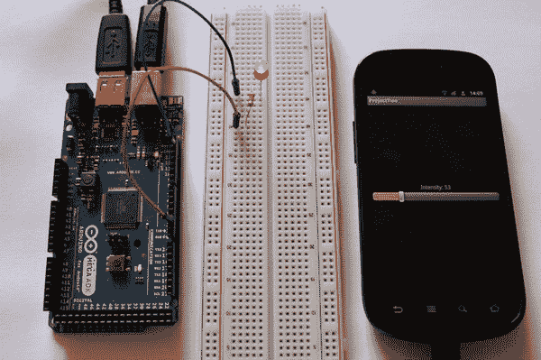

***图 3-16。**项目二:最终结果*

### 总结

在这一章中，你学习了什么是 ADK 板上的输出引脚以及它的功能。在本章的第一个项目中，您看到了如何在数字环境中使用输出引脚，当输出切换到`HIGH`或`LOW`时，通过提供 5V 或 0V 来开关简单的 LED。第二个项目引入了数字输出的 PWM 或脉宽调制模式，其中一个输出引脚可以发出 0V 至 5V 范围内的输出电压。为了让用户控制传输到 ADK 板的值，您使用了两个不同的 Android UI 元素:`ToggleButton`在数字环境中打开和关闭 LED，而`SeekBar`在模拟环境中从一系列值中选择来调暗 LED。