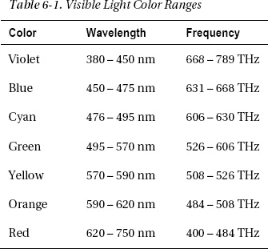
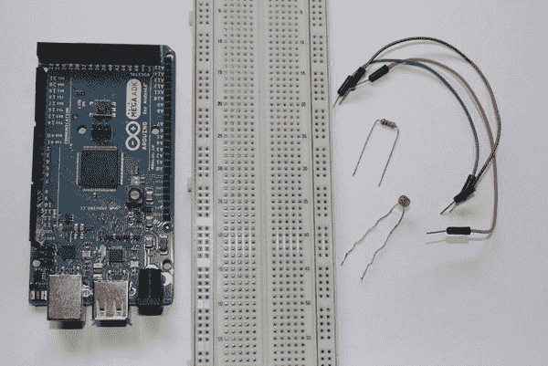
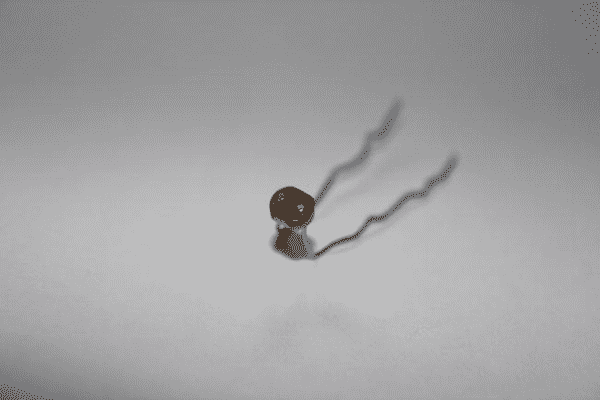
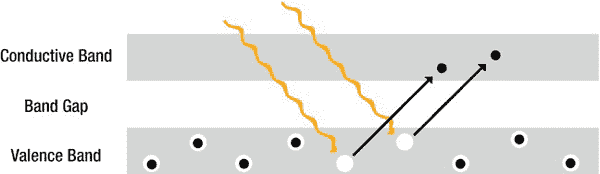
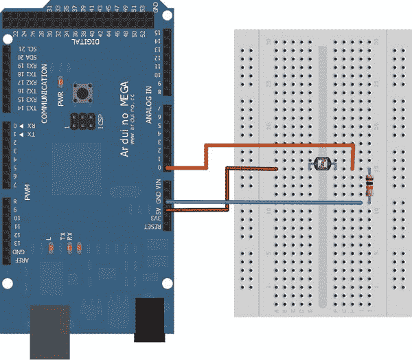
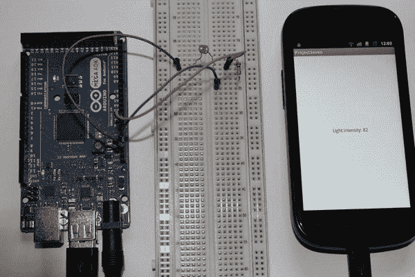

# 六、光强感知

在这一章中，你将学会如何感知你周围环境中的光线强度。为了做到这一点，你将需要另一个新的组件，称为光敏电阻或光敏电阻(LDR)。我将在“部件”一节中解释这个组件的工作原理但是首先你需要理解光本身的描述。

那么光到底是什么？在我们的日常生活中，它无处不在。我们星球的完整生态系统依赖于光。它是所有生命的源泉，然而我们大多数人从未真正费心去理解光到底是什么。我不是一个物理学家，也不声称对它的物理原理提供了最好的解释，但我想至少提供一个关于光是什么的简要描述，让你对本章项目的目标有所了解。

*光*物理上描述为电磁辐射。*辐射*是高能波或粒子穿过介质的术语。在这种情况下，光是能量波的任何波长。人眼只能看到一定范围的波长。它可以对波长为 390 纳米到 750 纳米的光做出响应。当检测到特定波长和频率的光时，会感觉到不同的光色。[表 6-1](#tab_6_1) 给出了人眼能看到的光的色谱的概述。

人眼看不到的光的一个很好的例子是电视遥控器上的小红外 LED。红外光谱在 700 纳米到 1000 纳米的范围内。LED 的光波长通常在 980 纳米左右，因此超过了人眼可见的光谱。LED 以取决于制造商的模式与电视的接收器单元进行通信。由于太阳光覆盖的波长范围很广，红外光也是其中一部分，因此通常会干扰通信。为了避免这个问题，电视制造商使用了在阳光中找不到的特定频率的红外光。

红外光的波长高于可见光，但也有一种光的波长低于可见光，称为紫外光。*紫外光*，简称紫外光，范围在 10 纳米到 400 纳米之间。紫外线本质上是电磁辐射，它可以引起化学反应，甚至可以破坏生物系统。这种效应的一个很好的例子是，当你长时间暴露在大量的紫外线下而没有任何保护性乳液时，你通常会晒伤。这个危险的波长低于 300 纳米。随着波长的减小，每个光子的能量增加。该波长光子的高能量在分子水平上对物质和有机体产生影响。由于能够引起化学反应，紫外光经常用于检测某些物质。一些物质通过发光起反应。这种效应通常用于犯罪调查，以检测假币、伪造护照，甚至体液。

### 项目 7:用光敏电阻感应光强度

这一章的项目应该为你提供一种方法来轻松地感知你周围的光线变化。您将在 ADK 板的模拟输入引脚上测量光敏电阻的光照强度引起的电压变化。由此产生的转换后的数字值将被发送到 Android 设备，以根据周围的光线条件调整 Android 设备的屏幕亮度。大多数 Android 设备已经内置了这样的传感器来实现这一点，但这个项目应该可以帮助你了解你的设备是如何操作的，以及你如何自己影响它的光线设置。

#### 零件

这个项目的新部件是光敏电阻。其余部分对您来说并不陌生(参见[图 6-1](#fig_6_1) ):

*   ADK 董事会
*   面包板
*   光敏电阻
*   10kω电阻
*   一些电线

***图 6-1。**项目 7 部分(ADK 板、试验板、电线、光敏电阻、10k 电阻)*

##### ADK 董事会

又到了使用 ADK 板的模拟输入引脚来测量电压变化的时候了。这个项目的电路设置将最终建立一个与光敏电阻连接的分压器。在模拟输入引脚上测量电压变化时，会用数字 ADC 值表示。稍后，您将使用数字值对相对环境照明进行假设。

##### 光敏电阻

一个*光敏电阻*是一个电阻，当它暴露在光线下时，电阻会减小(见[图 6-2](#fig_6_2) )。这种行为是由所谓的*光电效应*造成的。

***图 6-2。**光敏电阻*

诸如光敏电阻的半导体的电子可以具有不同的状态。这些状态由*能带*描述。能带由*价带、*电子束缚在单个原子上、*带隙*，没有电子态存在，以及*导带*，电子可以自由移动。如果电子从吸收的光的光子中获得足够的能量，它们就会被从它们的原子上撞下来，从价带移动到导带，在那里它们可以自由移动。这个过程对光敏电阻的电阻值有直接影响。这就是光电效应的原理，如图[图 6-3](#fig_6_3) 所示。

***图 6-3。**光电效应*

光敏电阻通常用于需要感应照明变化的项目。例如，夜灯是光敏电阻的完美用例。当环境光线非常暗时，你需要打开夜灯，这样人们在晚上就能更好地辨别方向，而不必打开主灯。白天，当照明条件好得多的时候，你会想关掉夜灯以节约能源。这里可以使用光敏电阻将照明变化传播到微控制器，微控制器可以依次打开或关闭小夜灯。

另一种情况是使用光敏电阻和其他环境传感器来建立一个气象站，以监测全天的天气变化。例如，你可以判断天气是多云还是晴朗。如果你将这种气象站与 Android 设备结合使用，你可以保存你的数据，甚至将它发送到远程位置。如你所见，可能性是无限的。

##### 电阻器

需要额外的电阻器来创建分压器电路。你在第 4 章中学习了分压电路的原理。当光敏电阻暴露于光下时，需要分压器来测量电压变化。如果光敏电阻的阻值变化，电路的输出电压也会变化。如果您只是将光敏电阻单独连接到模拟输入引脚，您将不会测量到引脚上的电压变化，因为暴露在光线下只会改变光敏电阻的电阻特性，因此只会影响通过的电流。如果太多的电流通过，你也可能最终损坏你的 ADK 板，因为未使用的能量将在大量热量积累中表现出来。

#### 设置

如上所述，您需要为这个项目构建一个分压器电路。为此，您需要将光敏电阻的一根引线连接到+5V，另一根引线连接到附加电阻和模拟输入引脚 A0。电阻器的一条引线连接到光敏电阻和模拟输入引脚 A0，另一条引线连接到 GND。项目设置见[图 6-4](#fig_6_4) 。

***图 6-4。**项目 7 设置*

#### 软件

您将编写一个 Arduino 草图，在模拟输入引脚 A0 获取模拟读数，并将其转换为 10 位数字值。该值被映射到 0 到 100 之间的较低值，并发送到 Android 设备。Android 应用程序将根据接收到的值计算新的屏幕亮度。

##### Arduino 草图

同样，您将读取一个模拟引脚，只是这次您不会利用位移位技术来传输 ADC 值。您将首先使用 utility `map`方法来转换您的测量值，稍后会详细介绍。首先看看完整的[清单 6-1](#list_6_1) 。

***清单 6-1。**项目 7: Arduino 草图*

`#include <Max3421e.h>
#include <Usb.h>
#include <AndroidAccessory.h>

**#define COMMAND_LIGHT_INTENSITY 0x5**
**#define INPUT_PIN_0 0x0**

AndroidAccessory acc("Manufacturer",
"Model",
"Description",
"Version",
"URI",
"Serial");

**byte sntmsg[3];**

void setup() {
Serial.begin(19200);
acc.powerOn();
**sntmsg[0] = COMMAND_LIGHT_INTENSITY;**
**sntmsg[1] = INPUT_PIN_0;**
}

**void loop() {**
**if (acc.isConnected()) {**
**int currentValue = analogRead(INPUT_PIN_0);**
**sntmsg[2] = map(currentValue, 0, 1023, 0, 100);**
**acc.write(sntmsg, 3);**
**delay(100);**
**}**
**}**`

如您所见，新的命令字节和所用的模拟输入引脚是在开始时定义的。

`#define COMMAND_LIGHT_INTENSITY 0x5
#define INPUT_PIN_0 0x0`

在这个项目中，您只需要一个三字节的消息，因为您不需要对测得的 ADC 值进行位移。您不需要对该值进行比特移位，因为您将在传输消息之前使用`map`方法。`map`方法的作用是将一个范围的值转换成另一个范围的值。您将把 ADC 值(范围为 0 到 1023)映射到 0 到 100 的范围。例如，ADC 值 511 将被转换为值 50。转换时，测量值不会大于 100，100 小到可以放入一个字节。构建完整的三字节消息后，您可以简单地将其传输到 Android 设备。

`int currentValue = analogRead(INPUT_PIN_0);
sntmsg[2] = map(currentValue, 0, 1023, 0, 100);
acc.write(sntmsg, 3);
delay(100);`

Arduino 部分到此为止。让我们看看在 Android 端有什么要做的。

##### Android 应用程序

同样，Android 应用程序负责接收来自 ADK 板的消息。当 Android 应用程序收到该值时，它会计算屏幕亮度的新强度。之后，设置新的屏幕亮度。[清单 6-2](#list_6_2) 只强调了重要的部分；代码很短，你现在应该知道了。

***清单 6-2。项目 7:ProjectSevenActivity.java***

`**package project.seven.adk;**

import …;

**public class ProjectSevenActivity extends Activity {**

…

**private static final byte COMMAND_LIGHT_INTENSITY = 0x5;**
**private static final byte TARGET_PIN = 0x0;**

**private TextView lightIntensityTextView;**
**private LayoutParams windowLayoutParams;**

/** Called when the activity is first created. */
@Override
public void onCreate(Bundle savedInstanceState) {
super.onCreate(savedInstanceState);

…

setContentView(R.layout.main);
**lightIntensityTextView = (TextView) findViewById(R.id.light_intensity_text_view);**
}

/**
* Called when the activity is resumed from its paused state and immediately
* after onCreate().
*/
@Override
public void onResume() {
super.onResume();
…
}` 
`/** Called when the activity is paused by the system. */
@Override
public void onPause() {
super.onPause();
closeAccessory();
}

/**
* Called when the activity is no longer needed prior to being removed from
* the activity stack.
*/
@Override
public void onDestroy() {
super.onDestroy();
unregisterReceiver(mUsbReceiver);
}

private final BroadcastReceiver mUsbReceiver = new BroadcastReceiver() {
@Override
public void onReceive(Context context, Intent intent) {
…
}
};

private void openAccessory(UsbAccessory accessory) {
mFileDescriptor = mUsbManager.openAccessory(accessory);
if (mFileDescriptor != null) {
mAccessory = accessory;
FileDescriptor fd = mFileDescriptor.getFileDescriptor();
mInputStream = new FileInputStream(fd);
mOutputStream = new FileOutputStream(fd);
Thread thread = new Thread(null, commRunnable, TAG);
thread.start();
Log.d(TAG, "accessory opened");
} else {
Log.d(TAG, "accessory open fail");
}
}

private void closeAccessory() {
try {
if (mFileDescriptor != null) {
mFileDescriptor.close();
}
} catch (IOException e) {
} finally {
mFileDescriptor = null;
mAccessory = null;
}
}

**Runnable commRunnable = new Runnable() {**`

`**@Override
**public void run() {**
**int ret = 0;**
**byte[] buffer = new byte[3];**** 
**while (ret >= 0) {**
**try {**
**ret = mInputStream.read(buffer);**
**} catch (IOException e) {**
**Log.e(TAG, "IOException", e);**
**break;**
**}**

**switch (buffer[0]) {**
**case COMMAND_LIGHT_INTENSITY:**
**if (buffer[1] == TARGET_PIN) {**
**final byte lightIntensityValue = buffer[2];**
**runOnUiThread(new Runnable() {**

**@Override**
**public void run() {**
**lightIntensityTextView.setText(**
**getString(R.string.light_intensity_value,**
**lightIntensityValue));**
**windowLayoutParams = getWindow().getAttributes();**
**windowLayoutParams.screenBrightness =**
**lightIntensityValue / 100.0f;**
**getWindow().setAttributes(windowLayoutParams);**
**}**
**});**
**}**
**break;**

**default:**
**Log.d(TAG, "unknown msg: " + buffer[0]);**
**break;**
**}**
**}**
**}**
**};**
}`

首先，您必须定义相同的命令字节和 pin 字节，以便稍后匹配接收到的消息。

`private static final byte COMMAND_LIGHT_INTENSITY = 0x5;
private static final byte TARGET_PIN = 0x0;

private TextView lightIntensityTextView;
private LayoutParams windowLayoutParams;`

您在这里声明了唯一的 UI 元素，一个以任意单位向用户显示当前照明水平的`TextView`。您还可以看到一个`LayoutParams`对象的声明。`LayoutParams`定义父视图应该如何布局视图。`WindowManager.LayoutParams`类还定义了一个名为`screenBrightness`的字段，该字段指示电流`Window`在设置时覆盖用户的首选照明设置。

类型`Runnable`的内部类实现了上面描述的屏幕亮度调整逻辑。从 ADK 板收到值后，更新`TextView` UI 元素，向用户提供文本反馈。

`lightIntensityTextView.setText(getString(R.string.light_intensity_value,
lightIntensityValue));`

为了调整屏幕的亮度，你首先要获得一个对当前`Window`的`LayoutParams`对象的引用。

`windowLayoutParams = getWindow().getAttributes();`

顾名思义，`LayoutParams`类的`screenBrightness`属性定义了屏幕的亮度。它的值是数字数据类型`Float`。该值的范围是从 0.0 到 1.0。因为您接收到一个介于 0 和 100 之间的值，所以您必须将该值除以 100.0f 才能达到要求的范围。

`windowLayoutParams.screenBrightness = lightIntensityValue / 100.0f;`

当你设置完亮度值后，你就可以更新当前`Window`对象的`LayoutParams`。

`getWindow().setAttributes(windowLayoutParams);`

现在是时候看看 Android 设备如何响应您构建的光传感器了。在相应的设备上部署这两个应用程序并找出答案。如果一切顺利，你的最终结果应该看起来像[图 6-5](#fig_6_5) 。

***图 6-5。**项目 7:最终结果*

### 奖励:用 Android 测量照度(勒克斯)

有时，像这个项目中所做的那样，仅仅使用相对值是不够的。测量光强度的更科学的方法是测量给定区域的照度。照度的单位是*勒克斯*；它的符号是 lx。

许多 Android 设备都内置了光线传感器，可以根据周围的环境照明来调整屏幕亮度。这些传感器返回以勒克斯(lx)为单位的测量值。要请求这些值，首先必须获得对`SensorManager`类的引用，该类充当设备传感器的一种注册表。之后，您可以通过使用光传感器`Sensor.TYPE_LIGHT`的传感器类型常量调用`SensorManager`上的`getDefaultSensor`方法来获得对光传感器本身的引用。

`SensorManager sensorManager = (SensorManager) getSystemService(Context.SENSOR_SERVICE);
Sensor lightSensor = sensorManager.getDefaultSensor(Sensor.TYPE_LIGHT);`

你现在想要的是当当前照度值改变时得到通知。为了实现这一点，您在`sensorManager`处注册了一个`SensorEventListener`，并将相应的传感器与这个监听器相关联。

`sensorManager.registerListener(lightSensorEventListener, lightSensor,
SensorManager.SENSOR_DELAY_NORMAL);`

`lightSensorEventListener`的实现如下:

`SensorEventListener lightSensorEventListener = new SensorEventListener(){

@Override
public void onAccuracyChanged(Sensor sensor, int accuracy) {
// nothing to implement here
}

@Override
public void onSensorChanged(SensorEvent sensorEvent) {
if(sensorEvent.sensor.getType() == Sensor.TYPE_LIGHT){
Log.i("Light in lx", sensorEvent.values[0]);
}
}};`

您只需要实现`onSensorChanged`方法，因为这是您感兴趣的事件。系统传递给该方法的`SensorEvent`对象包含一个值数组。根据您正在读取的传感器类型，您会在该数组中获得不同的值。传感器类型光的值位于该阵列的索引 0 处，它以勒克斯为单位反映当前的环境光。

你也可以把光敏电阻的测量值转换成勒克斯。然而，如果光敏电阻是非线性的(大多数光敏电阻都是非线性的),这需要更深入地理解数据手册和对数函数的使用。由于这涉及太多的细节，我不会在这里覆盖它。然而，如果你用你选择的搜索引擎搜索“计算勒克斯光敏电阻”，你可以在网上找到详细的信息和教程。

如果你不是数学的狂热爱好者，你也可以使用简单实用的方法。您可以尝试照明条件，并将从您的 Android 设备的光传感器接收到的结果与项目 7 中使用光敏电阻进行测量的结果进行比较。然后，您可以将 lux 值映射到相对值，并定义自己的查找表以供将来参考。请注意，这更多的是一个近似值，而不是精确的计算。

### 总结

本章向你展示了光电效应的原理，以及如何在光敏电阻的帮助下，利用它来测量光强的变化。为此，您应用了分压器电路布局。您还学习了如何在 Arduino 平台上将一个范围的值映射到另一个范围的值，并根据周围的光线强度更改了 Android 设备屏幕的亮度。作为一个小奖励，您看到了如何在 Android 设备的内置光传感器上请求当前的环境照度(以勒克斯为单位)。