## T1】C H A P T E R 8

## 触觉

触摸用户界面已经越来越成为我们日常生活的一部分。我们在自动售货机、家用电器、手机和电脑上看到它们。触摸界面让日常活动看起来更有未来感和时尚感。当你在看老科幻电影时，你会注意到，即使在那时，触摸也是想象未来用户输入的首选方式。如今，孩子们是在这种技术的陪伴下成长的。

有许多不同类型的触摸界面技术，每种技术都有其优点和缺点。三种最普遍的技术是电阻触摸感应、电容触摸感应和红外(IR)触摸感应。

*电阻式触摸感应*主要由两个电阻层系统实现，当按压时，它们在某一点相互接触。一层负责检测 x 轴上的位置，另一层负责 y 轴上的位置。电阻式触摸屏已经存在了相当长的一段时间，在早期的商务智能手机中达到了顶峰。然而，基于电阻式触摸原理的新型智能手机仍在不断问世。电阻式触摸的优势在于，你不仅可以用手指作为输入工具，还可以用任何物体作为输入工具。缺点是，你必须对触摸界面的表面施加压力，随着时间的推移，这可能会损坏系统或磨损系统。

*电容式触摸*是另一种触摸感应方式，被更新的智能手机等现代设备所采用。其原理依赖于人体的电容特性。电容式触摸表面形成电场，该电场在被触摸时被人体扭曲，并被测量为电容的变化。电容式触摸系统的优势在于，您不必触摸表面就能感受到触摸。当系统没有足够高的绝缘时，当您靠近传感器时，可能会影响传感器。然而，触摸屏有玻璃绝缘，需要你直接触摸。电容式触摸系统不需要力量来感知输入。缺点是不是每个物体都可以与电容式触摸系统交互。你可能已经注意到，当你戴上普通的冬季手套时，你无法控制你的智能手机。那是因为你没有导电性，手指上包裹了太多绝缘材料。除了手指之外，您只能使用特殊的触笔或等效物来控制电容式触摸系统。

你可能听说过的最后一个系统是*红外(IR)触摸系统*。这种触摸系统主要用于户外亭或大型多点触摸桌，你可能听说过。红外系统的工作原理是由红外发光二极管发出的红外光投射到屏幕或玻璃表面的边缘。红外光束在屏幕内以一定的模式反射，当物体放在屏幕表面时，这种模式会被破坏。IR LEDs 被定位成覆盖 x 轴和 y 轴，以便可以确定放置在屏幕上的对象的正确位置。红外系统的优势在于，每个物体都可以用来与系统进行交互，因为该系统对电导率或电容等属性没有要求。一个缺点是，便宜的系统会受到阳光直射的影响，阳光中含有红外光谱。然而，大多数工业或消费系统都有适当的滤波机制来避免这些干扰。

### 项目 9: DIY 电容式触摸游戏展示蜂鸣器

这个项目将释放你自己动手(DIY)的精神，使你能够建立自己的定制电容式触摸传感器。电容式触摸传感器是迄今为止最容易和最便宜的为自己制作的，这就是为什么你将在本章的项目中使用它。您将使用铝箔制作一个自定义传感器，它将成为项目电路的一部分。您将使用 ADK 板的一个数字输入引脚来感知用户何时触摸传感器或影响其电场。触摸信息将被传播到一个 Android 应用程序，通过振动和播放一个简单的声音文件，让你的 Android 设备成为一个游戏节目蜂鸣器。

#### 零件

如您所知，您不会在本章的项目中使用预建的传感器。这一次，您将使用任何家庭中都能找到的零件来制作自己的传感器。为了制作一个可以连接到电路的电容式触摸传感器，你需要胶带、铝箔和一根电线。以下是该项目的完整零件清单(如图[图 8-1](#fig_8_1) ):

*   ADK 董事会
*   试验板
*   铝箔
*   胶带
*   10kω电阻
*   一些电线

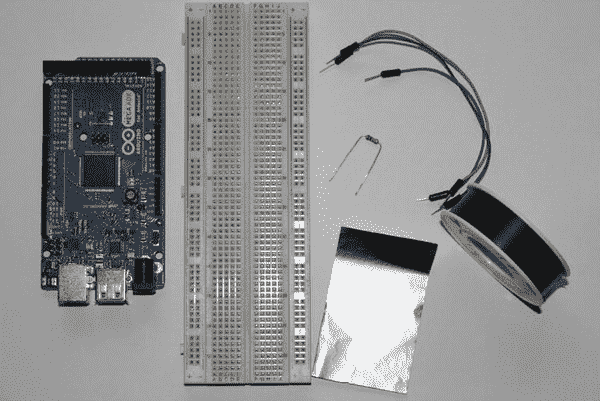

***图 8-1。**项目 9 件(ADK 板、试验板、电线、铝箔、胶带、10k 电阻)*

##### 铝箔

铝箔是铝压制成的薄片([图 8-2](#fig_8_2) )。家用床单通常具有大约 0.2 毫米的厚度。在一些地区，它仍然被错误地称为锡箔，因为锡箔是铝箔的前身。铝箔具有导电的特性，因此可以用作电路的一部分。你也可以在本章的项目中使用一根简单的线，但是箔片提供了一个更大的触摸目标区域，并且可以按照你喜欢的方式形成。不过，如果想将铝箔集成到电路中，它有一个缺点。用普通的焊锡将电线焊接到箔片上是不可能的。铝箔有一层薄的氧化层，防止焊锡与铝形成化合物。然而，有一些方法可以在焊接时减缓铝的氧化，迫使化合物与焊锡结合。这些方法是繁琐的，大多数时候你会得到一张损坏的铝箔，所以你不会在这个项目中这样做。相反，你会建立一个松散的铝箔连接。

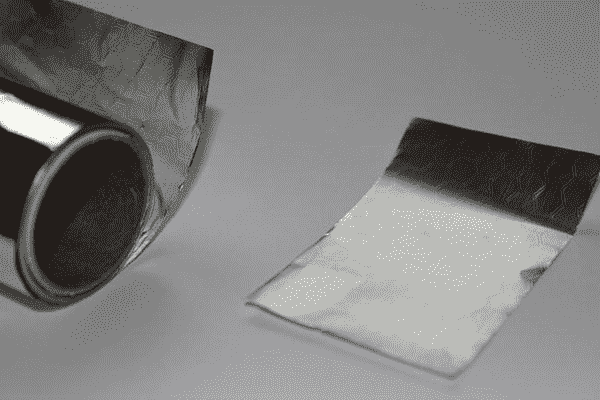

***图 8-2。**铝箔*

##### 胶带

如前所述，您需要在连接到项目电路的电线和一片铝箔之间建立松散连接。为了将电线紧紧地固定在铝箔上，您将使用胶带([图 8-3](#fig_8_3) )。你可以使用任何类型的胶带，比如管道胶带，所以只要用你喜欢的胶带就可以了。

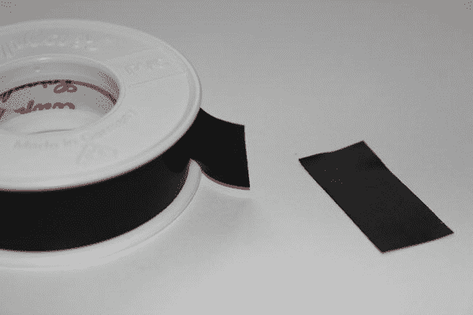

***图 8-3。**胶带*

#### 设置

你要做的第一件事是构建电容式触摸传感器。你先把一小块铝箔切成一定的形状。保持它相当小，以获得最佳结果；手掌大小的四分之一应该足够了。(参见[图 8-4](#fig_8_4) 。)

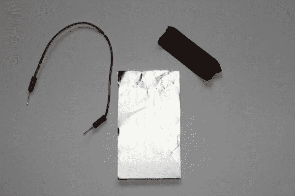

***图 8-4。**电线、铝箔片、胶带*

接下来，在箔片上放一根电线，并用一条胶带粘上。你要确保电线接触到金属箔并且牢牢地固定在上面。这种方法的一种替代方法是使用鳄鱼夹连接到可以夹在箔片上的金属丝上。如果您的连接有问题，您可以使用这些作为替代。但是你可能想先用胶带试试。(参见[图 8-5](#fig_8_5) 。)

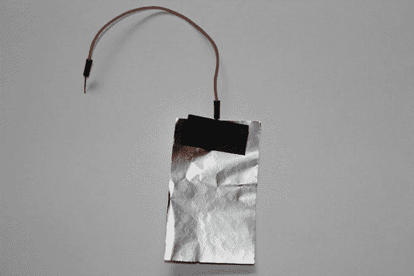

***图 8-5。**电容式触摸传感器*

现在你的传感器已经准备好了，你只需要把它连接到电路上。电路设置非常简单。您只需通过一个高阻值电阻将一个配置为输出的数字引脚连接到一个数字输入引脚。使用大约 10k 的电阻值。由于电路中没有消耗大量电流的实际用电设备，所以需要电阻，这样只有非常小的电流流过电路。触摸传感器就像一根分叉的电线一样连接到电路上。你可以在图 8-6 中看到完整的设置。

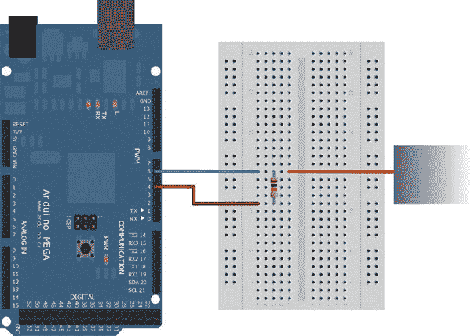

***图 8-6。**项目 9 设置*

那么这个电容传感器实际上是如何工作的呢？如您所见，您通过一个电阻将一个输出引脚连接到一个输入引脚，以读取输出引脚的当前状态。当输出引脚向电路供电时，输入引脚需要一段时间才能达到相同的电平。这是因为输入引脚具有电容特性，这意味着它在一定程度上充放电。触摸传感器是电路的一部分，当通电时，它会在其周围产生一个电场。当用户现在触摸传感器或者甚至非常接近传感器时，人体的水分子会干扰电场。这种干扰会导致输入引脚的电容发生变化，输入引脚需要更长时间才能达到与输出引脚相同的电压水平。我们将利用这个时间差来确定触摸是否发生。

#### 软件

该项目的软件部分将向您展示如何使用`CapSense` Arduino 库，通过您新构建的电容式触摸传感器来感知触摸。当达到某个阈值时，您将识别触摸事件，并将该信息传播到 Android 设备。如果发生触摸，运行的 Android 应用程序将播放蜂鸣器声音并振动，就像游戏节目蜂鸣器一样。

##### Arduino 草图

幸运的是，您不必自己实现容性检测逻辑。有一个额外的 Arduino 库，名为`CapSense`，它可以为您完成这项工作。`CapSense`由 Paul Badger 撰写，旨在鼓励使用 DIY 电容式触摸界面。你可以在`[www.arduino.cc/playground/Main/CapSense](http://www.arduino.cc/playground/main/capsense)`下载它，并将其复制到 Arduino IDE 安装的 libraries 文件夹中。

`CapSense`的作用是通过反复改变相连输出引脚的状态来监控数字输入引脚的状态变化行为。原理如下。数字输出引脚被设置为数字状态`HIGH,`,这意味着它向电路施加 5V 电压。连接的数字输入引脚需要一定的时间才能达到相同的状态。经过一段时间后，测量输入引脚是否已经达到与输出引脚相同的状态。如果如预期的那样，则没有发生触摸。之后，再次将输出引脚设置为`LOW` (0V)，并重复该过程。如果用户现在触摸附着的铝箔，电场会变形，导致电容值增加。这减缓了输入引脚上的电压积累过程。如果输出引脚现在再次将其状态变为`HIGH`，则输入引脚需要更长时间才能变为相同状态。现在对状态变化进行测量，输入引脚没有达到预期的新状态。这是发生触摸的指示器。

先看看完整的清单 8-1 。我将在清单之后更详细地介绍`CapSense`库。

***清单 8-1。**项目 9: Arduino 草图*

`#include <Max3421e.h>
#include <Usb.h>
#include <AndroidAccessory.h>
**#include <CapSense.h>**

**#define COMMAND_TOUCH_SENSOR 0x6**
**#define SENSOR_ID 0x0;**
**#define THRESHOLD 50**

**CapSense touchSensor = CapSense(4,6);**

AndroidAccessory acc("Manufacturer",
"Model",
"Description",
"Version",
"URI",
"Serial");

byte sntmsg[3];

void setup() {
Serial.begin(19200);
acc.powerOn();
**//disables auto calibration**
**touchSensor.set_CS_AutocaL_Millis(0xFFFFFFFF);**
sntmsg[0] = COMMAND_TOUCH_SENSOR;
sntmsg[1] = SENSOR_ID;
}` `**void loop() {**
**if (acc.isConnected()) {**
**//takes 30 measurements to reduce false readings and disturbances**
**long value = touchSensor.capSense(30);**
**if(value > THRESHOLD) {**
**sntmsg[2] = 0x1;**
**}**
**else {**
**sntmsg[2] = 0x0;**
**}**
**acc.write(sntmsg, 3);**
**delay(100);**
**}**
**}**`

除了附件通信所需的库之外，您还需要包含带有以下指令的`CapSense`库:

`#include <CapSense.h>`

由于电容式触摸按钮是一种特殊的按钮，我对数据消息使用了新的命令字节`0x6`。您可以使用与常规按钮相同的命令字节，即`0x1`，但是您必须在代码中进一步区分这两种类型。这里定义的第二个字节是触摸传感器的 id:

`#define COMMAND_TOUCH_SENSOR 0x6
#define SENSOR_ID 0x0;`

另一个常量定义是阈值。需要指定触摸发生的时间。由于电干扰会使测量值失真，您需要为测量值定义一个阈值或变化量，以确定什么是触摸，什么是简单的电噪声。

`#define THRESHOLD 50`

对于这个项目，我选择了值 50，因为对于这个电路设置，`CapSense`测量返回的值范围相当小。如果您使用一些`Serial.println()`方法调用来监控测量值，以查看触摸电容式传感器时该值如何变化，会有所帮助。如果您在设置中使用另一个电阻，或者您发现 50 不是您的设置的最佳阈值，那么您可以简单地调整`THRESHOLD`值。

你在草图中看到的下一个东西是`CapSense`对象的定义。`CapSense`类的构造函数将两个整数值作为输入参数。第一个定义了数字输出引脚，它在数字状态`HIGH`和`LOW`之间交替。第二个参数定义数字输入引脚，该引脚被拉至与输出引脚相同的电流状态。

`CapSense touchSensor = CapSense(4,6);`

看完变量定义之后，让我们来看看设置方法。除了通常的初始化步骤，您现在已经知道了，还有对`CapSense`对象的第一个方法调用。

`touchSensor.set_CS_AutocaL_Millis(0xFFFFFFFF);`

该方法关闭了感测程序的自动校准，否则在测量期间可能会发生自动校准。

循环法实现触摸检测。首先，调用`capSense`方法，其中必须提供样本数量的参数。30 个样本的值似乎足够了。该方法以任意单位返回值。如果返回的检测值超过您之前定义的阈值，则检测到触摸，并在返回消息中设置相应的字节。

`long value = touchSensor.capSense(30);
if(value > THRESHOLD) {
sntmsg[2] = 0x1;
}
else {
sntmsg[2] = 0x0;
}`

最后要做的是将当前数据消息发送到连接的 Android 设备。

##### Android 应用程序

Android 应用程序使用了一些你已经知道的功能，比如使用振动器服务。这个应用程序的一个新功能是音频播放。当接收到触摸传感器数据消息时，代码评估数据以确定触摸按钮是否被按下。如果它被按下，背景颜色会变成红色，一个`TextView`会显示哪个触摸按钮被按下，以防您添加其他按钮。与此同时，该设备的振动器打开，并播放蜂鸣器声音，以获得最终游戏节目蜂鸣器般的感觉。清单 8-2 中的这个项目的 Android 代码显示了应用程序逻辑。

***清单 8-2。项目 9:ProjectNineActivity.java***

`**package project.nine.adk;**

import …;

**public class ProjectNineActivity extends Activity {**

…

**private static final byte COMMAND_TOUCH_SENSOR = 0x6;**
**private static final byte SENSOR_ID = 0x0;**

**private LinearLayout linearLayout;**
**private TextView buzzerIdentifierTextView;**

**private Vibrator vibrator;**
**private boolean isVibrating;**

**private SoundPool soundPool;**
**private boolean isSoundPlaying;**
**private int soundId;**

**private float streamVolumeMax;**

/** Called when the activity is first created. */
@Override` `public void onCreate(Bundle savedInstanceState) {
super.onCreate(savedInstanceState);

…

setContentView(R.layout.main);
**linearLayout = (LinearLayout) findViewById(R.id.linear_layout);**
**buzzerIdentifierTextView = (TextView) findViewById(R.id.buzzer_identifier);**

**vibrator = ((Vibrator) getSystemService(VIBRATOR_SERVICE));**

**soundPool = new SoundPool(1, AudioManager.STREAM_MUSIC, 0);**
**soundId = soundPool.load(this, R.raw.buzzer, 1);**

**AudioManager mgr = (AudioManager) getSystemService(Context.AUDIO_SERVICE);**
**streamVolumeMax = mgr.getStreamMaxVolume(AudioManager.STREAM_MUSIC);**
}

/**
* Called when the activity is resumed from its paused state and immediately
* after onCreate().
*/
@Override
public void onResume() {
super.onResume();
…
}

/** Called when the activity is paused by the system. */
@Override
public void onPause() {
super.onPause();
closeAccessory();
stopVibrate();
**stopSound();**
}

/**
* Called when the activity is no longer needed prior to being removed from
* the activity stack.
*/
@Override
public void onDestroy() {
super.onDestroy();
unregisterReceiver(mUsbReceiver);
**releaseSoundPool();**
}

private final BroadcastReceiver mUsbReceiver = new BroadcastReceiver() {
@Override
public void onReceive(Context context, Intent intent) {` `…
}
};

private void openAccessory(UsbAccessory accessory) {
mFileDescriptor = mUsbManager.openAccessory(accessory);
if (mFileDescriptor != null) {
mAccessory = accessory;
FileDescriptor fd = mFileDescriptor.getFileDescriptor();
mInputStream = new FileInputStream(fd);
mOutputStream = new FileOutputStream(fd);
Thread thread = new Thread(null, commRunnable, TAG);
thread.start();
Log.d(TAG, "accessory opened");
} else {
Log.d(TAG, "accessory open fail");
}
}

private void closeAccessory() {
try {
if (mFileDescriptor != null) {
mFileDescriptor.close();
}
} catch (IOException e) {
} finally {
mFileDescriptor = null;
mAccessory = null;
}
}

**Runnable commRunnable = new Runnable() {**

**@Override**
**public void run() {**
**int ret = 0;**
**byte[] buffer = new byte[3];**

**while (ret >= 0) {**
**try {**
**ret = mInputStream.read(buffer);**
**} catch (IOException e) {**
**Log.e(TAG, "IOException", e);**
**break;**
**}**

**switch (buffer[0]) {**
**case COMMAND_TOUCH_SENSOR:**

**if (buffer[1] == SENSOR_ID) {**
**final byte buzzerId = buffer[1];**` `**final boolean buzzerIsPressed = buffer[2] == 0x1;**
**runOnUiThread(new Runnable() {**

**@Override**
**public void run() {**
**if(buzzerIsPressed) {**
**linearLayout.setBackgroundColor(Color.RED);**
**buzzerIdentifierTextView.setText(getString(**
**R.string.touch_button_identifier, buzzerId));**
**startVibrate();**
**playSound();**
**} else {**
**linearLayout.setBackgroundColor(Color.WHITE);**
**buzzerIdentifierTextView.setText("");**
**stopVibrate();**
**stopSound();**
**}**
**}**
**});**
**}**
**break;**

**default:**
**Log.d(TAG, "unknown msg: " + buffer[0]);**
**break;**
**}**
**}**
**}**
**};**

private void startVibrate() {
if(vibrator != null && !isVibrating) {
isVibrating = true;
vibrator.vibrate(new long[]{0, 1000, 250}, 0);
}
}

private void stopVibrate() {
if(vibrator != null && isVibrating) {
isVibrating = false;
vibrator.cancel();
}
}

**private void playSound() {**
**if(!isSoundPlaying) {**
**soundPool.play(soundId, streamVolumeMax, streamVolumeMax, 1, 0, 1.0F);**
**isSoundPlaying = true;**
**}**
**}**` `**private void stopSound() {**
**if(isSoundPlaying) {**
**soundPool.stop(soundId);**
**isSoundPlaying = false;**
**}**
**}**

**private void releaseSoundPool() {**
**if(soundPool != null) {**
**stopSound();**
**soundPool.release();**
**soundPool = null;**
**}**
**}**
}`

首先，像往常一样，让我们看看变量的定义。

`private static final byte COMMAND_TOUCH_SENSOR = 0x6;
private static final byte SENSOR_ID = 0x0;

private LinearLayout linearLayout;
private TextView buzzerIdentifierTextView;

private Vibrator vibrator;
private boolean isVibrating;

private SoundPool soundPool;
private boolean isSoundPlaying;
private int soundId;

private float streamVolumeMax;`

数据消息字节与 Arduino 草图中的相同。`LinearLayout`是容器视图，它稍后会填充整个屏幕。它用于通过将背景颜色更改为红色来指示触摸按钮被按下。`TextView`显示当前按钮的标识符。接下来的两个变量负责保存对 Android 系统的`Vibrator`服务的引用，并负责确定振动器当前是否在振动。最后一个变量负责媒体回放。Android 有几种媒体播放的可能性。一种简单的低延迟播放短声音片段的方法是使用`SoundPool`类，它甚至能够一次播放多个流。`SoundPool`对象在初始化后负责加载和播放声音。在本例中，您将需要一个布尔标志，即`isSoundPlaying`标志，这样，如果蜂鸣器已经在播放，您就不会再次触发它。一旦声音文件被加载，`soundId`将保存一个对声音文件的引用。最后一个变量用于设置稍后播放声音时的音量。

接下来是进行必要初始化的`onCreate`方法。除了视图初始化之外，您可以看到这里分配了一个对系统振动器服务的引用。之后，初始化`SoundPool`。`SoundPool`类的构造函数有三个参数。第一个是`SoundPool`可以同时播放的流的数量。第二个定义了哪种流将与`SoundPool`相关联。您可以为音乐、系统声音、通知等分配流。最后一个参数指定源质量，目前没有影响。文档说明您现在应该使用 0 作为缺省值。一旦它被初始化，你必须将声音载入`SoundPool`。为此，您必须调用`load`方法，它的参数是一个`Context`对象、要加载的声音的资源 id 和一个优先级 id。`load`方法返回一个引用 id，稍后您将使用它来回放预加载的声音。将您的声音文件放在`res/raw/buzzer.mp3`下的`res`文件夹中。

 **注意**您可以在 Android 系统上使用多种音频文件编码类型。完整的列表可以在`[http://developer.android.com/guide/appendix/media-formats.html](http://developer.android.com/guide/appendix/media-formats.html)`的开发者页面中找到。

这里要做的最后一件事是确定您所使用的流类型的最大可能音量。稍后，当您播放声音时，您可以定义音量级别。因为你想要一个相当响的蜂鸣器，所以最好把音量调到最大。

`setContentView(R.layout.main);
linearLayout = (LinearLayout) findViewById(R.id.linear_layout);
buzzerIdentifierTextView = (TextView) findViewById(R.id.buzzer_identifier);

vibrator = ((Vibrator) getSystemService(VIBRATOR_SERVICE));

soundPool = new SoundPool(1, AudioManager.STREAM_MUSIC, 0);
soundId = soundPool.load(this, R.raw.buzzer, 1);

AudioManager mgr = (AudioManager) getSystemService(Context.AUDIO_SERVICE);
streamVolumeMax = mgr.getStreamMaxVolume(AudioManager.STREAM_MUSIC);`

和往常一样，在接收消息时，分配给接收工作线程的`Runnable`对象实现评估逻辑，并最终触发类似蜂鸣器的行为。

`switch (buffer[0]) {
case COMMAND_TOUCH_SENSOR:
if (buffer[1] == SENSOR_ID) {
final byte buzzerId = buffer[1];
final boolean buzzerIsPressed = buffer[2] == 0x1;
runOnUiThread(new Runnable() {

@Override
public void run() {
if(buzzerIsPressed) {
linearLayout.setBackgroundColor(Color.RED);
buzzerIdentifierTextView.setText(getString(
R.string.touch_button_identifier, buzzerId));
startVibrate();
playSound();
} else {
linearLayout.setBackgroundColor(Color.WHITE);
buzzerIdentifierTextView.setText("");
stopVibrate();
stopSound();
}
}` `});
}
break;

default:
Log.d(TAG, "unknown msg: " + buffer[0]);
break;
}`

您可以看到`LinearLayout`的背景颜色根据按钮的状态而改变，并且`TextView`也相应地更新。`startVibrate`和`stopVibrate`方法在[第四章](04.html#ch4)的项目 3 中已经熟悉。

`private void startVibrate() {
if(vibrator != null && !isVibrating) {
isVibrating = true;
vibrator.vibrate(new long[]{0, 1000, 250}, 0);
}
}

private void stopVibrate() {
if(vibrator != null && isVibrating) {
isVibrating = false;
vibrator.cancel();
}
}`

`startVibrate`和`stopVibrate`方法只是在开始振动或取消当前振动之前检查振动器是否已经在振动。

根据触摸按钮的状态，开始或停止蜂鸣声播放。这里可以看到方法的实现:

`private void playSound() {
if(!isSoundPlaying) {
soundPool.play(soundId, streamVolumeMax, streamVolumeMax, 1, 0, 1.0F);
isSoundPlaying = true;
}
}

private void stopSound() {
if(isSoundPlaying) {
soundPool.stop(soundId);
isSoundPlaying = false;
}
}`

要播放声音，你必须调用`SoundPool`对象上的`play`方法。它的参数是`soundId`，这是您之前在加载声音文件时检索到的，左右声道的音量定义，声音优先级，循环模式，以及当前声音的回放速率。要停止声音，你只需调用`SoundPool`对象上的`stop`方法，并提供相应的`soundId`。您不需要在您的`AndroidManifest.xml`中为`SoundPool`的工作定义任何额外的权限。

当应用程序关闭时，你也应该清理一下。要释放`SoundPool`分配的资源，只需调用`release`方法。

`private void releaseSoundPool() {
if(soundPool != null) {
stopSound();
soundPool.release();
soundPool = null;
}
}`

由于屏幕布局与上一个项目有所不同，你应该看看这个项目的`main.xml`布局文件，如[清单 8-3](#list_8_3) 所示。

***清单 8-3。**项目 9: main.xml*

`<?xml version="1.0" encoding="utf-8"?>
<LinearLayout xmlns:android="http://schemas.android.com/apk/res/android"
android:id="@+id/linear_layout"
android:orientation="vertical"
android:layout_width="fill_parent"
android:layout_height="fill_parent"
android:gravity="center"
android:background="#FFFFFF">
<TextView android:id="@+id/buzzer_identifier"
android:layout_width="wrap_content"
android:layout_height="wrap_content"
android:textColor="#000000"/>
</LinearLayout>`

您可以看到该布局只定义了一个嵌入到`LinearLayout`容器中的`TextView`。

这就是本章项目编码的全部内容。如果你愿意，你可以用额外的蜂鸣器来扩展这个项目，这样你就可以在和你的朋友和家人玩游戏时使用你自己定制的蜂鸣器。部署您的应用程序，并对项目进行测试。你的最终结果应该看起来像[图 8-7](#fig_8_7) 。

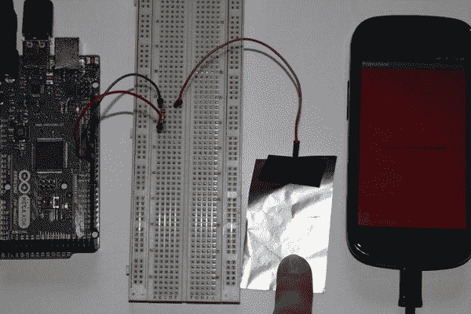

***图 8-7。**项目 9:最终结果*

### 额外的实际例子:ADK 纸钢琴

您已经看到，构建一个简单的 DIY 电容式触摸传感器既不困难也不昂贵。你可以很容易地想象，这种技术在爱好社区中被大量使用来构建具有漂亮和酷的交互用户界面的项目。为了让你自己的创意源源不断，我想借此机会向你展示我的一个项目，这是我为 2011 年柏林谷歌开发者日做的，只是可以实现的一个例子。

2011 年 7 月，谷歌宣布公开呼吁谷歌开发者日。谷歌开发者日是谷歌在美国以外最大的开发者大会。它在全球几个大城市举办。2011 年的比赛地点是阿根廷、澳大利亚、巴西、捷克共和国、德国、以色列、日本和俄罗斯。这次公开征集让开发者有机会向大约 2000 名开发者展示他们的技能和项目。两个挑战是公开呼吁的一部分:HTML5 挑战和 ADK 挑战。参与者首先必须回答一些关于他们挑战的相应技术的基本问题。当他们成功回答这些问题时，他们就有资格参加第二轮挑战。现在，我不知道 HTML5 挑战赛的流程到底是如何运作的，但 ADK 挑战赛的第二轮要求拿出一个合理的项目计划。项目计划应该将 ADK 技术与 Android 设备结合起来，创造一些有趣的东西，如机器人、乐器，甚至是解决日常问题的设备。我的项目计划是用纸做一架带有电容式触摸键的钢琴，ADK 纸钢琴。当用户触摸一个键时，连接的 ADK 板应该会识别它，并在连接的 Android 设备的帮助下播放该键的相应音符。

我从一个只有四个电容式触摸键的小型原型开始。我想看看我用铝箔制成的电容式触摸传感器，当我用纸的顶层和底层绝缘时，它是否会有足够的响应。我使用了`CapSense`库来识别触摸时不同的键，并使用了`SoundPool`类来回放每个键对应的音符。设计示意图如图[图 8-8](#fig_8_8) 所示。

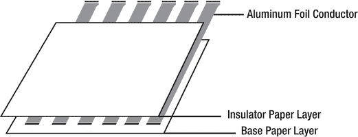

***图 8-8。**钢琴键构造示意图*

原型运行得非常好，我的项目计划被认为是十大提交项目之一，所以我在谷歌开发者日的展览区获得了一席之地。谷歌提供了谷歌 ADK 董事会和演示盾牌，以实现该项目的活动。

在 2011 年 11 月 19 日之前，我有大约三个月的时间来完成这个项目。让我告诉你，三个月听起来像很多时间，但当你在全职工作的同时写一本书时，你往往没有多少时间留给这样的项目。尽管如此，我还是及时完成了这个项目，最后一切都很顺利。然而，建造过程本身就充满了挑战。

正如我对原型所做的那样，我决定用覆有纸的铝箔条来制作电容式触摸钢琴键。每个钥匙下面都有自己的铝箔条。我必须确保这些条带覆盖了钥匙的大部分区域，而不会碰到附近的其他条带。

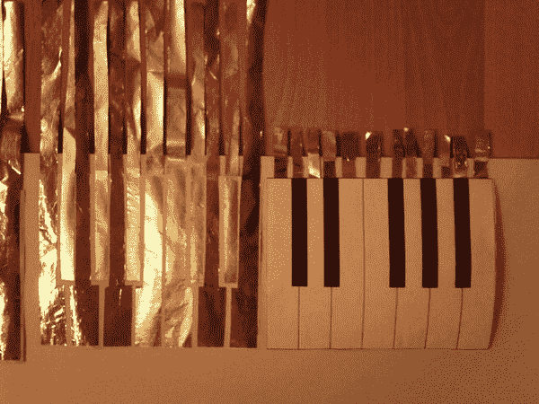

***图 8-9。**钢琴键布局表*

总共需要对 61 个按键进行切割并粘贴在纸键下方的繁琐工作(参见[图 8-10](#fig_8_10) )。).

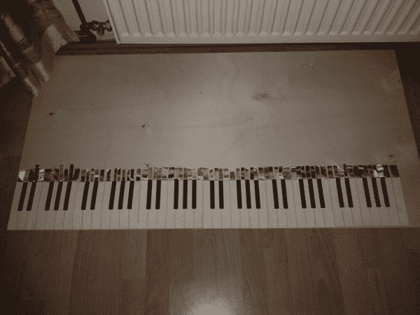

***图 8-10。**完成琴键布局*

如果你还记得的话，谷歌 ADK 板是基于 Arduino Mega 设计的，只有 54 个数字引脚。光凭黑板，我无法识别目标的 61 个键。这就是为什么我建立了自己的扩展板，能够提供更多的输入。电路板上有所谓的 8 位输入移位寄存器。这些 IC 提供八个输入通道，只需使用 ADK 板的三个引脚即可读取。有了 8 个这样的 IC，我只用了大约一半的 ADK 数字引脚就能有 64 路输入。(参见[图 8-11](#fig_8_11) 。)

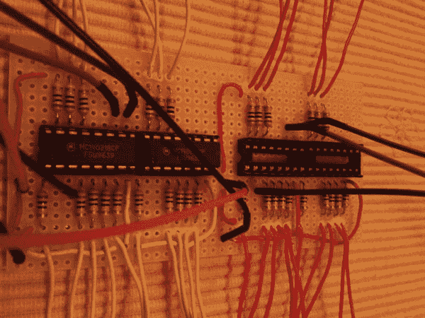

***图 8-11。**自定义输入移位寄存器板*

由于我不能将输入连接直接焊接到铝箔条上，我使用鳄鱼夹来建立连接([图 8-12](#fig_8_12) )。

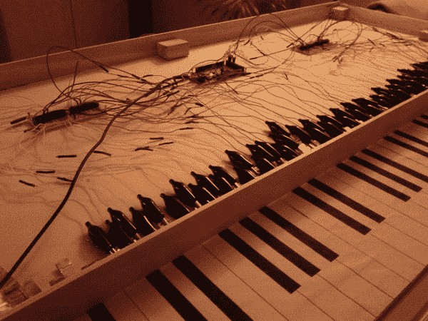

***图 8-12。**成品纸钢琴建造*

构建阶段已经完成，我必须编写软件来识别触摸事件并播放相应的音符。我不能再使用`CapSense`库了，因为我现在使用 ADK 板的数字引脚来寻址输入移位寄存器。所以我实现了自己的类似于`CapSense`库的例程，它也依赖于输入到达某个状态的时间。对于 Android 部分，我还使用了`SoundPool`类，当相应的键被触摸时，播放预先载入的 MP3 音乐。当前纸币的波形也显示在设备的屏幕上。

在截止日期前完成项目(如图 8-13 所示)后，我不得不一路穿过柏林将钢琴运送到场地([图 8-14](#fig_8_14) )。ADK 项目的展览区受到了热烈的欢迎，ADK 纸钢琴给人留下了深刻的印象。它甚至被当地报纸的一篇报道选中。在活动中展示的 ADK 项目引起了社区的极大兴趣，并很好地概述了可以用 ADK 做些什么，并且希望激发一些人自己尝试一下。

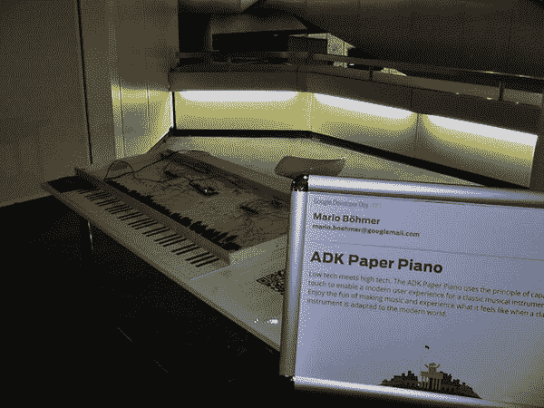

***图 8-13。**柏林 2011 年谷歌开发者日的 ADK 纸钢琴*

***图 8-14。【2011 年柏林谷歌开发者日在柏林国际商会举行***

 **注**你可以在`[http://marioboehmer.blogspot.com/2011/11/adk-paper-piano-at-google-developer-day.html](http://marioboehmer.blogspot.com/2011/11/adk-paper-piano-at-google-developer-day.html)`的我的博客里找到更多关于这个项目和活动的信息。

你也应该看看这个网站，它给出了在谷歌开发者日之旅的不同地点展示的所有 ADK 项目的概述。

### 总结

自从你开始写这本书以来，你第一次用家用物品制作了自己的传感器。您已经了解了构建自己的电容式触摸传感器有多简单。对于 Arduino 部分，您学习了如何使用 Arduino `CapSense`库来感测触摸事件。通过结合一些以前学到的 Android 功能，比如使用`Vibrator`服务和通过`SoundPool`类添加回放声音的能力，您创建了自己的游戏节目蜂鸣器。您还了解到在一个更大的项目中使用 DIY 电容式触摸传感器的个人实例。