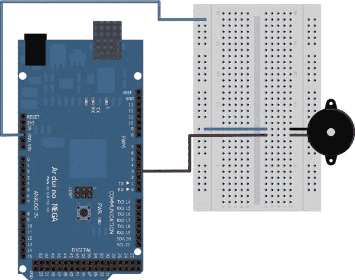

# 十、报警系统

现在你已经对你的 ADK 板和你已经使用过的不同的传感器和组件感到满意了，是时候来点更大的了。在最后一章中，您将结合前几章中使用的一些组件来构建两个版本的报警系统。您将了解新组件—倾斜开关和由红外 LED 和红外探测器组成的红外挡光板—在现实世界中广泛应用。在两个独立的项目中，您将学习如何将这些组件集成到一个小型报警系统中，以便它们触发警报。在硬件方面，警报将通过闪烁的红色 LED 和产生高音的压电蜂鸣器来表达。您的 Android 设备会将警报事件保存在一个日志文件中，并且根据当前的项目，它还会发送一条通知短信，或者给入侵者拍照并保存到您的文件系统中。

### 项目 12:带倾斜开关的短信报警系统

在这个项目中，你将使用一个所谓的倾斜开关来触发警报，如果开关倾斜到其关闭位置。触发器将使红色 LED 发出脉冲，压电蜂鸣器发出警报声。此外，Android 设备将收到警报通知，并在其文件系统中写入日志文件。如果您的 Android 设备具有电话功能，它还会向指定的电话号码发送短信，显示报警时间和报警消息。

#### 零件

你的第一个报警系统需要几个部件。您将使用一个红色 LED 来发出警报发生的视觉信号。对于听觉反馈，您将使用一个压电蜂鸣器产生报警声。如果倾斜到关闭位置，倾斜开关将触发警报。要重置报警系统，以便它可以报告下一个报警，您将使用一个简单的按钮。以下是您的报警系统所需部件的完整列表(参见[图 10-1](#fig_10_1) ):

*   ADK 董事会
*   试验板
*   S7-1200 可编程控制器
*   2 X10 kω电阻
*   一些电线
*   纽扣
*   倾斜开关
*   工作电压为 5V 的 LED
*   压电蜂鸣器

***图 10-1。**项目 12 部分(ADK 板、试验板、电线、电阻器、按钮、倾斜开关、压电蜂鸣器、红色 LED)*

##### ADK 董事会

本项目将使用 ADK 板，提供两种输入方式，即倾斜开关和按钮，以及两种输出方式，即 LED 和压电蜂鸣器。由于您没有任何模拟输入要求，您将只使用 ADK 板的数字引脚。您将使用数字输入功能来感应按钮的按下或倾斜开关的闭合。数字输出功能，尤其是 PWM 功能，将用于脉冲 LED，并通过压电蜂鸣器产生声音。

##### LED

正如您在第 3 章中所学，您可以通过使用 ADK 板的 PWM 功能来调暗 LED。当警报发生时，LED 将用于给出视觉反馈。这将通过让 LED 脉冲来实现，这意味着它将在其最亮的最大水平和最暗的最小水平之间持续变暗，直到警报被重置。

##### 压电蜂鸣器

[第 5 章](05.html#ch5)向您展示了当向压电蜂鸣器的压电元件供电时，您可以产生声音，这被描述为反向压电效应。压电元件的振荡产生压力波，该压力波被人耳感知为声音。振荡是通过使用 ADK 板的 PWM 功能来调制输出到压电蜂鸣器的电压来实现的。

##### 按钮

在第 4 章中，您学习了如何将按钮或开关用作项目的输入。原理很简单。当按钮或开关被按下或闭合时，电路闭合。

##### 倾斜开关

倾斜开关与普通开关非常相似。不同的是，用户没有真正的开关来按下或翻转以闭合连接的电路。最常见的倾斜开关通常以部件内的连接器引线彼此分离的方式构造。此外，在组件内还有一个由导电材料制成的球。(参见[图 10-2](#fig_10_2) )。

***图 10-2。**打开倾斜开关(内部视图)*

当开关以某种方式倾斜时，导电球移动并接触开路连接。球关闭了连接，电流可以从一端流到另一端。由于球受重力影响，你只需倾斜倾斜开关，使连接点指向地面。(参见[图 10-3](#fig_10_3) )。

***图 10-3。**关闭倾斜开关(内部视图)*

就这么简单。当你摇动倾斜开关时，你可以听到球在组件内移动。

倾斜开关也被称为水银开关，因为在过去，大多数倾斜开关内部都有一个水银滴来关闭连接。水银的优点是它不像其他材料那样容易反弹，所以它不会受到振动的太大影响。然而，缺点是水银毒性很强，所以如果倾斜开关损坏，就会对环境造成危险。如今，其他导电材料通常用于倾斜开关。

倾斜开关在许多实际应用中使用。汽车工业广泛使用它们。汽车的行李箱灯只是一个例子:如果你把行李箱打开到一个特定的角度，灯就会打开。另一个例子是经典的弹球机，如果用户过度倾斜机器以获得优势，它会进行记录。你也可以很容易地想象一个报警系统的用例，比如当门把手被按下时进行感应。

一些倾斜开关可能带有焊接引脚，您不能直接将其插入试验板，因此您可能需要在这些引脚上焊接一些电线，以便稍后将倾斜开关连接到电路。(参见[图 10-4](#fig_10_4) )。有时倾斜开关可以有两个以上的连接器，以便您可以将它们连接到多个电路。你只需要确保你总是连接正确的引脚对。查看数据手册或构建一个简单电路来测试哪些连接相互关联。

***图 10-4。**带焊接连接器引脚的倾斜开关和库存倾斜开关*

#### 设置

设置将通过一次连接一个组件来完成，这样当您启动项目时，您就不会弄混并最终损坏某些东西。我将首先展示每个独立的电路设置，然后展示包含所有元件的完整电路设置。

##### LED 电路

先说 LED。众所周知，led 通常以大约 20mA 到 30mA 的电流工作。为了将电流限制在至少 20mA 的值，您需要在 LED 上连接一个电阻。ADK 板的输出引脚提供 5V 电压，因此您需要应用欧姆定律来计算电阻值。

r = 5v/0.02a
r = 250ω

最接近的普通电阻是 220ω电阻。有了这个电阻，你最终会得到一个大约 23mA 的电流，这很好。现在将电阻的一端连接到数字引脚 2，另一端连接到 LED 的阳极(长引线)。发光二极管的阴极接地(GND)。LED 电路设置如图[图 10-5](#fig_10_5) 所示。

***图 10-5。**项目 12: LED 电路设置*

##### 压电蜂鸣器电路

接下来，您将压电蜂鸣器连接到 ADK 板。这非常简单，因为你不需要额外的组件。如果你碰巧有一个压电蜂鸣器，确保按照标记正确连接正负引线。否则，只需将一根引线连接到数字引脚 3，另一根引线接地(GND)。压电蜂鸣器电路设置如[图 10-6](#fig_10_6) 所示。

***图 10-6。**项目 12:压电蜂鸣器电路设置*

##### 按钮电路

您可能还记得第 4 章中的[内容，使用按钮消除电气干扰时，最好将电路上拉至工作电压。为了上拉按钮电路而不损坏高电流输入引脚，需要将一个 10kΩ上拉电阻与按钮一起使用。为此，将 ADK 电路板的+5V Vcc 引脚连接到 10kω](04.html#ch4)电阻的一条引线。另一根引线连接到数字引脚 4。数字引脚 4 也连接到按钮的一个引线。相反的导线接地(GND)。按钮电路如图[图 10-7](#fig_10_7) 所示。

***图 10-7。**项目 12:按钮电路设置*

##### 倾斜开关电路

由于倾斜开关的工作原理与按钮类似，您可以像连接按钮一样连接它。将 ADK 板的+5V Vcc 引脚连接到 10kΩ电阻的一根引线上。另一根引线连接到数字引脚 5。数字引脚 5 也连接到倾斜开关的一个引线。相反的导线接地(GND)。倾斜开关电路设置如[图 10-8](#fig_10_8) 所示。

***图 10-8。**项目 12:倾斜开关电路设置*

##### 完成电路设置

现在你知道如何连接每个组件，看看图 10-9 所示的完整电路设置。

***图 10-9。**项目 12:完成电路设置*

那么这个报警系统是如何工作的呢？想象一下，倾斜开关安装在门把手或天窗上。当手柄被按下或存水弯窗被打开时，倾斜开关将倾斜到导电球接触内部引线的位置，从而使开关闭合。现在，报警被记录，压电蜂鸣器和 LED 开始发出声音和视觉报警反馈。要重置警报以便再次触发，必须按下按钮。

#### 软件

现在您已经设置好了一切，是时候编写必要的软件来启动和运行警报系统了。Arduino 草图将监控倾斜开关是否已倾斜至其触点闭合位置。如果倾斜开关触发了警报，Arduino `tone`方法将用于使压电蜂鸣器振荡，从而产生高音。此外，红色 LED 将通过使用`analogWrite`方法产生脉冲，该方法调制电压输出并使 LED 以不同的照明强度点亮。为了重置警报，使其可以再次被触发，一个简单的按钮的状态被读取。一旦按下该按钮，所有必要的变量都会重置，报警系统可以再次记录报警。

如果警报被触发，如果 Android 设备已连接，则会向其发送一条消息。一旦 Android 设备收到警报消息，它会以红屏背景和警报消息的形式给出视觉反馈。警报消息和时间戳将保存在设备的外部存储系统中。但是，不要被术语*外部*所误导。*Android 环境下的外部*并不一定意味着*存储*，比如可移动 SD 卡。术语*外部*也可以描述内部不可移动存储。这是一种表述，描述存储在其中的文件可以被用户读取和修改，并且该存储可以被另一个操作系统安装为用于文件浏览的大容量存储。

如果连接的 Android 设备支持电话功能，则会向预先配置的电话号码发送包含警报消息的短信。请记住，大多数 Android 平板电脑都没有电话功能，因为它们的主要用途是浏览互联网，而不是给人打电话。你可以想象，没有人会在公共场合拿着一个 10 英寸的平板电脑贴着脸颊打电话，看起来很酷。

##### Arduino 草图

如软件部分所述，您将使用一些在前面的示例中使用过的众所周知的方法。现在唯一的不同是，您将使用多个组件。在我详细描述之前，先看一下完整的清单 10-1 。

***清单 10-1。**项目 12: Arduino 草图*

`#include <Max3421e.h>
#include <Usb.h>
#include <AndroidAccessory.h>

**#define LED_OUTPUT_PIN 2**
**#define PIEZO_OUTPUT_PIN 3**
**#define BUTTON_INPUT_PIN 4**
**#define TILT_SWITCH_INPUT_PIN 5**

**#define NOTE_C7 2100**

**#define COMMAND_ALARM 0x9**
**#define ALARM_TYPE_TILT_SWITCH 0x1**
**#define ALARM_OFF 0x0**
**#define ALARM_ON 0x1**

**int tiltSwitchValue;**
**int buttonValue;**
**int ledBrightness;**
**int fadeSteps = 5;**

**boolean alarm = false;**

AndroidAccessory acc("Manufacturer", "Model", "Description",
"Version", "URI", "Serial");` `byte sntmsg[3];

void setup() {
Serial.begin(19200);
acc.powerOn();
**sntmsg[0] = COMMAND_ALARM;**
**sntmsg[1] = ALARM_TYPE_TILT_SWITCH;**
**}**

**void loop() {**
**acc.isConnected();**
**tiltSwitchValue = digitalRead(TILT_SWITCH_INPUT_PIN);**
**if((tiltSwitchValue == LOW) && !alarm) {**
**startAlarm();**
**}**
**buttonValue = digitalRead(BUTTON_INPUT_PIN);**
**if((buttonValue == LOW) && alarm) {**
**stopAlarm();**
**}**
**if(alarm) {**
**fadeLED();**
**}**
**delay(10);**
**}**

**void startAlarm() {**
**alarm = true;**
**tone(PIEZO_OUTPUT_PIN, NOTE_C7);**
**ledBrightness = 0;**
**//inform Android device**
**sntmsg[2] = ALARM_ON;**
**sendAlarmStateMessage();**
**}**

**void stopAlarm() {**
**alarm = false;**
**//turn off piezo buzzer**
**noTone(PIEZO_OUTPUT_PIN);**
**//turn off LED**
**digitalWrite(LED_OUTPUT_PIN, LOW);**
**//inform Android device**
**sntmsg[2] = ALARM_OFF;**
**sendAlarmStateMessage();**
**}**

**void sendAlarmStateMessage() {**
**if (acc.isConnected()) {**
**acc.write(sntmsg, 3);**
**}**
**}**` `**void fadeLED() {**
**analogWrite(LED_OUTPUT_PIN, ledBrightness);**
**//increase or decrease brightness**
**ledBrightness = ledBrightness + fadeSteps;**
**//change fade direction when reaching max or min of analog values**
**if (ledBrightness < 0 || ledBrightness > 255) {**
**fadeSteps = -fadeSteps ;**
**}**
**}**`

首先让我们看看变量的定义和声明。如果您按照我在项目硬件设置一节中描述的那样连接了所有输入和输出组件，那么您的引脚定义应该如下所示。

`#define LED_OUTPUT_PIN 2
#define PIEZO_OUTPUT_PIN 3
#define BUTTON_INPUT_PIN 4
#define TILT_SWITCH_INPUT_PIN 5`

你看到的下一个定义是警报发生时压电蜂鸣器应该产生的高音频率。2100 Hz 的频率定义了音符 *C7，*这是大多数音乐键盘上的最高音符，除了古典 88 键钢琴。音符提供了完美的高音，人耳比任何低音都能听得更清楚。这就是为什么像火警这样的系统使用高音报警声的原因。

`#define NOTE_C7 2100`

接下来，您将看到通常的数据消息字节定义。为报警命令选择了一个新的字节值，一个类型字节定义了本项目中用于触发报警的倾斜开关。如果您打算以后在报警系统中添加额外的开关或传感器，则定义类型字节。最后两个字节定义仅定义报警是否已触发或是否已关闭。

`#define COMMAND_ALARM 0x9
#define ALARM_TYPE_TILT_SWITCH 0x1
#define ALARM_OFF 0x0
#define ALARM_ON 0x1`

当您使用`digitalRead`方法读取按钮或倾斜开关的数字状态时，返回值将是一个`int`值，稍后可与常量`HIGH`和`LOW`进行比较。所以你需要两个变量来存储按钮和倾斜开关的读数。

`int tiltSwitchValue;
int buttonValue;`

请记住，当警报发生时，您希望让 LED 发出脉冲。为此，您需要使用`analogWrite`方法来调制 LED 的电源电压。`analogWrite`方法接受从 0 到 255 范围内的值。这就是为什么你将当前亮度值存储为一个`int`值。当您增加或降低 LED 的亮度时，您可以定义渐变过程的步长值。步长值越低，LED 的衰减越平滑越慢，因为达到`analogWrite`范围的最大值或最小值需要更多的循环周期。

`int ledBrightness;
int fadeSteps = 5;`

最后一个新变量是一个`boolean`标志，它仅存储报警系统的当前状态，以确定报警当前是激活还是关闭。它在开始时被初始化为关闭状态。

`boolean alarm = false;`

变量就是这样。除了用新的命令字节和类型字节填充数据消息的前两个字节之外，`setup`方法没有任何新的功能。有趣的部分是`loop`方法。

`void loop() {
acc.isConnected();
tiltSwitchValue = digitalRead(TILT_SWITCH_INPUT_PIN);
if((tiltSwitchValue == LOW) && !alarm) {
startAlarm();
}
buttonValue = digitalRead(BUTTON_INPUT_PIN);
if((buttonValue == LOW) && alarm) {
stopAlarm();
}
if(alarm) {
fadeLED();
}
delay(10);
}`

在之前的项目中，循环方法中的代码被 if 子句包围，该子句检查 Android 设备是否连接，然后才执行程序逻辑。由于这是一个报警系统，所以我认为即使没有连接 Android 设备，也最好让它至少在 Arduino 端工作。在循环开始时调用`isConnected`方法的原因是，该方法中的逻辑确定设备是否连接，并向 Android 设备发送消息，以便启动相应的应用。循环逻辑的其余部分非常简单。首先，你读倾斜开关的状态。

`tiltSwitchValue = digitalRead(TILT_SWITCH_INPUT_PIN);`

如果倾斜开关闭合其电路，数字状态将为`LOW`,因为它在闭合时接地。只有到那时，如果闹钟还没有打开，你会希望闹钟启动。稍后将解释`startAlarm`方法的实现。

`if((tiltSwitchValue == LOW) && !alarm) {
startAlarm();
}`

按钮被按下时的代码正好相反。它应该停止报警并重置报警系统，以便能够再次被激活。本章后面还将描述`stopAlarm`方法的实现。

`buttonValue = digitalRead(BUTTON_INPUT_PIN);
if((buttonValue == LOW) && alarm) {
stopAlarm();
}`

如果系统当前处于警报状态，您需要淡化 LED 以显示警报。接下来是`fadeLED`方法的实现。

`if(alarm) {
fadeLED();
}`

现在让我们看看从`startAlarm`方法开始的其他方法实现。

`void startAlarm() {
alarm = true;
tone(PIEZO_OUTPUT_PIN, NOTE_C7);
ledBrightness = 0;
//inform Android device
sntmsg[2] = ALARM_ON;
sendAlarmStateMessage();
}`

如您所见，`alarm`标志已经被设置为`true`,这样该方法就不会在下一个循环中被意外调用。在《T4》第五章中已经使用了`tone`方法。这里，它用于在压电蜂鸣器上产生音符 *C7* 。当警报启动时，需要重置`ledBrightness`变量，以启动 LED 从暗到亮的淡入淡出。最后，用于描述警报被触发的消息字节被设置在数据消息上，并且如果 Android 设备被连接，则该消息被发送到 Android 设备。

接下来是对比法`stopAlarm`。

`void stopAlarm() {
alarm = false;
//turn off piezo buzzer
noTone(PIEZO_OUTPUT_PIN);
//turn off LED
digitalWrite(LED_OUTPUT_PIN, LOW);
//inform Android device
sntmsg[2] = ALARM_OFF;
sendAlarmStateMessage();
}`

首先，您将报警标志设置为`false`以允许再次触发报警。然后，您需要通过调用`noTone`方法来关闭压电蜂鸣器。它停止向压电蜂鸣器输出电压，使其不再振荡。通过调用`digitalWrite`方法并将其设置为`LOW` (0V)来关闭 LED。这里的最后一步也是设置相应的消息字节，如果 Android 设备已连接，则向其发送停止消息。

`sendAlarmStateMessage`方法只是检查是否连接了 Android 设备，如果连接了，则使用`Accessory`对象的`write`方法传输三字节消息。

`void sendAlarmStateMessage() {
if (acc.isConnected()) {
acc.write(sntmsg, 3);
}
}`

最后一个方法实现是 LED 淡入淡出的逻辑。

`void fadeLED() {
analogWrite(LED_OUTPUT_PIN, ledBrightness);
//increase or decrease brightness
ledBrightness = ledBrightness + fadeSteps;` `//change fade direction when reaching max or min of analog values
if (ledBrightness < 0 || ledBrightness > 255) {
fadeSteps = -fadeSteps ;
}
}`

为了给 LED 提供不同的电压等级，这里必须使用`analogWrite`方法和当前亮度值。在每个循环周期中，当系统设置为报警模式时，调用`fadeLED`方法。要改变 LED 的亮度等级，您必须将当前的`ledBrightness`值加上`fadeSteps`值。如果您碰巧超过了 0 到 255 的可能的`analogWrite`限制，您需要否定`fadeSteps`值的符号。值 5 将变成-5，而不是在下一个循环中增加亮度值，而是现在减小它，将 LED 调暗到更暗的亮度水平。

这就是软件的 Arduino 部分。如果你现在运行你的草图，你实际上已经有了一个功能报警系统。不过，您会希望实现 Android 应用，以便通过使用 Android 设备作为短信和存储信息的网关，让您的警报系统变得更加强大。

##### Android 应用

Android 软件部分将向您展示如何使用 Android 设备的存储能力将日志文件写入设备的文件系统。当警报发生时，连接的 Android 设备收到触发消息，它会将消息和时间戳写入应用的存储文件夹，供以后检查。此外，如果您使用支持电话功能的设备，如 Android 手机，该设备将向预定义的号码发送短信，以远程通知警报。为了直观显示警报已经发生，屏幕的背景颜色将变为红色，并显示一条警报消息。如果在 ADK 板上重置警报，相应的消息将被发送到 Android 设备，应用也将被重置，以再次启用警报系统。

###### 项目 12 活动 Java 文件

在我进入细节之前，看一下完整的清单 10-2 。

***清单 10-2。项目 12:ProjectTwelveActivity.java***

`**package project.twelve.adk;**

import …;

**public class ProjectTwelveActivity extends Activity {**

…

**private PendingIntent smsSentIntent;**
**private PendingIntent logFileWrittenIntent;**

**private static final byte COMMAND_ALARM = 0x9;**
**private static final byte ALARM_TYPE_TILT_SWITCH = 0x1;**
**private static final byte ALARM_OFF = 0x0;**` `**private static final byte ALARM_ON = 0x1;**

**private static final String SMS_DESTINATION = "put_telephone_number_here";**
**private static final String SMS_SENT_ACTION = "SMS_SENT";**
**private static final String LOG_FILE_WRITTEN_ACTION = "LOG_FILE_WRITTEN";**

**private PackageManager packageManager;**
**boolean hasTelephony;**

**private TextView alarmTextView;**
**private TextView smsTextView;**
**private TextView logTextView;**
**private LinearLayout linearLayout;**

/** Called when the activity is first created. */
@Override
public void onCreate(Bundle savedInstanceState) {
super.onCreate(savedInstanceState);

mUsbManager = UsbManager.getInstance(this);
mPermissionIntent = PendingIntent.getBroadcast(this, 0, new Intent(
ACTION_USB_PERMISSION), 0);
**smsSentIntent = PendingIntent.getBroadcast(this, 0, new Intent(**
**SMS_SENT_ACTION), 0);**
**logFileWrittenIntent = PendingIntent.getBroadcast(this, 0, new Intent(**
**LOG_FILE_WRITTEN_ACTION), 0);**
IntentFilter filter = new IntentFilter(ACTION_USB_PERMISSION);
filter.addAction(UsbManager.ACTION_USB_ACCESSORY_DETACHED);
**filter.addAction(SMS_SENT_ACTION);**
**filter.addAction(LOG_FILE_WRITTEN_ACTION);**
registerReceiver(broadcastReceiver, filter);

**packageManager = getPackageManager();**
**hasTelephony = packageManager.hasSystemFeature(PackageManager.FEATURE_TELEPHONY);**

setContentView(R.layout.main);
**linearLayout = (LinearLayout) findViewById(R.id.linear_layout);**
**alarmTextView = (TextView) findViewById(R.id.alarm_text);**
**smsTextView = (TextView) findViewById(R.id.sms_text);**
**logTextView = (TextView) findViewById(R.id.log_text);**
}

/**
* Called when the activity is resumed from its paused state and immediately
* after onCreate().
*/
@Override
public void onResume() {
super.onResume();
…
}` `/** Called when the activity is paused by the system. */
@Override
public void onPause() {
super.onPause();
closeAccessory();
}

/**
* Called when the activity is no longer needed prior to being removed from
* the activity stack.
*/
@Override
public void onDestroy() {
super.onDestroy();
unregisterReceiver(broadcastReceiver);
}

private final BroadcastReceiver broadcastReceiver = new BroadcastReceiver() {
@Override
public void onReceive(Context context, Intent intent) {
String action = intent.getAction();
if (ACTION_USB_PERMISSION.equals(action)) {
synchronized (this) {
UsbAccessory accessory = UsbManager.getAccessory(intent);
if (intent.getBooleanExtra(UsbManager.EXTRA_PERMISSION_GRANTED, false)) {
openAccessory(accessory);
} else {
Log.d(TAG, "permission denied for accessory " + accessory);
}
mPermissionRequestPending = false;
}
} else if (UsbManager.ACTION_USB_ACCESSORY_DETACHED.equals(action)) {
UsbAccessory accessory = UsbManager.getAccessory(intent);
if (accessory != null && accessory.equals(mAccessory)) {
closeAccessory();
}
} **else if (SMS_SENT_ACTION.equals(action)) {**
**smsTextView.setText(R.string.sms_sent_message);**
**} else if (LOG_FILE_WRITTEN_ACTION.equals(action)) {**
**logTextView.setText(R.string.log_written_message);**
**}**
}
};

private void openAccessory(UsbAccessory accessory) {
…
}

private void closeAccessory() {
…
}` `**Runnable commRunnable = new Runnable() {**

**@Override**
**public void run() {**
**int ret = 0;**
**byte[] buffer = new byte[3];**

**while (ret >= 0) {**
**try {**
**ret = mInputStream.read(buffer);**
**} catch (IOException e) {**
**Log.e(TAG, "IOException", e);**
**break;**
**}**

**switch (buffer[0]) {**
**case COMMAND_ALARM:**

**if (buffer[1] == ALARM_TYPE_TILT_SWITCH) {**
**final byte alarmState = buffer[2];**
**final String alarmMessage = getString(R.string.alarm_message,**
**getString(R.string.alarm_type_tilt_switch));**
**runOnUiThread(new Runnable() {**

**@Override**
**public void run() {**
**if(alarmState == ALARM_ON) {**
**linearLayout.setBackgroundColor(Color.RED);**
**alarmTextView.setText(alarmMessage);**
**} else if(alarmState == ALARM_OFF) {**
**linearLayout.setBackgroundColor(Color.WHITE);**
**alarmTextView.setText(R.string.alarm_reset_message);**
**smsTextView.setText("");**
**logTextView.setText("");**
**}**
**}**
**});**
**if(alarmState == ALARM_ON) {**
**sendSMS(alarmMessage);**
**writeToLogFile(new StringBuilder(alarmMessage).append(" - ") .append(new Date()).toString());**
**}**
**}**
**break;**

**default:**
**Log.d(TAG, "unknown msg: " + buffer[0]);**
**break;**
**}**
**}**` `**}**
**};**

**private void sendSMS(String smsText) {**
**if(hasTelephony) {**
**SmsManager smsManager = SmsManager.getDefault();**
**smsManager.sendTextMessage(SMS_DESTINATION, null, smsText, smsSentIntent, null);**
**}**
**}**

**private void writeToLogFile(String logMessage) {**
**File logDirectory = getExternalLogFilesDir();**
**if(logDirectory != null) {**
**File logFile = new File(logDirectory, "ProjectTwelveLog.txt");**
**if(!logFile.exists()) {**
**try {**
**logFile.createNewFile();**
**} catch (IOException e) {**
**Log.d(TAG, "Log File could not be created.", e);**
**}**
**}**
**BufferedWriter bufferedWriter = null;**
**try {**
**bufferedWriter = new BufferedWriter(new FileWriter(logFile, true));**
**bufferedWriter.write(logMessage);**
**bufferedWriter.newLine();**
**Log.d(TAG, "Written message to file: " + logFile.toURI());**
**logFileWrittenIntent.send();**
**} catch (IOException e) {**
**Log.d(TAG, "Could not write to Log File.", e);**
**} catch (CanceledException e) {**
**Log.d(TAG, "LogFileWrittenIntent was cancelled.", e);**
**} finally {**
**if(bufferedWriter != null) {**
**try {**
**bufferedWriter.close();**
**} catch (IOException e) {**
**Log.d(TAG, "Could not close Log File.", e);**
**}**
**}**
**}**
**}**
**}**

**private File getExternalLogFilesDir() {**
**String state = Environment.getExternalStorageState();**
**if (Environment.MEDIA_MOUNTED.equals(state)) {**
**return getExternalFilesDir(null);**
**} else {**
**return null;**
**}**` `**}**
}`

正如您在浏览代码时可能已经看到的，您有多个 UI 元素来显示一些文本。所以在开始研究代码之前，先看看布局和文本是如何定义的。

###### XML 资源定义

`main.xml`布局文件包含三个用`LinearLayout`包装的`TextView`。`TextView`只是稍后显示通知消息。`LinearLayout`负责改变背景颜色。您还可以看到，短信和文件通知`TextView`有一个绿色定义(`#00FF00`)，这样当背景变成红色时，它们会有更好的对比度。

***清单 10-3。**项目 12: main.xml*

`<?xml version="1.0" encoding="utf-8"?>
<LinearLayout xmlns:android="http://schemas.android.com/apk/res/android"
android:id="@+id/linear_layout"
android:orientation="vertical"
android:layout_width="fill_parent"
android:layout_height="fill_parent"
android:gravity="center"
android:background="#FFFFFF">
<TextView android:id="@+id/alarm_text"
android:layout_width="wrap_content"
android:layout_height="wrap_content"
android:textColor="#000000"
android:text="@string/alarm_reset_message"/>
<TextView android:id="@+id/sms_text"
android:layout_width="wrap_content"
android:layout_height="wrap_content"
android:textColor="#00FF00"/>
<TextView android:id="@+id/log_text"
android:layout_width="wrap_content"
android:layout_height="wrap_content"
android:textColor="#00FF00"/>
</LinearLayout>`

布局中引用的文本，以及一旦触发警报时应显示的警报消息文本，在`strings.xml`文件中定义，如[清单 10-4](#list_10_4) 所示。

***清单 10-4。**项目 12: strings.xml*

`<?xml version="1.0" encoding="utf-8"?>
<resources>
<string name="app_name">ProjectTwelve</string>
<string name="alarm_message">%1$s triggered an alarm!</string>
<string name="alarm_reset_message">Alarm system is reset and active!</string>
<string name="alarm_type_tilt_switch">Tilt switch</string>
<string name="sms_sent_message">SMS has been sent.</string>
<string name="log_written_message">Log has been written.</string>` `</resources>`

###### 变量声明和定义

现在让我们详细谈谈来自[清单 10-2](#list_10_2) 的实际代码。首先是变量。您可以看到两个额外的`PendingIntent`。这对于稍后通知活动相应的事件已经发生以更新相应的`TextView`是必要的。

`private PendingIntent smsSentIntent;
private PendingIntent logFileWrittenIntent;`

然后是通常的消息数据字节，如 Arduino 草图中所定义的。

`private static final byte COMMAND_ALARM = 0x9;
private static final byte ALARM_TYPE_TILT_SWITCH = 0x1;
private static final byte ALARM_OFF = 0x0;
private static final byte ALARM_ON = 0x1;`

接下来，您会看到一些字符串定义。`SMS_DESTINATION`是您要发送通知短信的目的地电话号码。你得把这个换成一个真实的电话号码。然后你有两个动作字符串，当它们广播它们相应的事件已经发生时，这两个字符串被用来标识`PendingIntent`。

`private static final String SMS_DESTINATION = "put_telephone_number_here";
private static final String SMS_SENT_ACTION = "SMS_SENT";
private static final String LOG_FILE_WRITTEN_ACTION = "LOG_FILE_WRITTEN";`

为了确定您的 Android 设备是否支持电话功能，您需要访问`PackageManager`。`boolean`标志`hasTelephony`用于存储支持电话的信息，这样你就不用每次都去查找了。

`private PackageManager packageManager;
private boolean hasTelephony;`

在全局变量部分的末尾，您可以看到 UI 元素的`LinearLayout`和`TextView`声明，它们用于给出可视的报警反馈。

`private TextView alarmTextView;
private TextView smsTextView;
private TextView logTextView;
private LinearLayout linearLayout;`

###### 生命周期方法

变量就是这样。现在我们来看看`onCreate`方法。除了用于授予 USB 权限的`PendingIntent`之外，您还定义了两个新的`PendingIntent`，它们将用于广播它们的特定事件，将日志文件写入文件系统或发送 SMS，以便 UI 可以相应地更新。

`smsSentIntent = PendingIntent.getBroadcast(this, 0, new Intent(SMS_SENT_ACTION), 0);
logFileWrittenIntent = PendingIntent.getBroadcast( this, 0, new Intent(LOG_FILE_WRITTEN_ACTION), 0);`

你可以看到它们定义了一个广播，其中特定事件的动作字符串常量被用来初始化它们的`Intent`。为了在稍后`BroadcastReceiver`处理广播时过滤这些意图，您需要向`IntentFilter`添加相应的动作，该动作与`BroadcastReceiver`一起在系统中注册。

`IntentFilter filter = new IntentFilter(ACTION_USB_PERMISSION);
filter.addAction(UsbManager.ACTION_USB_ACCESSORY_DETACHED);
filter.addAction(SMS_SENT_ACTION);
filter.addAction(LOG_FILE_WRITTEN_ACTION);
registerReceiver(broadcastReceiver, filter);`

`onCreate`方法中的下一件重要事情是获取对`PackageManager`的引用，以确定您的 Android 设备是否支持电话功能。

`packageManager = getPackageManager();
hasTelephony = packageManager.hasSystemFeature(PackageManager.FEATURE_TELEPHONY);`

`PackageManager`是一个系统实用程序类，用于解析全局包信息。您可以检查您的设备是否支持某些功能，或者设备上是否安装了某些应用，或者您可以访问自己的应用信息。在这个项目中，我们只对电话支持感兴趣，所以您调用带有常量`FEATURE_TELEPHONY`的`hasSystemFeature`方法。

方法的最后一部分定义了通常的 UI 初始化。

`setContentView(R.layout.main);
linearLayout = (LinearLayout) findViewById(R.id.linear_layout);
alarmTextView = (TextView) findViewById(R.id.alarm_text);
smsTextView = (TextView) findViewById(R.id.sms_text);
logTextView = (TextView) findViewById(R.id.log_text);`

###### 广播接收机

其他生命周期方法没有改变，所以您可以继续使用`BroadcastReceiver`的`onReceive`方法。如您所见，添加了两个新的 else-if 子句来评估触发广播的操作。

`else if (SMS_SENT_ACTION.equals(action)) {
smsTextView.setText(R.string.sms_sent_message);
} else if (LOG_FILE_WRITTEN_ACTION.equals(action)) {
logTextView.setText(R.string.log_written_message);
}`

根据已经触发广播的动作，相应的`TextView`被更新。`BroadcastReceiver`的`onReceive`方法运行在 UI 线程上，所以在这里更新 UI 是安全的。

###### 可运行的实现

下一个有趣的部分是`Runnable`实现中的警报消息评估。

`final byte alarmState = buffer[2];
final String alarmMessage = getString(R.string.alarm_message, getString(R.string.alarm_type_tilt_switch));
runOnUiThread(new Runnable() {` `@Override
public void run() {
if(alarmState == ALARM_ON) {
linearLayout.setBackgroundColor(Color.RED);
alarmTextView.setText(alarmMessage);
} else if(alarmState == ALARM_OFF) {
linearLayout.setBackgroundColor(Color.WHITE);
alarmTextView.setText(R.string.alarm_reset_message);
smsTextView.setText("");
logTextView.setText("");
}
}
});
if(alarmState == ALARM_ON) {
sendSMS(alarmMessage);
writeToLogFile(new StringBuilder(alarmMessage).append(" - ") .append(new Date()).toString());
}`

检查报警系统的当前状态后，可以在`runOnUiThread`方法中更新相应的`TextView` s。如果报警被触发，将`LinearLayout`的背景颜色设置为红色，并将报警文本设置在`alarmTextView`上。如果警报被取消并重置，您将`LinearLayout`的背景颜色设置回白色，用文本更新`alarmTextView`以告知用户系统再次重置，并清除通知 SMS 和日志文件事件的`TextView`。根据警报的当前条件更新用户界面后，如果警报已被触发，您可以继续发送短信和写入日志文件。该实现封装在单独的方法中，我们将在接下来看到。

###### 发送文字信息(SMS)

首先让我们看看如何在 Android 中发送短信。

`private void sendSMS(String smsText) {
if(hasTelephony) {
SmsManager smsManager = SmsManager.getDefault();
smsManager.sendTextMessage(SMS_DESTINATION, null, smsText, smsSentIntent, null);
}
}`

这里，您在开始时设置的`boolean`标志用于检查连接的 Android 设备是否能够发送短信。如果不是，调用代码就没有任何意义了。为了能够发送 SMS，您需要首先获得对系统的`SmsManager`的引用。`SmsManager`类提供了一个方便的静态方法来获得系统的默认`SmsManager`实现。一旦你有了对`SmsManager`的引用，你就可以调用`sendTextMessage`方法，它需要几个参数。首先，你必须提供短信目的地号码。然后你可以提供一个服务中心地址。通常，您可以使用 null，以便使用默认的服务中心。第三个参数是您想要通过 SMS 发送的实际消息。最后两个参数是`PendingIntent` s，您可以提供在发送短信和收到短信时得到通知。您已经定义了`PendingIntent`来通知短信已经发送，所以您将在这里使用它来通知短信的发送。一旦发生这种情况，就会通知`BroadcastReceiver`相应地更新 UI。

###### 将日志文件写入文件系统

顾名思义,`writeToLogFile`方法负责将日志文件写入设备文件系统上应用的存储目录。

`private void writeToLogFile(String logMessage) {
File logDirectory = getExternalLogFilesDir();
if(logDirectory != null) {
File logFile = new File(logDirectory, "ProjectTwelveLog.txt");
if(!logFile.exists()) {
try {
logFile.createNewFile();
} catch (IOException e) {
Log.d(TAG, "Log File could not be created.", e);
}
}
BufferedWriter bufferedWriter = null;
try {
bufferedWriter = new BufferedWriter(new FileWriter(logFile, true));
bufferedWriter.write(logMessage);
bufferedWriter.newLine();
Log.d(TAG, "Written message to file: " + logFile.toURI());
logFileWrittenIntent.send();
} catch (IOException e) {
Log.d(TAG, "Could not write to Log File.", e);
} catch (CanceledException e) {
Log.d(TAG, "LogFileWrittenIntent was cancelled.", e);
} finally {
if(bufferedWriter != null) {
try {
bufferedWriter.close();
} catch (IOException e) {
Log.d(TAG, "Could not close Log File.", e);
}
}
}
}
}`

在写入 Android 设备的外部存储器之前，您需要检查该存储器是否安装在 Android 系统中，并且当前未被其他系统使用，例如，当连接到计算机以传输文件时。为此，您可以使用另一种方法来检查外部存储的当前状态，并返回应用文件存储目录的路径。

`private File getExternalLogFilesDir() {
String state = Environment.getExternalStorageState();
if (Environment.MEDIA_MOUNTED.equals(state)) {
return getExternalFilesDir(null);
} else {
return null;
}
}`

如果该方法返回有效的目录路径，您可以通过提供目录和文件名来创建一个`File`对象。

`File logFile = new File(logDirectory, "ProjectTwelveLog.txt");`

如果目录中不存在该文件，您应该先创建它。

`if(!logFile.exists()) {
try {
logFile.createNewFile();
} catch (IOException e) {
Log.d(TAG, "Log File could not be created.", e);
}
}`

为了写入文件本身，您将创建一个`BufferedWriter`对象，它将一个`FileWriter`对象作为参数。通过提供对`File`对象的引用和一个`boolean`标志来创建`FileWriter`。`boolean`标志定义要写入的文本是否应该附加到文件中，或者文件是否应该被覆盖。如果你想添加文本，你应该使用`boolean`标志`true`。

`bufferedWriter = new BufferedWriter(new FileWriter(logFile, true));
bufferedWriter.write(logMessage);
bufferedWriter.newLine();`

如果您完成了对文件的写入，您可以通过调用`logFileWrittenIntent`对象上的`send`方法来触发相应的广播。

`logFileWrittenIntent.send();`

总是关闭打开的连接以释放内存和文件句柄是很重要的，所以不要忘记在 finally 块中的`BufferedWriter`对象上调用`close`方法。这将关闭所有底层打开的连接。

`bufferedWriter.close();`

###### 权限

java 编码部分到此为止。但是，如果您现在运行应用，当试图发送 SMS 或写入文件系统时，它会崩溃。这是因为这些任务需要特殊权限。您需要将`android.permission.SEND_SMS`权限和`android.permission.WRITE_EXTERNAL_STORAGE`权限添加到您的`AndroidManifest.xml`中。看看清单 10-5 中的[是如何做到的。](#list_10_5)

***清单 10-5。**项目 12: AndroidManifest.xml*

`<?xml version="1.0" encoding="utf-8"?>
<manifest xmlns:android="http://schemas.android.com/apk/res/android"
**package="project.twelve.adk"**
android:versionCode="1"
android:versionName="1.0">
<uses-sdk android:minSdkVersion="10" />
<uses-feature android:name="android.hardware.usb.accessory" />
**<uses-permission android:name="android.permission.SEND_SMS" />**
**<uses-permission android:name="android.permission.WRITE_EXTERNAL_STORAGE" />**` `<application android:icon="@drawable/icon" android:label="@string/app_name" >
<uses-library android:name="com.android.future.usb.accessory" />
**<activity android:name=".ProjectTwelveActivity"**
android:label="@string/app_name" android:screenOrientation="portrait">
<intent-filter>
<action android:name="android.intent.action.MAIN" />
<category android:name="android.intent.category.LAUNCHER" />
</intent-filter>
<intent-filter>
<action android:name="android.hardware.usb.action.USB_ACCESSORY_ATTACHED" />
</intent-filter>

<meta-data android:name="android.hardware.usb.action.USB_ACCESSORY_ATTACHED"
android:resource="@xml/accessory_filter" />
</activity>
</application>
</manifest>`

###### 最终结果

Android 应用现在可以部署到设备上了。也上传 Arduino 草图，连接两个设备，并查看您的报警系统的运行情况。如果你正确地设置了所有的东西，并把你的倾斜开关倾斜到一个垂直的位置，你应该得到一个看起来像[图 10-10](#fig_10_10) 的结果。

***图 10-10。**项目 12:最终结果*

### 项目 13:带红外线光栅的摄像机报警系统

最终项目将是一个摄像头报警系统，当警报触发时，它能够快速拍摄入侵者的照片。硬件将或多或少与前一个项目相同。唯一的区别是，你将使用红外光栅触发警报，而不是倾斜开关。拍照后，照片将与记录警报事件的日志文件一起保存在应用的外部存储中。

#### 零件

为了将 IR 挡光板集成到您之前项目的硬件设置中，您需要一些额外的部件。除了您已经使用的部件，您还需要一个额外的 220ω电阻、一个红外发射器或红外 LED 以及一个红外探测器。完整的零件清单如下所示(参见[图 10-11](#fig_10_11) ):

*   ADK 董事会
*   试验板
*   2×220ω电阻
*   2 X10 kω电阻
*   一些电线
*   纽扣
*   红外挡光板(红外发射器、红外探测器)
*   工作电压为 5V 的 LED
*   压电蜂鸣器

***图 10-11。**项目 13 个部分(ADK 板、试验板、电线、电阻器、按钮、红外发射器(透明)、红外探测器(黑色)、压电蜂鸣器、红色 LED)*

##### ADK 棋盘

红外线光栅电路将连接到 ADK 板的模拟输入端。模拟输入引脚将用于检测测量电压电平的突然变化。当 IR 检测器暴露于红外光波长的光时，所连接的模拟输入引脚上测得的输入电压将非常低。如果红外线照射中断，测得的电压将显著增加。

##### 红外线光栅

你将在这个项目中建立的红外光栅将由两部分组成，一个红外发射器和一个红外探测器。发射器通常是普通的红外发光二极管，它发射波长约为 940 纳米的红外光。你会发现不同形式的红外发光二极管。单个红外 LED 的通常形式是标准的灯泡形 LED，但也可以发现类似晶体管形状的 LED。两者都显示在[图 10-12](#fig_10_12) 中。

***图 10-12。**灯泡形红外发光二极管(左)，晶体管形红外发光二极管(右)*

红外探测器通常是一个只有一个集电极和一个发射极连接器的两条腿光电晶体管。通常这两种元件作为匹配对出售，以创建 ir 光屏障电路。这种匹配装置通常以晶体管形状出售。(参见[图 10-13](#fig_10_13) 。)

***图 10-13。**配套 TEMIC K153P* 中的红外探测器(左)和发射器(右)

匹配对组的优点是两个元件在光学和电学上匹配，以提供最佳的兼容性。我在这个项目中使用的红外发射器和探测器被称为 TEMIC K153P。你不必使用完全相同的一套。所有你需要的是一个红外 LED 和一个光电晶体管，你会达到同样的最终结果。您可能只需在稍后的代码中调整 IR 光栅电路中的电阻或警报触发阈值。红外光栅的典型电路如图[图 10-14](#fig_10_14) 所示。

***图 10-14。**普通红外线光栅电路*

如前所述，其工作原理是，如果检测器(光电晶体管)暴露在红外光下，输出电压会降低。因此，如果您将手指或任何其他物体放在发射器和检测器之间，检测器对 IR 光的暴露就会中断，输出电压就会增加。一旦达到自定义的阈值，您可以触发警报。

#### 设置

对于这个项目的设置，您基本上只需将您的倾斜开关电路与之前的项目断开，并将其替换为图 10-15 所示的 IR 电路。

***图 10-15。**项目 13:红外线光栅电路设置*

如您所见，红外 LED(发射器)像普通 LED 一样连接。只需将+5V 电压连接到 220ω电阻的一根引线上，并将电阻的另一根引线连接到 IR LED 的正极引线上。红外 LED 的负极引线接地(GND)。红外光电晶体管的发射极引线接地(GND)。集电极引线必须通过一个 10k 电阻连接到+5V，此外还要连接到模拟输入 A0。如果不确定哪个引脚是哪个引脚，请查看元件的数据手册。

完整的电路设置，结合之前项目中的其他报警系统组件，看起来类似于图 10-16 。

***图 10-16。**项目 13:完成电路设置*

#### 软件

Arduino 软件部分只会略有变化。您将读取连接到红外光栅红外探测器的模拟输入引脚的输入值，而不是读取之前连接倾斜开关的数字输入引脚的状态。如果测得的输入值达到预定义的阈值，则会触发警报，并且与之前的项目一样，会发出警报声音，红色 LED 也会淡入淡出。一旦警报发送到连接的 Android 设备，应用的外部存储目录中将存储一个日志文件。如果有摄像头的话，这种设备现在可以拍照，而不是发送短信来通知可能的入侵者。一旦拍摄了照片，它也将与日志文件一起保存在应用的外部存储目录中。

##### Arduino 草图

正如我刚才描述的，这个项目的 Arduino 草图与项目 12 中使用的非常相似。它只需要一些微小的变化，以符合红外光栅电路。先看看完整的[清单 10-6](#list_10_6)；之后我会解释必要的改变。

***清单 10-6。**项目 13: Arduino 草图*

`#include <Max3421e.h>
#include <Usb.h>
#include <AndroidAccessory.h>

#define LED_OUTPUT_PIN 2
#define PIEZO_OUTPUT_PIN 3
#define BUTTON_INPUT_PIN 4
**#define IR_LIGHT_BARRIER_INPUT_PIN A0**

**#define IR_LIGHT_BARRIER_THRESHOLD 511**
#define NOTE_C7 2100

#define COMMAND_ALARM 0x9
**#define ALARM_TYPE_IR_LIGHT_BARRIER 0x2**
#define ALARM_OFF 0x0
#define ALARM_ON 0x1

**int irLightBarrierValue;**
int buttonValue;
int ledBrightness = 0;
int fadeSteps = 5;

boolean alarm = false;

AndroidAccessory acc("Manufacturer", "Model", "Description",
"Version", "URI", "Serial");

byte sntmsg[3];

void setup() {
Serial.begin(19200);
acc.powerOn();
sntmsg[0] = COMMAND_ALARM;
**sntmsg[1] = ALARM_TYPE_IR_LIGHT_BARRIER;**
}

void loop() {
acc.isConnected();
**irLightBarrierValue = analogRead(IR_LIGHT_BARRIER_INPUT_PIN);**
**if((irLightBarrierValue > IR_LIGHT_BARRIER_THRESHOLD) && !alarm) {**
**startAlarm();**
**}**
buttonValue = digitalRead(BUTTON_INPUT_PIN);` `if((buttonValue == LOW) && alarm) {
stopAlarm();
}
if(alarm) {
fadeLED();
}
delay(10);
}

void startAlarm() {
alarm = true;
tone(PIEZO_OUTPUT_PIN, NOTE_C7);
ledBrightness = 0;
//inform Android device
sntmsg[2] = ALARM_ON;
sendAlarmStateMessage();
}

void stopAlarm() {
alarm = false;
//turn off piezo buzzer
noTone(PIEZO_OUTPUT_PIN);
//turn off LED
digitalWrite(LED_OUTPUT_PIN, LOW);
//inform Android device
sntmsg[2] = ALARM_OFF;
sendAlarmStateMessage();
}

void sendAlarmStateMessage() {
if (acc.isConnected()) {
acc.write(sntmsg, 3);
}
}

void fadeLED() {
analogWrite(LED_OUTPUT_PIN, ledBrightness);
//increase or decrease brightness
ledBrightness = ledBrightness + fadeSteps;
//change fade direction when reaching max or min of analog values
if (ledBrightness < 0 || ledBrightness > 255) {
fadeSteps = -fadeSteps ;
}
}`

您可以看到，红外光栅的模拟引脚定义已经取代了倾斜开关引脚定义。

`#define IR_LIGHT_BARRIER_INPUT_PIN A0`

下一个新定义是红外光栅上电压变化的阈值。当红外探测器暴露在红外发射器下时，测得的电压输出非常低。读取的 ADC 值通常在低位两位数范围内。一旦 IR 曝光中断，电压输出会显著增加。现在，读取的 ADC 值通常在接近最大 ADC 值 1023 的范围内。介于 0 和 1023 之间的值是触发警报的理想阈值。如果您希望您的警报触发器仅对红外照明的微小变化做出更快的响应，您应该降低阈值。不过，值 511 是一个好的开始。

`#define IR_LIGHT_BARRIER_THRESHOLD 511`

要在引脚 A0 上存储 IR 光栅的读取 ADC 值，只需使用一个整数变量。

`int irLightBarrierValue;`

剩下的代码非常简单，在项目 12 中已经很熟悉了。在环路方法中，您需要做的唯一一件新事情是读取 IR 光栅模拟输入引脚上的 ADC 值，并检查它是否超过预定义的阈值。如果有，并且之前没有触发警报，您可以启动警报程序。

`irLightBarrierValue = analogRead(IR_LIGHT_BARRIER_INPUT_PIN);
if((irLightBarrierValue > IR_LIGHT_BARRIER_THRESHOLD) && !alarm) {
startAlarm();
}`

这并不难，是吗？让我们来看看在你的报警系统的 Android 软件方面你必须做些什么。

##### Android 应用

一旦 Android 应用接收到表示警报已经发生的数据消息，它将通过视觉方式通知用户该警报，并在应用的外部存储目录中另外写入一个日志文件。为了能够识别可能触发警报的入侵者，如果设备有内置摄像头，Android 应用将利用 Android camera API 来拍照。如果前置摄像头存在，它将是首选摄像头。如果设备只有一个后置摄像头，将使用这个摄像头。

为了在最后一个项目中提供一个更好的概述，我将清单分开来单独讨论。

###### 变量和生命周期方法

在我进入细节之前，请看一下清单 10-7 。

***清单 10-7。【项目 13:ProjectThirteenActivity.java(第一部分)***

`**package project.thirteen.adk;**

import …;

**public class ProjectThirteenActivity extends Activity {**

…

**private PendingIntent photoTakenIntent;**
**private PendingIntent logFileWrittenIntent;**` `private static final byte COMMAND_ALARM = 0x9;
**private static final byte ALARM_TYPE_IR_LIGHT_BARRIER = 0x2;**
private static final byte ALARM_OFF = 0x0;
private static final byte ALARM_ON = 0x1;

**private static final String PHOTO_TAKEN_ACTION = "PHOTO_TAKEN";**
private static final String LOG_FILE_WRITTEN_ACTION = "LOG_FILE_WRITTEN";

**private PackageManager packageManager;**
**private boolean hasFrontCamera;**
**private boolean hasBackCamera;**

**private Camera camera;**
**private SurfaceView surfaceView;**

private TextView alarmTextView;
**private TextView photoTakenTextView;**
private TextView logTextView;
private LinearLayout linearLayout;
**private FrameLayout frameLayout;**

/** Called when the activity is first created. */
@Override
public void onCreate(Bundle savedInstanceState) {
super.onCreate(savedInstanceState);

mUsbManager = UsbManager.getInstance(this);
mPermissionIntent = PendingIntent.getBroadcast(this, 0, new Intent(
ACTION_USB_PERMISSION), 0);
**photoTakenIntent = PendingIntent.getBroadcast(this, 0, new Intent(**
**PHOTO_TAKEN_ACTION), 0);**
logFileWrittenIntent = PendingIntent.getBroadcast(this, 0, new Intent(
LOG_FILE_WRITTEN_ACTION), 0);
IntentFilter filter = new IntentFilter(ACTION_USB_PERMISSION);
filter.addAction(UsbManager.ACTION_USB_ACCESSORY_DETACHED);
**filter.addAction(PHOTO_TAKEN_ACTION);**
filter.addAction(LOG_FILE_WRITTEN_ACTION);
registerReceiver(broadcastReceiver, filter);

packageManager = getPackageManager();
**hasFrontCamera = packageManager.hasSystemFeature(PackageManager.FEATURE_CAMERA_FRONT);**
**hasBackCamera = packageManager.hasSystemFeature(PackageManager.FEATURE_CAMERA);**

setContentView(R.layout.main);
linearLayout = (LinearLayout) findViewById(R.id.linear_layout);
**frameLayout = (FrameLayout) findViewById(R.id.camera_preview);**
alarmTextView = (TextView) findViewById(R.id.alarm_text);
**photoTakenTextView = (TextView) findViewById(R.id.photo_taken_text);**
logTextView = (TextView) findViewById(R.id.log_text);
}` `/**
* Called when the activity is resumed from its paused state and immediately
* after onCreate().
*/
@Override
public void onResume() {
super.onResume();

**camera = getCamera();**
**dummySurfaceView = new CameraPreview(this, camera);**
**frameLayout.addView(dummySurfaceView);**

…
}

/** Called when the activity is paused by the system. */
@Override
public void onPause() {
super.onPause();
closeAccessory();
**if(camera != null) {**
**camera.release();**
**camera = null;**
**frameLayout.removeAllViews();**
}
}

/**
* Called when the activity is no longer needed prior to being removed from
* the activity stack.
*/
@Override
public void onDestroy() {
super.onDestroy();
unregisterReceiver(broadcastReceiver);
}

…`

`ProjectThirteenActivity`的第一部分显示了最终项目需要调整的初始化和生命周期方法。让我们快速浏览一下变量声明和定义。您可以看到，您再次使用`PendingIntent` s 用于通知目的。您将在日志文件写入事件和相机拍照事件中使用它们。

`private PendingIntent photoTakenIntent;
private PendingIntent logFileWrittenIntent;`

接下来，您会看到与 Arduino 草图中使用的相同的警报类型字节标识符，用于将 IR 光栅识别为警报的触发源。

`private static final byte ALARM_TYPE_IR_LIGHT_BARRIER = 0x2;`

您还必须定义一个新的动作常量来标识稍后照片事件的广播。

`private static final String PHOTO_TAKEN_ACTION = "PHOTO_TAKEN";`

在这个项目中再次使用`PackageManager`来确定设备是否有前置摄像头和后置摄像头。

`private PackageManager packageManager;
private boolean hasFrontCamera;
private boolean hasBackCamera;`

您还将持有对设备摄像头的引用，因为您需要调用`Camera`对象本身的某些生命周期方法来拍照。`SurfaceView`是一个特殊的`View`元素，它会在你拍照前显示当前的相机预览。

`private Camera camera;
private SurfaceView surfaceView;`

您可能还注意到有两个新的 UI 元素。一个是`TextView`,显示一段文字，表明照片已经被拍摄。第二个是一个`FrameLayout` `View`容器。这种容器用于将多个`View`叠加在一起以达到叠加效果。

`private TextView photoTakenTextView;
private FrameLayout frameLayout;`

现在让我们看看在`ProjectThirteenActivity`的生命周期方法中你必须做什么。在`onCreate`方法中，你可以进行通常的初始化。同样，您必须为照片事件定义新的`Pendingintent`，并在`IntentFilter`注册广播动作。

`photoTakenIntent = PendingIntent.getBroadcast(this, 0, new Intent(PHOTO_TAKEN_ACTION), 0);
filter.addAction(PHOTO_TAKEN_ACTION);`

再次使用`PackageManager`来检查设备特性。只是这次你要检查设备上的前置摄像头和后置摄像头。

`hasFrontCamera = packageManager.hasSystemFeature(PackageManager.FEATURE_CAMERA_FRONT);
hasBackCamera = packageManager.hasSystemFeature(PackageManager.FEATURE_CAMERA);`

最后一步是通常的 UI 初始化。

`setContentView(R.layout.main);
linearLayout = (LinearLayout) findViewById(R.id.linear_layout);
frameLayout = (FrameLayout) findViewById(R.id.camera_preview);
alarmTextView = (TextView) findViewById(R.id.alarm_text);
photoTakenTextView = (TextView) findViewById(R.id.photo_taken_text);
logTextView = (TextView) findViewById(R.id.log_text);`

这些是在创建`Activity`时必需的步骤。当应用暂停和恢复时，您还必须注意某些事情。当应用恢复运行时，您必须获取设备摄像头的引用。您还需要准备一个类型为`SurfaceView`的预览`View`元素，这样设备就可以呈现当前的摄像机预览并显示给用户。这个预览`SurfaceView`然后被添加到你的`FrameLayout`容器中显示。关于`SurfaceView`的实现细节，以及如何获得实际的摄像机参考，将在后面显示。

`camera = getCamera();
dummySurfaceView = new CameraPreview(this, camera);
frameLayout.addView(dummySurfaceView);`

分别需要在应用暂停时释放资源。文档指出，您应该释放相机本身的句柄，以便其他应用能够使用相机。此外，您应该从`FrameLayout`中移除`SurfaceView`，这样当应用再次恢复时，容器中只存在一个新创建的`SurfaceView`。

`if(camera != null) {
camera.release();
camera = null;
frameLayout.removeAllViews();
}`

这就是生命周期方法。

###### XML 资源定义

您看到您需要再次定义一个新的布局和一些新的文本，如清单 10-8 所示。

***清单 10-8。**项目 13: main.xml*

`<?xml version="1.0" encoding="utf-8"?>
<LinearLayout xmlns:android="http://schemas.android.com/apk/res/android"
android:id="@+id/linear_layout"
android:orientation="vertical"
android:layout_width="fill_parent"
android:layout_height="fill_parent"
android:gravity="center"
android:background="#FFFFFF">
**<FrameLayout android:id="@+id/camera_preview"**
**android:layout_width="fill_parent"**
**android:layout_height="fill_parent"**
**android:layout_weight="1"/>**
<TextView android:id="@+id/alarm_text"
android:layout_width="wrap_content"
android:layout_height="wrap_content"
android:textColor="#000000"
android:text="@string/alarm_reset_message"/>
**<TextView android:id="@+id/photo_taken_text"**
**android:layout_width="wrap_content"**
**android:layout_height="wrap_content"**
**android:textColor="#00FF00"/>**
<TextView android:id="@+id/log_text"
android:layout_width="wrap_content"
android:layout_height="wrap_content"
android:textColor="#00FF00"/>
</LinearLayout>`

参考文本在`strings.xml`文件中定义，如[清单 10-9](#list_10_9) 所示。

***清单 10-9。**项目 13: strings.xml*

`<?xml version="1.0" encoding="utf-8"?>
<resources>
**<string name="app_name">ProjectThirteen</string>**
<string name="alarm_message">%1$s triggered an alarm!</string>
<string name="alarm_reset_message">Alarm system is reset and active!</string>
**<string name="alarm_type_ir_light_barrier">IR Light Barrier</string>**
**<string name="photo_taken_message">Photo has been taken.</string>**
<string name="log_written_message">Log has been written.</string>
</resources>`

###### BroadcastReceiver 和 Runnable 实现

现在让我们看看处理通信部分的`BroadcastReceiver`和`Runnable`实现([清单 10-10](#list_10_10) )。

***清单 10-10。【项目 13:ProjectThirteenActivity.java(第二部分)***

`…

private final BroadcastReceiver broadcastReceiver = new BroadcastReceiver() {
@Override
public void onReceive(Context context, Intent intent) {
String action = intent.getAction();
if (ACTION_USB_PERMISSION.equals(action)) {
synchronized (this) {
UsbAccessory accessory = UsbManager.getAccessory(intent);
if (intent.getBooleanExtra(UsbManager.EXTRA_PERMISSION_GRANTED, false)) {
openAccessory(accessory);
} else {
Log.d(TAG, "permission denied for accessory " + accessory);
}
mPermissionRequestPending = false;
}
} else if (UsbManager.ACTION_USB_ACCESSORY_DETACHED.equals(action)) {
UsbAccessory accessory = UsbManager.getAccessory(intent);
if (accessory != null && accessory.equals(mAccessory)) {
closeAccessory();
}
} **else if (PHOTO_TAKEN_ACTION.equals(action)) {**
**photoTakenTextView.setText(R.string.photo_taken_message);**
**}** else if (LOG_FILE_WRITTEN_ACTION.equals(action)) {
logTextView.setText(R.string.log_written_message);
}
}
};

private void openAccessory(UsbAccessory accessory) {
…` `}

private void closeAccessory() {
…
}

Runnable commRunnable = new Runnable() {

@Override
public void run() {
int ret = 0;
byte[] buffer = new byte[3];

while (ret >= 0) {
try {
ret = mInputStream.read(buffer);
} catch (IOException e) {
Log.e(TAG, "IOException", e);
break;
}

switch (buffer[0]) {
case COMMAND_ALARM:

**if (buffer[1] == ALARM_TYPE_IR_LIGHT_BARRIER) {**
**final byte alarmState = buffer[2];**
**final String alarmMessage = getString(R.string.alarm_message,**
**getString(R.string.alarm_type_ir_light_barrier));**
**runOnUiThread(new Runnable() {**

**@Override**
**public void run() {**
**if(alarmState == ALARM_ON) {**
**linearLayout.setBackgroundColor(Color.RED);**
**alarmTextView.setText(alarmMessage);**
**} else if(alarmState == ALARM_OFF) {**
**linearLayout.setBackgroundColor(Color.WHITE);**
**alarmTextView.setText(R.string.alarm_reset_message);**
**photoTakenTextView.setText("");**
**logTextView.setText("");**
**}**
**}**
**});**
**if(alarmState == ALARM_ON) {**
**takePhoto();**
**writeToLogFile(new StringBuilder(alarmMessage).append(" - ")**
**.append(new Date()).toString());**
**} else if(alarmState == ALARM_OFF){**
**camera.startPreview();**
**}**
**}**` `break;

default:
Log.d(TAG, "unknown msg: " + buffer[0]);
break;
}
}
}
};

…`

一旦接收到相应的广播，只需增强`BroadcastReceiver`也对照片事件做出反应。您将更新`photoTakenTextView`以向用户显示已经拍摄了一张照片。

`else if (PHOTO_TAKEN_ACTION.equals(action)) {
photoTakenTextView.setText(R.string.photo_taken_message);
}`

`Runnable`实现评估接收到的消息。确定当前报警状态并设置报警消息后，您可以在`runOnUiThread`方法中相应地更新 UI 元素。

`if(alarmState == ALARM_ON) {
linearLayout.setBackgroundColor(Color.RED);
alarmTextView.setText(alarmMessage);
} else if(alarmState == ALARM_OFF) {
linearLayout.setBackgroundColor(Color.WHITE);
alarmTextView.setText(R.string.alarm_reset_message);
photoTakenTextView.setText("");
logTextView.setText("");
}`

在 UI 线程之外，您继续执行拍照和写入文件系统的额外任务。

`if(alarmState == ALARM_ON) {
takePhoto();
writeToLogFile(new StringBuilder(alarmMessage).append(" - ") .append(new Date()).toString());
} else if(alarmState == ALARM_OFF){
camera.startPreview();
}`

这些方法调用不应该在 UI 线程上进行，因为它们处理可能阻塞 UI 本身的 IO 操作。在出现警报的情况下，拍照和写日志文件的实现将在下面的清单中显示。重置警报时，您还必须重置相机的生命周期，并开始新的相机图片预览。注意，在拍照之前必须调用`startPreview`方法。否则，您的应用将会崩溃。

###### 使用相机

现在让我们看看新的 Android 应用真正有趣的部分:如何用设备的集成摄像头拍照([清单 10-11](#list_10_11) )。

***清单 10-11。【项目 13:ProjectThirteenActivity.java(第三部分)***

`…

**private Camera getCamera(){**
**Camera camera = null;**
**try {**
**if(hasFrontCamera) {**
**int frontCameraId = getFrontCameraId();**
**if(frontCameraId != -1) {**
**camera = Camera.open(frontCameraId);**
**}**
**}**
**if((camera == null) && hasBackCamera) {**
**camera = Camera.open();**
**}**
**} catch (Exception e){**
**Log.d(TAG, "Camera could not be initialized.", e);**
**}**
**return camera;**
**}**

**private int getFrontCameraId() {**
**int cameraId = -1;**
**int numberOfCameras = Camera.getNumberOfCameras();**
**for (int i = 0; i < numberOfCameras; i++) {**
**CameraInfo cameraInfo = new CameraInfo();**
**Camera.getCameraInfo(i, cameraInfo);**
**if (CameraInfo.CAMERA_FACING_FRONT == cameraInfo.facing) {**
**cameraId = i;**
**break;**
**}**
**}**
**return cameraId;**
**}**

**private void takePhoto() {**
**if(camera != null) {**
**camera.takePicture(null, null, pictureTakenHandler);**
**}**
**}**

**private PictureCallback pictureTakenHandler = new PictureCallback() {**

**@Override**
**public void onPictureTaken(byte[] data, Camera camera) {**` `**writePictureDataToFile(data);**
**}**
**};**

**…**`

`getCamera`方法展示了两种获取设备摄像头引用的方法。`Camera`类提供了两个静态方法来获取引用。这里显示的第一个方法是`open`方法，它使用一个`int`参数通过 id 获取特定的摄像机。

`camera = Camera.open(frontCameraId)`

第二个 open 方法不带参数，返回设备的默认摄像机引用。这通常是后置摄像头。

`camera = Camera.open();`

不幸的是，要确定前置摄像头的 id，您必须检查设备提供的每个摄像头，并检查其方向以找到正确的摄像头，如`getFrontCameraId`方法所示。

`takePhoto`方法显示了如何指示相机拍照。为此，您调用了`camera`对象上的`takePicture`方法。`takePicture`方法有三个参数。这些参数是回调接口，提供了图片拍摄过程生命周期的挂钩。第一个是类型为`ShutterCallback`的接口，它在照相机捕捉到图片时被调用。第二个参数是`PictureCallback`接口，一旦相机准备好未压缩的原始图片数据，就会调用该接口。我只提供最后一个参数，也是一个`PictureCallback`，一旦当前图片的 jpeg 数据处理完毕，就会调用这个参数。

`camera.takePicture(null, null, pictureTakenHandler);`

`PictureCallback`接口的实现相当容易。你只需要实现`onPictureTaken`方法。

`private PictureCallback pictureTakenHandler = new PictureCallback() {

@Override
public void onPictureTaken(byte[] data, Camera camera) {
writePictureDataToFile(data);
}
};`

回调方法以字节数组的形式提供经过处理的 jpeg 数据，这些数据可以写入文件系统上的图片文件。

###### 文件系统操作

文件系统操作如清单 10-12 中的[所示。](#list_10_12)

***清单 10-12。【项目 13:ProjectThirteenActivity.java(第四部分)***

`…

private void writeToLogFile(String logMessage) {
**File logFile = getFile("ProjectThirteenLog.txt");**` `if(logFile != null) {
BufferedWriter bufferedWriter = null;
try {
bufferedWriter = new BufferedWriter(new FileWriter(logFile, true));
bufferedWriter.write(logMessage);
bufferedWriter.newLine();
Log.d(TAG, "Written message to file: " + logFile.toURI());
logFileWrittenIntent.send();
} catch (IOException e) {
Log.d(TAG, "Could not write to Log File.", e);
} catch (CanceledException e) {
Log.d(TAG, "LogFileWrittenIntent was cancelled.", e);
} finally {
if(bufferedWriter != null) {
try {
bufferedWriter.close();
} catch (IOException e) {
Log.d(TAG, "Could not close Log File.", e);
}
}
}
}
}

**private void writePictureDataToFile(byte[] data) {**
**SimpleDateFormat dateFormat = new SimpleDateFormat("yyyy-MM-dd-HH-mm-ss");**
**String currentDateAndTime = dateFormat.format(new Date());**
**File pictureFile = getFile(currentDateAndTime + ".jpg");**
**if(pictureFile != null) {**
**BufferedOutputStream bufferedOutputStream = null;**
**try {**
**bufferedOutputStream = new BufferedOutputStream( new FileOutputStream(pictureFile));**
**bufferedOutputStream.write(data);**
**Log.d(TAG, "Written picture data to file: " + pictureFile.toURI());**
**photoTakenIntent.send();**
**} catch (IOException e) {**
**Log.d(TAG, "Could not write to Picture File.", e);**
**} catch (CanceledException e) {**
**Log.d(TAG, "photoTakenIntent was cancelled.", e);**
**} finally {**
**if(bufferedOutputStream != null) {**
**try {**
**bufferedOutputStream.close();**
**} catch (IOException e) {**
**Log.d(TAG, "Could not close Picture File.", e);**
**}**
**}**
**}**
**}**
**}**` `**private File getFile(String fileName) {**
**File file = new File(getExternalDir(), fileName);**
**if(!file.exists()) {**
**try {**
**file.createNewFile();**
**} catch (IOException e) {**
**Log.d(TAG, "File could not be created.", e);**
**}**
**}**
**return file;**
**}**

private File getExternalDir() {
String state = Environment.getExternalStorageState();
if (Environment.MEDIA_MOUNTED.equals(state)) {
return getExternalFilesDir(null);
} else {
return null;
}
}
}`

获取或创建指定的`File`对象的任务已经被提取到它自己的方法中，称为`getFile`，以便在写入日志文件或图片文件时可以重用。写日志文件已经在之前的项目中描述过了，所以我将只关注`writePictureDataToFile`方法，它处理将图片数据写到应用的外部存储目录中的文件。

第一步是创建一个文件来写入数据。使用当前日期和时间作为文件名是一个好主意，这样您就可以很快看到照片是何时拍摄的。

`SimpleDateFormat dateFormat = new SimpleDateFormat("yyyy-MM-dd-HH-mm-ss");
String currentDateAndTime = dateFormat.format(new Date());
File pictureFile = getFile(currentDateAndTime + ".jpg");`

`SimpleDateFormat`类是一个实用程序类，用于将日期表示格式化为特定的形式。假设您的当前日期是 2012 年 12 月 23 日，您的时间是凌晨 1 点。格式化的`String`表示将是 2012-12-23-01-00-00。现在你只需要添加文件类型 jpeg 的文件结尾并创建你的`File`对象。

创建的`File`被提供给由`BufferedOutputStream`包裹的`FileOutputStream`，以将图片数据写入`File`。如果一切顺利，就可以发送描述照片已经拍摄并保存的广播。

`bufferedOutputStream = new BufferedOutputStream(new FileOutputStream(pictureFile));
bufferedOutputStream.write(data);
Log.d(TAG, "Written picture data to file: " + pictureFile.toURI());
photoTakenIntent.send();`

`Activity`的编码到此为止。

###### SurfaceView 实现

请记住，您仍然需要实现一个类型为`SurfaceView`的类，以便可以在您的应用中呈现相机预览。看看清单 10-13 中的[，它显示了扩展了`SurfaceView`类的`CameraPreview`类。](#list_10_13)

***清单 10-13。项目 13:CameraPreview.java***

`package project.thirteen.adk;

import java.io.IOException;

import android.content.Context;
import android.hardware.Camera;
import android.util.Log;
import android.view.SurfaceHolder;
import android.view.SurfaceView;

public class CameraPreview extends SurfaceView implements SurfaceHolder.Callback {
private static final String TAG = CameraPreview.class.getSimpleName();
private SurfaceHolder mHolder;
private Camera mCamera;

public CameraPreview(Context context, Camera camera) {
super(context);
mCamera = camera;

// Add a SurfaceHolder.Callback so we get notified when the
// underlying surface is created.
mHolder = getHolder();
mHolder.addCallback(this);
// deprecated setting, but required on Android versions prior to 3.0
mHolder.setType(SurfaceHolder.SURFACE_TYPE_PUSH_BUFFERS);
}

public void surfaceCreated(SurfaceHolder holder) {
try {
mCamera.setPreviewDisplay(holder);
mCamera.setDisplayOrientation(90);
mCamera.startPreview();
} catch (IOException e) {
Log.d(TAG, "Error setting camera preview: " + e.getMessage());
}
}

@Override
public void surfaceChanged(SurfaceHolder holder, int format, int width, int height) {
// not implemented
}

@Override
public void surfaceDestroyed(SurfaceHolder holder) {` `// not implemented
}
}`

`CameraPreview`类只有两个字段:对设备摄像头的引用和一个所谓的`SurfaceHolder`。`SurfaceHolder`是一个`SurfaceView`显示表面的接口，它将显示相机拍摄的预览图片。

`private SurfaceHolder mHolder;
private Camera mCamera;`

在`CameraPreview`的构造函数中，你通过调用`SurfaceView`的`getHolder`方法来初始化`SurfaceHolder`，并分配一个回调接口来挂钩它的生命周期。

`mHolder = getHolder();
mHolder.addCallback(this);`

回调是必要的，因为您需要正确设置`Camera`对象，将完全初始化的`SurfaceHolder`作为预览显示。`CameraPreview`类本身实现了`SurfaceHolder.Callback`接口。你必须处理它的所有三个方法，但是你只需要完全实现`surfaceCreated`方法。当调用`surfaceCreated`回调方法时，`SurfaceHolder`被完全初始化，您可以将其设置为预览显示。此外，相机的方向在这里被设置为 90 度，以便在纵向模式下的 Android 手机将以通常的方向显示预览图片。请注意，平板电脑有另一个自然方向，因此您可能需要调整该方向值来满足您的需求。如果方向有问题，应该使用另一个旋转值。旋转值以度表示，可能的值为 0、90、180 和 270。在这里你也可以开始相机图片的第一次预览。记住，在你可以拍照之前，你必须调用`startPreview`方法来遵守`Camera`生命周期。

`mCamera.setPreviewDisplay(holder);
mCamera.setDisplayOrientation(90);
mCamera.startPreview();`

这就是 Java 编码部分，但是正如您从前面的项目中了解到的，您可能需要在您的`AndroidManifest.xml`文件中添加额外的权限定义。

###### 权限

你已经知道你需要`android.permission.WRITE_EXTERNAL_STORAGE`许可。为了使用设备的摄像头拍照，您还需要获得`android.permission.CAMERA`许可。完整的`AndroidManifest.xml`文件显示在[清单 10-14](#list_10_14) 中。

***清单 10-14。**项目 13: AndroidManifest.xml*

`<?xml version="1.0" encoding="utf-8"?>
<manifest xmlns:android="http://schemas.android.com/apk/res/android"
**package="project.thirteen.adk"**
android:versionCode="1"
android:versionName="1.0">
<uses-sdk android:minSdkVersion="10" />
<uses-feature android:name="android.hardware.usb.accessory" />
<uses-permission android:name="android.permission.WRITE_EXTERNAL_STORAGE" />
**<uses-permission android:name="android.permission.CAMERA" />**` `<application android:icon="@drawable/icon" android:label="@string/app_name" >
<uses-library android:name="com.android.future.usb.accessory" />
**<activity android:name=".ProjectThirteenActivity"**
android:label="@string/app_name" android:screenOrientation="portrait">
<intent-filter>
<action android:name="android.intent.action.MAIN" />
<category android:name="android.intent.category.LAUNCHER" />
</intent-filter>
<intent-filter>
<action android:name="android.hardware.usb.action.USB_ACCESSORY_ATTACHED" />
</intent-filter>

<meta-data android:name="android.hardware.usb.action.USB_ACCESSORY_ATTACHED"
android:resource="@xml/accessory_filter" />
</activity>
</application>
</manifest>`

###### 最终结果

现在，您已经为最终的项目测试运行做好了一切准备。将 Arduino 草图上传到 ADK 板上，在您的 Android 设备上部署您的 Android 应用，并查看您新的支持摄像头的报警系统([图 10-17](#fig_10_17) )。

***图 10-17。**项目 13:最终结果*

### 总结

在这最后一章中，你建立了你自己的警报系统，包括你在整本书中了解的一些部分。你建造了两个版本的警报系统，一个由倾斜开关触发，另一个由自建的红外光栅触发。报警系统借助压电蜂鸣器和红色 LED 发出声音和视觉反馈。一个连接的 Android 设备通过提供发送通知短信或拍摄可能的入侵者的照片的可能性，增强了警报系统。您学习了如何以编程方式发送这些 SMS 消息，以及如何使用相机 API 来指示相机拍照。通过将警报事件保存到日志文件中，您还了解了在 Android 中保存数据的一种方法。