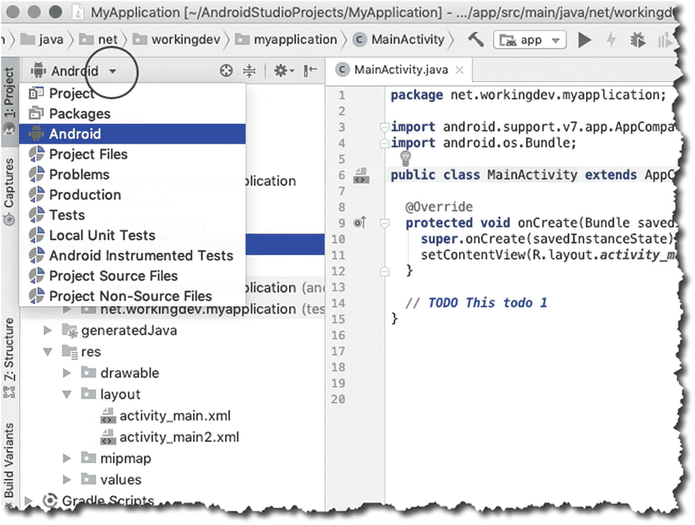

# 三、Android Studio

*   在 Android Studio 中处理文件

*   主编辑器的各个部分

*   编辑布局文件

*   项目工具窗口

<section class="Section1 RenderAsSection1" id="Sec1">

## IDE

From the opening dialog of Android Studio, you can launch the previous project we created. Links to existing projects appear on the left panel of the opening dialog, as shown in Figure [3-1](#Fig1).

<figure class="Figure" id="Fig1">

<figcaption class="Caption" lang="en">Figure 3-1

欢迎来到安卓  工作室

</figcaption>

</figure>

When you open a project, you’ll see the main editor window, the project panel, and other panels that Android Studio opens by default. An annotated picture of an opened project is shown in Figure [3-2](#Fig2).

<colgroup><col class="tcol1 align-left"> <col class="tcol2 align-left"></colgroup> 
| -什么 | **主菜单栏**—你可以通过多种方式导航 Android Studio。通常，完成一项任务有多种方法，但是主要的导航是在主菜单栏中完成的。如果你在 Linux 或 Windows 上，主菜单栏直接位于 IDE 的顶部；如果你在 macOS 上，主菜单栏与 IDE 断开连接(这是所有 macOS 软件的工作方式)。 |
| ➋ | **导航条**—该导航条允许您导航项目文件。这是一个水平排列的人字形集合，类似于一些网站上可以找到的面包屑导航。您可以通过导航栏或项目工具窗口打开您的项目文件。 |
| ➌ | **工具栏**—这让您可以执行各种操作(例如，保存文件、运行应用、打开 AVD 管理器、打开 SDK 管理器、撤销、重做操作等。). |
| -你好 | **主编辑器窗口**—这是最突出的窗口，拥有最多的屏幕空间。在编辑器窗口中，您可以创建和修改项目文件。它会根据您正在编辑的内容改变外观。如果您正在处理程序源文件，此窗口将只显示源文件。当您在编辑布局文件时，您可能会看到原始的 XML 文件或布局的可视化呈现。 |
| ➎ | **项目工具窗口**—该窗口显示项目文件夹的内容；您将能够看到并启动您的所有项目资产(源代码、XML 文件、图形等。)从这里。 |
| ➏ | **工具窗口条**—工具窗口条沿着 IDE 窗口的周边运行。它包含激活特定工具窗口所需的各个按钮，例如 TODO、Logcat、项目窗口、连接的设备等。 |
| -好的 | **显示/隐藏工具窗口**—显示(或隐藏)工具窗口条**。这是个开关。** |
| -好的 | **工具窗口**—你会在 Android Studio 工作区的侧面和底部找到工具窗口。它们是二级窗口，让你从不同的角度看项目。它们还允许您访问开发任务所需的典型工具，例如，调试、与版本控制的集成、查看构建日志、检查 Logcat 转储、查看 TODO 项目等等。以下是您可以使用工具窗口做的几件事:您可以通过单击工具窗口栏中的工具名称来展开或折叠它们。还可以拖动、固定、取消固定、附加和分离工具窗口。您可以重新排列工具窗口，但是如果您觉得需要将工具窗口恢复到默认布局，您可以从主菜单栏执行此操作。点击**窗口** ➤ **恢复默认布局**。另外，如果你想自定义“默认布局”，你可以根据自己的喜好重新排列窗口，然后在主菜单栏中点击**窗口** ➤ **将当前布局保存为默认布局**。T9】 |

<figure class="Figure" id="Fig2">

<figcaption class="Caption" lang="en">Figure 3-2

Android Studio 的主要部分

</figcaption>

</figure>

</section>

<section class="Section1 RenderAsSection1" id="Sec2">

## 主编辑

Like in most IDEs, the main editor window lets you modify and work with source files. What makes it stand out is how well it understands Android development assets. Android Studio lets you work with a variety of file types, but you’ll probably spend most of your time editing these types of files:

*   Java 源文件

*   XML 文件

*   用户界面布局文件

When you’re working with Java source files, you get all the code hinting and completions that you’ve come to expect from a modern editor. What’s more, it gives you plenty of early warnings when something is wrong with your code. Figure [3-3](#Fig3) shows a Java class file opened in the main editor. The class file is an Activity, and it’s missing a semicolon on one of its statements. You could see Android Studio peppering the IDE with (red) squiggly lines which indicates that the class won’t compile.

<figure class="Figure" id="Fig3">

<figcaption class="Caption" lang="en">Figure 3-3

显示错误指示器的主编辑器

</figcaption>

</figure>

Android Studio 将弯曲的线条放在非常靠近违规代码的地方。正如你在图 [3-3](#Fig3) 中所看到的，弯弯曲曲的线条被放置在分号应该出现的地方。

</section>

<section class="Section1 RenderAsSection1" id="Sec3">

## 编辑布局文件

The screens that the user sees are made up of Activity source files and layout files. The layout files are written in XML. Android Studio, undoubtedly, can edit XML files, but what sets it apart is how intuitively it can render the XML files in a WYSIWYG mode (what you see is what you get). Figure [3-4](#Fig4) shows the two ways you can work with layout files.

<figure class="Figure" id="Fig4">

<figcaption class="Caption" lang="en">Figure 3-4

设计模式和文本模式编辑布局文件

</figcaption>

</figure>

Figure [3-5](#Fig5) shows the various parts of Android Studio that are relevant when working on a layout file during design mode.

<figure class="Figure" id="Fig5">

<figcaption class="Caption" lang="en">Figure 3-5

Android Studio 的布局设计工具

</figcaption>

</figure>

*   **视图面板**—视图面板包含视图(小部件)，您可以将其拖放到设计图面或蓝图面上。

*   设计表面(Design surface)—它就像是你的屏幕的真实预览。

*   **蓝图面**—类似于设计图面，但它只包含 UI 元素的轮廓。

*   **属性窗口**—您可以在这里更改 UI 元素(视图)的属性。当您使用属性窗口更改视图的属性时，该更改将自动反映在布局的 XML 文件中。同样，当您对 XML 文件进行更改时，这将自动反映在属性窗口中。

</section>

<section class="Section1 RenderAsSection1" id="Sec4">

## 插入待办事项

这可能看起来像是一个微不足道的特性，但是我希望有些人会发现这很有用——这就是我挤在这一节的原因。我们每个人都有一种方法来为我们正在开发的任何应用编写待办事项。写 TODO 项没有太多的麻烦；难的是巩固它们。

In Android Studio, you don’t have to create a separate file to keep track of your TODO list for the app. Whenever you create a comment followed by a “TODO” text, like this:// TODO This is a sample todoAndroid Studio will keep track of all the TODO comments in all of your source files. See Figure [3-6](#Fig6).

<figure class="Figure" id="Fig6">

<figcaption class="Caption" lang="en">Figure 3-6

所有项目

</figcaption>

</figure>

要查看所有待办事项，请单击工具窗口栏中的“待办事项”选项卡。

</section>

<section class="Section1 RenderAsSection1" id="Sec5">

## 如何为代码获得更多的屏幕空间

You can have more screen real estate by closing all Tool Windows. Figure [3-7](#Fig7) shows a Java source file opened in the main editor window while all the Tool Windows are closed. You can collapse any tool window by simply clicking its name, for example, to collapse the Project tool window, click “Project.”

<figure class="Figure" id="Fig7">

<figcaption class="Caption" lang="en">Figure 3-7

所有工具窗口关闭的主编辑器

</figcaption>

</figure>

You can even get more screen real estate by hiding all the tool window bars, as shown in Figure [3-8](#Fig8).

<figure class="Figure" id="Fig8">

<figcaption class="Caption" lang="en">Figure 3-8

关闭所有工具窗口并隐藏工具栏的主编辑器

</figcaption>

</figure>

You can get even more screen space by entering “Distraction Free Mode,” as shown in Figure [3-9](#Fig9). You can enter distraction free mode from the main menu bar; click **View** ➤ **Enter Distraction Free Mode**. To exit the mode, click **View** from the main menu bar, then **Exit Distraction Free Mode**.

<figure class="Figure" id="Fig9">

<figcaption class="Caption" lang="en">Figure 3-9

无分心模式

</figcaption>

</figure>

You may also try two other modes that can increase the screen real estate. They’re also found on the View menu from the main menu bar.

*   呈现方式

*   全屏幕

项目工具窗口

You can get to your project’s files and assets via the **Project tool** window, shown in Figure [3-10](#Fig10). It has a tree-like structure, and the sections are collapsible. You can launch any file from this window. If you want to open a file, you simply need to double-click that file from this window.

<figure class="Figure" id="Fig10">

<figcaption class="Caption" lang="en">Figure 3-10

项目工具窗口

</figcaption>

</figure>

By default, Android Studio displays the **Project Files** in *Android View*, as shown in Figure [3-10](#Fig10). The “Android View” is organized by modules to provide quick access to the project’s most relevant files. You change how you view the project files by clicking the down arrow on top of the Project window, as shown in Figure [3-11](#Fig11).

<figure class="Figure" id="Fig11">

<figcaption class="Caption" lang="en">Figure 3-11

如何在项目工具窗口中改变视图

</figcaption>

</figure>

<figure class="Figure" id="Fig12">

<figcaption class="Caption" lang="en">Figure 3-12

设置/首选项窗口

</figcaption>

</figure>

</section>

<section class="Section1 RenderAsSection1" id="Sec6">

## 首选项/设置

如果你想自定义 Android Studio 的行为或外观，可以在它的设置或首选项窗口中进行；如果你在 Windows 或 Linux 上，它被称为**设置**，如果你在 macOS 上，它被称为**偏好设置**。

For Windows and Linux users, you can get to the Settings window in one of two ways:

*   从主菜单栏中点击**文件** ➤ **设置**。

*   使用键盘快捷键**Ctrl**+**Alt**+**S**。

For macOS users, you can do it this way:

*   从主菜单栏中，点击 **Android Studio** ➤ **首选项**。

*   使用键盘快捷键**命令** + **，**。

您可以在该窗口中访问各种设置，包括 Android Studio 的外观、在编辑器上使用空格还是制表符、制表符使用多少空格、使用哪个版本控制、下载什么 API、AVD 使用什么系统映像等等。

</section>

<section class="Section1 RenderAsSection1" id="Sec7">

## 关键要点

*   通过增加主编辑器的屏幕空间，你可以看到更多的代码。你可以通过

    *   来做到这一点折叠所有工具窗口

    *   T8】隐藏工具窗口栏
    *   进入无干扰模式

    *   进入全屏模式

*   您可以通过在**项目工具窗口**中切换视图来更改查看项目文件的方式。

*   在 Android Studio 中添加 TODO 项目很容易；只需添加一行注释，后跟一个待办事项文本，如下所示:// TODO 这是我的待办事项列表

</section>