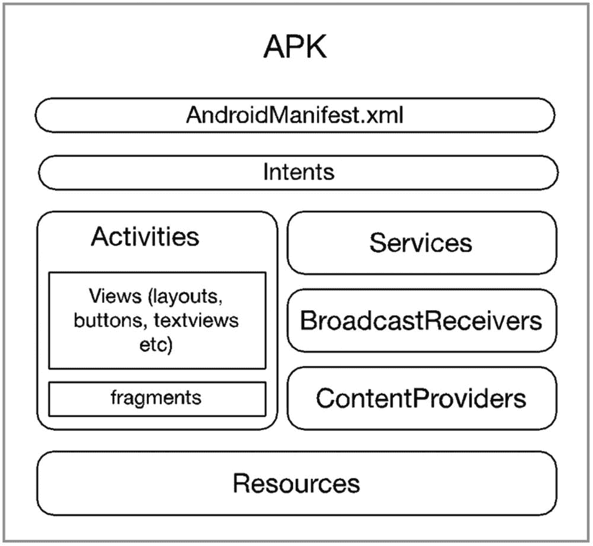
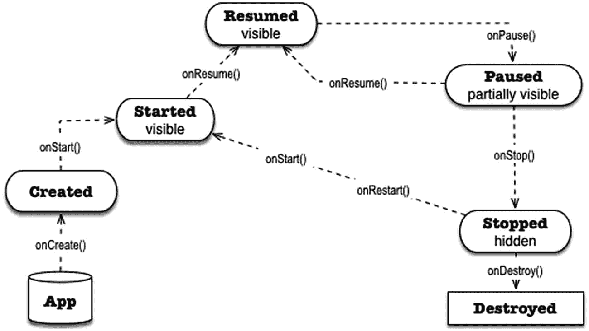

# 四、Android 应用中有什么

我们已经知道如何创建一个基本的项目，我们参观了 Android Studio。在这一章，我们将看看 Android 应用是由什么组成的。

The Android application framework is vast and can be confusing to navigate. Its architecture is different than a desktop or web app, if you’re coming from that background. Learning the Android framework can take a long time; fortunately, we don’t have to learn all of it. We only need a few, and that’s what this chapter is about, those few knowledge areas that we need to absorb so we can build an Android game:

*   Android 项目是由什么组成的

*   Android 组件概述

*   Android 清单文件

*   意图

<section class="Section1 RenderAsSection1" id="Sec1">

## Android 项目是由什么组成的

An Android app may look a lot like a desktop app; some may even think of them as miniature desktop apps, but that wouldn’t be correct. Android apps are structurally different from their desktop or web counterparts. A desktop app generally contains all the routines and subroutines it needs in order to function; occasionally, it may rely on dynamically loaded libraries, but the executable file is self-contained. An Android app, on the other hand, is made up of loosely coupled components that communicate to each other using a message-passing mechanism. Figure [4-1](#Fig1) shows the logical structure of an Android app.

<figure class="Figure" id="Fig1">

<figcaption class="Caption" lang="en">Figure 4-1

Android 应用的逻辑表示

</figcaption>

</figure>

图 [4-1](#Fig1) 中显示的应用是一个大应用——它拥有一切。我们的 app 不会那么大；我们不需要在 Android 中使用所有种类的组件，但是我们需要学习如何使用其中的一些，比如活动和意图。

活动、服务、广播接收者和内容提供者被称为 *Android 组件*。它们是应用的关键组成部分。它们是对有用事物的高级抽象，如向用户显示屏幕、在后台运行任务、广播事件以便感兴趣的应用可以响应它们，等等。组件是具有非常特定行为的预编码或预构建的类，我们通过扩展它们在应用中使用它们，以便我们可以添加我们的应用特有的行为。

构建一个 Android 应用很像建造一座房子。有些人用传统方式建造房屋；他们组装横梁、支柱、地板等等。他们像工匠一样，用原材料手工制作门和其他配件。如果我们以这种方式构建 android 应用，可能会花费我们很长时间，而且可能会相当困难。对于一些程序员来说，从头构建应用所需的技能可能遥不可及。在 Android 中，应用是使用组件构建的。把它想象成房子的预制构件。零件是预先制造好的，只需要组装就可以了。

一个**活动**是我们把用户可以看到的东西放在一起的地方。这是一个用户可以专注做的事情。例如，一个活动可以被有目的地使用户能够查看单个电子邮件或填写表单。它是用户界面元素粘合在一起的地方。如图 [4-1](#Fig1) 所示，在活动内部，有*视图*和*片段*。视图是用于将内容绘制到屏幕中的类；视图对象的一些例子有*按钮*和*文本视图*。片段类似于活动，因为它也是一个组合单元，但是更小。像活动一样，它们也可以持有视图对象。大多数现代应用使用片段来解决在多种外形上部署应用的问题。片段可以根据可用的屏幕空间和/或方向打开或关闭。

**服务** 是允许我们运行程序逻辑而不冻结用户界面的类。服务是在后台运行的代码；当你的应用需要从网上下载文件或者播放音乐时，它们会非常有用。

**BroadcastReceivers** 允许我们的应用监听来自 Android 系统或其他应用的特定消息——是的，我们的应用可以发送消息并在系统范围内广播。例如，如果你想在电池电量下降到 10%以下时显示警告信息，你可能想使用广播接收器。

ContentProviders 允许我们创建能够与其他应用共享数据的应用。它管理对某种中央数据存储库的访问。一些内容供应器有自己的用户界面，但一些没有。使用这个组件的主要目的是让其他应用能够访问你的应用的数据，而不需要通过一些 SQL 技巧。数据库访问的细节对他们是完全隐藏的(客户端应用)。Android 中的“ContentProvider”应用就是一个预构建应用的例子。

您的应用可能需要一些视觉或听觉资产；这些就是我们在图 [4-1](#Fig1) 中所说的“资源”的种类。

The AndroidManifest is exactly what its name implies; it’s a manifest and it’s in XML format. It declares quite a few things about the application, like

*   应用的名称。

*   当用户启动应用时，哪个活动将首先显示。

*   app 里有什么样的组件。如果它有活动，清单会声明它们——类名和所有的名称。如果应用有服务，它们的类名也将在 manifest 中声明。

*   这个应用可以做哪些事情？它的权限是什么？允许上网还是相机？它能记录 GPS 位置之类的吗？

*   它使用外部库吗？

*   它支持特定类型的输入设备吗？

*   这种应用需要特定的屏幕密度吗？

正如你所看到的，清单是一个繁忙的地方；有很多事情需要关注。不过这个文件不用太担心。这里的大部分条目都是由 Android Studio 的创建向导自动处理的。为数不多的几个与它交互的场合之一可能是当你需要给你的应用添加权限的时候。

Note

Google Play 从特定设备的可用应用列表中过滤掉不兼容的应用。它使用项目的清单文件来进行过滤。无法满足清单文件中规定的要求的设备将看不到你的应用。

</section>

<section class="Section1 RenderAsSection1" id="Sec2">

## 应用入口点

An app typically interacts with a user, and it does so using Activity components. These apps usually have at least these three things:

1.  1\.

    As the activity class of the first screen that users will see

2.  2\.

    The layout file of activity class contains all UI definitions, such as text views and buttons

3.  3\.

    Android Manifest file, which links all project resources and components together

When an application is launched, the Android runtime creates an Intent object and inspects the manifest file. It’s looking for a specific value of the intent-filter node (in the xml file). The runtime is trying to see if the application has a defined entry point, something like a *main function*. Listing [4-1](#PC1) shows an excerpt from the Android manifest file.<activity android:name=".MainActivity"><intent-filter><action android:name="android.intent.action.MAIN" />​ <category android:name="android.intent.category.LAUNCHER" /></intent-filter></activity>Listing 4-1

AndroidManifest.xml 摘录

如果应用有多个活动，您将在清单文件中看到几个活动节点，每个活动一个节点。定义的第一行有一个名为 android:name 的属性。该属性指向活动的类名。在这个例子中，类的名称是“MainActivity”。

第二行声明了*意图过滤器*；当你在 intent-filter 节点上看到类似于 Android . intent . action . main 的东西时，这意味着该活动是应用的入口点。当应用启动时，这是将与用户交互的活动。

</section>

<section class="Section1 RenderAsSection1" id="Sec3">

## 活动

你可以把一个活动想象成一个屏幕或者一个窗口。这是用户可以与之互动的东西。这是 app 的 UI。Activity 是一个从 *android.app.Activity* 继承而来的类(以某种方式)，但我们通常会扩展 *AppCompatActivity* 类(而不是 Activity ),这样我们可以使用现代的 UI 元素，但仍然可以让应用在旧版本的 android 上运行；因此，AppCompatActivity 名称中的“Compat”代表“兼容性”

Activity 组件有两个部分，一个 Java 类(或者 Kotlin，如果您选择的是 kot Lin 语言)和一个 XML 格式的布局文件。布局文件是放置所有 UI 定义的地方，例如，文本框、按钮、标签等等。Java 类是您编写 UI 的所有行为部分的地方，例如，当按钮被单击时，当文本被输入到字段中时，当用户改变设备的方向时，当另一个组件向活动发送消息时，等等。

An Activity, like any other component in Android, has a life cycle. Each lifecycle event has an associated method in the Activity’s Java class; we can use these methods to customize the behavior of the application. Figure [4-2](#Fig2) shows the Activity life cycle.

<figure class="Figure" id="Fig2">

<figcaption class="Caption" lang="en">Figure 4-2

活动生命周期

</figcaption>

</figure>

在图 [4-2](#Fig2) 中，方框显示了活动在特定存在阶段的状态。方法调用的名称嵌入在连接阶段的方向箭头中。

当运行时启动应用时，它调用主活动的 onCreate() 方法，将活动的状态变为“已创建”您可以使用此方法执行初始化例程，如准备事件处理代码等。

活动进行到下一个状态“开始”；此时，用户可以看到活动，但是还不能进行交互。下一个状态是“恢复”；这是应用与用户交互的状态。

如果用户单击任何可能启动另一个活动的东西，运行时将暂停当前活动，并进入“暂停”状态。从那里，如果用户返回到活动，调用 onResume() 函数，活动*再次运行*。另一方面，如果用户决定打开一个不同的应用，Android 运行时可能会“停止”并最终“破坏”该应用。

</section>

<section class="Section1 RenderAsSection1" id="Sec4">

## 意图

If you have an experience with object-oriented programming, you might be used to the idiom of activating an object’s behavior by simply creating an instance of the object and calling its methods—that’s a straightforward and simple way of making objects communicate to each other; unfortunately, Android’s components don’t follow that idiom. The code shown in Listing [4-2](#PC2), while idiomatically object oriented, isn’t going to work in Android.public class MainActivity extends AppCompatActivity {@Overrideprotected void onCreate(Bundle savedInstanceState) {super.onCreate(savedInstanceState);setContentView(R.layout.*activity_main*);Button b = (Button) findViewById(R.id.*button*);b.setOnClickListener(new View.OnClickListener() {@Overridepublic void onClick(View v) {**new SecondActivity(); //** **WON****'T** **WORK**}});}}Listing 4-2

激活另一个活动的方式错误

Android 的架构在构建应用的方式上非常独特。它有组件的概念，而不仅仅是简单的对象。Android 使用 *Intents* 作为其组件通信的方式；它还使用意图在组件之间传递消息。

列表 [4-2](#PC2) 不起作用的原因是因为 Android 活动不是一个简单的对象；它是一个组件。您不能为了激活一个组件而简单地实例化它。Android 中的组件激活是通过创建一个 Intent 对象，然后将其传递给想要激活的组件来完成的，在我们现在的例子中，这是一个活动。

There are two kinds of Intents, an explicit Intent and an implicit Intent. For our purposes, we will only need the explicit Intent. Listing [4-3](#PC3) shows a sample code on how to create an explicit Intent and how to use it to activate another Activity.public class MainActivity extends AppCompatActivity {@Overrideprotected void onCreate(Bundle savedInstanceState) {super.onCreate(savedInstanceState);setContentView(R.layout.*activity_main*);Button b = findViewById(R.id.*button*);b.setOnClickListener(new View.OnClickListener() {@Overridepublic void onClick(View v) {**Intent i = new Intent(v.getContext(), SecondActivity.class);****v.getContext().startActivity(i);**}});}}Listing 4-3

如何激活另一个活动

看起来我们的示例代码中有很多东西需要解开，但是不要担心，在接下来的章节中，我会用更多的上下文来解释代码。

</section>

<section class="Section1 RenderAsSection1" id="Sec5">

## 关键要点

*   Android 应用由松散耦合的组件组成。这些组件通过意图对象进行通信。

*   一个应用的入口点通常是一个启动器活动。这个启动器活动在应用的 AndroidManifest 文件中指定。

*   清单文件就像胶水一样将应用的组件粘在一起；应用拥有的、能做的或不能做的一切都反映在清单中。

</section>