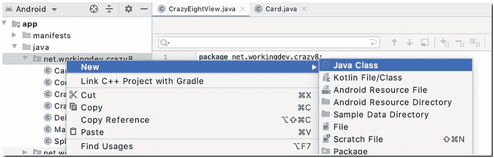

© Ted Hagos, Mario Zechner, J.F. DiMarzio and Robert Green 2020T. Hagos et al.Beginning Android Games Development[https://doi.org/10.1007/978-1-4842-6121-7_6](https://doi.org/10.1007/978-1-4842-6121-7_6)

# 6.构建疯狂的八分游戏

Ted Hagos[1](#Aff5) , Mario Zechner[2](#Aff6), J. F. DiMarzio[3](#Aff7) and Robert Green[4](#Aff8)(1)Makati, Philippines(2)Graz, Steiermark, Austria(3)Kissimmee, FL, USA(4)Portland, OR, USA

学习游戏编程的最好方法是开始编写一个。在这一章，我们将建立一个简单的纸牌游戏，疯狂八。疯狂八是一个受欢迎的游戏，无论是实际的纸牌游戏还是电子游戏。如果你在 Google Play 上搜索疯狂 8，会出现很多选择。

We’ll walk through the process of how to build a simple turn-based card game like Crazy Eights. The rules of this game are simple, and it doesn’t involve a lot of moving parts; that’s not to say it won’t be challenging to build. There are plenty of challenges ahead, especially if this is the first time you’ll build a game. In this chapter, we’ll discuss the following:

*   如何使用自定义视图

*   如何构建闪屏

*   绘制图形

*   处理屏幕方向

*   全屏显示

*   从图形绘制按钮

*   处理触摸事件

*   疯狂八分游戏的机制

*   疯狂八分游戏所需的所有逻辑

在这一章中，我将展示构建游戏所需的代码片段，以及程序在特定开发阶段的样子。理解和学习本章中的编程技术的最好方法是下载游戏的源代码，并在阅读本章的时候保持它在 Android Studio 中打开。如果您想继续学习并自己构建项目，最好将本章的源代码放在手边，这样您就可以根据需要复制和粘贴特定的代码片段。

<section class="Section1 RenderAsSection1" id="Sec1">

## 基本游戏

一副 52 张牌，两个最多五个玩家可以玩疯狂八；在我们的例子中，只有两个玩家——一个人类玩家和一个电脑玩家。当然，您可以构建这个游戏来容纳更多的玩家，但是将玩家限制为一个人类玩家会使编程简单很多。

七张牌分发给两个玩家，一次一张；剩余牌组的顶牌面朝上放置，开始弃牌堆。

这个游戏的目标是成为第一个扔掉手中牌的玩家。有相同花色或号码的牌可以打到中间。按照惯例，庄家左边的玩家先走，但是在我们的例子中，人类玩家将简单地开始。因此，人类玩家(我们)看我们的牌，如果我们有一张牌与花色或弃牌堆中顶牌的号码匹配，我们就可以出那张牌。如果我们不能出任何一张牌，我们将从剩余的一副牌中抽取(最多三张牌)；如果我们仍然不能玩，我们通过。如果我们抽到了一张可以用的牌，那就用这张牌。8(任何花色)都是百搭牌，可以在任何牌上使用。一个 8 的玩家将陈述或选择一个花色，下一个玩家必须在所选的花色中出一张牌。当其中一名玩家能将最后一张牌打到中间时，这一轮就结束了。如果没有玩家可以玩一手牌，这一轮也可以结束。

分数的计算方法是，在一轮结束时，奖励玩家手中剩余牌的点数；例如，如果计算机在这一轮赢了我们，我们剩下红心 9 和黑桃 3，我们的得分将是 12。

当其中一名玩家达到 100 分或更多时，游戏结束。得分最低的玩家获胜。

</section>

<section class="Section1 RenderAsSection1" id="Sec2">

## 计划的关键部分

To build the game, the key things to figure out are the following:

*   **如何抽卡** —Android 没有内置可以显示卡片的视图对象；我们得自己画。

*   **如何处理事件**—在程序的某些部分，我们可以使用 Android 的传统事件处理，我们只需将一个侦听器附加到视图对象，但也有一些部分，我们需要判断用户操作是否落在我们绘制按钮的区域。

*   让游戏全屏。

还有其他技术挑战，但是前面的列表是一个很好的起点。

准确地说，我们将主要用两个活动和两个视图，两个自定义视图来构建游戏应用程序。为了说明个别卡，卡牌组，和弃牌堆，我们需要做 2D 图纸。Android SDK 没有现成的视图对象来满足我们的需求。这不像我们可以从调色板中拖放一个卡对象，然后从那里开始；因此，我们必须构建自己的自定义视图对象。 **android.view.View** 是绘图和处理输入的基础类；我们将使用这个类来绘制卡片、甲板和游戏所需的其他东西，比如记分牌。我们可以使用 SurfaceView 类作为我们的 2D 绘图的基类，由于性能优势(它与 SurfaceView 处理线程的方式有关)，这将是一个更好的选择，但是 SurfaceView 需要更多的编程工作。因此，让我们使用更简单的视图对象。我们的游戏反正不需要在动画上发疯。我们应该对自己的选择满意。

</section>

<section class="Section1 RenderAsSection1" id="Sec3">

## 自定义视图和活动

在我们过去的项目中，您可能还记得 Activity 组件用于显示 UI，它有两个部分——代码隐藏的 Java 程序和 XML 文件，在 XML 文件中，UI 被构造为 XML 中定义的视图对象的嵌套排列。这对于应用程序来说没问题，但是我们需要从图像文件中渲染自定义绘图，所以这种技术行不通。我们要做的是创建一个自定义视图对象，我们将在其中绘制我们需要的所有内容，然后我们将活动的内容视图设置为该自定义视图。我们可以通过创建一个扩展 **android.view.View** 的 Java 类来创建自定义视图。

Assuming you’ve already created a project with an empty Activity, like how we did it in the previous chapters, you can add a class to your project by using the context menu in the Project tool window. Right-click the package name, then click New ➤ Java, as shown in Figure [6-1](#Fig1).

<figure class="Figure" id="Fig1">

<figcaption class="Caption" lang="en">Figure 6-1

向项目中添加一个类

</figcaption>

</figure>

Type the name of the class, then hit ENTER. I named the class SplashScreen, and its contents are shown in Listing [6-1](#PC1).import android.content.Context;import android.view.View;public class SplashScreen extends View {public SplashScreen(Context context) {super(context);}}Listing 6-1

SplashScreen.java

This is the starting point on how to create a custom View object. We can associate this View to our MainActivity by setting the MainActivity’s View to SplashScreen, as shown in Listing [6-2](#PC2).import androidx.appcompat.app.AppCompatActivity;import android.os.Bundle;public class MainActivity extends AppCompatActivity {@Overrideprotected void onCreate(Bundle savedInstanceState) {super.onCreate(savedInstanceState);SplashScreen splash = new SplashScreen(this);setContentView(splash);}}Listing 6-2

主要活动

</section>

<section class="Section1 RenderAsSection1" id="Sec4">

## 在屏幕上画画

To draw on the screen, we can override the onDraw() method  of the View object. Let’s modify the SplashScreen class to draw a simple circle on the screen. The code is shown in Listing [6-3](#PC3).import android.content.Context;import android.graphics.Canvas;import android.graphics.Paint;import android.view.View;import android.graphics.Color;public class SplashScreen extends View {private Paint paint;private int cx;private int cy;private float radius;public SplashScreen(Context context) {super(context);paint = new Paint(); ❶paint.setColor(Color.GREEN);paint.setAntiAlias(true);cx = 200; cy = 200; radius = 50; ❷❸❹}@Overrideprotected void onDraw(Canvas canvas) { ❺super.onDraw(canvas);canvas.drawCircle(cx,cy,radius,paint); ❻}}Listing 6-3

在屏幕上画画

<colgroup><col class="tcol1 align-left"> <col class="tcol2 align-left"></colgroup> 
| -好的 | Paint 对象决定了圆形在画布上的外观。 |
| 我的心脏 | cx，cy，和半径变量保存我们将要画圆的大小和位置。 |
| (一) | 当 Android 运行时调用 **onDraw** 方法时，一个画布对象被传递给该方法，我们可以用它在屏幕上绘制一些东西。 |
| ❻ | **drawCircle** 是 Canvas 对象可用的绘图方法之一。 |

这里重要的一点是要记住，如果你想在屏幕上画东西，你需要在视图对象的 onDraw() 方法上完成。onDraw()的参数是一个画布对象，视图可以用它来绘制自己。画布定义了画线、位图、圆(如我们这里的例子)和许多其他图形元素的方法。覆盖 onDraw()是创建自定义用户界面的关键。

此时，您可以运行该示例。我不会再截屏了，因为这只是一个不起眼的圈子。

</section>

<section class="Section1 RenderAsSection1" id="Sec5">

## 处理事件

The touchscreen is the most common type of input for game apps, so that’s what we’ll use. To handle touch events, we will override the onTouchEvent() callback of our SplashScreen class. Listing [6-4](#PC4) shows the basic structure and a typical code for handling touch events. You can put the onTouchEvent() callback  anywhere inside the SplashScreen program.public boolean onTouchEvent(MotionEvent evt) { ❶int action = evt.getAction(); ❷switch(action) { ❸case MotionEvent.ACTION_DOWN:Log.d(TAG, "Down"); ❹break;case MotionEvent.ACTION_UP:Log.d(TAG, "Up");break;case MotionEvent.ACTION_MOVE:Log.d(TAG, "Move");cx = (int) evt.getX(); ❺cy = (int) evt.getY(); ❻break;}invalidate(); ❼return true;}Listing 6-4

处理触摸事件

<colgroup><col class="tcol1 align-left"> <col class="tcol2 align-left"></colgroup> 
| -好的 | 当触摸、拖动或滑动屏幕时，Android 运行时调用 **onTouchEvent** 方法。 |
| ❷ | **evt.getAction()** 返回一个 int 值，告诉我们用户采取的动作，是向下滑动、向上滑动，还是只是触摸。在我们的例子中，我们只是观察任何移动。 |
| -你好 | 我们可以在动作上使用一个简单的开关结构来路由程序逻辑。 |
| (a) | 我们现在不需要处理 down 操作，但是我正在记录它。 |
| (一) | 这将获得触摸发生位置的 x 坐标。 |
| ❻ | 这得到了 y 坐标。我们正在更新我们的 **cx** 和 **cy** 变量(圆圈的位置)的值。 |
| ❼ | 这将导致 Android 运行时调用 **onDraw** 方法。 |

In Listing [6-4](#PC4), all we did was capture the location where the touch happened. Once we extracted the x and y coordinates of the touch, we assigned those coordinates to our **cx** and **cy** member variables, then we called **invalidate()**, which forced a redraw of the View class. Each time a redraw is forced, the runtime will call the onDraw() method, which then draws the circle (again), but this time using the updated location of **cx** and **cy** (variables that hold the location of our small circle drawing). Listing [6-5](#PC5) shows the completed code for SplashScreen.java.import android.content.Context;import android.graphics.Canvas;import android.graphics.Paint;import android.util.Log;import android.view.MotionEvent;import android.view.View;import android.graphics.Color;public class SplashScreen extends View {private Paint paint;private int cx;private int cy;private float radius;private String TAG = getContext().getClass().getName();public SplashScreen(Context context) {super(context);paint = new Paint();paint.setColor(Color.*GREEN*);paint.setAntiAlias(true);cx = 200;cy = 200;radius = 50;}@Overrideprotected void onDraw(Canvas canvas) {super.onDraw(canvas);cx = cx + 50;cy = cy + 25;canvas.drawCircle(cx,cy,radius,paint);}public boolean onTouchEvent(MotionEvent evt) {int action = evt.getAction();switch(action) {case MotionEvent.*ACTION_DOWN*:Log.*d*(TAG, "Down");break;case MotionEvent.*ACTION_UP*:Log.*d*(TAG, "Up");break;case MotionEvent.*ACTION_MOVE*:Log.*d*(TAG, "Move");cx = (int) evt.getX();cy = (int) evt.getY();break;}invalidate();return true;}}Listing 6-5

闪屏完成代码

如果你运行这段代码，它所做的就是在屏幕上画一个绿色的小圆圈，等待你触摸屏幕。每触摸一次屏幕，圆圈就会移动到触摸过的位置。

这不是我们游戏的一部分。这是某种练习代码，所以我们可以热身到实际的游戏代码。既然我们对如何在屏幕上绘制东西以及如何处理基本的触摸事件有了一些了解，让我们继续游戏代码。

</section>

<section class="Section1 RenderAsSection1" id="Sec6">

## 带有标题图形的闪屏

We don’t want to show just a small dot to the user when the game is launched; instead, we want to display some title graphic. Some games probably will show credits and some other info, but we’ll keep ours simple. We’ll display the title of the game using a simple bitmap. Before you can do this, you need to put the graphic file in the **app/res/drawable** folder of the project. A simple way to do that is to use the context menu; right-click the **app/res/drawable** ➤ **Reveal in Finder** (on macOS); if you’re on Windows, this will read **Show in Explorer**. The dialog window in macOS is shown in Figure [6-2](#Fig2).

<figure class="Figure" id="Fig2">

<figcaption class="Caption" lang="en">Figure 6-2

res ➤ drawable ➤揭示在寻找

</figcaption>

</figure>

当您启动文件管理器时，您可以将图形文件放在那里。drawable 文件夹是图形资源通常存储的地方。

To load the bitmapimport android.graphics.Bitmap;import android.graphics.BitmapFactory;import android.content.Context;import android.graphics.Canvas;import android.view.View;public class SplashScreen extends View {private Bitmap titleG;public SplashScreen(Context context) {super(context);titleG = BitmapFactory.decodeResource(getResources(),R.drawable.splash_graphic); ❶}protected void onDraw(Canvas canvas) {super.onDraw(canvas);canvas.drawBitmap(titleG, 100, 100, null); ❷}}Listing 6-6

加载位图

<colgroup><col class="tcol1 align-left"> <col class="tcol2 align-left"></colgroup> 
| -好的 | 使用 BitmapFactory 从 drawable 文件夹中解码图形资源。这将位图加载到内存中，稍后我们将使用它在屏幕上绘制图形。 |
| ❷ | Canvas 的 **drawBitmap** 方法将位图绘制到屏幕上。 |

Our splash screen is shown in Figure [6-3](#Fig3).

<figure class="Figure" id="Fig3">

<figcaption class="Caption" lang="en">Figure 6-3

启动画面

</figcaption>

</figure>

The screen doesn’t look bad, but it’s skewed to the left. That’s because we hardcoded the drawing coordinates for the bitmap. We’ll fix that in a little while; first, let’s take care of that application title and the other widgets on top of the screen. Let’s maximize the screen space for our game. Open *MainActivity.java* and make the changes shown in Listing [6-7](#PC7).public class MainActivity extends AppCompatActivity {private View splash;@Overrideprotected void onCreate(Bundle savedInstanceState) {super.onCreate(savedInstanceState);splash = new SplashScreen(this);splash.setKeepScreenOn(true);setContentView(splash);}private void setToFullScreen() { ❶splash.setSystemUiVisibility(View.SYSTEM_UI_FLAG_LOW_PROFILE| View.SYSTEM_UI_FLAG_FULLSCREEN| View.SYSTEM_UI_FLAG_LAYOUT_STABLE| View.SYSTEM_UI_FLAG_IMMERSIVE_STICKY| View.SYSTEM_UI_FLAG_LAYOUT_HIDE_NAVIGATION| View.SYSTEM_UI_FLAG_HIDE_NAVIGATION);}@Overrideprotected void onResume() {super.onResume();**setToFullScreen();** ❷}}Listing 6-7

全屏显示应用程序

<colgroup><col class="tcol1 align-left"> <col class="tcol2 align-left"></colgroup> 
| -好的 | 创建一个新的方法，我们可以把必要的代码，使应用程序全屏。 |
| ❷ | 在 **onResume** 回调上调用 **setFullScreen** 方法。onResume()在 UI 对用户可见之前被调用；所以，这是一个放置全屏代码的好地方。在应用程序的生命周期中，可能会多次调用这个生命周期方法。 |

视图对象的**setSystemUiVisibility**方法是向用户显示更加身临其境的屏幕体验的关键。您可以尝试系统 UI 标志的多种组合。你可以在这里的文档页面上阅读更多关于它们的信息:【https://bit.ly/androidfullscreen】。

Next, we take care of the orientation. We can choose to let users play the game either in portrait or landscape mode, but that means we need to write more code to handle the orientation change; we won’t do that here. Instead, we will fix our game in portrait mode. This can be done in the AndroidManifest file. You need to edit the manifest file to reflect the modifications shown in Listing [6-8](#PC8). To open the manifest file, double-click the file from the Project tool window, as shown in Figure [6-4](#Fig4).

<figure class="Figure" id="Fig4">

<figcaption class="Caption" lang="en">Figure 6-4

雄激素类化合物

</figcaption>

</figure>

<?xml version="1.0" encoding="utf-8"?><manifest xmlns:android="http://schemas.android.com/apk/res/android"package="net.workingdev.crazy8"><applicationandroid:allowBackup="true"android:icon="@mipmap/ic_launcher"android:label="@string/app_name"android:roundIcon="@mipmap/ic_launcher_round"android:supportsRtl="true"android:theme="@style/AppTheme"><activity android:name=".MainActivity"**android:screenOrientation="portrait"** ❶**android:configChanges="orientation|keyboardHidden"** ❷><intent-filter><action android:name="android.intent.action.MAIN" /><category android:name="android.intent.category.LAUNCHER" /></intent-filter></activity></application></manifest>Listing 6-8

文件

<colgroup><col class="tcol1 align-left"> <col class="tcol2 align-left"></colgroup> 
| -好的 | 这会将屏幕方向固定为纵向。 |
| ❷ | 当切换软件键盘时，这条线防止屏幕方向改变。 |

现在，我们已经确定了方向，全屏排序，我们可以将图形居中。

To center the title graphic, we need the actual width of the screen and the actual width of the title graphic. The width of the screen minus the width of the title graphic divided by two should give us the location where we can start drawing the title graphic such that it’s centered on the screen. Listing [6-9](#PC9) shows the changes we need to make in SplashScreen to make all these happen.public class SplashScreen extends View {private Bitmap titleG;private int scrW; private int scrH; ❶public SplashScreen(Context context) {super(context);titleG = BitmapFactory.decodeResource(getResources(),R.drawable.splash_graphic);}@Overridepublic void onSizeChanged (int w, int h, int oldw, int oldh){super.onSizeChanged(w, h, oldw, oldh);scrW = w; scrH = h; ❷}protected void onDraw(Canvas canvas) {super.onDraw(canvas);int titleGLeftPos = (scrW - titleG.getWidth())/2; ❸canvas.drawBitmap(titleG, titleGLeftPos, 100, null); ❹}}Listing 6-9

将标题图形居中

<colgroup><col class="tcol1 align-left"> <col class="tcol2 align-left"></colgroup> 
| -好的 | 让我们声明一些变量来保存屏幕的尺寸。 |
| ❷ | 一旦 Android 运行时能够计算出屏幕的实际尺寸，就会调用 **onSizeChanged()** 方法。我们可以从这里获取屏幕的实际宽度和高度，并将它们分配给我们的成员变量，这些变量将保存屏幕高度和屏幕宽度的值。 |
| -你好 | **title.getWidth()** 得到我们的标题图形的宽度，从屏幕宽度(在 onSizeChanged 期间获取的)中减去它，然后除以 2。这应该使图形居中。 |
| (a) | 现在我们可以画出适当居中的图形。 |

Figure [6-5](#Fig5) shows our app, as it currently stands.

<figure class="Figure" id="Fig5">

<figcaption class="Caption" lang="en">Figure 6-5

居中图形和全屏屏幕

</figcaption>

</figure>

</section>

<section class="Section1 RenderAsSection1" id="Sec7">

## 添加播放按钮

我们将在闪屏上添加一个按钮，这样用户就可以开始游戏了。我们将只添加一个“播放”按钮；我们不会添加“退出”按钮。我们可以添加一个退出按钮，但我们没有这样做，因为它不符合 Android 应用程序的惯例。毕竟，我们的游戏还是一个安卓应用。它需要像大多数 Android 应用程序一样运行，并且大多数 Android 应用程序没有退出按钮。一个应用程序通常会被启动、使用、暂停和终止，而 Android 操作系统已经有了终止应用程序的方法。

我们不能从面板中拖放按钮视图对象，因为我们正在使用自定义视图。我们必须像绘制标题图形一样绘制按钮。因此，在 SplashScreen 类中，添加按钮的声明语句，然后通过使用 SplashScreen 的构造函数中的 BitmapFactory 加载图像来初始化它。

我为按钮准备了两个图形；一个图形显示按钮未被按下时的常规外观，另一个图形显示按钮被按下时的图像。这只是给用户的一个小的视觉提示，这样当他们点击按钮时，就会发生一些事情。这也意味着我们需要处理按钮状态。绘制按钮的实际图像将发生在 onDraw() 方法中；我们需要一种方法来路由程序逻辑是绘制按钮的常规状态还是按下状态。

Another task we need to manage is detecting the button click. Our button isn’t the regular button; it’s a drawn bitmap on the screen. We cannot use **findViewbyId** then bind the reference to an event listener. Instead, we need to detect if a touch happens within the bounds of the drawn button and write the appropriate code. Listing [6-10](#PC10) shows the annotated code for loading, drawing, and managing the state of the Play button. The other code related to the display and centering of the title graphic has been removed, so only the code relevant for the button is displayed.import android.view.MotionEvent;public class SplashScreen extends View {private Bitmap playBtnUp; ❶private Bitmap playBtnDn;private boolean playBtnPressed; ❷public SplashScreen(Context context) {super(context);playBtnUp = BitmapFactory.decodeResource(getResources(), R.drawable.btn_up); ❸playBtnDn = BitmapFactory.decodeResource(getResources(), R.drawable.btn_down);}@Overridepublic void onSizeChanged (int w, int h, int oldw, int oldh){super.onSizeChanged(w, h, oldw, oldh);scrW = w;scrH = h;}public boolean onTouchEvent(MotionEvent event) {int evtAction = event.getAction();int X = (int)event.getX();int Y = (int)event.getY();switch (evtAction ) {case MotionEvent.ACTION_DOWN:int btnLeft = (scrW - playBtnUp.getWidth())/2; ❹int btnRight = btnLeft + playBtnUp.getWidth();int btnTop = (int) (scrH * 0.5);int btnBottom = btnTop + playBtnUp.getHeight();boolean withinBtnBounds = X > btnLeft && X < btnRight &&Y > btnTop &&Y < btnBottom; ❺if (withinBtnBounds) {playBtnPressed = true; ❻}break;case MotionEvent.ACTION_MOVE:break;case MotionEvent.ACTION_UP:if (playBtnPressed) {// Launch main game screen}playBtnPressed = false;break;}invalidate();return true;}protected void onDraw(Canvas canvas) {super.onDraw(canvas);int playBtnLeftPos = (scrW - playBtnUp.getWidth())/2;if (playBtnPressed) { ❼canvas.drawBitmap(playBtnDn, playBtnLeftPos, (int)(scrH *0.5), null);} else {canvas.drawBitmap(playBtnUp, playBtnLeftPos, (int)(scrH *0.5), null);}}}Listing 6-10

显示和管理播放按钮状态

<colgroup><col class="tcol1 align-left"> <col class="tcol2 align-left"></colgroup> 
| -好的 | 它定义变量来保存按钮图像的位图。 |
| ❷ | 我们将使用被压缩的布尔变量作为开关；如果这是假的，这意味着按钮没有被按下，我们将显示常规的按钮图形。如果为真，我们将显示处于按下状态的按钮图形。 |
| -你好 | 让我们从图形文件中加载按钮位图，就像我们对标题图形所做的那样。 |
| (a) | 变量 **btnLeft、btnTop、btnBottom** 和 **btnRight** 是按钮边界的屏幕坐标。 |
| (一) | 如果触摸动作的 X 和 Y 坐标在按钮边界内，该表达式将返回 **true** 。 |
| ❻ | 如果按钮在边界内，我们将 **btnPressed** 变量设置为 true。 |
| ❼ | 在 **onDraw** 期间，我们可以根据**Bt pressed**变量的值显示适当的按钮图形。 |

Figure [6-6](#Fig6) shows our app with the centered title graphic and Play button.

<figure class="Figure" id="Fig6">

<figcaption class="Caption" lang="en">Figure 6-6

带播放按钮的闪屏

</figcaption>

</figure>

The play button is centered vertically on the screen; if you want to adjust the vertical location of the button, you can change it in the **onDraw** method; it’s the third parameter of the drawBitmap method, as shown in the following snippet.canvas.drawBitmap(playBtnUp, playBtnLeftPos, (int)(scrH *0.5), null);

表达式(int)(scrrh * 0.5)的意思是得到检测到的屏幕高度的中点值；将屏幕高度乘以 50%得到中点。

</section>

<section class="Section1 RenderAsSection1" id="Sec8">

## 启动游戏屏幕

我们将启动游戏屏幕作为另一个活动，这意味着我们需要创建另一个活动和另一个视图类。

To add another Activity, right-click the package name in the Project tool window, then click **New** ➤ **Activity** ➤ **Empty Activity**, as shown in Figure [6-7](#Fig7).

<figure class="Figure" id="Fig7">

<figcaption class="Caption" lang="en">Figure 6-7

新空活动

</figcaption>

</figure>

Then, fill up the Activity name, as shown in Figure [6-8](#Fig8).

<figure class="Figure" id="Fig8">

<figcaption class="Caption" lang="en">Figure 6-8

配置活动

</figcaption>

</figure>

Next, add a new class to the project. You can do this by right-clicking the package name and choosing New ➤ Java Class, as shown in Figure [6-9](#Fig9).

<figure class="Figure" id="Fig9">

<figcaption class="Caption" lang="en">Figure 6-9

新的 Java 类

</figcaption>

</figure>

Name the class CrazyEightView, edit it, and make it extend the View class, just like our SplashScreen class. Listing [6-11](#PC12) shows the code for CrazyEightView.import android.content.Context;import android.graphics.Canvas;import android.view.View;public class CrazyEightView extends View {public CrazyEightView(Context context) {super(context);}protected void onDraw(Canvas canvas) {super.onDraw(canvas);}}Listing 6-11

crazy wiec . Java 版

Next, we fix the second Activity class (CrazyEight class) to occupy the whole screen, much like our MainActivity class. Listing [6-12](#PC13) shows the code for CrazyEightActivity.public class CrazyEight extends AppCompatActivity {private View gameView;@Overrideprotected void onCreate(Bundle savedInstanceState) {super.onCreate(savedInstanceState);gameView = new CrazyEightView(this); ❶gameView.setKeepScreenOn(true);setContentView(gameView); ❷}private void setToFullScreen() { ❸gameView.setSystemUiVisibility(View.SYSTEM_UI_FLAG_LOW_PROFILE| View.SYSTEM_UI_FLAG_FULLSCREEN| View.SYSTEM_UI_FLAG_LAYOUT_STABLE| View.SYSTEM_UI_FLAG_IMMERSIVE_STICKY| View.SYSTEM_UI_FLAG_LAYOUT_HIDE_NAVIGATION| View.SYSTEM_UI_FLAG_HIDE_NAVIGATION);}@Overrideprotected void onResume() {super.onResume();setToFullScreen(); ❹}}Listing 6-12

CrazyEightActivity

<colgroup><col class="tcol1 align-left"> <col class="tcol2 align-left"></colgroup> 
| -好的 | 创建 CrazyEightView 类的实例并传递当前上下文。 |
| ❷ | 将此活动的视图设置为我们的自定义视图(CrazyEightView)。 |
| -你好 | 下面是让整个视图占据整个屏幕的代码，和我们之前做的一样。 |
| (a) | 我们在 **onResume** 回调中调用 **setFullScreen** ,因为我们希望它正好在用户看到屏幕之前运行。 |

现在我们已经有了一个实际游戏将要进行的活动，我们可以在 SplashScreen 中放入代码来启动我们的第二个活动(CrazyEight)。

Android 使用 **Intent** 对象进行组件激活，发起一个活动需要组件激活。Intents 还有许多其他用途，但我们不会在这里介绍。我们只需输入必要的代码来启动我们的 CrazyEight 活动。

Go back to SplashScreen’s **onTouchEvent**, specifically the **MotionEvent.ACTION_UP** branch. In Listing [6-10](#PC10), find the code where we made the comment // Launch main game screen, as shown in the snippet in Listing [6-13](#PC14).case MotionEvent.ACTION_UP:if (playBtnPressed) {// Launch main game screen}playBtnPressed = false;break;Listing 6-13

代码片段 MotionEvent。ACTION_UP

We will replace that comment with the code that will actually launch the CrazyEight Activity, but first, we’ll need to add a member variable to SplashScreen that will hold the current Context object. Just add a variable to the SplashScreen class like this:private Context ctx;Then, in SplashScreen’s constructor, add this line:ctx = context;

我们需要一个对当前上下文的引用，因为我们需要将它作为参数传递给 Intent 对象。

Now, write the Intent code inside the ACTION_UP branch of SplashScreen’s onTouchEvent handler so that it reads like Listing [6-14](#PC17).case MotionEvent.ACTION_UP:if (playBtnPressed) {Intent gameIntent = new Intent(ctx, CrazyEight.class);ctx.startActivity(gameIntent);}playBtnPressed = false;break;Listing 6-14

意图发起疯狂活动

</section>

<section class="Section1 RenderAsSection1" id="Sec9">

## 开始游戏

游戏从洗牌开始，给我们的对手(计算机)和用户发七张牌。之后，我们将剩余牌组的顶牌面朝上，开始弃牌。

对于这些东西，我们需要一些东西来表示一张卡(我们将为此使用一个类)；我们需要表示人类玩家手里和计算机手里的牌的集合；我们还需要表示弃牌堆。

To represent a single card, let’s create a new class and add it to the project. Right-click the project’s package name in the Project tool window, as shown in Figure [6-10](#Fig10).

<figure class="Figure" id="Fig10">

<figcaption class="Caption" lang="en">Figure 6-10

添加新类别

</figcaption>

</figure>

Name the new class “Card” and modify the contents, as shown in Listing [6-15](#PC18).import android.graphics.Bitmap;public class Card {private int id;private int suit;private int rank;private Bitmap bmp;private int scoreValue;public Card(int newId) {id = newId;}public void setBitmap(Bitmap newBitmap) {bmp = newBitmap;}public Bitmap getBitmap() {return bmp;}public int getId() {return id;}}Listing 6-15

卡类

Our Card class is a basic POJO. It’s meant to represent a single card in the deck. The constructor takes an int parameter, which represents a unique id for the card. We’ve assigned an id to all the cards, from the deuce of Diamonds to the Ace of Spades. The four suits (Diamonds, Clubs, Hearts, and Spades) are given base values, as follows:

*   钻石(100)

*   俱乐部(200)

*   红心大战(300)

*   黑桃(400)

花色中的每张牌都有一个等级，即该牌的数值。最低等级是 2(平手)，最高等级是 14(王牌)。卡对象的 id 将被计算为套装的基础值加上卡的等级；因此，方块 2 是 102，梅花 3 是 203，以此类推。

你可以从各种地方获得你的卡片图像，比如[【www.shutterstock.com】](http://www.shutterstock.com)和[【www.acbl.mybigcommerce.com】](http://www.acbl.mybigcommerce.com)(美国契约桥牌联盟)，如果你愿意，甚至可以自己创建图像。无论你从哪里得到你的卡片图像文件，你必须根据我们如何分配基础值和等级来命名它们。所以，方块 2 是“牌 102”，方块 a 是“牌 114”，黑桃 a 是“牌 414”。

Card 类也有针对图像文件的 get()和 set()方法,这样我们就可以获取和设置特定卡片的位图图像。

Now that we have a POJO for the Card, we need to build a deck of 52 cards; to do this, let’s create a new method in the CrazyEightView class and call it **initializeDeck()**  ; the annotated code is shown in Listing [6-16](#PC19).private void initializeDeck() {for (int i = 0; i < 4; i++) { ❶for (int j = 102; j < 115; j++) { ❷int tempId = j + (i*100); ❸Card tempCard = new Card(tempId); ❹int resourceId = getResources().getIdentifier("card" + tempId, "drawable",ctx.getPackageName()); ❺Bitmap tempBitmap = BitmapFactory.decodeResource(ctx.getResources(),resourceId);scaledCW = (int) (scrW /8); ❻scaledCH = (int) (scaledCW *1.28);Bitmap scaledBitmap = Bitmap.createScaledBitmap(tempBitmap,scaledCW, scaledCH, false);tempCard.setBitmap(scaledBitmap);deck.add(tempCard); ❼}}}Listing 6-16

初始化甲板

<colgroup><col class="tcol1 align-left"> <col class="tcol2 align-left"></colgroup> 
| -好的 | 我们循环看花色(方块、梅花、红心和黑桃)。 |
| ❷ | 然后，我们遍历当前套装中的每个等级。 |
| -你好 | 让我们得到一个唯一的身份。这个 id 现在将是 j 的当前值**+I 的当前值**乘以 100。由于我们将我们的卡片图像命名为 card102.png 的**直到 card413.png 的**，我们应该能够使用 j + (i * 100) 表达式遍历所有的图像文件。******** |
| (a) | 我们创建一个 Card 对象的实例，将一个惟一的 id 作为参数传入。这个唯一的 id 与我们对卡片图像文件的命名约定一致。 |
| (一) | 让我们基于 **tempId** 为图像创建一个资源 id。 |
| ❻ | 我们将卡片的宽度缩放到屏幕宽度的 1/8，这样我们可以水平放置七张卡片。变量 **scaledCW** 和 **scaledCH** 应该被声明为卡类中的成员变量。 |
| ❼ | 现在，我们将 Card 对象添加到 **dec** 对象中，这是一个应该声明为成员变量的 ArrayList 对象。可以这样为卡牌添加一个声明:List<Card>deck = new ArrayList<Card>()； |

现在我们有了一副牌，我们需要想办法把牌发给玩家。我们需要代表人类玩家的手和电脑玩家的手。因为我们已经使用了数组列表来表示卡片组，所以让我们也使用数组列表来表示双手(人类玩家和计算机)。我们还将使用一个数组列表来表示丢弃堆。

Add the following member variable declarations to the CrazyEightView class:private List<Card> playerHand = new ArrayList<>();private List<Card> computerHand = new ArrayList<>();private List<Card> discardPile = new ArrayList<>();Now let’s add the method to deal the cards to the human player and the computer player; Listing [6-17](#PC21) shows the code for the method **dealCards()**  .private void dealCards() {Collections.shuffle(deck,new Random());for (int i = 0; i < 7; i++) {drawCard(playerHand);drawCard(computerHand);}}Listing 6-17

将牌发给双方玩家

该方法中的第一条语句是一个 Java 实用函数，用于随机化列表中元素的顺序；这应该满足我们洗牌的要求。

The for-loop comes around seven times (we want to give each hand seven cards), and inside the loop, we call the **drawCard()** method twice, once for each of the players; the code for this method is shown in Listing [6-18](#PC22).private void drawCard(List<Card> hand) { ❶hand.add(0, deck.get(0)); ❷deck.remove(0); ❸if (deck.isEmpty()) { ❹for (int i = discardPile.size()-1; i > 0 ; i--) {deck.add(discardPile.get(i));discardPile.remove(i);Collections.shuffle(deck,new Random());}}}Listing 6-18

drawCard()方法

<colgroup><col class="tcol1 align-left"> <col class="tcol2 align-left"></colgroup> 
| -好的 | 人类玩家和计算机都会调用 **drawCard()** 方法。为了调用该方法，我们传递一个列表对象作为参数；这个论点代表了我们应该把牌发给哪一手。 |
| ❷ | 我们在**牌组**的顶部拿到卡片，并将其添加到**手**对象中。 |
| -你好 | 接下来，拿到卡顶的卡并不会自动移除；所以，我们把它从甲板上拿走。当一张牌发给一个玩家时，它应该被从牌堆中取出。 |
| (a) | 当这副牌是空的，我们从弃牌堆里拿回牌，然后重新洗牌。 |

初始化牌组和发牌的方法应该放在 **onSizeChanged()** 方法中。一旦运行时计算出屏幕尺寸，就调用此方法，如果由于某种原因，屏幕尺寸发生变化，随后可能会调用此方法。屏幕的方向总是从纵向开始，由于我们对清单文件进行了修改，使方向总是保持纵向，因此很有可能只调用一次 **onSizeChanged()** 方法(至少在应用程序的生命周期内)。因此，这似乎是放置游戏初始化方法的好地方，比如 **initializeDeck()** 和 **drawCard()** 。

</section>

<section class="Section1 RenderAsSection1" id="Sec10">

## 展示卡片

Our next tasks are to display the cards in the game, namely:

*   我们手中的牌

*   电脑的手

*   废弃堆

*   面朝上的卡片

*   分数

Figure [6-11](#Fig11) shows the layout of cards in the game.

<figure class="Figure" id="Fig11">

<figcaption class="Caption" lang="en">Figure 6-11

游戏应该是什么样子

</figcaption>

</figure>

电脑的手朝下；我们不应该看到他们；所以，我们需要做的就是抽出卡片的背面。我们可以通过迭代计算机的手来做到这一点，对于列表中的每一项，我们绘制卡片的背面。我们在卡片的背面有一个图形文件。我们将简单地用绘制其他图形的方法来绘制它。

Before we do any further drawing, we’ll need to establish some scale and get the density of the device’s screen. We can do that with the following code:scale = ctx.getResources().getDisplayMetrics().density;We’ll put that in the constructor of the CrazyEightView class. We need to define the scale as a member variable as well. So, somewhere in the top level of the class, define the scale as a variable, like this:private float scale;

我们将使用**比例**变量作为我们绘图的比例因子；这样，如果移动设备的密度发生变化，我们的显卡仍将保持比例。

Now we can draw the computer’s hand. Listing [6-19](#PC25) shows that code.public void onSizeChanged (int w, int h, int oldw, int oldh){// other statementsscaledCW = (int) (scrW /8); ❶scaledCH = (int) (scaledCW *1.28); ❷Bitmap tempBitmap = BitmapFactory.decodeResource(ctx.getResources(),R.drawable.card_back); ❸cardBack = Bitmap.createScaledBitmap(tempBitmap, ❹scaledCW, scaledCH, false);}protected void onDraw(Canvas canvas) {for (int i = 0; i < computerHand.size(); i++) {canvas.drawBitmap(cardBack, ❺i*(scale*5),paint.getTextSize()+(50*scale),null);}}Listing 6-19

画出电脑的手

<colgroup><col class="tcol1 align-left"> <col class="tcol2 align-left"></colgroup> 
| -好的 | 我们不会使用卡图形的实际大小；我们希望按照屏幕密度的比例来绘制它们。变量 **scaledCW** 和 **scaledCH** (缩放后的卡片高度和宽度)将用于绘制缩放后的位图。这些被定义为成员变量，因为我们需要在 **onSizeChanged()** 方法之外访问它们。 |
| ❷ | 我们希望缩放后的高度比缩放后的卡片宽度长 1.28 倍。 |
| -你好 | 像我们以前加载位图一样加载位图。 |
| (a) | 现在我们从已经加载的 tempBitmap 创建一个缩放位图。 |
| (一) | 我们正在绘制计算机手中的所有卡片，一次一个图形，并且相隔 5 个像素(水平方向)，以便它们重叠；我们还从屏幕顶部绘制了卡片的 50 个缩放因子，加上 Paint 对象的默认文本大小。 |

In bullet number ❺, we referred to a Paint object. This variable is defined as a member variable, so if you’re following, you need to add this variable right now, like this:private Paint paint;Then, somewhere in the constructor, add this statement:paint = new Paint();

那应该已经让我们赶上了。我们不仅使用 Paint 对象来确定默认文本的大小，而且还使用它(稍后)将一些文本写到屏幕上。

Next, we draw the human player’s hand. Listing [6-20](#PC28) shows the annotated code.protected void onDraw(Canvas canvas) {// other statementsfor (int i = 0; i < playerHand.size(); i++) { ❶canvas.drawBitmap(playerHand.get(i).getBitmap(), ❷i*(scaledCW +5),scrH - scaledCH - paint.getTextSize()-(50*scale),null);}}Listing 6-20

画人类玩家的手

<colgroup><col class="tcol1 align-left"> <col class="tcol2 align-left"></colgroup> 
| -好的 | 我们遍历手中所有的牌。 |
| ❷ | 然后，我们使用缩放后的卡片高度和宽度变量来绘制位图。这些卡片相隔 5 个像素绘制，其 **Y** 位置减去(1)卡片的高度，(2)文本高度(我们稍后将使用它来绘制分数)，以及(3)屏幕底部的 50 个缩放像素。T3】 |

Next, we show the draw pile; add the code in Listing [6-21](#PC29) to the onDraw method so we can show the draw pile.protected void onDraw(Canvas canvas) {// other statementsfloat cbackLeft = (scrW/2) - cardBack.getWidth() - 10;float cbackTop = (scrH/2) - (cardBack.getHeight() / 2);canvas.drawBitmap(cardBack, cbackLeft, cbackTop, null);}Listing 6-21

抽屉堆

抽牌堆由卡片图形的单个背面表示。它大约画在屏幕的中央。

Next, we draw the discard pile. Remember that the discard pile is started as by getting the top card of what remains in the deck after the cards have been dealt with the players; so, before we draw them, we need to check if it’s empty or not. Listing [6-22](#PC30) shows the code for showing the discard pile.if (!discardPile.isEmpty()) {canvas.drawBitmap(discardPile.get(0).getBitmap(),(scrW /2)+10,(scrH /2)-(cardBack.getHeight()/2),null);}Listing 6-22

废弃堆

</section>

<section class="Section1 RenderAsSection1" id="Sec11">

## 处理转弯

Crazy Eights is a turn-based game. We need to route the program logic based on whose turn it is, whether it’s the computer or the human player. We can facilitate this by adding a boolean variable as a member of the CrazyEightView class, like this:private boolean myTurn;Throughout our code, we will enable or disable certain logic based on whose turn it is. In the onSizeChanged method, we add the following code:**myTurn** = **new** Random().nextBoolean();**if** (!**myTurn**) {computerPlay();}

应该随机选择谁先走。自然，每次玩家打出有效的牌时，都需要切换 myTurn 变量，我们还需要将 **computerPlay()** 方法添加到我们的类中；我们一会儿就去做。

</section>

<section class="Section1 RenderAsSection1" id="Sec12">

## 玩牌

A valid play in Crazy Eights requires that a player matches the top card of the discard pile, which means we now need a way to get the rank and suit from a Card object. Let’s modify the Card class to do just that. Listing [6-23](#PC33) shows the revised Card class.public class Card {private int id;private int suit;private int rank;private Bitmap bmp;private int scoreValue;public Card(int newId) {id = newId;**suit = Math.round((id/100) * 100);****rank = id - suit;**}public int getScoreValue() {return scoreValue;}public void setBitmap(Bitmap newBitmap) {bmp = newBitmap;}public Bitmap getBitmap() {return bmp;}public int getId() {return id;}**public int getSuit() {****return suit;****}****public int getRank() {****return rank;****}**}Listing 6-23

修正了卡牌等级和花色的计算

我们添加了**套装**和**等级**变量来分别保存套装和等级的值。我们还添加了计算这两个值所需的逻辑。

套装变量是通过四舍五入到最接近的百来计算的；例如，如果 id 为 102(方块 2)，则花色值为 100。等级变量通过从 id 中减去花色来计算；如果 id 是 102，我们用 102 减去 100；因此，我们得到 2 作为等级的值。

最后，我们添加一个 **getSuit()** 和 **getRank()** 方法，分别为 Suit 和 Rank 值提供 getters。

Having a way to get the rank and the suit of the card, we can start writing the code for when it’s the computer’s turn to play. The code for **computerPlay()**, which must be added to the CrazyEightView class, is shown in Listing [6-24](#PC34).private void computerPlay() {int tempPlay = 0;while (tempPlay == 0) {tempPlay = computerPlayer.playCard(computerHand, validSuit, validRank); ❶if (tempPlay == 0) {drawCard(computerHand); ❷}}}Listing 6-24

电脑游戏()

<colgroup><col class="tcol1 align-left"> <col class="tcol2 align-left"></colgroup> 
| -好的 | **computerPlay** 变量应为成员变量；我们还没有为 ComputerPlayer 创建类，但是我们很快会创建的。现在，假设 **playCard()** 方法应该返回一个有效的 play。playCard 方法应该检查计算机手中的所有牌，如果它有一个有效的玩法，将被返回到 **tempPlay** 变量。 |
| ❷ | 如果计算机没有玩法，它需要从一副牌中抽一张牌。 |

Now, let’s build the ComputerPlayer class. Add another class to the project and name it ComputerPlayer.java, as shown in Figure [6-12](#Fig12).

<figure class="Figure" id="Fig12">

<figcaption class="Caption" lang="en">Figure 6-12

向项目添加另一个类

</figcaption>

</figure>

Code for ComputerPlayer.java is shown in Listing [6-25](#PC35).import java.util.List;public class ComputerPlayer {public int playCard(List<Card> hand, int suit, int rank) {int play = 0;for (int i = 0; i < hand.size(); i++) { ❶int tempId = hand.get(i).getId(); ❷int tempRank = hand.get(i).getRank(); ❸int tempSuit = hand.get(i).getSuit(); ❹if (tempRank != 8) {if (rank == 8) { ❺if (suit == tempSuit) {play = tempId;}} else if (suit == tempSuit || rank == tempRank) {play = tempId;}}}if (play == 0) { ❻for (int i = 0; i < hand.size(); i++) { ❼int tempId = hand.get(i).getId();if (tempId == 108 || tempId == 208 || tempId == 308 || tempId == 408) { // <>play = tempId;}}}return play;}}Listing 6-25

计算机播放器. java

<colgroup><col class="tcol1 align-left"> <col class="tcol2 align-left"></colgroup> 
| -好的 | **playCard** 方法需要遍历计算机手中的所有牌，以查看我们是否有有效的玩法。 |
| ❷ | 这将获取当前卡的 id。 |
| -你好 | 我们来获取当前卡的等级。 |
| (a) | 我们也去买套衣服吧。 |
| (一) | 如果顶牌不是 8，让我们看看是否可以匹配顶牌的等级或花色。 |
| ❻ | 翻遍了我们所有的牌，都比不上顶牌；这就是为什么 **play** 变量仍然等于零。 |
| ❼ | 让我们把所有的牌循环一遍，看看是否有 8。 |

现在我们为对手准备了一些简单的逻辑。让我们回到人类玩家。

A play is made by dragging a valid card to the top card. We need to show some animation that the card is being dragged. We can do this on onTouchEvent. Listing [6-26](#PC36) shows a snippet on how we can start doing exactly that.public boolean onTouchEvent(MotionEvent event) {int eventaction = event.getAction();int X = (int)event.getX();int Y = (int)event.getY();switch (eventaction ) {case MotionEvent.ACTION_DOWN:if (myTurn) { ❶for (int i = 0; i < 7; i++) { ❷if (X > i*(scaledCW +5) && X < i*(scaledCW +5) + scaledCW &&Y > scrH - scaledCH - paint.getTextSize()-(50*scale)) {movingIdx = i;movingX = X;movingY = Y;}}}break;case MotionEvent.ACTION_MOVE:movingX = X; ❸movingY = Y;break;case MotionEvent.ACTION_UP:movingIdx = -1; ❹break;}invalidate();return true;}Listing 6-26

移动卡片

<colgroup><col class="tcol1 align-left"> <col class="tcol2 align-left"></colgroup> 
| -好的 | 人类玩家只能在轮到他们的时候移动一张牌。电脑对手玩得很快，所以这不应该是一个问题。这个游戏实际上感觉总是轮到人类。 |
| ❷ | 循环人类玩家手中的所有牌，看看他们是否接触到了屏幕上抽取任何牌的区域。如果有，我们将该卡的索引分配给 **movingIdx** 变量；这是玩家动过的牌。 |
| -你好 | 当玩家拖动卡片通过屏幕时，我们监控 X 和 Y 坐标；我们将使用它来绘制卡片，因为它正被拖过屏幕。 |
| (a) | 当玩家放松时，我们重置 **movingIdx** 的值。值为–1 表示没有移动任何卡。 |

The next thing we need to do is to reflect all these movements in the **onDraw** method. Listing [6-27](#PC37) shows the annotated code for drawing the card as it’s dragged across the screen.@Overrideprotected void onDraw(Canvas canvas) {// some other statementsfor (int i = 0; i < playerHand.size(); i++) {if (i == movingIdx) { ❶canvas.drawBitmap(playerHand.get(i).getBitmap(),movingX,movingY,null);} else { ❷if (i < 7) {canvas.drawBitmap(playerHand.get(i).getBitmap(),i*(scaledCW +5),scrH - scaledCH - paint.getTextSize()-(50*scale),null);}}}invalidate();setToFullScreen();}Listing 6-27

出示移动的卡片

<colgroup><col class="tcol1 align-center"> <col class="tcol2 align-left"></colgroup> 
| -好的 | 我们来看看当前牌是否与 **movingIdx** 变量的值匹配(用户拖动的牌)；如果它是正确的卡片，我们使用更新的 X 和 Y 坐标画它。 |
| ❷ | 如果没有一张牌在移动，我们就像在之前那样抽取所有的牌。 |

When you test the code as it stands now, you might notice that the position where the card is drawn (as you drag a card across the screen) isn’t right. The card might be obscured by your finger. We can fix this by drawing the card with some offset values. Listing [6-28](#PC38) shows the code.public boolean onTouchEvent(MotionEvent event) {int eventaction = event.getAction();int X = (int)event.getX();int Y = (int)event.getY();switch (eventaction ) {case MotionEvent.ACTION_DOWN:if (myTurn) {for (int i = 0; i < 7; i++) {if (X > i*(scaledCW +5) && X < i*(scaledCW +5) + scaledCW &&Y > scrH - scaledCH - paint.getTextSize()-(50*scale)) {movingIdx = i;**movingX = X-(int)(30*scale);****movingY = Y-(int)(70*scale);**}}}break;case MotionEvent.ACTION_MOVE:**movingX = X-(int)(30*scale);****movingY = Y-(int)(70*scale);**break;invalidate();return true;}Listing 6-28

向 X 和 Y 坐标添加一些偏移量

突出显示的行是我们需要的唯一更改；我们没有按照事件传递给我们的原始 X 和 Y 坐标，而是向右多画了 30 个像素，向上多画了 70 个像素。这样，当卡被拖动时，玩家可以看到它。

Now that we can drag the card across the screen, we need to ensure that what’s being dragged is a valid card for play. A valid card for play matches the top card either in rank or in suit; now, we need to keep track of the suit and rank of the top card. Listing [6-29](#PC39) shows the onSizeChanged() method in the CrazyEightView class. The variables **validSuit** and **validRank** are added.@Overridepublic void onSizeChanged (int w, int h, int oldw, int oldh){super.onSizeChanged(w, h, oldw, oldh);scrW = w;scrH = h;Bitmap tempBitmap = BitmapFactory.*decodeResource*(ctx.getResources(),R.drawable.*card_back*);scaledCW = (int) (scrW /8);scaledCH = (int) (scaledCW *1.28);cardBack = Bitmap.*createScaledBitmap*(tempBitmap, scaledCW, scaledCH, false);initializeDeck();dealCards();drawCard(discardPile);**validSuit = discardPile.get(0).getSuit();****validRank = discardPile.get(0).getRank();**myTurn = new Random().nextBoolean();if (!myTurn) {computerPlay();}}Listing 6-29

跟踪用于游戏的有效卡

当我们从一副牌中抽出一张牌并将其加入弃牌堆时，弃牌堆的顶牌决定有效牌的花色和等级。

So, when the human player tries to drag a card into the discard pile, we can determine if that card is a valid play; if it is, we add it to the discard pile; if not, we return it to the player’s hand. With that, let’s check for valid plays. Listing [6-30](#PC40) shows the updated and annotated ACTION_UP of the onTouchEvent.case MotionEvent.ACTION_UP:if (movingIdx > -1 && ❶X > (scrW /2)-(100*scale) && ❷X < (scrW /2)+(100*scale) &&Y > (scrH /2)-(100*scale) &&Y < (scrH /2)+(100*scale) &&(playerHand.get(movingIdx).getRank() == 8 ||playerHand.get(movingIdx).getRank() == validRank || ❸playerHand.get(movingIdx).getSuit() == validSuit)) { ❹validRank = playerHand.get(movingIdx).getRank(); ❺validSuit = playerHand.get(movingIdx).getSuit();discardPile.add(0, playerHand.get(movingIdx)); ❻playerHand.remove(movingIdx); ❼}break;Listing 6-30

检查有效间隙

<colgroup><col class="tcol1 align-center"> <col class="tcol2 align-left"></colgroup> 
| -好的 | 让我们检查一下卡是否被移动了。 |
| ❷ | 这些线负责放置区域，我们基本上是在屏幕中间放置卡片。没有必要精确定位。 |
| -你好 | 让我们检查它是否有一个有效的排名。 |
| (a) | 让我们检查一下被拖的牌是否有有效的花色。 |
| (一) | 如果该播放有效，我们更新**有效等级**和**有效套装**的值。玩家提供的牌现在是具有有效花色和等级的牌。 |
| ❻ | 我们把新卡加入弃牌堆。 |
| ❼ | 我们从玩家手中拿走卡片。 |

接下来要处理的是当人类玩家玩 8 的时候。记住 8 是百搭；它们总是可以玩的。当人类玩家打出一张 8 的牌时(让我们先处理它；电脑还会打八，记得吗？)，我们需要一种让玩家为下一次有效玩法选择花色的方法。

To choose the next suit when an eight is played, we need a way to show some options to the user. A dialog box is usually used for such tasks. We can draw the dialog box just like we did the Play button, or we can use Android’s built-in dialogs. Figures [6-13](#Fig13) and [6-14](#Fig14) show the dialog in action.

<figure class="Figure" id="Fig13">

<figcaption class="Caption" lang="en">Figure 6-13

选择套装对话框

</figcaption>

</figure>

<figure class="Figure" id="Fig14">

<figcaption class="Caption" lang="en">Figure 6-14

选择套装对话框，下拉

</figcaption>

</figure>

要开始构建这个对话框，我们需要一个数组资源到项目中。我们可以通过向文件夹 app/res/values 添加一个 XML 文件来实现这一点。目前，该文件夹中已经有三个 XML 文件(颜色、字符串和样式)；这些文件是在我们创建项目时为我们创建的。Android 使用这些文件作为应用程序标签和配色的资源。我们将向该文件夹添加另一个文件。

Right-click the **app/res/values** folder as shown in Figure [6-15](#Fig15), then choose **New** ➤ **XML** ➤ **Values XML File**.

<figure class="Figure" id="Fig15">

<figcaption class="Caption" lang="en">Figure 6-15

添加值 XML 文件

</figcaption>

</figure>

The next dialog window will ask for the name of the new resource file. Type **arrays**, as shown in Figure [6-16](#Fig16).

<figure class="Figure" id="Fig16">

<figcaption class="Caption" lang="en">Figure 6-16

将新值文件命名为数组

</figcaption>

</figure>

Click Finish. Android Studio will try to update the Gradle file and other parts of the project; it could take a while. When it’s done, Android Studio will open the XML file in the main editor. Modify arrays.xml to match the contents of Listing [6-31](#PC41).*<?*xml version="1.0" encoding="utf-8"*?>*<resources><string-array name="suits"><item>Diamonds</item><item>Clubs</item><item>Hearts</item><item>Spades</item></string-array></resources>Listing 6-31

arrays.xml

We will use this array to load the option for our dialog. Next, let’s create a layout file for the actual dialog. The layout file is also an XML file; to create it, right-click app/res/layout from the Project tool window, then choose New ➤ XML ➤ Layout XML File, as shown in Figure [6-17](#Fig17).

<figure class="Figure" id="Fig17">

<figcaption class="Caption" lang="en">Figure 6-17

创建新的布局 XML 文件

</figcaption>

</figure>

Next, provide the layout file name, then type **choose_suit_dialog** (shown in Figure [6-18](#Fig18)).

<figure class="Figure" id="Fig18">

<figcaption class="Caption" lang="en">Figure 6-18

创建选择套装对话框 XML 文件

</figcaption>

</figure>

<figure class="Figure" id="Fig19">

<figcaption class="Caption" lang="en">Figure 6-19

在设计模式中选择 _ 套装 _ 对话框

</figcaption>

</figure>

You can build the dialog in WYSIWYG style using the Palette, or you can go directly to the code. When Android Studio launches the newly created layout file, it might open it in Design mode. Switch to Text or Code mode, and modify the contents of choose_suit_dialog.xml to match the contents of Listing [6-32](#PC42).*<?*xml version="1.0" encoding="utf-8"*?>*<LinearLayoutandroid:id="@+id/chooseSuitLayout"android:layout_width="275dp"android:layout_height="wrap_content"android:orientation="vertical"android:layout_gravity="top"xmlns:android="http://schemas.android.com/apk/res/android"><TextViewandroid:id="@+id/chooseSuitText"android:layout_width="wrap_content"android:layout_height="wrap_content"android:text="Choose a suit."android:textSize="16sp"android:layout_marginLeft="5dp"android:textColor="#FFFFFF"></TextView><Spinnerandroid:id="@+id/suitSpinner"android:layout_width="fill_parent"android:layout_height="wrap_content"android:drawSelectorOnTop="true"/><Buttonandroid:id="@+id/okButton"android:layout_width="125dp"android:layout_height="wrap_content"android:text="OK"></Button></LinearLayout>Listing 6-32

choose_suit.dialog.xml

图 [图 6-19](#Fig19) 显示了设计模式下的对话框布局文件。您可以单击对话框文件的每个组成视图对象，并在“属性”窗口中检查各个属性。

布局文件有三个视图对象作为 UI 元素——一个 TextView、一个微调器和一个按钮。LinearLayout 以线性方式(直线)排列这些元素。垂直方向从上到下排列元素。

以后可以选择不使用 Android 内置的视图对象，让 UI 在视觉上更有吸引力；但是正如你可能已经从这一章推测到的，绘制你自己的屏幕元素需要大量的工作。

TextView、Spinner 和 Button 都有 id。我们稍后将使用这些 id 来引用它们。

Now that we have the dialog sorted out, we can build the code to show the dialog. When the human player plays an eight for a card, we will show this dialog. Let’s add a method to the CrazyEightView class and call this method changeSuit(). The contents of the changeSuit method are shown in Listing [6-33](#PC43).private void changeSuit() {final Dialog changeSuitDlg = new Dialog(ctx); ❶changeSuitDlg.requestWindowFeature(Window.FEATURE_NO_TITLE); ❷changeSuitDlg.setContentView(R.layout.choose_suit_dialog); ❸final Spinner spinner = (Spinner) changeSuitDlg.findViewById(R.id.suitSpinner); ❹ArrayAdapter<CharSequence> adapter = ArrayAdapter.createFromResource( ❺ctx, R.array.suits, android.R.layout.simple_spinner_item);adapter.setDropDownViewResource(android.R.layout.simple_spinner_dropdown_item);spinner.setAdapter(adapter);Button okButton = (Button) changeSuitDlg.findViewById(R.id.okButton); ❻okButton.setOnClickListener(new View.OnClickListener(){ ❼public void onClick(View view){validSuit = (spinner.getSelectedItemPosition()+1)*100;String suitText = "";if (validSuit == 100) {suitText = "Diamonds";} else if (validSuit == 200) {suitText = "Clubs";} else if (validSuit == 300) {suitText = "Hearts";} else if (validSuit == 400) {suitText = "Spades";}changeSuitDlg.dismiss();Toast.makeText(ctx, "You chose " + suitText, Toast.LENGTH_SHORT).show(); ❽myTurn = false;computerPlay();}});changeSuitDlg.show();}Listing 6-33

更换套装方法

<colgroup><col class="tcol1 align-left"> <col class="tcol2 align-left"></colgroup> 
| -好的 | 这一行创建一个对话框对象；我们将当前上下文传递给它的构造函数。 |
| ❷ | 删除对话框的标题。我们希望它尽可能简单。 |
| -你好 | 然后，我们将对话框对象的 contentView 设置为我们之前创建的布局资源文件。 |
| (a) | 这一行创建了 Spinner 对象。 |
| (一) | **ArrayAdapter** 向视图提供数据并决定其格式。这将使用我们之前创建的 **arrays.xml** 创建 ArrayAdapter。 |
| ❻ | 使用按钮对象的 id 获取对它的编程引用。 |
| ❼ | 为按钮创建一个事件处理程序。我们在这里使用 onClickListener 对象来处理 click 事件。覆盖这个处理程序的 onClick 方法可以让我们编写单击按钮时所需的逻辑。 |
| ❽ | 一条 **Toast** 是显示在屏幕上的一条小消息，就像工具提示一样。只能看几秒钟。我们在这里使用 Toast 作为反馈，向用户显示选择了什么样的套装。T3】 |

The **changeSuit()** method must be called only when the human player plays an eight. We need to put this logic into the ACTION_UP branch of the onTouchEvent method. Listing [6-34](#PC44) shows the annotated ACTION_UP branch.case MotionEvent.ACTION_UP:if (movingIdx > -1 &&X > (scrW /2)-(100*scale) &&X < (scrW /2)+(100*scale) &&Y > (scrH /2)-(100*scale) &&Y < (scrH /2)+(100*scale) &&(playerHand.get(movingIdx).getRank() == 8 ||playerHand.get(movingIdx).getRank() == validRank ||playerHand.get(movingIdx).getSuit() == validSuit)) {validRank = playerHand.get(movingIdx).getRank();validSuit = playerHand.get(movingIdx).getSuit();discardPile.add(0, playerHand.get(movingIdx));playerHand.remove(movingIdx);if (playerHand.isEmpty()) {endHand();} else {if (validRank == 8) { ❶changeSuit();} else {myTurn = false;computerPlay();}}}break;Listing 6-34

触发 changeSuit()方法

<colgroup><col class="tcol1 align-left"> <col class="tcol2 align-left"></colgroup> 
| -好的 | 当人类玩家玩 8 时，我们调用 **changeSuit** 方法，让玩家选择花色。此时，仍然轮到人类玩家了；据推测，他们会打出另一张牌。 |

</section>

<section class="Section1 RenderAsSection1" id="Sec13">

## 当没有有效播放时

可能会用完张有效的牌来玩。当这种情况发生时，人类玩家必须从牌堆中抽出一张牌；他们必须继续这样做，直到有一张牌可以打。这意味着一个玩家可能有七张以上的牌。还记得在 onDraw 方法中，我们缩放玩家牌组上的牌，只显示七张牌吗？我们现在可能会超过这个数字。

为了解决这个问题，我们可以画一个箭头图标，向用户表示他们的牌组中有七张以上的牌。通过点击箭头图标，我们应该能够平移玩家的纸牌视图。为此，我们需要画出箭头。

Add the following Bitmap object to the member variables of the CrazyEightView class.private Bitmap nextCardBtn;We can load the Bitmap on the onSizeChanged method, just like the other Bitmaps we drew earlier.**nextCardBtn** = BitmapFactory.*decodeResource*(getResources(),R.drawable.***arrow_next***);We need to draw the arrow when the player’s cards exceed seven. We can do this in the onDraw method. Listing [6-35](#PC47) shows that code.if (playerHand.size() > 7) { ❶canvas.drawBitmap(nextCardBtn, ❷scrW - nextCardBtn.getWidth()-(30*scale),scrH - nextCardBtn.getHeight()- scaledCH -(90*scale),null);}for (int i = 0; i < playerHand.size(); i++) {if (i == movingIdx) {canvas.drawBitmap(playerHand.get(i).getBitmap(),movingX,movingY,null);} else {if (i < 7) {canvas.drawBitmap(playerHand.get(i).getBitmap(),i*(scaledCW +5),scrH - scaledCH - paint.getTextSize()-(50*scale),null);}}}Listing 6-35

画下一个箭头

<colgroup><col class="tcol1 align-left"> <col class="tcol2 align-left"></colgroup> 
| -好的 | 确定玩家是否有七张以上的牌。 |
| ❷ | 如果多于七个，画下一个箭头。 |

Drawing the arrow is simply groundwork for our next task. Of course, before we allow the player to draw a card from the pile, we need to determine if they truly need to draw a card. If the player has a valid card to play (if they have cards with matching suit and rank or they’ve got an eight), then we should not let them draw. We need to provide that logic; so, we add another method to the CrazyEightView class named **isValidDraw()**  . This method goes through all the cards in the player’s deck and checks if there are cards with matching suit or rank (or if there’s an eight card). Listing [6-36](#PC48) shows the code for **isValidDraw()**.private boolean isValidDraw() {boolean canDraw = true;for (int i = 0; i < playerHand.size(); i++) {int tempId = playerHand.get(i).getId();int tempRank = playerHand.get(i).getRank();int tempSuit = playerHand.get(i).getSuit();if (validSuit == tempSuit || validRank == tempRank ||tempId == 108 || tempId == 208 || tempId == 308 || tempId == 408) {canDraw = false;}}return canDraw;}Listing 6-36

isValidDraw()

我们循环所有的卡片；检查我们是否可以匹配花色或级别，或者牌中是否有 8；如果有，我们返回 false(因为玩家有有效打法)；否则，我们返回 true。

When the human player tries to draw a card from the deck despite having a valid play, let’s display a Toast message to remind them that they can’t draw a card because they’ve got a valid play. This can be done on the **ACTION_UP** branch of the **onTouchEvent** method (code shown in Listing [6-37](#PC49)).if (movingIdx == -1 && myTurn &&X > (scrW /2)-(100*scale) &&X < (scrW /2)+(100*scale) &&Y > (scrH /2)-(100*scale) &&Y < (scrH /2)+(100*scale)) {if (isValidDraw()) { ❶drawCard(playerHand); ❷} else {Toast.makeText(ctx, "You have a valid play.",Toast.LENGTH_SHORT).show(); ❸}}Listing 6-37

玩家有有效玩法时的祝酒词

<colgroup><col class="tcol1 align-left"> <col class="tcol2 align-left"></colgroup> 
| -好的 | 在我们允许他们从一副牌中抽一张牌之前，检查玩家是否有有效的玩法。如果有， **isValidDraw()** 将返回 false。 |
| ❷ | 否则，让玩家抽一张牌。 |
| -你好 | 如果玩家有有效的玩法，显示祝酒词。 |

</section>

<section class="Section1 RenderAsSection1" id="Sec14">

## 当轮到电脑的时候

在本章的前面，我们创建了一个名为 **computerPlay()** 的方法；当人类玩家完成他们的回合时，这个方法被调用；我们只编写了那个方法的存根。现在，我们需要把额外的逻辑，这样我们就可以有一个真正可玩的对手。

Let’s modify the computerPlay() method in the CrazyEightView class to reflect the code in Listing [6-38](#PC50).private void computerPlay() {int tempPlay = 0; ❶while (tempPlay == 0) { ❷tempPlay = computerPlayer.playCard(computerHand, validSuit, validRank);if (tempPlay == 0) {drawCard(computerHand);}}if (tempPlay == 108 ||tempPlay == 208 ||tempPlay == 308 ||tempPlay == 408) {validRank = 8;validSuit = computerPlayer.chooseSuit(computerHand); ❸String suitText = "";if (validSuit == 100) {suitText = "Diamonds";} else if (validSuit == 200) {suitText = "Clubs";} else if (validSuit == 300) {suitText = "Hearts";} else if (validSuit == 400) {suitText = "Spades";}Toast.makeText(ctx, "Computer chose " + suitText, Toast.LENGTH_SHORT).show();} else {validSuit = Math.round((tempPlay/100) * 100); ❹validRank = tempPlay - validSuit;}for (int i = 0; i < computerHand.size(); i++) { ❺Card tempCard = computerHand.get(i);if (tempPlay == tempCard.getId()) {discardPile.add(0, computerHand.get(i));computerHand.remove(i);}}if (computerHand.isEmpty()) {endHand();}myTurn = true; ❻}Listing 6-38

计算机播放()方法

<colgroup><col class="tcol1 align-left"> <col class="tcol2 align-left"></colgroup> 
| -好的 | **tempPlay** 变量保存已出牌的 id。 |
| ❷ | 值为零表示电脑手牌没有有效玩法。当我们调用 **ComputerPlayer** 类的 **playCard()** 方法时，它将返回有效游戏的卡的 id。如果计算机的手没有有效的玩法，让计算机从牌堆中抽一张牌；继续抽牌，直到有有效的牌可供使用。 |
| -你好 | 如果电脑选择打一个八，我们就需要换花色；我们已经为人类玩家这样做了，但是我们还没有为电脑玩家这样做。我们现在会的。 **chooseSuit()** 方法还不存在，我们将很快实现它。现在，假设 **chooseSuit()** 方法将返回一个整数值，让我们为下一次播放设置新的 **validSuit** 。 |
| (a) | 如果电脑没有打出 8，我们只需将**有效等级**和**有效花色**重置为打出的牌的价值。 |
| (一) | 我们循环通过计算机的手牌，将打出的牌添加到弃牌堆。 |
| ❻ | 最后，人类将进入下一轮。 |

</section>

<section class="Section1 RenderAsSection1" id="Sec15">

## 结束一手牌

When either the computer or the human player plays the last card, the hand ends. When this happens, we need to

1.  1\.

    A dialog box is displayed, indicating that the current hand has ended

    .
2.  2\.

    Display and update the scores of human and computer players

3.  3\.

    Start a new hand of cards

We’ll display the scores on the top and bottom parts of the screen, as shown in Figure [6-20](#Fig20).

<figure class="Figure" id="Fig20">

<figcaption class="Caption" lang="en">Figure 6-20

显示分数

</figcaption>

</figure>

To display the scores, we first need to calculate it. When a hand ends, all the remaining cards (either the computer’s or the human player’s) must be totaled. To facilitate this, we need to update the Card class. Listing [6-39](#PC51) shows the updated Card class.public class Card {private int id;private int suit;private int rank;private Bitmap bmp;private int scoreValue; ❶public Card(int newId) {id = newId;suit = Math.round((id/100) * 100);rank = id - suit;if (rank == 8) { ❷scoreValue = 50;} else if (rank == 14) {scoreValue = 1;} else if (rank > 9 && rank < 14) {scoreValue = 10;} else {scoreValue = rank;}}public int getScoreValue() {return scoreValue;}public void setBitmap(Bitmap newBitmap) {bmp = newBitmap;}public Bitmap getBitmap() {return bmp;}public int getId() {return id;}public int getSuit() {return suit;}public int getRank() {return rank;}}Listing 6-39

Card.java

<colgroup><col class="tcol1 align-left"> <col class="tcol2 align-left"></colgroup> 
| -好的 | 创建一个变量来保存卡片的分数。 |
| ❷ | 检查卡片的等级并分配一个分值。如果玩家手里剩下一张 8，对手就有 50 分。面牌值 10 分，ace 值 1 分，其余牌值面值。 |

Next, we need a method to update the scores of both the computer and the human player. Let’s add a new method to CrazyEightView named **updateScores()**; the code for this method is shown in Listing [6-40](#PC52).private void updateScores() {for (int i = 0; i < playerHand.size(); i++) {computerScore += playerHand.get(i).getScoreValue();currScore += playerHand.get(i).getScoreValue();}for (int i = 0; i < computerHand.size(); i++) {myScore += computerHand.get(i).getScoreValue();currScore += computerHand.get(i).getScoreValue();}}Listing 6-40

updateScores()方法

变量 **currScore** 、 **computerScore** 和 **myScore** 需要在 CrazyEightView 中声明为成员变量。

如果计算机的手是空的，我们检查人类玩家手里的所有牌，将其相加，并将其记入计算机的分数。如果人类玩家的手是空的，我们检查计算机手里所有剩余的牌，将其相加，并将分数记入人类玩家。

现在分数已经计算出来了，我们可以显示它们了。

To display the scores, we will use the Paint object we defined earlier in the chapter. We need to set some attributes of the Paint object before we can draw some text with it. Listing [6-41](#PC53) shows the constructor of CrazyEightView, which contains the code we need for the Paint object.import android.graphics.Color;public CrazyEightView(Context context) {super(context);ctx = context;scale = ctx.getResources().getDisplayMetrics().density;paint = new Paint();**paint.setAntiAlias(true);****paint.setColor(Color.BLACK);****paint.setStyle(Paint.Style.FILL);****paint.setTextAlign(Paint.Align.LEFT);****paint.setTextSize(scale*15);**}Listing 6-41

绘制对象

To draw the scores, modify the onDraw() method and add the two drawText() methods, as shown in Listing [6-42](#PC54).protected void onDraw(Canvas canvas) {canvas.drawText("Opponent Score: " + Integer.toString(computerScore), 10,paint.getTextSize()+10, paint);canvas.drawText("My Score: " + Integer.toString(myScore), 10, scrH –paint.getTextSize()-10, paint);// ...}Listing 6-42

绘制分数

Next, we need to take care of the dialog for starting a new hand. This will be similar to the change suit dialog. This is a new dialog, so we need to create it. Right-click the **res/layout** folder in the Project tool window, as shown in Figure [6-21](#Fig21).

<figure class="Figure" id="Fig21">

<figcaption class="Caption" lang="en">Figure 6-21

新布局 XML 文件

</figcaption>

</figure>

In the next window, enter **end_hand_dialog** for the layout file name. When Android Studio opens the newly created layout file in the main editor window, modify it to reflect the code, as shown in Listing [6-43](#PC55).*<?*xml version="1.0" encoding="utf-8"*?>*<LinearLayoutandroid:id="@+id/endHandLayout"android:layout_width="275dp"android:layout_height="wrap_content"android:orientation="vertical"android:layout_gravity="top"xmlns:android="http://schemas.android.com/apk/res/android"><TextViewandroid:id="@+id/endHandText"android:layout_width="wrap_content"android:layout_height="wrap_content"android:text=""android:textSize="16sp"android:layout_marginLeft="5dp"android:textColor="#FFFFFF"></TextView><Buttonandroid:id="@+id/nextHandButton"android:layout_width="125dp"android:layout_height="wrap_content"android:text="Next Hand"></Button></LinearLayout>Listing 6-43

end_hand_dialog.xml

这个布局文件比修改套装对话框简单得多。这个只有一个文本视图和一个按钮。

Next, we add another method to CrazyEightView to handle the logic when a given hand ends. Listing [6-44](#PC56) shows the code for the **endHand()** method.private void endHand() {String endHandMsg = "";final Dialog endHandDlg = new Dialog(ctx); ❶endHandDlg.requestWindowFeature(Window.FEATURE_NO_TITLE);endHandDlg.setContentView(R.layout.end_hand_dialog);updateScores(); ❷TextView endHandText = (TextView) endHandDlg.findViewById(R.id.endHandText); ❸if (playerHand.isEmpty()) {if (myScore >= 300) {endHandMsg = String.format("You won. You have %d points. Play again?",myScore);} else {endHandMsg = String.format("You lost, you only got %d", currScore);}} else if (computerHand.isEmpty()) {if (computerScore >= 300) {endHandMsg = String.format("Opponent scored %d. You lost. Play again?",computerScore);} else {endHandMsg = String.format("Opponent has lost. He scored %d points.",currScore);}endHandText.setText(endHandMsg);}Button nextHandBtn = (Button) endHandDlg.findViewById(R.id.nextHandButton); ❹if (computerScore >= 300 || myScore >= 300) { ❺nextHandBtn.setText("New Game");}nextHandBtn.setOnClickListener(new View.OnClickListener(){ ❻public void onClick(View view){if (computerScore >= 300 || myScore >= 300) {myScore = 0;computerScore = 0;}initNewHand();endHandDlg.dismiss();}});endHandDlg.show();}Listing 6-44

endHand()方法

<colgroup><col class="tcol1 align-left"> <col class="tcol2 align-left"></colgroup> 
| -好的 | 与我们之前创建的对话框相同。创建一个对话框的实例，并确保它不显示任何标题。然后将内容视图设置为我们创建的布局文件。 |
| ❷ | 当一手牌结束时，我们调用 **updateScore()** 方法来显示分数信息。 |
| -你好 | 获取对 TextView 对象的编程引用，在随后的语句中，根据谁用完了牌，我们显示赢得了多少分。 |
| (a) | 获取对该按钮的编程引用。 |
| (一) | 让我们检查一下游戏是否已经结束。当其中一个玩家达到 300 分时，游戏结束。如果是，我们将按钮上的文本改为“新游戏”，而不是“新手牌” |
| ❻ | 为按钮创建一个侦听器对象来处理 click 事件。在 Click 处理程序的 onClick 方法中，我们调用 **initNewHand()** 方法启动一个新的手；该方法的代码如清单 [6-45](#PC57) 所示。 |

private void initNewHand() {currScore = 0; ❶if (playerHand.isEmpty()) { ❷myTurn = true;} else if (computerHand.isEmpty()) {myTurn = false;}deck.addAll(discardPile); ❸deck.addAll(playerHand);deck.addAll(computerHand);discardPile.clear();playerHand.clear();computerHand.clear();dealCards(); ❹drawCard(discardPile);validSuit = discardPile.get(0).getSuit();validRank = discardPile.get(0).getRank();if (!myTurn) {computerPlay();}}Listing 6-45

initNewHand()方法

<colgroup><col class="tcol1 align-center"> <col class="tcol2 align-left"></colgroup> 
| -好的 | 让我们重新设置这手牌的得分。 |
| ❷ | 如果人类玩家赢了前一手牌，那么轮到他们先玩。 |
| -你好 | 将弃牌堆和两位玩家的牌放回牌组，然后清除列表和弃牌堆。我们基本上是把所有的牌放回牌堆。 |
| (a) | 像游戏开始时一样发牌。 |

Now that we have all the required logic and assets for ending a hand, it’s time to put the code for checking if the hand has ended. We can do this on the ACTION_UP case of the onTouchEvent method; Listing [6-46](#PC58) shows this code. The pertinent code is in bold.case MotionEvent.*ACTION_UP*:if (movingIdx > -1 &&X > (scrW /2)-(100*scale) &&X < (scrW /2)+(100*scale) &&Y > (scrH /2)-(100*scale) &&Y < (scrH /2)+(100*scale) &&(playerHand.get(movingIdx).getRank() == 8 ||playerHand.get(movingIdx).getRank() == validRank ||playerHand.get(movingIdx).getSuit() == validSuit)) {validRank = playerHand.get(movingIdx).getRank();validSuit = playerHand.get(movingIdx).getSuit();discardPile.add(0, playerHand.get(movingIdx));playerHand.remove(movingIdx);**if (playerHand.isEmpty()) {****endHand();****}** else {if (validRank == 8) {changeSuit();} else {myTurn = false;computerPlay();}}}Listing 6-46

检查这手牌是否已经结束

We simply need to check if the player’s hand is empty; if it is, the hand has ended. The next thing we need to do is to check on the computer’s side if the hand has ended. Listing [6-47](#PC59) shows that code.private void computerPlay() {int tempPlay = 0;while (tempPlay == 0) {tempPlay = computerPlayer.playCard(computerHand, validSuit, validRank);if (tempPlay == 0) {drawCard(computerHand);}}if (tempPlay == 108 || tempPlay == 208 || tempPlay == 308 || tempPlay == 408) {validRank = 8;validSuit = computerPlayer.chooseSuit(computerHand);String suitText = "";if (validSuit == 100) {suitText = "Diamonds";} else if (validSuit == 200) {suitText = "Clubs";} else if (validSuit == 300) {suitText = "Hearts";} else if (validSuit == 400) {suitText = "Spades";}Toast.makeText(ctx, "Computer chose " + suitText, Toast.LENGTH_SHORT).show();} else {validSuit = Math.round((tempPlay/100) * 100);validRank = tempPlay - validSuit;}for (int i = 0; i < computerHand.size(); i++) {Card tempCard = computerHand.get(i);if (tempPlay == tempCard.getId()) {discardPile.add(0, computerHand.get(i));computerHand.remove(i);}}if (computerHand.isEmpty()) { ❶endHand();}myTurn = true;}Listing 6-47

完成 computerPlay()方法的列表

<colgroup><col class="tcol1 align-left"> <col class="tcol2 align-left"></colgroup> 
| -好的 | 我们简单的检查一下电脑的手是不是空的；如果是，那手牌已经结束了。 |

这就是我们需要为疯狂的 8 游戏编写的所有逻辑。结束游戏的逻辑已经在清单 [6-44](#PC56) (第 5 项)中显示；当任何一个玩家达到 300 时，游戏结束。

</section>