# 八、测试和调试

*   游戏测试的类型

*   单元测试

*   排除故障

*   Android Profiler

我们已经完成了项目的编程阶段；接下来，我们进行测试和调试。在这个阶段，我们必须找到代码中的所有错误和不一致之处。一个打磨过的游戏没有粗糙的边缘；我们需要测试它，调试它，并确保它不会占用计算资源。

<section class="Section1 RenderAsSection1" id="Sec1">

## 游戏测试的类型

**功能测试。**一个游戏基本上就是一个 app。功能性测试 是测试一个应用的标准方式。它被称为 *functional* ，因为我们正在测试应用的功能(也称为功能),因为它们是在需求规格中指定的——需求规格是你(或游戏设计师)在游戏的规划阶段编写的。  这本来是要写在文档里的(通常称为功能需求说明书)。你可能在功能规范中发现的例子有“用户在进入游戏前必须登录到游戏服务器”和“用户可以选择或返回到已经完成的关卡；用户不能选择尚未完成的级别。测试人员，通常称为 QA 或 QC(分别是质量保证和质量控制的缩写)，是执行这些测试的人。他们将创建测试资产，制定测试策略，执行它们，并最终报告执行的结果。失败的测试通常被分配给开发人员(您)来修复和重新提交。我在这里描述的是一个开发团队的典型实践，这个团队有一个单独的或者专门的测试团队；如果你是一个人的团队，QA 很可能也是你。测试是一种完全不同的技能；我强烈建议你寻求其他人的帮助，最好是那些有测试经验的人。

**性能测试** 。你可能从它的名字就能猜到这种测试是做什么的。它将游戏推向极限，并看到它在压力下的表现。这里你想看到的是游戏在高于正常水平的条件下是如何反应的。**浸泡测试或** **耐力测试** 是一种性能测试；通常，你会让游戏在各种操作模式下运行很长一段时间，例如，在游戏暂停或出现标题屏幕时，让游戏运行很长一段时间。你在这里试图找到的是游戏如何响应这些条件，以及它如何利用系统资源，如内存、CPU、网络带宽等；您将使用类似于 *Android Profiler* 的工具来执行这些测量。

性能测试的另一种形式是 **音量测试**；如果您的游戏使用数据库，您可能想知道当数据加载到数据库时游戏将如何响应。你要检查的是系统在各种数据负载下的反应。

**尖峰测试** 或者可扩展性测试也是另一种性能测试。如果您的游戏依赖于中央服务器，该测试通常会增加连接到中央服务器的用户(设备端点)数量。你想要观察用户数量的激增如何影响玩家体验；游戏是否仍然响应迅速，是否对每秒帧数有影响，是否有滞后等等？

**兼容性测试是检查游戏在不同设备和软硬件配置上的表现。这就是 AVDs (Android 虚拟设备)派上用场的地方；因为 avd 只是简单的软件仿真器，所以你不必购买不同的设备。尽可能使用 AVDs。有些游戏很难在模拟器上进行可靠的测试；当你处于这种情况下，你真的不得不为测试设备花钱。**

 ****符合性或一致性测试** 。这是你对照应用或游戏上的 Google Play 指南检查游戏的地方；请务必在 https://bit.ly/developerpolicycenter 阅读 Google Play 的开发者政策中心。确保你也熟悉 PEGI(泛欧游戏信息)和 ESRB(娱乐软件评级委员会)。如果游戏中有不符合特定分级的不良内容，需要识别并报告。违规可能是拒绝的原因，这可能导致昂贵的返工和重新提交。

本地化测试 非常重要，尤其是当游戏面向全球市场时。游戏标题、内容和文本需要用支持的语言翻译和测试。

**恢复测试。这将边缘案例测试带到了另一个高度。在这里，应用被迫失败，您将观察应用在失败时的行为以及失败后如何恢复。它会让你了解你是否写了足够多的 **try-catch-finally** 块。应用应该优雅地失败，而不是突然失败。只要有可能，运行时错误应该由 try-catch 块来保护；并且当异常发生时，尽量写日志，保存游戏状态。**

 ****渗透或安全测试** 。这种测试试图发现游戏的弱点。它模拟了潜在攻击者为了规避游戏的所有安全功能而进行的活动；例如，如果游戏使用数据库来存储数据，尤其是用户数据，则在 Wireshark 运行时，一支笔测试人员(进行渗透测试的专业人员)可能会从头到尾玩一遍游戏—Wireshark 是一种检查数据包的工具；这是一个网络协议分析器。如果您以明文形式存储密码，它会在这些测试中显示出来。

**声音检测** 。检查加载文件时是否有任何错误；此外，如果有破裂声或其他声音，请听听声音文件。

**开发者测试** 。这是你(程序员)在给游戏添加一层又一层代码时所做的测试。这包括编写测试代码(也用 Java)来测试你的实际程序。这就是所谓的单元测试。Android 开发者通常会进行 JVM 测试和仪器测试；我们将在接下来的章节中对此进行更多的讨论。**** </section>

 ****<section class="Section1 RenderAsSection1" id="Sec2">

## 单元测试

单元测试实际上是开发人员执行的功能测试，而不是 QA 或 QC。单元测试很简单；这是一个方法可能会做或产生的特定的东西。一个应用通常有许多单元测试，因为每个测试都是一组定义非常狭窄的行为。所以，你需要大量的测试来覆盖整个功能。Android 开发人员通常使用 JUnit 来编写单元测试。

JUnit 是由 Kent Beck 和 Erich Gamma 编写的回归测试框架；你可能记得他们分别是极限编程的创始人和四人帮(g of，设计模式)的成员。

Java 开发人员长期以来一直使用 JUnit 进行单元测试。Android Studio 是 JUnit 自带的，并且很好地集成在其中。我们不需要做太多的设置工作。我们只需要编写我们的测试。

<section class="Section2 RenderAsSection2" id="Sec3">

### JVM 测试与仪器测试

如果你观察任何一个 Android 应用，你会发现它有两个部分:一个基于 Java 的行为和一个基于 Android 的行为。

The Java part is where we code business logic, calculations, and data transformations. The Android part is where we actually interact with the Android platform. This is where we get input from users or show results to them. It makes perfect sense if we can test the Java-based behavior separate from the Android part because it’s much quicker to execute. Fortunately, this is already the way it’s done in Android Studio. When you create a project, Android Studio creates two separate folders—one for the JVM tests and another for the instrumented tests. Figure [8-1](#Fig1) shows the two test folders in Android view, and Figure [8-2](#Fig2) shows the same two folders in Project view.

<figure class="Figure" id="Fig1">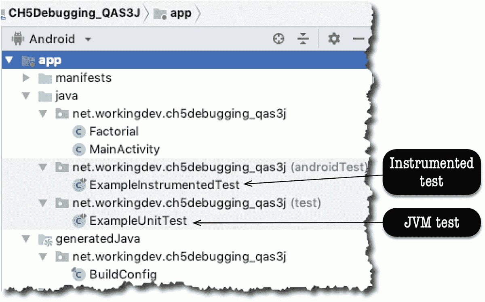

<figcaption class="Caption" lang="en">Figure 8-1

Android 视图中的 JVM 测试和插装测试

</figcaption>

</figure>

<figure class="Figure" id="Fig2">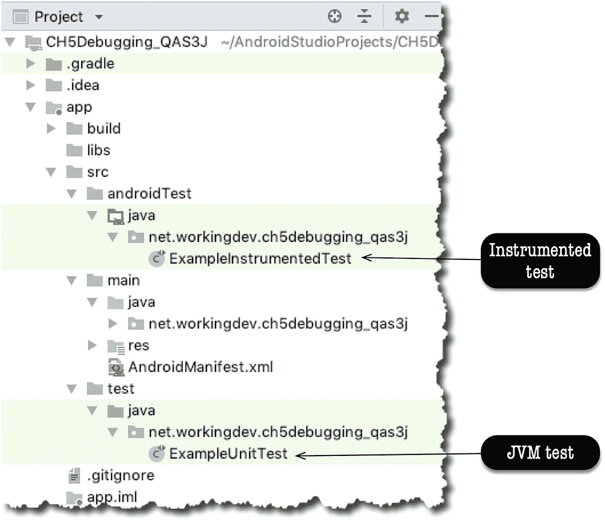

<figcaption class="Caption" lang="en">Figure 8-2

项目视图中的 JVM 测试和插装测试

</figcaption>

</figure>

从图 [8-1](#Fig1) 或 [8-2](#Fig2) 中可以看出，Android Studio 为 JVM 和插装测试生成了样本测试文件。示例文件只是作为快速参考；它向我们展示了单元测试可能是什么样子。

</section>

<section class="Section2 RenderAsSection2" id="Sec4">

### 简单的演示

To dive into this, create a project with an empty Activity. Create a class, then name it **Factorial.java**, and fill it up with the code shown in Listing [8-1](#PC1).public class Factorial {public static double factorial(int arg) {if (arg == 0) {return 1.0;}else {return arg + factorial(arg - 1);}}}Listing 8-1

Factorial.java

Make sure that *Factorial.java* is open in the main editor, as shown in Figure [8-3](#Fig3); then, from the main menu bar, go to **Navigate** ➤ **Test**. Similarly, you can also create a test using the keyboard shortcut (Shift+Command+T on macOS and Ctrl+Shift+T for Linux and Windows).

<figure class="Figure" id="Fig3">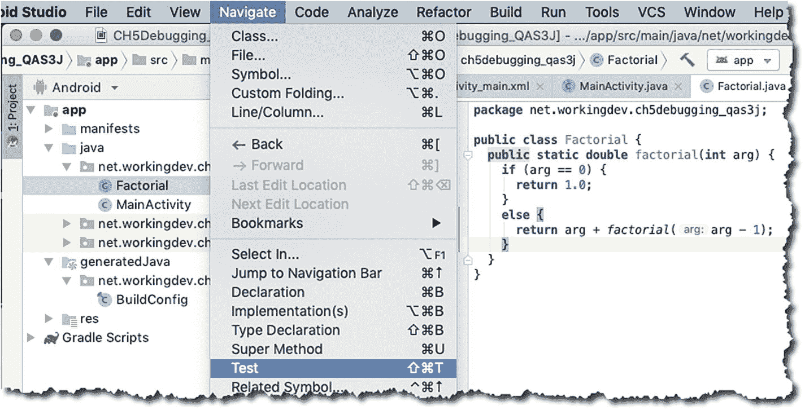

<figcaption class="Caption" lang="en">Figure 8-3

为 Factorial.java 创建一个测试

</figcaption>

</figure>

Right after you click “Test,” a pop-up dialog (Figure [8-4](#Fig4)) will prompt you to click another link—click “Create New Test” as shown in Figure [8-4](#Fig4).

<figure class="Figure" id="Fig4">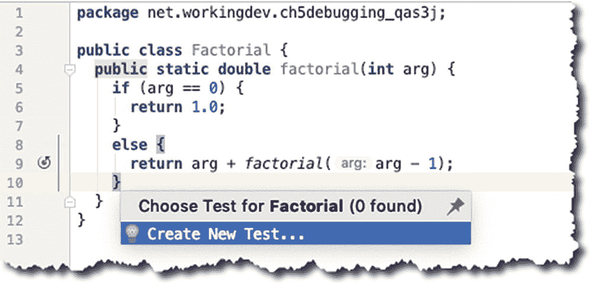

<figcaption class="Caption" lang="en">Figure 8-4

创建新的测试弹出窗口

</figcaption>

</figure>

Right after creating a new test, you’ll see another pop-up dialog, shown in Figure [8-5](#Fig5), which I’ve annotated. Please follow the annotations and instructions in Figure [8-5](#Fig5).

<colgroup><col class="tcol1 align-left"> <col class="tcol2 align-left"></colgroup> 
| -什么 | 您可以选择想要使用哪个测试库。您可以选择 JUnit 3、4 或 5。您甚至可以选择 Groovy JUnit、Spock 或 TestNG。我使用 JUnit4 是因为它是随 Android Studio 一起安装的。 |
| ➋ | 命名测试类的约定是“要测试的类名”+“Test”。Android Studio 使用该约定填充该字段。 |
| ➌ | 留空；我们不需要继承任何东西。 |
| -你好 | 我们现在不需要 setUp() 和 tearDown() 例程，所以不要检查它们。 |
| ➎ | 让我们检查一下 factorial() 方法，因为我们想为此生成一个测试。 |

<figure class="Figure" id="Fig5">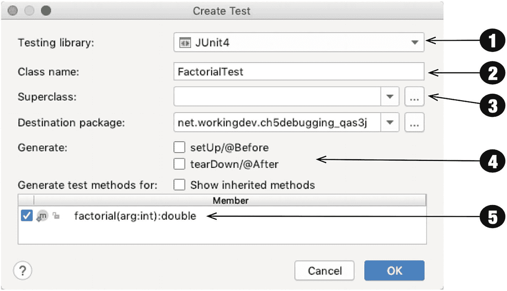

<figcaption class="Caption" lang="en">Figure 8-5

创建因子测试

</figcaption>

</figure>

When you click the **OK** button, Android Studio will ask where you want to save the test file. This is a JVM test, so we want to save it in the “test” folder (not in androidTest). See Figure [8-6](#Fig6). Click “OK.”

<figure class="Figure" id="Fig6">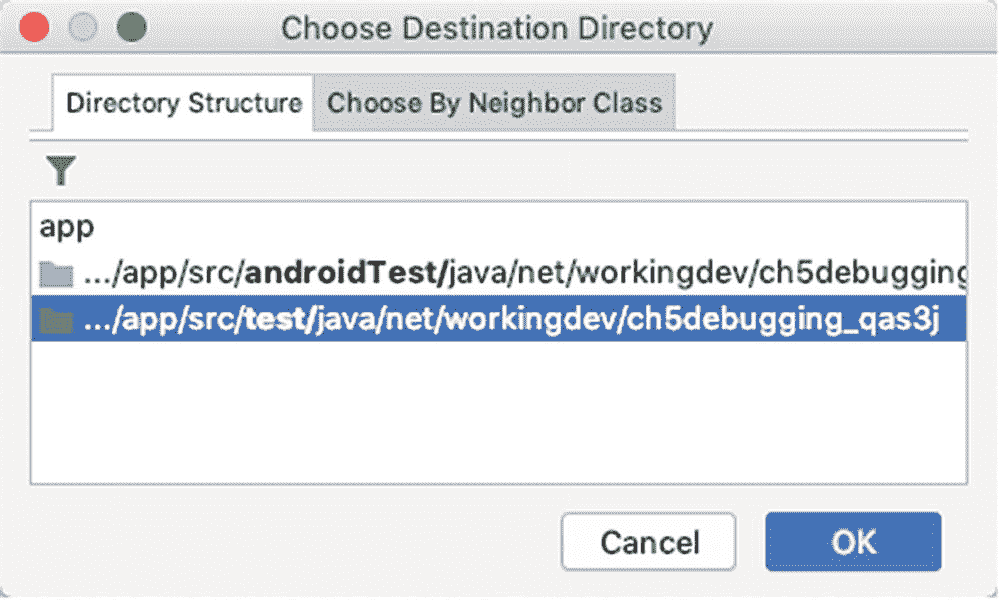

<figcaption class="Caption" lang="en">Figure 8-6

选择目的地目录

</figcaption>

</figure>

Android Studio will now create the test file for us. If you open **FactorialTest.java**, you’ll see the generated skeleton code—shown in Figure [8-7](#Fig7).

<colgroup><col class="tcol1 align-left"> <col class="tcol2 align-left"></colgroup> 
| -什么 | 文件*Factorial.java*被创建在*测试*文件夹下。 |
| ➋ | 创建了一个 factorial() 方法，并将其注释为 @Test 。这就是 JUnit 知道这个方法是单元测试的方式。您可以在方法名前面加上“test”，例如 testFactorial()，但这不是必需的，有了 @Test 注释就足够了。 |
| ➌ | 这是我们放置断言的地方。 |

<figure class="Figure" id="Fig7">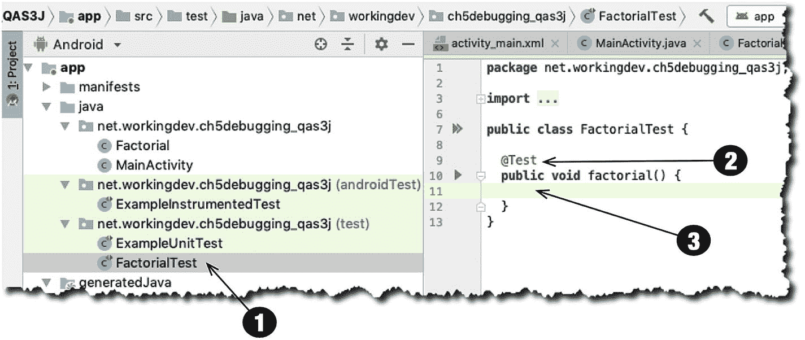

<figcaption class="Caption" lang="en">Figure 8-7

FactorialTest.java在项目视图和主编辑器中

</figcaption>

</figure>

看到这有多简单了吗？就设置和配置而言，在 Android Studio 中创建一个测试用例实际上并不涉及我们太多。我们现在需要做的就是编写我们的测试。

</section>

<section class="Section2 RenderAsSection2" id="Sec5">

### 实施测试

JUnit supplies several static methods that we can use in our test to make assertions about our code’s behavior. We use assertions to show an expected result which is our control data. It’s usually calculated independently and is known to be true or correct—that’s why you use it as a control data. When the expected data is returned from the assertion, the test passes; otherwise, the test fails. Table [8-1](#Tab1) shows the common assert methods you might need for your code.Table 8-1

常见断言方法

<colgroup><col class="tcol1 align-left"> <col class="tcol2 align-left"></colgroup> 
| 

方法

 | 

描述

 |
| --- | --- |
| assertEquals() | 如果两个对象或基元具有相同的值，则返回 true |
| assertNotEquals() | assertEquals 的反义词() |
| assertSame() | 如果两个引用指向同一个对象，则返回 true |
| 断言紧急事件() | assertSame 的反向() |
| assertTrue() | 测试布尔表达式 |
| assertFalse() | assertTrue 的反函数() |
| 断言 Null() | 测试空对象 |
| 断言 NotNull() | assertNull 的反向() |

Now that we know a couple of assert methods, we’re ready to write some test. Listing [8-2](#PC2) shows the code for FactorialTest.java.import org.junit.Test;import static org.junit.Assert.*;public class FactorialTest {@Testpublic void factorial() {assertEquals(1.0, Factorial.factorial(1),0.0);assertEquals(120.0, Factorial.factorial(5), 0.0);}}Listing 8-2

FactorialTest.java

我们的 FactorialTest 类只有一个方法，因为这只是为了举例说明。当然，真实世界的代码会有比这更多的方法。

注意，每个测试(方法)都由 **@Test** 注释。这就是 JUnit 如何知道 factorial() 是一个测试用例。还要注意的是， assertEquals() 是 Assert 类的一个方法，但是我们没有在这里写完全限定名，因为我们在 Assert 上有一个静态导入——这当然让事情变得更简单。

The assertEquals() method takes three parameters; they’re illustrated in Figure [8-8](#Fig8).

<colgroup><col class="tcol1 align-left"> <col class="tcol2 align-left"></colgroup> 
| -什么 | **期望值**是你的控制数据；这通常在测试中被硬编码。 |
| ➋ | **实际值**是您的方法返回的值。如果预期值与实际值相同，则 assertEquals()通过——您的代码表现正常。 |
| ➌ | **Delta** 意在反映*实际*和*预期*值能够有多接近并且仍然被认为是相等的。一些开发人员称这个参数为“模糊”因素。当期望值和实际值之间的差异大于“模糊因子”时，那么 assertEquals() 将会失败。我在这里使用 0.0 是因为我不想容忍任何形式的偏差。您可以使用其他值，如 0.001、0.002 等等；这取决于你的用例以及你的应用能够容忍多少模糊。 |

<figure class="Figure" id="Fig8">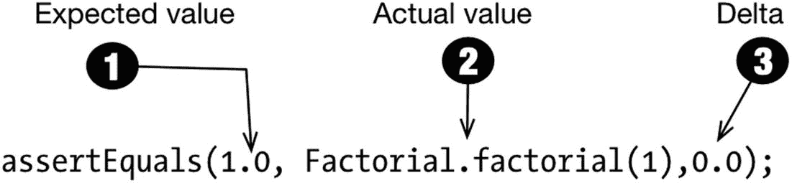

<figcaption class="Caption" lang="en">Figure 8-8

assertEquals 方法

</figcaption>

</figure>

现在，我们的代码完成了。如果你愿意，你可以在代码中插入更多的断言，这样你就可以更好地理解事物。

有几件事我没有包括在这个示例代码中。我没有重写 setUp() 和 tearDown() 方法，因为我不需要它。如果需要建立数据库连接、网络连接等等，通常会使用 setUp() 方法。使用 tearDown()方法关闭您在设置()中打开的任何东西。

现在，我们准备运行测试。

</section>

<section class="Section2 RenderAsSection2" id="Sec6">

### 运行单元测试

You can run just one test or all the tests in the class. The little green arrows in the gutter of the main editor are clickable. When you click the little arrow beside the name of the class, that will run all the tests in the class. When you click the one beside the name of the test method, that will run only that test case. See Figure [8-9](#Fig9).

<figure class="Figure" id="Fig9">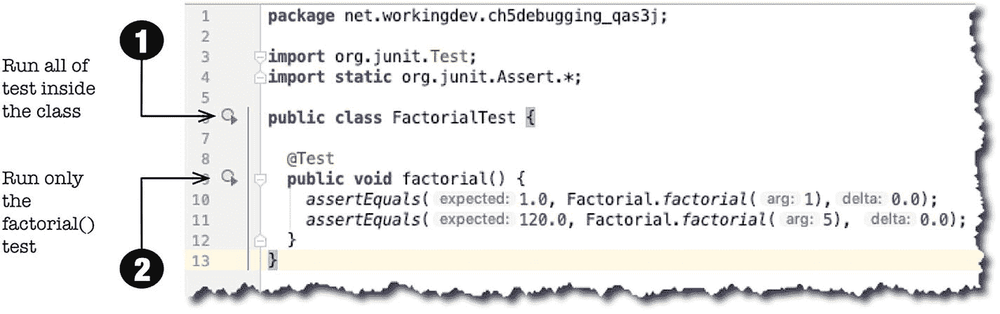

<figcaption class="Caption" lang="en">Figure 8-9

FactorialTest.java 在主编辑

</figcaption>

</figure>

同样，您也可以从主菜单栏运行测试；前往**运行** ➤ **运行**。

Figure [8-10](#Fig10) shows the result of the text execution.

<figure class="Figure" id="Fig10">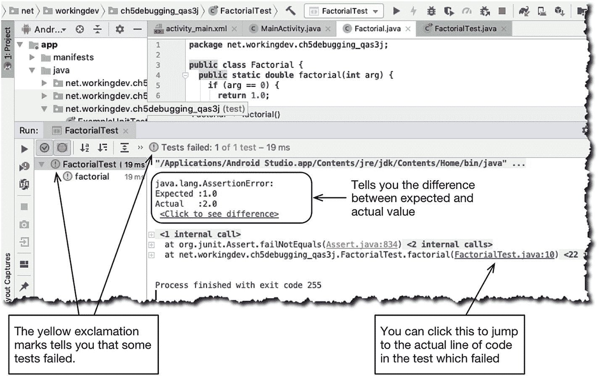

<figcaption class="Caption" lang="en">Figure 8-10

运行 FactorialTest.java 的结果

</figcaption>

</figure>

Android Studio 为您提供了大量的提示，因此您可以判断您的测试是通过还是失败。我们的第一次运行告诉我们*Factorial.java*有问题； assertEquals() 失败。

Tip

当测试失败时，最好使用调试器来调查代码。FactorialTest.java 与我们项目中的其他职业没有什么不同；这只是另一个 Java 文件，我们肯定可以调试它。在测试代码的关键位置设置一些断点，然后运行“调试器”而不是“运行”它，这样你就可以遍历它了。

我们的测试失败了，因为 1 的阶乘不是 2，而是 1。如果你仔细观察*Factorial.java*，你会注意到阶乘值没有正确计算。

Edit the *Factorial.java* file, then change this line:return arg + factorial(arg - 1);to this linereturn arg * factorial(arg - 1);If we run the test again, we see successful results, as shown in Figure [8-11](#Fig11).

<figure class="Figure" id="Fig11">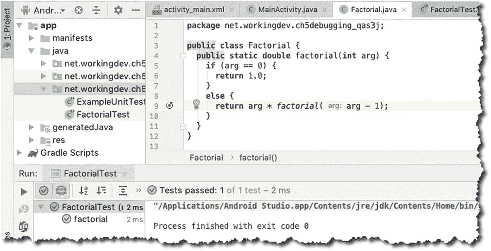

<figcaption class="Caption" lang="en">Figure 8-11

成功测试

</figcaption>

</figure>

我们现在看到的不是黄色的感叹号，而是绿色的复选标记。我们现在看到的不是“测试失败”，而是“测试通过”现在我们知道我们的代码按预期工作。

</section>

</section>

<section class="Section1 RenderAsSection1" id="Sec7">

## 排除故障

我们写代码已经有一段时间了；我敢肯定，到目前为止，您的代码已经遇到了一些问题，并且已经看到了 Android Studio 提醒您注意这些错误的各种方式。

<section class="Section2 RenderAsSection2" id="Sec8">

### 句法误差

你会经常遇到的一个错误是语法错误。它们发生是因为你在代码中写了一些不应该出现的东西；或者你忘了写什么(比如分号)。这些错误可能是良性的，如忘记了右花括号，也可能是复杂的，如在使用泛型时将错误类型的参数传递给方法或参数化类。幸运的是，Android Studio 非常善于发现这类错误。这几乎就像 IDE 在不断地读取代码并编译它。

Syntax errors are simple enough to solve, and you’ve probably figured it out by now. Whenever you see red squiggly lines or red-colored text in the IDE (as shown in Figure [8-12](#Fig12)), just hover the mouse on top of the red-colored text or red squiggly lines, and you should see Android Studio’s tips.

<figure class="Figure" id="Fig12">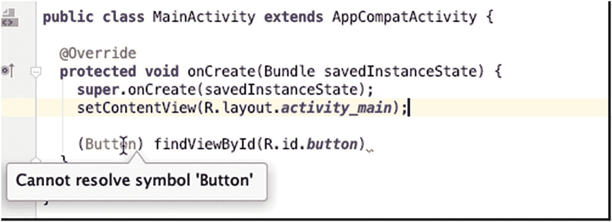

<figcaption class="Caption" lang="en">Figure 8-12

语法错误显示在编辑器中

</figcaption>

</figure>

The tips typically tell you what’s wrong with the code. In Figure [8-12](#Fig12), the error is **Cannot resolve symbol ‘Button’**, which means you haven’t imported the Button class just yet. To resolve this, position the mouse cursor on the offending word (Button, in this case), then use the Quick Fix feature (**Option+Enter** in Mac, **Alt+Enter** in Windows). Quick Fix in action is shown in Figure [8-13](#Fig13).

<figure class="Figure" id="Fig13">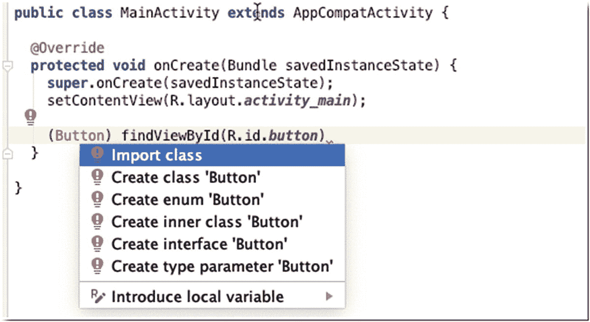

<figcaption class="Caption" lang="en">Figure 8-13

权宜之计

</figcaption>

</figure>

</section>

<section class="Section2 RenderAsSection2" id="Sec9">

### 运行时错误

Runtime errors happen when your code encounters a situation it doesn’t expect; and as its name implies, that errant condition is something that appears only when the program is running—it’s not something you or the compiler can see at the time of compilation. Your code will compile without problems, but it may stop running when something in the runtime environment doesn’t agree with what your code wants to do. There are many examples of these things; here are some of them:

*   这个应用从互联网上获得一些东西，一张图片或一个文件等等，所以它假设互联网是可用的，并且有网络连接。一直都是。经验应该告诉你，情况并不总是这样。网络连接有时会中断，如果您不在代码中考虑这一点，它可能会崩溃。

*   该应用需要从文件中读取。就像我们前面的第一个案例一样，您的代码假设文件将一直存在。有时，文件会损坏，可能变得不可读。这也应该在代码中考虑。

*   该应用执行数学计算。它使用用户输入的值，有时也使用其他计算得出的值。如果您的代码碰巧执行了除法，并且在其中一个除法中，除数为零，这也将导致运行时问题。

在大多数情况下，在处理运行时错误时，Java 是你的后盾。异常处理在 Java 中不是可选的。只要确保你没有在你的 try-catch 块上吝啬；总是放异常处理代码，你应该没问题。

</section>

<section class="Section2 RenderAsSection2" id="Sec10">

### 逻辑错误

逻辑错误最难发现。顾名思义，这是你逻辑上的错误。当你的代码没有做你认为它应该做的事情时，那就是逻辑错误。有许多方法可以解决这个问题，但最常用的方法是(1)使用日志语句和(2)使用断点和遍历/单步执行代码。

Printing log messages is a simple way of marking the footprints of the program; you can do it with the simple System.out.println() statement, but I’d encourage you to use the Log class instead. Listing [8-3](#PC5) shows a basic usage of the Log class.public class MainActivity extends AppCompatActivity {final String TAG = getClass().getName();@Overrideprotected void onCreate(Bundle savedInstanceState) {super.onCreate(savedInstanceState);setContentView(R.layout.*activity_main*);// ...}**void doSomething() {****Log.d(****TAG****, "Log message, doSomething");****}**}Listing 8-3

Log 类的基本用法

You can define the TAG variable anywhere in the class, but in Listing [8-3](#PC5), I defined it as a class member; Log.d() prints a debug message. You can use the other methods of the Log class to print warnings, info, or errors. The other methods are shown here:Log.v(TAG, message) // verboseLog.d(TAG, message) // debugLog.i(TAG, message) // infoLog.w(TAG, message) // warningLog.e(TAG, message) // error

在每种情况下，**标签**是一个字符串或变量。您可以使用标记来过滤 Logcat 窗口中的消息。**消息**也是一个字符串或变量，它包含了您真正想在日志中看到的内容。

When you run your app, you can see the Log messages in the Logcat tool window. You can launch it either by clicking its tab in the menu strip at the bottom of the window (as shown in Figure [8-14](#Fig14)) or from the main menu bar, **View** ➤ **Tool Windows** ➤ **Logcat**.

<figure class="Figure" id="Fig14">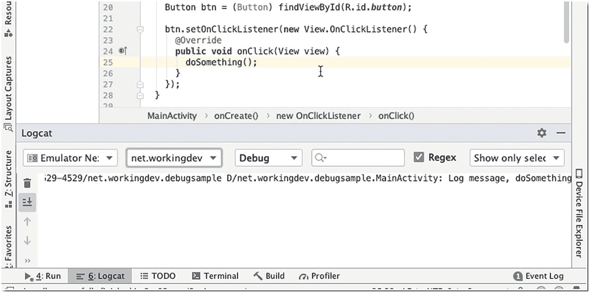

<figcaption class="Caption" lang="en">Figure 8-14

Logcat 工具窗口

</figcaption>

</figure>

</section>

<section class="Section2 RenderAsSection2" id="Sec11">

### 遍历代码

Android Studio 包括一个交互式调试器，它允许你在代码运行时一步一步地调试代码。使用交互式调试器，我们可以在代码中的特定位置和特定时间点检查应用的快照—变量值、运行的线程等。代码中的这些特定位置被称为*断点*；你可以选择这些断点。

To set a breakpoint, choose a line that has an executable statement, then click its line number in the gutter. When you set a breakpoint, there will be a pink circle icon in the gutter, and the whole line is lit in pink—as shown in Figure [8-15](#Fig15).

<figure class="Figure" id="Fig15">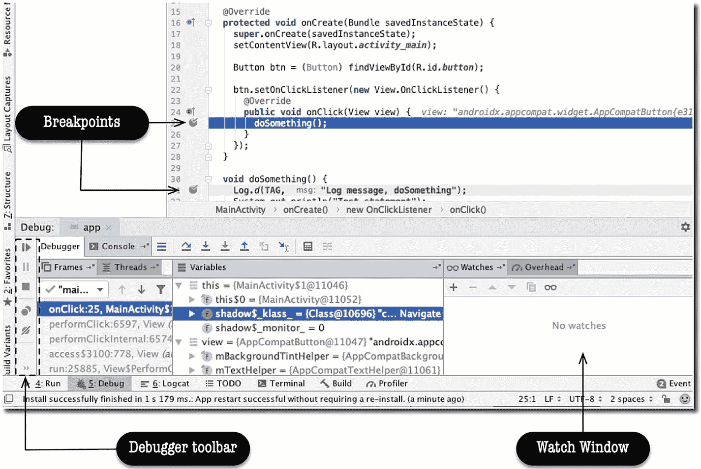

<figcaption class="Caption" lang="en">Figure 8-15

调试器窗口

</figcaption>

</figure>

设置断点后，您必须在调试模式下运行应用。如果应用当前正在运行，请将其停止，然后从主菜单栏中单击**运行** ➤ **调试“应用”。**

Note

在调试模式下运行应用并不是调试应用的唯一方式。您还可以在当前运行的应用中附加调试器进程。在有些情况下，第二种技术是有用的；例如，当您试图解决的错误发生在非常特定的条件下时，您可能希望运行应用一段时间，当您认为您接近错误点时，您可以附加调试器。

照常使用该应用。当执行到您设置断点的一行时，该行将从粉红色变为蓝色。这就是你如何知道代码在断点处执行。此时，调试器窗口打开，执行停止，Android Studio 进入交互式调试模式。当您在这里时，应用的状态显示在**调试工具窗口**中。在此期间，您可以检查变量值，甚至看到应用中运行的线程。

您甚至可以通过单击带有眼镜图标的加号，在“监视”窗口中添加变量或表达式。将有一个文本字段，您可以在其中输入任何有效的表达式。当你按下**输入**时，Android Studio 会对表达式进行求值，并向你显示结果。要删除监视表达式，请选择表达式，然后单击“监视”窗口上的减号图标。

要恢复程序执行，您可以单击调试器工具栏顶部的“恢复程序”按钮—它是指向右侧的绿色箭头。或者，您也可以从主菜单栏**运行** ➤ **恢复程序**中恢复程序。如果你想在程序自然结束前暂停它，你可以点击调试器工具栏上的“停止应用”按钮；这是红色方块图标。或者，您也可以从主菜单栏**运行** ➤ **停止应用**中执行此操作。

</section>

</section>

<section class="Section1 RenderAsSection1" id="Sec12">

## 仿形铣床

分析器让我们了解我们的应用/游戏如何使用计算资源，如 CPU、内存、网络带宽和电池。

The Profiler is new in Android Studio 3\. It replaces the Android monitor with its new unified and shared timeline view for the CPU, memory, network, and energy graphs. Figure [8-16](#Fig16) shows the Profiler.

<figure class="Figure" id="Fig16">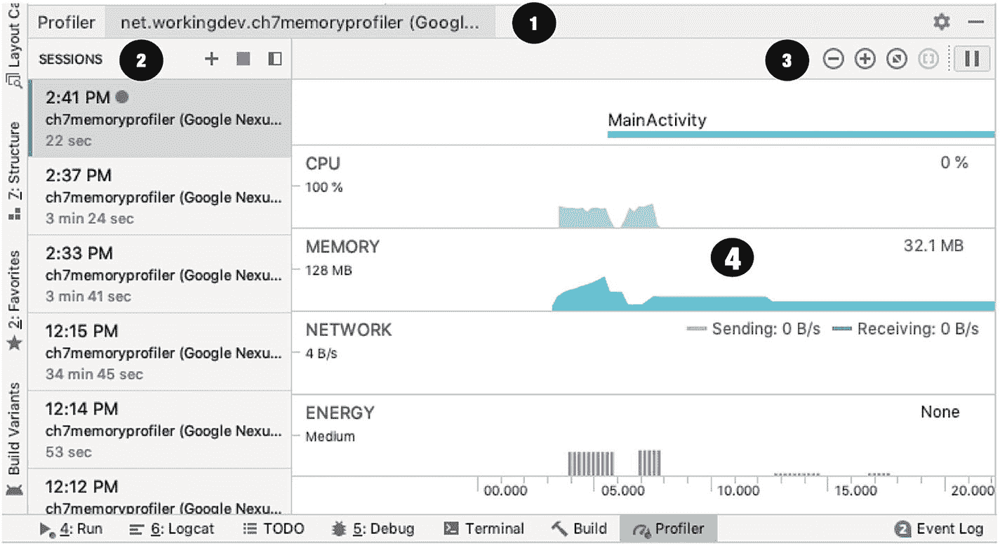

<figcaption class="Caption" lang="en">Figure 8-16

仿形铣床

</figcaption>

</figure>

You can get to the Profiler by going to the main menu bar, then selecting **View** ➤ **Tool Windows** ➤ **Profiler**.

<colgroup><col class="tcol1 align-left"> <col class="tcol2 align-left"></colgroup> 
| -什么 | 它显示正在分析的进程和设备。 |
| ➋ | 它会显示要查看的会话。您还可以通过单击+按钮添加新的会话。 |
| ➌ | 使用缩放按钮来控制要查看多少时间线。 |
| -你好 | 新的共享时间线视图允许您查看 CPU、内存、网络和能源使用情况的所有图表。在顶部，您还会看到重要的应用事件，如用户输入或活动状态转换。 |

当您启动一个应用时，无论是在连接的设备上还是在仿真器上，您都会在 Profiler 上看到它的图形。

Note

如果您尝试使用低于 API 级别 26 的版本来分析 APK，您将会看到一些警告，因为 Android Studio 需要完全检测您的代码。您需要启用“高级分析”；但是，如果你的 APK 是奥利奥或更高，你不会看到任何警告。

如果您单击任何图表，Profiler 窗口将带您进入其中一个详细视图。例如，如果您单击 CPU，您将看到 CPU 利用率的详细视图。

<section class="Section2 RenderAsSection2" id="Sec13">

### 中央处理器

Figure [8-17](#Fig17) shows the detailed view for the CPU utilization on the sample app I was running.

<figure class="Figure" id="Fig17">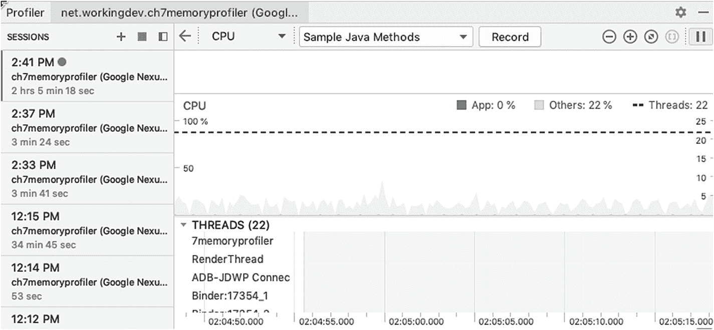

<figcaption class="Caption" lang="en">Figure 8-17

CPU 视图

</figcaption>

</figure>

除了实时利用率图，CPU 详细视图还显示了应用中所有线程及其状态的列表，您可以看到线程是否正在等待 I/O 或它们何时处于活动状态。

You might have noticed the “Record” button in Figure [8-17](#Fig17); if you click that button, you can get a report on all the methods that were executed in a given period. Notice also the selected trace type in the drop-down (Sample Java Methods); this *trace type* has a smaller overhead but not as detailed nor as accurate as the *instrumented type* (Trace Java Methods), meaning the sampled type may miss the execution of a very short-lived method. You might think, “just always use the instrumented type then”—you have to remember, though, that while instrumented type can record every method call, on Android devices before version 8, there is a limit on how much data can be captured; so, if you use the instrumented trace, that limit will be reached quickly. You can change that limit by editing the configuration for the instrumented capture. On the trace type drop-down, choose “Edit Configurations” as shown in Figure [8-18](#Fig18).

<figure class="Figure" id="Fig18">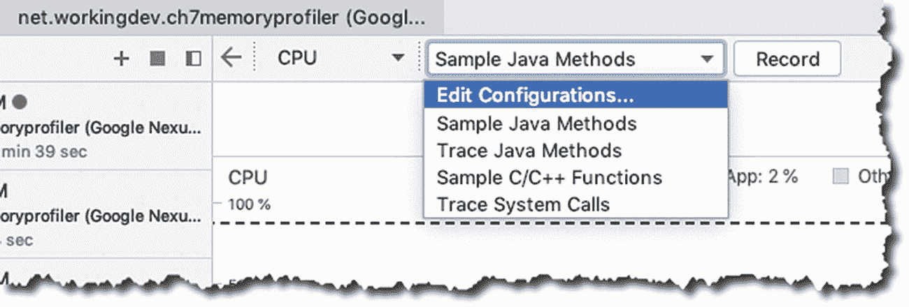

<figcaption class="Caption" lang="en">Figure 8-18

编辑配置

</figcaption>

</figure>

<figure class="Figure" id="Fig19">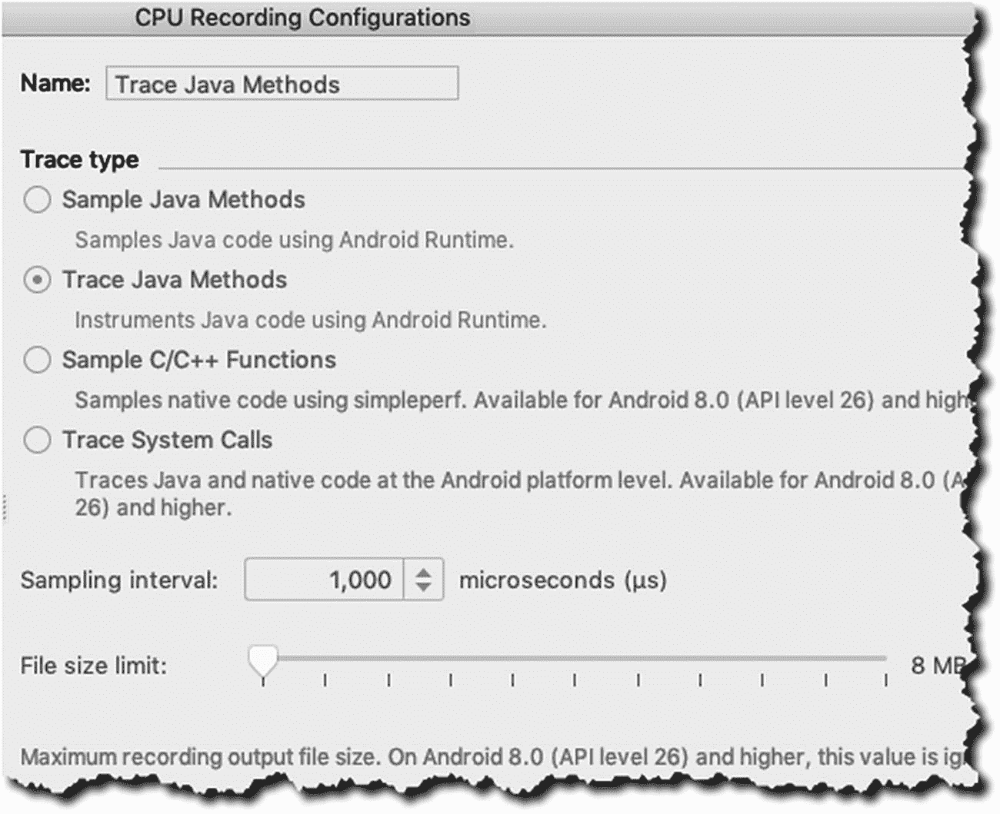

<figcaption class="Caption" lang="en">Figure 8-19

CPU 记录配置

</figcaption>

</figure>

图 [8-19](#Fig19) 显示了“采样间隔”和“文件大小限制”设置，您可以使用它们来调整采样的频率以及您想要分配给录像的文件大小。只是重申一下，文件大小限制只存在于运行 Android 8.0 或更低版本(< API level 26)的 Android 设备上。如果你的设备有更高的 Android 版本，你就不会受到这些限制。

If you click record, Android Studio will begin capturing data. Click the “Stop” button when you’d like to stop recording, as shown in Figure [8-20](#Fig20).

<figure class="Figure" id="Fig20">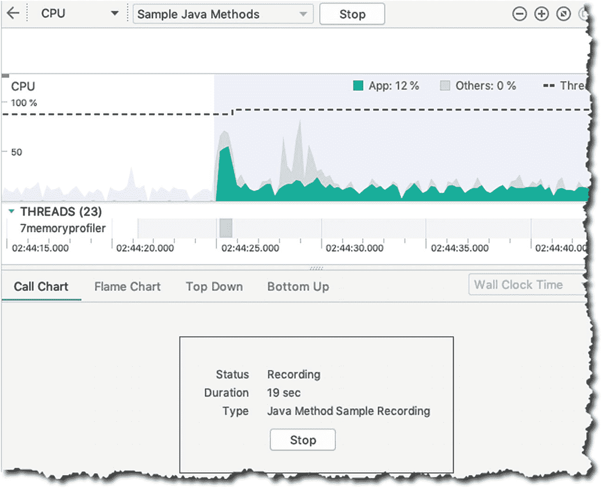

<figcaption class="Caption" lang="en">Figure 8-20

录制会话

</figcaption>

</figure>

When you hit stop, you can take a look at the individual threads, as shown in Figure [8-21](#Fig21).

<figure class="Figure" id="Fig21">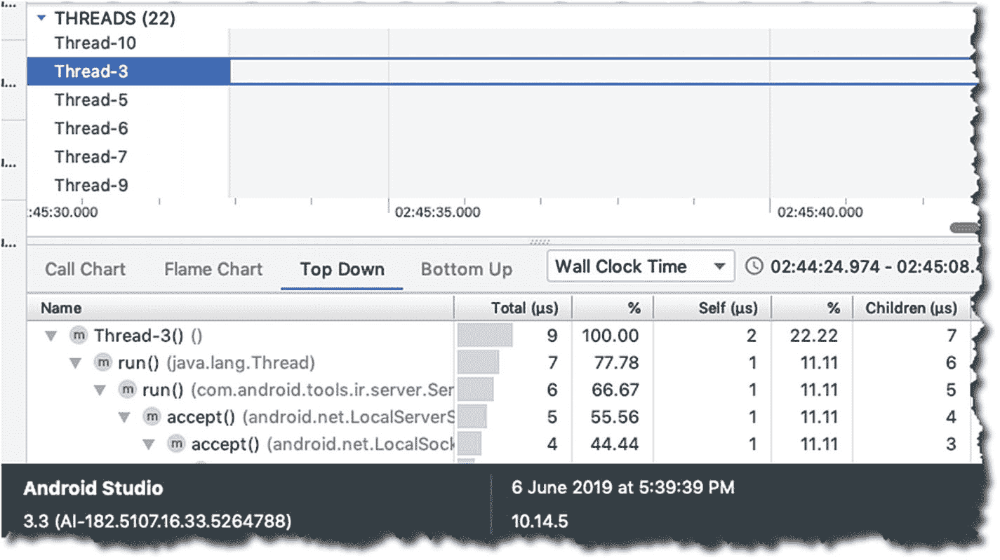

<figcaption class="Caption" lang="en">Figure 8-21

检查螺纹

</figcaption>

</figure>

</section>

<section class="Section2 RenderAsSection2" id="Sec14">

### 记忆

The memory profiler  shows, in real time, how much memory your app is consuming. Figure [8-22](#Fig22) shows a snapshot of the memory view as I captured the memory footprint of a test app. As you can see, not only does the graph show how much memory your app is gulping, it also shows the breakdown, for example, how much memory is used by the *code*, *stack*, *graphics*, *Java*, and so on.

<figure class="Figure" id="Fig22">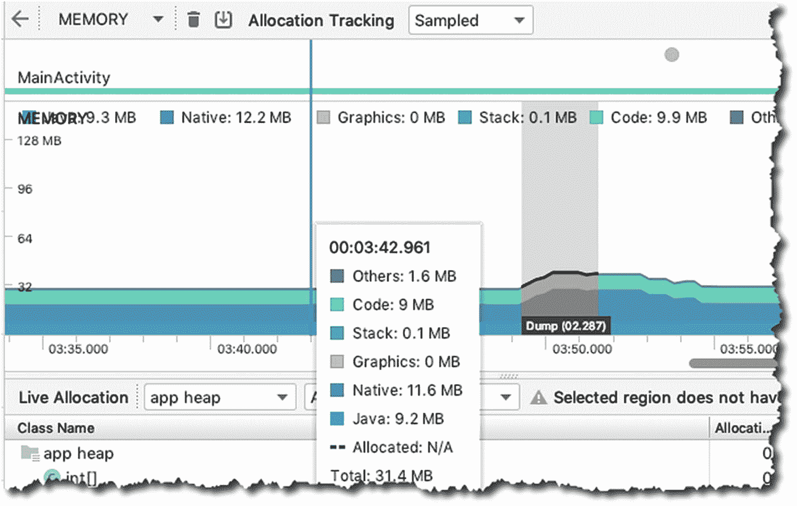

<figcaption class="Caption" lang="en">Figure 8-22

内存视图

</figcaption>

</figure>

You can force garbage collection (GC) in the memory view. See that garbage can icon at the top? Yup, if you click that, it’ll force a GC. The button to its right is also useful—the icon with a down-pointing arrow inside a box is a *memory* *dump* . If you click that, the Java heap will be dumped, and then you can inspect it, as shown in Figure [8-23](#Fig23).

<figure class="Figure" id="Fig23">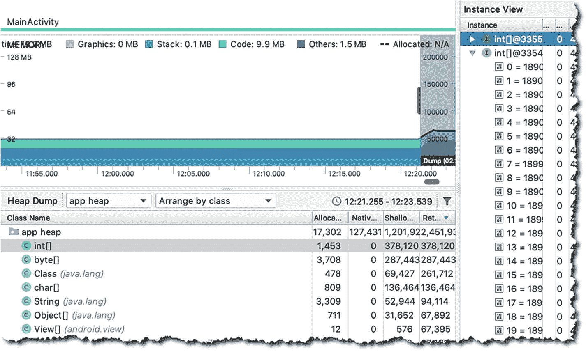

<figcaption class="Caption" lang="en">Figure 8-23

Java 堆

</figcaption>

</figure>

The heap is a preserved amount of storage memory that the Android runtime allocates for our app. When we dumped the heap, it gave us a chance to examine instance properties of objects, as shown in Figure [8-24](#Fig24).

<figure class="Figure" id="Fig24">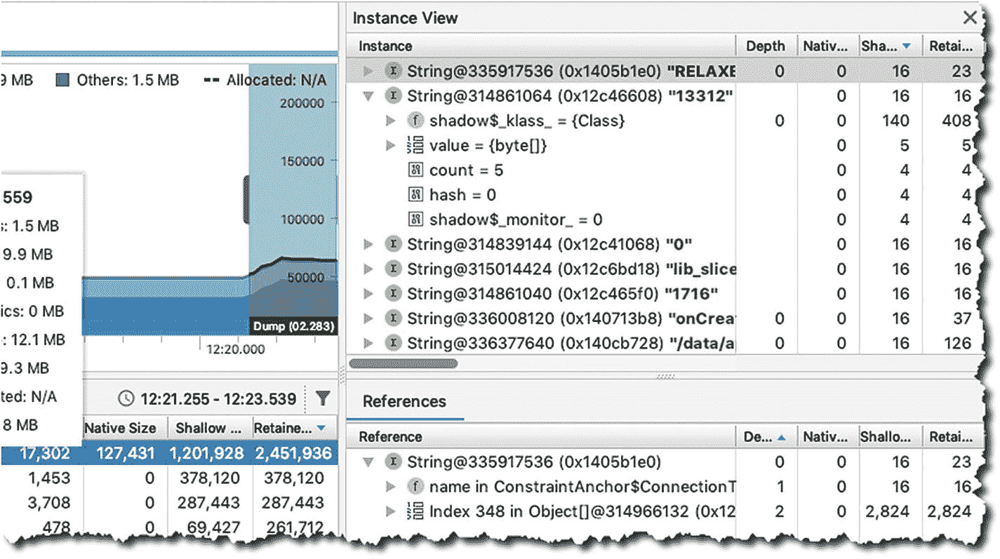

<figcaption class="Caption" lang="en">Figure 8-24

实例视图，参考选项卡

</figcaption>

</figure>

Reference 选项卡在查找内存泄漏时非常有用，因为它显示了指向您正在检查的对象的所有引用。

Another useful tool in the memory view is the Allocation tracker, shown in Figure [8-25](#Fig25).

<colgroup><col class="tcol1 align-left"> <col class="tcol2 align-left"></colgroup> 
| -什么 | 单击内存图时间线中的任意位置，查看分配跟踪器。这将向您显示在该时间点分配和释放的所有对象的列表。 |
| ➋ | 这显示了应用在某个时间点正在使用的所有类的列表。 |
| ➌ | 这显示了在特定时间点分配和释放的所有对象的列表。 |
| -你好 | 跟踪器甚至包括分配的调用堆栈。 |

<figure class="Figure" id="Fig25">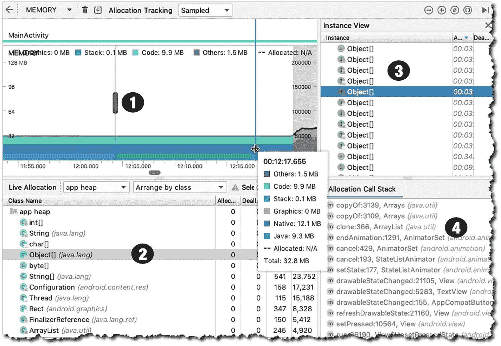

<figcaption class="Caption" lang="en">Figure 8-25

分配跟踪器

</figcaption>

</figure>

</section>

<section class="Section2 RenderAsSection2" id="Sec15">

### 网络

Like the other views in the Profiler, the network view also shows real-time data. It lets you see and inspect data that is sent and received by your app; it also shows the total number of connections. Figure [8-26](#Fig26) shows a snapshot of the network profiler  .

<figure class="Figure" id="Fig26">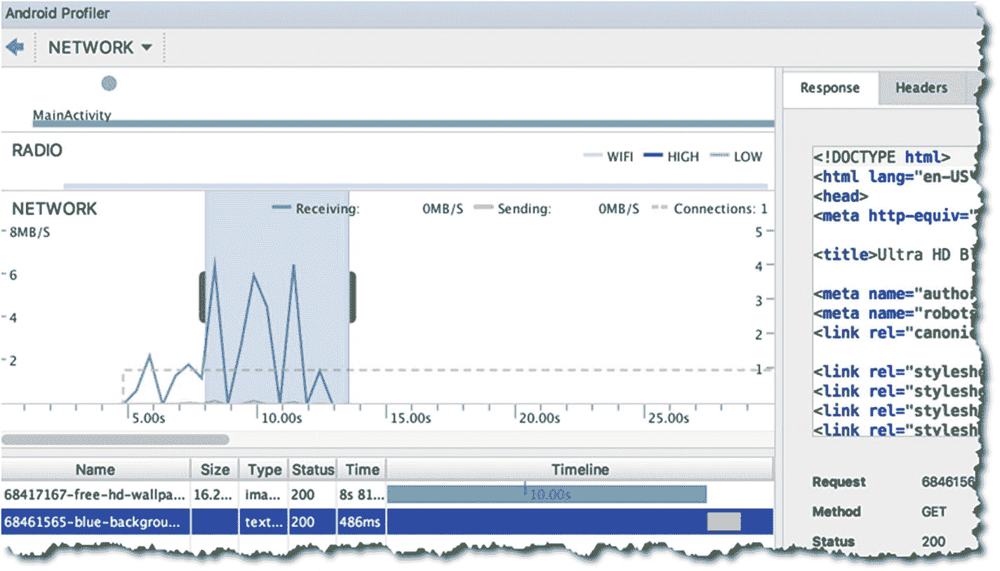

<figcaption class="Caption" lang="en">Figure 8-26

网络分析器

</figcaption>

</figure>

每次你的应用向网络发出请求，它都使用 WiFi 无线电来发送和接收数据——无线电不是最节能的；它很耗电，如果你不注意你的应用如何发出网络请求，那肯定会比平时更快地耗尽设备电池。

当您使用网络分析器时，一个好的开始方式是寻找网络活动的短峰值。当您看到急剧上升和下降的尖峰信号，并且它们分散在整个时间线上时，似乎您可以通过批处理网络请求来进行一些优化，以减少 WiFi 无线电需要唤醒和发送或接收数据的次数。

</section>

<section class="Section2 RenderAsSection2" id="Sec16">

### 活力

By now you’re probably seeing a pattern on how the Profiler works. It shows you real-time data. In the case of the Energy profiler, it shows data on how much energy your app is guzzling—though it doesn’t really show the direct measure of energy consumption, the Energy profiler shows an estimation of the energy consumption of the CPU, the radio, and the GPS sensor. Figure [8-27](#Fig27) shows a snapshot of the Energy profiler  .

<figure class="Figure" id="Fig27">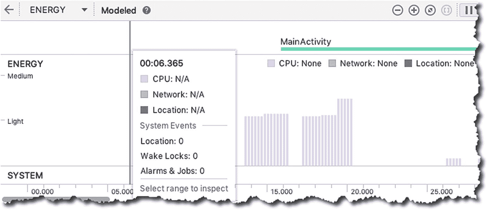

<figcaption class="Caption" lang="en">Figure 8-27

能量分析器

</figcaption>

</figure>

You can also use the Energy profiler to find system events that affect energy consumption, for example, wake locks, jobs, and alarms.

*   *唤醒锁*是一种在设备进入睡眠状态时保持屏幕 CPU 开启的机制，例如，当应用播放视频时，它可能会使用唤醒锁来保持屏幕开启，即使没有用户交互——使用唤醒锁没有问题，但忘记释放唤醒锁会有问题；它让 CPU 的运行时间超过了必要的时间，这无疑会更快地耗尽电池。

*   *警报*可用于以特定的时间间隔运行应用上下文之外的后台任务。当警报响起时，它可以运行一些任务；如果它运行一段高能耗的代码，您肯定会在能量分析器中看到它。

*   当满足某些条件时，例如，当网络变得可用时，一个*作业*可以执行动作。您通常会使用 JobBuilder 创建一个作业，并使用 JobScheduler 来调度执行；当一个任务开始时，您也可以在能源配置文件中看到它们。

这是 Android Studio Profiler 的一个简单介绍；务必在 [查看官方文档 https://developer . Android . com/studio/profile/Android-profiler](https://developer.android.com/studio/profile/android-profiler)。使用分析器可以让你了解游戏代码的哪一部分占用了资源。优化使用资源可以节省电池；你的用户会感谢你的。

</section>

</section>

<section class="Section1 RenderAsSection1" id="Sec17">

## 关键要点

*   我们已经讨论了你可以为你的游戏做的各种各样的测试；你不必做所有的测试，但是要确保你做的测试适用于你的游戏。

*   开发测试(单元测试)应该是核心开发任务；试着养成将测试用例与实际代码一起编写的习惯。

*   Android Studio Profile 可以从底层检查您的应用的行为。它可以让你了解应用是如何消耗资源的；当您进行性能测试时，请使用这个工具。

</section>****