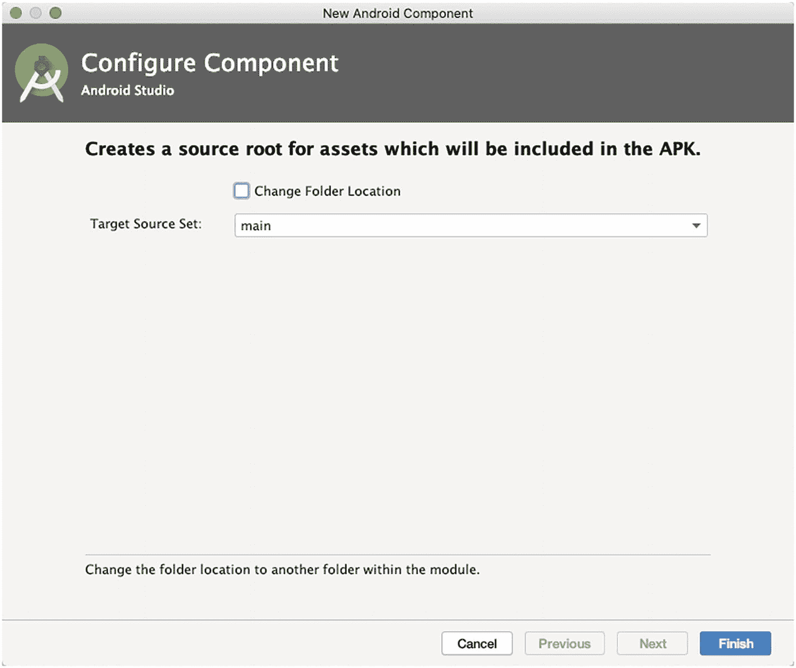

# 九、OpenGL ES 简介

*   关于 OpenGL ES

*   OpenGL 专家系统理论

*   GLSurfaceView 和 GLSurfaceView。渲染器

*   在 OpenGL ES 中使用 Blender 数据

从 API level 11 (Android 3)开始，2D 渲染管道已经支持硬件加速。当你在画布上画图的时候(这是我们上两个游戏搭建的时候用的)，画图操作已经在 GPU 上完成了；但这也意味着应用会消耗更多的 RAM，因为实现硬件加速需要更多的资源。

如果你构建的游戏不是那么复杂，那么使用画布构建游戏是一个不错的技术选择；但是，当视觉复杂性水平上升时，画布可能会耗尽能量，无法满足您的游戏需求。你需要更实在的东西。这就是 OpenGL ES 的用武之地。

<section class="Section1 RenderAsSection1" id="Sec1">

## 什么是 OpenGL ES

开放图形库(OpenGL)来自硅图形(SGI)；他们是高端图形工作站和大型机的制造商。最初，SGI 有一个名为 IRIS GL 的专有图形框架(后来成为行业标准)，但随着竞争的加剧，SGI 选择将 IRIS GL 转变为一个开放框架。IRIS GL 去掉了与图形无关的功能和硬件相关的特性，变成了 OpenGL。

OpenGL 是一种用于渲染 2D 和 3D 图形的跨语言、跨平台的应用编程接口(API)。这是一个渲染多边形的精益平均机器；它是用 C 编写的 API，用于与图形处理单元(GPU)进行交互，以实现硬件加速渲染。这是一个非常低级的硬件抽象。

随着小型手持设备变得越来越普遍，用于嵌入式系统的 OpenGL(OpenGL ES)被开发出来。OpenGL ES 是桌面版的精简版；它移除了许多更冗余的 API 调用，并简化了其他元素，使其能够在市场上功能较弱的 CPU 上高效运行；因此，OpenGL ES 在许多平台上被广泛采用，如 HP webOS、任天堂 3DS、iOS 和 Android。

OpenGL ES 现在是 3D 图形编程的行业标准。它由 Khronos Group 维护，Khronos Group 是一个行业联盟，其成员包括 ATI、NVIDIA 和 Intel 等；这些公司共同定义并扩展了标准。

Currently, there are six incremental versions of OpenGL ES: versions 1.0, 1.1, 2.0, 3.0, 3.1, and 3.2.

*   **OpenGL ES 1.0 和 1.1**—此 API 规范受 Android 1.0 及更高版本支持。

*   **OpenGL ES 2.0**—此 API 规范受 Android 2.2 (API level 8)及更高版本支持。

*   **OpenGL ES 3.0**—此 API 规范受 Android 4.3 (API level 18)及更高版本支持。

*   **OpenGL ES 3.1**—此 API 规范受 Android 5.0 (API 等级 21)及更高版本支持。

There are still developers, especially those who focus on games that run on multiple platforms, who write for OpenGL ES 1.0; this is because of its simplicity, flexibility, and standard implementation. All Android devices support OpenGL ES 1.0, some devices support 2.0, and any device after Jelly Bean supports OpenGL ES 3.0\. At the time of writing, more than half of activated Android devices already support OpenGL ES 3.0\. Table [9-1](#Tab1) shows the distribution and Figure [9-1](#Fig1) shows a nice pie chart to go with it; this data was taken from [https://developer.android.com/about/dashboards#OpenGL](https://developer.android.com/about/dashboards%2523OpenGL).Table 9-1

OpenGL ES 版本发布

<colgroup><col class="tcol1 align-left"> <col class="tcol2 align-left"></colgroup> 
| 

OpenGL 是版本

 | 

分配

 |
| --- | --- |
| 仅限 GL 1.1 | 0.0% |
| GL 2.0 | 14.5% |
| GL 3.0 | 18.6% |
| GL 3.1 | 9.8% |
| GL 3.2 | 57.2% |

<figure class="Figure" id="Fig1">

<figcaption class="Caption" lang="en">Figure 9-1

OpenGL ES 版本发布

</figcaption>

</figure>

Note

对 OpenGL ES 的一个特定版本的支持也意味着对任何更低版本的支持(例如，对 2.0 版本的支持也意味着对 1.1 版本的支持)。

值得注意的是，OpenGL ES 2.0 打破了与 1.x 版本的兼容性。您可以使用 1.x 或 2.0，但不能同时使用两者。原因是 1.x 版本使用一种称为 *固定功能管道* 的编程模型，而 2.0 及更高版本允许您通过*着色器*以编程方式定义部分渲染管道。

</section>

<section class="Section1 RenderAsSection1" id="Sec2">

## OpenGL ES 是做什么的

The short answer is OpenGL ES just renders triangles on the screen, and it gives you some control on how those triangles are rendered. It’s probably best also to describe (as early as now) what OpenGL ES is not. It is not

*   一个场景管理 API

*   射线追踪仪

*   物理引擎

*   游戏引擎

*   一个真实感渲染引擎

OpenGL ES 只是渲染三角形。没别的了。

Think of OpenGL ES as working like a camera. To take a picture, you have to go to the scene you want to photograph. Your scene is composed of objects that all have a position and orientation relative to your camera as well as different materials and textures. Glass is translucent and reflective; a table is probably made out of wood; a magazine has some photo of a face on it; and so on. Some of the objects might even move around (e.g., cars or people). Your camera also has properties, such as focal length, field of view, image resolution, size of the photo that will be taken, and a unique position and orientation within the world (relative to some origin). Even if both the objects and the camera are moving, when you press the shutter release, you catch a still image of the scene. For that small moment, everything stands still and is well defined, and the picture reflects exactly all those configurations of position, orientation, texture, materials, and lighting. Figure [9-2](#Fig2) shows an abstract scene with a camera, light, and three objects with different materials.

<figure class="Figure" id="Fig2">

<figcaption class="Caption" lang="en">Figure 9-2

抽象场景

</figcaption>

</figure>

每个对象都有相对于场景原点的位置和方向。由眼睛指示的摄像机也具有相对于场景原点的位置。图 [9-2](#Fig2) 中的金字塔被称为*视体*或*视见体* ，它显示了摄像机捕捉了多少场景以及摄像机是如何定向的。带有光线的小白球是场景中的光源，它也有一个相对于原点的位置。

我们可以将这个场景映射到 OpenGL ES，但是要这样做，我们需要定义(1)模型或对象，(2)灯光，(3)相机，和(4)视口。

<section class="Section2 RenderAsSection2" id="Sec3">

### 模型或对象

OpenGL ES 是一个三角形渲染机器。OpenGL ES 对象是 3D 空间中的点的集合；它们的位置由三个值定义。这些值连接在一起形成面，面是看起来很像三角形的平面。三角形然后被连接在一起形成物体或物体的块(多边形)。

The resolution of your shapes can be improved by increasing the number of polygons in it. Figure [9-3](#Fig3) shows various shapes with varying number of polygons.

<figure class="Figure" id="Fig3">

<figcaption class="Caption" lang="en">Figure 9-3

从简单形状到复杂形状

</figcaption>

</figure>

图 9-3 最左边的是一个简单的球体；如果你仔细观察，你会发现它并不像一个球体。它旁边的形状(右)也是一个球体，但有更多的多边形。这些形状向右延伸，形成复杂的轮廓；这可以通过增加形状中多边形的数量来实现。

</section>

<section class="Section2 RenderAsSection2" id="Sec4">

### 光

OpenGL ES 提供了几个不同的灯光类型和不同的属性。它们只是在 3D 空间中具有位置和/或方向的数学对象，加上诸如颜色之类的属性。

</section>

<section class="Section2 RenderAsSection2" id="Sec5">

### 照相机

这也是一个在 3D 空间中具有位置和方向的数学对象。此外，它还有控制我们看到多少图像的参数，类似于真正的相机。所有这些共同定义了一个视见体或视见平截头体(在图 [9-2](#Fig2) 中用顶部被切掉的金字塔表示)。这个金字塔里面的任何东西都可以被摄像机看到；外面的任何东西都不会进入最终的画面。

</section>

<section class="Section2 RenderAsSection2" id="Sec6">

### 视口

这定义了最终图像的尺寸和分辨率。可以把它想象成你放入模拟相机的胶片类型，或者你用数码相机拍摄的照片的图像分辨率。

</section>

</section>

<section class="Section1 RenderAsSection1" id="Sec7">

## 预测

OpenGL ES 可以从相机的角度构建场景的 2D 位图。虽然一切都是在 3D 空间中定义的，但 OpenGL 通过所谓的 *投影* 将 3D 空间映射到 2D。单个三角形在 3D 空间中定义了三个点。为了渲染这样的三角形，OpenGL ES 需要知道这些 3D 点在基于像素的帧缓冲区坐标系中的坐标，这些点位于三角形内部。

</section>

<section class="Section1 RenderAsSection1" id="Sec8">

## 矩阵

OpenGL ES expresses projections in the form of matrices. The internals are quite involved; for our introductory purposes, we don’t need to bother with the internals of matrices; we simply need to know what they do with the points we define in our scene.

*   矩阵对要应用于点的变换进行编码。变换可以是投影、平移(其中点四处移动)、围绕另一个点和轴的旋转或缩放等。

*   通过将这样的矩阵乘以一个点，我们将变换应用于该点。例如，将一个点与编码 x 轴上 10 个单位的平移的矩阵相乘，将使该点在 x 轴上移动 10 个单位，从而修改其坐标。

*   我们可以通过矩阵相乘将存储在不同矩阵中的变换连接成一个矩阵。当我们用一个点乘以这个单个连接矩阵时，存储在该矩阵中的所有变换都将应用于该点。应用变换的顺序取决于矩阵相乘的顺序。

There are three different matrices in OpenGL ES that apply to the points in our models:

*   **模型-视图矩阵**—该矩阵用于将模型放置在“世界”的某个地方例如，如果您有一个球体模型，并希望它位于东面 100 米处，您将使用模型矩阵来完成此操作。我们可以使用这个矩阵来移动、旋转或缩放三角形的点(这是模型-视图矩阵的*模型*部分)。这个矩阵也用于指定我们的摄像机的位置和方向(这是*视图*部分)。如果你想观察我们的球体，它在东边 100 米处，我们也必须将自己向东移动 100 米。另一种思考方式是，我们保持静止，世界的其他部分向西移动 100 米。

*   **投影矩阵**—这是我们相机的视锥。由于我们的屏幕是平面的，我们需要做最后的转换，将我们的视图“投影”到我们的屏幕上，并获得漂亮的 3D 视角。这就是投影矩阵的用途。

*   **纹理矩阵**—这个矩阵允许我们操作纹理坐标。

在 OpenGL ES 编程中，我们需要吸收更多的理论，但是让我们通过一个简单的编码练习来探索其中的一些理论。

</section>

<section class="Section1 RenderAsSection1" id="Sec9">

## 渲染一个简单的球体

OpenGL ES APIs 内置在 Android 框架中，因此我们不需要导入任何其他库或者将任何其他依赖项包含到项目中。

OpenGL ES is widely supported among Android devices, but just to be prudent, if you want to exclude Google Play users whose device do not support OpenGL ES, you need to add a **uses-feature** in the Android Manifest file, like this:<uses-feature android:glEsVersion="0x00020000"android:required="true" />

清单条目基本上是说，应用希望设备支持 OpenGL ES 2，这实际上是编写时的所有设备。

Additionally (and optionally), if your application uses texture compression, you must also declare it in the manifest so that the app only installs on compatible devices; Listing [9-1](#PC2) shows how to do this in the Android Manifest.<supports-gl-texture android:name="GL_OES_compressed_ETC1_RGB8_texture" /><supports-gl-texture android:name="GL_OES_compressed_paletted_texture" />Listing 9-1

AndroidManifest.xml，纹理压缩

Assuming you’ve already created a project with an empty Activity and a default activity_main layout file, the first thing to do is to add **GLSurfaceView** to the layout file. Modify activity_main.xml to match the contents of Listing [9-2](#PC3).*<?*xml version="1.0" encoding="utf-8"*?>*<androidx.constraintlayout.widget.ConstraintLayout xmlns:android="http://schemas.android.com/apk/res/android"xmlns:app="http://schemas.android.com/apk/res-auto"xmlns:tools="http://schemas.android.com/tools"android:layout_width="match_parent"android:layout_height="match_parent"tools:context=".MainActivity">**<android.opengl.GLSurfaceView****android:layout_width="400dp"****android:layout_height="400dp"****android:id="@+id/gl_view"****/>**</androidx.constraintlayout.widget.ConstraintLayout>Listing 9-2

activity_main.xml

我移除了默认的 TextView 对象，并插入了一个 400dp 乘 400dp 大小的 GLSurfaceView 元素。现在让我们保持它均匀的正方形，这样我们的形状就不会倾斜。OpenGL 假设绘图区域总是正方形的。

Figure [9-4](#Fig4) shows the activity_main layout in design mode.

<figure class="Figure" id="Fig4">

<figcaption class="Caption" lang="en">Figure 9-4

在设计模式下的 activity_main.xml

</figcaption>

</figure>

GLSurfaceView 是 SurfaceView 类的一个实现，它使用一个专用图面来显示 OpenGL 渲染；这个对象管理一个 surface，它是一个特殊的内存块，可以合成到 Android view 系统中。GLSurfaceView 运行在一个专用线程上，将渲染性能与主 UI 线程分开。

Next, in MainActivity, let’s get a reference to the GLSurfaceView we just created. We can create a member variable on MainActivity that’s of type GLSurfaceView, then in the **onCreate()** method, we’ll get a reference to it using findViewByID. The code is shown in Listing [9-3](#PC4).public class MainActivity extends AppCompatActivity {**private GLSurfaceView glView;**@Overrideprotected void onCreate(Bundle savedInstanceState) {super.onCreate(savedInstanceState);setContentView(R.layout.*activity_main*);**glView = findViewById(R.id.*****gl_view*****);**}}Listing 9-3

获取对 GLSurfaceView 的引用

Next, still on MainActivity, let’s determine if there’s support for OpenGL ES 2.0\. This can be done by using an ActivityManager object which lets us interact with the global system state; we can use this to get the device configuration info, which in turn can tell us if the device supports OpenGL ES 2\. The code to do this is shown in Listing [9-4](#PC5).ActivityManager am = (ActivityManager)getSystemService(Context.*ACTIVITY_SERVICE*);ConfigurationInfo ci = am.getDeviceConfigurationInfo();boolean isES2Supported = ci.reqGlEsVersion > 0x20000;Listing 9-4

确定对 OpenGL ES 2.0 的支持

Once we know if the device supports OpenGL ES 2 (or not), we tell the surface that we’d like an OpenGL ES 2 compatible surface, and then we pass it in a custom renderer. The runtime will call this renderer whenever it’s time to adjust the surface or draw a new frame. Listing [9-5](#PC6) shows the annotated code for MainActivity.import android.app.ActivityManager;import android.content.Context;import android.content.pm.ConfigurationInfo;import android.opengl.GLES20;import android.opengl.GLSurfaceView;import android.os.Bundle;import javax.microedition.khronos.egl.EGLConfig;import javax.microedition.khronos.opengles.GL10;import androidx.appcompat.app.AppCompatActivity;public class MainActivity extends AppCompatActivity {private GLSurfaceView glView;@Overrideprotected void onCreate(Bundle savedInstanceState) {super.onCreate(savedInstanceState);setContentView(R.layout.activity_main);glView = findViewById(R.id.gl_view);ActivityManager am = (ActivityManager)getSystemService(Context.ACTIVITY_SERVICE);ConfigurationInfo ci = am.getDeviceConfigurationInfo();boolean isES2Supported = ci.reqGlEsVersion > 0x20000;if(isES2Supported) { ❶glView.setEGLContextClientVersion(2); ❷glView.setRenderer(new GLSurfaceView.Renderer() { ❸@Overridepublic void onSurfaceCreated(GL10 gl10, EGLConfig eglConfig) {glView.setRenderMode(GLSurfaceView.RENDERMODE_WHEN_DIRTY); ❹// statements ❺}@Overridepublic void onSurfaceChanged(GL10 gl10, int width, int height) {GLES20.glViewport(0,0, width, height); ❻}@Overridepublic void onDrawFrame(GL10 gl10) {// statements ❼}});}else {}}}Listing 9-5

MainActivity，创建 OpenGL ES 2 环境

<colgroup><col class="tcol1 align-left"> <col class="tcol2 align-left"></colgroup> 
| -好的 | 一旦我们知道支持 OpenGL ES 2，我们就开始创建 OpenGL ES 2 环境。 |
| ❷ | 我们告诉表面视图，我们想要一个 OpenGL ES 2 兼容的表面。 |
| -你好 | 我们使用匿名类创建一个自定义渲染器，然后将该类的一个实例传递给表面视图的 **setRenderer()** 方法。 |
| (a) | 我们将渲染模式设置为只有在图形数据发生变化时才进行绘制。 |
| (一) | 这是创建用于绘图的对象的好地方；可以认为这相当于活动的 **onCreate()** 方法。如果我们丢失了表面上下文并在以后被重新创建，这个方法也可能被调用。 |
| ❻ | 当图面已经创建，并且随后由于某种原因图面的大小发生变化时，运行库调用此方法一次。这是你设置视窗的地方，因为当这个被调用时，我们已经得到了表面的尺寸。可以认为这相当于视图类的 **onSizeChanged()** 。这也可以在设备切换方向时调用，例如，从纵向切换到横向。 |
| ❼ | 这是我们画画的地方。当要画一个新的框架时，这个函数被调用。 |

渲染器的 **onDrawFrame()** 方法  就是我们告诉 OpenGL ES 在表面上画东西的地方。我们将通过传递表示位置、颜色等的数字数组来实现这一点。在我们的例子中，我们要画一个球体。我们可以手工编码数字数组——代表顶点的 X，Y，Z 坐标——我们需要将它们传递给 OpenGL ES，但这可能无法帮助我们想象我们要画的是什么。所以，相反，让我们使用一个 3D 创作套件像 Blender([【www.blender.org】](http://www.blender.org))来绘制一个形状。

Blender is open source; you can use it freely. Once you’re done with the download and installation, you can launch Blender, then delete the default cube by pressing **X**; next, press **Shift+A** and select **Mesh** ➤ **Ico Sphere**, as shown in Figure [9-5](#Fig5).

<figure class="Figure" id="Fig5">

<figcaption class="Caption" lang="en">Figure 9-5

创建一个 Icosphere

</figcaption>

</figure>

现在我们有了一个有几个顶点的中等有趣的对象——手工编码这些顶点会很麻烦；所以我们走了搅拌机这条路。

要在我们的应用中使用球体，我们必须将其导出为波前对象。波前对象是一种几何定义文件格式。这是一种开放格式，被 3D 图形应用供应商所采用。这是一种简单的数据格式，表示 3D 几何图形，即每个顶点的位置；构成每个多边形的面被定义为一系列顶点。出于我们的目的，我们只对顶点和面的位置感兴趣。

In Blender, go to **File** ➤ **Export Wavefront** **(.obj)** as shown in Figure [9-6](#Fig6). In the following screen, give it a name (sphere.obj) and save it in a location of your choice. Don’t forget to note the export settings of Blender; check only the following:

*   作为 OBJ 对象导出

*   三角测量人脸

*   保持顶点顺序

<figure class="Figure" id="Fig6">

<figcaption class="Caption" lang="en">Figure 9-6

将球体导出到波前对象格式

</figcaption>

</figure>

这些是我发现很容易使用的设置，尤其是当您要解析导出的顶点和面数据时。

The resulting object file is actually a text file; Listing [9-6](#PC7) shows a partial listing of that **sphere.obj**.# Blender v2.82 (sub 7) OBJ File: 'sphere.blend'# www.blender.orgo Icospherev 0.000000 -1.000000 0.000000v 0.723607 -0.447220 0.525725v -0.276388 -0.447220 0.850649v -0.894426 -0.447216 0.000000v -0.276388 -0.447220 -0.850649v 0.723607 -0.447220 -0.525725v 0.276388 0.447220 0.850649s offf 1 14 13f 2 14 16f 1 13 18f 1 18 20f 1 20 17f 2 16 23f 3 15 25f 4 19 27f 5 21 29Listing 9-6

Partial sphere.obj

注意每一行是如何以“v”或“f”开头的。以“v”开头的线代表单个顶点，以“f”开头的线代表面。顶点线具有顶点的 X、Y 和 Z 坐标，而面线具有三个顶点的索引(它们一起形成一个面)。

为了让事情有条理，让我们创建一个代表我们的球体对象的类——我们并不真的想现在就在 **onDrawFrame()** 方法中编写所有的绘图代码，不是吗？

Let’s create a new class and add it to the project. You can do this by using Android Studio’s context menu; right-click the package name (as shown in Figure [9-7](#Fig7)), then choose **New** ➤ **Java Class**.

<figure class="Figure" id="Fig7">

<figcaption class="Caption" lang="en">Figure 9-7

创建一个新的类

</figcaption>

</figure>

In the screen that follows, provide the name of the class (Sphere), as shown in Figure [9-8](#Fig8).

<figure class="Figure" id="Fig8">

<figcaption class="Caption" lang="en">Figure 9-8

为类提供一个名称

</figcaption>

</figure>

We’ll build the Sphere class a basic POJO that contains all the data that OpenGL ES requires to draw a shape. Listing [9-7](#PC8) shows the starting code for **Sphere.java**.public class Sphere {private List<String> vertList;private List<String> facesList;private Context ctx;private final String TAG = getClass().getName();public Sphere(Context context) {ctx = context;vertList = new ArrayList<>();facesList = new ArrayList<>();}}Listing 9-7

Sphere.java

The Sphere class has two List objects which will hold the vertices and faces data (which we will load from the OBJ file). Apart from that, there’s a Context object and a String object:

*   Context 对象将被我们的一些方法所需要，所以我把它作为一个成员变量。

*   **字符串标签**—我只需要一个识别字符串，用于我们做一些日志记录的时候。

The idea is to read the exported Wavefront OBJ file and load the vertices and faces data into their corresponding List objects. Before we can read the file, we need to add it to the project. We can do that by creating an **assets** folder. An assets folder gives us the ability to add external files to the project and make them accessible to our code. If your project doesn’t have an assets folder, you can create them. To do that, use the context menu; right-click the “app” in the Project tool window (as shown in Figure [9-9](#Fig9)), then select **New** ➤ **Folder** ➤ **Assets Folder**.

<figure class="Figure" id="Fig9">

<figcaption class="Caption" lang="en">Figure 9-9

创建一个资产文件夹

</figcaption>

</figure>

In the window that follows, click **Finish**, as shown in Figure [9-10](#Fig10).

<figure class="Figure" id="Fig10">

<figcaption class="Caption" lang="en">Figure 9-10

新的安卓组件

</figcaption>

</figure>

Gradle will perform a “sync” after you’ve added a folder to the project. Figure [9-11](#Fig11) shows the Project tool window with the newly created **assets** folder.

<figure class="Figure" id="Fig11">

<figcaption class="Caption" lang="en">Figure 9-11

资产文件夹已创建

</figcaption>

</figure>

Next, right-click the **assets** folder, then choose **Reveal in Finder** (as shown in Figure [9-12](#Fig12))—this is the prompt I got because I’m using macOS. If you’re on Windows, you will see “Show in Explorer**”** instead.

<figure class="Figure" id="Fig12">

<figcaption class="Caption" lang="en">Figure 9-12

在 Finder 中显示或在资源管理器中显示(适用于 Windows 用户)

</figcaption>

</figure>

现在您可以将 **sphere.obj** 文件转移到项目的 assets 文件夹中。

Alternatively, you can copy the **sphere.obj** file to the assets folder using the Terminal of Android Studio (as shown in Figure [9-13](#Fig13)).

<figure class="Figure" id="Fig13">

<figcaption class="Caption" lang="en">Figure 9-13

使用终端复制文件

</figcaption>

</figure>

用哪种方式对你更方便。有些人喜欢 GUI 方式，有些人喜欢命令行方式。使用您更熟悉的工具。

Now we can read the contents of the OBJ file and load them onto the ArrayList objects. In the Sphere class, add a method named **loadVertices()** and modify it to match Listing [9-8](#PC9).import java.util.Scanner;// class definition and other statementsprivate void loadVertices() {try {Scanner scanner = new Scanner(ctx.getAssets().open("sphere.obj")); ❶while(scanner.hasNextLine()) { ❷String line = scanner.nextLine(); ❸if(line.startsWith("v ")) {vertList.add(line); ❹} else if(line.startsWith("f ")) {facesList.add(line); ❺}}scanner.close();}catch(IOException ioe) {Log.e(TAG, ioe.getMessage()); ❻}}Listing 9-8

load vertices()T1】

<colgroup><col class="tcol1 align-left"> <col class="tcol2 align-left"></colgroup> 
| -好的 | 创建一个新的扫描仪对象并打开 **sphere.obj** 文本文件。 |
| ❷ | 虽然我们还没有到达文件的末尾， **hasNextLine()** 将总是返回 true。 |
| -你好 | 读取当前行的内容并保存到*行*变量中。 |
| (a) | 如果该行以“v”开头，则将它添加到 **vertList** ArrayList 中。 |
| (一) | 如果该行以“f”开头，将其添加到 **facesList** ArrayList 中。 |

我们使用 Java 语言编写应用，但是你需要记住 OpenGL ES 实际上是一堆 C APIs。我们不能简单地将顶点和面的列表直接传递给 OpenGL ES。我们需要将我们的顶点和面数据转换成 OpenGL ES 能够理解的东西。

Java and the native system might not store their bytes in the same order, so we use a special set of buffer classes and create a ByteBuffer large enough to hold our data and tell it to store its data using the native byte order. This is an extra step we need to do before passing our data to OpenGL. To do that, let’s add another method to the Sphere class; Listing [9-9](#PC10) shows the contents of the **createBuffers()** method  .private FloatBuffer vertBuffer; ❶private ShortBuffer facesBuffer;// some other statementsprivate void createBuffers() {// BUFFER FOR VERTICESByteBuffer buffer1 = ByteBuffer.allocateDirect(vertList.size() * 3 * 4); ❷buffer1.order(ByteOrder.nativeOrder());vertBuffer = buffer1.asFloatBuffer();// BUFFER FOR FACESByteBuffer buffer2 = ByteBuffer.allocateDirect(facesList.size() * 3 * 2); ❸buffer2.order(ByteOrder.nativeOrder());facesBuffer = buffer2.asShortBuffer();for(String vertex: vertList) { ❹String coords[] = vertex.split(" "); ❺float x = Float.parseFloat(coords[1]);float y = Float.parseFloat(coords[2]);float z = Float.parseFloat(coords[3]);vertBuffer.put(x);vertBuffer.put(y);vertBuffer.put(z);}vertBuffer.position(0); ❻for(String face: facesList) {String vertexIndices[] = face.split(" "); ❼short vertex1 = Short.parseShort(vertexIndices[1]);short vertex2 = Short.parseShort(vertexIndices[2]);short vertex3 = Short.parseShort(vertexIndices[3]);facesBuffer.put((short)(vertex1 - 1)); ❽facesBuffer.put((short)(vertex2 - 1));facesBuffer.put((short)(vertex3 - 1));}}Listing 9-9

创建缓冲区()

<colgroup><col class="tcol1 align-left"> <col class="tcol2 align-left"></colgroup> 
| -好的 | 您必须向 Sphere 类添加 FloatBuffer 和 ShortBuffer 成员变量。我们将用它来保存顶点和面的数据。 |
| ❷ | 使用**allocated direct()**方法初始化缓冲区。我们为每个坐标分配 4 个字节(因为它们是浮点数)。一旦创建了缓冲区，我们就通过调用 **asFloatBuffer()** 方法将其转换为 FloatBuffer。 |
| -你好 | 类似地，我们为面初始化一个 ByteBuffer，但是这一次，我们只为每个顶点索引分配 2 个字节，因为索引是无符号的 short。接下来，我们调用 **asShortBuffer()** 方法将 ByteBuffer 转换为 ShortBuffer。 |
| (a) | 为了解析顶点列表对象，我们使用 Java 的增强 for-loop 遍历它。 |
| (一) | 顶点列表对象中的每个条目都是保存顶点的 X，Y，Z 位置的一条线，像**0.723607-0.447220 0.525725**；它被一个空格隔开。因此，我们使用字符串对象的 **split()** 方法，使用空格作为分隔符。这个调用将返回一个包含三个元素的字符串数组。我们将这些元素转换成浮点数并填充 FloatBuffer。 |
| ❻ | 重置缓冲器的位置。 |
| ❼ | 和我们在顶点列表中做的一样，我们把它们分成数组元素，但是这次把它们转换成 short。 |
| ❽ | 索引从 1(非零)开始；因此，在将转换后的值添加到 ShortBuffer 之前，我们将它减去 1。 |

下一步是创建着色器。如果我们不创建着色器，就无法渲染我们的 3D 球体；我们需要一个顶点着色器和一个片段着色器。着色器是用类似 C 的语言编写的，称为 OpenGL 着色语言(简称 GLSL)。

顶点着色器负责 3D 对象的顶点，而片段着色器(也称为像素着色器)处理 3D 对象像素的着色。

To create the vertex shader, add a file to the project’s assets folder and name it **vertex_shader.txt** , as shown in Figure [9-14](#Fig14).

<figure class="Figure" id="Fig14">

<figcaption class="Caption" lang="en">Figure 9-14

新的文件

</figcaption>

</figure>

In the window that follows (Figure [9-15](#Fig15)), enter the name of the file.

<figure class="Figure" id="Fig15">

<figcaption class="Caption" lang="en">Figure 9-15

输入新的文件名

</figcaption>

</figure>

Modify the newly created **vertex_shader.txt** to match the contents of Listing [9-10](#PC11).attribute vec4 position; ❶uniform mat4 matrix; ❷void main() {gl_Position = matrix * position; ❸}Listing 9-10

vertex_shader.txt

<colgroup><col class="tcol1 align-left"> <col class="tcol2 align-left"></colgroup> 
| -好的 | **属性**全局变量从我们的 Java 程序接收顶点位置数据。 |
| ❷ | 这是来自我们 Java 代码的**统一**全局变量视图-项目矩阵。 |
| -你好 | 在 **main()** 函数中，我们将 **gl_position** (一个 GLSL 内置变量)的值设置为统一和属性全局变量的乘积。 |

Next, we create the fragment shader. Like what we did in vertex_shader, add a file to the project and name it **fragment_shader.txt**. Modify the contents of the fragment shader program to match Listing [9-11](#PC12).precision mediump float;void main() {gl_FragColor = vec4(0.481,1.000,0.865,1.000);}Listing 9-11

fragment_shader.txt

这是一个极简的片段着色器代码；它基本上给所有的像素分配一个浅绿色。

The next step is to load these shaders into our Java program and compile them. We will add another method to the Sphere class named **createShaders()**; its contents are shown in Listing [9-12](#PC13).// class definition and other statementsprivate int vertexShader; ❶private int fragmentShader;private void createShaders() {try {Scanner scannerFrag = new Scanner(ctx.getAssets().open("fragment_shader.txt")); ❷Scanner scannerVert = new Scanner(ctx.getAssets().open("vertex_shader.txt")); ❸StringBuilder sbFrag = new StringBuilder(); ❹StringBuilder sbVert = new StringBuilder();while (scannerFrag.hasNext()) {sbFrag.append(scannerFrag.nextLine()); ❺}while(scannerVert.hasNext()) {sbVert.append(scannerVert.nextLine());}String vertexShaderCode = new String(sbVert.toString()); ❻String fragmentShaderCode = new String(sbFrag.toString());Log.d(TAG, vertexShaderCode);vertexShader = GLES20.glCreateShader(GLES20.GL_VERTEX_SHADER); ❼GLES20.glShaderSource(vertexShader, vertexShaderCode);fragmentShader = GLES20.glCreateShader(GLES20.GL_FRAGMENT_SHADER);GLES20.glShaderSource(fragmentShader, fragmentShaderCode);GLES20.glCompileShader(vertexShader); ❽GLES20.glCompileShader(fragmentShader);}catch(IOException ioe) {Log.e(TAG, ioe.getMessage());}}Listing 9-12

createShaders()

<colgroup><col class="tcol1 align-left"> <col class="tcol2 align-left"></colgroup> 
| -好的 | 为**顶点着色器**和**碎片着色器**添加成员变量声明。 |
| ❷ | 打开 **fragment_shader.txt** 进行读取。 |
| -你好 | 打开 **vertex_shader.txt** 进行读取。 |
| (a) | 创建一个 StringBuffer 来保存我们将从 Scanner 对象中读取的部分字符串；对 fragment_shader.txt 和 vertex_shader.txt 都执行此操作。 |
| (一) | 将当前行追加到 StringBuffer(对两个 StringBuffer 对象都这样做)。 |
| ❻ | 当 Scanner 对象中的所有行都被读取并追加到 StringBuffer 后，我们创建一个新的 String 对象。对两个 StringBuffers 都这样做。 |
| ❼ | 着色器的代码必须添加到 OpenGL ES 的着色器对象中。我们使用 **glCreateShader()** 方法创建一个新的着色器，然后我们使用新创建的着色器和着色器程序代码设置着色器源；对顶点着色器和片段着色器都执行此操作。 |
| ❽ | 最后，编译着色器。 |

在我们可以使用着色器之前，我们需要将它们链接到一个程序。我们不能直接使用着色器。这是连接顶点着色器的输出和片段着色器的输入的部分。它也让我们传递来自程序的输入，并使用着色器来绘制我们的形状。

We’ll create a new program object, and if that turns out well, we’ll attach the shaders. Let’s add a new method to the Sphere class and name it **runProgram()**; the code for this method is shown in Listing [9-13](#PC14).private int program; ❶// other statementsprivate void runProgram() {program = GLES20.glCreateProgram(); ❷GLES20.glAttachShader(program, vertexShader); ❸GLES20.glAttachShader(program, fragmentShader); ❹GLES20.glLinkProgram(program); ❺GLES20.glUseProgram(program);}Listing 9-13

运行时程序()t1

<colgroup><col class="tcol1 align-left"> <col class="tcol2 align-left"></colgroup> 
| -好的 | 您需要创建**程序**作为 Sphere 类中的成员变量。 |
| ❷ | 使用 **glCreateProgram()** 方法创建一个程序。 |
| -你好 | 将顶点着色器附加到程序中。 |
| (a) | 将片段着色器附加到程序。 |
| (一) | 要开始使用这个程序，我们需要使用 **glLinkProgram()** 方法链接它，并通过 **glUseProgram()** 方法使用它。 |

Now that all the buffers and the shaders are ready, we can finally draw something to the screen. Let’s add another method to the Sphere class and name it **draw()**; the code for this method is shown in Listing [9-14](#PC15).import android.opengl.Matrix; ❶// class definition and other statementspublic void draw() {int position = GLES20.glGetAttribLocation(program, "position"); ❷GLES20.glEnableVertexAttribArray(position);GLES20.glVertexAttribPointer(position, 3, GLES20.GL_FLOAT, false, 3 * 4, vertBuffer); ❸float[] projectionMatrix = new float[16]; ❹float[] viewMatrix = new float[16];float[] productMatrix = new float[16];Matrix.frustumM(projectionMatrix, 0, -1, 1, -1, 1, 2, 9); ❺Matrix.setLookAtM(viewMatrix, 0, 0, 3, -4, 0, 0, 0, 0, 1, 0f); ❻Matrix.multiplyMM(productMatrix, 0, projectionMatrix, 0, viewMatrix, 0);int matrix = GLES20.glGetUniformLocation(program, "matrix"); ❼GLES20.glUniformMatrix4fv(matrix, 1, false, productMatrix, 0);GLES20.glDrawElements(GLES20.GL_TRIANGLES, facesList.size() * 3,GLES20.GL_UNSIGNED_SHORT, facesBuffer); ❽GLES20.glDisableVertexAttribArray(position);}Listing 9-14

draw()

<colgroup><col class="tcol1 align-left"> <col class="tcol2 align-left"></colgroup> 
| -好的 | 您需要导入矩阵类。 |
| ❷ | 如果你还记得在 **vertex_shader.txt** 中，我们定义了一个 **position** 变量，它应该从我们的 Java 代码中接收顶点位置数据；我们将要把数据发送到这个**位置**变量。为此，我们必须首先在 vertex_shader 中获取一个对 **position** 变量的引用。我们使用**glgetattributelocation()**方法来实现这一点，然后使用**glEnableVertexAttribArray()**方法来启用它。 |
| -你好 | 将**位置**手柄指向顶点缓冲区。**glvertexattributepointer()**方法也期望每个顶点的坐标数和每个顶点的字节偏移量。每个坐标是一个浮点数，所以字节偏移量是 **3 * 4** 。 |
| (a) | 我们的顶点着色器需要一个视图投影矩阵，它是视图和投影矩阵的乘积。一个**视图矩阵**允许我们指定摄像机的位置和它正在看的点。一个**投影矩阵**让我们映射 Android 设备的方形坐标，并指定视见平截头体的远近平面。我们简单地为这些矩阵创建浮点数组。 |
| (一) | 使用 matrix 类的**frustrum()**方法初始化投影矩阵。您需要向该方法传递一些参数；它需要左、右、下、上、近和远裁剪平面的位置。当我们在 activity_main 布局文件中定义 GLSurfaceView 时，它已经是一个正方形了，所以我们可以使用值 **-1 和 1** 来表示近裁剪平面和远裁剪平面。 |
| ❻ | **setLookAtM()** 方法用于初始化视图矩阵。它期望摄像机的位置和它正在观察的点。然后使用**multiplym()**方法计算乘积矩阵。 |
| ❼ | 让我们使用 **glGetUniformLocation()** 方法将乘积矩阵传递给着色器。当我们得到句柄(**矩阵**变量)时，使用 **glUniformMatrix4fv()** 方法将其指向乘积矩阵。 |
| ❽ | glDrawElements() 方法让我们使用 faces 缓冲区来创建三角形；它的参数期望顶点索引的总数、每个索引的类型以及面缓冲区。 |

Now that we’ve got the methods to load the vertices from a blender file, create all the buffers, compile the shaders, and create an OpenGL program, we can now tie all these methods together in the constructor of the Sphere class, as shown in Listing [9-15](#PC16).public Sphere(Context context) {ctx = context;vertList = new ArrayList<>();facesList = new ArrayList<>();**loadVertices();****createBuffers();****createShaders();****runProgram();**}Listing 9-15

球体类的构造函数

After adding all these methods, it may be difficult to keep the code straight. So, I’m showing all the contents of the Sphere class in Listing [9-16](#PC17), for your reference.**import** android.content.Context;**import** java.io.IOException;**import** java.nio.ByteBuffer;**import** java.nio.ByteOrder;**import** java.nio.FloatBuffer;**import** java.nio.ShortBuffer;**import** java.util.ArrayList;**import** java.util.List;**import** java.util.Scanner;**import** android.opengl.GLES20;**import** android.opengl.Matrix;**import** android.util.Log;**public class** Sphere {**private** FloatBuffer **vertBuffer;****private** ShortBuffer **facesBuffer;****private** List<String> **vertList;****private** List<String> **facesList;****private** Context **ctx;****private** final String **TAG = getClass().getName();****private int vertexShader**;**private int fragmentShader**;**private int program**;**public** Sphere(Context context) {**ctx** = context;**vertList** = **new** ArrayList<>();**facesList** = **new** ArrayList<>();loadVertices();createBuffers();createShaders();runProgram();}**private void** loadVertices() {**try** {Scanner scanner = **new** Scanner(**ctx**.getAssets().open(**"sphere.obj"**));**while**(scanner.hasNextLine()) {String line = scanner.nextLine();**if**(line.startsWith(**"v "**)) {**vertList**.add(line);} **else if**(line.startsWith(**"f "**)) {**facesList**.add(line);}}scanner.close();}**catch**(IOException ioe) {Log.*e*(**TAG**, ioe.getMessage());}}**private void** createBuffers() {*// BUFFER FOR VERTICES*ByteBuffer buffer1 = ByteBuffer.*allocateDirect*(**vertList**.size() * 3 * 4);buffer1.order(ByteOrder.*nativeOrder*());**vertBuffer** = buffer1.asFloatBuffer();*// BUFFER FOR FACES*ByteBuffer buffer2 = ByteBuffer.*allocateDirect*(**facesList**.size() * 3 * 2);buffer2.order(ByteOrder.*nativeOrder*());**facesBuffer** = buffer2.asShortBuffer();**for**(String vertex: **vertList**) {String coords[] = vertex.split(**" "**);**float** x = Float.*parseFloat*(coords[1]);**float** y = Float.*parseFloat*(coords[2]);**float** z = Float.*parseFloat*(coords[3]);**vertBuffer**.put(x);**vertBuffer**.put(y);**vertBuffer**.put(z);}**vertBuffer**.position(0);**for**(String face: **facesList**) {String vertexIndices[] = face.split(**" "**);**short** vertex1 = Short.*parseShort*(vertexIndices[1]);**short** vertex2 = Short.*parseShort*(vertexIndices[2]);**short** vertex3 = Short.*parseShort*(vertexIndices[3]);**facesBuffer**.put((**short**)(vertex1 - 1));**facesBuffer**.put((**short**)(vertex2 - 1));**facesBuffer**.put((**short**)(vertex3 - 1));}**facesBuffer**.position(0);}**private void** createShaders() {**try** {Scanner scannerFrag = **new** Scanner(**ctx**.getAssets().open(**"fragment_shader.txt"**));Scanner scannerVert = **new** Scanner(**ctx**.getAssets().open(**"vertex_shader.txt"**));StringBuilder sbFrag = **new** StringBuilder();StringBuilder sbVert = **new** StringBuilder();**while** (scannerFrag.hasNext()) {sbFrag.append(scannerFrag.nextLine());}**while**(scannerVert.hasNext()) {sbVert.append(scannerVert.nextLine());}String vertexShaderCode = **new** String(sbVert.toString());String fragmentShaderCode = **new** String(sbFrag.toString());Log.*d*(**TAG**, vertexShaderCode);**vertexShader** = GLES20.*glCreateShader*(GLES20.***GL_VERTEX_SHADER***);GLES20.*glShaderSource*(**vertexShader**, vertexShaderCode);**fragmentShader** = GLES20.*glCreateShader*(GLES20.***GL_FRAGMENT_SHADER***);GLES20.*glShaderSource*(**fragmentShader**, fragmentShaderCode);GLES20.*glCompileShader*(**vertexShader**);GLES20.*glCompileShader*(**fragmentShader**);}**catch**(IOException ioe) {Log.*e*(**TAG**, ioe.getMessage());}}**private void** runProgram() {**program** = GLES20.*glCreateProgram*();GLES20.*glAttachShader*(**program**, **vertexShader**);GLES20.*glAttachShader*(**program**, **fragmentShader**);GLES20.*glLinkProgram*(**program**);GLES20.*glUseProgram*(**program**);}**public void** draw() {**int** position = GLES20.*glGetAttribLocation*(**program**, **"position"**);GLES20.*glEnableVertexAttribArray*(position);GLES20.*glVertexAttribPointer*(position, 3, GLES20.***GL_FLOAT***, **false**, 3 * 4, **vertBuffer**);**float**[] projectionMatrix = **new float**[16];**float**[] viewMatrix = **new float**[16];**float**[] productMatrix = **new float**[16];Matrix.*frustumM*(projectionMatrix, 0, -1, 1, -1, 1, 2, 9);Matrix.*setLookAtM*(viewMatrix, 0, 0, 3, -4, 0, 0, 0, 0, 1, 0f);Matrix.*multiplyMM*(productMatrix, 0, projectionMatrix, 0, viewMatrix, 0);**int** matrix = GLES20.*glGetUniformLocation*(**program**, **"matrix"**);GLES20.*glUniformMatrix4fv*(matrix, 1, **false**, productMatrix, 0);GLES20.*glDrawElements*(GLES20.***GL_TRIANGLES***, **facesList**.size() * 3, GLES20.***GL_UNSIGNED_SHORT***, **facesBuffer**);GLES20.*glDisableVertexAttribArray*(position);}}Listing 9-16

球体类的完整代码

Now that all of the code for the Sphere class is complete, we can go back to MainActivity. Remember in MainActivity that we created a Renderer object using an anonymous inner class. We created that renderer because a GLSurfaceView needs a renderer object so that it can, well, render 3D graphics. Listing [9-17](#PC18) shows the complete code for MainActivity.public class MainActivity extends AppCompatActivity {private GLSurfaceView glView;private Sphere sphere; ❶@Overrideprotected void onCreate(Bundle savedInstanceState) {super.onCreate(savedInstanceState);setContentView(R.layout.activity_main);glView = findViewById(R.id.gl_view);ActivityManager am = (ActivityManager) getSystemService(Context.ACTIVITY_SERVICE);ConfigurationInfo ci = am.getDeviceConfigurationInfo();boolean isES2Supported = ci.reqGlEsVersion > 0x20000;if(isES2Supported) {glView.setEGLContextClientVersion(2);glView.setRenderer(new GLSurfaceView.Renderer() {@Overridepublic void onSurfaceCreated(GL10 gl10, EGLConfig eglConfig) {glView.setRenderMode(GLSurfaceView.RENDERMODE_WHEN_DIRTY);sphere = new Sphere(getApplicationContext()); ❷}@Overridepublic void onSurfaceChanged(GL10 gl10, int width, int height) {GLES20.glViewport(0,0, width, height);}@Overridepublic void onDrawFrame(GL10 gl10) {sphere.draw(); ❸}});}else {}}}Listing 9-17

主要活动，完成

<colgroup><col class="tcol1 align-left"> <col class="tcol2 align-left"></colgroup> 
| -好的 | 创建一个成员变量作为我们将要创建的球体对象的引用。 |
| ❷ | 创建球体对象；将当前上下文作为参数传递。 |
| -你好 | 调用球体的 **draw()** 方法。 |

At this point, you’re ready to run the app. Figure [9-16](#Fig16) shows the app at runtime.

<figure class="Figure" id="Fig16">

<figcaption class="Caption" lang="en">Figure 9-16

OpenGL 中渲染的 icosphereES

</figcaption>

</figure>

在将近 300 行代码之后，我们得到的只是一个没有太多定义的绿色小 Icosphere。欢迎来到 OpenGL ES 编程。这应该让你知道一个 OpenGL ES 游戏有多复杂，需要做多少工作。

</section>

<section class="Section1 RenderAsSection1" id="Sec10">

## 关键要点

*   从 Android 3 (API level 11)开始，在画布上完成的绘图已经享受到了硬件加速，因此对于游戏编程来说，这是一个不错的技术选择。但是，如果游戏的视觉复杂性超过了画布的能力，您应该考虑使用 OpenGL ES 来绘制图形。

*   OpenGL ES 真的只擅长画三角形，别的不多。它给了你很多控制力来画这些三角形。有了它，你可以控制相机，光源和纹理等。

*   Android SDK 已经内置了对 OpenGL ES 的支持。GLSurfaceView 已经包含在 SDK 中，这是您通常用于绘制 OpenGL ES 对象的视图。

</section>