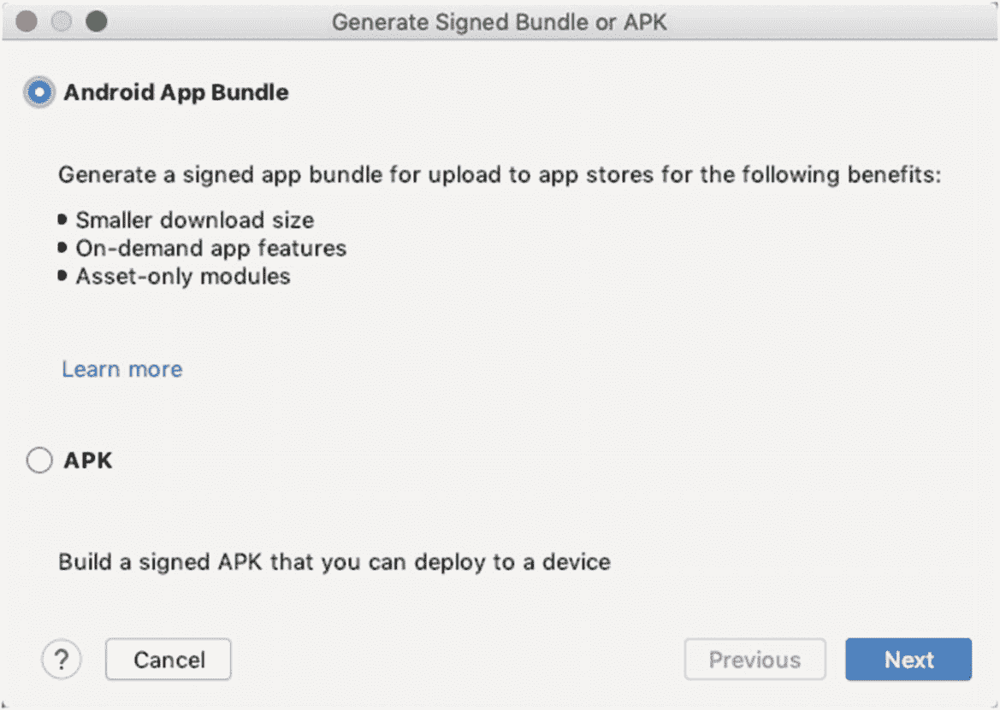
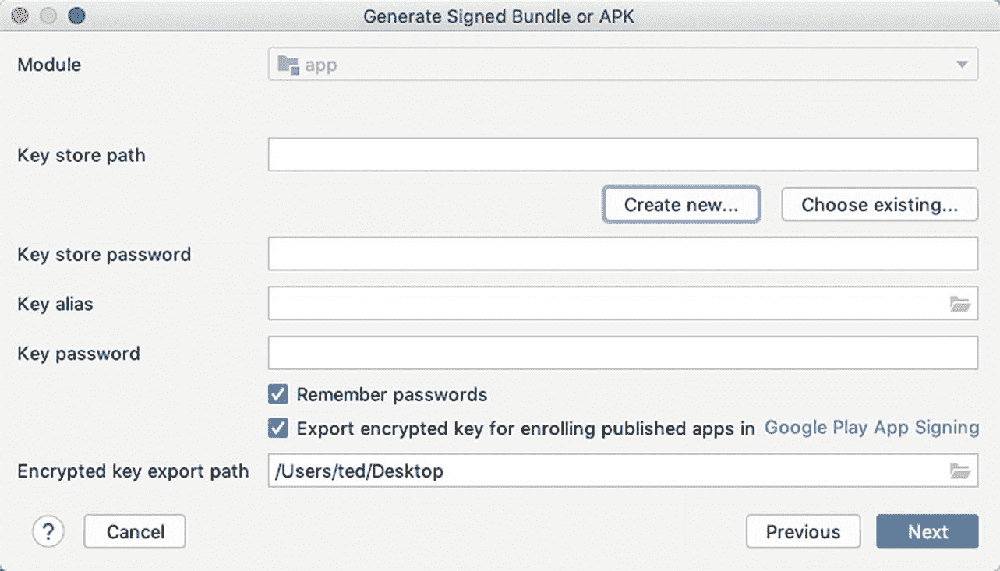
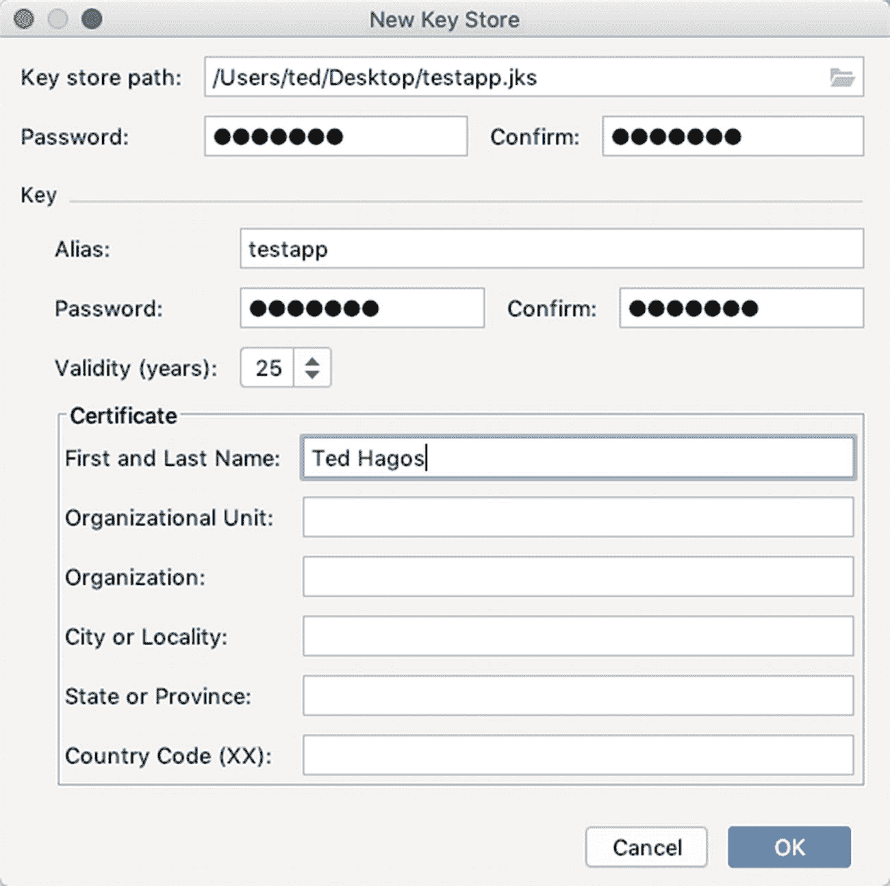
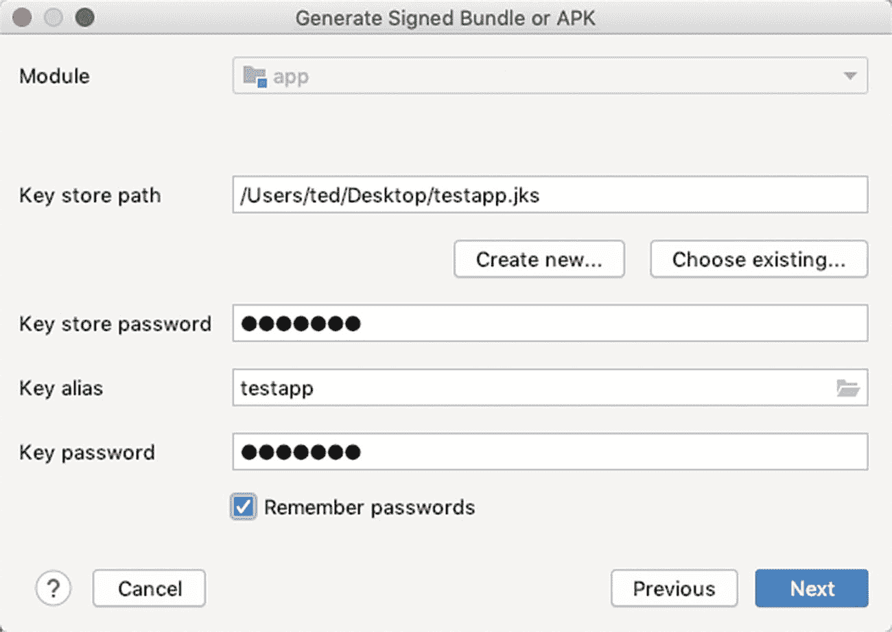
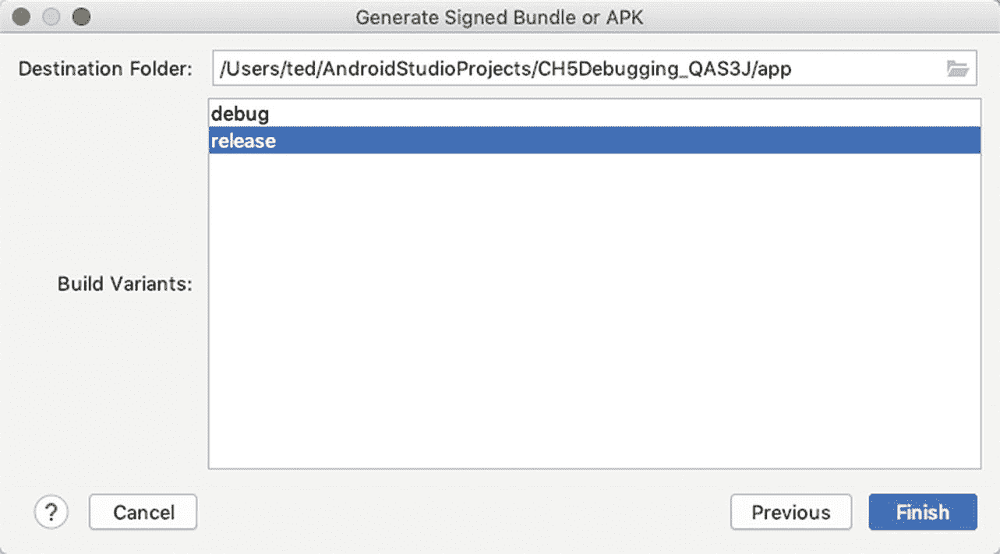
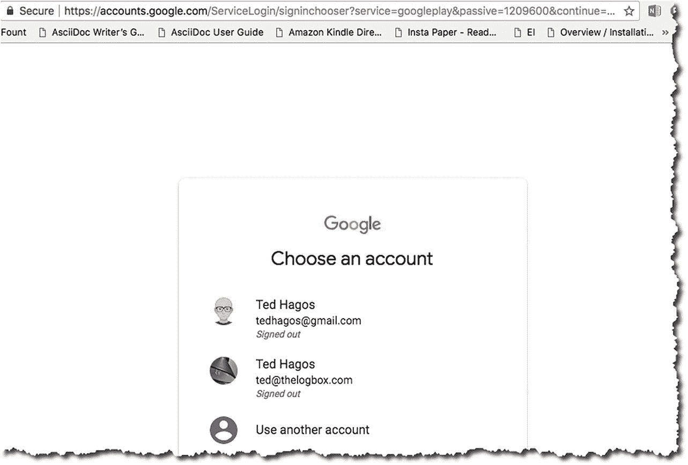
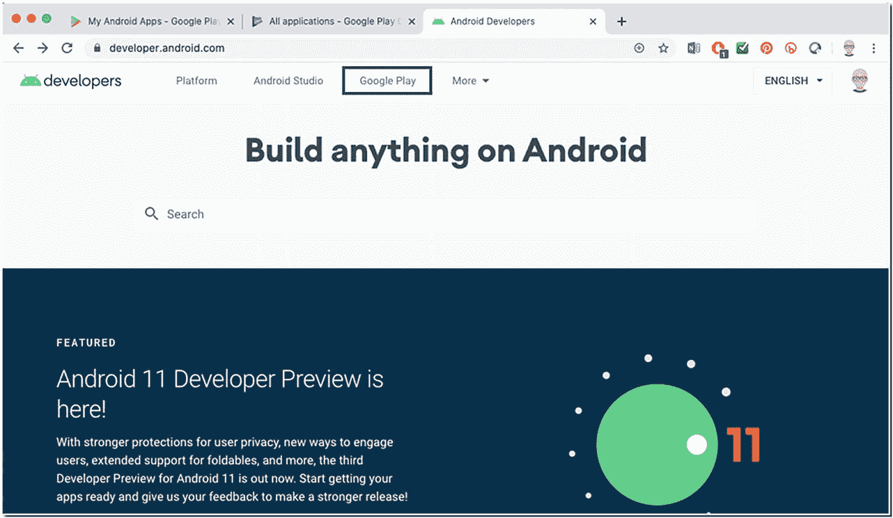
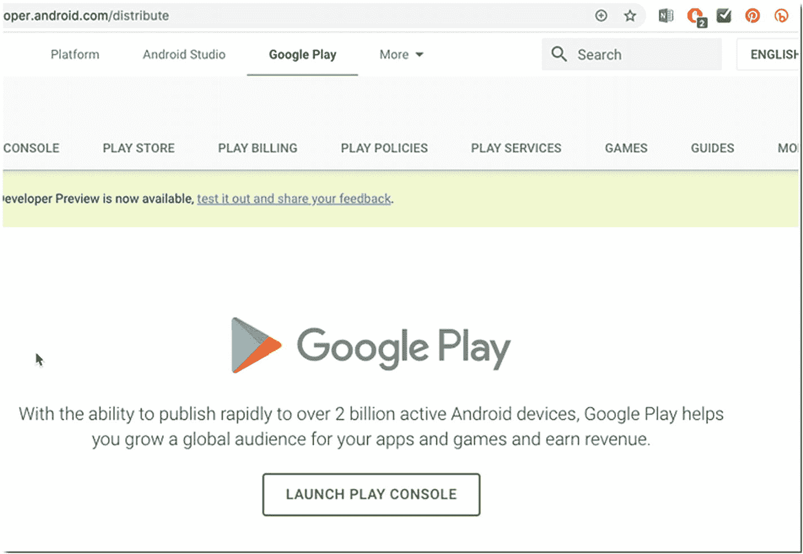
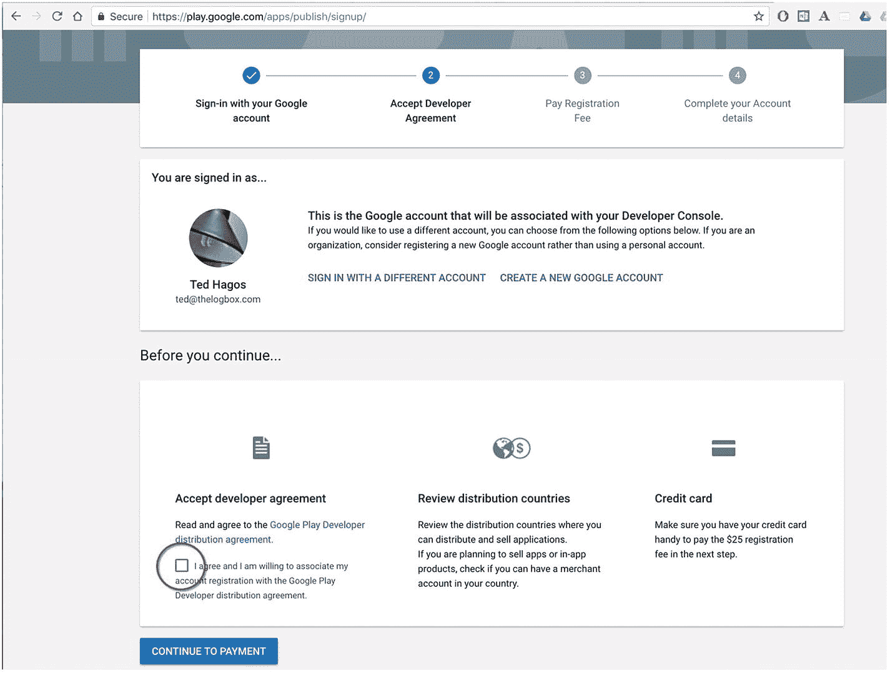
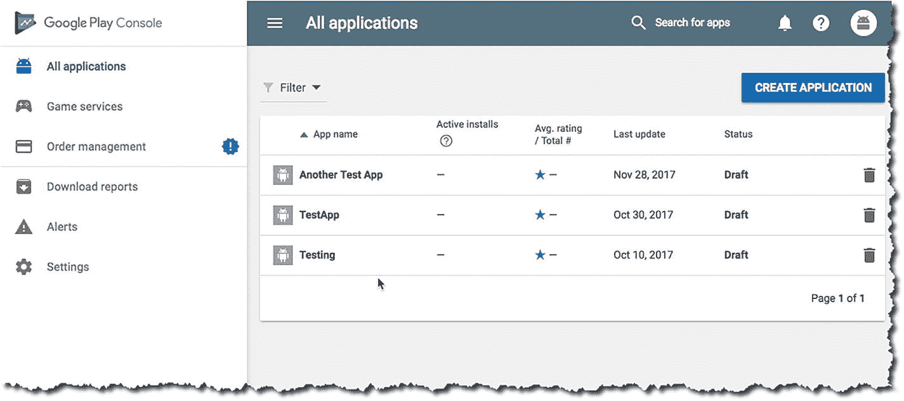

# 十一、发布游戏

你可以相当自由地发布你的游戏，没有太多的限制；你可以让你的用户从你的网站、Google Drive、Dropbox 等等下载；如果你愿意，你甚至可以把游戏《APK》直接发给用户；但许多开发者选择在谷歌或亚马逊这样的市场上分发他们的应用或游戏，以最大限度地扩大影响。

In this chapter, we’ll discuss the things you need to do to get your game out in Google Play. Here’s what we’ll cover:

*   准备发布

*   签署应用

*   谷歌游戏

*   应用捆绑包

<section class="Section1 RenderAsSection1" id="Sec1">

## 准备项目发布

There are three things you need to keep in mind when preparing for release; these are

*   准备发布的材料和资产

*   为发布配置项目

*   构建一个发布就绪的应用

<section class="Section2 RenderAsSection2" id="Sec2">

### 准备材料和资产用于发布

你的代码很棒，你甚至可能认为它很聪明，但是用户永远看不到它。他们将看到您的视图对象、图标和其他图形资产。你应该擦亮它们。

如果你认为应用的图标没什么大不了的，那可能是个错误。图标可以帮助用户识别您的应用，因为它位于主屏幕上。这个图标还出现在其他区域，如启动窗口和下载部分，更重要的是，它出现在 Google Play 上。图标在创造用户对你的游戏的第一印象中起着很大的作用。这是一个很好的主意，你可以在这里找到谷歌的图标指南:[【http://bit.ly/androidreleaseiconguidelines】](http://bit.ly/androidreleaseiconguidelines)。

如果你要在 Google market place 上发布，其他要考虑的是图形资产，比如屏幕截图和促销文本。请务必阅读谷歌的图形资产指南，可以在这里找到:[【http://bit.ly/androidreleasegraphicassets】](http://bit.ly/androidreleasegraphicassets)。

</section>

<section class="Section2 RenderAsSection2" id="Sec3">

### 配置要发布的应用

1.  1\.

    **Check the package name** —You may want to check the package name of the application. Make sure it is still not com.example.myapp .. Package name makes the application unique in Google marketplace; Once you decide the name of a bag, you can't change it again. So, think about it. T3】

2.  2\.

    **Processing debugging information** -Make sure that you have deleted the Android: Debugable attribute in the **< application >** tab of the manifest file.

3.  3\.

    **Delete the log statement** —Different developers will do different things. Some people will bother to check the code and delete statements manually. Some people will write sed or awk programs to delete log statements. Some people will use ProGuard, while others will use third-party tools, such as Timber, to deal with logging activities. Which one you will use depends on yourself; But make sure your users don't accidentally see the log information.

4.  4\.

    **Check the permissions of the application** —At some point in the development process, you may have tested some functions of the application, and you may have set permissions on the list, such as using the network and writing to external storage. Check the **< uses-permission >** label on the list to ensure that the game is not granted unnecessary permissions.

5.  5\.

    **Check the remote server and URL** —If the game depends on web APIs or cloud services, make sure that the release version uses the production URL instead of the test path. During the development process, you may have obtained the sandbox and test URLs, and you need to upgrade them to the production version.

</section>

<section class="Section2 RenderAsSection2" id="Sec4">

### 构建发布就绪的应用

During development, Android Studio did quite a few things for you; it

*   创建了调试证书

*   将项目的所有资产、配置文件和运行时二进制文件组装到一个 APK 中

*   使用调试证书签署了 APK

*   将 APK 部署到模拟器或连接的设备

这些事情都发生在背景；除了写代码，你不需要做任何其他事情。现在，你需要保管好那个证书。Google Play 和其他类似的市场不会发布带有调试证书的应用。它需要是一个适当的证书。不需要去 Thawte 或者 Verisign 这样的认证机构；自签名证书就足够了。此外，请确保保留该证书；当您对应用进行更新时，您需要使用相同的证书对其进行签名。

在接下来的步骤中，您将看到如何生成一个签名包或 APK；您已经知道什么是 APK——它是包含您的应用的包。而是你上传到 Google Play 的内容。另一方面，bundle 很像 APK，但它是一种更新的上传格式。像 APK 一样，它也包括所有应用的编译代码和资源，但它推迟了 APK 一代。这是 Google Play 的新应用服务模式，称为动态交付。它使用您的应用捆绑包为每个用户的设备配置生成和提供优化的 APK，因此他们只需下载运行您的应用所需的代码和资源。您不再需要构建、签署和管理多个 apk。

在 Android Studio 中，生成 APK 和 bundle 的步骤几乎相同。在下面的步骤中，我们将看到如何生成包和 APK。

Launch Android Studio, if you haven’t done so yet. Open the project, then from the main menu bar, go to **Build** ➤ **Generate Signed Bundle/APK**, as shown in Figure [11-1](#Fig1).

<figure class="Figure" id="Fig1">

<figcaption class="Caption" lang="en">Figure 11-1

生成签名的 APK

</figcaption>

</figure>

Choose either **Bundle** or **APK**, then click **Next**; in this example, I chose to create a bundle. When you click **Next**, you will see the “Keystore” dialog, as shown in Figure [11-2](#Fig2).

<figure class="Figure" id="Fig2">

<figcaption class="Caption" lang="en">Figure 11-2

密钥库对话框

</figcaption>

</figure>

The **Key store path** is asking where the Java Keystore (JKS) file is. At this point, you don’t have it yet. So, click **Create New**. You’ll see the dialog window for creating a new keystore, as shown in Figure [11-3](#Fig3).

<figure class="Figure" id="Fig3">

<figcaption class="Caption" lang="en">Figure 11-3

新密钥存储

</figcaption>

</figure>

Table [11-1](#Tab1) shows the description for the input items of the keystore.Table 11-1

密钥库项和描述

<colgroup><col class="tcol1 align-left"> <col class="tcol2 align-left"></colgroup> 
| 

密钥库项目

 | 

描述

 |
| --- | --- |
| 密钥库路径 | 要保存密钥库的位置。这完全取决于你。只要确保你记得这个位置 |
| 密码 | 这是密钥库的密码 |
| 别名 | 此别名标识密钥。这只是它的一个友好的名字 |
| (钥匙)密码 | 这是钥匙的密码。这与密钥库的密码**不同**(但是如果您愿意，也可以使用相同的密码) |
| 有效期，以年计 | 默认为 25 年；你可以接受默认值。如果在 Google Play 上发布，证书的有效期必须到 2033 年 10 月，所以 25 年应该没问题 |
| 其他信息 | 只有名字和姓氏字段是必需的 |

When you’re done filling up the New Key Store dialog, click OK. This will bring you back to the Generate Signed Bundle or APK window, as shown in Figure [11-4](#Fig4); but now, the JKS file is created and the Keystore dialog is populated with it.

<figure class="Figure" id="Fig4">

<figcaption class="Caption" lang="en">Figure 11-4

生成签名包或 APK，填充

</figcaption>

</figure>

Click Next. Now we choose the destination of the signed bundle as shown in Figure [11-5](#Fig5).

<figure class="Figure" id="Fig5">

<figcaption class="Caption" lang="en">Figure 11-5

签名 APK APK 目的地文件夹

</figcaption>

</figure>

你需要记住“目标文件夹”的位置，如图 [11-5](#Fig5) 所示。这是 Android Studio 存储签名包的地方。同样，确保**构建变体**被设置为“发布”

当您点击完成时，Android Studio 将为您的应用生成签名包。这是您将提交给 Google Play 的文件。

</section>

</section>

<section class="Section1 RenderAsSection1" id="Sec5">

## 发布应用

Before you can submit an app to Google Play, you’ll need a developer account. If you don’t have one yet, you can sign up at [https://developer.android.com](https://developer.android.com). There’s a lot of assumptions I’m making about the next activities. I’m assuming that

1.  1\.

    You already have a Google account (Gmail).

2.  2 .

    范思哲，范思哲，范思哲[【https://developer . Android . com】](https://developer.android.com)。

3.  3\.

    Your Google account is logged into Chrome.

If your Google account isn’t logged in to Chrome, you might see something like Figure [11-6](#Fig6). Chrome will ask you to go select an account (or create one).

<figure class="Figure" id="Fig6">

<figcaption class="Caption" lang="en">Figure 11-6

选择一个账户

</figcaption>

</figure>

When you get your Google account sorted out, you’ll be taken to the **developer.android.com** website, as shown in Figure [11-7](#Fig7).

<figure class="Figure" id="Fig7">

<figcaption class="Caption" lang="en">Figure 11-7

developer.android.com

</figcaption>

</figure>

点击 **Google Play** ，如图[11-7](#Fig7)T5。

Click **Launch Play Console**, as shown in Figure [11-8](#Fig8).

<figure class="Figure" id="Fig8">

<figcaption class="Caption" lang="en">Figure 11-8

启动游戏控制台

</figcaption>

</figure>

You need to go through four steps to complete the registration, (shown in Figure [11-9](#Fig9)):

*   使用您的 Google 帐户登录。

*   接受开发者协议。

*   交报名费。

*   填写您的帐户详细信息。

<figure class="Figure" id="Fig9">

<figcaption class="Caption" lang="en">Figure 11-9

Google Play 控制台，注册

</figcaption>

</figure>

Once you have completed the registration and payment, you will now have access to the Google Play Console, as shown in Figure [11-10](#Fig10).

<figure class="Figure" id="Fig10">

<figcaption class="Caption" lang="en">Figure 11-10

播放控制台

</figcaption>

</figure>

您可以从这里开始向商店提交应用的流程。单击“创建应用”按钮开始。

</section>

<section class="Section1 RenderAsSection1" id="Sec6">

## 关键要点

*   在用户体验你的游戏之前，他们会先看到图标和其他图形资产——确保图形资产和你的代码一样完美。

*   在构建一个版本之前，去掉代码中的所有调试信息和日志语句。

*   对你自己的工作进行代码审查。如果你有伙伴或者其他人可以和你一起审查代码，那就更好了。如果您的应用使用服务器、RESTful URLs 等等，请确保它们是生产就绪的，而不是沙箱。

*   在将你的应用上传到 Google Play 之前，你需要使用适当的证书对你的应用进行签名。

*   如果你想在 Google Play 上销售你的应用，你需要一个 Google Play 帐户。我一次性支付了 25 美元的费用。

*   别忘了在真实的设备上测试游戏，尽可能多的种类和大小。

</section>