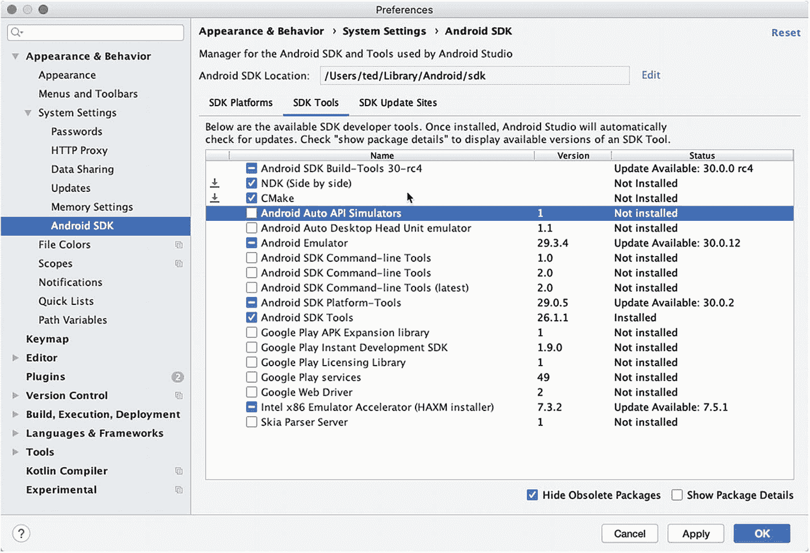
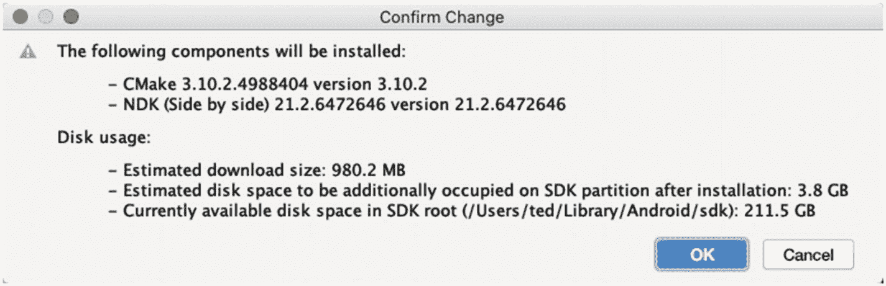
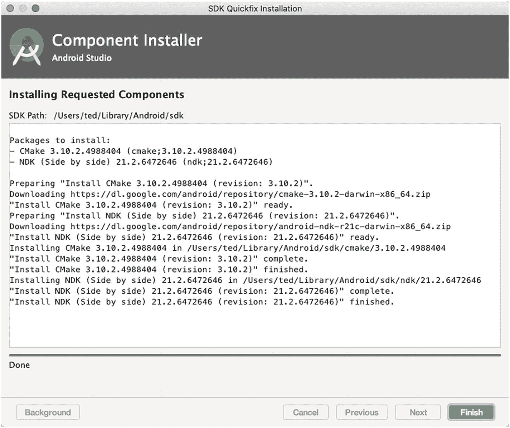
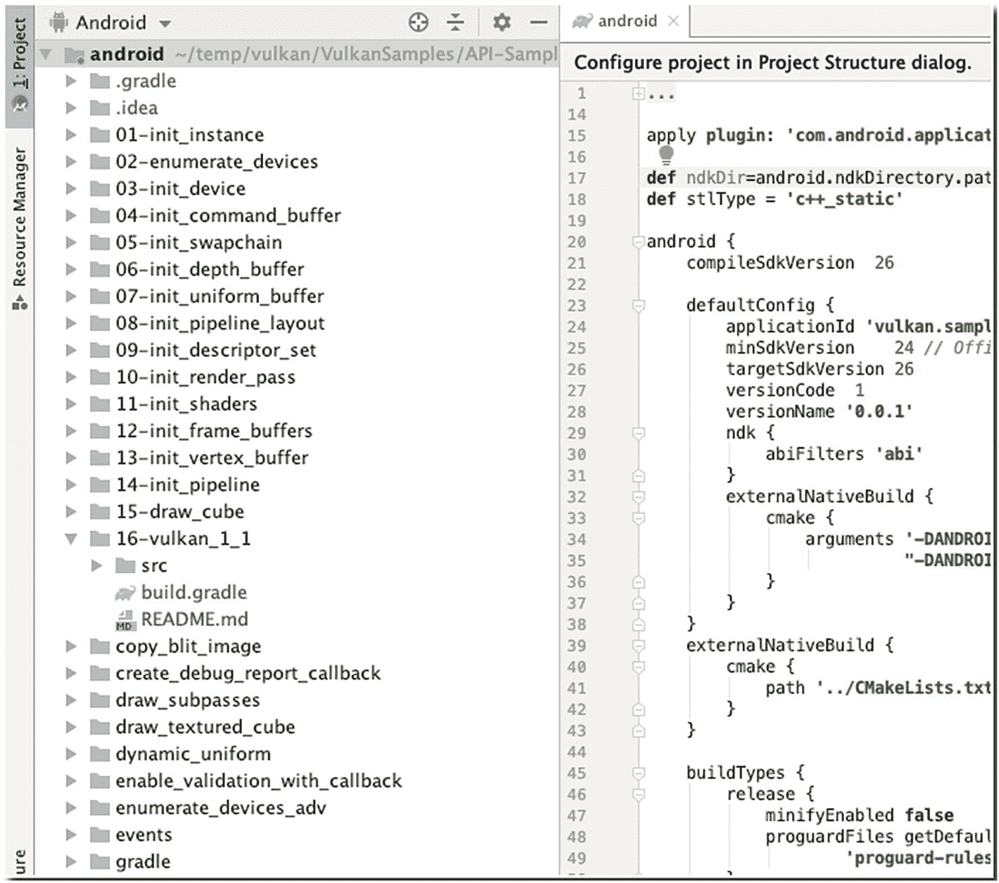
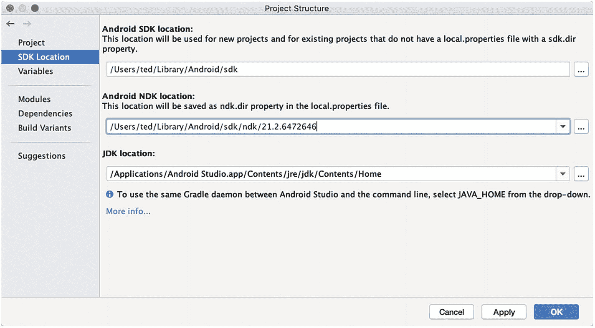
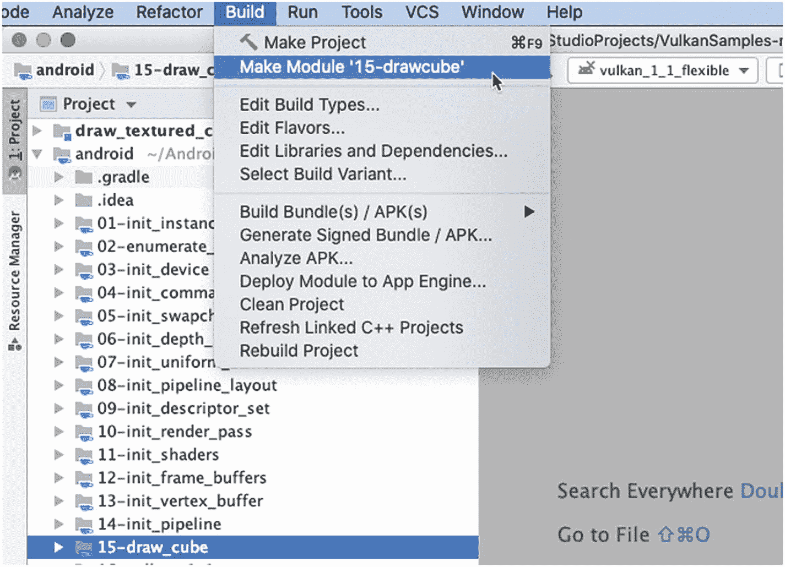
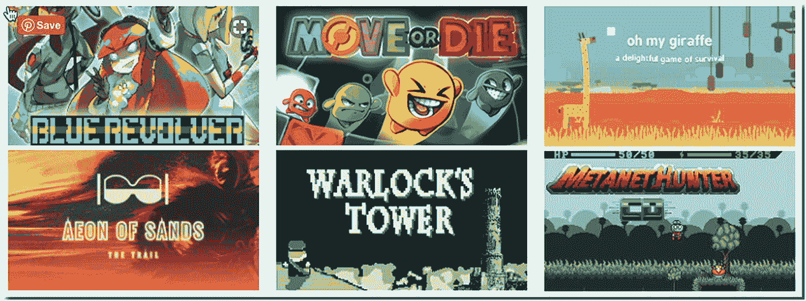

# 十二、下一步是什么

在学习了 11 章 Android 编程的基础知识、Android Studio、一些游戏开发的理论以及两个从零开始构建的游戏之后，我们正准备做出结论。

我相信你从零开始制作这两款游戏后，已经获得了一些新的自信。当你看到你的作品在模拟器或设备上运行时，那是一种温暖的感觉；但是游戏编程的学习曲线很陡。如今，对游戏质量的要求已经很高了。

In this chapter, we’ll look at some areas of interest that you can add to your game programming arsenal. We’ll cover the following:

*   安卓 NDK

*   Vulkan 简介和基本设置

*   游戏引擎和游戏框架

<section class="Section1 RenderAsSection1" id="Sec1">

## 安卓 NDK

你在游戏编程中会遇到的相当多的游戏资源、库、框架甚至引擎都是用 C 或 C++编写的。因此，您需要知道如何很好地使用这些库和语言本身。Android 有办法与 C/C++并肩工作。那是 NDK，是本地开发工具包的缩写。

NDK 是 Android SDK 的一个补充，它让你可以编写 C/C++和汇编代码，然后集成到你的 Android 应用中。NDK 包括一组特定于 Android 的 C 库，一个基于 GNU 编译器集合(GCC) 的交叉编译器工具链，它可以编译 Android 支持的所有不同的 CPU 架构(ARM、x86 和 MIPS)，以及一个定制的系统([【https://developer.android.com/ndk/guides/ndk-build](https://developer.android.com/ndk/guides/ndk-build))，与编写自己的 make 文件相比，它应该会使编译 C/C++代码更容易。

NDK 没有公开大多数 Android APIs，比如 UI 工具包。它主要是为了加速一些代码，这些代码可以通过用 C/C++编写并在 Java 中调用它们而受益。从 Android 2.3 开始，使用 NativeActivity 类代替 Java activities，几乎可以完全绕过 Java。NativeActivity 类是专门为全窗口控制的游戏设计的，但它根本不提供对 Java 的访问，所以它不能与其他基于 Java 的 Android 库一起使用。许多来自 iOS 的游戏开发人员选择这条路线，因为这让他们可以重用 Android 上的大部分 C/C++，而不必深入研究 Android Java APIs。然而，脸书认证或 ads 等服务的集成仍然需要用 Java 来完成，因此将游戏设计为在 Java 中启动并通过 JNI (Java 本地接口)调用 C++通常是最首选的方式。也就是说，如何使用 JNI 呢？

JNI 是让虚拟机与 C/C++代码通信的一种方式。这是双向的；可以从 Java 调用 C/C++代码，也可以从 C/C++调用 Java 方法。Android 的许多库使用这种机制来公开本机代码，如 OpenGL ES 或音频解码器。

Once you use JNI, your application consists of two parts: Java code and C/C++ code. On the Java side, you declare class methods to be implemented in native code by adding a special qualifier called native. The code could look like the one in Listing [12-1](#PC1).class NativeSample {public native void doSomething(String a);}Listing 12-1

原生样本. java

如您所见，我们声明的方法没有方法体。当运行 Java 代码的 JVM 在方法上看到这个限定符时，它知道相应的实现是在共享库中找到的，而不是在 JAR 文件或 APK 文件中。

共享库非常类似于 Java JAR 文件。它包含编译的 C/C++代码，任何加载这个共享库的程序都可以调用这些代码。在 Windows 上，这些共享库通常带有后缀。dll 在 Unix 系统上，它们以. so 结尾。

On the C/C++ side, we have a lot of header and source files that define the signature of the native methods in C and contain the actual implementation. The header file for our class in the preceding code would look something like Listing [12-2](#PC2)./* DO NOT EDIT THIS FILE - it is machine generated */#include <jni.h>/* Header for class NativeSample */#ifndef _Included_NativeSample#define _Included_NativeSample#ifdef __cplusplusextern "C" {#endif/** Class: NativeSample* Method: doSomething* Signature: (Ljava/lang/String;)V*/JNIEXPORT void JNICALL Java_NativeSample_doSomething(JNIEnv *, jobject, jstring);#ifdef __cplusplus}#endif#endifListing 12-2

NativeSample.h .原始样本

Before Java 10, programmers used **javah** to generate header files like the preceding code, but **javah** became obsolete when Java 10 came about. To generate this header files for JNI, we now usejavac NativeSample.java -h .

该工具将一个 Java 类作为输入，并为它找到的任何本机方法生成一个 C 函数签名。这里发生了很多事情，因为 C 代码需要遵循特定的命名模式，并且需要能够将 Java 类型封送到它们对应的 C 类型(例如，Java 的 int 变成了 C 中的 jint)。我们还获得了 JNIEnv 和 jobject 类型的两个附加参数。第一个可以被认为是虚拟机的句柄。它包含与 VM 通信的方法，比如调用类实例的方法。第二个参数是调用该方法的类实例的句柄。我们可以将它与 JNIEnv 参数结合使用，从 C 代码中调用这个类实例的其他方法。

当然，您仍然需要编写实际实现该函数的 C 源文件，并在 Java 代码可以使用它之前编译它。

To install the NDK, you need to go to the SDK manager. If you have an open project in Android Studio, go to Preferences or Settings (Windows and Linux); then choose Android SDK, then check the boxes **NDK (Side by side)** and **CMake**, as shown in Figure [12-1](#Fig1), then click OK.

<figure class="Figure" id="Fig1">

<figcaption class="Caption" lang="en">Figure 12-1

安装 CMake 和 NDK (并排)

</figcaption>

</figure>

In the window that follows (Figure [12-2](#Fig2).), click OK to confirm the change and proceed.

<figure class="Figure" id="Fig2">

<figcaption class="Caption" lang="en">Figure 12-2

确认更改

</figcaption>

</figure>

In the window that follows (Figure [12-3](#Fig3)), click Finish.

<figure class="Figure" id="Fig3">

<figcaption class="Caption" lang="en">Figure 12-3

组件安装程序

</figcaption>

</figure>

现在，您已经准备好在您的项目中使用 NDK 了。

</section>

<section class="Section1 RenderAsSection1" id="Sec2">

## 瓦肯

Vulkan 是 Khronos 小组(也是给了我们 OpenGL 的小组)的新 API，它为现代图形卡提供了更好的抽象。这个新接口允许我们更好地描述应用的意图，与现有的 API(如 OpenGL 和 Direct3D)相比，这可以带来更好的性能和更少令人惊讶的驱动程序行为。Vulkan 背后的想法类似于 **Direct3D** 12(只能在 Windows 上使用)和 **Metal** (只能在苹果生态系统上使用的图形 API)，但 Vulkan 的优势是完全跨平台，允许你同时为 Windows、Linux 和 Android 开发。

这些好处的代价是我们必须使用一个更加冗长的 API。与图形 API 相关的每个细节都需要由您的应用从头开始设置，包括初始帧缓冲区创建和缓冲区和纹理图像等对象的内存管理。图形驱动程序将会减少很多手持操作，这意味着我们需要在应用中做更多的工作来确保正确的行为。

Vulkan 可能不适合所有人。如果你对高性能显卡着迷，并愿意投入一些工作，这可能是你的拿手好戏。另一方面，如果你对游戏开发而不是计算机图形更感兴趣，你可以一直使用 OpenGL ES——它不会很快被弃用而支持 Vulkan。

Android 平台包括一个特定于 Android 的 Vulkan API 实现。

To get started with Vulkan on Android, you can download the LunarG Vulkan repository. You’ll need to download the project from GitHub. You can simply download the git file from [https://github.com/LunarG/VulkanSamples](https://github.com/LunarG/VulkanSamples). Click the “Clone or download” button as shown in Figure [12-4](#Fig4).

<figure class="Figure" id="Fig4">

<figcaption class="Caption" lang="en">Figure 12-4

VulkanSamples.git

</figcaption>

</figure>

Or use git on a command line, like this (this was done on a Mac; same commands will work on Linux):mkdir vulkancd vulkangit clone --recursive https://github.com/LunarG/VulkanSamples.gitcd VulkanSamples/API-Samplescmake -DANDROID=ON -DABI_NAME=abicd androidpython3 compile_shaders.pyNote

如果你还没有 Python 3，你需要在你的系统上安装它。可以从 Python 网站[www.python.org/downloads/](https://www.python.org/downloads/)获取。

Next, open Android Studio, if you haven’t launched it yet. Choose **File** ➤ **Open** and select VulkanSamples/API-Samples/android/build.gradle. The project looks like the window shown in Figure [12-5](#Fig5).

<figure class="Figure" id="Fig5">

<figcaption class="Caption" lang="en">Figure 12-5

项目窗格显示导入后的个样本

</figcaption>

</figure>

We need to configure the SDK and NDK directories; to do that, go to **File** ➤ **Project Structure** and then ensure that the SDK and NDK locations are set (as shown in Figure [12-6](#Fig6)).

<figure class="Figure" id="Fig6">

<figcaption class="Caption" lang="en">Figure 12-6

项目结构、NDK 和 SDK

</figcaption>

</figure>

如果您的 NDK 尚未设置，请单击下拉箭头(省略号附近，右侧的三个点)。下拉菜单应该建议推荐的目录。如果 Android Studio 没有建议的目录，你需要检查你是否已经安装了 NDK。请参阅本章前面几节中关于 NDK 安装的讨论。

You can now compile the individual modules in the project. Select the project you want to compile in the Project tool window, as shown in Figure [12-7](#Fig7).

<figure class="Figure" id="Fig7">

<figcaption class="Caption" lang="en">Figure 12-7

制作模块

</figcaption>

</figure>

From the Build menu, choose Make Module **<module name>**. Resolve any dependency issues, then compile. Most of the samples have simple functionality. The drawcube example is one of the visually interesting examples (shown in Figure [12-8](#Fig8)).

<figure class="Figure" id="Fig8">

<figcaption class="Caption" lang="en">Figure 12-8

drawcube 模块

</figcaption>

</figure>

这些关于如何在 Android 中设置 Vulkan 环境的说明来自 Android 开发网站([)https://developer . Android . com/ndk/guides/graphics/getting-started](https://developer.android.com/ndk/guides/graphics/getting-started))；本书付印时，说明可能会改变；因此，在设置 Vulkan 环境时，请务必访问该页面。

</section>

<section class="Section1 RenderAsSection1" id="Sec3">

## 游戏引擎和框架

在第六章和 [第七章](07.html) 中，你只看到了一个游戏开发者生活的一小部分，因为我们制作了两个小游戏，但我们是从零开始制作的。尽管游戏的规模不是很大，但就代码行和资产而言，我们必须做所有的事情。我们必须告诉程序从哪里获取图形文件，将它们加载到屏幕上的特定坐标，在游戏中的特定时间播放一些音频，等等。这就像用牙刷粉刷房子一样——是的，你对游戏的每个方面都有很大的控制权，但这也是很大的工作量。你可以打赌，你玩过的大多数 AAA 游戏都不是那样构建的。

大多数现代游戏要么使用游戏框架，要么使用游戏引擎。游戏引擎是一个完整的包。这是一套全面的工具，帮助您从头开始构建游戏。引擎通常包含一些场景或关卡编辑器，导入游戏资源(模型，纹理，声音，精灵等)的工具。)、动画系统以及对游戏逻辑进行编程的脚本语言或 API。您仍然需要编写代码来使用引擎，但是大部分代码将集中在游戏逻辑上。游戏引擎将为您提供系统级样板代码。

Android SDK 为游戏提供了一个不错的框架。还记得我们使用视图对象和 ImageView 对象吗？Android SDK 也提供了一些不错的支持，所以我们可以处理事件，让窗口达到最大尺寸，并在屏幕上绘制一些基本的图形。这些是框架要做的事情；但是除了 Android SDK 提供的框架之外，还有其他框架。

说实话，你并不真的需要游戏引擎，也不需要框架；但是在游戏编程过程中，它们确实让你的生活变得容易多了。在没有引擎或框架的情况下，构建一个不平凡的游戏可能是艰巨而危险的。如果你的最终目标是构建一个游戏，考虑使用第三方工具会更好。

外面有许多框架和引擎；我只编译了那些包含 Android 作为目标平台的应用；并不是所有的公司都会使用 Java 或 Android SDK 进行开发。你应该记住，这个列表并不全面，但它应该让你开始。

<section class="Section2 RenderAsSection2" id="Sec4">

### 结构

HaxeFlixel 。【http://haxeflixel.com/】

这是一个 2D 游戏框架。您可以在 HTML5、Android、iOS 和桌面上部署它。如果你不介意学习 Haxe 语言，你可以试试这个。

**勒夫**。[【https://love 2d . org/](https://love2d.org/)

It’s also a 2D framework. You’ll have to use the Lua language, but you can deploy it on Android, iOS, Linux, macOS, and Windows. This framework has already been used on some commercial games; check out Figure [12-9](#Fig9).

<figure class="Figure" id="Fig9">

<figcaption class="Caption" lang="en">Figure 12-9

用 love 完成的商业游戏

</figcaption>

</figure>

**一夫一妻制**。【www.monogame.net/】

这是另一个针对 iOS、Windows、Android、macOS、PS4、PSVita、Xbox One 和 Switch 的 2D 框架。使用的语言是 C#(它与 Java 有很多语言元素的相似之处)。

</section>

<section class="Section2 RenderAsSection2" id="Sec5">

### 发动机

**Cocos2D** 。【http://cocos2d.org/】

这是一个针对 Android(开发中)、PC、macOS 和 iOS 的 2D 引擎。根据您的平台，您必须使用 C++、C#或 Objective-C。

铜立方体。[【www . ambira . com/copper cube】](https://www.ambiera.com/coppercube)

这是一个 3D 引擎，你可以用它来运行在 Windows、macOS、Android 和网络上的游戏。它支持 C++、JavaScript 和可视化脚本语言。

**去折叠**。【www.defold.com/】

如果你不介意使用 Lua 语言，你可以用这个 2D 引擎来瞄准 Windows、macOS、Linux、iOS、Android 和 HTML。

**埃森瑟尔**。【www.esenthel.com/】

这是一个面向 Windows、Xbox、Mac、Linux、Android、iOS 和 Web 的 2D/3D 引擎。你必须用 C++编写代码。

**GameMaker Studio 2** 。【www.yoyogames.com/】

这是一个针对 Windows，Mac，Android，iOS，Windows Phone 8，HTML5，Ubuntu，Tizen 和 Windows UWP 的商业 2D 引擎。它使用一种叫做 GML 的定制语言。有一个免费(但有限)的试用。

**团结**。[【http://unity 3d . com/](http://unity3d.com/)

这是一个面向 Windows、macOS、Linux、HTML5、iOS、Android、PS4、XB1、N3DS、Wii U 和 Switch 的 2D/3D 引擎。C#是这里的首选语言。这是免费使用，直到第一个 100，000 美元的收入。查看他们的网站了解更多详情。

**虚幻引擎 4** 。【www.unrealengine.com/】

你可以针对 Windows，iOS，Mac，PS4，XB1，Switch，HTML5，HoloLens，鲁珉，Android 和 Linux。这是一个 2D/3D 引擎。你必须使用 C++或者 Blueprints 可视化脚本(JavaScript 语言可以和一些插件一起使用)。在该项目盈利超过 100 万美元之前，它是免费使用的。查看网站了解更多详情。

</section>

</section>

<section class="Section1 RenderAsSection1" id="Sec6">

## 关键要点

在这最后一章，我们学习了一些关于 NDK、Vulkan 和游戏引擎和框架的知识。游戏编程是个大话题；我们只是触及了这本书的表面。我希望你继续你的旅程，构建有趣和引人入胜的游戏。愿原力与你同在！

</section>