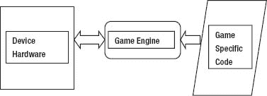
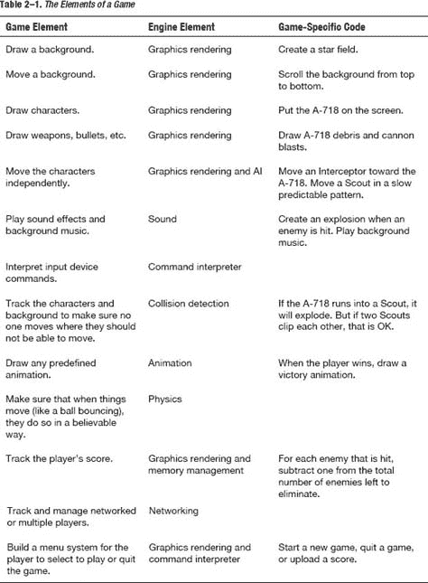
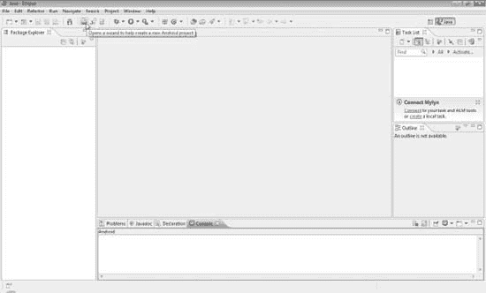
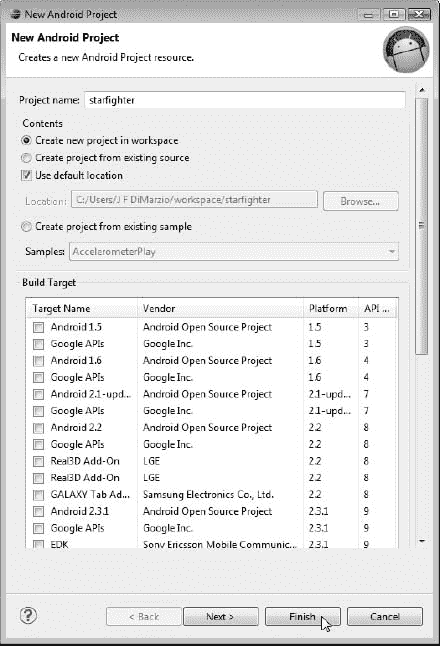
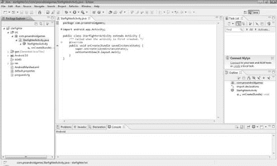

# 二、星际战士：一个二维射击游戏

在你阅读这本书的过程中，你将创建的游戏是*星际战士*。*星际战士*是一款二维、自上而下、滚动的射击游戏。尽管动作相当有限，故事却出人意料地详细。在这一章中，你会先睹为快这个游戏以及它背后的故事。您还将了解游戏引擎的不同部分以及游戏引擎的功能。

### 讲述*星际战士*的故事

星际战士的故事如下:在我们阅读本书的过程中，我们会定期引用它:

约翰·斯塔克上尉是一名头发斑白的银河战争老兵。他从行星联盟卷入的每一场战斗中杀出一条血路。现在，在他返回地球的途中，准备从多年的服务退休到马萨诸塞州西部的一个安静的小农场，他发现自己陷入了一个突然的敌人入侵部队的中间。

斯塔克上尉准备战斗。但这不是普通的科达克入侵舰队；有些事情不一样了。

斯塔克启动了他的 AF-718 的推进器，并设置他的枪自动开火。幸运的是，AF-718 轻便灵活。只要他能避开敌人的炮火和偶尔的碰撞，自动加农炮应该能很快解决体型较小的科达克战士。

不幸的是，AF-718 拥有敏捷和自动射击能力，但它缺少护盾。斯塔克上尉最好避开敌人的飞船。如果他受到任何伤害，三击之后，他就出局了。没有好的护盾，AF-718 无法承受太多的直接爆能攻击。至于来自敌人的直接碰撞，不幸的是，对斯塔克上尉来说是“一劳永逸”的。

当 Starke 船长在一波又一波的敌舰中航行时，他可能会幸运地发现一些其他被摧毁的 AF-718 的残骸——最后一批被入侵部队突袭的伤员。只要他不在途中被摧毁，斯塔克上尉可能会找到这些零件的用处。

AF-718 有一个非常有用的功能，可以在战斗中帮助斯塔克上尉。AF-718 的最新版本，专门为最后的 Centelum Prime Rebellion 制造，配备了自我修复模式。如果斯塔克上尉遇到麻烦，他失去了护盾，或者发现他需要更多的火力，他所需要做的就是驾驶他的飞船到一些 AF-718 部件那里，这些部件在战场上四处漂流。他应该能够获得任何东西，从更强的护盾，可以使他的飞船承受的伤害增加一倍或三倍，到更强的火炮，速度更快，需要更少的打击来摧毁敌人。

斯塔克机长和他的 AF-718 并不是唯一有锦囊妙计的人。Kordark 入侵舰队由三艘不同的船组成:

*   Kordark Scout(黑暗侦察兵)
*   科尔达克截击机
*   拉腊什战舰

Kordark 侦察兵是入侵舰队中数量最多的船只。它们速度很快——就像斯塔克机长的 AF-718 一样快。侦察兵以快速但可预测的方式飞行。这应该使他们更容易识别，甚至更容易预测。对斯塔克来说是件好事，在将侦察兵的所有能量转移到他们的推力引擎上时，科达克给了他们非常弱的护盾。AF-718 的一次好的爆炸应该足以干掉一架科达克侦察机。他们在船的前部安装了一门爆炸加农炮，可以缓慢地发射单轮炮弹。一些快速射击和快速导航应该能让 AF-718 脱离危险，并给斯塔克上尉足够的筹码去摧毁一架侦察机。

另一方面，科达克截击机是非常直接和蓄意的敌人。他们将缓慢但直接飞向斯塔克机长的 AF-718。截击机是无人驾驶的，被用作计算机制导的攻城锤。他们被设定为一旦锁定敌人的位置就干掉所有的敌人。

拦截者被建造来穿透庞大的行星联盟战斗巡洋舰的坚固外壳。因此它们的护盾非常坚固。AF-718 最好的武器可以轻易的直接命中四次来阻止它。在这种情况下，斯塔克上尉最好的进攻就是防守。Kordark 拦截器很早就锁定了它的目标，一旦锁定，它的程序就不会中断它的路径。如果斯塔克上尉在一个安全区域，他应该可以在快速截击机接触之前离开。如果幸运的话，他可以用他的大炮摧毁一两个，但是这需要一定的技巧。

Starke 船长将要面对的最后一种敌人是 Larash 战舰。

拉腊什战舰的出现使得这支入侵舰队不同于以往任何一个斯塔克上尉。拉腊什战船和科达克截击机一样坚固，但是它们也有面向前方的火炮，就像侦察兵一样。他们可以随机机动，应该会给斯塔克上尉最大的挑战。对他来说幸运的是，这些战舰相对较少，让他有时间在两次露面之间进行休整。

AF-718 的电脑会追踪入侵部队中有多少艘船。当斯塔克上尉消灭了所有潜在的敌人后，它会通知他。这些统计数据将被发送到地球上的前方指挥部，让他们知道他对入侵的排名。

帮助斯塔克上尉消除尽可能多的入侵力波，并活着到达地球。

这就是你将被称为代号星际战士的故事。你能从这个故事中得出什么游戏细节？让我们把它们列出来，就像我们在第一章中为示例故事所做的那样:

*   主角约翰·斯塔克船长将驾驶 AF-718 宇宙飞船。
*   玩家不需要操作任何开火装置，因为这艘船有自动开火的功能。
*   玩家可以通过获得更多的盾牌和枪来增强力量。
*   如果玩家被敌人的大炮击中三次而没有修复，游戏将结束。
*   如果游戏被敌方飞船直接击中，游戏将会结束。
*   有三种不同类型的敌舰:
    *   侦察兵以可预测的模式快速移动并发射一门加农炮。
    *   截击机没有加农炮，但是可以承受玩家的四次直接爆能攻击。一旦他们锁定了玩家的位置，他们就不能改变他们的路线
    *   战舰有加农炮，可以承受四次直接爆能攻击。它们以随机的模式移动
*   游戏会追踪每一波的敌人数量。玩家每消灭一个，计数器就减一，直到这波结束。
*   分数将被上传到一个中心区域。

这听起来将会是一个非常有趣、令人兴奋和详细的游戏。最棒的是，创建这个游戏所需的代码不会那么复杂，或者至少不会像你想象的那么复杂。

在下一节中，你将了解到*星际战士*的游戏引擎。你将会学到游戏引擎的不同部分是什么，以及引擎作为一个整体为你的游戏做了什么。最后，你将开始剔除一些基本的引擎功能，并开始构建你的游戏。

### 是什么造就了一款游戏？

既然你已经知道*星际战士*将会是什么，我们可以开始看看构建游戏所需要的不同部分。许多部分都必须以一种非常紧密和有凝聚力的方式组合在一起，才能创造出一个可玩的、令人愉快的 Android 游戏。

当你想到一个游戏为了提供一个真正令人愉快的体验所必须做的一切时，你会开始欣赏它所花费的时间和努力，即使是最简单的游戏。一个典型的游戏会做以下事情:

*   画一个背景。
*   根据需要移动背景。
*   绘制任意数量的字符。
*   抽取武器、子弹和类似物品。
*   独立移动角色。
*   播放音效和背景音乐。
*   解释输入设备的命令。
*   跟踪人物和背景，以确保没有人移动到他们不应该移动的地方。
*   绘制任何预定义的动画。
*   确保当物体移动时(比如球弹跳)，它们以可信的方式运动。
*   跟踪玩家的分数。
*   跟踪和管理网络或多个球员。
*   建立一个菜单系统，让玩家选择玩或退出游戏。

这可能不是一个全面的列表，但它是大多数游戏所做的所有事情的一个相当好的列表。一个游戏是如何完成列表中的所有事情的？

出于本书的目的，我们可以将游戏中的所有代码分为两类:游戏引擎和特定于游戏的代码。前面列表中的所有内容都在这两类代码中的一类或两类中处理。知道哪个在哪里处理对于理解本书中的技能是至关重要的。让我们从游戏引擎开始研究这两类代码。

#### 了解游戏引擎

每个视频游戏的核心都是游戏引擎。顾名思义，游戏引擎就是为游戏提供动力的代码。每一款游戏，不管是什么类型的——RPG，第一人称射击游戏(FPS)，平台游戏，甚至是即时战略游戏(RTS)——都需要一个引擎来运行。

**注意:**任何游戏的引擎都是通用的，允许它在多种情况下使用，并且可能用于多种不同的游戏。这与游戏专用代码是直接对立的，顾名思义，游戏专用代码是特定于一个游戏且只针对一个游戏的代码。

一个非常流行的游戏引擎是虚幻引擎。虚幻引擎最初是由 Epic 在 1998 年左右为其 FPS 开发的，名为虚幻，已经在数百款游戏中使用。虚幻引擎很容易适应各种游戏类型，而不仅仅是第一人称射击游戏。这种通用结构和灵活性使得虚幻引擎不仅受到专业人士的欢迎，也受到临时开发人员的欢迎。

一般来说，游戏引擎处理游戏代码的所有繁重工作。这可能意味着从播放声音到在屏幕上呈现图形的任何事情。这里是一个典型的游戏引擎将执行的功能的简短列表。

*   图形渲染
*   动画
*   声音
*   冲突检出
*   人工智能
*   物理学(非碰撞)
*   线程和内存管理
*   建立关系网
*   命令解释程序

为什么你需要一个游戏引擎来完成所有这些工作？简而言之，对于一个高效运行的游戏来说，它不能依赖主机系统的 OS 来完成这种繁重的工作。是的，大多数操作系统都有内置功能来处理列表中的每一项。然而，操作系统的渲染、声音和内存管理系统是为了运行操作系统和适应任何数量的不可预测的使用而构建的，而不是专门针对任何一个。如果你正在编写商业应用程序，这很好，但是如果你正在编写游戏，这就不那么好了。游戏需要更强大的东西。

为了让游戏流畅快速地运行，代码需要绕过标准操作系统产生的开销，直接在特定进程所需的硬件上运行。也就是说，游戏应该直接与图形硬件通信以执行图形功能，直接与声卡通信以播放效果，等等。如果您使用大多数操作系统都提供的标准内存、图形和声音系统，您的游戏就可以与系统上运行的所有其他操作系统功能和应用程序线程化。您的内部消息也可能与其他系统消息一起排队。这将使游戏看起来起伏不定，运行非常缓慢。

由于这个原因，游戏引擎几乎总是用低级语言编写。正如我们前面提到的，低级语言为系统硬件提供了更直接的途径。游戏引擎需要能够从特定于游戏的代码中获取代码和命令，并将它们直接传递给硬件。这使得游戏能够快速运行，并具有它需要的所有控制，能够提供有益的体验。

[图 2–1](#fig_2_1)显示了游戏引擎、设备硬件和游戏特定代码之间关系的简化版本。

**图 2–1。** *游戏引擎、游戏专用代码和设备硬件之间的关系*

一个游戏引擎不会专门为游戏做任何事情。也就是说，一个游戏引擎不会把一只小猫画到屏幕上。游戏引擎会在屏幕上绘制一些东西，因为它处理图形渲染，但它不会绘制任何特定的东西。游戏特定代码的工作是给引擎一只小猫来画，引擎的工作是画任何传递给它的东西。

因此，你永远不会在游戏引擎中看到以下功能:

DrawFunnyKitten();

相反，你会有一个更像这样的函数:

`DrawCharacter(funnyKitten);`

诚然，您在本书中创建的最终图形渲染函数将需要更多的参数，而不仅仅是需要渲染的图像的名称，但是您应该能够理解我的观点；引擎非常通用，游戏专用代码则不然。

现在你已经对引擎的功能有了一个很好的概述，让我们将它与特定于游戏的代码进行对比，这样你就会对游戏的组成有一个全面的了解。

#### 了解游戏专用代码

让我们来看看特定于游戏的代码的作用。正如我们前面所讨论的，特定于游戏的代码是由一个游戏且仅由一个游戏运行的代码，不像游戏引擎，它可以在多个游戏之间共享和改编。

**注:**当创建小型休闲游戏时——比如本书中的游戏——游戏引擎和特定于游戏的代码可能会与引擎紧密耦合，以至于有时很难区分两者。理解两者概念上的区别还是很重要的。

特定于游戏的代码由所有在你的游戏中制造角色的代码组成(A-718，侦察兵，截击机，等等。)，而游戏引擎只是画一个角色。特定于游戏的代码知道主角发射了炮弹而不是导弹，而游戏引擎绘制了一个项目。游戏特有的代码是这样的代码:如果主角击中了一个侦察兵，它就会被摧毁，但如果他击中了一个电源，它就不会被摧毁；游戏引擎将只测试屏幕上两个物体的碰撞。

例如，在简化的存根代码中，A-718 和一架侦察机的碰撞可能如下所示:

`GameCharacter goodGuy;
GameCharacter scout;
GameCharacter arrayOfScouts[] = new GameCharacter[1];
arrayOfScouts[0] = scout;
/**Move characters***/
Move(goodGuy);
Move(arrayOfScouts);
/***Test for collisions***/
If (TestForCollision(goodGuy,arrayOfScouts))
{
Destroy(goodGuy);
}`

虽然这只是游戏程序的一部分可能看起来像什么的简化版本，但它表明我们创建了 A-718 和 Scout，在屏幕上移动它们，并测试它们是否碰撞。如果字符发生冲突，`goodGuy`将被销毁。

在这个例子中，`goodGuy`、`arrayOfScouts`和`Destroy()`函数都是特定于游戏的代码。`Move()`和`TestForCollision()`功能是游戏引擎的一部分。从这个简短的示例中，很容易看出您可以将`goodGuy`和`arrayOfScouts`替换为几乎任何其他游戏中的任何角色，并且`Move()`和`TestForCollision()`功能仍然有效。这说明了`goodGuy`和`arrayOfScout`对象是特定于游戏的，而不是引擎的一部分，并且引擎函数`Move()`和`TestForCollision()`适用于任何游戏。

在一个更大的项目中，比如一个有数十或数百人参与的游戏，引擎将首先被开发，然后特定于游戏的代码将被创建以与该引擎一起工作。对于像本书中那样的小型休闲游戏，游戏引擎和游戏专用代码可以同时开发。这将为您提供一个独特的机会，让您在创建两个代码块时看到它们之间的关系。

随着阅读本书的深入，你会发现小游戏的游戏引擎的一些功能几乎与游戏特有的代码无法区分。在小游戏中，只要游戏按照你想要的方式运行，你可能不会过分担心引擎和游戏特定代码之间的界限。然而，我强烈建议你尽可能地保持两者之间的界限清晰，以帮助提高你自己代码的可重用性，并帮助保持你的开发技能。换句话说，尽量避免懒惰的代码和懒惰的编码实践。

在第一章中，你会看到一个几乎构成任何游戏的物品列表。让我们再来看一下这个列表，确定这些项目中哪些是在游戏引擎中处理的，哪些是在游戏特定的代码中处理的；参见[表 2-1](#tab_2_1) 。

如表 2-1 所示，即使是最小的游戏也包含很多棋子。游戏的所有元素都由游戏引擎以某种方式处理；有些元件是发动机独有的。这应该让你更好地理解游戏引擎的重要性，以及引擎和游戏特定代码之间的区别。

现在你知道游戏引擎一般做什么了，那我们的游戏引擎*星际战士*会做什么呢？

#### 探索*星际战斗机*的引擎

星际战士的游戏引擎将与你可能使用的普通游戏引擎略有不同。请记住，Android 是建立在 Linux 内核上的，开发是使用稍加修改的 Java 版本完成的。这意味着 Android 实际上足够快，可以轻松运行一些休闲游戏。我们将在*星际战斗机*中利用这一点，并保持我们的编码工作。

我们不打算在本书中构建一个真正的、低级的游戏引擎，仅仅因为它对于我们正在构建的游戏来说是不必要的。让我们面对它；你花在编写游戏上的时间越多，你享受玩游戏的时间就越少。Android 有我们可以利用的系统，虽然它们可能不是运行高端游戏的最佳选择，但它们易于学习，非常适合我们将要制作的游戏类型。

*星际战士*的游戏引擎将利用 Android SDK(及其相关的 Java 包)来完成以下任务:

*   演讲者图形
*   播放声音和效果
*   解释命令
*   检测碰撞
*   对付敌人人工智能

在阅读了本章前面的讨论之后，你可能会注意到我们的游戏引擎缺少了一些功能，比如非碰撞物理、动画和网络/社交媒体。这是因为我们正在构建的游戏不需要利用这些特性，所以我们不需要构建它们。

为了保持这本书的流畅和逻辑性，我们将同时构建引擎和游戏特定的代码。例如，你将学习在创建背景和角色时创建图形渲染器。这将在每一章的结尾给你完整的引擎和游戏代码。

### 创建星际战斗机项目

作为启动和运行的第一项任务，在本节中，您将快速创建将用于 *Star Fighter* 游戏的项目。我们将在整本书中使用这个项目。

首先打开 Eclipse，点击菜单按钮打开新建 Android 项目向导；参见[图–2](#fig_2_2)。

**图 2–2。** *启动新 Android 项目向导*

打开向导后，您将能够创建项目。如果你有创建 Android 项目的经验，这对你来说应该是轻而易举的。

**提示:**如果您正在使用 NetBeans 或任何其他 Java IDE 来创建您的 Android 应用程序，这个简短的教程不会对您有所帮助。如果您需要帮助，可以利用许多资源在这些 ide 中创建项目。

[图 2–3](#fig_2_3)展示了创建项目时应该选择的选项。项目名称为`planetfighter`。因为游戏的所有代码都将在同一个项目中被创建，所以将这个项目命名为**星球战士**是有意义的。这也将导致所有的代码被放到一个`planetfighter`包中。

**提示:**如果您以前从未创建过 Android(或 Java)项目或包，那么您应该了解一些命名约定。当给你的包命名时，把它想象成一个 URL，只是反过来写。因此，它应该以名称开始，如`com`或`net`，并以您的实体名称结束。在这种情况下，我使用`com.proandroidgames`。

**图 2–3。** *新建 Android 项目向导及其选中的选项*

现在，您可以选择“在工作区创建新项目”选项。这将确保您的项目是在标准的 Eclipse 工作区中创建的，您应该在安装 Eclipse 时为自己设置这个工作区。默认情况下，选中“使用默认位置”复选框。除非您想为项目更改工作区的位置，否则应该保持原样。

下一步是选择最新版本的 Android SDK，然后单击 Finish 按钮。[图 2–4](#fig_2_4)展示了完成的项目。我们将在下一章开始修改这个项目。

**图 2–4。** *项目设置正确。*

### 总结

在这一章中，你了解了*星际战士*背后的故事。你不仅探索了普通游戏引擎的不同部分，还探索了那些将包含在*星际战士*游戏引擎中的部分。最后，您创建了保存游戏代码的项目。

在接下来的五章中，你将把组成*星际战士*游戏的代码放在一起。作为一名休闲游戏开发者，你将开始积累你的技能，并且你将了解更多关于 Android 平台的知识。