# 三、按下开始：制作菜单

在这一章中，你将开始开发*星际战士* 2D 街机射击游戏。您将在您的引擎中创建第一行代码，并开发用户将在您的游戏中看到的前两个屏幕:游戏启动屏幕和带有两个游戏选项的游戏菜单。通过这一章，你会学到在 Android 平台上开发游戏的几个基本技巧。

你会学到的

*   显示图形
*   创建活动和意图
*   创建 Android 服务
*   启动和停止 Android 线程
*   播放音乐文件

除了启动画面和游戏菜单，您将创建一些背景音乐在菜单后面播放。

有很多内容需要介绍，所以让我们从玩家在游戏中看到的第一个屏幕开始，即闪屏。

### 构建启动画面

闪屏是用户将要看到的游戏的第一部分。把闪屏想象成游戏的片头字幕。它应该显示游戏的名称，一些游戏图像，可能还有一些关于游戏制作者的信息。*星际战斗机*的闪屏如图[图 3–1](#fig_3_1)所示。

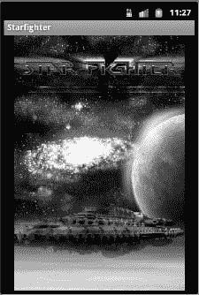

**图 3–1。**星际战斗机*闪屏*

对于由多人在多个开发商店开发的游戏，您可能会在游戏开始前看到不止一个闪屏。这种情况并不少见，因为每个开发店、发行商和制作商都有自己的闪屏，希望在游戏开始前发布。然而，对于我们的游戏，我们将创建一个闪屏，因为你将是唯一的开发者。

如果你玩任何典型的游戏，你会看到启动画面通常会自动转换到游戏的主菜单。在*星际战士*中，你将创建一个闪屏，淡入淡出主菜单。因此，要创建闪屏，您还需要创建保存主菜单的活动，这样您就可以正确地设置闪屏的淡入淡出效果，而不会出现任何错误。

#### 创建活动

首先，打开您在前一章中创建的 Star Fighter 项目。如果您还没有创建星际战斗机项目，请现在返回并在继续之前创建；本章的剩余部分假设你正在星际战士项目中工作。

您的 Star Fighter 项目在当前状态下应该包含一个活动— `StarfighterActivity`。`StarfighterActivity`由 Android 自动创建，是项目的自动入口点。如果你现在运行你的项目，`StarfighterActivity`将会启动。然而，这一章实际上需要两个活动:一个用于闪屏，一个用于游戏的主菜单。Android 已经为闪屏提供了一个活动，所以在下一节中，您将为主菜单创建一个新的活动。

即使主菜单的活动现在是空的，它也能让你完全实现闪屏的渐变，这个任务你一会儿就能完成。

##### 创建新的类

要创建一个新的活动，首先在主包中创建一个新的 Java 类。如果您使用了与前一章中描述的相同的包名，那么您的主包就是`com.proandroidgames`。右键单击包名，选择新建类，弹出[图 3–2](#fig_3_2)所示的新建 Java 类窗口。

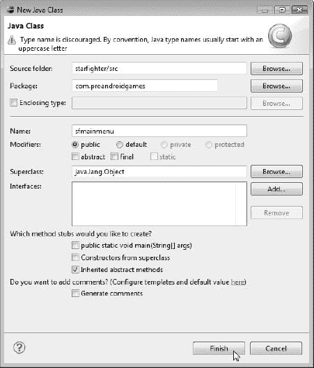

**图 3–2。** *新 Java 类创建窗口*

保持大多数默认选项不变。此时您需要做的就是提供一个类名。您的类的名称应该是`SFMainMenu`。单击“完成”按钮创建该类。

现在，您创建的新类是一个简单的 Java 类，代码如下。

`package com.proandroidgames;

public class SFMainMenu {

}`

但是，该课程还不是一项活动。为此，您需要向该类添加一些代码。一旦这个类成为一个活动，您就可以开始创建闪屏及其效果。

##### 将课堂转化为活动

导入`Activity`包，并扩展您的`SFMainMenu`类，将这个 Java 类变成一个 Android 活动。您的类代码现在应该如下所示:

`package com.proandroidgames;

import android.app.Activity;

public class SFMainMenu extends Activity {

}`

现在，让我们将此活动与星际战斗机项目相关联，以便创建闪屏。打开`AndroidManifest.xml`文件，将`SFMainMenu`活动与您的项目关联起来，如图[图 3–3](#fig_3_3)所示。

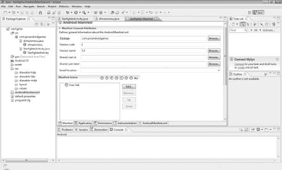

**图 3–3。***androidmanifest . XML*

滚动到`AndroidManifest`应用程序标签的底部，找到标有应用程序节点的区域。清单的这个区域列出了与您的项目关联的所有应用程序节点。现在，列出的唯一应用程序节点应该是`.StarfighterActivity`。因为您想要添加一个新的活动，单击添加按钮，并从图 3–4 中的[画面中选择活动。](#fig_3_4)

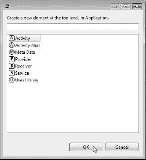

**图 3–4。** *创建新的活动元素*

这将创建一个空的`Activity`元素。您在`AndroidManifest`的 GUI 中看到的空元素是在`AndroidManifest.xml`文件中的一个 XML 元素的表示。单击选项卡底部的`AndroidManifest.xml`视图，您应该会看到以下 XML 代码片段:

`<activity></activity>`

很明显，这个空元素对你没什么好处。您需要以某种方式告诉`AndroidManifest`这个活动元素代表了`SFMainMenuActivity`。这当然可以手动完成。然而，让我们来看看如何以自动化的方式来做这件事。

一旦您创建了新的`Activity`元素，您需要将这个新元素与您之前创建的实际的`SFMainMenu`活动相关联。单击`AndroidManifest`的应用程序节点部分中的`Activity`元素以突出显示它。在`AndroidManifest`的应用节点部分的右边是一个现在被标记为活动属性的部分，如图[Figure 3–5](#fig_3_5)所示。

**注意:**如果您点击`.StarfighterActivity`，该部分将被标记为`.StarfighterActivity`的属性。

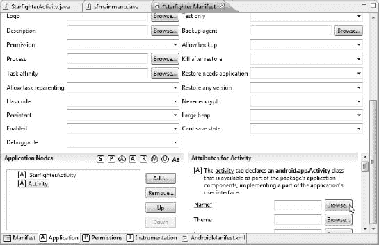

**图 3–5。** *活动属性*

单击 Name 属性旁边的 Browse 按钮，打开一个浏览工具，显示项目中所有可用的`Activity`类。你的浏览工具选项应该看起来像[图 3–6](#fig_3_6)。

请注意,`SFMainMenu`活动列在“匹配项目——框中。选择`SFMainMenu`活动，然后单击确定。

**提示:**如果您在“匹配项目”框中没有看到`SFMainMenu`活动，请尝试返回 Eclipse 中的 SFMainMenu 选项卡。如果选项卡标签在`SFMainMenu`名称前有一个星号，则文件尚未保存。保存文件，然后重新打开名称属性浏览器。

如果你仍然没有看到`SFMainMenu`，确认你的`SFMainMenu`类正在扩展`Activity`。如果您正在您的类中扩展`Activity`并且您仍然没有选择`SFMainMenuActivity`的选项，您可以通过填充所需的元素属性来手动编辑`AndroidManifest`(这些将在本章后面提供)。

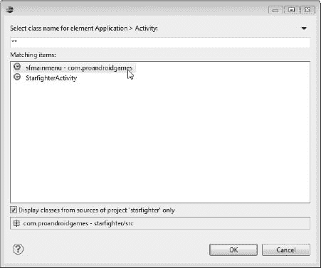

**图 3–6。** *姓名属性选择器*

在您选择了`SFMainMenu`作为这个活动的名称属性之后，为。`StarfighterActivity`和`SFMainMenu`活动肖像，如图[图 3–7](#fig_3_7)所示。

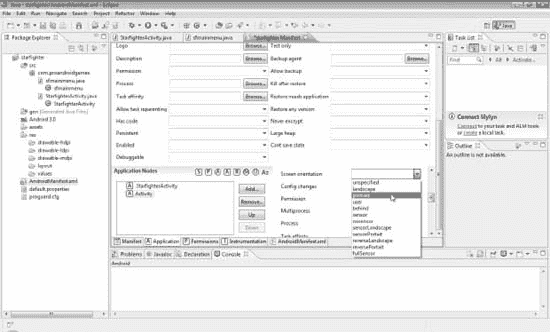

**图 3–7。** *将“屏幕方向”设置为纵向*

为`.StarfighterActivity`(你的闪屏)和`SFMainMenu`(游戏的主菜单)设置屏幕方向会将屏幕方向锁定为纵向。鉴于这款游戏的风格，您希望玩家只能在纵向模式下使用游戏。因此，即使玩家试图将设备旋转到横向模式，游戏的屏幕也将保持纵向。

新的`SFMainMenu`活动的 XML 代码应该如下所示:

`<activity android:name="SFMainMenu" android:screenOrientation="portrait"></activity>`

主菜单活动现在与 Star Fighter 项目相关联，您可以创建闪屏。请记住，主菜单的所有代码将在本章的下一节中添加；您只需要现在创建的活动来正确设置您的淡入淡出效果。

**注意:**Android 应用程序崩溃和失败的最常见原因之一是`AndroidManifest`文件中的不正确设置，该文件很容易成为项目中最重要的文件之一。

让我们快速回顾一下我们现在所处的位置以及原因。你正在为*星际战士*创建的闪屏将淡出主菜单。您已经创建了保存主菜单的活动，现在是时候创建闪屏和淡入淡出效果了。

#### 创建您的闪屏图像

现在，您需要将用于闪屏图像的图形导入到项目中。Android 能够处理大多数常见的图像格式。但是，这个游戏你要坚持两个:`.png`和`.9.png`。对于所有的精灵和其他游戏图像，你将使用标准的`.png`图像，对于闪屏和主菜单，你将使用`.9.png`文件。

`.9.png`图像也称为九片图像。九补丁图像是一种特殊的格式，允许 Android 根据需要拉伸图像，因为它在图像的左侧和顶部包含一个 1 像素的黑色边框。

**注意:**你在游戏中包含的大多数图像将会是*而不是*九补丁图像，因为你想要自己控制大多数图像的操作。但是，对于闪屏和主菜单，使用九补丁是完全合适的。

九补丁和其他图像大小调整过程的区别在于，你可以通过操纵黑边来控制 Android 如何拉伸图像。[Figure 3–8](#fig_3_8)以九补丁格式展示了我们的闪屏图像。

**图 3–8。** *九补丁闪屏*

如果你仔细观察[图 3–8](#fig_3_8)中图片的左侧，你会注意到黑色圆点的细线。这条黑线是九色图像与其他图像格式的区别。

**注意:**我在这个例子中使用的九片图像是为了在所有方向上自由伸展。如果您的图像中有不想拉伸的部分，请不要在这些区域绘制边框。`draw9patch`工具可以帮助你想象你的图像将如何伸展，取决于你如何绘制你的边界。

不幸的是，为 Android 开发的应用程序可以在许多不同的设备上运行，从小型手机到大型平板电脑。因此，您的项目必须能够适应所有不同的屏幕尺寸。如果你使用九补丁图像作为你的闪屏，Android 可以调整图像的大小(在一些 XML 的帮助下),以适应任何尺寸的屏幕。

**提示:**如果你从未使用过九补丁图形，Android SDK 包括一个可以帮助你的工具。在 SDK 的`\tools`文件夹中，你会找到`draw9patch`工具。启动这个工具，你将能够导入任何图像，绘制你的九补丁边界，并用`.9.png`扩展名保存图像。

##### 导入图像

现在您已经准备好了您的九补丁映像，将它从您保存它的地方拖到您的 Eclipse 项目的`\res\drawable-hdpi`文件夹中，如图[图 3–9](#fig_3_9)所示。

你可能已经注意到有三个文件夹可供选择:`drawable-hdpi`、`drawable-ldpi`和`drawable-mdpi`。这些文件夹包含三种不同类型的 Android 设备的绘图或图像:高密度(hdpi)、中密度(mdpi)和低密度(ldpi)。

如果 Android 提供了一种机制来包含不同屏幕尺寸的不同图像，我们为什么要使用九补丁图形来缩放图像以适应任何屏幕？简而言之，这两种情况实际上是相互排斥的。是的，九补丁允许缩放图像以适应设备的屏幕，但这与设备的屏幕像素密度没有什么关系。您正在使用的图像(如果您使用此项目中的图像)是高密度图像，并且将如此显示。然而，即使图像很大，它们仍然没有 10.1 英寸摩托罗拉 Xoom 屏幕大。因此，九贴格式允许其适当拉伸。

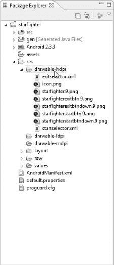

**图 3–9。** *拖动图像到 drawable-hdpi 文件夹*

当您想要使用不同的布局和图像密度来利用更大的屏幕区域，或者相反，为较小的屏幕区域做出让步时，高、中、低密度文件夹分离的真正好处就发挥出来了。如果您想要创建一个有四个按钮的菜单屏幕，每个按钮在平板电脑屏幕上堆叠在另一个按钮的顶部，但在较小的设备上并排成对分组，这些文件夹将帮助您轻松实现这一目标。

出于我们当前项目的目的，将您的闪屏九补丁图像放到`drawable-hdpi`文件夹中。你不能在这个游戏中使用这些文件夹。然而，你可以自己尝试，在不同的设备上创造不同的体验。

#### 使用 R.java 文件

当你把图片放入文件夹后，Android 会为它创建一个资源指针。这个指针放在`R.java`文件中，是自动生成的，不应该是手动编辑的。它位于您的包名下的`gen`文件夹中。如果你在添加你的图像后打开`R.java`文件，它应该有类似如下的代码:

`package com.proandroidgames;

public final class R {
...
public static final class drawable {
public static final int starfighter=0x7f020002;
}
...
}`

`R.java`文件将管理您的项目使用的所有图像、id、布局和其他资源。因为这个文件现在包含一个指向您的图像的指针，所以您可以使用下面的代码行在项目中的任何地方引用这个图像:

`R.drawable.starfighter`

**注意:**小心不要以任何方式删除或手动修改`R.java`文件。例如，`starfighter`图像指针的十六进制(hex)值在您的系统上可能与本节中的示例代码不同。您的文件将在您的机器上工作，因为它是在您的 IDE 中生成的。如果您要修改十六进制值以匹配示例中的值，您的文件将不再按预期工作。

现在您的项目中已经有了一个想要显示为闪屏的图像，您需要告诉 Android 将这个图像显示到屏幕上。有许多方法可以实现这一点。但是，因为您想要对图像应用淡入淡出效果，所以您将使用一个布局。

布局是一个 XML 文件，用来告诉 Android 如何在屏幕上定位资源。让我们为闪屏创建布局。

#### 创建布局文件

您将使用一个简单的布局文件，在玩家第一次加载您的游戏时，在屏幕上显示初始屏幕图像`starfighter`。你的闪屏应该直截了当——一个有趣的空间背景和游戏名称的图像。

现在你必须把这个图像显示在屏幕上，这样玩家才能欣赏它。首先右击`res\layout`文件夹，选择**新建**  **其他**。在新建向导中，选择**Android****Android XML 文件**，如图[图 3–10](#fig_3_10)所示。

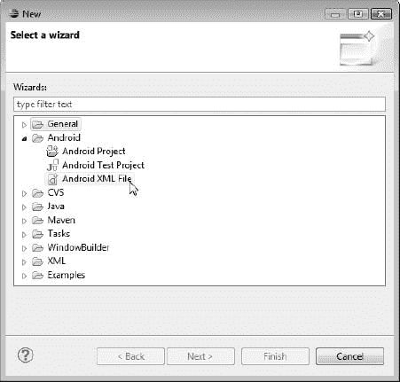

**图 3–10。**T3【Android XML 文件选项】T4

将新的 xml 文件命名为`splashscreen.xml`，并完成向导。该过程将在布局文件夹中放置一个新的 XML 布局文件，并在`R.java`文件中创建一个指向该文件的指针。

此时，您可以通过两种方式攻击布局。您可以使用 GUI 设计器或直接编辑 XML 文件。我们将直接编辑 XML 文件，这样您就可以更好地理解布局中包含的内容及其原因。

##### 编辑 XML 文件

双击`res\layout`文件夹中的`splashscreen.xml`文件，实际打开 GUI 设计器。然而，如果您在 Eclipse 中查看设计器窗口的底部，您会注意到两个子选项卡。一个选项卡，即当前选项卡，被标记为图形布局。第二个选项卡标记为 splashscreen.xml，该选项卡是 xml 文件的文本编辑器。单击 splashscreen.xml 选项卡进入文本编辑器。

您的 XML 文件应该如下所示:

`<?xml version="1.0" encoding="utf-8"?>`

这是一个空的 XML 文件。让我们给这个文件添加一个布局。

在一般的 Android 开发中，可以使用一些不同类型的布局。因为你正在开发一个游戏，你真的不需要担心 75%的布局，因为你在创建*星际战士*的过程中不会碰到它们。然而，有两个可以用于这个闪屏:`LinearLayout`和`FrameLayout`。你将为*星际战士*使用`FrameLayout`，因为它非常擅长将元素居中并固定到边框上。

`LinearLayout`用于在屏幕上显示多个项目，并将它们一个接一个地垂直或水平放置。将`LinearLayout`想象成一个单列或单行的表格。它可以用来以一种有组织的线性方式将任意数量的项目放置到屏幕上，包括其他布局。

`FrameLayout`用来装一件物品。一个项目可以被重力设置，使其居中，填充整个空间，或靠着任何边界。`FrameLayout`布局看起来几乎是故意显示一个由单个图像组成的闪屏。

##### 使用框架布局

您将使用`FrameLayout`来显示闪屏图像*和*一个将您标识为开发人员的文本框。我知道我刚刚解释过`FrameLayout`是为展示一件物品而建造的，事实也的确如此。然而，如果你告诉一个`FrameLayout`显示两个项目，它会显示它们相互重叠，比其他类型的布局需要的代码少得多。

返回到您的`splashscreen.xml`文件，如下创建`FrameLayout`:

`<?xml version="1.0" encoding="utf-8"?>
<FrameLayout
xmlns:android="http://schemas.android.com/apk/res/android"

</FrameLayout>`

一个`FrameLayout`布局只需要你现在担心的两个属性:`layout_width`和`layout_height`。这两个属性将告诉 Android 如何让布局适合您创建的活动。

在这种情况下，您将把`layout_width`和`layout_height`属性设置为`match_parent`。`match_parent`常量告诉 Android 视图的宽度和高度应该与该视图的父视图(在本例中是活动本身)的宽度和高度相匹配。

**提示:**如果你以前在 Android 上开发过，你可能会记得一个叫`fill_parent`的常数。`Fill_parent`被替换为`match_parent`，但是这两个常量的作用是一样的。

如下所示设置`FrameLayout`属性:

`<?xml version="1.0" encoding="utf-8"?>
<FrameLayout
xmlns:android="http://schemas.android.com/apk/res/android"` `android:layout_width="match_parent"
android:layout_height="match_parent">
</FrameLayout>`

你现在有了一个功能正常的`FrameLayout`，但是你没有任何东西可以让它工作。让我们添加图像和文本。

##### 添加图像和文本

在你的`FrameLayout`中创建一个`ImageView`，并给它一个 ID `"splashScreenImage"`。

`<?xml version="1.0" encoding="utf-8"?>
<FrameLayout
xmlns:android="http://schemas.android.com/apk/res/android"
android:layout_width="match_parent"
android:layout_height="match_parent">
**<ImageView android:id="@+id/splashScreenImage"**
**>**
**</ImageView>**
</FrameLayout>`

您已经创建了将保存您的闪屏图像的`ImageView`。现在，您必须将`src`属性设置为指向您想要显示的图像，在本例中，是在`res\drawable-hdpi`文件夹中的`starfighter`图像。您还需要设置`layout_width`和`layout_height`属性，就像您对`FrameLayout`所做的那样。

`<?xml version="1.0" encoding="utf-8"?>
<FrameLayout
xmlns:android="http://schemas.android.com/apk/res/android"
android:layout_width="match_parent"
android:layout_height="match_parent">
<ImageView android:id="@+id/splashScreenImage"
**android:src="@drawable/starfighter"**
**android:layout_width="match_parent"**
**android:layout_height="match_parent">**
</ImageView>
</FrameLayout>`

请注意，`src`属性指向了“`@drawable/starfighter`”；这告诉 Android 显示来自`drawable`文件夹的`starfighter`图像。现在来看一些不太明显的东西。如果你回想一下我们关于九补丁图像的讨论，我提到过我们需要一些代码来利用九补丁的缩放能力。将`layout_width`和/或`layout_height`设置为`match_parent`将利用九补丁格式以您指定的方式校正图像的比例。

现在在你的布局中创建一个`TextView`。这个文本视图将被用来显示你想在你的闪屏上显示的任何演职员表或文本。

`<?xml version="1.0" encoding="utf-8"?>
<FrameLayout
xmlns:android="http://schemas.android.com/apk/res/android"
android:layout_width="match_parent"
android:layout_height="match_parent">
<ImageView android:id="@+id/splashScreenImage"
android:src="@drawable/starfighter"` `android:layout_width="match_parent"
android:layout_height="match_parent">
</ImageView>
**<TextView**
**android:text="game by: j.f.dimarzio - graphics by: ben eagel"**
**android:id="@+id/creditsText"**
**</TextView>**
</FrameLayout>`

创建这个视图并不需要什么巫术，它应该看起来相当简单。再次，你需要告诉安卓`TextView`的`layout_width`和`layout_height`。然而，如果我们将属性设置为`match_parent`文件，就像我们在`ImageView`和`FrameLayout`上所做的那样，你的文本会以一种非常不理想的方式覆盖图像。

相反，您要将`layout_width`和`layout_height`设置为`wrap_content`，如下所示。`wrap_content`常量将让 Android 知道您希望`TextView`的大小由其中文本的大小决定。因此，您添加的文本越多，`TextView`就会越大。

`<?xml version="1.0" encoding="utf-8"?>
<FrameLayout
xmlns:android="http://schemas.android.com/apk/res/android"
android:layout_width="match_parent"
android:layout_height="match_parent">
<ImageView android:id="@+id/splashScreenImage"
android:src="@drawable/starfighter"
android:layout_width="match_parent"
android:layout_height="match_parent">
</ImageView>
<TextView
android:text="game by: j.f.dimarzio graphics by: ben eagel"
android:id="@+id/creditsText"
**android:layout_height="wrap_content"**
**android:layout_width="wrap_content">**
</TextView>
</FrameLayout>`

最后，您希望显示演职员表的文本不要太分散注意力，所以您将设置`TextView`的重力，将文本拉到`FrameView`的底部中心，如此处所示。

`<?xml version="1.0" encoding="utf-8"?>
<FrameLayout
xmlns:android="http://schemas.android.com/apk/res/android"
android:layout_width="match_parent"
android:layout_height="match_parent">
<ImageView android:id="@+id/splashScreenImage"
android:src="@drawable/starfighter"
android:layout_width="match_parent"
android:layout_height="match_parent">
</ImageView>
<TextView
android:text="game by: j.f.dimarzio graphics by: ben eagel"
android:id="@+id/creditsText"
**android:layout_gravity="center_horizontal|bottom"**
android:layout_height="wrap_content"
android:layout_width="wrap_content">
</TextView>
</FrameLayout>`

您已经成功创建了将显示初始屏幕的布局。现在，你只需要告诉`StarfighterActivity`使用这个布局。

##### 连接星际战斗机和布局

将`StarfighterActivity`与布局连接起来非常容易，只需要一行代码。

保存`splashscreen.xml`文件。保存该文件将在`R.java`文件中创建另一个条目，以便您可以在其他代码中引用该布局。

打开项目源代码根目录下的`StarfighterActivity.java`文件。该文件是在您创建项目时自动创建的。

**提示:**如果您没有名为`StarfighterActivity.java`的文件，请检查您是否按照上一章中的说明创建了一个项目。如果您将项目命名为除了`starfighter`之外的任何名称，您的`StarfighterActivity`将会有一个不同的名称。

当您打开`StarfighterActivity.java`文件时，您将看到一些自动生成的代码，显示一个名为`main`的预制布局。

`package com.proandroidgames;

import android.app.Activity;
import android.os.Bundle;

public class StarfighterActivity extends Activity {
/** Called when the activity is first created. */
@Override
public void onCreate(Bundle savedInstanceState) {
super.onCreate(savedInstanceState);
setContentView(R.layout.**main**);
}
}`

将`setContentView()`从显示`main`布局改为显示您刚刚创建的`starfighter`布局。完成的活动应该是这样的。

`package com.proandroidgames;

import android.app.Activity;
import android.os.Bundle;

public class StarfighterActivity extends Activity {
/** Called when the activity is first created. */
@Override
public void onCreate(Bundle savedInstanceState) {
super.onCreate(savedInstanceState);

/*display the splash screen image from a layout*/
setContentView(R.layout.**splashscreen**);
}
}`

通过单击菜单栏上带有白色箭头的绿色圆圈，编译并运行您的代码。您也可以按 Ctrl + F11 或从菜单中单击`Run`  `Run`。

如果您以前从未编译或调试过 Android 应用程序，您可能会看到一个屏幕，询问您是要将应用程序作为 JUnit 测试还是 Android 应用程序来运行。您会希望将您的应用程序作为 Android 应用程序运行。然后，您可以选择在哪个版本的仿真器或任何附加的 Android 调试模式设备上运行您的应用程序。

**注意:**如果您选择在 Android 模拟器中运行代码，而不是在实际的 Android 手机上，您可能会遇到一些意想不到的结果。请记住，模拟器就是模拟器，它并不是你的游戏在设备上的真实表现。这并不是说你不应该使用模拟器；只是要小心，直到你看到你的工作在一个实际的设备上。

启动你的游戏，你应该会看到如图[Figure 3–11](#fig_3_11)所示的启动画面。这是一个巨大的成就，也是创建游戏入口的第一个障碍。然而，眼下，屏幕真的没什么用。其实它除了展示真的什么都不做。你需要创建淡入淡出效果，这将导致从你的闪屏到你的主菜单。

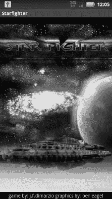

**图 3–11。** *星际战斗机闪屏*

退出`StarfighterActivity`，回到你的代码。是时候创建淡入和淡出效果了。

#### 创建渐变效果

您将使用动画来创建淡入闪屏的效果，然后从闪屏淡出到主菜单。Android 有一些内置的动画效果，非常容易使用，也非常容易实现。

为什么要用动画淡入淡出？简单的答案是，这是一个让你的游戏看起来更好的简单方法。如果你只有一个静态的屏幕，从你的闪屏切换到你的主菜单，你仍然可以完成同样的目标，但是通过淡入和淡出你的屏幕，你给你的游戏一个额外的专业外观。

在`res\layout`文件夹中再创建两个布局文件:一个名为`fadein.xml`，另一个名为`fadeout.xml`。顾名思义，`fadein.xml`文件将控制将闪屏淡入设备的动画。`fadeout.xml`文件将控制动画将启动画面淡出到主菜单。

您将要创建的动画类型称为 alpha。“alpha”是指图像的 Alpha 值，或其透明度。alpha 值为 1 表示不透明，alpha 值为 0 表示透明。因此，要使图像看起来像是淡入，您需要创建一个动画，在设定的时间内将图像的 alpha 值从 0 调整到 1。相反，如果你想淡出一个图像，你需要一个动画来调整你的图像的 alpha 值从 1 到 0。因此，您将创建两个不同的 alpha 动画来控制闪屏的淡入和淡出。

在您的`res\layout`文件夹中创建了`fadein.xml`和`fadeout.xml`文件后，双击`fadein.xml`文件在编辑器中打开它。除了下面一行之外，该文件应该为空；如果不是，删除文件的内容将除了这一行:

`<?xml version="1.0" encoding="utf-8"?>`

现在，这样创建一个阿尔法动画:

`<?xml version="1.0" encoding="utf-8"?>
**<alpha xmlns:android=”http://schemas.android.com/apk/res/android”
/>**`

您需要为该动画定义四个属性来完成它:要使用的插值器类型、开始和结束 alpha 值以及动画的总持续时间。

首先，我们来定义插值器。插值器告诉动画如何前进。也就是动画刚好可以正常运行；它可以从慢开始，然后逐渐加速；它可以开始得很快，然后变得更慢；或者它可以重复。对于淡入效果，我们将缓慢地开始动画，然后让它在一秒钟内建立起来。

使用`accelerate_interpolator`告诉动画，你想开始缓慢，然后随着时间的推移加速。下面的代码说明了如何在`fadein.xml`中实现`accelerate_interpolator`:

`<?xml version="1.0" encoding="utf-8"?>
<alpha xmlns:android="http://schemas.android.com/apk/res/android"
**android:interpolator="@android:anim/accelerate_interpolator" />**`

你的淡入动画将开始缓慢，并逐渐加速，直到淡入完成。但是会持续多久呢？

使用`android:duration`属性告诉 alpha 动画要运行多长时间。`android:duration`属性的值以毫秒为单位。你将通过设置`android:duration`为 1000 来告诉动画运行 1 秒钟。

`<?xml version="1.0" encoding="utf-8"?>
<alpha xmlns:android="http://schemas.android.com/apk/res/android"
android:interpolator="@android:anim/accelerate_interpolator"
**android:duration="1000" />**`

创建淡入动画的最后一步是设置动画的开始和结束 alpha 值的属性。在这种情况下，你从完全透明到完全不透明。然而，这并不意味着这些是你唯一的选择。您可以选择在两者之间的任意值开始和结束。如果你愿意，你可以让一个动画从 25%的不透明渐变到 100%的不透明。

设置`android:fromAlpha`和`android:toAlpha`属性来指示您想要开始和结束的 alpha 值。

`<?xml version="1.0" encoding="utf-8"?>
<alpha xmlns:android="http://schemas.android.com/apk/res/android"
android:interpolator="@android:anim/accelerate_interpolator"
android:duration="1000"
**android:fromAlpha="0.0"
android:toAlpha="1.0"/>**`

**注意:**`fromAlpha`和`toAlpha`的值是浮点数而不是整数。这很重要，因为 alpha 值的范围只有 0 到 1。

这里，您已经将`fromAlpha`属性设置为 0.0。这表明动画从视图完全透明开始。`toAlpha`属性被设置为 1.0，表示动画将在视图完全不透明的情况下结束。这个动画将为你提供一个平滑的淡入效果。

现在是时候创建淡出了。

思考淡出和淡入的关系。淡出应该像淡入一样工作，只是方向相反。这意味着动画应该使用一个插值器，它开始时很快，然后变慢，直到结束。动画也应该从一个完全不透明的对象开始，然后过渡到一个完全透明的对象。

保存`fadein.xml`文件，打开`fadeout.xml`。这里也一样，在`fadeout.xml`中你应该只有一行代码:

`<?xml version="1.0" encoding="utf-8"?>`

您需要为`fadeout.xml`设置`android:interpolator`、`android:duration`、`android:fromAlpha`和`android:toAlpha`。

您在淡入动画中使用了`accelerate_interpolator`以较慢的淡入速率开始，然后逐渐移动到较大的速率。因此，要反转淡出动画，您将使用`decelerate_interpolator`。`decelerate_interpolator`将以更快的速度开始动画，然后慢慢降低速度，直到动画结束。

同样，您将为淡出设置 1 秒(1000 毫秒)的动画持续时间。

`<?xml version="1.0" encoding="utf-8"?>
<alpha xmlns:android="http://schemas.android.com/apk/res/android"
**android:interpolator="@android:anim/decelerate_interpolator"
android:duration="1000" />**`

设置属性`android:fromAlpha`和`android:toAlpha`来完成动画。因为你是从一个纯色图像淡出到没有，你将设置`android:fromAlpha`为完全不透明和`android:toAlpha`为完全透明。这将开始动画在一个坚实的形象，并淡出到一个透明。

`<?xml version="1.0" encoding="utf-8"?>
<alpha xmlns:android="http://schemas.android.com/apk/res/android"
android:interpolator="@android:anim/decelerate_interpolator"
android:duration="1000"
**android:fromAlpha="1.0"**
**android:toAlpha="0.0"/>**`

您现在可以保存完成的`fadeout.xml`文件。

此时，您有了一个布局和两个动画来控制和定义您的闪屏。现在，你需要一些方法来告诉他们三个互动，并创建一个动画启动画面。

为了理解你将如何创建和运行动画，你需要理解线程如何与你的游戏相关联地工作。

#### 玩转游戏

作为游戏开发者，你需要克服的最大障碍之一是你的游戏如何在任何给定的平台上运行。在其最基本的根元素，一个 Android 游戏仍然只是一个基本的 Android 活动。为 Android 编写的其他“应用程序”也是作为一个活动来编写的。您的活动与任何其他活动之间的唯一区别是，您的活动将包含一个游戏，而其他活动可能是商业、地图或社交媒体工具。

这种架构的问题在于，因为所有的 Android 活动都是一样的，所以它们都被同等对待。这意味着你编写的每一个 Android 活动都将在系统的主执行线程中运行。这对游戏不利。

在系统的主执行线程中运行您的游戏意味着您的游戏必须与该线程中运行的所有其他活动竞争资源。这将导致一个断断续续或缓慢的游戏在最好的情况下和一个游戏，暂停或冻结设备在最坏的情况下。

但是不要害怕，有一种方法可以绕过这个单线程的噩梦。你必须能够产生任意数量的线程，并在其中运行任何你想运行的东西。理想情况下，您会希望您的游戏在一个线程中运行，该线程独立于设备上运行的所有其他内容，以确保您的游戏尽可能平稳地运行，并能够访问它所需的资源。

在这一章的剩余部分，你实际上将为游戏的执行产生两个独立的线程。本节讨论的第一个线程将用于游戏运行，第二个线程(您将在本章稍后创建)将用于运行您想要在游戏后播放的任何背景音乐。

为什么是两个独立的线程？除了动画和游戏逻辑之外，在设备上可以做的最耗费处理器资源的事情之一就是播放媒体，比如音乐。您将确保游戏和音乐平稳并行运行，互不干扰。通过在一个独立于游戏的线程中运行音乐，如果你发现设备资源不足，你也可以在不干扰游戏的情况下关掉音乐。

现在你明白了为什么你需要为你的游戏生成不同的线程，让我们为主游戏和闪屏创建一个。这个游戏线程将把你创建的闪屏、淡入淡出动画和主菜单联系在一起。

##### 创建游戏线程

再次打开`StarfighterActivity.java`。提醒一下，您的文件当前应该能够启动闪屏，并且应该包含以下代码。

`package com.proandroidgames;

import android.app.Activity;
import android.os.Bundle;

public class StarfighterActivity extends Activity {
/** Called when the activity is first created. */
@Override
public void onCreate(Bundle savedInstanceState) {
super.onCreate(savedInstanceState);

/*display the splash screen image from a layout*/
setContentView(R.layout.splashscreen);
}
}`

由于`StarfighterActivity`是默认启动的活动，也是启动闪屏的活动，所以它是生成游戏线程的最佳位置。你现在创建的线程将会是游戏最终运行的线程。

实例化一个新的`Thread()`，并覆盖`run()`方法以产生一个新的线程。在`run()`方法中，调用主菜单在新线程中运行游戏。这是您在这里要做的事情的基本路线图。

**注意:**随着你构建游戏的进展，这个线程中的代码将被修改，甚至被移动以适应更复杂的过程。

下面的代码显示了在`StarfighterActivity`代码中的何处生成新线程。

`package com.proandroidgames;

import android.app.Activity;
import android.os.Bundle;

public class StarfighterActivity extends Activity {
/** Called when the activity is first created. */
@Override
public void onCreate(Bundle savedInstanceState) {
super.onCreate(savedInstanceState);

/*display the splash screen image*/
setContentView(R.layout.splashscreen);

**/* Start a new game thread */
new Thread() {
@Override
public void run() {

}
}**
}
}`

但是这段代码有一个问题。正如所写的那样，代码将在闪屏显示的几毫秒内产生新的游戏线程。这几乎没有足够的时间来呈现闪屏。因此，您需要延迟游戏线程的生成，直到闪屏有足够的时间显示。

答案是用延时的`Handler()`。Android 有处理程序可以管理线程和活动。`Handler()`的`postDelay()`方法有两个参数:要延迟的线程和要延迟的时间。

您将创建一个新的常量来保存您希望延迟线程的时间。这个常量`GAME_THREAD_DELAY`，将会是你游戏引擎的第一行代码。将它放在那里将允许您从单个位置调整线程上的延迟，而无需在代码中搜寻它。

在你的游戏包中创建一个名为`SFEngine.java`的新类文件。这是一个空的类文件，它将最终保存你的游戏引擎的大部分。将以下常量添加到类中:

`package com.proandroidgames;

public class SFEngine {
/*Constants that will be used in the game*/
**public static final int GAME_THREAD_DELAY = 4000;**
}`

您正在将`GAME_THREAD_DELAY`设置为 4 秒；在主菜单淡入之前，这应该是闪屏显示的一段时间。

保存`SFEngine.java`，重新打开`StarfighterActivity`。让我们用一个`Handler()`和`postDelay()`来包装新的游戏线程，如下所示。

**提示:**同样密切关注需要导入的包；如果您试图调用尚未导入的包中的方法，您的代码将会出错。您还可以使用 Ctrl + Shift + O 快捷键来自动导入您可能已经错过的任何引用的包。

`package com.proandroidgames;

import android.app.Activity;
import android.os.Bundle;
**import android.os.Handler;**

public class StarfighterActivity extends Activity {
/** Called when the activity is first created. */
@Override
public void onCreate(Bundle savedInstanceState) {
super.onCreate(savedInstanceState);

/*display the splash screen image*/
setContentView(R.layout.splashscreen);

**/*start up the splash screen and main menu in a time delayed thread*/
new Handler().postDelayed(new Thread() {
@Override
public void run() {

}
}, SFEngine.GAME_THREAD_DELAY);**

}
}`

现在，您已经创建了新线程，并设置了一个时间延迟来暂停线程的生成 4 秒钟。最后，是时候告诉线程做什么了。

##### 设定新的目标

在新线程中，您将启动主菜单活动，终止闪屏活动，并设置淡入淡出动画。要开始一个新的活动，您必须创建一个`Intent()`方法。

把`Intent()`想象成你在告诉 Android 执行的一个操作。在这种情况下，您告诉 Android 启动您的主菜单活动。下面的代码向您展示了如何创建一个新的`Intent()`方法来启动主菜单。

`package com.proandroidgames;

import android.app.Activity;
**import android.content.Intent;**
import android.os.Bundle;
import android.os.Handler;

public class StarfighterActivity extends Activity {
/** Called when the activity is first created. */
@Override
public void onCreate(Bundle savedInstanceState) {
super.onCreate(savedInstanceState);
/*display the splash screen image*/
setContentView(R.layout.splashscreen);
/*start up the splash screen and main menu in a time delayed thread*/
new Handler().postDelayed(new Thread() {
@Override
**public void run() {
Intent mainMenu = new Intent(StarfighterActivity.this, SFMainMenu.class);
StarfighterActivity.this.startActivity(mainMenu);**
}
}, SFEngine.GAME_THREAD_DELAY);

}
}`

在继续之前，让我们讨论一下这段代码的作用。第一行在`StarfighterActivity`的上下文中创建了名为`mainMenu`的新`Intent()`，活动为`SFMainMenu`。第二行使用`StarfighterActivity`上下文来启动`mainMenu`活动。请记住，所有这些都发生在闪屏之外的一个单独的线程中。

##### 杀戮活动

现在主菜单已经启动，您想要终止闪屏活动。代码将导航到主菜单，所以为什么要取消闪屏呢？就当是做家务吧。通过取消闪屏，您可以确保游戏不会在无意中使用设备上的后退按钮返回。如果玩家能够导航回闪屏，理论上他们可以产生任意数量的并发游戏线程，堵塞他们的设备。因此，为了安全起见，您将杀死如下所示的闪屏。

`package com.proandroidgames;

import android.app.Activity;
import android.content.Intent;
import android.os.Bundle;
import android.os.Handler;

public class StarfighterActivity extends Activity {
/** Called when the activity is first created. */
@Override
public void onCreate(Bundle savedInstanceState) {
super.onCreate(savedInstanceState);

/*display the splash screen image*/
setContentView(R.layout.splashscreen);

/*start up the splash screen and main menu in a time delayed thread*/
new Handler().postDelayed(new Thread() {
@Override
public void run() {
Intent mainMenu= new Intent(StarfighterActivity.this, SFMainMenu.class);
StarfighterActivity.this.startActivity(mainMenu);
**StarfighterActivity.this.finish();**

}
}, SFEngine.GAME_THREAD_DELAY);

}
}`

最后，您的新线程需要将闪屏淡入主菜单的动画。您将使用`overridePendingTransition()`方法告诉 Android 您想要使用您创建的两个渐变动画作为从一个活动到另一个活动的过渡。

`package com.proandroidgames;

import android.app.Activity;
import android.content.Intent;
import android.os.Bundle;
import android.os.Handler;

public class StarfighterActivity extends Activity {
/** Called when the activity is first created. */
@Override
public void onCreate(Bundle savedInstanceState) {
super.onCreate(savedInstanceState);
/*display the splash screen image*/
setContentView(R.layout.splashscreen);
/*start up the splash screen and main menu in a time delayed thread*/
new Handler().postDelayed(new Thread() {
@Override
public void run() {
Intent mainMenu= new Intent(StarfighterActivity.this, SFMainMenu.class);
StarfighterActivity.this.startActivity(mainMenu);
StarfighterActivity.this.finish();
**overridePendingTransition(R.layout.fadein,R.layout.fadeout);**
}
}, SFEngine.GAME_THREAD_DELAY);

}
}`

在运行闪屏之前，你需要做最后一件事。在布局目录中，您应该会看到一个名为`main.xml`的自动生成文件。让我们告诉`SFMainMenu`活动使用这个布局。因为布局是空的，所以活动不会显示任何内容，但是当您进入本章的下一节时，它会对您有所帮助。

打开`SFMainMenu.java`，并确保它具有以下代码，该代码应该与您开始修改它之前在`StarfighterActivity`中的代码相同:

`package com.proandroidgames;

import android.app.Activity;
import android.os.Bundle;

public class SFMainMenu extends Activity {
/** Called when the activity is first created. */
@Override
public void onCreate(Bundle savedInstanceState) {
super.onCreate(savedInstanceState);
setContentView(**R.layout.main**);
}
}`

保存`SFMainMenu.java`。

这就是创建闪屏所需的全部代码。您应该编译并运行这段代码，看看它是如何工作的。当你这样做的时候，你的闪屏应该出现在屏幕上，然后在 4 秒钟后变成黑屏。

你的下一个任务是用游戏的主菜单替换默认的“Hello World”屏幕。在本章的下一节，你将为游戏创建主菜单。然后，在最后一部分，您将使用您创建线程的经验来为游戏音乐生成另一个线程。

### 创建主菜单

在本节中，您将创建游戏的主菜单。主菜单将由一个背景图像和两个按钮组成。一键启动游戏；另一个将退出游戏。

#### 添加按钮图像

使用与前面相同的拖放过程，将按钮的图像添加到您的`res\drawable-hdpi`文件夹中。在为本书创建的项目中，有两个图像用于开始按钮，两个图像用于退出按钮。每个按钮的一个图像将是其静止状态，另一个图像将表示按下状态。[图 3–12](#fig_3_12)和[3–13](#fig_3_13)分别显示了开始和退出按钮静止状态的两幅图像。

**注意:**注意按钮图像左边和上边的黑色边框。这些按钮图像是九个补丁。

**图 3–12。**开始按钮的静止状态，starfighterstartbtn

**图 3–13。**退出按钮的静止状态，starfighterexitbtn

[图 3–14](#fig_3_14)和[3–15](#fig_3_15)分别代表启动和退出按钮的按下状态。

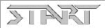

**图 3–14。** *开始按钮的按下状态，starfighterstartbndown*

**图 3–15。**退出按钮的按下状态，星际战斗机

**注意:**本节中列出的代码将假设您已经命名了与上面图片标题中的名称相对应的图像。如果您用不同的名称命名图像，请确保根据需要调整代码示例。

对于主菜单的背景图像，为了简单起见，我们将使用与初始屏幕相同的图像。当然，你可以随意改变这一点，使用任何你想用在主菜单上的图片。然而，出于本书的目的，您也将使用主菜单后面的闪屏图像。

打开位于布局文件夹中的`main.xml`。这个文件应该是在您创建项目时自动创建的。

**注意:**如果你发现你没有一个`main.xml`文件，现在使用本章上一节创建`splashscreen.xml`的相同说明创建一个。在继续本部分之前，确保您有一个`main.xml`文件并且是空的。

同样，除了下面一行代码，您的`main.xml`应该是空的。如果不是，请清除其中的所有文本，但以下文本除外:

`<?xml version="1.0" encoding="utf-8"?>`

您将使用一个`RelativeLayout`布局来保存背景图像和按钮。使用`RelativeLayout`可以控制视图在布局中的精确位置。

如下创建`RelativeLayout`:

`<?xml version="1.0" encoding="utf-8"?>
**<RelativeLayout xmlns:android="http://schemas.android.com/apk/res/android"
android:orientation="vertical"
android:layout_width="match_parent"
android:layout_height="match_parent"
>

</RelativeLayout>**`

这里，您已经创建了一个`RelativeLayout`布局，其中`layout_width`和`layout_height`属性被设置为`match_parent`。

接下来，添加将保存背景图像的`ImageView`。这段代码与您在上一节中为闪屏编写的代码非常接近，所以我将不再赘述的解释。如果您需要复习这些视图的功能，请参考上一节。

`<?xml version="1.0" encoding="utf-8"?>
<RelativeLayout xmlns:android="http://schemas.android.com/apk/res/android"
android:orientation="vertical"
android:layout_width="match_parent"
android:layout_height="match_parent"
>
**<ImageView android:id="@+id/mainMenuImage"
android:src="@drawable/starfighter"
android:layout_width="match_parent"
android:layout_height="match_parent">
</ImageView>**

</RelativeLayout>`

接下来，你必须把按钮放在屏幕上，但在这之前，你必须施一点魔法。

#### 设置布局

右键单击`res\drawable-hdpi`文件夹，添加两个新的 XML 文件:`startselector.xml`和`exitselector.xml`。这些文件将保存一个选择器，告诉你的按钮图像根据按钮的状态而改变。当玩家按下按钮时，这将允许你改变按钮的图像。

将以下代码添加到`startselector.xml`:

`<?xml version="1.0" encoding="utf-8"?>
<selector
xmlns:android="http://schemas.android.com/apk/res/android">
<item android:state_pressed="true"
android:drawable="@drawable/starfighterstartbtndown" />
<item android:drawable="@drawable/starfighterstartbtn" />
</selector>`

请注意，选择器有两个项目属性，一个表示按钮被按下时的状态(`android:state_pressed=` " `true`")，另一个表示按钮处于正常静止状态(除了图像之外没有其他指定)。按下状态的属性有一个设置为`starfighterstartbtndown`图像的图像，静止状态图像是`starfighterstartbtn`图像。

将一个`ImageButton`的`src`属性设置为这个选择器将会在玩家按下按钮时改变按钮的图像。

按如下方式设置`exitselector.xml`代码，为退出按钮实现相同的结果:

`<?xml version="1.0" encoding="utf-8"?>
<selector
xmlns:android="http://schemas.android.com/apk/res/android">
<item android:state_pressed="true" android:drawable="@drawable/starfighterexitbtndown"
/>
<item android:drawable="@drawable/starfighterexitbtn" />
</selector>`

通过创建选择器来改变按钮图像，你可以将`ImageButton`添加到`main.xml`的布局中。

因为您希望按钮与屏幕底部对齐，所以您将在保存按钮的`RelativeLayout`上将`alignParentBottom`属性设置为`true`。然后，将高度设置为`wrap_content`，宽度设置为`match_parent`，将使布局仅与其中的按钮一样高，与屏幕一样宽。

开始按钮将与屏幕的左边缘对齐，退出按钮将与屏幕的右边缘对齐。这将把按钮放在屏幕的下角。

`<?xml version="1.0" encoding="utf-8"?>
<RelativeLayout xmlns:android="http://schemas.android.com/apk/res/android"
android:orientation="vertical"
android:layout_width="match_parent"
android:layout_height="match_parent"
>
<ImageView android:id="@+id/mainMenuImage"
android:src="@drawable/starfighter"
android:layout_width="match_parent"
android:layout_height="match_parent">
</ImageView>
**<RelativeLayout
android:id="@+id/buttons"
android:layout_width="match_parent"
android:layout_height="wrap_content"
android:orientation="horizontal"
android:layout_alignParentBottom="true"
android:layout_marginBottom="20dp">
<ImageButton
android:id="@+id/btnStart"
android:clickable="true"
android:layout_alignParentLeft="true"
android:layout_width="wrap_content"
android:src="@drawable/startselector"
android:layout_height="wrap_content" >
</ImageButton>
<ImageButton
android:id="@+id/btnExit"
android:layout_width="wrap_content"
android:src="@drawable/exitselector"
android:layout_height="wrap_content"
android:layout_alignParentRight="true"
android:clickable="true" >
</ImageButton>

</RelativeLayout>**
</RelativeLayout>`

注意，start 和 exit 按钮的`src`属性被设置为 Start 和 Exit 选择器，您创建它们是为了更改按钮的图像。

如果你现在运行你的游戏，你应该会看到你的闪屏淡入主菜单。主菜单应该类似于[图 3–16](#fig_3_16)。请注意按钮和按钮图像的位置。试着按一个按钮，看看图像是否改变。

**注意:**你可能注意到你的图像按钮有一个灰色的背景，而不是图 3–16 中[的透明背景。在本章后面的`SFMainMenu.java`代码中，你将设置`ImageButton`背景为透明，这样做将去除灰色。](#fig_3_16)

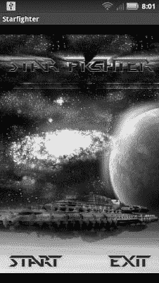

**图 3–16。** *主菜单*

#### 连接按钮

在主菜单上剩下唯一要做的事情就是连接按钮，这样它们就能真正执行一个功能。退出按钮将被设置为退出游戏并杀死所有线程。开始按钮将开始游戏的第一关。因为您还没有创建游戏的第一关，所以您只需按下开始按钮。

打开`SFEngine.java`游戏引擎代码。您需要再创建几个将在主菜单中使用的常量和一个将完成退出清理工作的函数。现在，引擎应该是这样的:

`package com.proandroidgames;

public class SFEngine {
/*Constants that will be used in the game*/
public static final int GAME_THREAD_DELAY = 4000;
}`

你需要添加两个常量:一个用于设置开始和退出按钮的透明度，一个用于设置按钮的触觉反馈。

**注意:**触觉反馈是当你触摸按钮时，某些设备能够给出的触觉反应。

将以下常量添加到`SFEngine`:

`package com.proandroidgames;

public class SFEngine {
/*Constants that will be used in the game*/
public static final int GAME_THREAD_DELAY = 4000;
**public static final int MENU_BUTTON_ALPHA = 0;
public static final boolean HAPTIC_BUTTON_FEEDBACK = true;**
}`

接下来，创建一个返回布尔值的新方法。当退出按钮被按下以在游戏可以干净地退出之前执行任何游戏中需要的内务处理时，这个方法将被调用。

`package com.proandroidgames;

import android.view.View;

public class SFEngine {
/*Constants that will be used in the game*/
public static final int GAME_THREAD_DELAY = 4000;
public static final int MENU_BUTTON_ALPHA = 0;
public static final boolean HAPTIC_BUTTON_FEEDBACK = true;

/*Kill game and exit*/
**public boolean onExit(View v) {
try
{
return true;
}catch(Exception e){
return false;
}

}**
}`

现在，这个方法没有内务处理来执行，所以它只是返回 true，让游戏继续它的退出例程。

保存游戏引擎，打开`SFMainMenu.java`文件。

在主菜单代码中，你要做的第一件事是设置图像按钮的背景透明度，并设置触觉反馈。

`package com.proandroidgames;

import android.app.Activity;
**import android.widget.ImageButton;**
import android.os.Bundle;

public class SFMainMenu extends Activity {
/** Called when the activity is first created. */
@Override
public void onCreate(Bundle savedInstanceState) {
super.onCreate(savedInstanceState);
setContentView(R.layout.main);

**/** Set menu button options */
ImageButton start = (ImageButton)findViewById(R.id.btnStart);
ImageButton exit = (ImageButton)findViewById(R.id.btnExit);

start.getBackground().setAlpha(SFEngine.MENU_BUTTON_ALPHA);
start.setHapticFeedbackEnabled(SFEngine.HAPTIC_BUTTON_FEEDBACK);

exit.getBackground().setAlpha(SFEngine.MENU_BUTTON_ALPHA);
exit.setHapticFeedbackEnabled(SFEngine.HAPTIC_BUTTON_FEEDBACK);**
}
}`

在这里，您在内存中创建了两个以上的`ImageButton`。然后，使用`findViewById()`方法，将内存中的按钮设置为主菜单上的实际按钮。最后，设置背景透明度和每个按钮的触觉反馈。

#### 添加 onClickListeners

接下来，您需要为按钮建立两个`onClickListener`:一个用于开始按钮，一个用于退出按钮。当玩家按下(或点击)相应的按钮时，将执行`onClickListener()`方法。当任一按钮被按下时，您想要执行的任何代码都需要从该按钮的`onClickListener()`中调用。

现在，`onClickListener()`对于开始按钮没有任何作用。你只要把它掐灭，为游戏开始的下一章做准备。退出按钮的`onClickListener()`将调用游戏引擎中的`onExit()`函数，如果函数返回 true，将退出游戏。

`package com.proandroidgames;

import android.app.Activity;
import android.os.Bundle;
**import android.view.View;
import android.view.View.OnClickListener;**
import android.widget.ImageButton;

public class SFMainMenu extends Activity {
/** Called when the activity is first created. */
@Override
public void onCreate(Bundle savedInstanceState) {
super.onCreate(savedInstanceState);
setContentView(R.layout.main);

**final SFEngine engine = new SFEngine();**

/** Set menu button options */
ImageButton start = (ImageButton)findViewById(R.id.btnStart);
ImageButton exit = (ImageButton)findViewById(R.id.btnExit);

start.getBackground().setAlpha(SFEngine.MENU_BUTTON_ALPHA);
start.setHapticFeedbackEnabled(SFEngine.HAPTIC_BUTTON_FEEDBACK);

exit.getBackground().setAlpha(SFEngine.MENU_BUTTON_ALPHA);
exit.setHapticFeedbackEnabled(SFEngine.HAPTIC_BUTTON_FEEDBACK);

**start.setOnClickListener(new OnClickListener(){
@Override
public void onClick(View v) {
/** Start Game!!!! */
}

});

exit.setOnClickListener(new OnClickListener(){
@Override
public void onClick(View v) {
boolean clean = false;
clean = engine.onExit(v);
if (clean)
{
int pid= android.os.Process.myPid();
android.os.Process.killProcess(pid);
}
}
});**
}

}`

保存`SFMainMenu.java`，并运行您的代码。你现在应该可以点击退出按钮来关闭游戏。按钮也应该有透明的背景，启动画面应该平滑地淡入主菜单。

创建一个非常专业的闪屏和主菜单的最后一步是添加一些背景音乐。

### 添加音乐

在本节中，您将学习如何从游戏中生成第二个线程。该线程将用于运行将在主菜单后面播放的背景音乐。您将生成一个线程，创建一个播放音乐的服务，然后在引擎的内务处理功能中终止音乐和线程。

**注意:**如果你之前从未使用过音乐文件和安卓系统，请谨慎对待你的文件大小。如果您的媒体文件太大，您可能会消耗活动的所有可用内存并使其崩溃。我尽量把背景音乐这样的东西放在一个 10 到 15 秒的小循环中，这样可以重复播放。

您需要做的第一件事是添加一个`res\raw`文件夹。所有的音乐文件都存储在`raw`文件夹中，但遗憾的是，这个文件夹不是在你创建项目时为你创建的。右击`res`文件夹，选择**新建**  **文件夹**。将文件夹命名为`raw`，如图[图 3–17](#fig_3_17)所示。

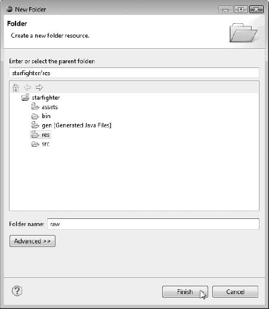

**图 3–17。** *创建原始文件夹*

下一步是将您的媒体文件复制到`res\raw`文件夹中。

**注:**通过 Matt McFarland 在`[www.mattmcfarland.com](http://www.mattmcfarland.com)`签署的知识共享许可协议，使用本代码发布的音乐是免版税的音乐。我从他的歌曲中抽取了 15 秒钟的样本，在这本书的部分游戏中循环播放。

如果您正在使用这个项目中的文件，主菜单的音乐是`warfieldedit.ogg`。再说一次，你可以随意使用任何你想用在主菜单上的音乐；请注意尺寸。

接下来，让我们向将在音乐服务中使用的引擎添加一些常量。打开`SFEngine.java`，添加以下常量:

`package com.proandroidgames;

import android.content.Context;
import android.view.View;

public class SFEngine {
/*Constants that will be used in the game*/
public static final int GAME_THREAD_DELAY = 4000;
public static final int MENU_BUTTON_ALPHA = 0;
public static final boolean HAPTIC_BUTTON_FEEDBACK = true;
**public static final int SPLASH_SCREEN_MUSIC = R.raw.warfieldedit;
public static final int R_VOLUME = 100;
public static final int L_VOLUME = 100;
public static final boolean LOOP_BACKGROUND_MUSIC = true;
public static Context context;**

/*Kill game and exit*/
public boolean onExit(View v) {
try
{
return true;
}catch(Exception e){
return false;
}

}

}`

`SPLASH_SCREEN_MUSIC`是一个常量指针，指向您将要播放的实际音乐文件，在本例中为`warfieldedit.ogg`。`R_VOLUME`和`L_VOLUME`变量将设置音乐的初始音量，`LOOP_BACKGROUND_MUSIC`是一个布尔值，告诉服务是否循环。最后，`context`变量将保存音乐正在播放的线程的当前上下文，以便我们可以在游戏的内务处理过程中杀死它。所有这些新的常量和变量都将从服务中调用。

现在，让我们创建一个播放这个音乐文件的服务。然后，您可以在主菜单的一个线程中启动该服务。

#### 创建音乐服务

在游戏包中添加一个名为`SFMusic.java`的新类文件。您应该有一个空白类，如下所示:

`package com.proandroidgames;

public class SFMusic {

}`

您需要做的第一件事是让这个类扩展`Service`:

`package com.proandroidgames;

import android.app.Service;

public class SFMusic extends Service{

}`

此时，Eclipse 可能会向您抛出一个错误，因为您还没有实现扩展`Service`所需的所有方法。暂时忽略这个错误。将以下方法添加到服务中:

 `package com.proandroidgames;

import android.app.Service;
**import android.content.Intent;
import android.os.IBinder;**

public class SFMusic extends Service{

**@Override
public IBinder onBind(Intent arg0) {
return null;
}

@Override
public void onCreate() {
super.onCreate();
}

public int onStartCommand(Intent intent, int flags, int startId) {
return 1;
}
public void onStart(Intent intent, int startId) {

}
public void onStop() {

}

public IBinder onUnBind(Intent arg0) {
// TODO Auto-generated method stub
return null;
}
public void onPause() {

}

@Override
public void onDestroy() {

}

@Override
public void onLowMemory() {

}**

}`

有了服务代码，让我们创建两个变量。第一个是名为`isRunning`的布尔值。这将用于查询服务以确定它是否正在运行。有时，你需要知道服务是否在运行，如果它还在运行，你可以关掉音乐，如果它已经停止，你可以重启它。

**注意:**最初`isRunning`布尔将被设置为`false`。当服务实际启动时，您将把它设置为`true`。

您需要创建的第二个变量是`MediaPlayer`，它将实际播放您的音乐。

 `package com.proandroidgames;

import android.app.Service;
**import android.media.MediaPlayer;**
import android.content.Intent;
import android.os.IBinder;

public class SFMusic extends Service{
**public static boolean isRunning = false;
MediaPlayer player;**
@Override
public IBinder onBind(Intent arg0) {
return null;
}

@Override
public void onCreate() {
super.onCreate();
}

public int onStartCommand(Intent intent, int flags, int startId) {
return 1;
}
public void onStart(Intent intent, int startId) {

}
public void onStop() {

}

public IBinder onUnBind(Intent arg0) {
// TODO Auto-generated method stub
return null;
}
public void onPause() {

}

@Override
public void onDestroy() {

}

@Override
public void onLowMemory() {

}

}`

接下来，您需要在服务中创建一个为`MediaPlayer`设置选项的方法。这些是我们在引擎中为其创建常量的选项:音量、循环和媒体文件。这个方法将接受您创建的常量，并将它们直接传递给`MediaPlayer`。您将从`onCreate()`方法中调用这个方法，这样，一旦创建了服务，就会设置`MediaPlayer`选项。

 `package com.proandroidgames;

import android.app.Service;
import android.media.MediaPlayer;
import android.content.Intent;
import android.os.IBinder;
**import android.content.Context;**

public class SFMusic extends Service{
public static boolean isRunning = false;
MediaPlayer player;
@Override
public IBinder onBind(Intent arg0) {
return null;
}

@Override
**public void onCreate() {
super.onCreate();**
**setMusicOptions(this,SFEngine.LOOP_BACKGROUND_MUSIC,SFEngine.R_VOLUME,SFEngine.L_VOLUME,
SFEngine.SPLASH_SCREEN_MUSIC);
}
public void setMusicOptions(Context context, boolean isLooped, int rVolume, int lVolume, int soundFile){
player = MediaPlayer.create(context, soundFile);
player.setLooping(isLooped);
player.setVolume(rVolume,lVolume);**
}
public int onStartCommand(Intent intent, int flags, int startId) {
return 1;
}
public void onStart(Intent intent, int startId) {

}
public void onStop() {

}

public IBinder onUnBind(Intent arg0) {
// TODO Auto-generated method stub
return null;
}
public void onPause() {

}

@Override
public void onDestroy() {

}

@Override
public void onLowMemory() {

}

}`

您需要添加到服务中的最后一段代码指出了媒体播放开始和停止的所有位置。这段代码应该非常容易理解，但是有点分散。逻辑地思考一下；你要用任何处理开始或创建的方法来开始音乐，用任何处理停止的方法来停止音乐。确保相应地设置`isRunning`布尔值，以便您可以正确地查询服务是否正在运行。

`package com.proandroidgames;

import android.app.Service;
import android.content.Context;
import android.content.Intent;
import android.media.MediaPlayer;
import android.os.IBinder;

public class SFMusic extends Service{
public static boolean isRunning = false;
MediaPlayer player;

@Override
public IBinder onBind(Intent arg0) {
return null;
}

@Override
public void onCreate() {
super.onCreate();

setMusicOptions(this,SFEngine.LOOP_BACKGROUND_MUSIC,SFEngine.R_VOLUME,SFEngine.L_VOLUME,
SFEngine.SPLASH_SCREEN_MUSIC);
}
public void setMusicOptions(Context context, boolean isLooped, int rVolume, int lVolume, int soundFile){
player = MediaPlayer.create(context, soundFile);
player.setLooping(isLooped);
player.setVolume(rVolume,lVolume);
}
**public int onStartCommand(Intent intent, int flags, int startId) {
try
{
player.start();
isRunning = true;
}catch(Exception e){
isRunning = false;
player.stop();
}

return 1;**
}
public void onStart(Intent intent, int startId) {

}
public IBinder onUnBind(Intent arg0) {
// TODO Auto-generated method stub
return null;
**}
public void onStop() {
isRunning = false;
}
public void onPause() { }
@Override
public void onDestroy() {
player.stop();
player.release();
}
@Override
public void onLowMemory() {
player.stop();
}**

}`

服务的代码现在已经编写好了。但是，在使用它之前，您需要将该服务与您的 Android 项目相关联。之前，您使用了`AndroidManifest`将一个新的活动与项目关联起来。您可以按照相同的步骤将新的`SFMusic`服务与项目关联起来。

打开`AndroidManifest.xml`，点击编辑器窗口底部附近的应用选项卡。打开“应用程序”选项卡后，滚动到窗口底部的“应用程序节点”部分。单击“添加”按钮添加新节点，并从列表中选择“服务”。

在“应用程序节点”窗口中单击新的服务节点，并导航到编辑器窗口右侧的服务属性。现在，您应该能够单击 Name 属性右侧的 Browse 按钮了。在浏览器中找到您的`SFMusic`服务，并完成操作。

现在，您可以在游戏中使用音乐服务了。

#### 播放您的音乐

打开`SFEngine.java`，添加一个名为`musicThread`的新公共`Thread()`。您将在`SFMainMenu`中初始化这个线程。

`package com.proandroidgames;

import android.content.Context;
import android.content.Intent;
import android.view.View;

public class SFEngine {
/*Constants that will be used in the game*/
public static final int GAME_THREAD_DELAY = 4000;
public static final int MENU_BUTTON_ALPHA = 0;
public static final boolean HAPTIC_BUTTON_FEEDBACK = true;
public static final int SPLASH_SCREEN_MUSIC = R.raw.warfieldedit;
public static final int R_VOLUME = 100;
public static final int L_VOLUME = 100;
public static final boolean LOOP_BACKGROUND_MUSIC = true;
public static Context context;
**public static Thread musicThread;**

/*Kill game and exit*/
public boolean onExit(View v) {
try
{
return true;
}catch(Exception e){
return false;
}

}

}`

现在，打开`SFMainMenu.java`，创建一个新的`Thread()`分配给`musicthread`来运行你的音乐服务。

`package com.proandroidgames;

import android.app.Activity;
import android.content.Intent;
import android.os.Bundle;
import android.view.View;
import android.view.View.OnClickListener;
import android.widget.ImageButton;

public class SFMainMenu extends Activity {
/** Called when the activity is first created. */
@Override
public void onCreate(Bundle savedInstanceState) {
super.onCreate(savedInstanceState);
setContentView(R.layout.main);

**/** Fire up background music */
SFEngine.musicThread = new Thread(){
public void run(){
Intent bgmusic = new
Intent(getApplicationContext(), SFMusic.class);
startService(bgmusic);
SFEngine.context = getApplicationContext();
}
};
SFEngine.musicThread.start();**

final SFEngine engine = new SFEngine();

/** Set menu button options */
ImageButton start = (ImageButton)findViewById(R.id.btnStart);
ImageButton exit = (ImageButton)findViewById(R.id.btnExit);

start.getBackground().setAlpha(SFEngine.MENU_BUTTON_ALPHA);
start.setHapticFeedbackEnabled(SFEngine.HAPTIC_BUTTON_FEEDBACK);

exit.getBackground().setAlpha(SFEngine.MENU_BUTTON_ALPHA);
exit.setHapticFeedbackEnabled(SFEngine.HAPTIC_BUTTON_FEEDBACK);

start.setOnClickListener(new OnClickListener(){
@Override
public void onClick(View v) {
/** Start
Game!!!! */
}

});

exit.setOnClickListener(new OnClickListener(){
@Override
public void onClick(View v) {
boolean clean =
false;
clean =
engine.onExit(v);
if (clean)
{
int pid= android.os.Process.myPid();
android.os.Process.killProcess(pid);
}
}
);
}

}`

最后，你需要在整理房间的时候关掉背景音乐服务。返回到`SFEngine`，添加以下代码来终止服务和线程:

`package com.proandroidgames;

import android.content.Context;
import android.content.Intent;
import android.view.View;

public class SFEngine {
/*Constants that will be used in the game*/
public static final int GAME_THREAD_DELAY = 4000;
public static final int MENU_BUTTON_ALPHA = 0;
public static final boolean HAPTIC_BUTTON_FEEDBACK = true;
public static final int SPLASH_SCREEN_MUSIC = R.raw.warfieldedit;
public static final int R_VOLUME = 100;
public static final int L_VOLUME = 100;
public static final boolean LOOP_BACKGROUND_MUSIC = true;
public static Context context;
public static Thread musicThread;

/*Kill game and exit*/
public boolean onExit(View v) {
try
{
**Intent bgmusic = new Intent(context, SFMusic.class);
context.stopService(bgmusic);
musicThread.stop();**
return true;
}catch(Exception e){
return false;
}

}

}`

编译并运行你的游戏。你现在应该有一个工作的闪屏，背景音乐干净地退出。在下一章，你将开始建造游戏的第一关，从它的背景开始。

### 总结

在这一章中，你为你的游戏设定了第一个代码。你创建了一个闪屏，淡入然后淡出游戏的主菜单。您还创建了游戏的主菜单，带有开始和退出选项。最后，您使用媒体播放器和原始音乐文件为游戏添加了一些背景音乐。

在下一章，你将为你的游戏创建一个两层的滚动背景。