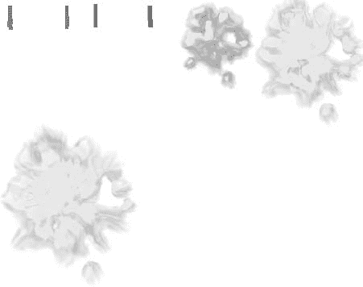

## 第八章

## 保护你自己！

你的游戏开发技能正在飞速发展。虽然*星际战士*不会赢得任何游戏奖项，但它是你磨练新开发的游戏制作技能的完美沙盒。

现在，你发现自己已经到了这本书的最后一章，这一章将直接涉及一个基于 2-D 精灵的游戏的开发。在这一章中，你将为你的角色添加一件武器，并创建一些基本的 2-D 碰撞检测。您将加载一个包含一些武器图像的 sprite 表，为子弹编写一些 AI 逻辑以遵循一条路径，并创建一些碰撞检测以确保您知道您的武器何时击中目标。

如果这将是一个完整的游戏，你将向公众发布，你会想增加一些分数跟踪，多个级别，可能的项目，如电源和可升级的武器。然而，这个小型 2d 项目的真正目的是给你一个适当的知识基础和足够的使用技巧的经验，这样关于 3d 游戏开发的章节([第 10 章](10.html#ch10)–[第 12 章](12.html#ch12))对你来说就有意义了。在这一章的结尾，你将有机会回顾到目前为止你已经处理过的一些关键文件。这将确保你在进入三维开发的下一阶段之前一切就绪。

### 创建武器精灵表

你的玩家在游戏中坚持不了多久，就无法抵御上一章中敌人的攻击。因此，你将为你的玩家配备标准的太空战斗武器——爆能枪。

你首先需要为你的武器创建一个精灵表，就像你为第 6 章的敌人和第 5 章的可玩角色创建精灵表一样。

**注:**理论上，武器可以和玩家以及敌舰放在同一个精灵表上。然而，看看如何在 OpenGL 中处理两个纹理是一个很好的练习。

将 sprite 表(可以从本书的 Apress.com 页面下载，连同该项目的代码)添加到你的 *Star Fighter* 项目中。[图 8–1](#fig_8_1)中的精灵表包括多种武器和角色爆炸。

**图 8–1。**武器精灵表

一旦将 sprite 表添加到项目中，打开`SFEngine.java`文件并向其中添加以下常量:

`SFEngine public static final int WEAPONS_SHEET = R.drawable.destruction;
**public static final int PLAYER_SHIELDS = 5;
public static final int SCOUT_SHIELDS = 3;
public static final int INTERCEPTOR_SHIELDS = 1;
public static final int WARSHIP_SHIELDS = 5;
public static final float PLAYER_BULLET_SPEED = .125f;**
SFMusic`

`WEAPONS_SHEET`常量将保存指向新 sprite 工作表的指针。`SHOUT_SHIELDS`、`INTERCEPTOR_SHIELDS`和`WARSHIP_SHIELDS`常量将指示各自的敌人在被摧毁前可以承受多少击，而`PLAYER_BULLET_SPEED`常量将保持爆能枪离开可玩角色并在屏幕上移动的速度。

#### 创建武器类别

当你创建了可玩的角色和敌人时，你创建了一个类作为他们的基础。你要对武器进行同样的处理。为你的武器创建一个名为`SFWeapon`的新职业。

`package com.proandroidgames;

public class SFWeapon {

}`

你需要知道关于你的武器的三件事来把它们画到屏幕上:精灵顶点的 x 和 y 位置，以及精灵当前是否在屏幕上。x 和 y 位置将帮助你把精灵放在屏幕上的正确点上，它们也将帮助你确定碰撞。

就像你可能会看到多个敌人一样，屏幕上会同时出现不止一个爆能枪。因此，你要把武器放在一个数组里。当你遍历数组时，你需要知道你正在看的镜头是否在屏幕上，或者它是否可以自由发射。

将下列公共属性添加到您的类中:

`package com.proandroidgames;

public class SFWeapon {

**public float posY = 0f;
public float posX = 0f;
public boolean shotFired = false;**

}`

创建顶点，索引和纹理数组，就像你在敌人和可玩角色类中所做的一样。这些数组和构造函数一起，将用于设置 OpenGL 将你的武器绘制到屏幕上所需的数据。

`public class SFWeapon {

public float posY = 0f;
public float posX = 0f;
public boolean shotFired = false;

**private FloatBuffer vertexBuffer;
private FloatBuffer textureBuffer;
private ByteBuffer indexBuffer;

private float vertices[] = {
0.0f, 0.0f, 0.0f,
1.0f, 0.0f, 0.0f,
1.0f, 1.0f, 0.0f,
0.0f, 1.0f, 0.0f,**
**};

private float texture[] = {
0.0f, 0.0f,
0.25f, 0.0f,
0.25f, 0.25f,
0.0f, 0.25f,
};

private byte indices[] = {
0,1,2,
0,2,3,
};

public SFWeapon() {

ByteBuffer byteBuf = ByteBuffer.allocateDirect(vertices.length * 4);
byteBuf.order(ByteOrder.nativeOrder());
vertexBuffer = byteBuf.asFloatBuffer();
vertexBuffer.put(vertices);
vertexBuffer.position(0);

byteBuf = ByteBuffer.allocateDirect(texture.length * 4);
byteBuf.order(ByteOrder.nativeOrder());
textureBuffer = byteBuf.asFloatBuffer();
textureBuffer.put(texture);
textureBuffer.position(0);

indexBuffer = ByteBuffer.allocateDirect(indices.length);
indexBuffer.put(indices);
indexBuffer.position(0);
}**

}`

创建武器类的最后一步是创建一个`onDraw()`方法。学习了前面的章节，您应该非常熟悉`onDraw()`方法。请注意，武器精灵表将是你在前一章为游戏循环创建的`spriteSheet`数组中的第二个 OpenGL 指针。因此，适当地修改`onDraw()`方法，以便在调用该方法时从正确的 sprite 表中提取。

`public class SFWeapon {

…

**public void draw(GL10 gl, int[] spriteSheet) {
gl.glBindTexture(GL10.GL_TEXTURE_2D, spriteSheet[1]);

gl.glFrontFace(GL10.GL_CCW);
gl.glEnable(GL10.GL_CULL_FACE);
gl.glCullFace(GL10.GL_BACK);**

**gl.glEnableClientState(GL10.GL_VERTEX_ARRAY);
gl.glEnableClientState(GL10.GL_TEXTURE_COORD_ARRAY);

gl.glVertexPointer(3, GL10.GL_FLOAT, 0, vertexBuffer);
gl.glTexCoordPointer(2, GL10.GL_FLOAT, 0, textureBuffer);

gl.glDrawElements(GL10.GL_TRIANGLES, indices.length,
GL10.GL_UNSIGNED_BYTE, indexBuffer);

gl.glDisableClientState(GL10.GL_VERTEX_ARRAY);
gl.glDisableClientState(GL10.GL_TEXTURE_COORD_ARRAY);
gl.glDisable(GL10.GL_CULL_FACE);
}**
}`

随着你的武器类的创建，你现在可以进入游戏循环并添加武器了。在下一节中，您将为您的可玩角色创建自动射击过程，并让它从您创建的武器类中发射武器。

### 给你的武器一个轨迹

现在你已经创建了你的武器类，你已经准备好实例化它并创建一个方法来允许可玩角色发射它。回想一下，在*星际战士*的故事中，可玩角色的武器是自动开火的。因此，你创建的发射武器的方法必须没有玩家的参与。

#### 创建武器阵列

就像你对敌舰所做的那样，你将创建一个数组来保存你的玩家可能发射的所有可能的射击。打开`SFGameRenderer`，在你的游戏循环类中创建一个新的`SFWeapon()`数组。

`package com.proandroidgames;

import java.util.Random;

import javax.microedition.khronos.egl.EGLConfig;
import javax.microedition.khronos.opengles.GL10;

import android.opengl.GLSurfaceView.Renderer;

public class SFGameRenderer implements Renderer{
private SFBackGround background = new SFBackGround();
private SFBackGround background2 = new SFBackGround();
private SFGoodGuy player1 = new SFGoodGuy();
private SFEnemy[] enemies = new SFEnemy[SFEngine.TOTAL_INTERCEPTORS +
SFEngine.TOTAL_SCOUTS + SFEngine.TOTAL_WARSHIPS - 1];
private SFTextures textureLoader;
private int[] spriteSheets = new int[2];
**private SFWeapon[] playerFire = new SFWeapon[4];**

...

}`

在上一章中，您创建了一个通用纹理类。因为这个类当前在你的游戏循环中被实例化，它将包含两个纹理。现在是时候向这个数组添加第二个 sprite 工作表了。

#### 添加第二个子画面

第二个子画面是保存武器的画面。

`public class SFGameRenderer implements Renderer{

...

@Override
public void onSurfaceCreated(GL10 gl, EGLConfig config) {
initializeInterceptors();
initializeScouts();
initializeWarships();
initializePlayerWeapons();
textureLoader = new SFTextures(gl);
spriteSheets = textureLoader.loadTexture(gl, SFEngine.CHARACTER_SHEET,
SFEngine.context, 1);
**spriteSheets = textureLoader.loadTexture(gl, SFEngine.WEAPONS_SHEET, SFEngine.context,
2);**

gl.glEnable(GL10.GL_TEXTURE_2D);
gl.glClearDepthf(1.0f);
gl.glEnable(GL10.GL_DEPTH_TEST);
gl.glDepthFunc(GL10.GL_LEQUAL);

background.loadTexture(gl,SFEngine.BACKGROUND_LAYER_ONE,
SFEngine.context);
background2.loadTexture(gl,SFEngine.BACKGROUND_LAYER_TWO,
SFEngine.context);

}`

**注意:**小心将新的工作表标记为 2 号，否则您将替换之前的工作表。

在前一章中，您编写了一个初始化方法来实例化敌人类的新副本，并将其添加到敌人的数组中。当你为你的角色创造武器时，你将遵循同样的过程。

#### 初始化武器

首先创建一个名为`initializePlayerWeapons()`的初始化类，如下所示:

`public class SFGameRenderer implements Renderer{

...

**private void initializePlayerWeapons(){

}**

...

}`

在`initializePlayerWeapons()`方法中，您需要遍历您创建的`playerFire[]`数组，并向其中添加一个新的`SFWeapon()`类实例。

`public class SFGameRenderer implements Renderer{

...

**private void initializePlayerWeapons(){
for(int x = 0; x < 4; x++){
SFWeapon weapon = new SFWeapon();
playerFire[x] = weapon;
}

}**

...

}`

通过设置要发射的第一个镜头的初始属性来结束初始化方法。由于武器是自动点火的，你可以将第一枪设定为已经发射。镜头的 x 轴位置将等于玩家角色的当前 x 轴位置。

至于 y 轴的位置，设置为 1.25。这会将镜头的 y 轴设置为略高于玩家的船，让它看起来像是从正面的爆能炮中出来的。如果你把 y 轴设置的更低，这个镜头将会被绘制在船的上方，看起来就像是从船的顶部的某个地方来的。

`public class SFGameRenderer implements Renderer{

...

**private void initializePlayerWeapons(){**
**for(int x = 0; x < 4; x++){
SFWeapon weapon = new SFWeapon();
playerFire[x] = weapon;
}
playerFire[0].shotFired = true;
playerFire[0].posX = SFEngine.playerBankPosX;
playerFire[0].posY = 1.25f;
}**

...

}`

武器射击的数组被创建、实例化和填充。在前面的章节中，你创建了私有方法，可以从游戏循环中调用这些方法来移动玩家和敌人。现在，您需要创建一个私有方法来在屏幕上移动武器镜头。

#### 移动武器射击

每次射击的轨迹将是一条直线，它将从射击时玩家的 x 位置移动到屏幕的顶部。创建一个名为`firePlayerWeapon()`的方法，用于在发射时沿直线移动每个镜头。

`public class SFGameRenderer implements Renderer{

...

**private void initializePlayerWeapons(){
for(int x = 0; x < 4; x++){
SFWeapon weapon = new SFWeapon();
playerFire[x] = weapon;
}
playerFire[0].shotFired = true;
playerFire[0].posX = SFEngine.playerBankPosX;
playerFire[0].posY = 1.25f;
}

...

private void firePlayerWeapon(GL10 gl){

}**

...

}`

在`firePlayerWeapon()`方法中，创建一个循环，该循环只有在镜头被触发时才会运行。这将使你免于在不需要绘制的镜头上循环。

`public class SFGameRenderer implements Renderer{

...

**private void firePlayerWeapon(GL10 gl){
for(int x = 0; x < 4; x++ ){
if (playerFire[x].shotFired){

}
}

}**

...

}`

在这个方法中，您要做的第一件事是创建一个名为`nextShot`的 int。可玩角色的自动射击功能会连续射击每个镜头。因此，一个镜头不应该发射，直到前一个镜头已经从角色移动了可接受的距离。int 跟踪下一个要发射的镜头，所以你可以在合适的时候设置一些初始属性。

`public class SFGameRenderer implements Renderer{

...

**private void firePlayerWeapon(GL10 gl){
for(int x = 0; x < 4; x++ ){
if (playerFire[x].shotFired){
int nextShot = 0;

}
}
}**

...

}`

#### 检测屏幕边缘

您需要一种方法来确定一个镜头是否击中了可视屏幕的边缘，这样当玩家看不到它时，大炮爆炸就不会被绘制出来，从而浪费了宝贵的资源。设置一个`if`语句来测试当前镜头是否离开了屏幕。如果快照已经延伸到屏幕之外，将其`shotFired`属性设置为`false`以防止它被不必要的绘制。

`public class SFGameRenderer implements Renderer{

...

**private void firePlayerWeapon(GL10 gl){
for(int x = 0; x < 4; x++ ){
if (playerFire[x].shotFired){
int nextShot = 0;
if (playerFire[x].posY > 4.25){
playerFire[x].shotFired = false;
}else{

}

}
}
}**

...

}`

假设镜头还没有延伸到屏幕之外，它必须仍然在玩家的视野中，并且必须被处理。因为镜头以直线轨迹飞行，所以你要移动镜头所要做的就是继续将`PLAYER_BULLET_SPEED`添加到镜头的当前 y 位置。然后，您可以调用在屏幕上绘制字符时一直在处理的所有 OpenGL 操作。

**提示:**如果以下代码中的任何 OpenGL 操作看起来不熟悉，请查看[第 4 章](04.html#ch4)和[第 5 章](05.html#ch5)。

`public class SFGameRenderer implements Renderer{

...

**private void firePlayerWeapon(GL10 gl){
for(int x = 0; x < 4; x++ ){
if (playerFire[x].shotFired){
int nextShot = 0;
if (playerFire[x].posY > 4.25){
playerFire[x].shotFired = false;
}else{

playerFire[x].posY += SFEngine.PLAYER_BULLET_SPEED;
gl.glMatrixMode(GL10.GL_MODELVIEW);
gl.glLoadIdentity();
gl.glPushMatrix();
gl.glScalef(.25f, .25f, 0f);
gl.glTranslatef(playerFire[x].posX, playerFire[x].posY, 0f);

gl.glMatrixMode(GL10.GL_TEXTURE);
gl.glLoadIdentity();
gl.glTranslatef(0.0f,0.0f, 0.0f);

playerFire[x].draw(gl,spriteSheets);**
**gl.glPopMatrix();
gl.glLoadIdentity();

}
}
}
}**

...

}`

在这个方法中，你需要注意最后一件事。一旦当前镜头沿 y 轴移动到距离角色超过 1 个单位，就该发射下一个镜头了。因此，您需要测试当前镜头是否距离角色超过 1 个 y 轴单位，如果是，则设置要发射的下一个镜头的属性。

请记住，镜头是连续发射的，所以当最后一个镜头发射时，第一个镜头应该离开屏幕并被禁用。当最后一次发射超过发射阈值时，可以再次发射第一次发射。

`public class SFGameRenderer implements Renderer{

...

**private void firePlayerWeapon(GL10 gl){
for(int x = 0; x < 4; x++ ){
if (playerFire[x].shotFired){
int nextShot = 0;
if (playerFire[x].posY > 4.25){
playerFire[x].shotFired = false;
}else{
if (playerFire[x].posY> 2){
if (x == 3){
nextShot = 0;
}else{
nextShot = x + 1;
}
if (playerFire[nextShot].shotFired ==
false){
playerFire[nextShot].shotFired =
true;
playerFire[nextShot].posX =
SFEngine.playerBankPosX;
playerFire[nextShot].posY =
1.25f;
}
}
playerFire[x].posY +=
SFEngine.PLAYER_BULLET_SPEED;
gl.glMatrixMode(GL10.GL_MODELVIEW);
gl.glLoadIdentity();
gl.glPushMatrix();**
**gl.glScalef(.25f, .25f, 0f);
gl.glTranslatef(playerFire[x].posX, playerFire[x].posY, 0f);

gl.glMatrixMode(GL10.GL_TEXTURE);
gl.glLoadIdentity();
gl.glTranslatef(0.0f,0.0f, 0.0f);

playerFire[x].draw(gl,spriteSheets);
gl.glPopMatrix();
gl.glLoadIdentity();

}
}
}
}**

...

}`

#### 调用 firePlayerWeapons()方法

当你在处理可玩的角色和敌人时，你从主游戏循环中调用方法来移动他们。对玩家的武器遵循这个过程的问题是，你不知道玩家的角色当前是否有效并准备好开火。为了解决这个问题，您将从`movePlayer1()`方法中调用`firePlayerWeapons()`方法，而不是从主游戏循环中调用它。这样做可以确保你只在有资格移动的时候才移动屏幕上的武器。

`public class SFGameRenderer implements Renderer{

...

private void movePlayer1(GL10 gl){
if(!player1.isDestroyed){
switch (SFEngine.playerFlightAction){

...

}
**firePlayerWeapon(gl);**
}
}

...

}`

你的玩家现在可以向敌人开火。然而，这些武器不能完成任何事情。如果你现在编译并玩这个游戏，你会看到镜头简单地飞过任何敌人，并一直持续到它们到达屏幕的边缘。同样，敌人会继续下降，对任何枪声都视而不见。

为了使你的镜头有效，你需要创建一些碰撞检测。在下一节中，您将创建一个简单的 2-D 碰撞检测方法，用于确定是否应该消灭敌人。

### 实施碰撞检测

碰撞检测确定屏幕上的两个物体是否接触，并且对于任何视频游戏都是必不可少的。在*星际战士*中，你会使用基本的碰撞检测来消灭敌人。在其他游戏中，碰撞检测用于阻止玩家穿墙，允许玩家捡起新物品，甚至确定敌人是否能从模糊的视野中看到玩家。

在本节中，您将创建一个方法来跟踪屏幕上每个敌人的位置，以及每一次射击，以确定是否有任何射击击中了任何敌人。在像*星际战士*这样的 2d 游戏中，这个过程变得更容易，因为你只需要在两个轴上测试(在 2d 游戏中你不需要处理 z 轴)。

#### 施加碰撞伤害

当检测到碰撞时，你必须对被击中的敌人造成伤害。每个敌人在被消灭前都可以受到一定的伤害。为了跟踪这种损坏，在您的`SFEnemy()`类中创建一个名为`applyDamage()`的新方法。这个方法只是在每次特定的敌人被击中时增加一个 int 值。当 int 值达到该敌人的预定义限制时，`isDestroyed`旗将被翻转，敌人将不再被吸引到屏幕上。

`package com.proandroidgames;

...

import javax.microedition.khronos.opengles.GL10;

public class SFEnemy {

public float posY = 0f;
public float posX = 0f;
public float posT = 0f;
public float incrementXToTarget = 0f;
public float incrementYToTarget = 0f;
public int attackDirection = 0;
**public boolean isDestroyed = false;
private int damage = 0;

...

public void applyDamage(){
damage++;
switch(enemyType){**
**case SFEngine.TYPE_INTERCEPTOR:
if (damage == SFEngine.INTERCEPTOR_SHIELDS){
isDestroyed = true;
}
break;
case SFEngine.TYPE_SCOUT:
if (damage == SFEngine.SCOUT_SHIELDS){
isDestroyed = true;
}
break;
case SFEngine.TYPE_WARSHIP:
if (damage == SFEngine.WARSHIP_SHIELDS){
isDestroyed = true;
}
break;
}
}**

...

}`

每当你的碰撞检测方法确定与敌船发生碰撞时，你所要做的就是调用敌人的`appyDamage()`方法，剩下的就交给它了。一旦敌人身上的`isDestroyed`旗帜被设定为`true`，该敌人将不再被`moveEnemy()`方法处理或被绘制到屏幕上。保存并关闭`SFEnemy.java`。

#### 创建 detectCollisions()方法

碰撞损伤计算完成后，通过在你的`SFGameRenderer.java`文件中创建一个名为`detectCollisions()`的方法继续编辑你的渲染器。

`public class SFGameRenderer implements Renderer{
**private void initializePlayerWeapons(){
for(int x = 0; x < 4; x++){
sfweapon weapon = new sfweapon();
playerFire[x] = weapon;
}
playerFire[0].shotFired = true;
playerFire[0].posX = sfengine.playerBankPosX;
playerFire[0].posY = 1.25f;
}

...

private void detectCollisions(){

}**

...

}`

在`detectCollisions()`方法中，设置两个循环，一个循环遍历每一次射击，另一个循环遍历每一个还没有被消灭的敌人。请记住，因为敌人是在屏幕上边缘以外的随机位置开始的，所以他们可以在玩家视野之外有效(`isDestroyed == false`)。这意味着你还需要测试敌人是否在玩家的视野之内，以及它是否已经被摧毁。

`public class SFGameRenderer implements Renderer{

...

**private void detectCollisions(){
for (int y = 0; y < 3; y ++){
if (playerFire[y].shotFired){
for (int x = 0; x < SFEngine.TOTAL_INTERCEPTORS +
SFEngine.TOTAL_SCOUTS + SFEngine.TOTAL_WARSHIPS - 1; x++ ){
if(!enemies[x].isDestroyed && enemies[x].posY <
4.25 ){

}
}
}
}

}**

...

}`

现在该方法的棘手部分来了。你知道每一个敌人和每一发子弹的两条信息:x 和 y 位置。你也知道敌人和射击的顶点的尺寸；在这种情况下，它们都是 1 × 1 的单位。

#### 检测特定的碰撞

创建一个`if`语句，根据一个镜头和一个敌人的 x 和 y 位置以及它们各自的尺寸来确定它们是否发生碰撞。

`public class SFGameRenderer implements Renderer{

...

**private void detectCollisions(){
for (int y = 0; y < 3; y ++){
if (playerFire[y].shotFired){
for (int x = 0; x < SFEngine.TOTAL_INTERCEPTORS +
SFEngine.TOTAL_SCOUTS + SFEngine.TOTAL_WARSHIPS - 1; x++ ){**
**if(!enemies[x].isDestroyed && enemies[x].posY <
4.25 ){
if ((playerFire[y].posY >=
enemies[x].posY - 1
&& playerFire[y].posY <= enemies[x].posY )
&& (playerFire[y].posX <= enemies[x].posX + 1
&& playerFire[y].posX >= enemies[x].posX - 1)){

}
}
}
}
}
}**

...

...

}`

如果敌人和被测试的子弹都通过了这个`if`声明，那么他们就相撞了。当和敌人和一发子弹相撞时，你需要对敌人调用`applyDamage()`方法，要么增加那个敌人的伤害，要么彻底消灭它。

#### 删除无效镜头

一旦一个镜头击中了一个敌人，不管这个敌人是否被完全消灭，这个镜头都需要被移出屏幕，这样它就不能击中任何其他的敌人。将镜头上的`shotFired`标志设置为`false`以取消该镜头。

**注意:**无论是一枪命中敌人还是行进到屏幕顶端，都会有相同的结果；可以激活阵列中的下一个镜头。因此，在你的碰撞方法中，如果一个射击击中了一个敌人，在你已经使碰撞的那个无效之后激活下一个射击。

`public class SFGameRenderer implements Renderer{

...

**private void detectCollisions(){
for (int y = 0; y < 3; y ++){
if (playerFire[y].shotFired){
for (int x = 0; x < SFEngine.TOTAL_INTERCEPTORS +
SFEngine.TOTAL_SCOUTS + SFEngine.TOTAL_WARSHIPS - 1; x++ ){
if(!enemies[x].isDestroyed && enemies[x].posY <
4.25 ){**
**if ((playerFire[y].posY >=
enemies[x].posY - 1
&& playerFire[y].posY <= enemies[x].posY )
&& (playerFire[y].posX <= enemies[x].posX + 1
&& playerFire[y].posX >= enemies[x].posX - 1)){
int nextShot = 0;
enemies[x].applyDamage();
playerFire[y].shotFired = false;
if (y == 3){
nextShot = 0;
}else{
nextShot = y + 1;
}
if
(playerFire[nextShot].shotFired == false){

playerFire[nextShot].shotFired = true;

playerFire[nextShot].posX = SFEngine.playerBankPosX;

playerFire[nextShot].posY = 1.25f;
}
}
}
}
}
}
}**

...

...

}`

这是一个相当简单的二维碰撞检测版本，应该可以让你很好地创建一个有趣的游戏。现在，你所要做的就是从主游戏循环中调用碰撞检测方法。

`...

public void onDrawFrame(GL10 gl) {
loopStart = System.currentTimeMillis();
try {
if (loopRunTime < SFEngine.GAME_THREAD_FPS_SLEEP){
Thread.sleep(SFEngine.GAME_THREAD_FPS_SLEEP - loopRunTime);
}
} catch (InterruptedException e) {
e.printStackTrace();
}
gl.glClear(GL10.GL_COLOR_BUFFER_BIT | GL10.GL_DEPTH_BUFFER_BIT);

scrollBackground1(gl);
scrollBackground2(gl);

movePlayer1(gl);
moveEnemy(gl);

**detectCollisions();**

gl.glEnable(GL10.GL_BLEND);
gl.glBlendFunc(GL10.GL_ONE, GL10.GL_ONE_MINUS_SRC_ALPHA);
loopEnd = System.currentTimeMillis();
loopRunTime = ((loopEnd - loopStart));

}

...`

保存并编译你的游戏。你现在可以移动你的角色，并在敌人试图攻击你时干掉他们。这是直接处理 2-D 图形和*星际战士*游戏的最后一章。在下一节中，你将找到一些建议，在进入 3d 游戏领域之前，扩展你在这些章节中学到的知识。

### 扩展你所学的知识

如果你真的想扩展你的*星际战士*游戏，你可以在你的代码中添加几个关键元素，这将对游戏产生重大影响。

*   扩展武器，使它们也能从侦察兵和战舰上发射。
*   扩展碰撞检测以包括玩家受到的射击冲击以及玩家和敌人之间的碰撞。
*   添加一个三个或四个精灵的爆炸动画序列，可以在船只被摧毁时触发。
*   给玩家不止一次的机会。

所有这些项目都可以很容易地用你在本书中已经获得的技能来完成。

### 总结

在这一章中，你学习了如何制造玩家可以自动开火的武器。你还增加了一些基本的二维碰撞检测来消灭被玩家击中的敌人。

在下一章中，你将学习如何在转到 3d 游戏编程之前在 Android Marketplace 上发布你的游戏。

但是在我们继续之前，请回顾一下我在下一节中提供的 Star Fighter 密钥文件的完整源代码。我选择了修改最多或者代码最多的文件。提供了这些文件的代码清单，以便您可以将您的代码与项目中的代码进行比较。

如果您在编译或运行项目时遇到问题，这可以帮助您。考虑到从头开始创建游戏可能会很复杂，而且当您阅读章节时可能会忽略一些代码，您可能会发现您无法按照书中的方式正确运行或编译游戏。作为你将学习 2D 游戏的最后一章，这是一个停下来回顾你的代码的好地方。

### 查看钥匙二维码

如果你在运行星际争霸游戏时遇到问题，你应该检查的第一个文件是 SFEngine.java。这个文件包含了在整个游戏中使用的设置，并且在项目的几乎每个类中使用。你首先在第三章中创建了这个文件，并在第一部分的[中继续编辑它。因此，这是最有可能的地方，你可能已经错过了一些东西。SFEngine.java 的来源显示在](pt1.html#p1)[清单 8–1](#list_8_1)中。

**清单 8–1。SFEngine.java**T2

`package com.proandroidgames;

import android.content.Context;
import android.content.Intent;
import android.view.Display;
import android.view.View;

public class SFEngine {
/*Constants that will be used in the game*/
public static final int GAME_THREAD_DELAY = 4000;
public static final int MENU_BUTTON_ALPHA = 0;
public static final boolean HAPTIC_BUTTON_FEEDBACK = true;
public staticfinal int SPLASH_SCREEN_MUSIC = R.raw.warfieldedit;
public static final int R_VOLUME = 100;
public static final int L_VOLUME = 100;
public static final boolean LOOP_BACKGROUND_MUSIC = true;
public static final int GAME_THREAD_FPS_SLEEP = (1000/60);
public static float SCROLL_BACKGROUND_1 = .002f;
public static float SCROLL_BACKGROUND_2 = .007f;
public static final int BACKGROUND_LAYER_ONE = R.drawable.backgroundstars;
public static final int BACKGROUND_LAYER_TWO = R.drawable.debris;
public static final int PLAYER_BANK_LEFT_1 = 1;
public static final int PLAYER_RELEASE = 3;
public static final int PLAYER_BANK_RIGHT_1 = 4;
public static final int PLAYER_FRAMES_BETWEEN_ANI = 9;
public static final float PLAYER_BANK_SPEED = .1f;
public static int CHARACTER_SHEET = R.drawable.character_sprite;
public static int TOTAL_INTERCEPTORS = 10;
public static int TOTAL_SCOUTS = 15;
public static int TOTAL_WARSHIPS = 5;
public static float INTERCEPTOR_SPEED = SCROLL_BACKGROUND_1 * 4f;
public static float SCOUT_SPEED = SCROLL_BACKGROUND_1 * 6f;
public static float WARSHIP_SPEED = SCROLL_BACKGROUND_2 * 4f;
public static final int TYPE_INTERCEPTOR = 1;
public static final int TYPE_SCOUT = 2;
public static final int TYPE_WARSHIP = 3;
public static final int ATTACK_RANDOM = 0;
public static final int ATTACK_RIGHT = 1;
public static final int ATTACK_LEFT = 2;
public static final float BEZIER_X_1 = 0f;
public static final float BEZIER_X_2 = 1f;
public static final float BEZIER_X_3 = 2.5f;
public static final float BEZIER_X_4 = 3f;
public static final float BEZIER_Y_1 = 0f;
public static final float BEZIER_Y_2 = 2.4f;
public static final float BEZIER_Y_3 = 1.5f;
public static final float BEZIER_Y_4 = 2.6f;
public static final int WEAPONS_SHEET = R.drawable.destruction;
public static final int PLAYER_SHIELDS = 5;
public static final int SCOUT_SHIELDS = 3;
public static final int INTERCEPTOR_SHIELDS = 1;
public static final int WARSHIP_SHIELDS = 5;
public static final float PLAYER_BULLET_SPEED = .125f;
/*Game Variables*/

public static Context context;
public static Thread musicThread;
public static Display display;
public static int playerFlightAction = 0;
public static float playerBankPosX = 1.75f;
/*Kill game and exit*/
public boolean onExit(View v) {
try
{
Intent bgmusic = new Intent(context, SFMusic.class);
context.stopService(bgmusic);
musicThread.stop();

return true;
}catch(Exception e){
return false;
}
}
}`

下一个文件([清单 8–2](#list_8_2))是用来创建你的武器的类。该文件创建较早，因此可能被忽略。当你对照你的文件检查这个文件时，注意 onDraw()方法——如果你从一个类似的文件中复制了这个文件的内容，比如 SFBackground.java，你可能错过了一些改变。

**清单 8–2。SFWeapon.java**T2

`package com.proandroidgames;

import java.nio.ByteBuffer;
import java.nio.ByteOrder;
import java.nio.FloatBuffer;

import javax.microedition.khronos.opengles.GL10;

public class SFWeapon {

public float posY = 0f;
public float posX = 0f;
public boolean shotFired = false;

private FloatBuffer vertexBuffer;
private FloatBuffer textureBuffer;
private ByteBuffer indexBuffer;

private float vertices[] = {
0.0f, 0.0f, 0.0f,
1.0f, 0.0f, 0.0f,
1.0f, 1.0f, 0.0f,
0.0f, 1.0f, 0.0f,
};

private float texture[] = {
0.0f, 0.0f,
0.25f, 0.0f,
0.25f, 0.25f,
0.0f, 0.25f,
};

private byte indices[] = {
0,1,2,
0,2,3,
};

public SFWeapon() {

ByteBuffer byteBuf = ByteBuffer.allocateDirect(vertices.length * 4);
byteBuf.order(ByteOrder.nativeOrder());
vertexBuffer = byteBuf.asFloatBuffer();
vertexBuffer.put(vertices);
vertexBuffer.position(0);

byteBuf = ByteBuffer.allocateDirect(texture.length * 4);
byteBuf.order(ByteOrder.nativeOrder());
textureBuffer = byteBuf.asFloatBuffer();
textureBuffer.put(texture);
textureBuffer.position(0);

indexBuffer = ByteBuffer.allocateDirect(indices.length);
indexBuffer.put(indices);
indexBuffer.position(0);
}

public void draw(GL10 gl, int[] spriteSheet) {
gl.glBindTexture(GL10.GL_TEXTURE_2D, spriteSheet[1]);

gl.glFrontFace(GL10.GL_CCW);
gl.glEnable(GL10.GL_CULL_FACE);
gl.glCullFace(GL10.GL_BACK);

gl.glEnableClientState(GL10.GL_VERTEX_ARRAY);
gl.glEnableClientState(GL10.GL_TEXTURE_COORD_ARRAY);

gl.glVertexPointer(3, GL10.GL_FLOAT, 0, vertexBuffer);
gl.glTexCoordPointer(2, GL10.GL_FLOAT, 0, textureBuffer);

gl.glDrawElements(GL10.GL_TRIANGLES, indices.length,
GL10.GL_UNSIGNED_BYTE, indexBuffer);

gl.glDisableClientState(GL10.GL_VERTEX_ARRAY);
gl.glDisableClientState(GL10.GL_TEXTURE_COORD_ARRAY);
gl.glDisable(GL10.GL_CULL_FACE);
}

}`

SFTextures 文件对代码来说也是一个相对较新的文件，因此这里也可能出现问题。此代码用于扩展更新调用纹理的现有过程。如果你没有集中注意力，就很容易忽略这个重要的部分。当您检查[清单 8–3](#list_8_3)中的代码时，请确保您的数组被正确实例化。

**清单 8–3。SFTextures.java**T2

`package com.proandroidgames;

import java.io.IOException;
import java.io.InputStream;

import javax.microedition.khronos.opengles.GL10;

import android.content.Context;
import android.graphics.Bitmap;
import android.graphics.BitmapFactory;
import android.opengl.GLUtils;

public class SFTextures {

private int[] textures = new int[2];

public SFTextures(GL10 gl){

gl.glGenTextures(2, textures, 0);

}
public int[] loadTexture(GL10 gl,int texture, Context context,int
textureNumber) {
InputStream imagestream = context.getResources().openRawResource(texture);
Bitmap bitmap = null;
try {

bitmap = BitmapFactory.decodeStream(imagestream);

}catch(Exception e){

}finally {
//Always clear and close
try {
imagestream.close();
imagestream = null;
} catch (IOException e) {
}
}

gl.glBindTexture(GL10.GL_TEXTURE_2D, textures[textureNumber - 1]);

gl.glTexParameterf(GL10.GL_TEXTURE_2D, GL10.GL_TEXTURE_MIN_FILTER,
GL10.GL_NEAREST);
gl.glTexParameterf(GL10.GL_TEXTURE_2D, GL10.GL_TEXTURE_MAG_FILTER,
GL10.GL_LINEAR);

gl.glTexParameterf(GL10.GL_TEXTURE_2D, GL10.GL_TEXTURE_WRAP_S,
GL10.GL_CLAMP_TO_EDGE);
gl.glTexParameterf(GL10.GL_TEXTURE_2D, GL10.GL_TEXTURE_WRAP_T,
GL10.GL_CLAMP_TO_EDGE);

GLUtils.texImage2D(GL10.GL_TEXTURE_2D, 0, bitmap, 0);

bitmap.recycle();

return textures;
}
}`

如果您的文件似乎与前面的列表中的文件匹配，并且您仍然有问题，那么是时候进入游戏循环了。SFGameRenderer.java 包含星际战斗机的主要游戏循环，也是最有可能发生问题的地方。不幸的是，作为游戏中最大的文件，它也是最难解决的文件。[清单 8–4](#list_8_4)显示了 SFGameRenderer.java.Pay 的源代码。

**清单 8–4。SFGameRenderer.java**T2

`package com.proandroidgames;

import java.util.Random;

import javax.microedition.khronos.egl.EGLConfig;
import javax.microedition.khronos.opengles.GL10;

import android.opengl.GLSurfaceView.Renderer;

public class SFGameRenderer implements Renderer{
private SFBackGround background = new SFBackGround();
private SFBackGround background2 = new SFBackGround();
private SFGoodGuy player1 = new SFGoodGuy();
private SFEnemy[] enemies = new SFEnemy[SFEngine.TOTAL_INTERCEPTORS + SFEngine.TOTAL_SCOUTS + SFEngine.TOTAL_WARSHIPS - 1];
private SFTextures textureLoader;
private int[] spriteSheets = new int[2];
private SFWeapon[] playerFire = new SFWeapon[4];

private int goodGuyBankFrames = 0;
private long loopStart = 0;
private long loopEnd = 0;
private long loopRunTime = 0 ;

private float bgScroll1;
private float bgScroll2;

@Override
public void onDrawFrame(GL10 gl) {
loopStart = System.currentTimeMillis();
// TODO Auto-generated method stub
try {
if (loopRunTime < SFEngine.GAME_THREAD_FPS_SLEEP){
Thread.sleep(SFEngine.GAME_THREAD_FPS_SLEEP -
loopRunTime);
}
} catch (InterruptedException e) {
// TODO Auto-generated catch block
e.printStackTrace();
}
gl.glClear(GL10.GL_COLOR_BUFFER_BIT | GL10.GL_DEPTH_BUFFER_BIT);

scrollBackground1(gl);
scrollBackground2(gl);

movePlayer1(gl);
moveEnemy(gl);

detectCollisions();

gl.glEnable(GL10.GL_BLEND);
gl.glBlendFunc(GL10.GL_ONE, GL10.GL_ONE_MINUS_SRC_ALPHA);
loopEnd = System.currentTimeMillis();
loopRunTime = ((loopEnd - loopStart));

}
private void initializeInterceptors(){
for (int x = 0; x<SFEngine.TOTAL_INTERCEPTORS -1 ; x++){
SFEnemy interceptor = new SFEnemy(SFEngine.TYPE_INTERCEPTOR,
SFEngine.ATTACK_RANDOM);
enemies[x] = interceptor;
}
}
private void initializeScouts(){
for (int x = SFEngine.TOTAL_INTERCEPTORS -1;
x<SFEngine.TOTAL_INTERCEPTORS + SFEngine.TOTAL_SCOUTS -1; x++){
SFEnemy interceptor;
if (x>=(SFEngine.TOTAL_INTERCEPTORS + SFEngine.TOTAL_SCOUTS) / 2
){
interceptor = new SFEnemy(SFEngine.TYPE_SCOUT,
SFEngine.ATTACK_RIGHT);
}else{
interceptor = new SFEnemy(SFEngine.TYPE_SCOUT,
SFEngine.ATTACK_LEFT);
}
enemies[x] = interceptor;
}
}
private void initializeWarships(){
for (int x = SFEngine.TOTAL_INTERCEPTORS + SFEngine.TOTAL_SCOUTS -1;
x<SFEngine.TOTAL_INTERCEPTORS + SFEngine.TOTAL_SCOUTS + SFEngine.TOTAL_WARSHIPS -1;
x++){
SFEnemy interceptor = new SFEnemy(SFEngine.TYPE_WARSHIP,
SFEngine.ATTACK_RANDOM);
enemies[x] = interceptor;
}
}
private void initializePlayerWeapons(){
for(int x = 0; x < 4; x++){
SFWeapon weapon = new SFWeapon();
playerFire[x] = weapon;
}
playerFire[0].shotFired = true;
playerFire[0].posX = SFEngine.playerBankPosX;
playerFire[0].posY = 1.25f;
}
private void moveEnemy(GL10 gl){
for (int x = 0; x < SFEngine.TOTAL_INTERCEPTORS + SFEngine.TOTAL_SCOUTS
+ SFEngine.TOTAL_WARSHIPS - 1; x++){
if (!enemies[x].isDestroyed){
Random randomPos = new Random();
switch (enemies[x].enemyType){
case SFEngine.TYPE_INTERCEPTOR:
if (enemies[x].posY < 0){
enemies[x].posY = (randomPos.nextFloat()
* 4) + 4;
enemies[x].posX = randomPos.nextFloat()
* 3;
enemies[x].isLockedOn = false;
enemies[x].lockOnPosX = 0;
}
gl.glMatrixMode(GL10.GL_MODELVIEW);
gl.glLoadIdentity();
gl.glPushMatrix();
gl.glScalef(.25f, .25f, 1f);

if (enemies[x].posY >= 3){
enemies[x].posY -=
SFEngine.INTERCEPTOR_SPEED;
}else{
if (!enemies[x].isLockedOn){
enemies[x].lockOnPosX =
SFEngine.playerBankPosX;
enemies[x].isLockedOn = true;
enemies[x].incrementXToTarget
=(float) ((enemies[x].lockOnPosX - enemies[x].posX )/ (enemies[x].posY /
(SFEngine.INTERCEPTOR_SPEED* 4)));
}
enemies[x].posY -=
(SFEngine.INTERCEPTOR_SPEED* 4);
enemies[x].posX +=
enemies[x].incrementXToTarget;

}
gl.glTranslatef(enemies[x].posX,
enemies[x].posY, 0f);
gl.glMatrixMode(GL10.GL_TEXTURE);
gl.glLoadIdentity();
gl.glTranslatef(0.25f, .25f , 0.0f);
enemies[x].draw(gl, spriteSheets);
gl.glPopMatrix();
gl.glLoadIdentity();

break;
case SFEngine.TYPE_SCOUT:
if (enemies[x].posY <= 0){
enemies[x].posY = (randomPos.nextFloat()
* 4) + 4;
enemies[x].isLockedOn = false;
enemies[x].posT = SFEngine.SCOUT_SPEED;
enemies[x].lockOnPosX =
enemies[x].getNextScoutX();
enemies[x].lockOnPosY =
enemies[x].getNextScoutY();
if(enemies[x].attackDirection ==
SFEngine.ATTACK_LEFT){
enemies[x].posX = 0;
}else{
enemies[x].posX = 3f;
}
}
gl.glMatrixMode(GL10.GL_MODELVIEW);
gl.glLoadIdentity();
gl.glPushMatrix();
gl.glScalef(.25f, .25f, 1f);

if (enemies[x].posY >= 2.75f){
enemies[x].posY -= SFEngine.SCOUT_SPEED;

}else{
enemies[x].posX =
enemies[x].getNextScoutX();
enemies[x].posY =
enemies[x].getNextScoutY();
enemies[x].posT += SFEngine.SCOUT_SPEED;

}
gl.glTranslatef(enemies[x].posX,
enemies[x].posY, 0f);
gl.glMatrixMode(GL10.GL_TEXTURE);
gl.glLoadIdentity();
gl.glTranslatef(0.50f, .25f , 0.0f);
enemies[x].draw(gl, spriteSheets);
gl.glPopMatrix();
gl.glLoadIdentity();

break;
case SFEngine.TYPE_WARSHIP:
if (enemies[x].posY < 0){
enemies[x].posY = (randomPos.nextFloat()
* 4) + 4;
enemies[x].posX = randomPos.nextFloat()
* 3;
enemies[x].isLockedOn = false;
enemies[x].lockOnPosX = 0;
}
gl.glMatrixMode(GL10.GL_MODELVIEW);
gl.glLoadIdentity();
gl.glPushMatrix();
gl.glScalef(.25f, .25f, 1f);

if (enemies[x].posY >= 3){
enemies[x].posY -=
SFEngine.WARSHIP_SPEED;

}else{
if (!enemies[x].isLockedOn){
enemies[x].lockOnPosX =
randomPos.nextFloat() * 3;
enemies[x].isLockedOn = true;
enemies[x].incrementXToTarget
=(float) ((enemies[x].lockOnPosX - enemies[x].posX )/ (enemies[x].posY /
(SFEngine.WARSHIP_SPEED* 4)));
}
enemies[x].posY -=
(SFEngine.WARSHIP_SPEED* 2);
enemies[x].posX +=
enemies[x].incrementXToTarget;

}
gl.glTranslatef(enemies[x].posX,
enemies[x].posY, 0f);
gl.glMatrixMode(GL10.GL_TEXTURE);
gl.glLoadIdentity();
gl.glTranslatef(0.75f, .25f , 0.0f);
enemies[x].draw(gl,spriteSheets);
gl.glPopMatrix();
gl.glLoadIdentity();

break;

}

}
}

}

private void movePlayer1(GL10 gl){
if(!player1.isDestroyed){
switch (SFEngine.playerFlightAction){
case SFEngine.PLAYER_BANK_LEFT_1:
gl.glMatrixMode(GL10.GL_MODELVIEW);
gl.glLoadIdentity();
gl.glPushMatrix();
gl.glScalef(.25f, .25f, 1f);
if (goodGuyBankFrames <
SFEngine.PLAYER_FRAMES_BETWEEN_ANI && SFEngine.playerBankPosX > 0){
SFEngine.playerBankPosX -=
SFEngine.PLAYER_BANK_SPEED;
gl.glTranslatef(SFEngine.playerBankPosX, 0f,
0f);
gl.glMatrixMode(GL10.GL_TEXTURE);
gl.glLoadIdentity();
gl.glTranslatef(0.75f,0.0f, 0.0f);
goodGuyBankFrames += 1;
}else if (goodGuyBankFrames >=
SFEngine.PLAYER_FRAMES_BETWEEN_ANI && SFEngine.playerBankPosX > 0){
SFEngine.playerBankPosX -=
SFEngine.PLAYER_BANK_SPEED;
gl.glTranslatef(SFEngine.playerBankPosX, 0f,
0f);
gl.glMatrixMode(GL10.GL_TEXTURE);
gl.glLoadIdentity();
gl.glTranslatef(0.0f,0.25f, 0.0f);
}else{
gl.glTranslatef(SFEngine.playerBankPosX, 0f,
0f);
gl.glMatrixMode(GL10.GL_TEXTURE);
gl.glLoadIdentity();
gl.glTranslatef(0.0f,0.0f, 0.0f);
}
player1.draw(gl,spriteSheets);
gl.glPopMatrix();
gl.glLoadIdentity();

break;
case SFEngine.PLAYER_BANK_RIGHT_1:
gl.glMatrixMode(GL10.GL_MODELVIEW);
gl.glLoadIdentity();
gl.glPushMatrix();
gl.glScalef(.25f, .25f, 1f);
if (goodGuyBankFrames <
SFEngine.PLAYER_FRAMES_BETWEEN_ANI && SFEngine.playerBankPosX < 3){
SFEngine.playerBankPosX +=
SFEngine.PLAYER_BANK_SPEED;
gl.glTranslatef(SFEngine.playerBankPosX, 0f,
0f);
gl.glMatrixMode(GL10.GL_TEXTURE);
gl.glLoadIdentity();
gl.glTranslatef(0.25f,0.0f, 0.0f);
goodGuyBankFrames += 1;
}else if (goodGuyBankFrames >=
SFEngine.PLAYER_FRAMES_BETWEEN_ANI && SFEngine.playerBankPosX < 3){
gl.glTranslatef(SFEngine.playerBankPosX, 0f, 0f);
gl.glMatrixMode(GL10.GL_TEXTURE);
gl.glLoadIdentity();
gl.glTranslatef(0.50f,0.0f, 0.0f);
SFEngine.playerBankPosX +=
SFEngine.PLAYER_BANK_SPEED;
}else{
gl.glTranslatef(SFEngine.playerBankPosX, 0f,
0f);
gl.glMatrixMode(GL10.GL_TEXTURE);
gl.glLoadIdentity();
gl.glTranslatef(0.0f,0.0f, 0.0f);
}
player1.draw(gl,spriteSheets);
gl.glPopMatrix();
gl.glLoadIdentity();
break;
case SFEngine.PLAYER_RELEASE:
gl.glMatrixMode(GL10.GL_MODELVIEW);
gl.glLoadIdentity();
gl.glPushMatrix();
gl.glScalef(.25f, .25f, 1f);
gl.glTranslatef(SFEngine.playerBankPosX, 0f, 0f);
gl.glMatrixMode(GL10.GL_TEXTURE);
gl.glLoadIdentity();
gl.glTranslatef(0.0f,0.0f, 0.0f);
goodGuyBankFrames = 0;
player1.draw(gl,spriteSheets);
gl.glPopMatrix();
gl.glLoadIdentity();
break;
default:
gl.glMatrixMode(GL10.GL_MODELVIEW);
gl.glLoadIdentity();
gl.glPushMatrix();
gl.glScalef(.25f, .25f, 1f);
gl.glTranslatef(SFEngine.playerBankPosX, 0f, 0f);
gl.glMatrixMode(GL10.GL_TEXTURE);
gl.glLoadIdentity();
gl.glTranslatef(0.0f,0.0f, 0.0f);
player1.draw(gl,spriteSheets);
gl.glPopMatrix();
gl.glLoadIdentity();
break;
}
firePlayerWeapon(gl);
}

}
private void detectCollisions(){
for (int y = 0; y < 3; y ++){
if (playerFire[y].shotFired){
for (int x = 0; x < SFEngine.TOTAL_INTERCEPTORS +
SFEngine.TOTAL_SCOUTS + SFEngine.TOTAL_WARSHIPS - 1; x++ ){
if(!enemies[x].isDestroyed && enemies[x].posY <
4.25 ){
if ((playerFire[y].posY >=
enemies[x].posY - 1
&& playerFire[y].posY <=
enemies[x].posY )
&& (playerFire[y].posX
<= enemies[x].posX + 1
&& playerFire[y].posX >=
enemies[x].posX - 1)){
int nextShot = 0;
enemies[x].applyDamage();
playerFire[y].shotFired = false;
if (y == 3){
nextShot = 0;
}else{
nextShot = y + 1;
}
if
(playerFire[nextShot].shotFired == false){

playerFire[nextShot].shotFired = true;

playerFire[nextShot].posX = SFEngine.playerBankPosX;

playerFire[nextShot].posY = 1.25f;
}
}
}
}
}
}
}
private void firePlayerWeapon(GL10 gl){
for(int x = 0; x < 4; x++){
if (playerFire[x].shotFired){
int nextShot = 0;
if (playerFire[x].posY > 4.25){
playerFire[x].shotFired = false;
}else{
if (playerFire[x].posY> 2){
if (x == 3){
nextShot = 0;
}else{
nextShot = x + 1;
}
if (playerFire[nextShot].shotFired ==
false){
playerFire[nextShot].shotFired =
true;
playerFire[nextShot].posX =
SFEngine.playerBankPosX;
playerFire[nextShot].posY =
1.25f;
}

}
playerFire[x].posY +=
SFEngine.PLAYER_BULLET_SPEED;
gl.glMatrixMode(GL10.GL_MODELVIEW);
gl.glLoadIdentity();
gl.glPushMatrix();
gl.glScalef(.25f, .25f, 0f);
gl.glTranslatef(playerFire[x].posX,
playerFire[x].posY, 0f);

gl.glMatrixMode(GL10.GL_TEXTURE);
gl.glLoadIdentity();
gl.glTranslatef(0.0f,0.0f, 0.0f);

playerFire[x].draw(gl,spriteSheets);
gl.glPopMatrix();
gl.glLoadIdentity();

}
}
}
}
private void scrollBackground1(GL10 gl){
if (bgScroll1 == Float.MAX_VALUE){
bgScroll1 = 0f;
}

gl.glMatrixMode(GL10.GL_MODELVIEW);
gl.glLoadIdentity();
gl.glPushMatrix();
gl.glScalef(1f, 1f, 1f);
gl.glTranslatef(0f, 0f, 0f);

gl.glMatrixMode(GL10.GL_TEXTURE);
gl.glLoadIdentity();
gl.glTranslatef(0.0f,bgScroll1, 0.0f);

background.draw(gl);
gl.glPopMatrix();
bgScroll1 +=SFEngine.SCROLL_BACKGROUND_1;
gl.glLoadIdentity();

}
private void scrollBackground2(GL10 gl){
if (bgScroll2 == Float.MAX_VALUE){
bgScroll2 = 0f;
}
gl.glMatrixMode(GL10.GL_MODELVIEW);
gl.glLoadIdentity();
gl.glPushMatrix();
gl.glScalef(.5f, 1f, 1f);
gl.glTranslatef(1.5f, 0f, 0f);

gl.glMatrixMode(GL10.GL_TEXTURE);
gl.glLoadIdentity();
gl.glTranslatef( 0.0f,bgScroll2, 0.0f);

background2.draw(gl);
gl.glPopMatrix();
bgScroll2 +=SFEngine.SCROLL_BACKGROUND_2;
gl.glLoadIdentity();
}
@Override
public void onSurfaceChanged(GL10 gl, int width, int height) {
// TODO Auto-generated method stub

gl.glViewport(0, 0, width,height);

gl.glMatrixMode(GL10.GL_PROJECTION);
gl.glLoadIdentity();

gl.glOrthof(0f, 1f, 0f, 1f, -1f, 1f);

}

@Override
public void onSurfaceCreated(GL10 gl, EGLConfig config) {
// TODO Auto-generated method stub
initializeInterceptors();
initializeScouts();
initializeWarships();
initializePlayerWeapons();
textureLoader = new SFTextures(gl);
spriteSheets = textureLoader.loadTexture(gl, SFEngine.CHARACTER_SHEET,
SFEngine.context, 1);
spriteSheets = textureLoader.loadTexture(gl, SFEngine.WEAPONS_SHEET,
SFEngine.context, 2);

gl.glEnable(GL10.GL_TEXTURE_2D);
gl.glClearDepthf(1.0f);
gl.glEnable(GL10.GL_DEPTH_TEST);
gl.glDepthFunc(GL10.GL_LEQUAL);

background.loadTexture(gl,SFEngine.BACKGROUND_LAYER_ONE,
SFEngine.context);
background2.loadTexture(gl,SFEngine.BACKGROUND_LAYER_TWO,
SFEngine.context);
}

}`

最后，[清单 8–5](#list_8_5)和[8–6](#list_8_6)显示了这个项目中的最后两个关键文件。SFGoodGuy.java 和 SFBadGuy.java 包含玩家和敌人的代码。虽然在编写这个游戏的早期，你不应该注意到这些文件中的任何问题，但仔细检查你的工作不会有什么坏处。

查看 SFEnemy.java 时，检查贝塞尔曲线的公式。

**清单 8–5。SFGoodGuy.java**T2

`package com.proandroidgames;

import java.nio.ByteBuffer;
import java.nio.ByteOrder;
import java.nio.FloatBuffer;

import javax.microedition.khronos.opengles.GL10;

public class SFGoodGuy {
public boolean isDestroyed = false;
private int damage = 0;

private FloatBuffer vertexBuffer;
private FloatBuffer textureBuffer;
private ByteBuffer indexBuffer;

private float vertices[] = {
0.0f, 0.0f, 0.0f,
1.0f, 0.0f, 0.0f,
1.0f, 1.0f, 0.0f,
0.0f, 1.0f, 0.0f,
};

private float texture[] = {
0.0f, 0.0f,
0.25f, 0.0f,
0.25f, 0.25f,
0.0f, 0.25f,
};

private byte indices[] = {
0,1,2,
0,2,3,
};

public void applyDamage(){
damage++;
if (damage == SFEngine.PLAYER_SHIELDS){
isDestroyed = true;
}

}
public SFGoodGuy() {
ByteBuffer byteBuf = ByteBuffer.allocateDirect(vertices.length * 4);
byteBuf.order(ByteOrder.nativeOrder());
vertexBuffer = byteBuf.asFloatBuffer();
vertexBuffer.put(vertices);
vertexBuffer.position(0);

byteBuf = ByteBuffer.allocateDirect(texture.length * 4);
byteBuf.order(ByteOrder.nativeOrder());
textureBuffer = byteBuf.asFloatBuffer();
textureBuffer.put(texture);
textureBuffer.position(0);

indexBuffer = ByteBuffer.allocateDirect(indices.length);
indexBuffer.put(indices);
indexBuffer.position(0);
}

public void draw(GL10 gl, int[] spriteSheet) {
gl.glBindTexture(GL10.GL_TEXTURE_2D, spriteSheet[0]);

gl.glFrontFace(GL10.GL_CCW);
gl.glEnable(GL10.GL_CULL_FACE);
gl.glCullFace(GL10.GL_BACK);

gl.glEnableClientState(GL10.GL_VERTEX_ARRAY);
gl.glEnableClientState(GL10.GL_TEXTURE_COORD_ARRAY);

gl.glVertexPointer(3, GL10.GL_FLOAT, 0, vertexBuffer);
gl.glTexCoordPointer(2, GL10.GL_FLOAT, 0, textureBuffer);

gl.glDrawElements(GL10.GL_TRIANGLES, indices.length, GL10.GL_UNSIGNED_BYTE,
indexBuffer);

gl.glDisableClientState(GL10.GL_VERTEX_ARRAY);
gl.glDisableClientState(GL10.GL_TEXTURE_COORD_ARRAY);
gl.glDisable(GL10.GL_CULL_FACE);
}

}`

**清单 8–6。SFEnemy.java**T2

`package com.proandroidgames;

import java.nio.ByteBuffer;
import java.nio.ByteOrder;
import java.nio.FloatBuffer;
import java.util.Random;

import javax.microedition.khronos.opengles.GL10;

public class SFEnemy {

public float posY = 0f;
public float posX = 0f;
public float posT = 0f;
public float incrementXToTarget = 0f;
public float incrementYToTarget = 0f;
public int attackDirection = 0;
public boolean isDestroyed = false;
private int damage = 0;

public int enemyType = 0;

public boolean isLockedOn = false;
public float lockOnPosX = 0f;
public float lockOnPosY = 0f;

private Random randomPos = new Random();

private FloatBuffer vertexBuffer;
private FloatBuffer textureBuffer;
private ByteBuffer indexBuffer;

private float vertices[] = {
0.0f, 0.0f, 0.0f,
1.0f, 0.0f, 0.0f,
1.0f, 1.0f, 0.0f,
0.0f, 1.0f, 0.0f,
};

private float texture[] = {
0.0f, 0.0f,
0.25f, 0.0f,
0.25f, 0.25f,
0.0f, 0.25f,
};

private byte indices[] = {
0,1,2,
0,2,3,
};
public void applyDamage(){
damage++;
switch(enemyType){
case SFEngine.TYPE_INTERCEPTOR:
if (damage == SFEngine.INTERCEPTOR_SHIELDS){
isDestroyed = true;
}
break;
case SFEngine.TYPE_SCOUT:
if (damage == SFEngine.SCOUT_SHIELDS){
isDestroyed = true;
}
break;
case SFEngine.TYPE_WARSHIP:
if (damage == SFEngine.WARSHIP_SHIELDS){
isDestroyed = true;
}
break;
}
}

public SFEnemy(int type, int direction) {
enemyType = type;
attackDirection = direction;
posY = (randomPos.nextFloat() * 4) + 4;
switch(attackDirection){
case SFEngine.ATTACK_LEFT:
posX = 0;
break;
case SFEngine.ATTACK_RANDOM:
posX = randomPos.nextFloat() * 3;
break;
case SFEngine.ATTACK_RIGHT:
posX = 3;
break;
}
posT = SFEngine.SCOUT_SPEED;

ByteBuffer byteBuf = ByteBuffer.allocateDirect(vertices.length * 4);
byteBuf.order(ByteOrder.nativeOrder());
vertexBuffer = byteBuf.asFloatBuffer();
vertexBuffer.put(vertices);
vertexBuffer.position(0);

byteBuf = ByteBuffer.allocateDirect(texture.length * 4);
byteBuf.order(ByteOrder.nativeOrder());
textureBuffer = byteBuf.asFloatBuffer();
textureBuffer.put(texture);
textureBuffer.position(0);

indexBuffer = ByteBuffer.allocateDirect(indices.length);
indexBuffer.put(indices);
indexBuffer.position(0);
}
public float getNextScoutX(){
if (attackDirection == SFEngine.ATTACK_LEFT){
return (float)((SFEngine.BEZIER_X_4*(posT*posT*posT)) +
(SFEngine.BEZIER_X_3 * 3 * (posT * posT) * (1-posT)) + (SFEngine.BEZIER_X_2 * 3 * posT *
((1-posT) * (1-posT))) + (SFEngine.BEZIER_X_1 * ((1-posT) * (1-posT) * (1-posT))));
}else{
return (float)((SFEngine.BEZIER_X_1*(posT*posT*posT)) +
(SFEngine.BEZIER_X_2 * 3 * (posT * posT) * (1-posT)) + (SFEngine.BEZIER_X_3 * 3 * posT *
((1-posT) * (1-posT))) + (SFEngine.BEZIER_X_4 * ((1-posT) * (1-posT) * (1-posT))));
}

}
public float getNextScoutY(){
return (float)((SFEngine.BEZIER_Y_1*(posT*posT*posT)) +
(SFEngine.BEZIER_Y_2 * 3 * (posT * posT) * (1-posT)) + (SFEngine.BEZIER_Y_3 * 3 * posT *
((1-posT) * (1-posT))) + (SFEngine.BEZIER_Y_4 * ((1-posT) * (1-posT) * (1-posT))));
}

public void draw(GL10 gl, int[] spriteSheet) {
gl.glBindTexture(GL10.GL_TEXTURE_2D, spriteSheet[0]);

gl.glFrontFace(GL10.GL_CCW);
gl.glEnable(GL10.GL_CULL_FACE);
gl.glCullFace(GL10.GL_BACK);

gl.glEnableClientState(GL10.GL_VERTEX_ARRAY);
gl.glEnableClientState(GL10.GL_TEXTURE_COORD_ARRAY);

gl.glVertexPointer(3, GL10.GL_FLOAT, 0, vertexBuffer);
gl.glTexCoordPointer(2, GL10.GL_FLOAT, 0, textureBuffer);

gl.glDrawElements(GL10.GL_TRIANGLES, indices.length,
GL10.GL_UNSIGNED_BYTE, indexBuffer);

gl.glDisableClientState(GL10.GL_VERTEX_ARRAY);
gl.glDisableClientState(GL10.GL_TEXTURE_COORD_ARRAY);
gl.glDisable(GL10.GL_CULL_FACE);
}

}`