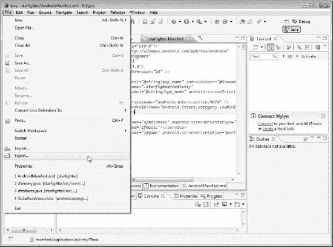

## 第九章

## 发布您的游戏

到目前为止，你可能已经有了一个相当有趣的 2d 游戏。像大多数休闲游戏开发者一样，你可能想与世界其他地方分享你的创作。让你的游戏进入大众手中和设备上的方法是将它发布到 Android Marketplace。本章将概述在 Android Marketplace 上发布游戏的流程。

在您可以发布您的杰作之前，您必须做一些事情来准备您的代码被编译以供发布。这一章将带你完成准备游戏发布的步骤。您必须准备好您的`AndroidManifest`文件，并签署和调整您的代码。

**注意:**网上有很多资源，包括 Android 开发者论坛，可以获得关于实际上传到市场的指导。这一章不包括上传过程，只包括可能被忽略的准备步骤。

这是您最后一次使用目前为止创建的二维代码的机会。在本书的剩余部分，你将学习创建 3d 游戏的技巧。然而，无论你想发布什么样的游戏或应用程序，这里概述的步骤都适用。

### 准备您的货单

准备要发布的代码的第一步是确保您的`AndroidManifest`文件是有序的。您的`AndroidManifest`必须具备三条关键信息才能发布。这些关键信息是

*   `versionCode`
*   `versionName`
*   `android:icon`

在 XML 视图中打开您的`AndroidManfest`文件。您必须在货单中包含的信息以粗体显示如下:

`<?xml version="1.0" encoding="utf-8"?>
<manifest xmlns:android="http://schemas.android.com/apk/res/android"
package="com.proandroidgames"
**android:versionCode="1"**
**android:versionName="1.0">**
<uses-sdk android:minSdkVersion="10" />

<application android:label="@string/app_name" **android:icon="@drawable/sficon">**
<activity android:name=".StarfighterActivity"
android:label="@string/app_name" android:screenOrientation="portrait">
<intent-filter>
<action android:name="android.intent.action.MAIN" />
<category android:name="android.intent.category.LAUNCHER" />
</intent-filter>
</activity>
<activity android:name="sfmainmenu" android:screenOrientation="portrait"></activity>
<service android:name="sfmusic"></service>
<activity android:name="sfgame" android:screenOrientation="portrait"></activity>

</application>
</manifest>`

如果您的`AndroidManifest`文件没有此信息，您必须在继续之前添加它。市场主要使用`versionCode`和`versionName`来跟踪你上传的游戏版本。如果你要发布游戏的升级版本，这是很有帮助的。

上述代码中的另一个关键元素是图标的规范。你的游戏必须有一个图标显示在 Android 用户界面上。图标不需要精心制作；它甚至可以是普通的 Android 图标，但你确实需要一个。

然而，这些信息应该已经在您的清单中了，特别是如果您使用 Eclipse 来创建您的项目。下一步是签名、发布编译和调整您的代码。

### 准备签署、校准和发布

所有发布到 Android Marketplace 的应用程序都必须经过代码签名。这允许市场识别你，除非你的游戏被签名，否则它不会被接受。如果您没有来自证书颁发机构(CA)的证书，您可以自行签名。Android Marketplace 将接受自签名应用。

签署代码后，您需要对齐它。对齐代码只是确保它设置在 4 位边界。4 位边界最适合在移动设备上下载。

幸运的是，如果您使用 Eclipse 作为您的 Android IDE，一个简单的向导将立刻处理这两项任务。打开你的项目，进入`File`  `Export`，如图[图 9–1](#fig_9_1)所示。这将打开导出向导。

**图 9–1。** *打开导出向导*

在向导打开的情况下，从 Android 目的地选择导出 Android 应用程序选项，如[Figure 9–2](#fig_9_2)所示。

**图 9–2。**T3 选择导出安卓应用的目的地

**提示:**或者，您可以通过在 Eclipse 中右键单击项目并选择 Export 来直接进入这一步。

做出选择后，单击“下一步”按钮。Eclipse 现在将测试您的项目的`AndroidManifest`文件，以确保它满足前面讨论的需求——被签署和发布。在[图 9–3](#fig_9_3)所示的项目检查屏幕中，点击浏览按钮。

**图 9–3。** *项目检查窗口*

现在，您可以让向导检查您的项目清单中的错误，这些错误会阻止对项目进行签名。

#### 检查机器人清单的准备情况

当您单击 Browse 按钮时，将会打开一个较小的窗口，其中列出了所有已加载的项目。从该列表中选择您的项目，如[Figure 9–4](#fig_9_4)所示。

**图 9–4。** *选择星际战斗机项目*

“导出向导”现在将检查您的代码，以确保它已准备好进行签名。假设您已经满足了要求，包括有一个图标、一个版本代码和一个版本名称，那么您应该会看到消息“没有发现错误”，如[Figure 9–5](#fig_9_5)所示。

**图 9–5。**T3 检查成功

检查完成后，单击“下一步”按钮开始签名过程。

#### 创建密钥库

向导的下一个屏幕是密钥库选择，如[Figure 9–6](#fig_9_6)所示。如果您已经创建了一个现有的证书密钥库(可能是从您之前上传的应用程序或您购买的证书中创建的)，请选择“使用现有的密钥库选项”来导入它。

但是，如果是自签名，则应该选择“创建新的密钥库”选项。选择此选项将引导您完成创建新密钥库的过程。

**图 9–6。**T3【密钥库选择】窗口

选择密钥库文件的有效位置，并输入密码。

**注意:**您应该为您的密钥库选择一个既安全又有备份的位置。每次更新游戏或应用程序时，都必须使用相同的密钥库。因此，如果您丢失了密钥库，您将无法再向此游戏上传更新。

点击 Next 按钮进入密钥创建窗口，如[Figure 9–7](#fig_9_7)所示。在这里，您必须输入在市场上识别您的所有信息。

**图 9–7。**T3【钥匙创造】窗口

输入密钥库所需的信息后，单击“下一步”按钮。Eclipse 现在将为您生成一个 keystore，它将在流程的下一步中用于对您的应用程序进行签名。在向导的下一个也是最后一个屏幕上，即“目的地和密钥/证书检查”窗口(参见[图 9–8](#fig_9_8)，您将选择您的`.apk`文件进行签名。

在真正创建之前选择`.apk`文件可能看起来有点混乱，但还是跟着做吧。点击 Browse 按钮，您应该会看到`starfighter.apk`。

**图 9–8。** *向导的最终屏幕*

单击“完成”按钮编译并签署您的最终游戏。在此过程中，代码将被调整为 4 位边界，使移动设备更容易下载。

你现在已经准备好将你的作品上传到 Android Marketplace 了——这让你的朋友和同事羡慕不已。如果你的游戏开发爱好更多地延伸到下一代而不是复古，这本书的其余章节正是你所需要的。本书的最后四章将建立在你到目前为止所学的技能之上，并增加你在 3d 游戏环境中使用 OpenGL 的能力。

### 总结

在这一章中，你学习了如何准备你的代码上传到 Android Marketplace。您还使用 Eclipse Export 向导创建了一个密钥库，并根据市场需求对您的游戏进行了签名和调整。在下一章中，你将开始使用在前八章中学到的相同技能来创建一个 3d 游戏。