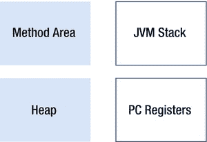
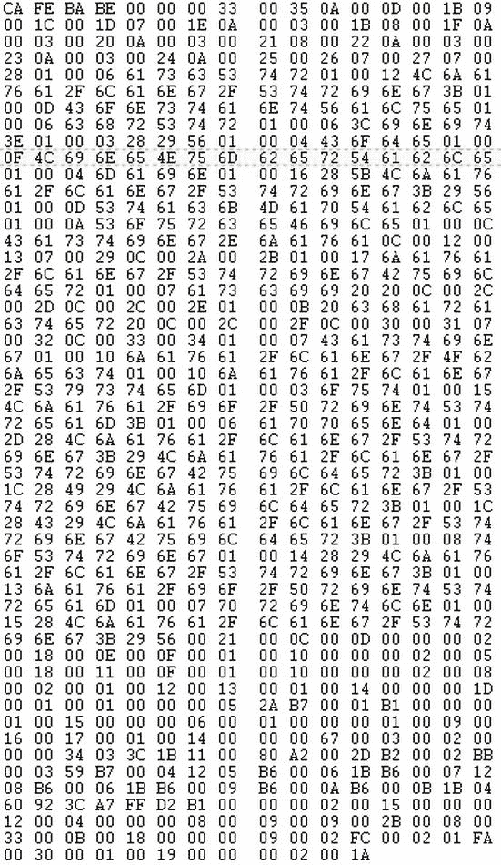
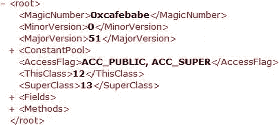
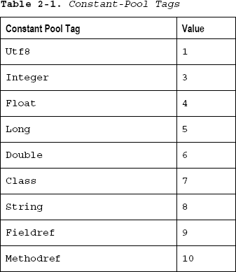
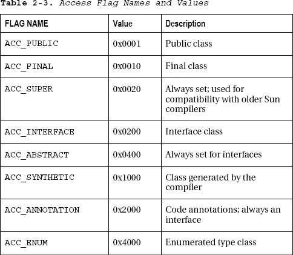
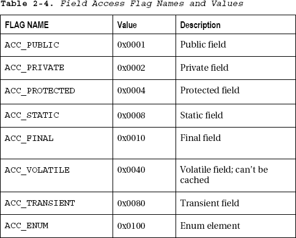
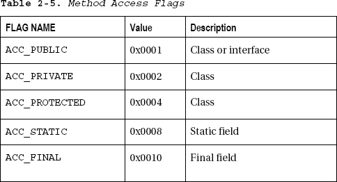
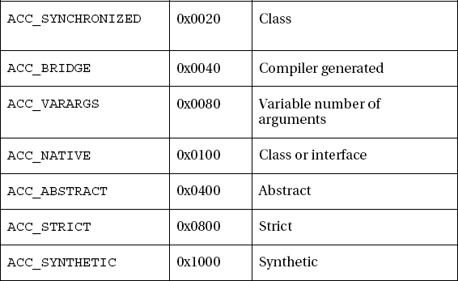
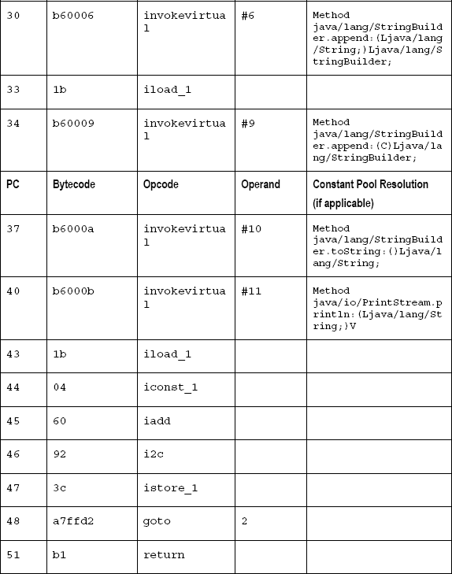

# 一、机器中的幽灵

如果你想知道混淆器或反编译器到底有多好，那么看看 DEX `f`文件和相应的 Java 类文件中发生了什么会有所帮助。否则，你就要依赖第三方供应商的话，或者充其量是一个知识渊博的评论家的话。对于大多数人来说，当您试图保护任务关键型代码时，这还不够好。至少，您应该能够明智地谈论反编译领域，并提出显而易见的问题来理解正在发生的事情。

> “别理窗帘后面的那个人。”

*绿野仙踪*

目前，来自谷歌的各种声音都在说，反编译 Android 代码没什么可担心的。大家不都是在组装层面做了好几年了吗？Java 刚起步的时候也有类似的杂音。

在本章中，您将打开一个 Java 类文件；在下一章中，您将剖析 DEX 文件格式。这将为后面关于混淆理论的章节打下基础，并在反编译器的设计过程中帮助你。为了达到这个阶段，您需要理解字节码、操作码和类文件，以及它们与 Dalvik 虚拟机(DVM)和 Java 虚拟机(JVM)的关系。

市场上有几本关于 JVM 的非常好的书。最好的是比尔·凡纳斯在 Java 2 虚拟机内部的*(麦格劳-希尔，2000)。这本书的一些章节可以在网上`[www.artima.com/insidejvm/ed2/](http://www.artima.com/insidejvm/ed2/)`找到。如果你找不到这本书，那就去看看 Venners 同样优秀的关于 JavaWorld.com 的文章。这一系列的文章是他后来扩展成书的原始素材。Sun 的 *Java 虚拟机规范，*第二版(Addison-Wesley，1999 年)，由 Tim Lindholm 和 Frank Yellin 编写，对于潜在的反编译器作者来说，既全面又非常翔实。但是作为一个规范，它不是你所说的好的读物。这本书也可以在`[http://java.sun.com/docs/books/vmspec](http://java.sun.com/docs/books/vmspec)`在线获得。*

然而，这里的重点与其他 JVM 书籍有很大不同。我从相反的方向看待事物。我的任务是让您从字节码到源代码，而其他人都想知道源代码是如何被翻译成字节码并最终执行的。您感兴趣的是如何将 DEX 文件转换成类文件，以及如何将类文件转换成源代码，而不是如何解释类文件。

本章着眼于如何将一个类文件分解成字节码，以及如何将这些字节码转换成源代码。当然，你需要知道每个字节码是如何工作的；但是你对它们在 JVM 中会发生什么不太感兴趣，因此这一章的重点也有所不同。

### JVM:一个可利用的设计

Java 类文件是为通过网络或互联网快速传输而设计的。因此，它们很紧凑，也相对容易理解。为了便于移植，Java 编译器 javac 只将类文件的一部分编译成字节码。然后由 JVM 解释和执行，通常是在不同的机器或操作系统上。

JVM 的类文件接口由 Java 虚拟机规范严格定义。但是 JVM 最终如何将字节码转换成机器码，这取决于开发人员。这真的与你无关，因为你的兴趣再次停留在 JVM 上。如果您认为类文件类似于其他语言(如 C 或 C++)中的目标文件，等待被 JVM 链接和执行，只是带有更多的符号信息，这可能会有所帮助。

一个类文件携带如此多的信息有很多原因。许多人认为互联网有点像现代的蛮荒西部，在那里，骗子正密谋用病毒感染你的硬盘，或者等着窃取任何可能经过他们的信用卡信息。结果，JVM 被设计成自下而上地保护 web 浏览器免受流氓小程序的攻击。通过一系列的检查，JVM 和类加载器确保没有恶意代码可以上传到网页上。

但是所有的检查都必须以极快的速度执行，以减少下载时间，所以最初的 JVM 设计者选择一个简单的堆栈机器来完成这些重要的安全检查并不奇怪。事实上，JVM 的设计相当安全，尽管一些早期的浏览器实现犯了几个或三个严重的错误。如今，Java 小程序不太可能在任何浏览器中运行，但是 JVM 的设计还是一样的。

对开发人员来说不幸的是，保持代码安全的同时也使代码更容易被反编译。JVM 受限的执行环境和不复杂的体系结构，以及它的许多指令的高级本质，都对程序员不利，而对反编译器有利。

在这一点上，可能也值得一提脆弱的超类问题。在 C++中添加一个新方法意味着所有引用该类的类都需要重新编译。Java 通过将所有必要的符号信息放入类文件来解决这个问题。然后，JVM 负责链接和最终的名称解析，动态加载所有需要的类——包括任何外部引用的字段和方法。这种延迟的链接或动态加载，可能是 Java 更容易被反编译的原因。

顺便说一下，我在这些讨论中忽略了本机方法。*本地方法*当然是包含在应用中的本地 C 或 C++代码。使用它们会破坏 Java 应用的可移植性，但这是防止 Java 程序被反编译的一种可靠方法。

事不宜迟，让我们简单看一下 JVM 的设计。

### 简易堆垛机

JVM 本质上是一个简单的堆栈机器，有一个程序寄存器来管理程序流。Java 类加载器获取类并将其呈现给 JVM。

您可以将 JVM 分成四个独立的、不同的部分:

*   许多
*   程序计数器(PC)寄存器
*   方法区域
*   JVM 堆栈

每个 Java 应用或 applet 都有自己的堆和方法区，每个线程都有自己的寄存器或程序计数器和 JVM 堆栈。然后，每个 JVM 堆栈被进一步细分为堆栈框架，每个方法都有自己的堆栈框架。一段话包含了很多信息。[图 2-1](#fig_2_1) 用一个简单的图表说明。

**图 2-1。***Java 虚拟机*

图 2-1 中的阴影部分是所有线程共享的，白色部分是特定于线程的。

#### 堆

让我们先处理堆，让它不碍事，因为它对 Java 反编译过程的影响很小或没有影响。

与 C 或 C++开发人员不同，Java 程序员不能分配和释放内存；它由 JVM 负责。new 操作符在堆上分配对象和内存，当程序不再引用某个对象时，JVM 垃圾收集器会自动释放这些对象和内存。

这有几个很好的理由；安全性要求 Java 中不使用指针，这样黑客就不能突破应用进入操作系统。没有指针意味着其他东西——在本例中是 JVM——必须负责分配和释放内存。内存泄漏也应该成为过去，至少理论上是这样的。一些用 C 和 C++编写的应用因像筛子一样泄漏内存而臭名昭著，因为程序员没有注意在适当的时候释放不需要的内存——并不是说任何阅读本文的人都会犯这样的罪。垃圾收集也应该使程序员更有效率，花在调试内存问题上的时间更少。

如果您确实想了解更多关于堆中发生的事情，请尝试 Oracle 的堆分析工具(hat)。它使用 Java 2 SDK 版和更高版本生成的 JVM 堆的`hprof`文件转储或快照。它被设计成“调试不必要的对象保留”(内存泄漏给你和我)。你看，垃圾收集算法，比如引用计数和标记清除技术，也不是 100%准确。类文件可能有没有正确终止的线程，`ActionListener`未能注销，或者对一个对象的静态引用在该对象应该被垃圾收集很久之后仍然存在。

这对反编译过程几乎没有影响。我提到它只是因为它是一个有趣的东西——或者是一个帮助调试 Java 代码的重要工具，这取决于您的思维方式或您老板的立场。

这留下了三个需要关注的区域:程序寄存器、堆栈和方法区域。

#### 程序计数器寄存器

为了简单起见，JVM 使用很少的寄存器:控制程序流的程序计数器，以及堆栈中的另外三个寄存器。尽管如此，每个线程都有自己的程序计数器寄存器，用于保存堆栈上正在执行的当前指令的地址。Sun 选择使用有限数量的寄存器来满足支持很少寄存器的体系结构。

#### 方法区

如果您跳到“类文件内部”一节，您会看到类文件被分解成许多组成部分，以及方法的确切位置。每个方法都有自己的代码属性，其中包含特定方法的字节码。

尽管类文件包含关于程序计数器应该为每条指令指向哪里的信息，但类加载器在代码开始执行之前会注意代码在内存区域中的位置。

当程序执行时，程序计数器通过指向下一条指令来跟踪程序的当前位置。方法区域中的字节码遍历其类似汇编程序的指令，在处理变量时使用堆栈作为临时存储区域，而程序遍历该方法的完整字节码。程序在方法区域内的执行不一定是线性的；跳跃和 gotos 很常见。

#### JVM 栈

栈只不过是临时变量的存储区。所有的程序执行和变量操作都是通过将变量推入堆栈框架或从堆栈框架中取出来实现的。每个线程都有自己的 JVM 堆栈框架。

JVM 堆栈由三个不同的部分组成，分别是局部变量(var)、执行环境(frame)和操作数堆栈(optop)。vars、frame 和 optop 寄存器指向堆栈的每个不同区域。该方法在自己的环境中执行，操作数堆栈用作字节码指令的工作空间。optop 寄存器指向操作数堆栈的顶部。

正如我所说的，JVM 是一个非常简单的机器，它在操作数堆栈上弹出和推送临时变量，并在变量中保留任何局部变量，同时继续在堆栈框架中执行方法。堆栈夹在堆和寄存器之间。

因为堆栈非常简单，所以不能存储复杂的对象。这些被外包给垃圾场。

### 在一个类文件内

为了获得一个类文件的整体视图，让我们再看一下来自[第 1 章](01.html)的`Casting.java`文件，如[清单 2-1](#list_2_1) 所示。使用 javac 编译它，然后对二进制类文件进行十六进制转储，如图 2-2 中的[所示。](#fig_2_2)

**清单 2-1。** *`Casting.java`，现在拥有田地！*

`public class Casting {

static final String ascStr = "ascii ";
static final String chrStr = " character ";

public static void main(String args[]){

for(char c=0; c < 128; c++) {
System.out.println(ascStr + (int)c + chrStr + c);
}
}
}`

**图 2-2。***`Casting.class`T5】*

正如您所看到的，Casting.class 很小很紧凑，但是它包含了 JVM 执行`Casting.java`代码所需的所有信息。

为了进一步打开类文件，在本章中，您将通过将类文件分成不同的部分来模拟反汇编程序的操作。当我们分解 Casting.class 时，我们还将构建一个名为 ClassToXML 的原始反汇编器，它将类文件输出为易读的 XML 格式。ClassToXML 使用来自`[www.freeinternals.org](http://www.freeinternals.org)`的 Java 类文件库(jCFL)来完成繁重的工作，可以从该书的 Apress.com 页面下载。

您可以将类文件分成以下组成部分。

*   幻数
*   次要和主要版本号
*   恒定池计数
*   常数存储库
*   访问标志
*   `this`阶级
*   超类
*   接口计数
*   接口
*   字段计数
*   菲尔茨
*   方法计数
*   方法
*   属性计数
*   属性

JVM 规范使用类似于 *struct-* 的格式来显示类文件的不同组件；参见[清单 2-2](#list_2_2) 。

**清单 2-2。** *类文件结构*

`Classfile {
int magic,
short minor_version,
short major_version,
short constant_pool_count,
cp_info constant_pool[constant_pool_count-1],
short access_flags,
short this_class,
short super_class,` `short interfaces_count,
short interfaces [interfaces_count],
short fields_count,
field_info fields [fields_count],
short methods_count,
method_info methods [methods_count],
short attributes_count
attributes_info attributes[attributes_count]
}`

这似乎一直是显示类文件的一种非常麻烦的方式，所以您可以使用一种 XML 格式，这种格式允许您更快地遍历类文件的内部结构。当您试图解开它的含义时，它也使类文件信息更容易理解。图 2-3 显示了完整的类文件结构，所有 XML 节点都已折叠。

**图 2-3。***`Casting.class`*的 XML 表示

接下来，您将看到每个不同的节点及其形式和功能。在[第 6 章](06.html)中，您将学习为所有 Java 类文件创建 ClassToXML 本章中的代码仅适用于`Casting.class`。要运行本章的代码，首先从`[www.freeinternals.org](http://www.freeinternals.org)`下载 jCFL jar 文件，并把它放在您的类路径中。然后执行以下命令:

`javac ClassToXML.java
java ClassToXML < Casting.class > Casting.xml`

#### 神奇的数字

很容易找到魔术号和版本号，因为它们出现在类文件的开头——你应该能在图 2-2 中找到它们。十六进制的幻数是类文件的前 4 个字节(0xCAFEBABE)，它告诉 JVM 它正在接收一个类文件。奇怪的是，这些也是下一代平台上多架构二进制(MAB)文件的前四个字节。在 Java 的早期实现中，Sun 和 NeXT 之间一定发生过一些人员的交叉授粉。

选择 0xCAFEBABE 有很多原因。首先，很难从字母 *A* 到 *F* 中找出有意义的八个字母的单词。据詹姆斯·高斯林说,“死亡咖啡馆”是他们办公室附近一家咖啡馆的名字，感恩而死乐队过去常在那里演出。所以 0xCAFEDEAD 和此后不久的 0xCAFEBABE 成为了 Java 文件格式的一部分。我的第一反应是，很遗憾 0xGETALIFE 不是一个合法的十六进制字符串，但我也想不出更好的十六进制名称。还有更糟糕的幻数，比如 0xFEEDFACE、0xDEADBEEF，可能还有最糟糕的 0xDEADBABE，它们分别被摩托罗拉、IBM 和 Sun 使用。

Microsoft 的 CLR 文件有一个类似的头，BSJB，它是以。Net 平台:布莱恩·哈利，苏珊·拉德克-斯普尔，杰森·詹德和比尔·艾文思。好吧，也许 0xCAFEBABE 也没那么糟糕。

#### 次要和主要版本

次要和主要版本号是接下来的四个字节 0x0000 和 0x0033，参见[清单 2-2](#list_2_2) ，或者次要版本 0 和主要版本 51，这意味着代码是由 JDK 1.7.0 编译的。JVM 使用这些主要编号和次要编号来确保它能够识别并完全理解类文件的格式。JVM 将拒绝执行任何具有更高的主版本号和次版本号的类文件。

次要版本用于需要更新 JVM 的小变更，主要版本用于需要完全不同和不兼容的 JVM 的大规模基本变更。

#### 恒定池计数

所有的类和接口常量都存储在常量池中。令人惊讶的是，常量池计数占用了接下来的 2 个字节，告诉您常量池中有多少个可变长度元素。

0x0035 或整数 53 是示例中的数字。JVM 规范告诉你`constant_pool[0]`是 JVM 保留的。事实上，它甚至没有出现在类文件中，所以常量池元素存储在`constant_pool[1]`到`constant_pool[52]`中。

#### 恒池

下一项是常量池本身，它的类型是`cp_info`；参见[清单 2-3](#list_2_3) 。

**清单 2-3。** `cp_info` *结构*

`cp_info {
byte tag,
byte info[]
}`

常量池由可变长度元素的数组组成。在后面的类文件中，它充满了对常量池中其他条目的符号引用。常量池计数告诉你常量池中有多少个变量。

类文件所需的每个常量和变量名都可以在常量池中找到。这些通常是字符串、整数、浮点数、方法名等等，所有这些都是固定的。然后，在类文件中的任何地方，每个常量都被其常量池索引引用。

常量池中的每个元素(记住示例中有 53 个)都以一个标签开始，告诉您下一个常量是什么类型。[表 2-1](#tab_2_1) 列出了类文件中使用的有效标签及其相应的值。

常量池中的许多标签是对常量池其他成员的符号引用。例如，每个`String`指向一个`Utf8`标签，字符串最终存储在那里。`Utf8`的数据结构如[清单 2-4](#list_2_4) 所示。

**清单 2-4。** *`Utf8`结构*

`Utf8 {
byte tag,
int length,
byte bytes[length]
}`

我在常量池的 XML 输出中尽可能地折叠了这些数据结构(见[清单 2-5](#list_2_5) )，这样你就可以很容易地阅读了。

**清单 2-5** *。`Casting.class`恒池为*

`<ConstantPool>
<ConstantPoolEntry>
<id>1</id>
<Type>Methodref</Type>
<ConstantPoolAddress>13,27</ConstantPoolAddress>
</ConstantPoolEntry>
<ConstantPoolEntry>
<id>2</id>
<Type>Fieldref</Type>
<ConstantPoolAddress>28,29</ConstantPoolAddress>
</ConstantPoolEntry>
<ConstantPoolEntry>
<id>3</id>
<Type>Class</Type>
<ConstantPoolAddress>30</ConstantPoolAddress>
</ConstantPoolEntry>
<ConstantPoolEntry>
<id>4</id>
<Type>Methodref</Type>
<ConstantPoolAddress>3,27</ConstantPoolAddress>
</ConstantPoolEntry>
<ConstantPoolEntry>
<id>5</id>
<Type>String</Type>
<ConstantPoolAddress>31</ConstantPoolAddress>` `</ConstantPoolEntry>
<ConstantPoolEntry>
<id>6</id>
<Type>Methodref</Type>
<ConstantPoolAddress>3,32</ConstantPoolAddress>
</ConstantPoolEntry>
<ConstantPoolEntry>
<id>7</id>
<Type>Methodref</Type>
<ConstantPoolAddress>3,33</ConstantPoolAddress>
</ConstantPoolEntry>
<ConstantPoolEntry>
<id>8</id>
<Type>String</Type>
<ConstantPoolAddress>34</ConstantPoolAddress>
</ConstantPoolEntry>
<ConstantPoolEntry>
<id>9</id>
<Type>Methodref</Type>
<ConstantPoolAddress>3,35</ConstantPoolAddress>
</ConstantPoolEntry>
<ConstantPoolEntry>
<id>10</id>
<Type>Methodref</Type>
<ConstantPoolAddress>3,36</ConstantPoolAddress>
</ConstantPoolEntry>
<ConstantPoolEntry>
<id>11</id>
<Type>Methodref</Type>
<ConstantPoolAddress>37,38</ConstantPoolAddress>
</ConstantPoolEntry>
<ConstantPoolEntry>
<id>12</id>
<Type>Class</Type>
<ConstantPoolAddress>39</ConstantPoolAddress>
</ConstantPoolEntry>
<ConstantPoolEntry>
<id>13</id>
<Type>Class</Type>
<ConstantPoolAddress>40</ConstantPoolAddress>
</ConstantPoolEntry>
<ConstantPoolEntry>
<id>14</id>
<Type>Utf8</Type>
<ConstantPoolValue>ascStr</ConstantPoolValue>
</ConstantPoolEntry>
<ConstantPoolEntry>
<id>15</id>
<Type>Utf8</Type>` `<ConstantPoolValue>Ljava/lang/String</ConstantPoolValue>
</ConstantPoolEntry>
<ConstantPoolEntry>
<id>16</id>
<Type>Utf8</Type>
<ConstantPoolValue>ConstantValue</ConstantPoolValue>
</ConstantPoolEntry>
<ConstantPoolEntry>
<id>17</id>
<Type>Utf8</Type>
<ConstantPoolValue>chrStr</ConstantPoolValue>
</ConstantPoolEntry>
<ConstantPoolEntry>
<id>18</id>
<Type>Utf8</Type>
<ConstantPoolValue><init></ConstantPoolValue>
</ConstantPoolEntry>
<ConstantPoolEntry>
<id>19</id>
<Type>Utf8</Type>
<ConstantPoolValue>V</ConstantPoolValue>
</ConstantPoolEntry>
<ConstantPoolEntry>
<id>20</id>
<Type>Utf8</Type>
<ConstantPoolValue>Code</ConstantPoolValue>
</ConstantPoolEntry>
<ConstantPoolEntry>
<id>21</id>
<Type>Utf8</Type>
<ConstantPoolValue>LineNumberTable</ConstantPoolValue>
</ConstantPoolEntry>
<ConstantPoolEntry>
<id>22</id>
<Type>Utf8</Type>
<ConstantPoolValue>main</ConstantPoolValue>
</ConstantPoolEntry>
<ConstantPoolEntry>
<id>23</id>
<Type>Utf8</Type>
<ConstantPoolValue>Ljava/lang/String</ConstantPoolValue>
</ConstantPoolEntry>
<ConstantPoolEntry>
<id>24</id>
<Type>Utf8</Type>
<ConstantPoolValue>StackMapTable</ConstantPoolValue>
</ConstantPoolEntry>
<ConstantPoolEntry>
<id>25</id>` `<Type>Utf8</Type>
<ConstantPoolValue>SourceFile</ConstantPoolValue>
</ConstantPoolEntry>
<ConstantPoolEntry>
<id>26</id>
<Type>Utf8</Type>
<ConstantPoolValue>Casting</ConstantPoolValue>
</ConstantPoolEntry>
<ConstantPoolEntry>
<id>27</id>
<Type>NameAndType</Type>
<ConstantPoolAddress>18,19</ConstantPoolAddress>
</ConstantPoolEntry>
<ConstantPoolEntry>
<id>28</id>
<Type>Class</Type>
<ConstantPoolAddress>41</ConstantPoolAddress>
</ConstantPoolEntry>
<ConstantPoolEntry>
<id>29</id>
<Type>NameAndType</Type>
<ConstantPoolAddress>42,43</ConstantPoolAddress>
</ConstantPoolEntry>
<ConstantPoolEntry>
<id>30</id>
<Type>Utf8</Type>
<ConstantPoolValue>java/lang/StringBuilder</ConstantPoolValue>
</ConstantPoolEntry>
<ConstantPoolEntry>
<id>31</id>
<Type>Utf8</Type>
<ConstantPoolValue>ascii</ConstantPoolValue>
</ConstantPoolEntry>
<ConstantPoolEntry>
<id>32</id>
<Type>NameAndType</Type>
<ConstantPoolAddress>44,45</ConstantPoolAddress>
</ConstantPoolEntry>
<ConstantPoolEntry>
<id>33</id>
<Type>NameAndType</Type>
<ConstantPoolAddress>44,46</ConstantPoolAddress>
</ConstantPoolEntry>
<ConstantPoolEntry>
<id>34</id>
<Type>Utf8</Type>
<ConstantPoolValue>character</ConstantPoolValue>
</ConstantPoolEntry>
<ConstantPoolEntry>` `<id>35</id>
<Type>NameAndType</Type>
<ConstantPoolAddress>44,47</ConstantPoolAddress>
</ConstantPoolEntry>
<ConstantPoolEntry>
<id>36</id>
<Type>NameAndType</Type>
<ConstantPoolAddress>48,49</ConstantPoolAddress>
</ConstantPoolEntry>
<ConstantPoolEntry>
<id>37</id>
<Type>Class</Type>
<ConstantPoolAddress>50</ConstantPoolAddress>
</ConstantPoolEntry>
<ConstantPoolEntry>
<id>38</id>
<Type>NameAndType</Type>
<ConstantPoolAddress>51,52</ConstantPoolAddress>
</ConstantPoolEntry>
<ConstantPoolEntry>
<id>39</id>
<Type>Utf8</Type>
<ConstantPoolValue>Casting</ConstantPoolValue>
</ConstantPoolEntry>
<ConstantPoolEntry>
<id>40</id>
<Type>Utf8</Type>
<ConstantPoolValue>java/lang/Object</ConstantPoolValue>
</ConstantPoolEntry>
<ConstantPoolEntry>
<id>41</id>
<Type>Utf8</Type>
<ConstantPoolValue>java/lang/System</ConstantPoolValue>
</ConstantPoolEntry>
<ConstantPoolEntry>
<id>42</id>
<Type>Utf8</Type>
<ConstantPoolValue>out</ConstantPoolValue>
</ConstantPoolEntry>
<ConstantPoolEntry>
<id>43</id>
<Type>Utf8</Type>
<ConstantPoolValue>Ljava/io/PrintStream</ConstantPoolValue>
</ConstantPoolEntry>
<ConstantPoolEntry>
<id>44</id>
<Type>Utf8</Type>
<ConstantPoolValue>append</ConstantPoolValue>
</ConstantPoolEntry>` `<ConstantPoolEntry>
<id>45</id>
<Type>Utf8</Type>
<ConstantPoolValue>Ljava/lang/StringBuilder</ConstantPoolValue>
</ConstantPoolEntry>
<ConstantPoolEntry>
<id>46</id>
<Type>Utf8</Type>
<ConstantPoolValue>Ljava/lang/StringBuilder</ConstantPoolValue>
</ConstantPoolEntry>
<ConstantPoolEntry>
<id>47</id>
<Type>Utf8</Type>
<ConstantPoolValue>Ljava/lang/StringBuilder</ConstantPoolValue>
</ConstantPoolEntry>
<ConstantPoolEntry>
<id>48</id>
<Type>Utf8</Type>
<ConstantPoolValue>toString</ConstantPoolValue>
</ConstantPoolEntry>
<ConstantPoolEntry>
<id>49</id>
<Type>Utf8</Type>
<ConstantPoolValue>Ljava/lang/String</ConstantPoolValue>
</ConstantPoolEntry>
<ConstantPoolEntry>
<id>50</id>
<Type>Utf8</Type>
<ConstantPoolValue>java/io/PrintStream</ConstantPoolValue>
</ConstantPoolEntry>
<ConstantPoolEntry>
<id>51</id>
<Type>Utf8</Type>
<ConstantPoolValue>println</ConstantPoolValue>
</ConstantPoolEntry>
<ConstantPoolEntry>
<id>52</id>
<Type>Utf8</Type>
<ConstantPoolValue>Ljava/lang/String</ConstantPoolValue>
</ConstantPoolEntry>
</ConstantPool>`

当您花时间检查类文件的输出时，这是一个简单而优雅的设计。取第一种方法引用，`constant_pool[1]`:

`<ConstantPoolEntry>
<id>1</id>
<Type>Methodref</Type>
<ConstantPoolAddress>13,27</ConstantPoolAddress>` `</ConstantPoolEntry>`

这告诉您在`constant_pool[13]`中查找类，以及在`constant_pool[27]`中查找类名和类型

`<ConstantPoolEntry>
<id>13</id>
<Type>Class</Type>
<ConstantPoolAddress>40</ConstantPoolAddress>
</ConstantPoolEntry>`

指向`constant_pool[40]`:

`<ConstantPoolEntry>
<id>40</id>
<Type>Utf8</Type>
<ConstantPoolValue>java/lang/Object</ConstantPoolValue>
</ConstantPoolEntry>`

但是您也有`constant_pool[27]`要解析，它给出了方法的名称和类型:

`<ConstantPoolEntry>
<id>27</id>
<Type>NameAndType</Type>
<ConstantPoolAddress>18,19</ConstantPoolAddress>
</ConstantPoolEntry>`

常量池的元素 18 和 19 包含方法名及其描述符。根据 JVM 规范，方法描述符采用以下形式:

`(ParameterDescriptor *) ReturnDescriptor`

返回描述符可以是 void 的`V`或者是`FieldType`中的一个(见[表 2-2](#tab_2_2) ):

`<ConstantPoolEntry>
<id>18</id>
<Type>Utf8</Type>
<ConstantPoolValue><init></ConstantPoolValue>
</ConstantPoolEntry>
<ConstantPoolEntry>
<id>19</id>
<Type>Utf8</Type>
<ConstantPoolValue>V</ConstantPoolValue>
</ConstantPoolEntry>`

在这种情况下，方法的名称是`<init>`，它是每个类文件中的一个内部 JVM 方法；其方法描述符为`()V`，或`void`，用于字段描述符映射(见[表 2-2](#tab_2_2) )。

因此，您现在可以重新创建该方法，如下所示:

`void init()`

T2】

你也可以试着解开一些其他的类。如果从目标类或方法向后工作，可能会有所帮助。有些字符串很难理解，但是稍加练习，方法签名就变得清晰了。

最早的混淆器只是将这些字符串重新命名为完全无法理解的东西。这阻止了原始的反编译器，但没有损害类文件，因为 JVM 使用了指向常量池中的字符串的指针，而不是字符串本身，只要您没有重命名内部方法(如`<init>`)或破坏对外部库中任何 Java 类的引用。

从下面的条目中，您已经知道您的 import 语句需要什么类:`constant_pool[36, 37, 39, 46]`。注意在`Casting.java`例子中没有接口或者静态最终类(参见[清单 2-1](#list_2_1) )。这些将作为常量池中的字段引用出现，但是到目前为止，这个简单的类解析器已经足够完整，可以处理您想处理的任何类文件。

#### 访问标志

访问标志包含位掩码，它告诉你是在处理一个类还是一个接口，以及它是公共的、最终的等等。所有接口都是抽象的。

共有八种访问标志类型(见[表 2-3](#tab_2_3) ，但将来可能会引入更多类型。`ACC_SYNTHETIC`、`ACC_ANNOTATION`和`ACC_ENUM`是 JDK 1.5 中相对较新的新增内容。

在`this`类或接口之前，访问标志被`or`结合在一起以给出修饰符的描述。`0x21`告诉你`Casting.class`中的`this`类是一个公共(和超)类，你可以通过回溯到[清单 2-1](#list_2_1) 中的代码来验证它的正确性:

`<AccessFlags>0x21</AccessFlags>`

#### 本类和超类

接下来的两个值指向`this`类和超类的常量池索引。

`<ThisClass>12</ThisClass>
<SuperClass>13</SuperClass>`

如果您遵循[清单 2-5](#list_2_5) 中的 XML 输出，`constant_pool[12]`指向`constant_pool[39]`；这里的`Utf8`结构包含字符串`Casting`，告诉你`this`是`Casting`类。超类在`constant_pool[13]`，指向`constant_pool[40]`；这里的`Utf8`结构包含`java/lang/Object`，因为每个类都有`object`作为它的超类。

#### 接口和接口数

[清单 2-1](#list_2_1) 中的`Casting.java`例子没有任何接口，所以你必须看一个不同的例子来更好地理解接口是如何在类文件中实现的(参见[清单 2-6](#list_2_6) )。

**清单 2-6。** *界面示例*

`interface IProgrammer {
public void code();
public void earnmore();
}

interface IWriter {
public void pullhairout();
public void earnless();
}

public class Person implements IProgrammer, IWriter {

public Person() {
Geek g = new Geek(this);
Author t = new Author(this);
}

public void code() { /* ..... */ }
public void earnmore() { /* ..... */ }
public void pullhairout() { /* ..... */ }
public void earnless() { /* ..... */ }` `}

class Geek {
IProgrammer iprog = null;

public Geek(IProgrammer iprog) {
this.iprog = iprog;
iprog.code();
iprog.earnmore();
}
}

class Author {
IWriter iwriter = null;

public Author(IWriter iwriter) {
this.iwriter = iwriter;
iwriter.pullhairout();
iwriter.earnless();
}
}`

[清单 2-6](#list_2_6) 有两个接口，`IProgrammer`和`IWriter`。对类文件运行 ClassToXML 会在 interfaces 部分提供以下信息:

`<InterfaceCount>2</InterfaceCount>
<Interfaces>
<Interface>8</Interface>
<Interface>9</Interface>
</Interfaces>`

这解析为常量池中的`IProgrammer`和`IWriter`字符串，如下所示:

`<ConstantPoolEntry>
<id>8</id>` `<Type>Class</Type>
<ConstantPoolAddress>27</ConstantPoolAddress>
</ConstantPoolEntry>
<ConstantPoolEntry>
<id>9</id>
<Type>Class</Type>
<ConstantPoolAddress>28</ConstantPoolAddress>
</ConstantPoolEntry>

<ConstantPoolEntry>
<id>27</id>
<Type>Class</Type>
<ConstantPoolAddress>27</ConstantPoolAddress>
</ConstantPoolEntry>
<ConstantPoolEntry>
<id>28</id>
<Type>Class</Type>
<ConstantPoolAddress>28</ConstantPoolAddress>
</ConstantPoolEntry>`

#### 字段和字段计数

`field_info`的结构如[清单 2-7](#list_2_7) 所示。

**清单 2-7** *。`field_info`数据结构*

`field_info {
u2 access_flags;
u2 name_index;
u2 descriptor_index;
u2 attributes_count;
attribute_info attributes[attributes_count];
}`

`Casting.class`有两个静态和最终字段，`ascStr`和`chrStr`(见[清单 2-1](#list_2_1) )。我还使它们成为静态的和最终的，以强制一个`ConstantValue`字段属性。

现在，如果您取出 XML 中的相关部分，您会看到有两个字段([清单 2-8](#list_2_8) )。让我们关注第一个。

**清单 2-8。** *`Casting.java`字段信息*

`<FieldCount>2</FieldCount>
<Fields>
<Field>
<AccessFlags>ACC_STATIC, ACC_FINAL</AccessFlags>
<Name>ascStr</Name>` `<Descriptor>java.lang.String</Descriptor>
<Attributes>
<Attribute>
<AttributeType>String</AttributeType>
<AttributeName>ascii</AttributeName>
</Attribute>
</Attributes>
</Field>
<Field>
<AccessFlags>ACC_STATIC, ACC_FINAL</AccessFlags>
<Name>chrStr</Name>
<Descriptor>java.lang.String</Descriptor>
<Attributes>
<Attribute>
<AttributeType>String</AttributeType>
<AttributeName>character</AttributeName>
</Attribute>
</Attributes>
</Field>
</Fields>`

字段访问标志(参见[表 2-4](#tab_2_4) )告诉您该字段是`public`、`private`、`protected`、`static`、`final`、`volatile`还是`transient`。

对于任何编写过 Java 的人来说，前五个和最后一个关键字应该是显而易见的。`volatile`关键字告诉一个线程该变量可能被另一个线程更新，`transient`关键字用于对象序列化。本例中的访问标志`0x0018`表示静态最终字段。

回到[表 2-2](#tab_2_2) ，在你解开不同的字段描述符之前，让你的头脑清醒一下:

`<Field>
<AccessFlags>ACC_STATIC, ACC_FINAL</AccessFlags>
<Name>ascStr</Name>` `<Descriptor>java.lang.String</Descriptor>
<Attributes>
<Attribute>
<AttributeType>String</AttributeType>
<AttributeName>ascii</AttributeName>
</Attribute>
</Attributes>
</Field>`

描述符指回`constant_pool[14]`字段`ascStr`，它有字段描述符`constant_pool[15]`或`Ljava/lang/String`；这是一个`String`类的实例。

##### 字段属性

毫无疑问，属性计数就是属性的数量，后面紧跟着属性本身。整个类文件的属性的格式如清单 2-9 所示。

**清单 2-9。** *`attribute-info`结构*

`attribute_info {
u2 attribute_name_index;
u4 attribute_length;
u1 info[attribute_length];
}`

在字段数据结构、方法数据结构和属性数据结构(类文件数据结构的最后一个元素)中可以找到几种不同的属性类型。但是这里真正感兴趣的只有两个字段属性，`ConstantValue`和`Synthetic`。`ConstantValue`用于常量变量，例如在当前示例中声明为 static 和 final 的变量。在 JDK 1.1 中引入了`Synthetic`变量来支持内部类。

`Signature`和`Deprecated`属性也是可能的，用户也可以定义他们自己的属性类型，但是它们与当前的讨论无关。

**清单 2-11。** *字段属性数据*

`<Attributes>
<Attribute>
<AttributeType>String</AttributeType>
<AttributeName>ascii</AttributeName>
</Attribute>
</Attributes>`

第一个字段的属性(见[清单 2-11](#list_2_11) )，是一个可以在`constant_pool[5]`(见[清单 2-12](#list_2_12) )中找到的常量，一个字符串，它依次指向字符串“ascii”。

**清单 2-12。**恒池中的*字段*

`<ConstantPoolEntry>
<id>5</id>
<Type>String</Type>
<ConstantPoolAddress>31</ConstantPoolAddress>
</ConstantPoolEntry>
<ConstantPoolEntry>
<id>31</id>
<Type>Utf8</Type>
<ConstantPoolValue>ascii</ConstantPoolValue>
</ConstantPoolEntry>`

现在，您已经将第一个字段反编译成了它的原始格式:

`static final String ascStr = "ascii ";`

#### 方法和方法计数

现在是类文件最重要的部分:方法。所有的源代码都被转换成字节码并存储或包含在`method_info`区域中。(实际上，它在方法的代码属性中，但是您已经非常接近了。)如果有人可以得到字节码，那么他们可以尝试将它转换回源代码。`Methods`元素前面是方法计数和数据结构(见[清单 2-13](#list_2_13) ),与前一节中的`field_info`结构没有什么不同。三种类型的属性通常出现在`method_info`级别:`Code`、`Exceptions`，对于内部类再次出现`Synthetic`。

**清单 2-13。** *`method_info`结构*

`method_info {
u2 access_flags;
u2 name_index;
u2 descriptor_index;
u2 attributes_count;
attribute_info attributes[attributes_count];
}`

[清单 2-1](#list_2_1) 的`Casting.class`中的方法如[清单 2-14](#list_2_14) 所示。

**清单 2-14。** *`Casting.class`方法信息*

`<MethodCount>2</MethodCount>
<Methods>
<Method>
<Attributes>` `<Attribute>
<AttributeName>Code:</AttributeName>
<Max_Stack>1</Max_Stack>
<Max_Locals>1</Max_Locals>
<Method_Args>1</Method_Args>
<Method_Code>
0: aload_0
1: invokespecial #1
4: return
</Method_Code>
<Method_LineNumberTable>line 1: 0</Method_LineNumberTable>
</Attribute>
</Attributes>
<AccessFlags>public</AccessFlags>
<Name>Casting</Name>
<Descriptor>();</Descriptor>
</Method>
<Method>
<Attributes>
<Attribute>
<AttributeName>Code:</AttributeName>
<Max_Stack>3</Max_Stack>
<Max_Locals>2</Max_Locals>
<Method_Args>1</Method_Args>
<Method_Code>
0: iconst_0
1: istore_1
2: iload_1
3: sipush 128
6: if_icmpge 51
9: getstatic #2
12: new #3
15: dup
16: invokespecial #4
19: ldc #5
21: invokevirtual #6
24: iload_1
25: invokevirtual #7
28: ldc #8
30: invokevirtual #6
33: iload_1
34: invokevirtual #9
37: invokevirtual #10
40: invokevirtual #11
43: iload_1
44: iconst_1
45: iadd
46: i2c
47: istore_1` `48: goto 2
51: return
</Method_Code>
<Method_LineNumberTable>
line 8: 0
line 9: 9
line 8: 43
line 11: 51
</Method_LineNumberTable>
<Method_StackMapTableEntries>2</Method_StackMapTableEntries>
<Method_StackMapTable>
frame_type = 252 /* append */
offset_delta = 2
locals = [ int ]
frame_type = 250 /* chop */
offset_delta = 48</Method_StackMapTable>
</Attribute>
</Attributes>
<AccessFlags>public, static</AccessFlags>
<Name>main</Name>
<Descriptor>(java.lang.String[]);</Descriptor>
</Method>
</Methods>`

根据原始源代码中使用的修饰符，为每个方法设置不同的访问标志；参见[表 2-5](#tab_2_5) 。存在许多限制，因为一些访问标志是互斥的——换句话说，一个方法不能同时声明为`ACC_PUBLIC`和`ACC_PRIVATE`，甚至不能声明为`ACC_PROTECTED`。然而，您通常不会反汇编非法的字节码，所以您不太可能遇到任何这样的可能性。

示例中的第一个方法是 public 第二种是公共静态方法。

现在您可以找到最终方法的名称和方法描述符:

`<Name>main</Name>
<Descriptor>(java.lang.String[]);</Descriptor>`

您从`constant_pool[22]`和`constant_pool[23]`中提取方法的名称和描述，如[清单 2-15](#list_2_15) 所示。

**清单 2-15。** *`Casting.class`方法名和描述符常量池信息*

`<ConstantPoolEntry>
<id>22</id>
<Type>Utf8</Type>
<ConstantPoolValue>main</ConstantPoolValue>
</ConstantPoolEntry>
<ConstantPoolEntry>
<id>23</id>
<Type>Utf8</Type>
<ConstantPoolValue>Ljava/lang/String</ConstantPoolValue>
</ConstantPoolEntry>`

现在，您可以在没有任何基础代码的情况下重新组装该方法

`public static void main(java.lang.String args[]) {
/* */
}`

或者干脆

`import java.lang.String;
...
public static void main(String args[]) {
/* */
}`

其余的方法以类似的方式退出常量池。

##### 方法属性

属性出现在类文件结构的`field`、`method`和`attributes`元素中。每个属性都以引用常量池和属性长度的`attribute_name_index`开头。但是*类文件的*肉在方法属性中(见[清单 2-16](#list_2_16) )。

**清单 2-16** *。初始化方法属性*

`<Attributes>
<Attribute>
<AttributeName>Code:</AttributeName>
<Max_Stack>1</Max_Stack>
<Max_Locals>1</Max_Locals>
<Method_Args>1</Method_Args>
<Method_Code>
0: aload_0
1: invokespecial #1
4: return
</Method_Code>
<Method_LineNumberTable>line 1: 0</Method_LineNumberTable>
</Attribute>
</Attributes>`

本例中的属性类型是代码属性。代码属性如[清单 2-17](#list_2_17) 所示。

**清单 2-17。** *代码属性*

`Code_attribute {
u2 attribute_name_index;
u4 attribute_length;
u2 max_stack;
u2 max_locals;
u4 code_length;
u1 code[code_length];
{
u2 exception_table_length;
{` `u2 start_pc;
u2 end_pc;
u2 handler_pc;
u2 catch_type;
} exception_table[exception_table_length];
u2 attributes_count;
attribute_info attributes[attributes_count];
}`

`attribute_length`是代码属性的长度减去前 6 个字节。`attribute_type`和`attribute_name`占用前 6 个字节，不包含在`attribute_length`中。`max_stack`和`max_locals`给出操作数堆栈和堆栈帧局部变量部分的最大变量数。这将告诉你栈有多深，以及有多少变量将被推入栈中和栈外。

代码长度给出了以下代码数组的大小。代码数组只是一系列字节，其中每个字节码是一个保留的字节值或操作码，后跟零个或多个操作数，或者换句话说:

`opcode operand`

查看在`Casting.class`上运行 ClassToXML 的输出([清单 2-14](#list_2_14) ，您会看到有两个方法，`main`和`init`，这是一个空的构造函数，当开发人员选择不添加他们自己的构造函数时，Java 编译器总是会添加它。每个方法都有自己的代码数组。

###### <init>方法</init>

在我解释什么字节码映射到哪个操作码之前，让我们看一下最简单的方法，这是第一个代码段:

`2ab70001b1`

当您将它转换成操作码和操作数时，它就变成了

`2a aload 0
b70001 invokespecial #1
b1 return`

`2a`变成了`aload 0`。这将本地变量 0 加载到堆栈中，这是`invokespecial`所要求的。`b70001`变成了`invokespecial #1`，其中`invokespecial`用于在有限的情况下调用一个方法，比如实例初始化方法(对你我来说是`<init>`)，这就是你在这里看到的。`#1`是对`constant_pool[1]`的引用，是一个`CONSTANT_Methodref`结构。[清单 2-18](#list_2_18) 收集了`constant_pool[1]`的所有相关常量池条目。

**清单 2-18。** *`<init>`法恒池解析*

`<ConstantPoolEntry>
<id>1</id>
<Type>Methodref</Type>
<ConstantPoolAddress>13,27</ConstantPoolAddress>
</ConstantPoolEntry>

<ConstantPoolEntry>
<id>13</id>
<Type>Class</Type>
<ConstantPoolAddress>40</ConstantPoolAddress>
</ConstantPoolEntry>

<ConstantPoolEntry>
<id>40</id>
<Type>Utf8</Type>
<ConstantPoolValue>java/lang/Object</ConstantPoolValue>
</ConstantPoolEntry>

<ConstantPoolEntry>
<id>27</id>
<Type>NameAndType</Type>
<ConstantPoolAddress>18,19</ConstantPoolAddress>
</ConstantPoolEntry>

<ConstantPoolEntry>
<id>18</id>
<Type>Utf8</Type>
<ConstantPoolValue>init</ConstantPoolValue>
</ConstantPoolEntry>

<ConstantPoolEntry>
<id>19</id>
<Type>Utf8</Type>
<ConstantPoolValue>V</ConstantPoolValue>
</ConstantPoolEntry>`

您可以手动将符号引用解析为

`<Method java.lang.Object.<init>()V>`

这是 javac 编译器添加到所有还没有构造函数的类中的空构造函数。最后一个`b1`操作码是一个简单的`return`语句。所以第一个方法可以直接转换回下面的代码，一个空的构造函数:

`public class Casting()
{
return;
}`

###### 主要方法

第二个代码属性不太重要。为了更进一步，您需要知道每个十六进制值映射到哪个操作码。

**注意:**尽管这个例子列表比大多数其他操作码列表都短(你忽略了任何大于 201 的操作码)，它仍然运行了几页；你可以在[附录 A](08.html) 和`[www.apress.com](http://www.apress.com)`中查阅。注意，超过 201 的操作码是为将来使用而保留的，因为它们对类文件中的原始字节码没有影响，可以安全地忽略。

您还需要知道 Java 语言的每个元素是如何被编译成字节码的，这样您就可以颠倒这个过程。然后，您可以看到如何将剩余的代码属性转化为操作码及其操作数。

`main`方法有以下 52 字节的`byte_code`属性，它在[清单 2-19](#list_2_19) 中被分解成操作码和操作数

`033c1b110080a2002db20002bb000359b700041205b600061bb600071208b60006
1bb60009b6000ab6000b1b0460923ca7ffd2b1`

**清单 2-19。** *主要方法*

`<Method>
<Attributes>
<Attribute>
<AttributeName>Code:</AttributeName>
<Max_Stack>3</Max_Stack>
<Max_Locals>2</Max_Locals>
<Method_Args>1</Method_Args>
<Method_Code>
0: iconst_0
1: istore_1
2: iload_1
3: sipush 128
6: if_icmpge 51
9: getstatic #2
12: new #3
15: dup` `16: invokespecial #4
19: ldc #5
21: invokevirtual #6
24: iload_1
25: invokevirtual #7
28: ldc #8
30: invokevirtual #6
33: iload_1
34: invokevirtual #9
37: invokevirtual #10
40: invokevirtual #11
43: iload_1
44: iconst_1
45: iadd
46: i2c
47: istore_1
48: goto 2
51: return
</Method_Code>
<Method_LineNumberTable>
line 8: 0
line 9: 9
line 8: 43
line 11: 51
</Method_LineNumberTable>
<Method_StackMapTableEntries>2</Method_StackMapTableEntries>
<Method_StackMapTable>
frame_type = 252 /* append */
offset_delta = 2
locals = [ int ]
frame_type = 250 /* chop */
offset_delta = 48</Method_StackMapTable>
</Attribute>
</Attributes>
<AccessFlags>static</AccessFlags>
<Name>main</Name>
<Descriptor>(java.lang.String[]);</Descriptor>
</Method>
</Methods>`

你可以用与前一种方法类似的方式对操作码和操作数进行逆向工程，如你在[表 2-6](#tab_2_6) 中所见。

T2】

`iconst_0`和`istore_1`将数字 0 推送到堆栈上，`sipush`将数字 128 推送到堆栈上，`if_icmpge`比较两个数字和`goto`程序计数器或`PC = 51`(即如果数字相等则返回)。下面是来自`Casting.class`代码的代码片段:

`for(char c=0; c < 128; c++) {
}`

以同样的方式，您可以完成分析以返回完整的 main 方法。本书的目的是向您展示如何通过编程来实现这一点。

可以从 Apress 站点的下载区获得 ClassToXML，它像一个真正的反汇编器一样输出字节码。现在您已经看到了创建一个反汇编器是多么容易，您可能会明白为什么这么多反汇编器都有用户界面。

#### 属性和属性计数

最后两个元素包含类文件属性的数量和剩余的属性，通常是`SourceFile`和`InnerClasses`。

`SourceFile`是最初用来生成代码的 Java 文件的名称。`InnerClasses`属性有点复杂，被几个不能处理内部类的反编译器忽略了。

您并不局限于`SourceFile`和`InnerClasses`属性。可以在这里或者在任何字段或方法属性部分中定义新属性。开发人员可能希望将信息存储在自定义属性中，可能使用它进行一些低级检查，或者存储加密的代码属性以防止反编译。假设您的新代码属性遵循所有其他属性的格式，您可以添加任何想要的属性，这将被 JVM 忽略。每个属性需要 2 个字节，提供一个指向常量池的数字，给出属性的名称，`attribute_name_index`；4 个字节给出属性中剩余字节的长度，`attribute_length`。

### 总结

您最终到达了类文件的末尾，并在此过程中手动反汇编了 ClassToXML(参考`[www.apress.com](http://www.apress.com)`上的相应文件)。我希望你开始明白这一切是如何结合在一起的。尽管类文件的设计简洁紧凑，但是由于初始和最终编译阶段的分离，您需要大量的信息来帮助您恢复源代码。多年来，程序员一直受到编译成可执行文件通常提供的编码的保护，但是在中间阶段拆分编译并携带如此多的信息是自找麻烦。

第 3 章着眼于解开 DEX 文件格式，帮助你理解如何将它逆向工程回 Java 源代码。