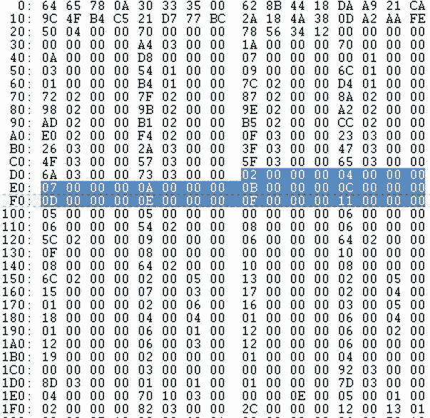

# 三、在 DEX 文件中

我们需要另一个虚拟机用于 Android 手机，而 Java 虚拟机(JVM)不够好，这看起来可能有点奇怪。但为了优化和性能，所有 Android 手机上都使用了 Dalvik 虚拟机(DVM)。它是以一个原始开发者在冰岛家乡的一个地方命名的，在设计上与 JVM 有很大的不同。DVM 使用寄存器，而不是压入-弹出堆栈机器。相应的 DVM 字节码或 DEX 文件也是与 Java 类文件完全不同的设计。

但是并没有失去一切。关于 DEX 文件规范有足够多的信息来重复你在[第 2 章](02.html)中查看的关于类文件的相同练习，并得出相同的令人愉快的结论，让你获得对 DEX 文件字节码的访问，并将其转换回 Java 源代码，即使你在本章中是手动进行的。DEX 文件可以分解成不同的部分:`header`和常量池的 DEX 版本，常量池的`data`部分包含字符串、字段、方法和类信息的指针。

### 机器中的幽灵，第二部

当你从 Android Market 或亚马逊 Marketplace 下载一个应用到你的 Android 手机上时，你正在下载一个 Android 包(APK)文件。每一个 APK 文件都是 zip 格式的。将`.apk`文件扩展名改为`.zip`，解压文件后会得到 APK 中包含的资源、图像、、`AndroidManifest.xml`文件和`classes.dex`文件，结构类似于图 3-1 中的[所示。](#fig_3_1)

**图 3-1。** *解压后的 APK 文件*

一个 Java jar 文件有许多类文件，而每个 APK 文件只有一个`classes.dex`文件，如图 3-2 中的[所示。根据谷歌的说法，出于性能和安全原因，APK 格式不同于类文件格式。但是不管原因是什么，从逆向工程的角度来看，这意味着您的目标现在是`classes.dex`文件。您已经完全脱离了 Java 类文件格式，现在需要理解`classes.dex`文件的内容，这样您就可以将它反编译回 Java 源代码。](#fig_3_2)

**图 3-2。** *Class 文件 vs DEX 文件*

[第 4 章](04.html)介绍了许多 Android 和第三方工具，可以帮助你分离 apk 和`classes.dex`文件。在本章中，您将手动创建自己的`classes.dex`反汇编器。

#### 转换铸件

首先，你需要将你的`Casting.class`文件从[第三章](03.html)转换成`classes.dex`文件，这样你就有东西可以用了。这个`classes.dex`文件将在 Android 手机的命令行上运行，但它不是一个经典的 APK 文件。然而，`classes.dex`格式是一样的，所以这是开始 DEX 文件研究的好地方。

您可以使用 Android 平台工具附带的 dx 程序进行这种转换。确保`Casting.class`文件在`casting`文件夹中，并执行以下命令:

`javac c:\apress\chap3\casting\Casting.java` `dx --dex --output=c:\temp\classes.dex C:\apress\chap3\casting`

[图 3-3](#fig_3_3) 以十六进制格式显示了[清单 3-1](#list_3_1) 中`Casting.java`代码的结果`classes.dex`文件。

**清单 3-1。**T3`Casting.java`T4】

`public class Casting {

static final String ascStr = "ascii ";
static final String chrStr = " character ";

public static void main(String args[]){
for(char c=0; c < 128; c++) {
System.out.println("ascii " + (int)c + " character "+
c);
}
}
}`

**图 3-3。***`classes.dex`T5】*

为了进一步打开 DEX 文件，在本章中，您将通过将 DEX 文件分解成几个部分来模拟反汇编程序的操作。您可以通过构建自己的名为 DexToXML 的原语反汇编器来实现这一点，该反汇编器获取 DEX 文件并将代码输出为易读的 XML 格式。

### 将 DEX 文件分解成组成部分

您可以将类文件分成以下组成部分:

*   `header`
*   `string_ids`
*   `type_ids`
*   `proto_ids`
*   `field_ids`
*   `method_ids`
*   `class_defs`
*   `data`
*   `link_data`

`header`部分包含了文件信息的摘要、文件大小以及指向其他信息的指针或偏移量。`String_ids`列出了文件中的所有字符串，Java 类型可以在`type_ids`部分找到。稍后您将看到原型的`proto_ids`、`field_ids`、`method_ids`和`class_defs`部分如何让您将类名、方法调用和字段反向工程回 Java。`data`部分是安卓版的常量池。`link_data`部分是针对静态链接文件的，与本讨论无关，所以本章不提供相关部分。

DEX 文件格式规范(`[http://source.android.com/tech/dalvik/dex-format.html](http://source.android.com/tech/dalvik/dex-format.html)`)使用类似结构的格式来显示 DEX 文件的组成部分；参见[清单 3-2](#list_3_2) 。

**清单 3-2。** *DEX 文件结构*

`Dexfile {
header header_item,
string_ids string_id_item[],
type_ids type_id_item[],
proto_ids proto_id_item[],
field_ids field_id_item[],
method_ids method_id_item[],
class_defs class_def_item[],
data ubyte[],` `link_data ubyte[]
}`

和上一章一样，您使用 XML 格式，因为它允许您更快地在 DEX 文件的内部结构中来回遍历。它还使 DEX 文件信息更容易理解，因为你解开了它的含义。DEX 文件结构——所有 XML 节点都已折叠——如清单 3-3 所示。

**清单 3-3。** *DexToXML*

`<root>
<header />
<string_ids />
<type_ids />
<proto_ids />
<field_ids />
<method_ids />
<class_defs />
<data />
</root>`

以下部分解释了每个节点中的内容。

#### 标题部分

`header`部分包含文件剩余部分的顶层信息。DEX 文件的结构与其原始格式的 Java 类文件有很大不同，类似于微软。Net PE 文件比你在上一章看到的更多。`header`报头包含幻数、校验和、签名和类文件的大小。剩下的信息告诉您字符串、类型、原型、方法和类有多大，并提供一个地址指针或偏移量，您可以在 classes.dex 文件中找到实际的字符串、类型、原型、方法和类。在`data`部分还有一个指向地图信息的指针，它重复了`header`部分的许多信息。

清单 3-4 使用了一种类似结构的格式来展示`header`是如何布局的。

**清单 3-4。** *`Header`截面结构*

`DexfileHeader{
ubyte[8] magic,
int checksum,
ubyte[20] signature,
uint file_size,
uint header_size,` `uint endian_tag,
uint link_size,
uint link_off,
uint map_off,
uint string_ids_size,
uint string_ids_off,
uint type_ids_size,
uint type_ids_off,
uint proto_ids_size,
uint proto_ids_off,
uint field_ids_size,
uint field_ids_off,
uint method_ids_size,
uint method_ids_off,
uint class_defs_size,
uint class_defs_off,
uint data_size,
uint data_off
}`

`header`字段详见[表 3-1](#tab_3_1) 。

DEX 文件中的`header`部分在[图 3-4](#fig_3_4) 中突出显示，你可以使用[表 3-1](#tab_3_1) 来跟踪每个字段出现的位置。但是读取十六进制需要某种自虐，这就是为什么 DexToXML 以更容易阅读的 XML 格式输出相同的数据。清单 3-5 中的[显示了 DexToXML 标题字段。](#list_3_5)

**图 3-4。***`classes.dex`*中的表头字段

**清单 3-5。**T3`header`段的 DexToXML 输出

`<root>
<header>
<magic>dex\n035\0</magic>
<checksum>628B4418</checksum>
<signature>DAA921CA9C4FB4C521D777BC2A184A380DA2AAFE</signature>
<file_size>0x00000450</file_size>
<header_size>112</header_size>
<endian_tag>0x12345678</endian_tag>
<link_size>0</link_size>
<link_offset>0x00000000</link_offset>
<map_offset>0x000003A4</map_offset>
<string_ids_size>26</string_ids_size>
<string_ids_offset>0x00000070</string_ids_offset>
<type_ids_size>10</type_ids_size>
<type_ids_offset>0x000000D8</type_ids_offset>
<proto_ids_size>7</proto_ids_size>
<proto_ids_offset>0x00000100</proto_ids_offset>
<field_ids_size>3</field_ids_size>
<field_ids_offset>0x00000154</field_ids_offset>
<method_ids_size>9</method_ids_size>
<method_ids_offset>0x0000016C</method_ids_offset>
<class_defs_size>1</class_defs_size>
<class_defs_offset>0x000001B4</class_defs_offset>
<data_size>0x0000027C</data_size>
<data_offset>0x000001D4</data_offset>
</header>
<string_ids />
<type_ids />
<proto_ids />
<field_ids />
<method_ids />
<class_defs />
<data />
<link_data />
</root>`

其中几个字段需要进一步解释:`magic`、`checksum`、`header_size`和`Endian_tag`。`header`部分的其余字段是尺寸和到其他部分的偏移量。

##### 魔法

DEX 文件的幻数是前 8 个字节，并且总是十六进制的`64 65 78 0A 30 33 35 00`或字符串`dex\n035\0`。规范提到换行符和`\0`是为了防止某些类型的腐败。`035`预计会像类文件中的主版本和次版本一样随时间而变化。

##### 校验和

校验和是文件的 Adler32 校验和，不包括幻数。在[图 3-4](#fig_3_4) 中的`classes.dex`文件中，第二块中第一行的十六进制为`62 8B 44 18`。但是数据是以小端存储的，所以真正的校验和是相反的，是值`0x18448B62`。

##### Header_size

`Header`所有`classes.dex`文件的大小相同:`0x70`。

##### Endian _ 标签

所有`classes.dex`文件中的`endian_tag`是`0x12345678`，它告诉你数据是以小端存储的(反向)。未来的 DEX 文件不一定总是如此。但是现在，你可以假设它是小尾序的。

#### 字符串 _ 标识部分

从`header`部分可以知道，这个`classes.dex`文件中有`<string_ids_size>26</string_ids_size>`个字符串，可以在下面的地址找到:`<string_ids_offset>0x00000070</string_ids_offset>`。顺便说一下，这是在`header`部分的末尾。但是你已经从标题大小知道了:`<header_size>0x00000070</header_size>`。

在`classes.dex`文件中的这 26 个条目中的每一个都是一个 8 字节的地址偏移量或`string_data_off`，它指向`data`部分中的实际字符串。在[图 3-5](#fig_3_5) 中，可以看到第一个`string_ids`条目是`72 02 00 00`。记住存储是 little-endian 的，这告诉你第一个字符串可以在地址`0x00000272`找到，在文件的`data`部分的更下面。最后一个字符串条目是`73 03 00 00`，它告诉您最后一个字符串位于`0x00000373`的偏移量或地址处。

图 3-5**。** *`string_ids`段`classes.dex`*

[清单 3-6](#list_3_6) 显示了 XML 格式的`strings_ids`部分，你继续构建文件的 XML 表示。

**清单 3-6。**T3】DexToXML`string_ids`节

`<root>
<header />
<string_ids>
<string>
<id>0</id>
<address>0x00000272</address>
</string>
<string>
<id>1</id>
<address>0x0000027F</address>
</string>` `<string>
<id>2</id>
<address>0x00000287</address>
</string>
<string>
<id>3</id>
<address>0x0000028A</address>
</string>
<string>
<id>4</id>
<address>0x00000298</address>
</string>
<string>
<id>5</id>
<address>0x0000029B</address>
</string>
<string>
<id>6</id>
<address>0x0000029E</address>
</string>
<string>
<id>7</id>
<address>0x000002A2</address>
</string>
<string>
<id>7</id>
<address>0x000002A2</address>
</string>
<string>
<id>8</id>
<address>0x000002AD</address>
</string>
<string>
<id>9</id>
<address>0x000002B1</address>
</string>
<string>
<id>10</id>
<address>0x000002B5</address>
</string>
<string>
<id>11</id>
<address>0x000002CC</address>
</string>
<string>
<id>12</id>
<address>0x000002E0</address>
</string>
<string>` `<id>13</id>
<address>0x000002F4</address>
</string>
<string>
<id>13</id>
<address>0x000002F4</address>
</string>
<string>
<id>14</id>
<address>0x0000030F</address>
</string>
<string>
<id>15</id>
<address>0x00000323</address>
</string>
<string>
<id>16</id>
<address>0x00000326</address>
</string>
<string>
<id>17</id>
<address>0x0000032A</address>
</string>
<string>
<id>18</id>
<address>0x0000033F</address>
</string>
<string>
<id>19</id>
<address>0x00000347</address>
</string>
<string>
<id>20</id>
<address>0x0000034F</address>
</string>
<string>
<id>21</id>
<address>0x00000357</address>
</string>
<string>
<id>22</id>
<address>0x0000035F</address>
</string>
<string>
<id>23</id>
<address>0x00000365</address>
</string>
<string>
<id>24</id>` `<address>0x0000036A</address>
</string>
<string>
<id>25</id>
<address>0x00000373</address>
</string>
</string_ids>
......
</root>`

与类文件不同，字符串不会混杂在常量池中。`string_ids`部分完全由指向存储在`data`部分中的字符串的指针组成。这些字符串可以在从`0x00000272`开始的`data`部分找到，也可以在[列表 3-7](#list_3_7) 中找到。

**清单 3-7。**中的*弦`data`节中的*

`string[0]: character
string[1]: <init>
string[2]: C
string[3]: Casting.java
string[4]: I
string[5]: L
string[6]: LC
string[7]: LCasting;
string[8]: LI
string[9]: LL
string[10]: Ljava/io/PrintStream;
string[11]: Ljava/lang/Object;
string[12]: Ljava/lang/String;
string[13]: Ljava/lang/StringBuilder;
string[14]: Ljava/lang/System;
string[15]: V
string[16]: VL
string[17]: [Ljava/lang/String;
string[18]: append
string[19]: ascStr
string[20]: ascii
string[21]: chrStr
string[22]: main
string[23]: out
string[24]: println
string[25]: toString`

#### type _ ids 部分

`header`部分告诉您有 10 个`type_ids`从偏移`0x000000D8`开始([清单 3-8](#list_3_8) )。第一个`type_id`，如[图 3-6](#fig_3_6) 所示，是`02 00 00 00`。那指向`string_id[2]`，那指向`data`段的`C`(见`strings_ids`)。其余的`type_id`以类似的方式脱落。

**图 3-6。** *`type_ids`段`classes.dex`*

**清单 3-8。**T3】DexToXML`type_ids`节

`<root>
<header />
<string_ids />
<type_ids>
<type>
<id>0</id>` `<string_id>2</string_id>
</type>
<type>
<id>1</id>
<string_id>4</string_id>
</type>
<type>
<id>3</id>
<string_id>10</string_id>
</type>
<type>
<id>4</id>
<string_id>11</string_id>
</type>
<type>
<id>5</id>
<string_id>12</string_id>
</type>
<type>
<id>6</id>
<string_id>13</string_id>
</type>
<type>
<id>7</id>
<string_id>14</string_id>
</type>
<type>
<id>8</id>
<string_id>15</string_id>
</type>
<type>
<id>9</id>
<string_id>17</string_id>
</type>
</type_ids>
...
</root>`

正如您在上一节中看到的，字符串是在`data`节中的`string_ids`节中给定的偏移量或地址处找到的。我已经抽出了`type_id`的字符串，这样你可以更容易地遵循逆向工程过程；参见[清单 3-9](#list_3_9) 。

**清单 3-9。**中的*类型`data`部分*

`type[0]: C
type[1]: I
type[2]: LCasting;
type[3]: Ljava/io/PrintStream;` `type[4]: Ljava/lang/Object;
type[5]: Ljava/lang/String;
type[6]: Ljava/lang/StringBuilder;
type[7]: Ljava/lang/System;
type[8]: V
type[9]: [Ljava/lang/String;`

#### proto _ ids 部分

`Proto_id` s 包含了`Casting.java`中的原型方法。DVM 使用`Proto_id`和相关的`type_id`组装`method_id`。[图 3-7](#fig_3_7) 再次显示了它们在`classes.dex`文件中的位置。

每个`proto_id`有三个部分，如清单 3-10 中的[结构所示。这些是指向`method`参数的简短描述或 ShortyDescriptor(参见](#list_3_10)[表 2-2](02.html#tab_2_2) )的`string_id`的指针，一个指向返回类型的`type_id`的指针，以及一个进入`data`部分的地址偏移量以找到参数列表。

图 3-7**。** *`proto_ids`段`classes.dex`*

**清单 3-10。** *`proto_id`结构*

`ProtoID{
uint shorty_idx,
uint return_type_idx,
uint parameters_off
}`

在这个例子中，根据`header`文件有七个`proto_id`。这些在[清单 3-11](#list_3_11) 的 DexToXML 中显示；原型本身显示在[清单 3-12](#list_3_12) 中。

**清单 3-11。**T3】DexToXML`proto_ids`节

`<root>
<header />
<string_ids />
<type_ids />
<proto_ids>
<proto>
<id>0</id>
<string_id>5</string_id>
<type_id>5</type_id>
<address>0x0</address>
</proto>
<proto>
<id>1</id>
<string_id>6</string_id>
<type_id>6</type_id>
<address>0x254</address>
</proto>
<proto>
<id>2</id>
<string_id>8</string_id>
<type_id>6</type_id>
<address>0x25c</address>
</proto>
<proto>
<id>3</id>
<string_id>9</string_id>
<type_id>6</type_id>
<address>0x264</address>
</proto>
<proto>
<id>4</id>
<string_id>15</string_id>
<type_id>8</type_id>` `<data_off>0x0</data_off>
</proto>
<proto>
<id>5</id>
<string_id>10</string_id>
<type_id>8</type_id>
<address>0x264</address>
</proto>
<proto>
<id>6</id>
<string_id>10</string_id>
<type_id>8</type_id>
<address>0x26c</address>
</proto>
</proto_ids>
....
</root>`

[清单 3-12](#list_3_12) 显示了来自`data`部分的原型。

**清单 3-12。**中的*原型`data`章节*

`proto[0]: Ljava/lang/String; proto( )
proto[1]: Ljava/lang/StringBuilder; proto( C )
proto[2]: Ljava/lang/StringBuilder; proto( I )
proto[3]: Ljava/lang/StringBuilder; proto( Ljava/lang/String; )
proto[4]: V proto( )
proto[5]: V proto( Ljava/lang/String; )
Proto[6]: V proto( Ljava/lang/String; )`

#### 字段标识部分

接下来是`field_id` s。每个`field_id`有三个部分:类名、字段类型和字段名称。[清单 3-13](#list_3_13) 以结构格式展示了这一点。

**清单 3-13。** *`field_id`结构*

`FieldID{
ushort class_idx,
ushort type_idx,
uint name_idx
}`

[图 3-8](#fig_3_8) 显示了`classes.dex`文件中`field_ids`段的位置。

图 3-8**。** *`field_ids`段`classes.dex`*

在这个例子中，根据`header`文件有三个`fields_id`。这些显示在[清单 3-14](#list_3_14) 的 DexToXML 中，字段本身显示在[清单 3-15](#list_3_15) 中。

**清单 3-14。**T3】DexToXML`field_ids`节

`<root>
<header />
<string_ids />
<type_ids />
<proto_ids />
<fields>
<field>
<id>0</id>
<type_id>2</type_id>` `<type_id>5/type_id>
<string_id>19</string_id>
</field>
<field>
<id>1</id>
<type_id>2</type_id>
<type_id>5</type_id>
<string_id>21</string_id>
</field>
<field>
<id>2/id>
<type_id>7</type_id>
<type_id>3</type_id>
<string_id>23</string_id>
</field>
</fields>
...
</root>`

在这一部分中，您可以根据前面的`string_ids`和`type_ids`部分中的信息组合字段。对于`field [0]`，可以看到类的名称是`type_id[2]`或`Casting`，字段的类型是`type_id[5]`或`string`，字段的名称是`string_id[19]`或`ascStr`:

`type_id[2] = LCasting;
type_id[5] = Ljava/lang/String;
string_id[19] = ascStr`

[清单 3-15](#list_3_15) 显示了这一点以及类似解析的剩余字段。

**清单 3-15。** *字段信息*

`field_ids[0]: Casting.ascStr:Ljava/lang/String;
field_ids[1]: Casting.chrStr:Ljava/lang/String;
field_ids[2]: java.lang.System.out:Ljava/io/PrintStream;`

#### method _ ids 部分

每个`method_id`都有三个部分:类名、来自`proto_ids`部分的方法原型和方法名。[清单 3-16](#list_3_16) 以结构格式展示了这一点。

**清单 3-16。** *`method_id`结构*

`MethodIDStruct{
ushort class_idx,
ushort proto_idx,` `uint name_idx
}`

[图 3-9](#fig_3_9) 显示了`classes.dex`文件中`method_ids`段的位置。

**图 3-9。** *`method_ids`段`classes.dex`*

在这个例子中，根据`header`文件有九个`method_id`。这些显示在[清单 3-17](#list_3_17) 的 DexToXML 中，方法本身显示在[清单 3-18](#list_3_18) 中。

**清单 3-17。**T3】DexToXML`method_ids`节

`<root>
<header />
<string_ids />
<type_ids />
<proto_ids />
<fields />
<methods>
<method>
<id>0</id>
<type_id>2</type_id>
<proto_id>4</proto_id>
<string_id>1</string_id>
</method>
<method>
<id>1</id>
<type_id>2</type_id>
<proto_id>6</proto_id>
<string_id>22</string_id>
</method>
<method>
<id>2</id>
<type_id>3</type_id>
<proto_id>5</proto_id>
<string_id>24</string_id>
</method>
<method>
<id>3</id>
<type_id>4</type_id>
<proto_id>4</proto_id>
<string_id>1</string_id>
</method>
<method>
<id>4</id>
<type_id>6</type_id>
<proto_id>4</proto_id>
<string_id>1</string_id>
</method>
<method>
<id>5</id>
<type_id>6</type_id>
<proto_id>1</proto_id>
<string_id>18</string_id>
</method>
<method>
<id>6</id>
<type_id>6</type_id>
<proto_id>2</proto_id>
<string_id>18</string_id>
</method>` `<method>
<id>7</id>
<type_id>6</type_id>
<proto_id>3</proto_id>
<string_id>18</string_id>
</method>
<method>
<id>8</id>
<type_id>6</type_id>
<proto_id>0</proto_id>
<string_id>25</string_id>
</method>
</methods>
</root>`

您可以根据前面章节中的信息手工组装这些方法，而不必转到`data`章节。对于`method [0]`，类的名字是`type_id[2]`或者 L `Casting`，方法的原型是`proto_id[4]`或者`V proto ()`，方法的名字是`string_id[1[ <init>`:

`type_id[2] = LCasting;
proto_id[4] = V proto( )
string_id[1] = <init>`

[清单 3-18](#list_3_18) 显示了这一点以及类似的解决方法。

**清单 3-18。** *方法*

`method[0]: Casting.<init> (<init>()V)
method[1]: Casting.main (main([Ljava/lang/String;)V)
method[2]: java.io.PrintStream.println
(println(Ljava/lang/String;)V)
method[3]: java.lang.Object.<init> (<init>()V)
method[4]: java.lang.StringBuilder.<init> (<init>()V)
method[5]: java.lang.StringBuilder.append
(append(C)Ljava/lang/StringBuilder;)
method[6]: java.lang.StringBuilder.append
(append(I)Ljava/lang/StringBuilder;)
method[7]: java.lang.StringBuilder.append
(append(Ljava/lang/String;)Ljava/lang/StringBuilder;)
method[8]: java.lang.StringBuilder.toString
(toString()Ljava/lang/String;)`

#### class _ defs 部分

每个`class_def`有八个部分:类的`id`、类的`access_flags`、超类的`type_id`、接口列表的`address`、源文件名的 `string_id`、任何注释(与逆向工程源代码无关)的另一个`address`、类数据的`address`(在这里可以找到更多的类信息)以及最后的`address`,在这里可以找到任何静态字段的初始值。[清单 3-19](#list_3_19) 以结构格式显示了这一点。

**清单 3-19。** *`class_defs`结构*

`ClassDefsStruct {
uint class_idx,
uint access_flags,
uint superclass_idx,
uint interfaces_off,
uint source_file_idx,
uint annotations_off,
uint class_data_off,
uint static_values_off,
}`

[图 3-10](#fig_3_10) 显示了`classes.dex`文件中`class_defs`段的位置。

**图 3-10。** *`class_defs`段`classes.dex`*

在这个例子中，只有一个类，如清单 3-20 中的 DexToXML 所示。

**清单 3-20。** *DexToXML `class_defs`段*

`<root>
<header />
<string_ids />
<type_ids />
<proto_ids />
<fields />
<methods />
<classes>
<class>
<id>0</id>
<type_id>2</type_id>
<access_flags>
<access_flag>public</access_flag>
</access_flags>
<type_id>4</type_id>
<address>0x0</address>
<string_id>3</string_id>
<address>0x0</address>
<address>0x00000392</address>
<address>0x0000038D</address>
</class>
</classes>
...
</root>`

在`classes.dex`中，类别`Casting`的`access_flags`值为`0x00000001`。[表 3-2](#tab_3_2) 列出了访问标志的转换；在这种情况下，访问标志是`public`。

通过手工组装 Java 代码，你可以看到这个类被定义为来自`type_id[2]`的公共类`Casting`，超类是来自`type_id[4]`的`java/Lang/Object`，源文件是来自`string_id[3]`的`Casting.java`:

`access_flags = public` `type_id[2] = LCasting;
type_id[4] = Ljava/lang/Object;
string_id[3] = Casting.java`

#### 数据部分

你现在在`data`段，是`classes.dex`的真肉。早先的信息导致了这一点。当您解析文件的剩余部分时，您有一个选择:您可以顺序地解析它，或者开始跟随数据偏移量中的地址来查找您想要反编译的字节码。

最明显的做法是遵循数据偏移，所以让我们试试这种方法。首先是来自`class_defs`的`class_data_item`，假设您正在寻找字节码。`class_data_item`部分包含关于字段和方法的信息；接下来是`code_item`部分，它包含字节码。

##### 类别 _ 数据 _ 项目

从反汇编`class_defs`中，你知道这个文件中唯一的类`Casting.java`的地址是`0x392`。信息是在一个`class_data_item`结构中，类似于[清单 3-21](#list_3_21) 。

**清单 3-21。** *`class_data_item`结构*

`ClassDataItemStruct {
uleb128 static_fields_size,
uleb128 instance_fields_size,
uleb128 direct_method_size,
uleb128 virtual_method_size,
encoded_field[static_fields_size] static_fields,
encoded_field[instance_fields_size] instance_fields,
encoded_method[direct_fields_size] direct_methods,
encoded_method[virtual_fields_size] virtual_methods
}`

Uleb128 是一种用于存储大整数的无符号小端基 128 编码格式。要将整数转换为 uleb128，您需要将其转换为二进制，将其填充为 7 位的倍数，将其分成 7 个位组，在除最后一个位组之外的所有位上添加高 1 位以形成字节(即 8 位)，转换为十六进制，然后将结果翻转为 little-endian。如果你看一个例子，这就更有意义了。下面这个例子来自维基百科(`[http://en.wikipedia.org/wiki/LEB128](http://en.wikipedia.org/wiki/LEB128)`):

`10011000011101100101 In raw binary` `010011000011101100101 Padded to a multiple of 7 bits
0100110 0001110 1100101 Split into 7-bit groups
00100110 10001110 11100101 Add high 1 bits on all but last
group to form bytes
0x26 0x8E 0xE5 In hexadecimal
0xE5 0x8E 0x26 Output stream`

多亏了例子中的小整数，转换就容易多了:uleb128 中的`0x2`是`2`。

`encoded_field`和`encoded_method`还有另外两种结构，采用[清单 3-22](#list_3_22) 和[清单 3-23](#list_3_23) 所示的格式。`Field_idx_diff`的不同之处在于，尽管第一个条目是直接的`field_id[]`引用，但是任何后续的`field_id[]`条目都被列为与之前列出的`field_id`的差异。`Method_idx_diff`遵循同样的模式。

**清单 3-22。** *`encoded_field`结构*

`EncodedFieldStruct{
uleb128 field_idx_diff, (explain that it's diff and
directly for the first)
uleb128 access_flags
}`

**清单 3-23。** *`encoded_method`结构*

`EncodedMethodStruct{
uleb128 method_idx_diff, (explain that it's diff and
directly for the first)
uleb128 access_flags,
uleb128 code_off
}`

[图 3-11](#fig_3_11) 显示了你在`classes.dex`文件中的位置:在`data`部分的正中间。

图 3-11**。** *`class_data_item`段`classes.dex`*

[清单 3-24](#list_3_24) 显示了`class_defs`部分的 DexToXML 输出。

**清单 3-24。**T3】DexToXML`class_defs`T4】

`<root>
<header />
<string_ids />
<type_ids />
<proto_ids />
<fields />
<methods />
<classes />
<data>
<class_data_items>
<class_data_item>
<static_field_size>2</static_field_size>
<instance_field_size>0</instance_field_size>
<direct_method_size>2</direct_method_size>
<virtual_method_size>0</virtual_method_size>
<static_fields>
<static_field>
<id>0</id>
<field_id>0</field_id>
<access_flags>
<access_flag>static</access_flag>
<access_flag>final</access_flag>
</access_flags>
</static_field>
<static_field>
<id>1</id>
<field_id>1</field_id>
<access_flags>
<access_flag>static</access_flag>
<access_flag>final</access_flag>
</access_flags>
</static_field>
</static_fields>
<instance_methods />
<direct_methods>
<direct_method>
<id>0</id>
<method_id>0</method_id>
<access_flags>
<access_flag>public</access_flag>
<access_flag>constructor</access_flag>
</access_flags>
<address>0x1d4</address>` `</direct_method>
<direct_method>
<id>1</id>
<method_id>1</method_id>
<access_flags>
<access_flag>public</access_flag>
<access_flag>static</access_flag>
</access_flags>
<address>0x1ec</address>
</direct_method>
</direct_methods>
<virtual_methods />
</data>
</root>`

手动组装信息，您可以看到如下所示的静态字段和方法信息:

`static_field[0]
field[0]: Casting.ascStr:Ljava/lang/String;
access_flags = static & final
static_field[1]
field[1]: Casting.chrStr:Ljava/lang/String;
access_flags = static & final
direct_method[0]
method[0]: Casting.<init> (<init>()V)
access_flags = public & constructor
code_offset = 0x00001d4
direct_method[1]
method[1]: Casting.main (main([Ljava/lang/String;)V)
access_flags = public & static
code_offset = 0x00001ec`

现在，您已经拥有了类中方法和字段的所有信息；如果这不明显，您将从外向内重新创建`Casting.java`代码。您还应该特别注意`code_offset`，因为它是字节码所在的位置，将用于重新创建源代码。那是你接下来要去的地方。

##### 代码石

`class_data_item`告诉你`code_item`从`0x1d4`开始第一个`<init>`方法，`0x1ec`开始主方法。信息在一个`code_item`结构中，类似于[清单 3-25](#list_3_25) 。

**清单 3-25。** *`code_item`结构*

`CodeItemStruct {` `ushort registers_size,
ushort ins_size,
ushort outs_size,
ushort tries_size,
uint debug_info_off,
uint insns_size,
ushort[insns_size] insns,
ushort padding,
try_item[tries_size] tries,
encoded_catch_handler_list handlers
}`

这花了一些时间，但是要特别注意`CodeItemStruct`中的`insns`元素:那是`classes.dex`存储字节码指令的地方。

[图 3-12](#fig_3_12) 显示了`classes.dex`文件中`code_item`段(`init`和`main`)的位置。这个突出显示的区域是两个`code_item`的，它们是一个接一个存储的。

图 3-12**。** *`code_item`段`classes.dex`*

[清单 3-26](#list_3_26) 显示了每个`code_item`部分的 DexToXML 输出。

**清单 3-26。**T3】DexToXML`code_item`T4】

`<root>
<header />
<string_ids />
<type_ids />
<proto_ids />
<fields />
<methods />
<classes />
<data>
<class_data_items />
<code_items>` `<code_item>
<id>0</id>
<registers_size>1</registers_size>
<ins_size>1</ins_size>
<outs_size>1</outs_size>
<tries_size>0</tries_size>
<debug_info_off>0x37d</debug_info_off>
<insns_size>4</insns_size>
<insns>
<insn>invoke-direct {v0},java/lang/Object/<init> ;
<init>()V</insn>
<insn>return-void</insn>
</insns>
<padding />
<handlers />
</code_item>
<code_item>
<id>1</id>
<registers_size>5</registers_size>
<ins_size>1</ins_size>
<outs_size>2</outs_size>
<tries_size>0</tries_size>
<debug_info_off>0x382</debug_info_off>
<insns_size>44</insns_size>
<insns>
<insn>const/4 v0,0</insn>
<insn>const/16 v1,128</insn>
<insn>if-ge v0,v1,l252</insn>
<insn>sget-object v1,java/lang/System.out
Ljava/io/PrintStream;</insn>
<insn>new-instance v2,java/lang/StringBuilder</insn>
<insn>invoke-
direct {v2},java/lang/StringBuilder/<init> ;
<init>()V</insn>
<insn>const-string v3,"ascii "</insn>
<insn>invoke-
virtual {v2,v3},java/lang/StringBuilder/append ;
append(Ljava/lang/String;)Ljava/lang/StringBuilder;</insn>
<insn>move-result-object v2</insn>` `<insn>invoke-
virtual {v2,v0},java/lang/StringBuilder/append ;
append(I)Ljava/lang/StringBuilder;</insn>
<insn>move-result-object v2</insn>
<insn>const-string v3," character "</insn>
<insn>invoke-
virtual {v2,v3},java/lang/StringBuilder/append ;
append(Ljava/lang/String;)Ljava/lang/StringBuilder;</insn>
<insn>move-result-object v2</insn>
<insn>invoke-
virtual {v2,v0},java/lang/StringBuilder/append ;
append(C)Ljava/lang/StringBuilder;</insn>
<insn>move-result-object v2</insn>
<insn>invoke-
virtual {v2},java/lang/StringBuilder/toString ;
toString()Ljava/lang/String;</insn>
<insn>move-result-object v2</insn>
<insn>invoke-
virtual {v1,v2},java/io/PrintStream/println ;
println(Ljava/lang/String;)V</insn>
<insn>add-int/lit8 v0,v0,1</insn>
<insn>int-to-char v0,v0</insn>
<insn>goto l1fe</insn>
<insn>return-void</insn>
</insns>
<padding />
<handlers />
</code_item>
</code_items>
</data>
</root>`

**注:** [附录中的表 A-2](08.html#tab_A_2)“DVM 字节码到操作码的映射”列出了 DVM 操作码，您可以使用这些操作码将十六进制代码转换成等效的操作码或字节码，并完成反汇编。进行转换时，请参考这一点。

你知道清单 3-26`<init>`中的第一个方法基于`<insns_size />`有四条指令。从十六进制文件中可以看到，这四个十六进制代码是`7010 0300 0000 0e00`。您可以手动将其转换为以下内容:

`7010 invoke-direct 10 string[16]: VL
0003 method[3]: java.lang.Object.<init> (<init>()V)
0000 no argument
0e00 return-void`

这是 javac 编译器添加到所有还没有构造函数的类中的空构造函数。因此，您的第一个方法可以直接转换回以下代码，这是一个空的构造函数:

`public class Casting()
{
}`

### 总结

这就完成了对`classes.dex`文件的分解。完整的 DexToXML 解析器代码在 Apress 网站上(`[www.apress.com](http://www.apress.com)`)。它包括其他部分，如`map_data`和`debug_info`，它们也在`classes.dex`文件中，但与反编译过程无关。下一章将讨论 Android 反汇编、反编译和混淆世界中所有可用的工具和技术。在第 5 章和第 6 章[中，你将回到 DexToXML 和 DexToSource，你的 Android 反编译器。](06.html)