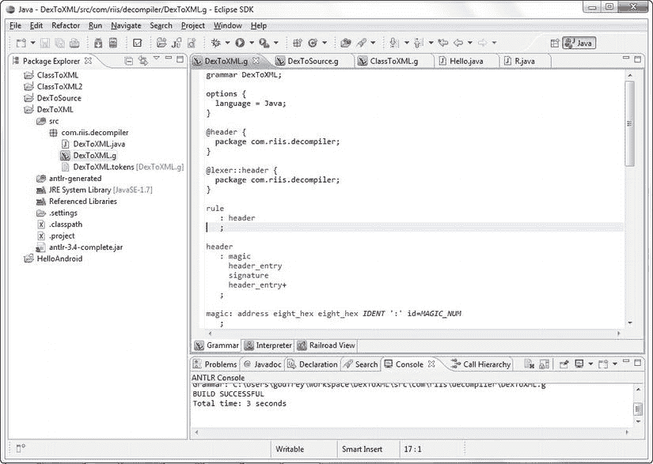
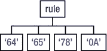
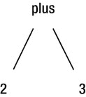

# 五、反编译器设计

接下来的两章关注如何创建反编译器，它实际上是一个交叉编译器，将字节码翻译成源代码。我介绍了相关设计决策背后的理论，但目的是提供足够的背景信息来帮助您入门，而不是给你一个完整的编译器理论章节。

不要期望你的反编译器 DexToSource 比目前市场上的任何东西都更全面或更好；说实话，它可能比 Jad 或 JD-GUI 更接近于 Mocha。和大多数事情一样，前 80-90%是最容易的，后 10-20%需要更长的时间来完成。但是 DexToSource 向您展示了如何编写一个简单的 Android 反编译器的基本步骤，它可以对您将遇到的大多数代码进行逆向工程。它也是第一个纯粹的`classes.dex`反编译器——其他的一切都需要你在反编译之前将`classes.dex`翻译成 Java 类文件。

我将在本章介绍 DexToSource 反编译器的总体设计，并在下一章深入探讨它的实现。我将向您展示如何反编译一些开源 apk，并展望 Android 反编译器、混淆器和字节码重排器的未来，以此来结束这本书。

后面两章的基调尽量实用；我尽量不要用太多的理论来烦你。这并不是说用无穷无尽的编译理论来充实这本书没有吸引力；只是关于这个主题的其他好书太多了。由阿尔弗雷德·艾侯、拉维·塞西和杰弗里·厄尔曼(普伦蒂斯霍尔出版社，2006 年)合著的《编译器:原理、技术和工具》( Compilers: Principles，Techniques，and Tools ),因其封面设计也被称为《龙书》,这只是迅速跃入脑海的一个较好的例子。安德鲁·阿佩尔的*Java 现代编译器实现*(剑桥大学出版社，2002 年)是另一本被极力推荐的书。我更喜欢查尔斯·菲舍尔和理查德·勒布朗(艾迪森·韦斯利，1991)的风格*用 C 语言制作编译器*。话虽如此，当有你需要了解的理论考虑时，我会在必要时讨论它们。

### 设计背后的理论

如前所述，编写反编译器与编写编译器或交叉编译器非常相似，因为两者都将数据从一种格式转换为另一种格式。反编译器和编译程序的本质区别在于它们的方向相反。在标准编译器中，源代码被转换为令牌，然后被解析和分析，最终生成二进制可执行文件。

碰巧的是，反编译是一个与编译非常相似的过程，但是在这种情况下，编译器的后端将中间符号改回源代码，而不是汇编代码。因为一个 Android `classes.dex`文件的二进制格式，可以快速将二进制转换成字节码；然后，您可以将字节码视为另一种语言，反编译器成为交叉编译器或源代码翻译器，将字节码转换为 Java。

大量的其他源代码翻译器在不同语言之间进行翻译:例如，从 COBOL 到 C，甚至从 Java 到 Ada 或 C，这给了你很多地方去寻找灵感。

如果您对操作码和字节码之间的区别感到困惑，那么*操作码*就是像`sget-object`这样的单个指令，后面可能会也可能不会跟着数据值或操作数。操作码和操作数统称为字节码。[最大 255]

### 定义问题

最简单地说，您试图解决的问题是如何将`classes.dex`转换成一系列对应 Java 源代码的文件。[清单 5-1](#list_5_1) 显示了来自前一章清单 4-15 的`Casting.java`源代码的`classes.dex`文件的反汇编版本的字节码。这些是你之前(字节码)和之后(`Casting.java`)的图片。

**清单 5-1。** *铸造字节码*

`const/4 v0,0` `const/16 v1,128
if-ge v0,v1,28
sget-object v1, field[2]
new-instance v2, type[6]
invoke-direct method[4], {v2}
const-string v3, string[20]
invoke-virtual method[7], {v2, v3}
move-result-object v2
invoke-virtual method[6], {v2, v0}
move-result-object v2
const-string v3, string[0]
invoke-virtual method[7], {v2, v3}
move-result-object v2
invoke-virtual method[5], {v2, v0}
move-result-object v2
invoke-virtual method[8], {v2}
move-result-object v2
invoke-virtual method[2], {v1,v2}
add-int/lit8 v0, v0, 1
int-to-char v0, v0
goto d7
return-void`

填写文件、字段和方法名称的整体结构看起来足够简单；您可以从 DexToXML 获得该信息。但是问题的实质是将操作码和操作数转换成 Java。您需要一个能够匹配这些操作码并将数据转换回 Java 源代码的解析器。您还需要能够镜像控制流和任何显式传输(注意`goto`语句)以及处理任何相应的标签。

操作码可以分为以下类型:

*   加载和保存指令
*   算术指令
*   类型转换指令
*   对象创建和操作
*   操作数堆栈管理指令
*   控制转移指令
*   方法调用和返回指令
*   处理异常
*   实施`finally`
*   同步

每个操作码都有一个定义好的行为，您可以在解析器中使用它来重新创建原始的 Java。Google 在`[www.netmite.com/android/mydroid/dalvik/docs/dalvik-bytecode.html](http://www.netmite.com/android/mydroid/dalvik/docs/dalvik-bytecode.html)`的“Dalvik VM 的字节码”很好地描述了 Dalvik 操作码，只能称之为 Technicolor 细节。您将在反编译器的语法中使用这些信息来创建一个解析器，它将把清单 5-1 中的操作码和操作数转换回原始源代码。

本章的目标是向你展示如何实现这一点。你的解析器的最基本的结构将类似于[图 5-1](#fig_5_1) 。

**图 5-1。** *DexToSource 解析器*

字节码的输入字符流需要分成一个令牌流(称为 lexer ),以便解析器进行分析。解析器使用这个令牌流，并根据解析器中定义的一系列规则输出 Java 源代码。

本章解释了如何创建词法分析器和语法分析器，并讨论了这种方法是否最有意义，以及如何对其进行调整以创建更健壮的东西。首先，下一节将讨论可以帮助你创建图 5-1 的词法分析器和语法分析器的编译器工具，而不是手工构建。

### (反)编译工具

在编写你的反编译器之前，你需要做一些选择。您可以手工编写整个反编译器，就像对几个 Java 反编译器所做的那样；或者你可以看看有助于使工作更容易编码的工具。这些工具被称为*编译器-编译器*，它们被定义为帮助创建解析器、解释器或编译器的任何工具。这是我在这里概述的方法，主要关注以下工具:

*   法律
*   Yacc
*   JLex 吗
*   杯子
*   安特卫普

这些工具中最常见的是 Lex 和 Yacc(又一个编译器-编译器)。这种编译器-编译器工具可以用来扫描和解析字节码，并且已经被许多开发人员用于更复杂的任务。Lex 和 Yacc 操作文本输入文件。Lex 输入文件定义如何使用模式匹配对输入字符流进行标记化。Yacc 输入文件由一系列令牌的产生规则组成。这些定义了语法，相应的动作生成一个用户定义的输出。

Lex 和 Yacc 中定义的标记化规则和模式匹配规则用于生成典型的 C 文件，然后编译这些文件，并用于将输入文件转换成所需的目标输出。出于您的目的，编译器-编译器工具将生成 Java 文件，而不是 C 文件，这些文件将成为您的反编译器引擎的源代码。

使用编译器-编译器工具有两个主要原因。首先，这些工具极大地减少了代码行数，这使得读者更容易理解概念。其次，使用这样的工具可以将开发时间缩短一半。

不利的一面是，生成的代码一旦编译，可能比手工制作编译器前端要慢得多。但是让代码易于理解是这本书的先决条件——没有人想阅读大量的代码来理解正在发生的事情。所以，这本书使用了 Lex 和 Yacc 的一个版本或衍生版本。

无数的选择都基于 Lex 和 Yacc。如果你选择 Java 作为目标输出语言，那么你的选择是 JLex 或者 JFlex 和 CUP(构建有用的解析器)或者 BYACC/J 作为经典的 Lex 和 YACC 变体。然后是另一个语言识别工具(ANTLR，`[www.antlr.org](http://www.antlr.org))`)，编译器-编译器工具，以前被称为 PCCTS，和 JavaCC ( `[http://javacc.java.net](http://javacc.java.net)),`，它们将词法分析器和语法分析器步骤合并到一个文件中。

#### Lex 和 Yacc

Lex 和 Yacc 一起工作。Lex 将传入流解析成标记，Yacc 解析这些标记并生成输出。Lex 和 Yacc 是 Unix 命令行工具，大多数 Unix 和 Linux 版本都有，尽管奇怪的是 Mac OSs 上没有。

Lex 使用正则表达式将传入的流分解成标记，Yacc 尝试使用 shift/reduce 机制将这些标记与许多产生式规则进行匹配。大多数产生式规则都与一个动作相关联，在本例中，正是这些上下文相关的动作输出 Java 源代码。

令牌也被称为*终端*。生产规则由单个*非终结*标识。每个非终端由一系列终端和其他非终端组成。大多数人使用的一个类比是将终端(令牌)视为树叶，将非终端视为树上的树枝。

Yacc 是一个自底向上的 LALR(1)解析器。*自底向上*意味着你从树叶开始构建解析树，而*自顶向下*解析器试图从根开始构建树。LALR(1)意味着这种类型的解析器使用最右边的派生从左到右(LA **LR** (1))处理扫描器 Lex 提供的令牌，并且可以提前一个令牌( **LA** LR( **1** ))。LR 解析器也称为*预测*解析器，LALR 是合并两个 LR 集合的结果，这两个 LR 集合的项目除了前瞻集合之外都是相同的。它非常类似于 LR(1)解析器，但是 LALR(1)解析器通常要小得多，因为前瞻标记有助于减少可能的模式数量。

LALR(1)解析器生成器是其他计算领域事实上的标准。但是 Java 解析器更有可能属于 LL(k)类。LL(k)解析器是自上而下的解析器，使用最左边的派生(LL(k))从左到右(LL(k))扫描——这是自上而下的来源——并向前看 *k* 标记。

许多标准的编译器构造书籍都大量使用 Lex 和 Yacc，而不是任何其他 LL(k)替代方案。参见`[http://dinosaur.compilertools.net/](http://dinosaur.compilertools.net/)`了解更多信息和一些优秀资源的链接。

新泽西美国电话电报公司·贝尔实验室的斯蒂芬·约翰森编写了 Yacc 的原始版本。自从 20 世纪 80 年代早期的 Berkeley 以来，Lex 和 Yacc 以及 Sed 和 Awk 已经包含在每个 Unix 实现中。Sed 和 Awk 通常用于简单的命令行解析工具，而 Lex 和 Yacc 则用于复杂的解析器。Unix 系统管理员和开发人员通常会不时地使用这些工具中的一些或全部来将输入文件转换或翻译成其他格式。如今，Perl、Python 和 Ruby 已经在很大程度上取代了这些工具，而 Lex 和 Yacc 只被保留用于最困难的任务(如果它们被使用的话)。

Lex 和 Yacc 被复制了很多次，在很多平台上都有。Windows 上有商业和公共领域的变体——例如，来自 MKS 和 GNU (Flex/Bison)的变体。

许多商业编译器都是围绕 Lex 和 Yacc 构建的，这是值得怀疑的，因为它们功能有限，不能处理某些编程语言的古怪方面。例如，Fortran 是标记化的噩梦，因为(除了别的以外)它忽略了空白。

#### JLex 和 CUP 示例

Lex 和 Yacc 生成 C 代码，而 JLex 和 CUP 是生成 Java 代码的 Lex 和 Yacc 的版本。Elliot Berk 最初在普林斯顿大学开发 JLexJLex 也由 Andrew Appel(也在普林斯顿)维护，他是《Java/ML/C 的现代编译器》(剑桥大学出版社，2002 年)的作者；斯科特·阿纳尼安是“每个孩子一台笔记本电脑”的负责人。

像所有版本的 Lex 一样，JLex 允许您使用正则表达式来分解输入流并将其转换为令牌。它可以与 CUP 结合使用来定义语法，但是首先让我们单独使用 JLex 作为一个简单的扫描器。

Lex，不管是运行在 Unix 还是 DOS 上，用 C 还是用 Java，都是一种预处理语言，把规范或者规则转换成目标语言。在运行 Lex 程序后，C 语言规范变成了`lex.yy.c`，而 Java 规范变成了`filename.lex.java`。然后需要像编译任何其他 C 或 Java 程序一样编译代码输出。Lex 通常与 Yacc 一起使用，但是它也可以单独用于简单的任务，比如从源代码中删除注释。如果您需要为程序附加任何逻辑，您几乎肯定需要将它连接到某种解析器，比如 Yacc，或者在本例中是 CUP。

前面，这一章提到 Lex 和 Yacc 已经被 Unix 社区的编译器开发人员使用了很多年。如果你习惯于 Lex，JLex 在很多方面确实不同。让我们仔细看看。

##### JLex 吗

JLex 文件分为三个部分:

*   用户代码
*   JLex 准则
*   正则表达式规则

尽管结构(如后面的清单 5-3 所示)不同于通常使用 C 而不是 Java 编译的 Lex 的 Unix 版本，并且定义和宏也非常不同，幸运的是正则表达式规则使用标准的正则表达式。因此，如果你熟悉 Lex，甚至 vi 或 Perl，你似乎不会偏离熟悉的领域太远。如果你以前没有遇到过正则表达式，那么 JLex 手册 ( `[www.cs.princeton.edu/~appel/modern/java/JLex/current/manual.html](http://www.cs.princeton.edu/~appel/modern/java/JLex/current/manual.html)`)是一个很好的起点。

第一个`%%`之前的一切都是用户代码。它被“原样”复制到生成的 Java 文件中。通常，这是一系列的`import`语句。因为您将 JLex 与 CUP 结合使用，所以您的用户代码由以下内容组成:

`import java_cup.runtime.Symbol;`

接下来是指令部分，从第一个`%%`开始，以另一个`%%`结束。这一系列指令或标志告诉 JLex 如何操作。例如，如果您使用`%notunix`操作系统兼容性指令，那么 JLex 希望换行符由`\r\n`表示，而不是像在 Unix 世界中那样由`\n`表示。下面列出的其余指令允许您将自己的代码输入到生成文件的各个部分，或者更改生成的 lex 类、函数或类型的默认名称(例如，从`yylex`到`scanner`):

*   内部代码
*   初始化类别代码
*   文件类结尾
*   宏定义
*   国家声明
*   字符计数
*   行计数
*   Java CUP 兼容性
*   组件标题
*   默认令牌类型
*   文件结尾
*   操作系统兼容性
*   字符集
*   文件格式
*   例外代码
*   文件结束返回值
*   要实现的接口
*   公开生成的类

这个例子只对一些指令感兴趣，比如`%cup` (CUP 兼容性)指令。出于您的目的，指令部分就像清单 5-2 一样简单。

**清单 5-2。** *JLex 指令*

`%%

%cup

digit = [0-9]
whitespace = [\ \t\n\r]
%%`

正则表达式部分是真正扫描的地方。规则是正则表达式的集合，它将传入流分解成标记，以便解析器完成其工作。作为一个简单的例子，清单 5-3 将行号添加到任何从命令行输入的文件中。

**清单 5-3。** *给文件添加行号的 JLex 扫描仪*

`import java.io.IOException; // include the import
statement in the generated scanner

%% // start of the directives

%public // define the class as
public
%notunix // example is running on
Windows
%class Num // rename the class to
Num

%type void // Yytoken return type is
void
%eofval{ // Java code for execution at
end-of-file
return;
%eofval}

%line // turn line counting on

%{ // internal code to add to the
scanner
// to make it a standalone
scanner
public static void main (String args []) throws IO Exception{`  `new Num(System.in).yylex();
}
%}

%% // regular expressions section
^\r\n {
System.out.println((yyline+1)); }
\r\n { ; }
\n { System.out.println(); }
.*$ { System.out.println((yyline+1)+"\t"+yytext()); }`

通过从`[www.cs.princeton.edu/~appel/modern/java/JLex/](http://www.cs.princeton.edu/~appel/modern/java/JLex/)`获取`Main.java`的副本来安装 JLex。将其复制到一个名为`JLex`的目录中，并使用您喜欢的 Java 编译器进行编译。保存`Num.lex`文件(见[清单 5s-3](#list_5_3) )，删除所有注释，编译如下:

`java JLex.Main Num.lex
mv Num.lex.java Num.java
javac Num.java`

现在，您可以通过键入以下内容向文件中添加行号

`java Num < Num.java > Num_withlineno.java`

通常，在扫描器/解析器组合中，扫描器作为解析器的输入。在第一个例子中，您甚至没有生成一个令牌，所以没有什么要传递给 CUP，您的 Java 解析器。Lex 生成一个`yylex()`函数，该函数吃掉令牌并将它们传递给由 Yacc 生成的`yyparse()`。您将把这些函数或方法重命名为`scanner()`和`parse()`，但想法是一样的。

##### 杯子

CUP 是一个 Yacc 解析器，最接近 LALR(1)(左-右前瞻)解析器。它是为 Java 语言编写的众多 Yacc 解析器生成器之一；BYACC 和吉尔是另外两个例子。如果您更喜欢 LL 解析器，不想使用 LALR 语法，那么您可能想看看 ANTLR 或 JavaCC。

如前所述，Yacc 允许您定义语法规则来解析传入的词法标记，并按照您的语法生成所需的输出。CUP 是 Yacc 的公共域 Java 变体，由于 Java 的可移植性，它可以在任何具有 JVM 和 JDK 的机器上编译。

请注意:CUP 并不具有与为任何 C 编译器编写的 Yacc 语法完全相同的功能或格式，但是它的行为方式有点类似。CUP 可以在任何支持 JDK 的操作系统上编译。

要安装 CUP，请从`[http://www2.cs.tum.edu/projects/cup/](http://www2.cs.tum.edu/projects/cup/)`复制源文件。通过在 CUP 根目录中键入以下命令进行编译:

`javac java_cup/*java java_cup/runtime/*.java`

CUP 文件由以下四部分组成:

*   序言或声明
*   用户例程
*   符号或记号列表
*   语法规则

声明部分由一系列 Java `package`和`import`语句组成，这些语句根据您想要导入的其他包或类而变化。假设 CUP 类位于您的类路径中，添加以下代码行以包含 CUP 类:

`import java_cup.runtime*;`

所有其他导入或包引用都是可选的。一个`start`声明告诉解析器在哪里寻找开始规则，如果你想让它从其他解析器规则开始。默认情况下是使用顶级产生式规则，所以在大多数语法中，您会遇到开始规则是冗余信息。

CUP 中允许四种可能的用户例程:`action`和`parser`用于插入新代码和覆盖默认的扫描器代码和变量，`init`用于任何解析器初始化，`scan`由解析器用于调用下一个令牌。所有这些用户程序都是可选的(见[清单 5-4](#list_5_4) )。

**清单 5-4。** *杯赛用户套路*

`action code {:
// allows code to be included in the parser class
public int max_narrow = 10;
public double narrow_eps = 0.0001;
:};

parser code {:
// allows methods and variables to be placed
// into the generated parser class
public void report_error(String message, Token tok) {
errorMsg.error(tok.left, message);
}` `:};

// Preliminaries to set up and use the scanner.
init with {: scanner.init(); :};
scan with {: return scanner.yylex(); :};`

`init`和`scan`都是常用的，即使只是把扫描器/lexer 的名字改成比`Yylex()`更有意义的名字。在请求第一个令牌之前，执行`init`中的任何程序。

大多数解析器都在语法部分定义了一系列动作。CUP 将所有这些动作放在一个类文件中。action 用户例程允许您定义变量和添加额外的代码，例如符号表操作例程，它们可以在非公共 action 类中引用。解析器例程用于向生成的解析器类添加额外的代码——除非为了更好地处理错误，否则不要期望经常使用它们。

CUP 和原来的 Yacc 一样，作用就像一个栈机。每次读取一个令牌时，它都被转换成一个符号，并放置或转移到堆栈上。这些标记在符号部分中定义。

未归约的符号称为*终结*符号，归约为某种规则或表达式的符号称为*非终结*符号。换句话说，终结符是 JLex 扫描器使用的符号/记号，非终结符是终结符在满足语法部分中的某个模式或规则后变成的。[清单 5-5](#list_5_5) 展示了一个终端和非终端令牌的好例子。

符号可以具有相关联的整数、浮点或字符串值，这些值沿着语法规则向上传播，直到该组记号满足规则并且可以被减少，或者如果没有规则被满足，则使解析器崩溃。

**清单 5-5。**T3`Parser.CUP`T4】

`import java_cup.runtime.*;

// Interface to scanner generated by JLex.
parser code {:
Parser(Scanner s) { super(); scanner = s; }
private Scanner scanner;
:};
scan with {: return scanner.yylex(); :};

terminal NUMBER, BIPUSH, NEWARRAY, INT, ASTORE_1, ICONST_1;
terminal ISTORE_2, GOTO, ALOAD_1, ILOAD_2, ISUB, IMUL;
terminal IASTORE, IINC, IF_ICMPLE, RETURN, END;

non terminal function, functions, keyword;` `non terminal number;

functions ::= function
| functions function
;

function ::= number keyword number number END
| number keyword number END
| number keyword keyword END
| number keyword END
| END
;

keyword ::= BIPUSH
| NEWARRAY
| INT
| ASTORE_1
| ICONST_1
| ISTORE_2
| GOTO
| ALOAD_1
| ILOAD_2
| ISUB
| IMUL
| IASTORE
| IINC
| IF_ICMPLE
| RETURN
;

number ::= NUMBER
;`

解析器的功能取决于它解释输入标记流并将这些标记转换成语言语法所定义的期望输出的能力。为了让解析器有任何成功的机会，它需要在任何移位/归约循环发生之前知道每个符号及其类型。这个符号表是根据上一节中的符号列表生成的。

符号表中的端子列表被 CUP 用来生成自己的 Java 符号表(`Sym.java`)，需要导入到 JLex 扫描器中，供 JLex 和 CUP 协同工作。

如前所述，CUP 是一个 LALR(1)机器，这意味着它可以预测一个令牌或符号，以尝试满足语法规则。如果满足产生式规则，则符号从堆栈中弹出，并用产生式规则减少。每个解析器的目的都是将这些输入符号转换成一系列简化的符号，回到起始符号或记号。

通俗地说，给定一串记号和一些规则，目标是通过从输入字符串开始，向后工作到开始符号，反向追踪最右边的派生。使用自底向上的解析将一系列非终结符减少为一个终结符。所有输入符号都是终结符，随后使用这种移位/归约原理将其组合成非终结符或其他中间终结符。当每组符号都与一个产生式规则相匹配时，它最终会启动一个动作，该动作会生成在产生式规则动作中定义的某种输出。

清单 5-5 中的解析器解析来自清单 5-6 中[所示的主方法字节码的输入。相应的扫描仪如](#list_5_6)[清单 5-7](#list_5_7) 所示。为了尽可能简单，它不产生任何输出。

**清单 5-6。** *主方法字节码*

`0 getstatic #7 <Field java.io.PrintStream out>
3 ldc #1 <String "Hello World">
5 invokevirtual #8 <Method void println(java.lang.String)>
8 return`

**清单 5-7。**T3`Decompiler.lex`T4】

`package Decompiler; // create a package for
the Decompiler
import java_cup.runtime.Symbol; // import the CUP
classes

%%
%cup // CUP declaration
%%

"getstatic" { return new Symbol(sym.GETSTATIC, yytext());
}
"ldc" { return new Symbol(sym.LDC, yytext()); }
"invokevirtual" { return new Symbol(sym.INVOKEVIRTUAL,
yytext()); }
"Method" { return new Symbol(sym.METHOD, yytext()); }
"return" { return new Symbol(sym.RETURN, yytext()); }
\"[a-zA-Z ]+\" { return new Symbol(sym.BRSTRING,
yytext()); }
[a-zA-Z\.]+ { return new Symbol(sym.BRSTRING, yytext()); }
\< { return new Symbol(sym.LABR, yytext()); }
\> { return new Symbol(sym.RABR, yytext()); }
\( { return new Symbol(sym.LBR, yytext()); }
\) { return new Symbol(sym.RBR, yytext()); }` `\#[0-9]+|[0-9]+ { return new Symbol(sym.NUMBER,
yytext());}
[ \t\r\n\f] { /* ignore white space. */ }
. { System.err.println("Illegal character:
"+yytext()); }`

在某些情况下，输入标记或中间符号可能满足多个产生式规则:这被称为*模糊语法*。symbol 部分中的关键字`precedence`允许解析器决定哪个符号具有更高的优先级——例如，让乘法和除法符号优先于加法和减法符号。

值得一提的是，CUP 允许您出于调试目的转储移位/归约表。生成符号和语法、解析状态机和解析表的可读转储并向显示完整转换的命令如下(一些输出显示在[清单 5-8](#list_5_8) 中):

`java java_cup.Main -dump < Parser.CUP`

**清单 5-8。** *偏杯调试输出*

`-------- ACTION_TABLE --------
From state #0
[term 2:SHIFT(to state 2)] [term 18:SHIFT(to state 5)]
From state #1
[term 0:REDUCE(with prod 0)] [term 2:REDUCE(with prod 0)]
[term 18:REDUCE(with prod 0)]
From state #2
[term 2:REDUCE(with prod 23)] [term 3:REDUCE(with prod 23)]
[term 4:REDUCE(with prod 23)] [term 5:REDUCE(with prod 23)]
[term 6:REDUCE(with prod 23)] [term 7:REDUCE(with prod 23)]
[term 8:REDUCE(with prod 23)] [term 9:REDUCE(with prod 23)]
[term 10:REDUCE(with prod 23)] [term 11:REDUCE(with prod 23)]
[term 12:REDUCE(with prod 23)] [term 13:REDUCE(with prod 23)]
[term 14:REDUCE(with prod 23)] [term 15:REDUCE(with prod 23)]
[term 16:REDUCE(with prod 23)] [term 17:REDUCE(with prod 23)]
[term 18:REDUCE(with prod 23)]
From state #3
[term 3:SHIFT(to state 13)] [term 4:SHIFT(to state 14)]
[term 5:SHIFT(to state 8)] [term 6:SHIFT(to state 18)]
[term 7:SHIFT(to state 11)] [term 8:SHIFT(to state 10)]
[term 9:SHIFT(to state 23)] [term 10:SHIFT(to state 12)]
[term 11:SHIFT(to state 17)] [term 12:SHIFT(to state 15)]
[term 13:SHIFT(to state 20)] [term 14:SHIFT(to state 9)]
[term 15:SHIFT(to state 19)] [term 16:SHIFT(to state 22)]
[term 17:SHIFT(to state 21)]
From state #4
[term 0:SHIFT(to state 7)] [term 2:SHIFT(to state 2)]
[term 18:SHIFT(to state 5)]
From state #5
[term 0:REDUCE(with prod 7)] [term 2:REDUCE(with prod 7)]
[term 18:REDUCE(with prod 7)]
From state #6
[term 0:REDUCE(with prod 2)] [term 2:REDUCE(with prod 2)]
[term 18:REDUCE(with prod 2)]
From state #7
[term 0:REDUCE(with prod 1)]`

#### 反 LR

ANTLR 代表另一种语言识别工具。它可以在`[www.antlr.org](http://www.antlr.org)`下载。ANTLR 是递归下降，LL(k)，或自顶向下的解析器，而 Yacc 是 LR 或自底向上的解析器。ANTLR 从最上面的规则开始，试图识别标记，向外工作到叶子；Yacc 从树叶开始，一直到最高规则。

ANTLR 与 JLex 和 CUP 的根本区别还在于，lexer 和解析器在同一个文件中。创建标记的词法规则都是大写的(例如，`IDENT`)，标记解析规则都是小写的(例如，`program`)。

下一个例子使用 ANTLR v3，它完全重写了 ANTLR v2。v3 还包括一些非常有用的附加功能，比如从解析器中提取输出语句的`StringTemplate`。

图 5-2 显示了 ANTLR 与 Eclipse IDE 的集成。Scott Stanchfield 有一些在 Eclipse 中设置 ANTLR 和在`[http://vimeo.com/groups/29150](http://vimeo.com/groups/29150)`创建解析器的优秀视频。这是最好的 ANTLR 资源之一，无论您是否使用 Eclipse 作为您的 IDE。如果你不想使用 Eclipse，ANTLRWorks 是一个很好的选择。

**图 5-2。***Eclipse 的 ANTLR 插件*

ANTLR 背后的主要力量特伦斯·帕尔(Terence Parr)也出版了两本关于 ANTLR 的书:*权威的 ANTLR 参考文献*(语用书架，2007)和*语言实现模式*(语用书架，2010)。

##### ANTLR 示例

DexToXML 是第三章中的[解析器。DexToXML 完全用 ANTLR v3 编写；在这里，它解析 dedexer 输出并将文本转换成 XML。](03.html)

DexToXML 解析十六进制数字的方式是一个简单的例子，说明如何将 ANTLR 语法文件放在一起。dedexer 输出的第一行显示了来自`classes.dex`文件的幻数标题行:

`00000000 : 64 65 78 0A 30 33 35 00 magic: dex\n035\0`

与大多数其他解析器一样，ANTLR 在其词法分析器中使用正则表达式(regex)。lexer 将输入流分解成标记，然后由解析器中的规则使用。您可以使用以下正则表达式来识别 ANTLR 语法中的十六进制数字对:

`HEX_DIGIT
: ('0'..'9'|'a'..'f'|'A'..'F')('0'..'9'|'a'..'f'|'A'..'F') ;`

与 Lex 和 Yacc 不同，在 ANTLR 中，lexer 和 parser 在同一个文件中(见[清单 5-9](#list_5_9) )。词法分析器使用大写规则，解析器使用小写规则。

**清单 5-9。**T3`DexToXML.g`T4】

`grammar DexToXML;
options {
language = Java;
}
@header {
package com.riis.decompiler;
}
@lexer::header {
package com.riis.decompiler;
}
rule: HEX_PAIR+;

HEX_PAIR :
('0'..'9'|'a'..'f'|'A'..'F')('0'..'9'|'a'..'f'|'A'..'F') ;
WS : ' '+ {$channel = HIDDEN;};`

每个 ANTLR 解析器都有许多部分。最基本的是，`grammar`部分定义了解析器的名称。生成的 ANTLR 解析器的输出语言在`options`部分设置为 Java，解析器和词法分析器的包名在`@header`和`@lexer::header`部分设置。接下来是解析器和词法分析器规则。lexer 识别由两个十六进制数字组成的组，规则识别多组十六进制数字对。任何空白都被`WS`规则忽略，并被放置在一个隐藏的通道上。

比如，假设你通过了`64 65 78 0A`。图 5-3 展示了解析器看到的东西。

**图 5-3。** *解析成对的十六进制数字*

### 策略:决定您的解析器设计

ANTLR 被彻底改写，继续发展；它还有许多额外的功能，比如 ANTLRWorks 工具和 Eclipse 插件，这些功能使调试解析器成为一种享受。如您所见，调试 Yacc 输出不适合胆小的人。

因此，您将使用 ANTLR v3 构建解析器。这样做有很多好处:

*   词法分析器和语法分析器在同一个文件中
*   的功能从解析器中提取输出功能
*   ANTLRWorks 工具允许您调试解析器
*   大量的解析器模式可供使用
*   简单的 AST 集成
*   Eclipse 集成

在图 5-1 的[中，将`StringTemplate` s 和 AST 添加到原始设计中，产生了一个新的解析器设计，如图 5-4](#fig_5_1) 的[所示。](#fig_5_4)

**图 5-4。** *最终反编译器设计*

`StringTemplate` s 意味着不再需要解析器中无休止的`System.out.println`语句来输出 Java 代码。从程序员的角度来看，过去当我设计解析器时，那些`println`总是困扰着我。他们有一股难闻的代码味。允许你从产生输出的逻辑中分离出输出。仅此一点就足以成为选择 ANTLR 而不是 JLex 和 CUP 的理由，因为它极大地增强了您理解解析器语法如何工作的能力。这也是解析器被称为 DexToSource 而不是 DexToJava 的另一个原因:您可以编写自己的模板，通过重定向模板以用不同的语言编写输出，来输出 C#或 C++。

为了简单起见，您可以使用 Android toolkit 中的一个反汇编器，如 DexToXML、baksmali、dedexer 或 dx，以字符流的形式提供字节码，而不是让您的反编译器解析二进制文件。然后您的 ANTLR 解析器会将字节码文件转换成 Java 源代码。

构建一个反编译器的一个重要问题是使它足够通用以处理任意的情况。当 Mocha 遇到一个意想不到的语言习惯用法时，它要么中止，要么抛出非法的`goto`语句。理想情况下，你应该能够编写一个通用解决方案的反编译器，而不是一个只不过是一系列标准例程和大量异常情况的程序。您不希望 DexToSource 在任何构造上失败，因此通用解决方案非常有吸引力。

但是，在采用这种方法之前，您需要知道它是否有任何缺点，以及您是否会以输出看起来一点也不像原始源代码的难以辨认的代码为代价来获得更好的解决方案。或者，更糟糕的是，到达那里会花费过多的时间吗？您可以用一个程序计数器和一个单独的`while`循环替换程序中的所有控制结构，但是这将破坏映射——并且失去结构或语法的等价性肯定不是您的目标，即使这是一个通用的解决方案。

从我的讨论中，你知道不像在其他语言中，你没有分离数据和指令的麻烦，因为所有的数据都在`data`部分。本章的剩余部分和下一章也显示了恢复源代码级表达式是相对容易的。因此，看起来您的主要问题和您使用的任何相应策略主要涉及处理字节码的控制流。

这里的重点是更简单的方法，其中高层结构是硬编码的，因为它非常适合我已经讨论过的解析器方法。但是本章还介绍了一些高级策略，其中反编译器从字节码中的一系列`goto`语句中推断出所有复杂的高级结构。

本节着眼于几种不同的策略，您可以使用它们来克服从类似于`goto`的原语合成高级控制结构的问题。正如我所说，一个理想的通用解决方案将让你反编译每一个可能的`if` - `then` - `else`或`for`循环组合，而不需要任何异常情况，同时保持源代码尽可能接近原始代码。另一种方法是尝试预测所有高级控制习惯用法。

你可能想知道为什么你需要一个策略——为什么你不能在 ANTLR 中建立一个语法，然后看看另一边会出现什么？不幸的是，解析器只能识别顺序指令序列。因此，您可能无法一次解析所有的 Dalvik 指令，因为字节码有可怕的分支习惯。寄存器被用作临时存储区域，当代码分支时，您需要能够控制部分序列会发生什么。ANTLR 本身不提供这种级别的功能，所以您需要弄清楚需要采取什么方法来存储这些部分识别的序列。

#### 选择一个

第一种选择是使用基于克里斯蒂娜·希福恩特斯和 k .约翰·高夫的工作的技术，这些技术在论文“反编译的方法学”中有描述，可从`[www.itee.uq.edu.au/~cristina/clei1.ps](http://www.itee.uq.edu.au/~cristina/clei1.ps)`获得。本文描述了英特尔机器上希福恩特斯的 C 程序反编译器`dcc`。虽然`dcc`恢复的是 C 语言而不是 Java 代码，但是这个通用反编译器的大量讨论和设计直接适用于手头的任务。

#### 选择二

第二种选择更一般——将`goto`语句转换成等价的形式。如果您可以在`classes.dex`文件上启动 ANTLR 扫描器和解析器，并一次性反编译代码，或者至少免除任何控制流分析，那就简单多了。这正是托德·普罗伯斯汀和斯科特·沃特森在他们的论文“喀拉喀托火山:Java 中的反编译”中试图做的事情，该论文可在`[www.usenix.org/publications/library/proceedings/coots97/full_papers/proebsting2/proebsting2.pdf](http://www.usenix.org/publications/library/proceedings/coots97/full_papers/proebsting2/proebsting2.pdf)`获得。

Krakatoa 是一个早期的反编译器，现在是 Sumatra/Toba 项目的一部分，它使用 Ramshaw 算法将`goto`转换成循环和多级中断。它声称提供了一个简洁的一次性解决方案，同时仍然保持原来的结构。喀拉喀托方法很有吸引力，因为它不太可能因为控制流分析问题而失败。

#### 选择三

第三个选择来自 IBM Research 的 Daniel Ford，他可能是第一个反编译器 Jive 的一部分——我相信 IBM Research 从来没有推出过 Jive。在他的论文“Jive: A Java Decompiler”中，Ford 提出了一个真正的多通道反编译器，它“将解析状态信息与正在解析的机器指令序列集成在一起。”Jive 通过减少令牌来进行反编译，因为每一次连续的传递都会获得越来越多的信息。

#### 选择四

最后一个选择是使用抽象语法树(AST)的概念来帮助您概括您的反编译器。您可以将标记的含义抽象到一个 AST 中，而不是使用单遍解析器；然后第二个解析器用 Java 源代码写出标记。[图 5-5](#fig_5_5) 显示了(2+3)的 AST。你可以用许多不同的方式输出这个，如清单 5-10 中的[所示。](#list_5_10)

**图 5-5。***【2+3 之 AST】*

**清单 5-10。** *图 5-3* 中[AST 的可能输出](#fig_5_3)

`2 + 3
(2 3 +)
bipush 2
bipush 3
iadd`

清单 5-10 中的例子用标准数学符号、逆向波兰符号或后缀符号，最后用 Java 字节码来表达 AST。所有的输出都是同一个 AST 的表示，但是它们没有任何输出语言实现。类似于`StringTemplate` s，但是在更高的层次上，输出与解析分离，给你一个更简洁或者更抽象的表示，来表示你试图在解析器中建模的内容。

### 解析器设计

理解对话和编译器生成机器代码之间的主要区别在于，编译器需要更少的关键字和规则来产生计算机可以理解的输出——这被称为其*本机格式*。如果编译计算机程序是理解人类语言的一个更小的子集，那么反编译 Dalvik 字节码是一个更小的子集。

关键字的数量和有限的语法规则允许您轻松地对输入进行标记，然后将标记解析成 Java 短语。将它转换回代码需要一些进一步的分析，但是我稍后会谈到。您需要将输入数据流转换成令牌。[清单 5-10](#list_5_10) 显示了来自`Casting.java`文件的一些 Dalvik 字节码。

**清单 5-10。** *`Casting.smali`法*

`sget-object v1, field[2]
new-instance v2, type[6]
invoke-direct method[4], {v2}
const-string v3, string[20]
invoke-virtual method[7], {v2, v3}`

查看字节码，您会发现令牌可以分为以下类型:

*   *标识符:*通常，引用采用`{v1}`或`{v2}`的形式。
*   *整数:*通常是操作码后面的数据或数字，组成一个完整的字节码语句。一个很好的例子是放在栈上的数字或者一个`goto`语句的标签，比如`goto_1`。
*   *关键词:*组成字节码语言的大约 200 个操作码。你可以在[第六章](06.html)中看到这些和它们的构造。
*   *空白:*包括制表符、空格、换行符和回车符，如果你使用的是 DOS 或 Windows 的话。大多数反编译器在真实的`classes.dex`中不会遇到很多空白，但是你需要在 Dalvik 字节码中处理它

所有这些标记对于解析器能够完成其工作并尝试将它们与预定义的语法规则匹配是至关重要的。

反编译器的设计如图[图 5-4](#fig_5_4) 所示。一切都从字节码文件或字符流开始。ANTLR 将其解析成一个令牌流，该令牌流被转换成一个 AST。AST 由第二个解析器解析，该解析器将抽象表示转换成 Java 使用`StringTemplate`库编写的模板将令牌输出到 Java 文本中。

### 总结

到目前为止，我已经讨论了可以帮助您创建一个有效的反编译器的工具。你已经看到了你可以选择采用的不同策略。我已经包含了我们设计的替代方案，以防您想采用其他选项中的一个并自己运行它。如果你更喜欢 Lex 和 Yacc，那么你可能会想用 JLex 和 CUP 而不是 ANTLR。个人认为 JLex 和 CUP 近几年变化不大，这也是我现在推荐 ANTLR 的原因。现在您需要实现一个反编译器设计。下一章结束时，你将拥有一个可以处理简单文件的反编译器。[第 6 章](06.html)着眼于各种内部结构，逐步创建一个比`Casting.java`例子处理能力更强的更有效的反编译器。